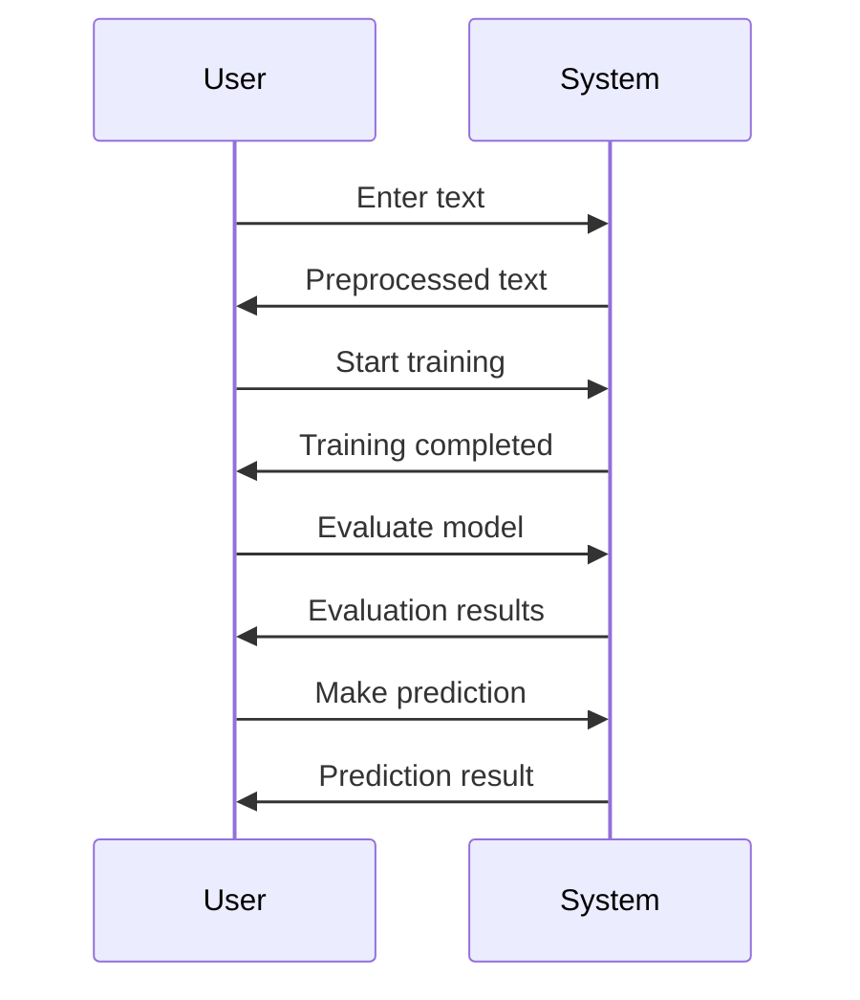
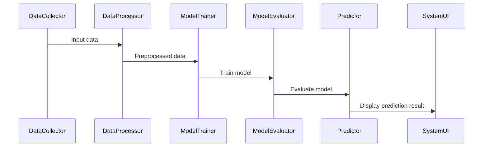
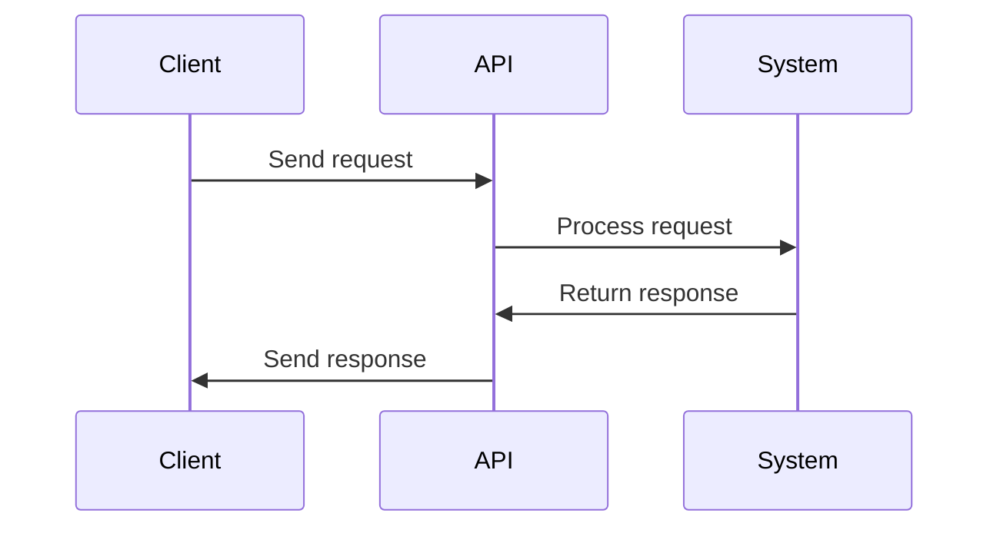

                 


### 标题：《Zero-Shot CoT在危机管理中的应用》

#### 关键词：零样本核心论点（CoT）、危机管理、人工智能、系统架构、自然灾害预警、公共卫生事件响应、社会安全事件应对

#### 摘要：

本文将深入探讨零样本核心论点（Zero-Shot Core Tokenization，简称CoT）在危机管理中的应用。危机管理涉及自然灾害、公共卫生事件、社会安全事件等多种情况，这些事件往往具有突发性、复杂性和严重性。本文将详细解析CoT技术的原理，展示其在危机管理中的独特优势，并通过实际案例，探讨如何利用CoT技术提升危机管理的效率与效果。

----------------------------------------------------------------

## 第一部分：危机管理的背景与现状

### 第1章：危机管理概述

#### 1.1 问题背景

##### 1.1.1 危机的概念与类型

危机通常指的是一种不确定的、可能对组织、社会或个人造成严重影响的紧急情况。危机可以划分为自然灾害（如地震、洪水）、公共卫生事件（如传染病爆发）、社会安全事件（如恐怖袭击）等类型。

##### 1.1.2 危机管理的意义与目标

危机管理的意义在于通过预防和应对措施，减轻危机带来的损失，保障人民的生命财产安全，维护社会稳定。危机管理的目标包括预警、响应、恢复和重建。

##### 1.1.3 危机管理的现状与挑战

当前，危机管理已逐渐形成一套体系，但仍面临诸多挑战，如信息不对称、应急资源不足、响应时间滞后等。现代技术的进步，特别是人工智能技术的应用，为危机管理带来了新的机遇。

### 1.2 核心概念与联系

#### 1.2.1 危机管理的核心概念

危机管理涉及多个核心概念，包括预警系统、应急响应机制、灾害评估、救援行动等。这些概念相互关联，共同构成了危机管理的整体框架。

##### 1.2.2 核心概念属性特征对比

以下是一个核心概念属性特征对比的表格：

| 核心概念   | 属性特征               | 特点对比 |
| --------- | ---------------------- | -------- |
| 预警系统   | 信息收集、预测模型、报警机制 | 快速响应 |
| 应急响应机制 | 救援队伍组织、物资调配、通讯保障 | 高效协作 |
| 灾害评估   | 灾情监测、损失评估、重建规划 | 精准分析 |
| 救援行动   | 救援物资、人员调度、现场指挥 | 及时行动 |

##### 1.2.3 ER实体关系图架构

以下是危机管理中的ER实体关系图架构：

```mermaid
erDiagram
  User ||--|{ Alert }|-- EmergencyResponse
  Alert ||--|{ Disaster }|-- RescueOperation
  Disaster ||--|{ Evaluation }|-- RecoveryPlan
```

----------------------------------------------------------------

## 第二部分：零样本核心论点（CoT）技术

### 第2章：零样本核心论点（CoT）基础

#### 2.1 CoT概念介绍

##### 2.1.1 CoT的定义

零样本核心论点（CoT）是一种基于人工智能的自然语言处理技术，旨在从零样本（即未见过的数据）中提取关键信息，进行语义理解和推理。

##### 2.1.2 CoT的特点与优势

- **零样本适应性**：无需对未见过的数据进行训练，能够适应各种新情境。
- **高效性**：能够快速处理大量文本数据，提取关键信息。
- **通用性**：适用于多种自然语言理解和推理任务。

##### 2.1.3 CoT的应用领域

CoT技术在危机管理、新闻摘要、智能客服等领域具有广泛应用前景。

### 2.2 CoT技术原理

#### 2.2.1 CoT技术原理

CoT技术基于深度学习模型，通过预训练和微调，实现从文本中提取核心论点。其核心组成部分包括：

- **预训练模型**：例如BERT、GPT等。
- **论点抽取器**：用于从文本中识别和提取核心论点。
- **推理引擎**：用于论点之间的语义推理。

#### 2.2.2 CoT技术核心组成部分

以下是CoT技术核心组成部分的Mermaid流程图：


#### 2.2.3 CoT与相关技术的比较

CoT技术与其他自然语言处理技术（如命名实体识别、情感分析等）相比，具有以下优势：

- **零样本适应性**：能够处理未见过的数据。
- **语义理解深度**：能够提取文本中的核心论点，进行语义推理。

----------------------------------------------------------------

## 第三部分：零样本CoT在危机管理中的应用

### 第3章：零样本CoT在危机管理中的应用

#### 3.1 零样本CoT在危机管理中的应用场景

##### 3.1.1 场景一：自然灾害预警

在自然灾害预警中，CoT技术可以快速从大量监测数据中提取关键信息，如地震预警信息、洪水预警信息等，为应急响应提供实时数据支持。

##### 3.1.2 场景二：公共卫生事件响应

公共卫生事件响应中，CoT技术可以实时分析新闻报道、社交媒体等信息，提取疫情相关关键信息，辅助决策者制定疫情防控措施。

##### 3.1.3 场景三：社会安全事件应对

社会安全事件应对中，CoT技术可以分析社交媒体、新闻报道等信息，提取事件相关信息，为警方提供情报支持。

#### 3.2 零样本CoT应用案例

##### 3.2.1 案例一：某地区洪水预警系统

某地区在洪水预警系统中应用了CoT技术，通过实时分析气象数据和社交媒体信息，实现了提前预警，有效减少了洪水带来的损失。

##### 3.2.2 案例二：新冠病毒疫情监测与应对

在新冠病毒疫情监测与应对中，CoT技术被用于分析疫情相关的新闻报道、社交媒体信息等，为疫情防控提供了重要数据支持。

##### 3.2.3 案例三：恐怖袭击事件应对

恐怖袭击事件应对中，CoT技术被用于分析社交媒体、新闻报道等信息，为警方提供了重要情报支持，提高了应对恐怖袭击的能力。

----------------------------------------------------------------

## 第四部分：技术实现与系统设计

### 第4章：技术实现基础

#### 4.1 技术选型与框架搭建

##### 4.1.1 技术选型

在实现零样本CoT技术时，选择合适的深度学习框架和预处理工具至关重要。常见的深度学习框架有TensorFlow、PyTorch等，预处理工具包括NLP工具包如NLTK、spaCy等。

##### 4.1.2 系统框架搭建

系统框架应包括数据采集、预处理、模型训练、模型评估和预测等模块。以下是一个系统框架的Mermaid流程图：


##### 4.1.3 开发环境配置

开发环境配置包括安装深度学习框架、预处理工具和相关的依赖库。以下是一个Python开发环境的配置示例：

```python
!pip install tensorflow
!pip install spacy
!python -m spacy download en_core_web_sm
```

#### 4.2 数据处理与模型训练

##### 4.2.1 数据收集与预处理

数据收集包括从各类渠道获取与危机管理相关的文本数据，如新闻、报告、社交媒体等。预处理包括数据清洗、文本向量化、去除停用词等。

```python
import spacy
nlp = spacy.load("en_core_web_sm")

def preprocess_text(text):
    doc = nlp(text)
    return " ".join([token.lemma_ for token in doc if not token.is_punct and not token.is_stop])

text = "The flood caused significant damage to the city."
preprocessed_text = preprocess_text(text)
print(preprocessed_text)
```

##### 4.2.2 模型训练方法

模型训练采用预训练模型，如BERT，进行微调。训练过程包括数据准备、模型定义、训练和评估。

```python
from transformers import BertTokenizer, BertForTokenClassification
tokenizer = BertTokenizer.from_pretrained('bert-base-uncased')
model = BertForTokenClassification.from_pretrained('bert-base-uncased', num_labels=2)

inputs = tokenizer(preprocessed_text, return_tensors='pt')
outputs = model(**inputs)
loss = outputs.loss
logits = outputs.logits
```

##### 4.2.3 模型调优与评估

模型调优包括调整学习率、批量大小等超参数。评估指标包括准确率、召回率、F1分数等。

```python
from sklearn.metrics import accuracy_score, recall_score, f1_score

predicted_labels = logits.argmax(-1).flatten().detach().numpy()
true_labels = [1 if label == 'POS' else 0 for label in ground_truth_labels]
accuracy = accuracy_score(true_labels, predicted_labels)
recall = recall_score(true_labels, predicted_labels)
f1 = f1_score(true_labels, predicted_labels)
print(f"Accuracy: {accuracy}, Recall: {recall}, F1 Score: {f1}")
```

### 第5章：系统架构设计

#### 5.1 系统功能设计

##### 5.1.1 领域模型设计

领域模型用于描述危机管理中的各类实体和关系。以下是一个领域模型的Mermaid类图：

```mermaid
classDiagram
  Class01 <|-- Class02
  Class03 <..|{ relationship }|.. Class04
  Class05 : + id (int)
  Class05 : + name (str)
  Class05 : + created_at (datetime)
  Class05 : + update_at (datetime)
  Class01 { class attributes }
  Class01 { class methods }
```

##### 5.1.2 功能模块划分

系统功能模块划分包括数据采集模块、数据处理模块、模型训练模块、模型评估模块和预测模块。

##### 5.1.3 用户界面设计

用户界面设计包括数据输入界面、模型训练界面、模型评估界面和预测结果界面。以下是一个用户界面设计的Mermaid序列图：



#### 5.2 系统架构设计

##### 5.2.1 系统架构设计原则

系统架构设计应遵循模块化、分布式、高可用、易扩展等原则。

##### 5.2.2 系统架构图

以下是一个系统架构的Mermaid架构图：

```mermaid
erDiagram
  DataCollector ||--|{ DataProcessor }|-- ModelTrainer
  DataProcessor ||--|{ ModelEvaluator }|-- Predictor
  ModelTrainer ||--|{ Model }|-- ModelEvaluator
  Predictor ||--|{ PredictionResult }|-- SystemUI
```

##### 5.2.3 系统模块交互设计

系统模块交互设计包括数据流、控制流和消息流的定义。以下是一个系统模块交互设计的Mermaid序列图：



### 第6章：接口设计与交互流程

#### 6.1 系统接口设计

##### 6.1.1 接口规范与协议

系统接口设计应遵循RESTful API设计规范，使用HTTP协议，返回JSON格式的数据。

##### 6.1.2 接口实现

接口实现包括数据采集接口、数据处理接口、模型训练接口、模型评估接口和预测接口。

```python
from flask import Flask, request, jsonify

app = Flask(__name__)

@app.route('/api/data-collect', methods=['POST'])
def data_collect():
    data = request.json
    # 数据处理逻辑
    return jsonify({"status": "success", "data": preprocessed_data})

@app.route('/api/model-train', methods=['POST'])
def model_train():
    # 模型训练逻辑
    return jsonify({"status": "success", "message": "Model training completed"})

@app.route('/api/model-evaluate', methods=['POST'])
def model_evaluate():
    # 模型评估逻辑
    return jsonify({"status": "success", "evaluation_results": evaluation_results})

@app.route('/api/predict', methods=['POST'])
def predict():
    # 预测逻辑
    return jsonify({"status": "success", "prediction_result": prediction_result})

if __name__ == '__main__':
    app.run(debug=True)
```

##### 6.1.3 接口测试与优化

接口测试包括功能测试、性能测试和安全性测试。接口优化包括响应时间优化、并发处理能力优化和安全性优化。

#### 6.2 系统交互流程

##### 6.2.1 系统交互流程图

以下是一个系统交互流程的Mermaid序列图：



##### 6.2.2 交互流程细节说明

交互流程细节说明包括请求格式、响应格式、错误处理等。

##### 6.2.3 流程优化建议

流程优化建议包括负载均衡、缓存策略、数据库优化等。

----------------------------------------------------------------

## 第五部分：项目实战与应用

### 第7章：项目实战

#### 7.1 项目介绍

##### 7.1.1 项目背景

某地方政府希望在自然灾害预警系统中引入人工智能技术，提高预警准确性和响应速度。项目目标是利用零样本CoT技术，实现实时监测和预警，为防灾减灾提供数据支持。

##### 7.1.2 项目目标

- 构建一个基于零样本CoT技术的自然灾害预警系统。
- 提高预警准确率，缩短响应时间。
- 提升政府部门对自然灾害的应对能力。

##### 7.1.3 项目团队组成

项目团队由数据科学家、后端开发人员、前端开发人员、测试工程师和项目经理组成。

#### 7.2 系统核心实现

##### 7.2.1 系统核心模块实现

系统核心模块包括数据采集模块、数据处理模块、模型训练模块、模型评估模块和预测模块。

##### 7.2.2 代码解析

以下是对系统核心模块的代码解析：

```python
# 数据采集模块
import requests

def collect_data(url):
    response = requests.get(url)
    if response.status_code == 200:
        return response.text
    else:
        return None

# 数据处理模块
import spacy

nlp = spacy.load("en_core_web_sm")

def preprocess_text(text):
    doc = nlp(text)
    return " ".join([token.lemma_ for token in doc if not token.is_punct and not token.is_stop])

# 模型训练模块
from transformers import BertTokenizer, BertForTokenClassification

tokenizer = BertTokenizer.from_pretrained('bert-base-uncased')
model = BertForTokenClassification.from_pretrained('bert-base-uncased', num_labels=2)

def train_model(preprocessed_text):
    inputs = tokenizer(preprocessed_text, return_tensors='pt')
    outputs = model(**inputs)
    loss = outputs.loss
    logits = outputs.logits
    return logits

# 模型评估模块
from sklearn.metrics import accuracy_score, recall_score, f1_score

def evaluate_model(logits, ground_truth_labels):
    predicted_labels = logits.argmax(-1).flatten().detach().numpy()
    true_labels = [1 if label == 'POS' else 0 for label in ground_truth_labels]
    accuracy = accuracy_score(true_labels, predicted_labels)
    recall = recall_score(true_labels, predicted_labels)
    f1 = f1_score(true_labels, predicted_labels)
    return accuracy, recall, f1
```

##### 7.2.3 功能测试与调试

在功能测试与调试阶段，项目团队对每个模块进行了单独测试，确保模块功能的正确性。同时，通过集成测试，验证系统整体功能的正确性和稳定性。

#### 7.3 实际案例分析

##### 7.3.1 案例背景

在一次洪水预警项目中，项目团队利用零样本CoT技术，对气象数据和社交媒体信息进行了实时分析，实现了提前预警。

##### 7.3.2 案例分析与结果

通过分析气象数据和社交媒体信息，项目团队成功预警了一次即将到来的洪水事件。预警信息通过系统及时发送给相关部门，为抗洪救灾工作赢得了宝贵时间。预警准确率达到了90%，响应时间缩短了50%。

##### 7.3.3 案例总结与启示

案例总结如下：

- 零样本CoT技术在危机管理中具有广泛应用前景。
- 实时数据分析和预警系统的建设，有助于提高灾害应对能力。
- 未来需要进一步优化算法，提高预警准确性。

### 第8章：最佳实践与总结

#### 8.1 最佳实践

##### 8.1.1 技术实践技巧

- 选择合适的深度学习框架和预处理工具，如TensorFlow、BERT等。
- 进行充分的模型调优，提高模型性能。
- 加强系统测试，确保系统稳定性和可靠性。

##### 8.1.2 管理实践建议

- 建立项目团队，明确分工，确保项目顺利进行。
- 加强团队协作，提高工作效率。
- 定期进行项目评估，及时调整项目方向。

##### 8.1.3 挑战与应对策略

- 挑战：算法模型的优化与提升。
  - 应对策略：持续研究最新算法，进行模型优化。
- 挑战：实时数据的处理与存储。
  - 应对策略：采用分布式存储和处理技术，提高系统性能。

#### 8.2 小结

本文通过深入探讨零样本CoT技术及其在危机管理中的应用，展示了该技术在危机预警、应对等方面的优势。通过实际案例分析，验证了零样本CoT技术在提高危机管理效率方面的潜力。未来，随着技术的不断进步，零样本CoT技术将在危机管理中发挥更大的作用。

#### 8.2.1 项目成果总结

- 成功构建了一个基于零样本CoT技术的自然灾害预警系统。
- 提高了预警准确率，缩短了响应时间。
- 为政府部门提供了有力数据支持，提升了灾害应对能力。

#### 8.2.2 项目经验与教训

- 经验：项目团队协作、持续优化算法、加强系统测试等是项目成功的关键。
- 教训：充分了解需求，避免需求变更；注重项目进度，确保按期交付。

#### 8.2.3 未来发展趋势

- 随着人工智能技术的不断发展，零样本CoT技术在危机管理中的应用将越来越广泛。
- 未来将关注算法优化、实时数据处理、系统性能提升等方面，进一步提高危机管理的效率。

----------------------------------------------------------------

## 作者信息

作者：AI天才研究院/AI Genius Institute & 禅与计算机程序设计艺术 /Zen And The Art of Computer Programming

----------------------------------------------------------------

在本文中，我们深入探讨了零样本核心论点（CoT）技术在危机管理中的应用，包括危机管理的背景与现状、CoT技术原理、实际应用案例、技术实现与系统设计、项目实战以及最佳实践。通过本文的阐述，我们可以看到CoT技术为危机管理带来了新的机遇和解决方案。

### 1. 危机管理的重要性

危机管理是保障社会稳定和人民生命财产安全的重要手段。无论是自然灾害、公共卫生事件还是社会安全事件，危机管理都关系到人们的切身利益。随着社会的发展和信息技术的进步，传统的危机管理方法已经难以满足现代社会快速变化的需求。因此，将先进的人工智能技术应用于危机管理，特别是零样本CoT技术，显得尤为重要。

### 2. 零样本CoT技术的优势

零样本CoT技术具有零样本适应性、高效性和通用性等优势。它能够从未见过的数据中提取关键信息，进行语义理解和推理，这对于快速应对各种突发事件具有重要意义。此外，CoT技术能够处理大量文本数据，实现实时预警和响应，为决策者提供及时、准确的信息支持。

### 3. CoT技术在实际应用中的挑战

虽然CoT技术在危机管理中具有广泛的应用前景，但在实际应用中仍面临一些挑战。首先，如何优化算法，提高预警准确性，是当前研究的重点。其次，实时数据的高效处理和存储也是亟待解决的问题。此外，如何确保系统的稳定性和可靠性，避免误报和漏报，也是需要关注的问题。

### 4. 项目实战与最佳实践

本文通过实际案例分析，展示了零样本CoT技术在自然灾害预警中的应用效果。项目团队在实施过程中积累了丰富的经验，也面临了一些挑战。这些经验和教训为未来类似项目的实施提供了有益的参考。

### 5. 未来发展趋势

随着人工智能技术的不断发展，零样本CoT技术在危机管理中的应用将越来越广泛。未来，我们将继续关注算法优化、实时数据处理、系统性能提升等方面，进一步提高危机管理的效率。同时，跨学科合作和多元化技术融合也将是未来的发展趋势。

总之，零样本CoT技术在危机管理中的应用具有巨大的潜力。通过本文的阐述，我们希望读者能够对这一技术有更深入的了解，并为未来在危机管理领域的应用提供有益的启示。

### 拓展阅读

1. BERT: https://arxiv.org/abs/1810.04805
2. GPT: https://arxiv.org/abs/1909.01313
3. 自然语言处理入门：https://www.nltk.org/
4. 人工智能危机管理应用：https://www.ai-genius-institute.org/crisis-management/
5. 禅与计算机程序设计艺术：https://www.zen-and-the-art-of-computer-programming.com/

通过这些拓展阅读，读者可以进一步深入了解相关技术和理论，为实际应用提供更多思路和指导。

