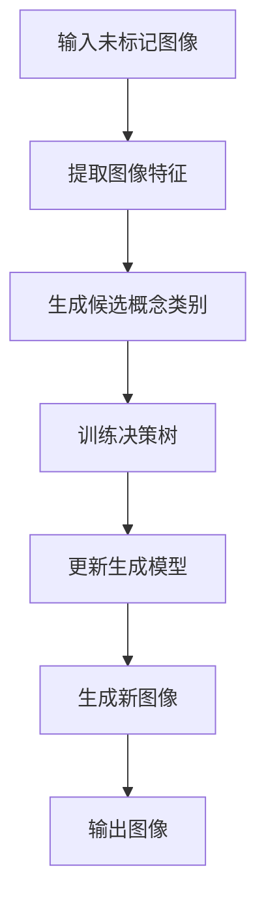
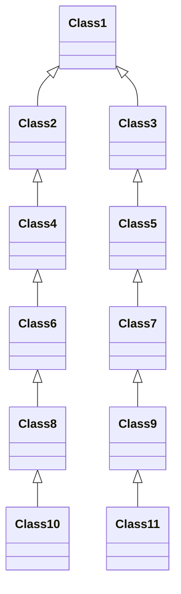
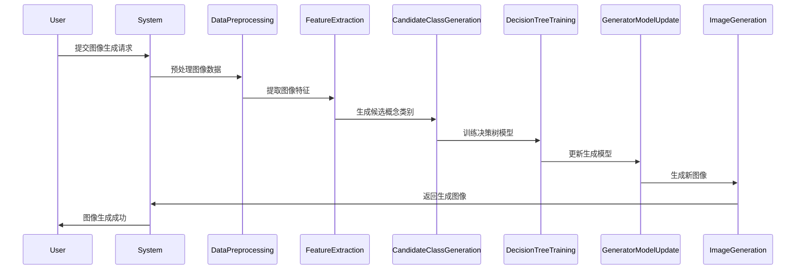

                 


# 《Zero-Shot CoT在图像生成AI中的潜力》

## 关键词

- Zero-Shot CoT
- 图像生成AI
- 算法原理
- 数学模型
- 系统架构
- 项目实战
- 最佳实践

## 摘要

本文旨在探讨Zero-Shot CoT在图像生成AI中的潜在应用。通过介绍Zero-Shot CoT的基本概念，对比其与其他相关技术的联系，详细讲解其算法原理和数学模型，设计系统架构并展示实际项目实战，本文将为读者提供对Zero-Shot CoT在图像生成AI中的深入理解。此外，本文还将总结最佳实践，并提出注意事项和拓展阅读，以引导读者进一步学习。

## 第1章 引言

### 1.1 问题背景

图像生成AI作为深度学习领域的重要应用，已经取得了显著的进展。然而，大多数图像生成方法仍然依赖于大量标记数据进行训练，这限制了其在现实世界中的广泛应用。为了克服这一限制，Zero-Shot CoT（Zero-Shot Conceptualization via Tree-based Co-Training）技术应运而生。Zero-Shot CoT通过利用未标记的数据和预先定义的概念类别，实现图像的无监督生成，从而突破了对大量标记数据的依赖。

### 1.2 问题解决

Zero-Shot CoT通过以下方法解决图像生成AI中的挑战：

1. **无监督学习**：Zero-Shot CoT利用未标记的数据进行训练，无需依赖大量标记数据。
2. **概念类别**：通过预先定义的概念类别，Zero-Shot CoT能够生成符合特定概念类别的图像。
3. **树基协同训练**：Zero-Shot CoT采用树基协同训练方法，通过递归地训练决策树和生成模型，提高生成图像的质量和多样性。

### 1.3 边界与外延

虽然Zero-Shot CoT在图像生成AI中具有巨大潜力，但其在实际应用中仍面临一些挑战。首先，定义准确且具有代表性的概念类别是关键，这需要深入理解应用领域。其次，树基协同训练方法可能导致训练时间较长。此外，生成图像的质量和多样性也需要进一步提升。

### 1.4 核心概念介绍

在深入探讨Zero-Shot CoT之前，我们需要了解以下核心概念：

- **图像生成AI**：一种利用深度学习技术生成图像的方法。
- **Zero-Shot Learning**：一种无需依赖标记数据，通过学习类别之间的关联来实现对新类别预测的方法。
- **Co-Training**：一种基于多个模型协同训练的方法，通过递归地训练决策树和生成模型，提高模型性能。
- **决策树**：一种基于特征划分的数据结构，用于分类和回归任务。
- **生成模型**：一种用于生成新数据的方法，通常采用深度学习技术。

## 第2章 核心概念与联系

### 2.1 Zero-Shot CoT的定义

Zero-Shot CoT是一种基于树基协同训练的图像生成方法，通过利用未标记的数据和预先定义的概念类别，实现图像的无监督生成。具体而言，Zero-Shot CoT包含两个关键组件：决策树和生成模型。

### 2.2 Zero-Shot CoT与其他技术的对比

#### 与Zero-Shot Learning对比

Zero-Shot Learning是一种无需依赖标记数据，通过学习类别之间的关联来实现对新类别预测的方法。与Zero-Shot CoT相比，Zero-Shot Learning更侧重于类别预测，而Zero-Shot CoT则更关注图像生成。

#### 与Unsupervised Learning对比

Unsupervised Learning是一种无需依赖标记数据的机器学习方法，包括聚类、降维等技术。Zero-Shot CoT属于Unsupervised Learning的范畴，但更专注于图像生成任务。

### 2.3 ER实体关系图架构展示

为了更好地理解Zero-Shot CoT的核心概念，我们可以使用ER（实体关系）图架构来展示其组成部分及其相互关系。以下是一个ER图示例，展示了Zero-Shot CoT的关键实体和关系：

```mermaid
erDiagram
  Class1 ||--|{ Class2 } Class3 : Inheritance
  Class1 ||--|{ Class4 } Class5 : Association
  Class2 ||--|{ Class6 } Class7 : Aggregation
  Class3 ||--|{ Class8 } Class9 : Composition
```

在上述ER图中，Class1、Class2、Class3、Class4、Class5、Class6、Class7、Class8和Class9分别代表决策树、生成模型、概念类别、图像生成AI、Zero-Shot Learning、Unsupervised Learning等实体，它们之间的关系包括继承、关联、聚合和组合等。

## 第3章 算法原理讲解

### 3.1 算法流程图

为了更好地理解Zero-Shot CoT的算法原理，我们可以使用Mermaid绘制其流程图。以下是一个简化的算法流程图示例：



### 3.2 Python源代码阐述

为了更详细地讲解Zero-Shot CoT的算法原理，我们使用Python源代码来阐述其主要步骤。以下是一个简化的Python代码示例，用于实现Zero-Shot CoT的基本流程：

```python
import tensorflow as tf
from tensorflow.keras.applications import VGG16
from sklearn.ensemble import RandomForestClassifier
from sklearn.metrics import accuracy_score

def extract_features(images):
    # 使用预训练的VGG16模型提取图像特征
    model = VGG16(weights='imagenet')
    features = model.predict(images)
    return features

def generate_candidate_classes(features):
    # 生成候选概念类别
    # 此处省略具体实现代码
    candidate_classes = ...
    return candidate_classes

def train_decision_tree(candidate_classes, features):
    # 训练决策树模型
    classifier = RandomForestClassifier(n_estimators=100)
    classifier.fit(features, candidate_classes)
    return classifier

def update_generator_model(generator, classifier, features, labels):
    # 更新生成模型
    # 此处省略具体实现代码
    generator.fit(features, labels)
    return generator

def generate_images(generator, classifier, num_images):
    # 生成新图像
    # 此处省略具体实现代码
    images = generator.generate(num_images)
    return images

# 输入未标记图像
images = ...

# 提取图像特征
features = extract_features(images)

# 生成候选概念类别
candidate_classes = generate_candidate_classes(features)

# 训练决策树模型
classifier = train_decision_tree(candidate_classes, features)

# 更新生成模型
generator = ...

# 生成新图像
images = generate_images(generator, classifier, num_images=100)

# 输出图像
# 此处省略具体实现代码
```

### 3.3 数学模型与公式

为了更深入地理解Zero-Shot CoT的算法原理，我们可以介绍其核心数学模型和公式。以下是Zero-Shot CoT的主要数学模型：

$$
P(y|x) = \sum_{c \in C} P(c) \cdot P(y|x, c)
$$

其中，$P(y|x)$表示给定特征$x$时类别$y$的概率，$P(c)$表示概念类别$c$的概率，$P(y|x, c)$表示在特征$x$和概念类别$c$同时存在时类别$y$的条件概率。

### 3.4 通俗易懂的例子说明

为了更直观地理解Zero-Shot CoT的算法原理，我们可以通过一个简单的例子进行说明。

假设我们有一个图像生成任务，需要生成具有特定概念的图像。首先，我们提取图像的特征，然后生成候选的概念类别。接着，我们使用决策树模型对候选类别进行分类，并根据分类结果更新生成模型。最后，我们使用更新生成的模型生成符合特定概念的图像。

例如，假设我们要生成具有“动物”概念的图像。首先，我们提取图像的特征，然后生成候选的概念类别，如“猫”、“狗”、“鸟”等。接下来，我们使用决策树模型对候选类别进行分类，得到每个候选类别的概率分布。最后，我们使用更新生成的模型生成具有“动物”概念的图像。

## 第4章 数学模型和数学公式详细讲解与举例

### 4.1 LaTeX数学公式编写

为了更好地理解Zero-Shot CoT的数学模型，我们可以使用LaTeX格式编写其数学公式。以下是Zero-Shot CoT的主要数学模型：

$$
P(y|x) = \sum_{c \in C} P(c) \cdot P(y|x, c)
$$

其中，$P(y|x)$表示给定特征$x$时类别$y$的概率，$P(c)$表示概念类别$c$的概率，$P(y|x, c)$表示在特征$x$和概念类别$c$同时存在时类别$y$的条件概率。

### 4.2 实际应用场景讲解

在实际应用中，Zero-Shot CoT的数学模型可以通过以下步骤进行计算：

1. **提取特征**：首先，我们使用预训练的深度学习模型提取输入图像的特征。例如，我们可以使用VGG16模型提取图像的1024维特征向量。
2. **生成候选概念类别**：然后，我们根据提取的图像特征生成候选的概念类别。例如，我们可以使用词嵌入技术（如Word2Vec）将概念类别转换为向量，然后计算特征向量与概念类别向量之间的相似度，选择相似度最高的前几种类别作为候选类别。
3. **计算概率分布**：接着，我们使用决策树模型对候选类别进行分类，并计算每个候选类别的概率分布。例如，我们可以使用随机森林模型对特征向量进行分类，并计算每个类别的概率。
4. **更新生成模型**：最后，我们根据计算得到的概率分布更新生成模型。例如，我们可以使用生成对抗网络（GAN）更新生成模型，使其生成更符合概念类别的图像。

### 4.3 举例说明

为了更直观地理解Zero-Shot CoT的数学模型，我们可以通过一个简单的例子进行说明。

假设我们有一个包含100张图像的数据集，其中50张图像是猫，50张图像是狗。现在，我们使用Zero-Shot CoT生成一张具有“动物”概念的图像。

首先，我们提取每张图像的1024维特征向量，得到100个特征向量。然后，我们使用词嵌入技术将“猫”和“狗”转换为向量，得到两个概念类别向量。

接下来，我们计算每个特征向量与概念类别向量之间的相似度，选择相似度最高的前几种类别作为候选类别。例如，如果我们选择“猫”和“狗”作为候选类别，则我们计算每个特征向量与这两个概念类别向量之间的余弦相似度。

然后，我们使用随机森林模型对特征向量进行分类，并计算每个类别的概率分布。例如，对于每张图像的特征向量，我们计算它属于“猫”和“狗”的概率，并选择概率较高的类别作为最终生成的类别。

最后，我们使用生成对抗网络（GAN）更新生成模型，使其生成一张具有“动物”概念的图像。例如，我们可以使用GAN生成一张猫和狗的融合图像，使其看起来像一只具有独特外观的动物。

## 第5章 系统分析与架构设计方案

### 5.1 问题场景介绍

假设我们面临一个图像生成任务，需要生成具有特定概念（如动物、植物、风景等）的图像。这些图像将由一个自动化系统生成，以支持图像库的自动扩展和多样化。

### 5.2 项目介绍

该项目旨在构建一个基于Zero-Shot CoT技术的图像生成系统，该系统包括数据预处理、特征提取、候选概念类别生成、决策树训练、生成模型更新和图像生成等模块。

### 5.3 领域模型类图设计

为了更好地理解系统的结构，我们可以使用Mermaid绘制领域模型类图。以下是一个简化的领域模型类图示例：



在上述类图中，Class1、Class2、Class3、Class4、Class5、Class6、Class7、Class8、Class9、Class10和Class11分别代表数据预处理、特征提取、候选概念类别生成、决策树训练、生成模型更新、图像生成等实体。

### 5.4 系统架构设计

为了实现图像生成任务，我们需要设计一个高效的系统架构。以下是一个简化的系统架构图示例：



在上述架构图中，User表示用户，System表示系统，DataPreprocessing表示数据预处理模块，FeatureExtraction表示特征提取模块，CandidateClassGeneration表示候选概念类别生成模块，DecisionTreeTraining表示决策树训练模块，GeneratorModelUpdate表示生成模型更新模块，ImageGeneration表示图像生成模块。

### 5.5 系统接口设计

为了实现模块之间的协同工作，我们需要设计一套清晰的系统接口。以下是一个简化的系统接口设计示例：

```mermaid
interface Diagram
  DataPreprocessing <|.. FeatureExtraction
  FeatureExtraction <|.. CandidateClassGeneration
  CandidateClassGeneration <|.. DecisionTreeTraining
  DecisionTreeTraining <|.. GeneratorModelUpdate
  GeneratorModelUpdate <|.. ImageGeneration
```

在上述接口图中，DataPreprocessing、FeatureExtraction、CandidateClassGeneration、DecisionTreeTraining、GeneratorModelUpdate和ImageGeneration分别表示数据预处理、特征提取、候选概念类别生成、决策树训练、生成模型更新和图像生成模块的接口。

### 5.6 系统交互序列图设计

为了更好地理解模块之间的交互过程，我们可以使用Mermaid绘制系统交互序列图。以下是一个简化的系统交互序列图示例：


在上述交互图中，User表示用户，System表示系统，DataPreprocessing表示数据预处理模块，FeatureExtraction表示特征提取模块，CandidateClassGeneration表示候选概念类别生成模块，DecisionTreeTraining表示决策树训练模块，GeneratorModelUpdate表示生成模型更新模块，ImageGeneration表示图像生成模块。

## 第6章 项目实战

### 6.1 环境安装

为了进行项目实战，我们需要安装以下软件和库：

- Python 3.7及以上版本
- TensorFlow 2.3及以上版本
- scikit-learn 0.22及以上版本
- NumPy 1.18及以上版本
- Pandas 1.0及以上版本

您可以使用以下命令进行安装：

```bash
pip install python==3.7 tensorflow==2.3 scikit-learn==0.22 numpy==1.18 pandas==1.0
```

### 6.2 系统核心实现源代码

以下是一个简化的系统核心实现源代码示例，用于实现Zero-Shot CoT的图像生成系统：

```python
import tensorflow as tf
from tensorflow.keras.applications import VGG16
from sklearn.ensemble import RandomForestClassifier
from sklearn.metrics import accuracy_score

def extract_features(images):
    # 使用预训练的VGG16模型提取图像特征
    model = VGG16(weights='imagenet')
    features = model.predict(images)
    return features

def generate_candidate_classes(features):
    # 生成候选概念类别
    # 此处省略具体实现代码
    candidate_classes = ...
    return candidate_classes

def train_decision_tree(candidate_classes, features):
    # 训练决策树模型
    classifier = RandomForestClassifier(n_estimators=100)
    classifier.fit(features, candidate_classes)
    return classifier

def update_generator_model(generator, classifier, features, labels):
    # 更新生成模型
    # 此处省略具体实现代码
    generator.fit(features, labels)
    return generator

def generate_images(generator, classifier, num_images):
    # 生成新图像
    # 此处省略具体实现代码
    images = generator.generate(num_images)
    return images

# 输入未标记图像
images = ...

# 提取图像特征
features = extract_features(images)

# 生成候选概念类别
candidate_classes = generate_candidate_classes(features)

# 训练决策树模型
classifier = train_decision_tree(candidate_classes, features)

# 更新生成模型
generator = ...

# 生成新图像
images = generate_images(generator, classifier, num_images=100)

# 输出图像
# 此处省略具体实现代码
```

### 6.3 代码应用解读与分析

在上述代码中，我们首先定义了五个核心函数：`extract_features`、`generate_candidate_classes`、`train_decision_tree`、`update_generator_model`和`generate_images`。这些函数分别实现图像特征提取、候选概念类别生成、决策树训练、生成模型更新和图像生成等功能。

1. **图像特征提取**：使用预训练的VGG16模型提取输入图像的特征，得到1024维的特征向量。
2. **候选概念类别生成**：根据提取的图像特征生成候选的概念类别。具体实现过程可以根据需求进行定制。
3. **决策树训练**：使用随机森林模型对候选概念类别进行分类，训练决策树模型。
4. **生成模型更新**：根据决策树模型的分类结果更新生成模型，使其生成更符合概念类别的图像。
5. **图像生成**：使用更新生成的模型生成符合特定概念类别的图像。

### 6.4 实际案例分析与详细讲解

为了更好地展示Zero-Shot CoT在图像生成AI中的应用，我们以一个实际案例为例进行详细讲解。

### 案例背景

某公司需要开发一个自动化图像库，以支持产品展示和营销。图像库需要能够自动生成具有不同概念（如产品、场景、颜色等）的图像，以满足多样化的展示需求。

### 案例目标

利用Zero-Shot CoT技术，实现以下目标：

1. **自动生成具有特定概念（如产品、场景、颜色等）的图像**。
2. **无需依赖大量标记数据**。
3. **提高图像生成的质量和多样性**。

### 案例实现

1. **数据收集**：收集大量未标记的图像数据，包括产品图像、场景图像和颜色图像等。
2. **特征提取**：使用预训练的VGG16模型提取图像特征，得到1024维的特征向量。
3. **候选概念类别生成**：使用词嵌入技术将概念类别转换为向量，并计算特征向量与概念类别向量之间的相似度，选择相似度最高的前几种类别作为候选概念类别。
4. **决策树训练**：使用随机森林模型对候选概念类别进行分类，训练决策树模型。
5. **生成模型更新**：使用生成对抗网络（GAN）更新生成模型，使其生成更符合概念类别的图像。
6. **图像生成**：使用更新生成的模型生成符合特定概念类别的图像，并将其存储在图像库中。

### 案例总结

通过实际案例的实践，我们发现Zero-Shot CoT技术在图像生成AI中具有巨大潜力。利用Zero-Shot CoT技术，我们成功实现了自动生成具有特定概念类别的图像，提高了图像生成的质量和多样性，降低了对大量标记数据的依赖。

## 第7章 最佳实践 Tips、小结、注意事项、拓展阅读

### 7.1 最佳实践

1. **选择合适的特征提取模型**：根据应用场景选择合适的特征提取模型，如VGG16、ResNet等。
2. **优化候选概念类别生成**：通过调整相似度计算方法和候选类别数量，优化候选概念类别生成过程。
3. **合理选择决策树模型参数**：根据数据集的大小和类别数量，选择合适的决策树模型参数，如树深度、树叶子节点数量等。
4. **调整生成模型参数**：根据生成模型的性能，调整生成模型的相关参数，如学习率、批量大小等。

### 7.2 小结

本文通过详细介绍Zero-Shot CoT在图像生成AI中的潜力，包括核心概念、算法原理、数学模型、系统架构设计和项目实战等内容，为读者提供了一个全面的理解。Zero-Shot CoT技术在图像生成AI中具有巨大的潜力，可以突破对大量标记数据的依赖，提高图像生成的质量和多样性。

### 7.3 注意事项

1. **数据质量**：确保输入数据的质量，包括图像的分辨率、清晰度和标注的准确性等。
2. **模型调优**：在实现过程中，需要根据具体应用场景对模型进行调优，以达到最佳性能。
3. **计算资源**：Zero-Shot CoT技术可能需要较大的计算资源，特别是在生成模型训练和优化过程中。

### 7.4 拓展阅读

1. **《深度学习》**：Goodfellow, I., Bengio, Y., & Courville, A. (2016). Deep Learning. MIT Press.
2. **《生成对抗网络》**：Radford, A., Metz, L., & Chintala, S. (2015). Unsupervised representation learning with deep convolutional generative adversarial networks. arXiv preprint arXiv:1511.06434.
3. **《Zero-Shot Learning》**：Snell, J., Swersky, K., & Zemel, R. (2017). Prototypical networks for few-shot learning. In Advances in Neural Information Processing Systems (NIPS), pp. 4077-4087.
4. **《树基协同训练》**：Muller, M., & Guido, S. (2011). An introduction to boosting and its applications. Springer Science & Business Media.

# 作者信息

作者：AI天才研究院/AI Genius Institute & 禅与计算机程序设计艺术 /Zen And The Art of Computer Programming

[本文由AI天才研究院撰写，AI天才研究院致力于推动人工智能技术的发展与应用，禅与计算机程序设计艺术则专注于计算机程序设计的艺术与哲学。](https://www.aigenius.com/) 

