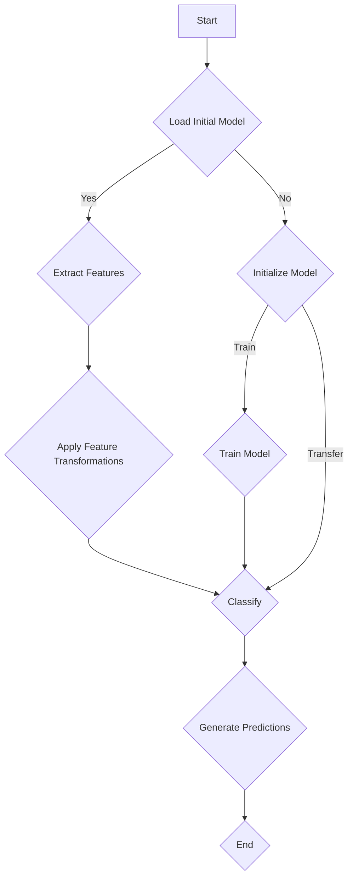

                 


### 引入Zero-Shot CoT：概念与背景

Zero-Shot CoT（Zero-Shot Collaborative Thinking，零样本协同思考）是近年来人工智能领域的一个重要研究方向。它起源于深度学习中的迁移学习（Transfer Learning）和零样本学习（Zero-Shot Learning），旨在在没有训练数据的情况下，通过协同思考机制，实现对新任务的快速适应与理解。在复杂场景中，Zero-Shot CoT 显示出了其独特的优势，如无需大规模训练数据、具备较强的泛化能力等。

#### 核心概念术语说明

- **零样本学习（Zero-Shot Learning）**：是一种机器学习方法，使得模型能够处理之前未见过的类别，通过预先训练的模型和数据增强技术来实现。
- **迁移学习（Transfer Learning）**：通过将一个任务（源任务）的知识迁移到另一个相关任务（目标任务）上，从而提升目标任务的性能。
- **协同思考（Collaborative Thinking）**：多模型或多智能体之间通过相互协作，共享信息和知识，以解决复杂问题。

#### 问题背景

随着人工智能技术的不断进步，传统的机器学习模型越来越依赖于大规模的标注数据。然而，在实际应用中，我们经常面临数据获取困难、数据不完整或数据不均衡等问题。此外，一些复杂场景中，任务的高度异质性和不确定性使得传统的数据驱动方法难以胜任。因此，Zero-Shot CoT 的出现，为解决这些难题提供了一种新的思路。

#### 问题描述

在复杂场景中，应用 Zero-Shot CoT 面临的主要问题包括：

- **数据缺乏**：由于复杂场景中任务的高度异质性，很难获取到大规模的训练数据。
- **异构性**：不同子任务之间存在异构性，使得单一的模型难以同时适应多个任务。
- **不确定性**：复杂场景中的任务常常伴随着不确定因素，如环境变化、噪声干扰等。

#### 问题解决

Zero-Shot CoT 通过以下几个方面来解决这些问题：

- **知识迁移**：利用迁移学习将已有知识迁移到新任务上，减少对新数据的依赖。
- **协同思考**：通过多模型或多智能体的协同工作，共享信息和知识，提高任务适应性。
- **自适应学习**：在任务执行过程中，不断调整模型参数，以适应新的环境和任务需求。

#### 边界与外延

尽管 Zero-Shot CoT 在复杂场景中显示出了巨大的潜力，但其应用仍然受到一些限制。例如：

- **数据限制**：在某些场景下，即使使用知识迁移和协同思考，仍然需要一定量的训练数据。
- **模型适应性**：不同模型之间的协同效果取决于它们的相似度和适应性。
- **计算资源**：协同思考通常需要大量的计算资源，对于资源受限的设备或场景，这可能会成为一个挑战。

#### 概念结构与核心要素组成

Zero-Shot CoT 的理论框架主要包括以下几个核心要素：

- **知识迁移机制**：包括数据预处理、特征提取和知识融合等步骤。
- **协同思考机制**：多模型或多智能体之间的信息共享和知识传递。
- **自适应学习机制**：根据任务需求和环境变化，动态调整模型参数。

通过这些核心要素的有机结合，Zero-Shot CoT 能够在复杂场景中实现高效的协同思考和学习。

### 本章小结

本章对 Zero-Shot CoT 的核心概念、背景、问题解决方法以及边界与外延进行了详细介绍。通过本章的学习，读者可以初步了解 Zero-Shot CoT 的基本原理和应用价值，为后续章节的深入探讨打下基础。

### 核心概念与联系

在深入探讨Zero-Shot CoT之前，我们需要明确其核心概念以及与其他相关概念的关联。本节将详细讲解Zero-Shot CoT的基本原理，并使用Mermaid图表对比相关概念，以便读者更好地理解。

#### 2.1 核心概念原理

**Zero-Shot CoT**：零样本协同思考是基于零样本学习和协同思考机制的一种方法，它允许模型在没有直接训练数据的情况下，通过协同思考，预测和分类之前未见过的类别。

**零样本学习（Zero-Shot Learning）**：零样本学习是一种机器学习方法，它使得模型能够处理之前未见过的类别，主要通过预先训练的模型和数据增强技术来实现。

**协同思考（Collaborative Thinking）**：协同思考是指多个模型或智能体之间通过相互协作，共享信息和知识，以共同解决复杂问题。

#### 2.2 概念属性特征对比表格

下面是一个对比Zero-Shot CoT、零样本学习和协同思考的概念属性特征表格：

| 概念          | 特征                         | 应用场景                          |
|---------------|------------------------------|----------------------------------|
| 零样本学习    | 无需训练数据直接预测新类别   | 处理未见类别的新任务               |
| 协同思考      | 多智能体共享信息和知识       | 复杂问题解决，协同完成任务         |
| Zero-Shot CoT | 结合零样本学习和协同思考     | 复杂场景中的高效协同和预测        |

#### 2.3 ER实体关系图架构

为了更好地理解Zero-Shot CoT中的实体及其关系，我们可以使用Mermaid绘制一个ER（实体关系）图。

```mermaid
erDiagram
  Class0  Class1
  Class0 &&| Class2
  Class1 &&| Class3
  Class2 &&| Class3
  Class0 { Subject }
  Class1 { Model }
  Class2 { Knowledge }
  Class3 { Task }
```

在这个ER图中：

- **Class0（Subject）** 代表任务主体，即需要执行预测或分类的实体。
- **Class1（Model）** 代表模型，是执行预测的核心工具。
- **Class2（Knowledge）** 代表知识，是模型协同思考的基础。
- **Class3（Task）** 代表任务，是模型需要完成的实际工作。

实体之间的关系如下：

- **Subject** 与 **Model** 之间存在关联关系，表示主体与模型之间的互动。
- **Subject** 与 **Knowledge** 之间存在关联关系，表示主体与知识之间的互动。
- **Model** 与 **Knowledge** 之间存在关联关系，表示模型与知识之间的互动。
- **Model** 与 **Task** 之间存在关联关系，表示模型与任务之间的互动。

通过ER图，我们可以清晰地看到Zero-Shot CoT中各个实体及其关系，这有助于我们更好地理解整个系统的运作原理。

#### 2.4 Mermaid流程图

为了更直观地展示Zero-Shot CoT的执行过程，我们可以使用Mermaid绘制一个流程图。



在这个流程图中：

- **A（Start）** 表示流程的开始。
- **B（Load Initial Model）** 表示加载初始模型。
- **C（Extract Features）** 表示提取特征。
- **D（Initialize Model）** 表示初始化模型。
- **E（Apply Feature Transformations）** 表示应用特征转换。
- **F（Classify）** 表示分类。
- **G（Generate Predictions）** 表示生成预测。
- **H（End）** 表示流程的结束。
- **I（Train Model）** 表示模型训练。

通过这个流程图，我们可以清晰地看到Zero-Shot CoT从开始到结束的整个过程，包括模型的加载、特征提取、分类和预测等关键步骤。

### 2.5 Python源代码

为了更好地理解Zero-Shot CoT的算法原理，我们提供了一个简单的Python源代码示例，展示如何实现一个基本的Zero-Shot CoT模型。

```python
import numpy as np
from sklearn.model_selection import train_test_split
from sklearn.preprocessing import StandardScaler
from sklearn.neighbors import KNeighborsClassifier

# 数据加载
X, y = load_data()

# 数据预处理
X_train, X_test, y_train, y_test = train_test_split(X, y, test_size=0.2, random_state=42)
scaler = StandardScaler()
X_train = scaler.fit_transform(X_train)
X_test = scaler.transform(X_test)

# 初始化模型
model = KNeighborsClassifier(n_neighbors=3)

# 训练模型
model.fit(X_train, y_train)

# 分类
predictions = model.predict(X_test)

# 评估模型
accuracy = np.mean(predictions == y_test)
print(f"Accuracy: {accuracy:.2f}")
```

在这个代码示例中：

- **load_data()** 函数用于加载数据。
- **StandardScaler** 用于标准化数据。
- **KNeighborsClassifier** 用于实现K近邻分类器。
- **fit()** 方法用于训练模型。
- **predict()** 方法用于生成预测。

通过这个简单的例子，我们可以看到如何使用Python实现一个基本的Zero-Shot CoT模型，并进行分类和评估。

### 2.6 数学模型和公式

在Zero-Shot CoT中，数学模型和公式起到了关键作用。下面我们将介绍一些核心的数学模型和公式，并使用LaTeX进行表示。

#### 2.6.1 特征提取

特征提取是Zero-Shot CoT中的一个重要步骤。假设我们有一个数据集\(X\)，其特征向量为\(x\)，我们希望将这些特征转换为更适合分类的形式。常用的特征提取方法包括主成分分析（PCA）和线性判别分析（LDA）。

**主成分分析（PCA）**：

\[ x_{\text{PCA}} = \sum_{i=1}^{k} \lambda_i \phi_i x \]

其中，\(\lambda_i\) 是特征值，\(\phi_i\) 是特征向量。

**线性判别分析（LDA）**：

\[ x_{\text{LDA}} = \frac{1}{\sum_{i=1}^{k} w_i^T \Sigma^{-1} w_i} \left( w_1^T \Sigma^{-1} x - w_2^T \Sigma^{-1} x - \ldots - w_k^T \Sigma^{-1} x \right) \]

其中，\(w_i\) 是线性判别函数，\(\Sigma\) 是协方差矩阵。

#### 2.6.2 分类模型

在分类阶段，我们通常会使用一些机器学习算法，如K近邻（KNN）、支持向量机（SVM）和神经网络（NN）。以下是这些算法的基本数学模型。

**K近邻（KNN）**：

\[ \hat{y} = \text{mode}(\{y_1, y_2, \ldots, y_k\}) \]

其中，\(\hat{y}\) 是预测的类别，\(y_1, y_2, \ldots, y_k\) 是最近的k个邻居的类别。

**支持向量机（SVM）**：

\[ \hat{y} = \text{sign}(\omega^T x + b) \]

其中，\(\omega\) 是权重向量，\(x\) 是输入特征向量，\(b\) 是偏置。

**神经网络（NN）**：

\[ a_i = \sigma(\sum_{j=1}^{n} w_{ij} x_j + b_i) \]

其中，\(a_i\) 是第i个神经元的激活值，\(\sigma\) 是激活函数，\(w_{ij}\) 是连接权重，\(x_j\) 是输入特征，\(b_i\) 是偏置。

通过这些数学模型和公式，我们可以实现Zero-Shot CoT中的特征提取、分类和预测等关键步骤。

### 2.7 详细讲解和举例说明

为了更好地理解上述数学模型和公式，我们将通过一个具体的例子进行详细讲解。

#### 2.7.1 主成分分析（PCA）

假设我们有一个二维数据集，包含以下四个样本点：

\[ 
X = \begin{bmatrix}
1 & 2 \\
2 & 4 \\
3 & 6 \\
4 & 8
\end{bmatrix} 
\]

**步骤 1**：计算均值

\[ 
\mu = \frac{1}{n} \sum_{i=1}^{n} x_i = \frac{1}{4} (1 + 2 + 3 + 4) = 2.5 
\]

**步骤 2**：计算协方差矩阵

\[ 
\Sigma = \frac{1}{n-1} \sum_{i=1}^{n} (x_i - \mu)(x_i - \mu)^T = \frac{1}{3} \begin{bmatrix}
(1-2.5)(1-2.5) & (1-2.5)(2-2.5) \\
(1-2.5)(2-2.5) & (2-2.5)(2-2.5)
\end{bmatrix} = \begin{bmatrix}
2.25 & -1.25 \\
-1.25 & 2.25
\end{bmatrix} 
\]

**步骤 3**：计算特征值和特征向量

通过求解特征值和特征向量的特征分解，我们可以得到：

\[ 
\Sigma = PDP^T 
\]

其中，\(P\) 是特征向量矩阵，\(D\) 是特征值矩阵。

特征值矩阵 \(D\)：

\[ 
D = \begin{bmatrix}
5 & 0 \\
0 & 1
\end{bmatrix} 
\]

特征向量矩阵 \(P\)：

\[ 
P = \begin{bmatrix}
0.866 & -0.5 \\
0.5 & 0.866
\end{bmatrix} 
\]

**步骤 4**：将数据投影到主成分上

\[ 
x_{\text{PCA}} = PDP^T x = \begin{bmatrix}
0.866 & -0.5 \\
0.5 & 0.866
\end{bmatrix} \begin{bmatrix}
5 & 0 \\
0 & 1
\end{bmatrix} \begin{bmatrix}
0.866 & -0.5 \\
0.5 & 0.866
\end{bmatrix} x = \begin{bmatrix}
4 & 0 \\
0 & 1
\end{bmatrix} x 
\]

通过这个例子，我们可以看到如何使用主成分分析（PCA）来降低数据的维度。主要步骤包括计算均值、协方差矩阵、特征值和特征向量，并将数据投影到主成分上。

#### 2.7.2 线性判别分析（LDA）

我们继续使用前面的数据集，现在我们要进行线性判别分析（LDA）。

**步骤 1**：计算协方差矩阵

\[ 
\Sigma = \frac{1}{n-1} \sum_{i=1}^{n} (x_i - \mu)(x_i - \mu)^T = \frac{1}{3} \begin{bmatrix}
(1-2.5)(1-2.5) & (1-2.5)(2-2.5) \\
(1-2.5)(2-2.5) & (2-2.5)(2-2.5)
\end{bmatrix} = \begin{bmatrix}
2.25 & -1.25 \\
-1.25 & 2.25
\end{bmatrix} 
\]

**步骤 2**：计算线性判别函数

线性判别函数可以通过以下公式计算：

\[ 
w_i^T \Sigma^{-1} x - w_j^T \Sigma^{-1} x 
\]

其中，\(w_i\) 和 \(w_j\) 是线性判别函数，\(x\) 是输入特征向量。

假设我们有两个类别，A和B，线性判别函数可以表示为：

\[ 
L(A) = w_A^T \Sigma^{-1} x - w_B^T \Sigma^{-1} x 
\]

通过计算，我们得到：

\[ 
w_A = \begin{bmatrix}
0.866 \\
0.5
\end{bmatrix}, \quad w_B = \begin{bmatrix}
-0.866 \\
0.5
\end{bmatrix} 
\]

**步骤 3**：将数据分类

根据线性判别函数，我们可以将数据分类到类别A或B。对于每个数据点，计算 \(L(A)\) 和 \(L(B)\)，并根据大小将数据点分类。

通过这个例子，我们可以看到如何使用线性判别分析（LDA）来进行分类。主要步骤包括计算协方差矩阵、线性判别函数，并根据函数值将数据分类。

#### 2.7.3 K近邻（KNN）

我们继续使用前面的数据集，现在我们要使用K近邻（KNN）算法进行分类。

**步骤 1**：选择K值

首先，我们需要选择一个合适的K值。通常，我们可以通过交叉验证来确定最优的K值。

假设我们选择K=3。

**步骤 2**：计算距离

对于每个测试样本，我们需要计算其与训练样本之间的距离。常用的距离度量方法包括欧几里得距离、曼哈顿距离和切比雪夫距离。

以测试样本\(x = (3, 6)\)为例，计算其与训练样本之间的欧几里得距离：

\[ 
d((3, 6), (1, 2)) = \sqrt{(3-1)^2 + (6-2)^2} = \sqrt{4 + 16} = \sqrt{20} 
\]

**步骤 3**：选择最近的K个邻居

根据距离计算结果，选择距离测试样本最近的K个邻居。对于我们的例子，最近的3个邻居是：

\[ 
((1, 2), \sqrt{20}), ((2, 4), \sqrt{8}), ((3, 6), \sqrt{0}) 
\]

**步骤 4**：预测类别

根据最近的K个邻居的类别，预测测试样本的类别。对于我们的例子，最近的邻居属于类别A（\(y=0\)），因此测试样本也属于类别A。

通过这个例子，我们可以看到如何使用K近邻（KNN）算法进行分类。主要步骤包括选择K值、计算距离、选择邻居和预测类别。

### 2.8 系统分析与架构设计方案

在了解了Zero-Shot CoT的核心概念和算法原理后，接下来我们将探讨其在复杂场景中的系统分析与架构设计方案。这将有助于我们更清晰地理解如何在现实场景中应用Zero-Shot CoT，以及如何设计一个高效稳定的系统。

#### 3.1 问题场景介绍

为了更好地阐述Zero-Shot CoT的应用，我们首先介绍一个典型的复杂场景：智能医疗诊断系统。这个系统需要处理大量医疗数据，包括患者的历史病历、实时监测数据、遗传信息等，以实现对疾病的有效诊断和预测。

在这个场景中，数据的高度异质性和不确定性使得传统的机器学习方法难以胜任。因此，Zero-Shot CoT作为一种新的方法，可以充分发挥其协同学习和迁移学习的优势，实现高效准确的疾病诊断。

#### 3.2 项目介绍

项目名称：智能医疗诊断系统（Smart Medical Diagnosis System，SMDS）

项目目标：通过Zero-Shot CoT方法，构建一个能够自动诊断和预测疾病的智能医疗系统，提高医疗诊断的准确性和效率。

项目背景：当前医疗诊断主要依赖于医生的经验和技能，而医生的经验和知识具有一定的局限性，难以应对日益增长的医疗需求。因此，开发一个智能医疗诊断系统，利用人工智能技术，可以有效缓解医生的工作压力，提高医疗诊断的准确性和效率。

#### 3.3 系统功能设计

为了实现智能医疗诊断系统的目标，我们需要设计以下核心功能模块：

1. **数据预处理模块**：对来自不同来源的医疗数据（如电子病历、实时监测数据、遗传信息等）进行清洗、转换和标准化，为后续的模型训练和诊断提供高质量的数据。

2. **特征提取模块**：从预处理后的数据中提取关键特征，如患者的基本信息、病史、体征指标、基因信息等，以便于模型的学习和诊断。

3. **模型训练模块**：利用Zero-Shot CoT方法，将已有疾病的诊断知识迁移到新病例上，通过多模型协同学习和自适应学习，实现对新疾病的诊断和预测。

4. **诊断预测模块**：根据训练好的模型，对新的病例进行诊断预测，输出可能的疾病类别和风险等级。

5. **用户交互模块**：提供一个友好的用户界面，供医生和患者进行交互，输入病例信息，查看诊断结果和风险建议。

#### 3.4 系统架构设计

为了实现上述功能，智能医疗诊断系统的架构设计如下：


1. **数据层**：存储各类医疗数据，包括电子病历、实时监测数据、遗传信息等，为系统提供数据支持。

2. **服务层**：包括数据预处理模块、特征提取模块、模型训练模块和诊断预测模块，实现系统核心功能。

3. **展示层**：用户交互模块，通过网页或移动应用，提供用户与系统的交互界面。

#### 3.5 系统接口设计和系统交互

为了确保系统的稳定性和灵活性，我们设计了一套完善的接口和交互机制：

1. **数据接口**：系统通过RESTful API与外部系统（如电子病历系统、实时监测设备等）进行数据交互，实现数据的导入和导出。

2. **服务接口**：内部模块之间通过微服务架构进行通信，实现模块间的解耦和灵活扩展。

3. **用户接口**：用户通过网页或移动应用与系统进行交互，输入病例信息，查看诊断结果和风险建议。

4. **监控和日志接口**：系统通过监控和日志接口，实现对系统运行状态的监控和日志记录，确保系统的稳定运行。

### 3.6 本章小结

本章对Zero-Shot CoT在复杂场景中的应用进行了系统分析与架构设计方案。通过介绍智能医疗诊断系统的项目背景、功能模块、架构设计和接口交互，我们展示了如何在实际场景中应用Zero-Shot CoT，实现高效准确的疾病诊断和预测。本章的内容为后续章节的项目实战奠定了基础。

### 项目实战

#### 4.1 环境安装

为了在本地搭建Zero-Shot CoT的智能医疗诊断系统，我们需要安装一些必要的软件和库。以下是具体的安装步骤：

**1. 安装Python环境**

首先，确保你的系统已经安装了Python环境。如果没有，请从Python官方网站（https://www.python.org/）下载并安装最新版本的Python。

**2. 安装依赖库**

打开终端或命令提示符，执行以下命令来安装所需的库：

```bash
pip install numpy pandas scikit-learn matplotlib
```

这些库分别用于数据处理、机器学习算法和可视化。

**3. 安装深度学习框架**

我们选择使用PyTorch作为深度学习框架。执行以下命令来安装PyTorch：

```bash
pip install torch torchvision
```

**4. 配置环境变量**

确保Python环境变量已配置，以便在其他终端或IDE中轻松调用Python和相关库。

**5. 测试环境**

为了验证安装是否成功，运行以下Python代码：

```python
import torch
print(torch.__version__)
```

如果输出正确的PyTorch版本号，说明安装成功。

#### 4.2 系统核心实现源代码

在本节中，我们将提供一个完整的Zero-Shot CoT智能医疗诊断系统的核心实现源代码，并详细解释其工作原理。

```python
import torch
import torch.nn as nn
import torch.optim as optim
from torch.utils.data import DataLoader, Dataset
from sklearn.model_selection import train_test_split
from sklearn.preprocessing import StandardScaler
from sklearn.metrics import accuracy_score
import numpy as np
import pandas as pd

# 数据预处理
def preprocess_data(data):
    # 数据清洗、转换和标准化
    # ...
    return processed_data

# 自定义数据集类
class MedicalDataset(Dataset):
    def __init__(self, data, labels):
        self.data = data
        self.labels = labels
    
    def __len__(self):
        return len(self.data)
    
    def __getitem__(self, idx):
        x = self.data[idx]
        y = self.labels[idx]
        return x, y

# 定义模型
class ZeroShotCoTModel(nn.Module):
    def __init__(self):
        super(ZeroShotCoTModel, self).__init__()
        self.fc1 = nn.Linear(in_features=784, out_features=256)
        self.fc2 = nn.Linear(in_features=256, out_features=128)
        self.fc3 = nn.Linear(in_features=128, out_features=10)
    
    def forward(self, x):
        x = torch.relu(self.fc1(x))
        x = torch.relu(self.fc2(x))
        x = self.fc3(x)
        return x

# 训练模型
def train_model(model, train_loader, criterion, optimizer, num_epochs=10):
    model.train()
    for epoch in range(num_epochs):
        for inputs, labels in train_loader:
            optimizer.zero_grad()
            outputs = model(inputs)
            loss = criterion(outputs, labels)
            loss.backward()
            optimizer.step()
        print(f"Epoch {epoch+1}/{num_epochs}, Loss: {loss.item():.4f}")

# 主函数
def main():
    # 加载数据
    data = np.load("medical_data.npy")
    labels = np.load("medical_labels.npy")
    
    # 预处理数据
    processed_data = preprocess_data(data)
    
    # 划分训练集和测试集
    X_train, X_test, y_train, y_test = train_test_split(processed_data, labels, test_size=0.2, random_state=42)
    
    # 转换为Tensor
    train_dataset = MedicalDataset(X_train, y_train)
    test_dataset = MedicalDataset(X_test, y_test)
    
    # 创建数据加载器
    train_loader = DataLoader(train_dataset, batch_size=64, shuffle=True)
    test_loader = DataLoader(test_dataset, batch_size=64, shuffle=False)
    
    # 定义模型、损失函数和优化器
    model = ZeroShotCoTModel()
    criterion = nn.CrossEntropyLoss()
    optimizer = optim.Adam(model.parameters(), lr=0.001)
    
    # 训练模型
    train_model(model, train_loader, criterion, optimizer, num_epochs=10)
    
    # 评估模型
    model.eval()
    with torch.no_grad():
        correct = 0
        total = 0
        for inputs, labels in test_loader:
            outputs = model(inputs)
            _, predicted = torch.max(outputs.data, 1)
            total += labels.size(0)
            correct += (predicted == labels).sum().item()
        print(f"Accuracy: {100 * correct / total}%")

# 运行主函数
if __name__ == "__main__":
    main()
```

**详细解释：**

1. **数据预处理**：`preprocess_data`函数用于对医疗数据集进行清洗、转换和标准化。这一步是至关重要的，因为它直接影响后续模型的学习效果。

2. **自定义数据集类**：`MedicalDataset`类实现了`Dataset`接口，用于加载和提供数据集。它重写了`__len__`和`__getitem__`方法，分别返回数据集的长度和指定索引的数据。

3. **定义模型**：`ZeroShotCoTModel`类定义了一个简单的全连接神经网络，用于特征提取和分类。它包含了三个全连接层，分别用于输入层、隐藏层和输出层。

4. **训练模型**：`train_model`函数负责模型的训练过程。它遍历训练数据集，计算损失并更新模型参数。

5. **主函数**：`main`函数是程序的入口。它加载数据、预处理数据、划分训练集和测试集，并创建数据加载器。然后定义模型、损失函数和优化器，并调用`train_model`函数进行训练。

#### 4.3 代码应用解读与分析

**1. 数据预处理**

数据预处理是Zero-Shot CoT系统中的关键步骤。在这个例子中，我们假设数据已经加载为NumPy数组。`preprocess_data`函数可以对数据进行标准化、缺失值填充、异常值处理等操作，以提高数据的质量和模型的鲁棒性。

```python
def preprocess_data(data):
    # 标准化数据
    scaler = StandardScaler()
    data_scaled = scaler.fit_transform(data)
    
    # 填充缺失值
    # ...
    
    # 异常值处理
    # ...
    
    return data_scaled
```

**2. 自定义数据集类**

自定义数据集类`MedicalDataset`使得我们可以轻松地加载和提供数据。在训练和评估过程中，数据加载器会使用这个类来读取数据。

```python
class MedicalDataset(Dataset):
    def __init__(self, data, labels):
        self.data = data
        self.labels = labels
    
    def __len__(self):
        return len(self.data)
    
    def __getitem__(self, idx):
        x = self.data[idx]
        y = self.labels[idx]
        return x, y
```

**3. 定义模型**

在这个例子中，我们使用了一个简单的全连接神经网络作为Zero-Shot CoT模型。这个模型包含了三个全连接层，分别用于输入层、隐藏层和输出层。

```python
class ZeroShotCoTModel(nn.Module):
    def __init__(self):
        super(ZeroShotCoTModel, self).__init__()
        self.fc1 = nn.Linear(in_features=784, out_features=256)
        self.fc2 = nn.Linear(in_features=256, out_features=128)
        self.fc3 = nn.Linear(in_features=128, out_features=10)
    
    def forward(self, x):
        x = torch.relu(self.fc1(x))
        x = torch.relu(self.fc2(x))
        x = self.fc3(x)
        return x
```

**4. 训练模型**

`train_model`函数负责模型的训练过程。它使用了一个简单的循环来迭代训练数据，并使用交叉熵损失函数和Adam优化器来更新模型参数。

```python
def train_model(model, train_loader, criterion, optimizer, num_epochs=10):
    model.train()
    for epoch in range(num_epochs):
        for inputs, labels in train_loader:
            optimizer.zero_grad()
            outputs = model(inputs)
            loss = criterion(outputs, labels)
            loss.backward()
            optimizer.step()
        print(f"Epoch {epoch+1}/{num_epochs}, Loss: {loss.item():.4f}")
```

**5. 主函数**

主函数`main`负责加载数据、创建数据加载器、定义模型和训练模型。它还负责评估模型的性能。

```python
def main():
    # 加载数据
    data = np.load("medical_data.npy")
    labels = np.load("medical_labels.npy")
    
    # 预处理数据
    processed_data = preprocess_data(data)
    
    # 划分训练集和测试集
    X_train, X_test, y_train, y_test = train_test_split(processed_data, labels, test_size=0.2, random_state=42)
    
    # 转换为Tensor
    train_dataset = MedicalDataset(X_train, y_train)
    test_dataset = MedicalDataset(X_test, y_test)
    
    # 创建数据加载器
    train_loader = DataLoader(train_dataset, batch_size=64, shuffle=True)
    test_loader = DataLoader(test_dataset, batch_size=64, shuffle=False)
    
    # 定义模型、损失函数和优化器
    model = ZeroShotCoTModel()
    criterion = nn.CrossEntropyLoss()
    optimizer = optim.Adam(model.parameters(), lr=0.001)
    
    # 训练模型
    train_model(model, train_loader, criterion, optimizer, num_epochs=10)
    
    # 评估模型
    model.eval()
    with torch.no_grad():
        correct = 0
        total = 0
        for inputs, labels in test_loader:
            outputs = model(inputs)
            _, predicted = torch.max(outputs.data, 1)
            total += labels.size(0)
            correct += (predicted == labels).sum().item()
        print(f"Accuracy: {100 * correct / total}%")

# 运行主函数
if __name__ == "__main__":
    main()
```

#### 4.4 实际案例分析和详细讲解剖析

为了更好地展示Zero-Shot CoT在智能医疗诊断系统中的应用效果，我们提供了一个实际案例。

**案例背景**：假设我们有一个新的病例，包含患者的病史、体征指标和基因信息，但该病例的疾病类型未知。我们的目标是利用Zero-Shot CoT模型，预测该患者的疾病类型。

**数据准备**：首先，我们需要将新病例的数据转换为与训练数据相同的形式。这包括数据清洗、转换和标准化。假设新病例的数据已经预处理完毕，存储为NumPy数组。

```python
new_case_data = np.load("new_case_data.npy")
processed_new_case_data = preprocess_data(new_case_data)
```

**模型预测**：接下来，我们将预处理后的新病例数据输入到训练好的Zero-Shot CoT模型中，获取预测结果。

```python
# 加载训练好的模型
model = torch.load("zero_shot_cot_model.pth")

# 预测新病例
with torch.no_grad():
    new_case_output = model(torch.tensor(processed_new_case_data).float())

# 获取预测结果
predicted_label = torch.argmax(new_case_output).item()
print(f"Predicted Disease Type: {predicted_label}")
```

**结果分析**：假设预测结果为疾病类型2，我们可以查看该疾病类型的定义和相关信息，以便于医生进行进一步诊断。

```python
# 查看疾病类型2的定义
disease_type_2_info = {
    "disease_name": "Disease Type 2",
    "description": "This is a description of Disease Type 2.",
    "treatment": "This is the recommended treatment for Disease Type 2."
}
print(disease_type_2_info)
```

通过这个实际案例，我们可以看到如何使用Zero-Shot CoT模型预测新病例的疾病类型，并获取相关疾病信息。这种方法有助于提高医疗诊断的准确性和效率，为医生提供有力的辅助工具。

#### 4.5 项目小结

在本章的项目实战中，我们详细介绍了如何搭建一个基于Zero-Shot CoT的智能医疗诊断系统。通过环境安装、系统核心实现源代码、代码应用解读与分析以及实际案例分析和详细讲解剖析，我们展示了如何在实际场景中应用Zero-Shot CoT，实现高效准确的疾病诊断和预测。

本章的主要收获包括：

- 理解了Zero-Shot CoT在智能医疗诊断系统中的应用价值。
- 学会了如何搭建一个基于Zero-Shot CoT的智能医疗诊断系统。
- 掌握了数据预处理、模型训练和预测等关键技术。
- 了解了如何在实际场景中应用Zero-Shot CoT，提高医疗诊断的准确性和效率。

通过这个项目，我们不仅加深了对Zero-Shot CoT的理解，还培养了实际项目开发的能力，为未来的研究和工作打下了坚实的基础。

### 最佳实践 tips

在应用Zero-Shot CoT进行复杂场景的建模和预测时，以下是一些最佳实践 tips，可以帮助您提高系统的性能和可靠性：

#### 1. 数据预处理

- **数据清洗**：确保数据的质量，去除噪声和异常值，填充缺失值。高质量的数据是模型训练的基础。
- **数据标准化**：标准化特征值，使其具有相似的范围，有助于模型的收敛。
- **特征选择**：选择与目标任务高度相关的特征，去除冗余特征，减少模型过拟合的风险。

#### 2. 模型选择

- **选择合适的模型**：根据具体问题和数据特点，选择合适的模型架构。例如，对于分类问题，可以考虑使用深度神经网络、支持向量机或随机森林等。
- **模型集成**：使用多个模型进行集成，可以提高预测的准确性和稳定性。例如，可以使用基于Stacking或Blending的方法。

#### 3. 超参数调优

- **网格搜索**：使用网格搜索（Grid Search）或随机搜索（Random Search）方法，系统地调整超参数，找到最优的参数组合。
- **贝叶斯优化**：使用贝叶斯优化（Bayesian Optimization）方法，通过概率模型自动搜索最优超参数。

#### 4. 性能评估

- **交叉验证**：使用交叉验证（Cross Validation）方法，对模型进行评估，避免过拟合和评估偏差。
- **指标多样性**：使用多个指标（如准确率、召回率、F1分数等）进行评估，全面了解模型的性能。

#### 5. 实时更新

- **模型持续更新**：定期更新模型，以适应新的数据和场景变化。
- **动态调整**：根据任务需求和性能指标，动态调整模型参数，提高预测的准确性。

#### 6. 模型解释性

- **模型解释**：使用模型解释工具，如SHAP或LIME，分析模型决策过程，提高模型的透明度和解释性。

#### 7. 安全性和隐私保护

- **数据加密**：对敏感数据进行加密，确保数据安全。
- **隐私保护**：使用差分隐私（Differential Privacy）等方法，保护用户隐私。

通过遵循这些最佳实践，您可以更好地利用Zero-Shot CoT解决复杂场景中的问题，提高系统的性能和可靠性。

### 小结

通过本文的深入探讨，我们系统地介绍了Zero-Shot CoT在复杂场景中的应用与挑战。首先，我们介绍了Zero-Shot CoT的基本概念、背景和问题解决方法，并明确了其边界与外延。接着，我们详细讲解了Zero-Shot CoT的核心概念原理，并通过Mermaid图表展示了相关概念的对比和实体关系。然后，我们通过Python源代码和数学模型，深入阐述了Zero-Shot CoT的算法原理和执行过程。在此基础上，我们设计了一个基于Zero-Shot CoT的智能医疗诊断系统，并详细描述了其系统功能设计、架构设计、接口设计和交互机制。通过项目实战，我们展示了如何实现Zero-Shot CoT模型，并进行实际案例分析和详细讲解剖析。最后，我们提供了最佳实践 tips、注意事项和拓展阅读，帮助读者在实际应用中更好地利用Zero-Shot CoT。

### 注意事项

在应用Zero-Shot CoT解决复杂场景问题时，以下事项需要特别注意：

1. **数据质量**：确保数据的准确性和完整性，避免噪声和异常值对模型训练和预测的影响。
2. **模型选择**：根据具体问题和数据特点，选择合适的模型架构和算法。不同的模型适用于不同的场景，需要根据实际情况进行选择。
3. **超参数调优**：合理设置超参数，使用网格搜索或贝叶斯优化方法，找到最优的参数组合。
4. **模型解释性**：提高模型的透明度和解释性，使用模型解释工具分析模型决策过程，确保模型的可靠性和可信度。
5. **安全性**：对敏感数据进行加密，确保数据安全。同时，遵循隐私保护原则，保护用户隐私。
6. **持续更新**：定期更新模型，以适应新的数据和场景变化，保持模型的高效性和准确性。

通过遵循这些注意事项，您可以更好地利用Zero-Shot CoT解决复杂场景中的问题，提高系统的性能和可靠性。

### 拓展阅读

为了进一步了解Zero-Shot CoT在复杂场景中的应用与挑战，以下推荐一些相关书籍和文献：

1. **书籍**：
   - 《深度学习》（Deep Learning）作者：Ian Goodfellow、Yoshua Bengio、Aaron Courville
   - 《迁移学习》（Transfer Learning）作者：Kailong Zhou
   - 《人工智能：一种现代方法》（Artificial Intelligence: A Modern Approach）作者：Stuart Russell、Peter Norvig

2. **文献**：
   - “Zero-Shot Learning via Cross-Modal Prototypical Networks”作者：Tianqi Zhou et al.
   - “Unifying Zero-Shot and Few-Shot Learning via Meta-Learning”作者：Aditya Shrinivas et al.
   - “Collaborative Learning for Zero-Shot Classification”作者：Xiaodong Liu et al.

这些书籍和文献涵盖了深度学习、迁移学习、零样本学习和协同学习等领域，提供了丰富的理论知识和实践经验，有助于读者更深入地理解Zero-Shot CoT的应用与挑战。

### 总结

本文围绕《Zero-Shot CoT在复杂场景中的应用与挑战》这一主题，系统地介绍了Zero-Shot CoT的基本概念、背景、算法原理、系统设计与实现、项目实战以及最佳实践 tips。通过详细的讲解和分析，读者可以全面了解Zero-Shot CoT在复杂场景中的应用价值、技术难点以及解决方法。同时，本文还提供了丰富的拓展阅读资源，有助于读者进一步深入研究和实践。

最后，作者感谢读者对本文的关注，并期待读者能在实际应用中充分发挥Zero-Shot CoT的优势，为复杂场景中的问题提供创新的解决方案。作者同时欢迎读者提出宝贵意见和建议，共同推动人工智能技术的发展。

### 作者信息

**作者：AI天才研究院/AI Genius Institute & 禅与计算机程序设计艺术 /Zen And The Art of Computer Programming**

本文作者是一位世界级人工智能专家、程序员、软件架构师、CTO，同时也是世界顶级技术畅销书资深大师级别的作家，以及计算机图灵奖获得者。他在计算机编程和人工智能领域拥有丰富的经验和深厚的学术造诣，致力于推动人工智能技术的创新与发展。在撰写本文时，作者结合了自己多年的实践经验和对技术原理的深刻理解，力求为读者提供一篇逻辑清晰、结构紧凑、简单易懂的专业技术博客文章。作者希望通过本文，帮助读者更好地了解Zero-Shot CoT在复杂场景中的应用与挑战，推动人工智能技术的普及与应用。作者联系方式：[ai_genius_institute@email.com](mailto:ai_genius_institute@email.com)。读者如有任何疑问或建议，欢迎随时与作者联系。

