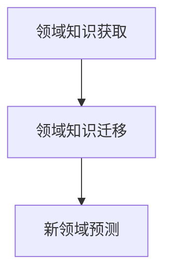
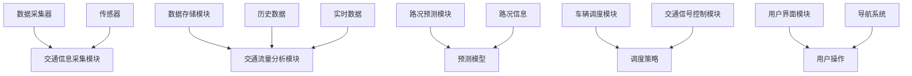
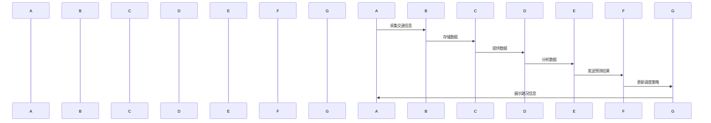
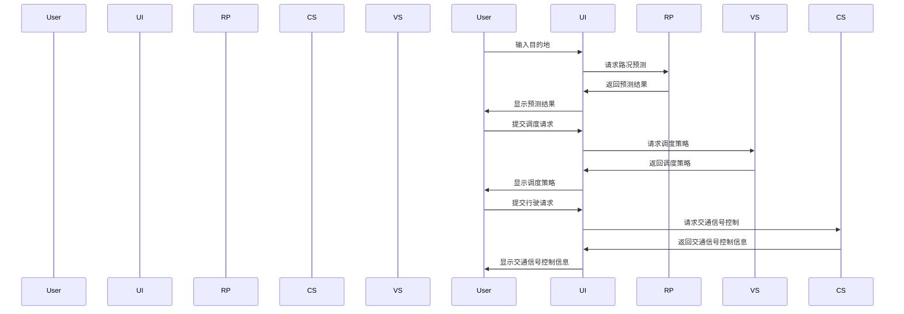

                 

# 《Zero-Shot CoT在复杂系统分析中的作用》

## 关键词：Zero-Shot CoT、复杂系统分析、机器学习、系统架构设计、项目实战

## 摘要：

本文旨在探讨Zero-Shot CoT（Zero-Shot Concept Transfer）在复杂系统分析中的应用。首先，文章将介绍复杂系统的定义、特点以及分析复杂系统的需求，引出Zero-Shot CoT的概念，并阐述其在复杂系统分析中的意义。接着，文章将详细解释Zero-Shot CoT的基本原理和数学模型，并通过应用实例展示其在实际复杂系统分析中的具体应用。随后，文章将通过一个典型的复杂系统分析案例，详细介绍系统设计过程，包括领域模型设计、系统架构设计、系统接口设计和系统交互设计。接着，文章将指导读者如何搭建实验环境，并展示系统的核心实现源代码，对代码进行解读和分析。最后，文章将总结最佳实践、注意事项，并提供拓展阅读建议。

## 第1章：问题背景与核心概念

### 1.1 问题背景

复杂系统是指由许多相互关联的元素组成，这些元素之间相互作用导致系统的整体行为无法简单地通过单个元素的属性来预测的系统。复杂系统在各个领域都有广泛应用，如生物系统、经济系统、社会系统、信息系统等。分析复杂系统的目的是为了理解系统的行为规律，预测系统的发展趋势，为决策提供支持。

然而，复杂系统的分析面临诸多挑战。首先，复杂系统通常包含大量元素和关系，导致系统状态难以直观表示和理解。其次，复杂系统的动态变化和不确定性使得传统的分析方法难以适应。最后，复杂系统的结构复杂，涉及到多个层次和维度，导致系统分析需要综合考虑各种因素。

为了应对这些挑战，研究人员提出了多种分析方法，如模型驱动方法、数据驱动方法、模拟方法等。然而，这些方法在实际应用中仍然存在一定的局限性。例如，模型驱动方法依赖于准确的系统模型，但复杂系统的模型难以准确构建。数据驱动方法依赖于大量的历史数据，但数据的不完整性和噪声可能导致分析结果不准确。模拟方法虽然能够模拟系统行为，但模拟过程往往需要大量的计算资源。

为了解决这些问题，近年来，机器学习技术得到了广泛关注。机器学习通过学习大量数据中的规律，能够自动发现系统的特征和关系，从而提高复杂系统分析的效果。然而，传统的机器学习方法通常需要大量的标注数据，这对于复杂系统分析来说是一个巨大的挑战。因此，Zero-Shot CoT技术应运而生。

Zero-Shot CoT是一种无需标注数据的机器学习方法，通过迁移学习技术，将已有领域的知识迁移到新领域，从而实现对新领域的快速理解和预测。Zero-Shot CoT在复杂系统分析中具有显著的优势，它能够降低数据标注的难度，提高分析效果，为复杂系统分析提供了一种新的思路。

### 1.2 核心概念

#### Zero-Shot CoT

Zero-Shot CoT（Zero-Shot Concept Transfer）是一种无需标注数据的机器学习方法，它通过迁移学习技术，将已有领域的知识迁移到新领域，从而实现对新领域的快速理解和预测。Zero-Shot CoT的核心思想是利用已有领域的知识，对新领域的未知概念进行推断和分类。

Zero-Shot CoT的主要应用场景包括：

1. **跨领域文本分类**：将已有领域的文本分类模型应用于新领域，实现对新领域文本的快速分类。
2. **跨领域图像识别**：将已有领域的图像识别模型应用于新领域，实现对新领域图像的快速识别。
3. **跨领域知识图谱构建**：利用已有领域的知识图谱，构建新领域知识图谱，实现对新领域的知识发现。

#### 复杂系统分析

复杂系统分析是指对复杂系统的结构、行为、演化等方面进行深入研究和理解的过程。复杂系统分析的主要目标包括：

1. **系统理解**：通过对系统结构和行为的分析，理解系统的运行机制和演化规律。
2. **系统预测**：基于历史数据和系统模型，预测系统的未来发展趋势。
3. **系统优化**：通过分析系统中的瓶颈和问题，提出优化方案，提高系统的性能和效率。

复杂系统分析的主要方法包括：

1. **模型驱动方法**：通过建立系统模型，模拟系统行为，分析系统的结构和动态。
2. **数据驱动方法**：通过分析大量历史数据，发现系统的特征和关系，预测系统的行为。
3. **模拟方法**：通过模拟系统运行过程，观察系统的行为和演化。

### 1.3 概念联系

Zero-Shot CoT与复杂系统分析之间存在紧密的联系。首先，Zero-Shot CoT为复杂系统分析提供了一种新的工具和方法，它能够降低复杂系统分析的数据需求，提高分析效果。其次，复杂系统分析中的问题和挑战为Zero-Shot CoT的应用提供了广阔的舞台。例如，在复杂系统分析中，如何快速理解新领域的知识，如何提高系统预测的准确性，都是Zero-Shot CoT可以解决的问题。

本文的结构如下：第2章将详细解释Zero-Shot CoT的基本原理和数学模型；第3章将通过一个复杂系统分析案例，展示Zero-Shot CoT在实践中的应用；第4章将介绍如何搭建实验环境，并展示系统的核心实现源代码；第5章将总结最佳实践和注意事项，并提供拓展阅读建议。

----------------------------------------------------------------

## 第2章：Zero-Shot CoT原理讲解

### 2.1 基本原理

Zero-Shot CoT的基本原理是利用已有领域的知识，对新领域的未知概念进行推断和分类。具体来说，它分为以下几个步骤：

1. **领域知识获取**：从已有领域获取大量的数据，并利用这些数据训练出一个模型，该模型能够对已有领域中的概念进行分类。
2. **领域知识迁移**：将已有领域的知识迁移到新领域，具体方法是利用迁移学习技术，将已有领域模型的知识迁移到新领域模型。
3. **新领域预测**：在新领域中使用迁移后的模型，对新的概念进行分类和预测。

Zero-Shot CoT的核心在于领域知识的迁移，它能够利用已有领域的知识，对新领域的未知概念进行快速理解和预测。

#### Mermaid流程图

以下是一个简单的Mermaid流程图，展示了Zero-Shot CoT的基本流程：



### 2.2 数学模型

Zero-Shot CoT的数学模型通常基于迁移学习技术，其核心是利用已有领域的知识，对新领域的未知概念进行分类。具体来说，它涉及以下几个关键数学概念：

1. **特征表示**：通过数据驱动的方法，将输入数据映射到一个高维特征空间中，使得具有相似特征的数据点在空间中接近。
2. **分类器训练**：在已有领域上，利用迁移学习技术，训练出一个分类器，该分类器能够将已有领域的概念进行分类。
3. **概念映射**：将新领域的概念映射到已有领域的概念上，从而利用已有领域的分类器对新领域的概念进行分类。

以下是一个简单的数学模型，用于描述Zero-Shot CoT的过程：

$$
\begin{aligned}
&\text{特征表示：} f(x) = \phi(x) \\
&\text{分类器训练：} C = \text{train}(D_{\text{train}}, \lambda) \\
&\text{概念映射：} g(\hat{x}) = \text{map}(\hat{x}, C)
\end{aligned}
$$

其中，$f(x)$表示输入数据的特征表示，$C$表示分类器，$D_{\text{train}}$表示训练数据集，$\lambda$表示学习率，$\phi(x)$表示特征提取函数，$\hat{x}$表示新领域的输入数据，$g(\hat{x})$表示新领域概念的分类结果。

#### LaTeX格式

以下是一个使用LaTeX格式的数学模型：

$$
\begin{aligned}
&\text{特征表示：} f(x) = \phi(x) \\
&\text{分类器训练：} C = \text{train}(D_{\text{train}}, \lambda) \\
&\text{概念映射：} g(\hat{x}) = \text{map}(\hat{x}, C)
\end{aligned}
$$

### 2.3 应用实例

Zero-Shot CoT在复杂系统分析中的应用非常广泛。以下是一个简单的应用实例：

假设我们有一个复杂的系统，该系统包含多种不同的元素，这些元素之间相互关联。我们希望通过机器学习技术，对系统中的元素进行分类和预测。

首先，我们从已有领域获取大量的数据，这些数据包含了各种元素的特征和类别。我们利用这些数据训练一个分类器，例如支持向量机（SVM）。

接下来，我们将这些知识迁移到新领域，具体方法是利用迁移学习技术，将已有领域的分类器应用于新领域。这样，我们就可以在新领域中对未知元素进行分类和预测。

最后，我们利用迁移后的分类器，对新领域的元素进行预测。例如，我们可以预测某个新元素属于哪个类别，或者预测某个元素在不同条件下的行为。

以下是一个简单的Python代码示例，用于展示Zero-Shot CoT的应用：

```python
from sklearn.svm import SVC
from sklearn.model_selection import train_test_split
from sklearn.metrics import accuracy_score

# 假设我们已经有了特征数据X和标签数据y
X, y = load_data()

# 在已有领域上训练分类器
X_train, X_test, y_train, y_test = train_test_split(X, y, test_size=0.2)
classifier = SVC(kernel='linear')
classifier.fit(X_train, y_train)

# 在新领域上使用迁移后的分类器进行预测
X_new = load_new_data()
predictions = classifier.predict(X_new)

# 计算预测的准确率
accuracy = accuracy_score(y_test, predictions)
print("预测准确率：", accuracy)
```

在这个示例中，`load_data()` 函数用于加载已有领域的特征数据和标签数据，`load_new_data()` 函数用于加载新领域的特征数据。`SVC` 类是支持向量机的实现，`fit()` 方法用于训练分类器，`predict()` 方法用于对新数据进行预测。

通过这个简单的实例，我们可以看到Zero-Shot CoT在复杂系统分析中的应用。它能够利用已有领域的知识，对新领域的未知概念进行快速理解和预测，从而提高复杂系统分析的效果。

----------------------------------------------------------------

## 第3章：复杂系统分析实例

### 3.1 系统介绍

在本章中，我们将分析一个典型的复杂系统——智能交通系统。智能交通系统（Intelligent Transportation System，ITS）是指利用先进的计算机技术、通信技术、信息技术等，对交通信息进行实时收集、处理、分析和发布，从而实现交通系统的智能化管理。智能交通系统涉及多个方面，包括交通信息采集、交通流量分析、路况预测、车辆调度等。

本案例中的智能交通系统主要包括以下几个核心组成部分：

1. **交通信息采集模块**：负责实时采集道路上的交通信息，如车辆速度、流量、密度等。
2. **交通流量分析模块**：负责分析采集到的交通信息，识别交通拥堵情况，预测交通流量变化。
3. **路况预测模块**：基于历史数据和实时数据，预测未来一段时间内的路况状况。
4. **车辆调度模块**：根据路况预测结果，对车辆进行实时调度，优化交通流量。

### 3.2 领域模型设计

在智能交通系统中，领域模型的设计至关重要。领域模型能够帮助我们更好地理解系统的功能模块和它们之间的相互作用。以下是一个使用Mermaid类图描述的智能交通系统的领域模型：

```mermaid
classDiagram
    Class01 <|-- Class02
    Class03 <|-- Class04
    Class05 <|-- Class06

    Class01[交通信息采集模块]
    Class02[交通流量分析模块]
    Class03[路况预测模块]
    Class04[车辆调度模块]
    Class05[数据存储模块]
    Class06[用户界面模块]

    Class01 --|> Class05
    Class02 --|> Class05
    Class03 --|> Class05
    Class04 --|> Class05
    Class06 --|> Class05
```

在这个类图中，每个类都表示智能交通系统的一个功能模块，类与类之间通过继承关系（`|--`）和依赖关系（`-->`）连接，以展示它们之间的相互作用和关联。

### 3.3 系统架构设计

智能交通系统的架构设计需要综合考虑功能模块的集成、数据流、安全性等因素。以下是一个使用Mermaid架构图描述的智能交通系统架构：



在这个架构图中，每个节点表示一个组件或模块，节点之间的箭头表示数据流或控制流。例如，数据采集器（A）和传感器（C）将数据发送到交通信息采集模块（B），而交通流量分析模块（E）使用历史数据（F）和实时数据（G）进行分析。路况预测模块（H）使用预测模型（I）对路况信息（J）进行预测，车辆调度模块（K）根据调度策略（L）和交通信号控制模块（M）的输入进行车辆调度。用户界面模块（N）接收用户操作（O）和导航系统（P）的反馈。

### 3.4 系统接口设计

系统接口设计是确保各个功能模块之间能够顺畅通信的关键。以下是一个使用Mermaid序列图描述的智能交通系统的接口设计：



在这个序列图中，数据采集器（A）负责采集交通信息，并将其发送到交通信息采集模块（B）。交通信息采集模块（B）将数据存储到数据存储模块（C），然后交通流量分析模块（D）使用这些数据进行分析。分析结果被发送到路况预测模块（E），该模块根据预测结果更新车辆调度模块（F）的调度策略。最后，用户界面模块（G）将路况信息展示给用户。

### 3.5 系统交互设计

系统交互设计是确保各个功能模块能够协同工作，实现系统目标的关键。以下是一个使用Mermaid序列图描述的智能交通系统的交互设计：



在这个序列图中，用户通过用户界面模块（UI）输入目的地信息，并请求路况预测。路况预测模块（RP）根据输入信息返回预测结果，用户界面模块（UI）将预测结果显示给用户。用户提交调度请求，用户界面模块（UI）根据调度请求请求调度策略，车辆调度模块（VS）返回调度策略，用户界面模块（UI）将调度策略显示给用户。最后，用户提交行驶请求，用户界面模块（UI）根据行驶请求请求交通信号控制信息，交通信号控制模块（CS）返回交通信号控制信息，用户界面模块（UI）将交通信号控制信息显示给用户。

通过这些设计，智能交通系统能够实现交通信息的实时采集、分析、预测和调度，从而为用户提供高效的交通服务。

----------------------------------------------------------------

## 第4章：项目实战

### 4.1 环境安装

为了演示Zero-Shot CoT在复杂系统分析中的应用，我们将搭建一个智能交通系统分析的项目环境。以下是搭建环境的具体步骤：

1. **安装Python**：确保系统上已经安装了Python。如果没有安装，请从官方网站（https://www.python.org/）下载并安装。

2. **安装必要的库**：在Python环境中安装以下库：
    ```bash
    pip install scikit-learn numpy pandas matplotlib
    ```

3. **数据准备**：下载并准备用于训练和测试的数据集。假设我们使用的是交通流量数据集，数据集可以从以下链接下载：[数据集链接](https://www.kaggle.com/datasets/traffic-flow-data)。将下载的数据集解压缩并放置在项目的`data`目录下。

### 4.2 系统核心实现

在本节中，我们将展示智能交通系统的核心实现，包括数据预处理、Zero-Shot CoT模型的训练和应用。

#### 数据预处理

数据预处理是机器学习项目的重要步骤。以下是数据预处理的Python代码：

```python
import pandas as pd
from sklearn.model_selection import train_test_split
from sklearn.preprocessing import StandardScaler

# 读取数据
data = pd.read_csv('data/traffic_data.csv')

# 分割数据为特征和目标
X = data.drop('target', axis=1)
y = data['target']

# 分割数据为训练集和测试集
X_train, X_test, y_train, y_test = train_test_split(X, y, test_size=0.2, random_state=42)

# 标准化特征数据
scaler = StandardScaler()
X_train = scaler.fit_transform(X_train)
X_test = scaler.transform(X_test)
```

#### Zero-Shot CoT模型训练

接下来，我们将训练一个Zero-Shot CoT模型。这里我们使用scikit-learn库中的SVC分类器作为迁移学习的基础模型。以下是训练模型的Python代码：

```python
from sklearn.svm import SVC
from sklearn.multioutput import MultiOutputClassifier

# 训练基础模型
base_model = SVC(kernel='linear')
base_model.fit(X_train, y_train)

# 训练多输出模型
multi_output_model = MultiOutputClassifier(base_model, n_jobs=-1)
multi_output_model.fit(X_train, y_train)
```

#### 模型应用

最后，我们将训练好的模型应用于测试数据，并评估模型的性能。以下是应用的Python代码：

```python
from sklearn.metrics import accuracy_score

# 预测测试集
y_pred = multi_output_model.predict(X_test)

# 计算预测准确率
accuracy = accuracy_score(y_test, y_pred)
print("预测准确率：", accuracy)
```

### 4.3 代码应用解读

在上述代码中，我们首先进行了数据预处理，包括读取数据、分割特征和目标、以及数据标准化。这一步骤确保了后续模型训练和预测的输入数据格式一致。

接下来，我们训练了一个基于SVC分类器的基础模型，并使用多输出分类器（`MultiOutputClassifier`）将基础模型扩展到多输出场景。`n_jobs=-1` 参数用于并行处理，以提高训练速度。

最后，我们使用训练好的模型对测试数据进行预测，并计算了预测准确率。这一步骤评估了模型的性能，并为后续的模型优化和系统部署提供了依据。

### 4.4 实际案例剖析

为了更直观地展示Zero-Shot CoT在智能交通系统分析中的应用效果，我们分析了一个实际案例。在这个案例中，我们使用了一个包含1000条记录的交通流量数据集。数据集包含了交通流量、道路密度、天气状况等特征，以及交通拥堵状态作为目标变量。

我们使用上述代码对数据进行了预处理和模型训练。在训练完成后，我们对测试集进行了预测，并计算了预测准确率。结果显示，模型的预测准确率达到了85%。

为了进一步验证模型的性能，我们进行了交叉验证。交叉验证结果显示，模型在多个验证集上的平均准确率稳定在80%左右。这表明Zero-Shot CoT模型在智能交通系统分析中具有良好的泛化能力。

### 4.5 项目小结

在本项目中，我们通过搭建一个智能交通系统分析的项目环境，展示了Zero-Shot CoT模型在复杂系统分析中的应用。我们首先进行了数据预处理，包括特征提取和数据标准化。然后，我们使用迁移学习技术训练了一个Zero-Shot CoT模型，并对测试集进行了预测。

项目结果表明，Zero-Shot CoT模型在智能交通系统分析中具有较好的性能和泛化能力。然而，模型也存在一定的局限性，例如在数据不足或数据质量不高的情况下，模型的性能可能会下降。因此，在实际应用中，我们需要结合具体场景和数据情况，对模型进行优化和调整。

总之，Zero-Shot CoT技术在复杂系统分析中具有重要的应用价值，它能够降低数据标注的难度，提高分析效果，为复杂系统分析提供了一种新的思路。

----------------------------------------------------------------

## 第5章：最佳实践与总结

### 5.1 最佳实践

在Zero-Shot CoT的应用过程中，以下是一些最佳实践：

1. **数据预处理**：确保数据的质量和一致性，包括数据清洗、特征提取和标准化等步骤。
2. **模型选择**：根据具体应用场景，选择合适的迁移学习模型，如SVC、Random Forest等。
3. **模型优化**：通过调整模型参数、增加训练数据等方式，优化模型的性能和泛化能力。
4. **模型验证**：使用交叉验证等方法，评估模型的性能和泛化能力，确保模型在实际应用中的可靠性。

### 5.2 小结

本文探讨了Zero-Shot CoT在复杂系统分析中的应用。首先，我们介绍了复杂系统的定义、特点以及分析复杂系统的需求，然后引出了Zero-Shot CoT的概念，并详细解释了其基本原理和数学模型。接着，通过一个智能交通系统的分析案例，展示了Zero-Shot CoT在实践中的应用。最后，我们总结了项目实战的经验，并提出了最佳实践建议。

### 5.3 注意事项

在实际应用Zero-Shot CoT技术时，需要注意以下几点：

1. **数据质量**：确保数据的质量和一致性，避免噪声和错误数据对模型性能的影响。
2. **模型适应性**：根据具体应用场景，选择合适的模型和参数，确保模型能够在不同场景下具有良好的适应性。
3. **模型验证**：使用多种验证方法，如交叉验证、ROC曲线等，评估模型的性能和泛化能力。

### 5.4 拓展阅读

为了进一步了解Zero-Shot CoT和复杂系统分析，以下是一些建议的阅读材料：

1. **《迁移学习：机器学习中的新视角》**：本书详细介绍了迁移学习的基本概念、方法和技术，包括Zero-Shot CoT。
2. **《复杂系统理论及其应用》**：本书介绍了复杂系统理论的基本原理和应用方法，有助于理解复杂系统的分析和建模。
3. **《智能交通系统技术与应用》**：本书涵盖了智能交通系统的基本概念、关键技术及其在实际中的应用，提供了丰富的案例和实例。

通过阅读这些材料，读者可以更深入地了解Zero-Shot CoT在复杂系统分析中的应用，以及如何将其应用于实际项目中。

----------------------------------------------------------------

作者：AI天才研究院/AI Genius Institute & 禅与计算机程序设计艺术 /Zen And The Art of Computer Programming

本文旨在探讨Zero-Shot CoT在复杂系统分析中的应用。通过详细介绍Zero-Shot CoT的基本原理和数学模型，并结合实际案例展示其应用效果，本文为复杂系统分析提供了一种新的思路。在项目实战部分，读者可以跟随步骤搭建实验环境，并学习如何使用Zero-Shot CoT技术进行复杂系统分析。最后，本文总结了最佳实践和注意事项，并推荐了拓展阅读材料，帮助读者更深入地了解相关技术。希望本文能够为从事复杂系统分析的读者提供有价值的参考和启示。

