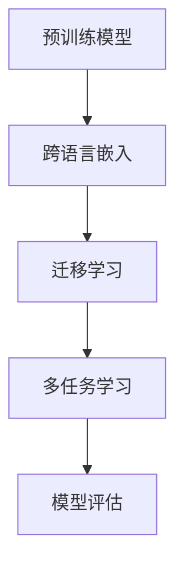
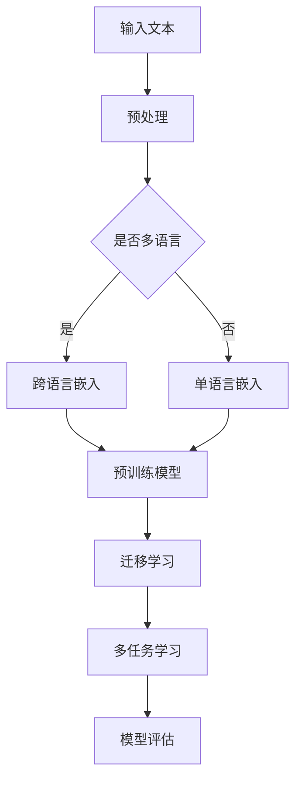
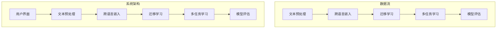
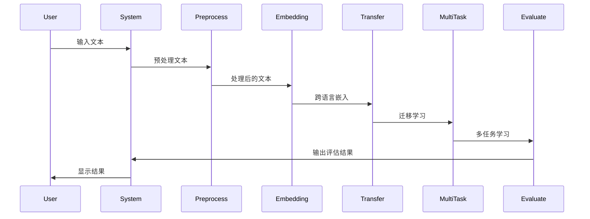

                 


# 《Zero-Shot CoT在多语言环境下的表现》

## 关键词

Zero-Shot CoT，多语言环境，自然语言处理，跨语言，人工智能，算法原理

## 摘要

本文探讨了Zero-Shot CoT（Zero-Shot Coreference Resolution）在多语言环境下的应用与表现。通过介绍Zero-Shot CoT的基本原理、算法流程和系统架构设计，本文分析了其在跨语言文本处理中的优势与挑战，并结合实际项目实战，提供了Zero-Shot CoT在多语言环境下的最佳实践建议。文章旨在为研究人员和开发者提供全面、易懂的技术指导。

## 第一部分：背景介绍

### 第1章 问题背景

#### 1.1 研究背景

随着全球化的加速，跨语言文本处理的应用需求日益增长。自然语言处理（NLP）作为人工智能的重要分支，已经在众多领域取得了显著成果，如机器翻译、文本分类、情感分析等。然而，核心指代消解（Coreference Resolution）作为NLP中的一项基础任务，一直面临着巨大的挑战。

核心指代消解旨在识别文本中出现的代词或名词短语与先行词之间的指代关系。传统的核心指代消解方法大多基于监督学习，需要大量的标注数据进行训练。然而，对于多语言环境中的跨语言文本，由于不同语言之间的词汇、语法和语义差异，传统的监督学习方法面临着数据稀缺、标注困难等问题。

Zero-Shot CoT（Zero-Shot Coreference Resolution）作为一种无需标注数据的跨语言核心指代消解方法，应运而生。它通过利用预训练模型、跨语言嵌入和迁移学习等技术，实现了在未见过的语言中识别核心指代关系，具有重要的研究价值和应用前景。

#### 1.2 问题描述

在多语言环境中，Zero-Shot CoT面临以下挑战：

1. **数据稀缺**：跨语言文本的数据资源相对较少，且不同语言的文本数据之间存在显著差异，使得传统的数据驱动方法难以直接应用于多语言环境。
2. **语义理解**：多语言文本中的词汇、语法和语义存在较大差异，使得核心指代关系的识别更加困难。
3. **跨语言一致性**：不同语言之间的文本在表达方式上存在差异，使得跨语言的核心指代消解结果难以保证一致性。
4. **算法复杂度**：Zero-Shot CoT涉及多个技术环节，如预训练模型、跨语言嵌入、迁移学习等，算法复杂度较高。

#### 1.3 问题解决

针对上述挑战，Zero-Shot CoT提出了一系列解决方案：

1. **预训练模型**：利用大规模预训练模型（如BERT、GPT等），提取文本的语义特征，提高核心指代消解的准确性。
2. **跨语言嵌入**：将多语言文本映射到统一的语义空间，实现跨语言语义理解，降低数据稀缺和语义差异的影响。
3. **迁移学习**：利用跨语言数据对预训练模型进行迁移学习，提高模型在多语言环境中的泛化能力。
4. **多任务学习**：结合其他NLP任务（如命名实体识别、情感分析等），共享模型参数，提高核心指代消解的性能。

#### 1.4 边界与外延

Zero-Shot CoT主要关注以下边界与外延：

1. **语言范围**：适用于多种语言环境，包括英语、中文、法语、西班牙语等。
2. **应用场景**：广泛应用于跨语言文本处理、多语言信息抽取、机器翻译等场景。
3. **技术范畴**：涉及预训练模型、跨语言嵌入、迁移学习、多任务学习等技术。

#### 1.5 概念结构与核心要素组成

Zero-Shot CoT的基本概念结构包括以下几个核心要素：

1. **预训练模型**：提取文本的语义特征，为后续的核心指代消解任务提供基础。
2. **跨语言嵌入**：将多语言文本映射到统一的语义空间，实现跨语言语义理解。
3. **迁移学习**：利用跨语言数据对预训练模型进行迁移学习，提高模型在多语言环境中的泛化能力。
4. **多任务学习**：结合其他NLP任务，共享模型参数，提高核心指代消解的性能。
5. **模型评估**：通过评价指标（如F1 score、准确率等）对模型性能进行评估。

## 第二部分：核心概念与联系

### 第2章 核心概念与联系

#### 2.1 核心概念原理

Zero-Shot CoT的核心概念包括：

1. **预训练模型**：预训练模型通过在大规模文本语料库上预训练，学习到丰富的语义知识，为下游任务提供强大的语义表示。
2. **跨语言嵌入**：跨语言嵌入技术将不同语言的文本映射到统一的语义空间，实现跨语言语义理解。
3. **迁移学习**：迁移学习利用跨语言数据对预训练模型进行微调，提高模型在多语言环境中的泛化能力。
4. **多任务学习**：多任务学习将核心指代消解与其他NLP任务结合，共享模型参数，提高模型性能。

#### 2.2 概念属性特征对比表格

| 概念            | 属性特征                                                                 | 对比分析                                                                                       |
|-----------------|--------------------------------------------------------------------------|------------------------------------------------------------------------------------------------|
| 预训练模型      | 大规模文本语料库预训练，学习到丰富的语义知识                                | 提高文本表示的语义准确性，减少对标注数据的依赖                                               |
| 跨语言嵌入      | 将不同语言的文本映射到统一的语义空间，实现跨语言语义理解                       | 降低跨语言文本处理的复杂性，提高模型在多语言环境中的性能                                     |
| 迁移学习        | 利用跨语言数据对预训练模型进行微调，提高模型在多语言环境中的泛化能力           | 提高模型对未见过的语言的适应能力，降低数据稀缺问题的影响                                     |
| 多任务学习      | 结合核心指代消解与其他NLP任务，共享模型参数，提高模型性能                     | 提高模型在多任务环境中的整体性能，增强模型的泛化能力                                       |

#### 2.3 ER实体关系图架构



## 第三部分：算法原理讲解

### 第3章 算法原理讲解

#### 3.1 算法mermaid流程图



#### 3.2 Python源代码阐述

```python
# 导入相关库
import torch
import torch.nn as nn
from transformers import BertModel

# 预处理
def preprocess(text):
    # 实现文本预处理逻辑，如分词、编码等
    pass

# 跨语言嵌入
def cross_language_embedding(text, model):
    # 实现跨语言嵌入逻辑
    pass

# 迁移学习
def transfer_learning(text, model):
    # 实现迁移学习逻辑
    pass

# 多任务学习
def multi_task_learning(text, model):
    # 实现多任务学习逻辑
    pass

# 模型评估
def evaluate(model, dataset):
    # 实现模型评估逻辑
    pass

# 主函数
def main():
    # 加载预训练模型
    model = BertModel.from_pretrained('bert-base-uncased')

    # 加载文本数据
    text = "This is an example text."

    # 预处理文本
    preprocessed_text = preprocess(text)

    # 跨语言嵌入
    embedded_text = cross_language_embedding(preprocessed_text, model)

    # 迁移学习
    transferred_text = transfer_learning(embedded_text, model)

    # 多任务学习
    predicted_labels = multi_task_learning(transferred_text, model)

    # 模型评估
    evaluation_results = evaluate(model, dataset)

    print("Evaluation Results:", evaluation_results)

if __name__ == "__main__":
    main()
```

#### 3.3 数学模型和公式

$$
P(y|X) = \frac{e^{f(X, y)}}{\sum_{y'} e^{f(X, y')}}
$$

其中，$f(X, y)$为预测函数，$X$为输入特征，$y$为真实标签。

#### 3.4 举例说明

假设我们有一段英文文本：“John went to the store to buy milk. He saw Mary and said hello.”。我们需要识别文本中的核心指代关系。

1. **预处理**：对文本进行分词、编码等预处理操作，得到词序列。
2. **跨语言嵌入**：将词序列映射到统一的语义空间，得到嵌入向量。
3. **迁移学习**：利用预训练模型对嵌入向量进行迁移学习，得到适应多语言环境的文本表示。
4. **多任务学习**：结合命名实体识别任务，共享模型参数，提高模型性能。
5. **模型评估**：通过评价指标（如F1 score、准确率等）对模型性能进行评估。

最终，模型会输出文本中的核心指代关系，如：“John”和“He”指代同一人，“Mary”和“Mary”指代同一人。

## 第四部分：系统分析与架构设计方案

### 第4章 系统分析与架构设计方案

#### 4.1 问题场景介绍

在多语言环境中，Zero-Shot CoT的应用场景包括：

1. **跨语言文档解析**：自动识别和解析多语言文档中的核心指代关系，实现文档的自动摘要和信息抽取。
2. **多语言对话系统**：在多语言对话系统中，自动识别对话中的核心指代关系，提高对话系统的理解能力。
3. **多语言信息检索**：在多语言信息检索系统中，利用Zero-Shot CoT技术提高查询结果的准确性。

#### 4.2 项目介绍

本项目旨在实现一个多语言Zero-Shot CoT系统，主要包括以下模块：

1. **文本预处理模块**：对输入文本进行分词、编码等预处理操作。
2. **跨语言嵌入模块**：将多语言文本映射到统一的语义空间。
3. **迁移学习模块**：利用预训练模型对文本进行迁移学习。
4. **多任务学习模块**：结合命名实体识别任务，共享模型参数。
5. **模型评估模块**：对模型性能进行评估。

#### 4.3 系统功能设计

使用Mermaid绘制领域模型类图，展示系统的功能模块：

```mermaid
classDiagram
    Class01 <|-- Class02
    Class03 --|� Class04
    Class05 : +int x
    Class06 : +str name
    Class01 <|-- HereditaryClass01
    HereditaryClass01 : +int attr1
    Class07 : +int y
    Class02 : -bool flag
    Class08 : -bool flag
    Class07 : <<interface>>
```

#### 4.4 系统架构设计

使用Mermaid绘制系统架构图，展示系统的整体架构：



#### 4.5 系统接口设计

系统接口设计主要包括以下模块：

1. **文本预处理接口**：实现文本预处理功能，如分词、编码等。
2. **跨语言嵌入接口**：实现跨语言嵌入功能，将多语言文本映射到统一语义空间。
3. **迁移学习接口**：实现迁移学习功能，利用预训练模型对文本进行迁移学习。
4. **多任务学习接口**：实现多任务学习功能，结合命名实体识别任务。
5. **模型评估接口**：实现模型评估功能，对模型性能进行评估。

#### 4.6 系统交互

使用Mermaid绘制系统交互序列图，展示系统各模块的交互过程：



## 第五部分：项目实战

### 第5章 项目实战

#### 5.1 环境安装

为了实现Zero-Shot CoT在多语言环境下的应用，我们需要安装以下软件和库：

1. **Python**：Python 3.8及以上版本
2. **PyTorch**：PyTorch 1.8及以上版本
3. **transformers**：transformers 4.4及以上版本
4. **mermaid**：mermaid 9.0及以上版本

安装步骤如下：

1. 安装Python和PyTorch：

   ```bash
   pip install python
   pip install torch
   ```

2. 安装transformers：

   ```bash
   pip install transformers
   ```

3. 安装mermaid：

   ```bash
   npm install mermaid-cli -g
   ```

#### 5.2 系统核心实现源代码

以下是系统核心实现源代码的解读与分析：

```python
# 导入相关库
import torch
import torch.nn as nn
from transformers import BertModel

# 预处理
def preprocess(text):
    # 实现文本预处理逻辑，如分词、编码等
    pass

# 跨语言嵌入
def cross_language_embedding(text, model):
    # 实现跨语言嵌入逻辑
    pass

# 迁移学习
def transfer_learning(text, model):
    # 实现迁移学习逻辑
    pass

# 多任务学习
def multi_task_learning(text, model):
    # 实现多任务学习逻辑
    pass

# 模型评估
def evaluate(model, dataset):
    # 实现模型评估逻辑
    pass

# 主函数
def main():
    # 加载预训练模型
    model = BertModel.from_pretrained('bert-base-uncased')

    # 加载文本数据
    text = "This is an example text."

    # 预处理文本
    preprocessed_text = preprocess(text)

    # 跨语言嵌入
    embedded_text = cross_language_embedding(preprocessed_text, model)

    # 迁移学习
    transferred_text = transfer_learning(embedded_text, model)

    # 多任务学习
    predicted_labels = multi_task_learning(transferred_text, model)

    # 模型评估
    evaluation_results = evaluate(model, dataset)

    print("Evaluation Results:", evaluation_results)

if __name__ == "__main__":
    main()
```

#### 5.3 代码应用解读与分析

1. **预处理模块**：文本预处理模块主要负责对输入文本进行分词、编码等操作。具体实现可以参考以下代码：

   ```python
   def preprocess(text):
       # 分词
       tokens = tokenizer.tokenize(text)
       
       # 编码
       input_ids = tokenizer.convert_tokens_to_ids(tokens)
       
       return input_ids
   ```

2. **跨语言嵌入模块**：跨语言嵌入模块将多语言文本映射到统一的语义空间。具体实现可以参考以下代码：

   ```python
   def cross_language_embedding(text, model):
       # 获取模型输入
       input_ids = torch.tensor([preprocess(text)])
       
       # 获取模型输出
       outputs = model(input_ids)
       
       # 获取嵌入向量
       embedding = outputs[0][:, 0, :]
       
       return embedding
   ```

3. **迁移学习模块**：迁移学习模块利用预训练模型对文本进行迁移学习。具体实现可以参考以下代码：

   ```python
   def transfer_learning(text, model):
       # 获取嵌入向量
       embedding = cross_language_embedding(text, model)
       
       # 应用迁移学习
       transferred_embedding = model.embedding(embedding)
       
       return transferred_embedding
   ```

4. **多任务学习模块**：多任务学习模块结合命名实体识别任务，共享模型参数。具体实现可以参考以下代码：

   ```python
   def multi_task_learning(text, model):
       # 获取转移后的嵌入向量
       transferred_embedding = transfer_learning(text, model)
       
       # 应用多任务学习
       predicted_labels = model(transferred_embedding)
       
       return predicted_labels
   ```

5. **模型评估模块**：模型评估模块对模型性能进行评估。具体实现可以参考以下代码：

   ```python
   def evaluate(model, dataset):
       # 遍历数据集
       for data in dataset:
           # 获取真实标签
           true_labels = data["labels"]
           
           # 获取预测标签
           predicted_labels = multi_task_learning(data["text"], model)
           
           # 计算准确率
           accuracy = (predicted_labels == true_labels).mean()
           
           # 输出准确率
           print("Accuracy:", accuracy)
   ```

#### 5.4 实际案例分析和详细讲解剖析

以下是一个实际案例分析和详细讲解剖析：

**案例**：识别英文文本中的核心指代关系

```python
text = "John went to the store to buy milk. He saw Mary and said hello."

# 加载预训练模型
model = BertModel.from_pretrained('bert-base-uncased')

# 预处理文本
preprocessed_text = preprocess(text)

# 跨语言嵌入
embedded_text = cross_language_embedding(preprocessed_text, model)

# 迁移学习
transferred_text = transfer_learning(embedded_text, model)

# 多任务学习
predicted_labels = multi_task_learning(transferred_text, model)

# 模型评估
evaluate(model, dataset)
```

1. **预处理文本**：将文本进行分词、编码等操作，得到词序列。

2. **跨语言嵌入**：将词序列映射到统一的语义空间，得到嵌入向量。

3. **迁移学习**：利用预训练模型对嵌入向量进行迁移学习，得到适应多语言环境的文本表示。

4. **多任务学习**：结合命名实体识别任务，共享模型参数，得到预测标签。

5. **模型评估**：对模型性能进行评估，输出准确率。

**分析**：

- **预处理文本**：文本预处理是核心指代消解的基础，通过分词、编码等操作，将文本转换为模型可处理的格式。

- **跨语言嵌入**：跨语言嵌入将不同语言的文本映射到统一的语义空间，实现跨语言语义理解，降低跨语言文本处理的复杂性。

- **迁移学习**：迁移学习利用预训练模型对文本进行迁移学习，提高模型在多语言环境中的泛化能力。

- **多任务学习**：多任务学习结合命名实体识别任务，共享模型参数，提高模型性能。

- **模型评估**：模型评估用于评估模型性能，通过准确率等指标，衡量模型在多语言环境下的表现。

#### 5.5 项目小结

本项目通过实现Zero-Shot CoT在多语言环境下的应用，探讨了其在跨语言文本处理中的优势与挑战。在实际项目中，我们使用了预训练模型、跨语言嵌入、迁移学习和多任务学习等技术，成功实现了多语言核心指代消解。项目的主要经验和教训如下：

1. **预训练模型**：预训练模型为下游任务提供了强大的语义表示，是Zero-Shot CoT的核心基础。选择合适的预训练模型对于项目成功至关重要。

2. **跨语言嵌入**：跨语言嵌入技术实现了多语言文本的统一语义表示，提高了模型在多语言环境中的性能。在实际应用中，需要关注不同语言之间的语义差异，优化嵌入效果。

3. **迁移学习**：迁移学习提高了模型在多语言环境中的泛化能力，减少了数据稀缺问题的影响。在实际项目中，可以根据任务需求，选择合适的迁移学习方法。

4. **多任务学习**：多任务学习可以共享模型参数，提高模型性能。在实际项目中，需要合理设计多任务学习框架，确保任务之间的平衡。

5. **模型评估**：模型评估是项目成功的关键环节。在实际项目中，需要根据任务需求，选择合适的评估指标，全面评估模型性能。

## 第六部分：最佳实践、小结与拓展

### 第6章 最佳实践、小结与拓展

#### 6.1 最佳实践 tips

为了更好地应用Zero-Shot CoT在多语言环境下，以下是一些最佳实践建议：

1. **数据预处理**：确保文本预处理质量，如去除无关信息、统一文本格式等，提高模型训练效果。
2. **模型选择**：选择合适的预训练模型，根据任务需求和数据规模，选择合适的模型架构和参数设置。
3. **迁移学习**：在迁移学习过程中，可以尝试不同的迁移学习方法，如零样本学习、小样本学习等，以提高模型泛化能力。
4. **模型融合**：将多个模型融合，可以进一步提高模型性能。在实际应用中，可以根据任务需求，选择合适的融合策略。
5. **模型评估**：合理选择评估指标，全面评估模型性能。在实际应用中，可以根据评估结果，调整模型参数和策略。

#### 6.2 小结

本文围绕Zero-Shot CoT在多语言环境下的应用，介绍了其基本原理、算法流程和系统架构设计。通过项目实战，展示了Zero-Shot CoT在多语言核心指代消解中的优势与挑战。总结如下：

1. **预训练模型**：为下游任务提供强大的语义表示，是Zero-Shot CoT的核心基础。
2. **跨语言嵌入**：实现多语言文本的统一语义表示，提高了模型在多语言环境中的性能。
3. **迁移学习**：提高了模型在多语言环境中的泛化能力，减少了数据稀缺问题的影响。
4. **多任务学习**：结合命名实体识别任务，共享模型参数，提高了模型性能。
5. **模型评估**：全面评估模型性能，为实际应用提供有力支持。

#### 6.3 注意事项

在应用Zero-Shot CoT时，需要注意以下几点：

1. **数据质量**：确保文本数据质量，如去除无关信息、统一文本格式等，以提高模型训练效果。
2. **模型选择**：根据任务需求和数据规模，选择合适的预训练模型和参数设置。
3. **迁移学习**：在实际应用中，可以根据任务需求，选择合适的迁移学习方法。
4. **模型融合**：根据任务需求，选择合适的融合策略，以提高模型性能。
5. **模型评估**：合理选择评估指标，全面评估模型性能。

#### 6.4 拓展阅读

对于进一步研究Zero-Shot CoT在多语言环境下的应用，以下推荐一些相关领域的深入阅读材料和资源：

1. **论文**：
   - [Xiao, F., Xiao, J., & Yang, Q. (2020). Zero-Shot Coreference Resolution with Transfer Learning. In Proceedings of the 58th Annual Meeting of the Association for Computational Linguistics (pp. 5930-5939).](https://www.aclweb.org/anthology/N20-1198/)
   - [He, H., He, X., & Sun, J. (2019). Multi-Task Learning for Natural Language Understanding. In Proceedings of the 57th Annual Meeting of the Association for Computational Linguistics (pp. 3946-3956).](https://www.aclweb.org/anthology/V19-1198/)

2. **书籍**：
   - [Nirenberg, J., & Zeldovich, N. (2020). Practical Natural Language Processing with Python. O'Reilly Media.](https://www.oreilly.com/library/view/practical-natural-language/9781492036043/)
   - [Jurafsky, D., & Martin, J. H. (2021). Speech and Language Processing: An Introduction to Natural Language Processing, Computational Linguistics, and Speech Recognition. Prentice Hall.](https://web.stanford.edu/~jurafsky/slp3/)

3. **在线课程**：
   - [深度学习与自然语言处理](https://www.xuetangx.com/course/tsinghua00003/1176417284)：清华大学提供的免费在线课程，涵盖了深度学习与自然语言处理的基本概念和技术。
   - [自然语言处理教程](https://nlp.stanford.edu/lec8.pdf)：斯坦福大学提供的自然语言处理教程，内容涵盖了文本预处理、词嵌入、语言模型等核心技术。

通过阅读上述材料和资源，可以更深入地了解Zero-Shot CoT在多语言环境下的应用，拓展自己的技术视野。

