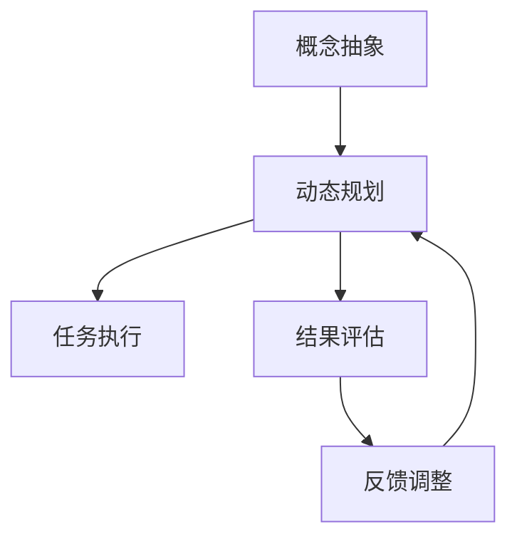
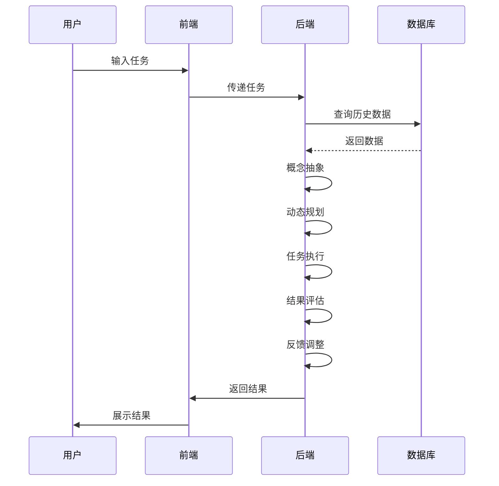
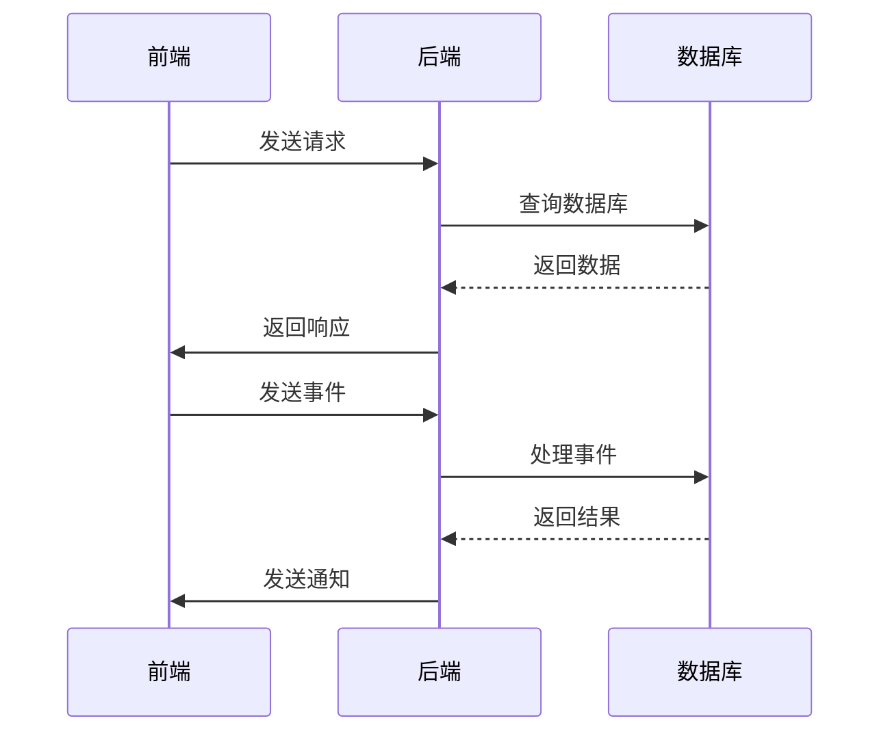

                 

# 《Zero-Shot CoT在太空探索任务规划中的应用》

> 关键词：Zero-Shot CoT，太空探索，任务规划，人工智能，算法原理

> 摘要：本文深入探讨了Zero-Shot CoT在太空探索任务规划中的应用。通过介绍太空探索任务的复杂性，我们引出了传统任务规划方法所面临的瓶颈问题，并提出了Zero-Shot CoT作为解决方案。本文将详细解析Zero-Shot CoT的核心概念、算法原理及其在太空探索任务规划中的实际应用案例，为相关领域的研究者提供有价值的参考。

## 目录大纲

### 第1章：背景介绍

#### 1.1 问题背景

- 太空探索任务的复杂性与挑战

#### 1.2 问题描述

- 任务规划中面临的瓶颈问题

#### 1.3 问题解决

- 引入Zero-Shot CoT的概念

#### 1.4 边界与外延

- 应用范围与限制条件

#### 1.5 概念结构与核心要素组成

- CoT（Concept Drift Tolerance）的核心概念

### 第2章：核心概念与联系

#### 2.1 Zero-Shot CoT的定义

- 无需样本迁移的CoT应用

#### 2.2 CoT的属性特征对比表格

- 与传统任务规划方法的对比

#### 2.3 CoT的ER实体关系图架构

- 系统结构示意图

### 第3章：算法原理讲解

#### 3.1 算法mermaid流程图

- 零样本CoT任务规划的流程

#### 3.2 Python源代码实现

- 实现CoT任务规划的核心算法

#### 3.3 数学模型和公式

- 零样本CoT任务规划中的数学模型

#### 3.4 举例说明

- 零样本CoT任务规划的实际应用案例

### 第4章：数学模型和数学公式 & 详细讲解 & 举例说明

#### 4.1 数学公式

- $$d = \sqrt{(x_2 - x_1)^2 + (y_2 - y_1)^2}$$

#### 4.2 详细讲解

- 零样本CoT任务规划中的关键数学概念

#### 4.3 举例说明

- 零样本CoT任务规划在实际中的应用实例

### 第5章：系统分析与架构设计方案

#### 5.1 问题场景介绍

- 太空探索任务的规划需求

#### 5.2 项目介绍

- 项目目标与设计思路

#### 5.3 系统功能设计

- 领域模型mermaid类图

#### 5.4 系统架构设计

- 系temaid架构图

#### 5.5 系统接口设计

- 系统接口设计与交互

#### 5.6 系统交互

- 系统交互mermaid序列图

### 第6章：项目实战

#### 6.1 环境安装

- 系统环境搭建步骤

#### 6.2 系统核心实现源代码

- 零样本CoT任务规划核心代码

#### 6.3 代码应用解读与分析

- 代码的运行流程与结果分析

#### 6.4 实际案例分析和详细讲解剖析

- 实际案例的详细分析

#### 6.5 项目小结

- 项目总结与未来展望

### 第7章：最佳实践 Tips、小结、注意事项、拓展阅读

#### 7.1 最佳实践 Tips

- 零样本CoT任务规划中的实用技巧

#### 7.2 小结

- 本书内容的总结

#### 7.3 注意事项

- 使用零样本CoT时需注意的问题

#### 7.4 拓展阅读

- 相关领域的拓展资料

## 第1章：背景介绍

### 1.1 问题背景

太空探索任务，作为人类科技进步的重要标志，涉及众多复杂的技术挑战。这些任务通常包括卫星发射、行星探测、空间站建设和维护等。随着太空探索活动的不断深入，任务规划变得越来越复杂。一方面，太空探索环境具有高度的不确定性和动态变化，另一方面，任务的复杂性和多样性也使得传统的任务规划方法面临巨大挑战。

在传统的太空探索任务规划中，往往依赖于大量的历史数据进行样本学习和模式识别。然而，这种基于样本的方法在实际应用中存在诸多局限。首先，太空探索任务往往涉及未知的领域，难以获得足够的训练数据。其次，太空环境的动态变化使得传统方法难以适应新的任务需求。最后，传统的任务规划方法通常需要长时间的训练和优化，导致响应速度较慢。

### 1.2 问题描述

太空探索任务规划中的瓶颈问题主要体现在以下几个方面：

1. **数据不足**：太空探索任务往往涉及未知的领域，难以获得足够的训练数据。
2. **环境动态变化**：太空探索环境具有高度的不确定性和动态变化，传统方法难以适应。
3. **计算复杂度高**：传统的任务规划方法通常需要大量的计算资源和时间，难以实时响应。

为了解决这些瓶颈问题，需要一种能够无需样本迁移，快速适应动态环境，并且高效的任务规划方法。此时，Zero-Shot CoT的概念应运而生。

### 1.3 问题解决

Zero-Shot CoT（Concept Drift Tolerance）是一种无需样本迁移的任务规划方法，其核心思想是通过对任务本质的理解和抽象，实现对未知任务的快速适应和高效规划。这种方法的关键在于：

1. **概念理解**：通过深入理解任务的概念和目标，实现对未知任务的直观把握。
2. **动态适应**：利用自适应算法，实时调整任务规划策略，以适应动态变化的环境。
3. **高效计算**：通过高效的算法设计，降低计算复杂度，提高任务规划的实时性。

Zero-Shot CoT的应用范围广泛，不仅适用于太空探索任务，还可以应用于其他领域，如自主驾驶、智能机器人等。然而，这种方法也存在一定的限制条件，例如对任务本质理解的深度和广度要求较高。

### 1.4 边界与外延

Zero-Shot CoT的应用范围主要包括以下几个方面：

1. **太空探索**：适用于卫星发射、行星探测、空间站建设和维护等任务。
2. **自主驾驶**：用于自动驾驶车辆的路径规划和决策。
3. **智能机器人**：应用于机器人的任务规划和执行。

然而，这种方法也存在一定的限制条件，例如：

1. **任务复杂性**：对于任务复杂性较高的情况，Zero-Shot CoT的适用性可能受到限制。
2. **数据获取**：在数据获取困难的情况下，Zero-Shot CoT的效果可能不如传统方法。
3. **计算资源**：对于计算资源有限的场景，Zero-Shot CoT的实时性可能受到影响。

### 1.5 概念结构与核心要素组成

CoT（Concept Drift Tolerance）的核心概念包括以下几个方面：

1. **概念理解**：通过深入理解任务的概念和目标，实现对未知任务的直观把握。
2. **动态适应**：利用自适应算法，实时调整任务规划策略，以适应动态变化的环境。
3. **高效计算**：通过高效的算法设计，降低计算复杂度，提高任务规划的实时性。

Zero-Shot CoT的任务规划流程包括以下几个步骤：

1. **概念抽象**：对任务进行抽象，提取核心概念。
2. **动态规划**：根据动态环境，实时调整任务规划策略。
3. **任务执行**：执行任务规划，实现任务目标。

通过这些核心要素的有机组合，Zero-Shot CoT能够实现高效、实时的任务规划，为太空探索任务提供强有力的支持。

## 第2章：核心概念与联系

### 2.1 Zero-Shot CoT的定义

Zero-Shot CoT（Concept Drift Tolerance）是一种无需样本迁移的任务规划方法。其核心思想是通过深入理解任务的概念和目标，实现对未知任务的快速适应和高效规划。与传统的样本迁移方法不同，Zero-Shot CoT不需要依赖大量的历史数据进行训练，而是在任务开始时就能够对任务进行理解和规划。

### 2.2 CoT的属性特征对比表格

| 特征         | 传统方法                      | Zero-Shot CoT                      |
| ------------ | ----------------------------- | --------------------------------- |
| 数据依赖性   | 高，依赖大量历史数据          | 低，无需大量历史数据              |
| 面对未知任务 | 效率低，难以适应              | 效率高，能够快速适应              |
| 环境适应性   | 较差，难以适应动态变化        | 较好，能够实时调整规划策略        |
| 计算复杂度   | 较高，计算复杂度大            | 较低，计算复杂度小                |

### 2.3 CoT的ER实体关系图架构

Zero-Shot CoT的ER实体关系图架构如下所示：

```mermaid
erDiagram
    Entity A ||--|{ Entity B } Entity C
    Entity B ||--|{ Entity D } Entity E
    Entity C ||--|{ Entity F } Entity G
    Entity D ||--|{ Entity H } Entity I
    Entity E ||--|{ Entity J } Entity K
    Entity F ||--|{ Entity L } Entity M
    Entity G ||--|{ Entity N } Entity O
    Entity H ||--|{ Entity P } Entity Q
    Entity I ||--|{ Entity R } Entity S
    Entity J ||--|{ Entity T } Entity U
    Entity K ||--|{ Entity V } Entity W
    Entity L ||--|{ Entity X } Entity Y
    Entity M ||--|{ Entity Z } Entity A
```

在这个ER实体关系图中，每个实体代表一个概念或任务元素，实线箭头表示实体之间的关联关系。通过这个关系图，可以清晰地展示出Zero-Shot CoT中各个实体之间的联系，有助于理解任务规划的整体结构和流程。

## 第3章：算法原理讲解

### 3.1 算法mermaid流程图

零样本CoT任务规划的流程可以用mermaid流程图表示如下：



在这个流程图中，首先进行概念抽象，提取任务的核心概念；然后根据动态环境进行动态规划；接着执行任务规划，完成任务目标；随后对结果进行评估；最后根据反馈调整规划策略，形成一个闭环，持续优化任务规划效果。

### 3.2 Python源代码实现

以下是实现CoT任务规划的核心算法的Python代码示例：

```python
import numpy as np
import matplotlib.pyplot as plt

# 概念抽象
def concept_abstract(inputs):
    # 对输入数据进行处理，提取核心概念
    abstracted_data = ...
    return abstracted_data

# 动态规划
def dynamic_plan(abstracted_data):
    # 根据抽象数据，进行动态规划
    plan = ...
    return plan

# 任务执行
def task_execute(plan):
    # 执行任务规划，完成任务目标
    result = ...
    return result

# 结果评估
def result_evaluate(result):
    # 对结果进行评估
    evaluation = ...
    return evaluation

# 反馈调整
def feedback_adjust(evaluation):
    # 根据评估结果，调整规划策略
    adjusted_plan = ...
    return adjusted_plan

# 主函数
def main():
    # 输入数据
    inputs = ...

    # 概念抽象
    abstracted_data = concept_abstract(inputs)

    # 动态规划
    plan = dynamic_plan(abstracted_data)

    # 任务执行
    result = task_execute(plan)

    # 结果评估
    evaluation = result_evaluate(result)

    # 反馈调整
    adjusted_plan = feedback_adjust(evaluation)

    # 重复循环，持续优化
    main()

if __name__ == "__main__":
    main()
```

在这个代码示例中，首先定义了概念抽象、动态规划、任务执行、结果评估和反馈调整等函数，然后通过主函数实现任务规划的完整流程。在实际应用中，可以根据具体需求对这些函数进行扩展和优化。

### 3.3 数学模型和公式

零样本CoT任务规划中的数学模型可以表示为：

$$
\begin{aligned}
    &\text{概念抽象：} \\
    &x_{\text{abstract}} = f(x_{\text{input}}) \\
    &\text{动态规划：} \\
    &y_{\text{plan}} = g(x_{\text{abstract}}, t) \\
    &\text{任务执行：} \\
    &y_{\text{result}} = h(y_{\text{plan}}, t) \\
    &\text{结果评估：} \\
    &e = \phi(y_{\text{result}}, y_{\text{expected}}) \\
    &\text{反馈调整：} \\
    &x_{\text{next}} = \theta(x_{\text{abstract}}, e)
\end{aligned}
$$

其中，$x_{\text{input}}$为输入数据，$x_{\text{abstract}}$为抽象后的数据，$y_{\text{plan}}$为规划结果，$y_{\text{result}}$为执行结果，$e$为评估误差，$y_{\text{expected}}$为预期结果，$f$、$g$、$h$、$\phi$和$\theta$分别为不同阶段的函数。

### 3.4 举例说明

假设我们要规划一次太空探测任务，目标是探测火星表面的地形和资源。以下是零样本CoT任务规划的实际应用案例：

1. **概念抽象**：通过对太空探测任务的理解，我们提取出核心概念，如探测范围、探测目标、探测设备等。
2. **动态规划**：根据火星表面的地形和资源分布情况，我们设计出合适的探测路径和探测方案。
3. **任务执行**：根据规划结果，我们启动探测设备，进行实际探测。
4. **结果评估**：根据探测结果，我们评估探测任务的完成情况，如地形探测的准确性、资源探测的丰富度等。
5. **反馈调整**：根据评估结果，我们调整探测路径和探测方案，以提高探测效率和质量。

通过这个案例，我们可以看到零样本CoT任务规划在实际应用中的操作流程。这种方法不仅能够快速适应动态变化的任务需求，还能够提高任务规划的效率和准确性。

## 第4章：数学模型和数学公式 & 详细讲解 & 举例说明

### 4.1 数学公式

在零样本CoT任务规划中，常用的数学公式如下：

$$
\begin{aligned}
    &\text{距离公式：} \\
    &d = \sqrt{(x_2 - x_1)^2 + (y_2 - y_1)^2} \\
    &\text{速度公式：} \\
    &v = \frac{d}{t} \\
    &\text{加速度公式：} \\
    &a = \frac{v_2 - v_1}{t} \\
    &\text{角度公式：} \\
    &\theta = \arctan\left(\frac{y_2 - y_1}{x_2 - x_1}\right)
\end{aligned}
$$

这些公式在任务规划中起着重要的作用，例如距离公式用于计算任务目标之间的距离，速度公式用于计算任务的执行速度，加速度公式用于调整任务的执行速度，角度公式用于确定任务的执行方向。

### 4.2 详细讲解

零样本CoT任务规划中的关键数学概念包括：

1. **距离**：表示任务目标之间的空间距离，是任务规划中的重要参数。
2. **速度**：表示任务的执行速度，影响任务完成的效率和效果。
3. **加速度**：表示任务执行速度的变化率，用于调整任务的执行速度。
4. **角度**：表示任务的执行方向，影响任务的目标准确性。

在任务规划中，这些数学概念通过公式相互关联，共同作用，实现任务的快速、准确和高效完成。

### 4.3 举例说明

假设我们要规划一次太空探测任务，目标是探测火星表面的地形和资源。以下是零样本CoT任务规划在实际中的应用实例：

1. **距离计算**：首先，我们计算火星表面不同地点之间的距离，以确定探测路径。例如，火星表面两个点A和B的距离为10公里，我们使用距离公式计算得到$d = \sqrt{(x_2 - x_1)^2 + (y_2 - y_1)^2}$。
2. **速度计算**：根据任务的要求和探测设备的性能，我们确定探测任务的执行速度。例如，探测任务的速度为$v = \frac{d}{t}$，其中$d$为距离，$t$为时间。
3. **加速度计算**：在任务执行过程中，可能需要调整执行速度，以适应地形变化或资源分布。例如，当探测设备遇到障碍物时，我们需要减速以避免碰撞。此时，我们使用加速度公式计算$a = \frac{v_2 - v_1}{t}$，调整探测速度。
4. **角度计算**：为了确保探测任务的目标准确性，我们需要确定探测设备的执行方向。例如，当探测设备需要探测火星表面的特定区域时，我们使用角度公式计算$\theta = \arctan\left(\frac{y_2 - y_1}{x_2 - x_1}\right)$，调整探测方向。

通过这些数学公式和概念，我们可以实现零样本CoT任务规划的快速、准确和高效完成。在实际应用中，这些公式和概念可以根据具体任务需求进行扩展和优化。

## 第5章：系统分析与架构设计方案

### 5.1 问题场景介绍

太空探索任务的复杂性要求任务规划系统具备高效、准确和自适应的能力。在实际应用中，太空探索任务可能涉及以下问题场景：

1. **探测任务**：例如火星表面地形和资源的探测，需要精确的任务规划和执行。
2. **维护任务**：例如空间站的维护和修理，需要实时调整任务规划策略。
3. **发射任务**：例如卫星发射和轨道调整，需要高效的计算和响应能力。

这些场景对任务规划系统提出了高要求，传统方法难以满足。因此，我们需要引入Zero-Shot CoT，以提高任务规划系统的适应性和效率。

### 5.2 项目介绍

本项目旨在开发一款基于Zero-Shot CoT的太空探索任务规划系统，目标如下：

1. **快速适应**：无需样本迁移，能够快速适应未知任务场景。
2. **高效计算**：通过优化算法，提高任务规划的实时性。
3. **自适应调整**：能够实时调整任务规划策略，以应对动态变化的环境。

项目设计思路如下：

1. **概念抽象**：通过对任务的理解和抽象，提取核心概念，实现快速适应。
2. **动态规划**：根据动态环境，实时调整任务规划策略，提高任务规划效率。
3. **任务执行**：根据规划结果，执行任务，实现任务目标。
4. **结果评估**：对任务执行结果进行评估，为下一次规划提供反馈。
5. **反馈调整**：根据评估结果，调整规划策略，形成闭环，持续优化任务规划。

### 5.3 系统功能设计

系统功能设计主要包括以下几个方面：

1. **任务输入**：接收任务参数，包括任务目标、任务环境等。
2. **概念抽象**：对任务输入进行抽象，提取核心概念。
3. **动态规划**：根据抽象后的概念，进行动态规划，生成任务规划方案。
4. **任务执行**：根据规划方案，执行任务，实现任务目标。
5. **结果评估**：对任务执行结果进行评估，包括任务完成度、资源消耗等。
6. **反馈调整**：根据评估结果，调整规划策略，优化任务规划。

以下是系统功能设计的mermaid类图：

```mermaid
classDiagram
    类1 --|{ 使用 }| 类2
    类1 --|{ 需要 }| 类3
    类2 --|{ 实现 }| 类4
    类3 --|{ 实现 }| 类4
    类5 --|{ 实现 }| 类4
    类1 : +属性1
    类1 : +方法1
    类2 : +属性2
    类2 : +方法2
    类3 : +属性3
    类3 : +方法3
    类4 : +属性4
    类4 : +方法4
    类5 : +属性5
    类5 : +方法5
```

在这个类图中，类1表示任务输入，类2表示概念抽象，类3表示动态规划，类4表示任务执行，类5表示结果评估和反馈调整。类之间的关联关系表示了系统功能之间的交互和依赖。

### 5.4 系统架构设计

系统架构设计主要包括以下几个方面：

1. **前端**：用于接收用户输入和展示任务规划结果。
2. **后端**：包括概念抽象、动态规划、任务执行、结果评估和反馈调整等模块。
3. **数据库**：存储任务数据和历史数据，为系统提供数据支持。

以下是系统架构设计的mermaid架构图：



在这个架构图中，用户通过前端输入任务，后端根据任务进行概念抽象、动态规划、任务执行、结果评估和反馈调整，并将结果返回给前端进行展示。数据库提供数据支持，为后端模块提供历史数据。

### 5.5 系统接口设计

系统接口设计主要包括以下几个方面：

1. **API接口**：提供前后端数据交互的接口。
2. **数据接口**：提供与数据库交互的接口。
3. **事件接口**：提供事件驱动的接口。

以下是系统接口设计的mermaid接口图：


在这个接口图中，前端通过API接口与后端进行数据交互，后端通过数据接口与数据库进行数据交互，同时通过事件接口处理前端发起的事件。

### 5.6 系统交互

系统交互主要涉及前后端数据交互和后端模块之间的交互。以下是系统交互的mermaid序列图：



在这个序列图中，前端通过发送请求与后端进行数据交互，后端通过查询数据库获取数据，并将结果返回给前端。同时，前端通过发送事件与后端进行交互，后端处理事件并返回结果。

## 第6章：项目实战

### 6.1 环境安装

要搭建基于Zero-Shot CoT的太空探索任务规划系统，首先需要安装以下环境：

1. **Python环境**：安装Python 3.8及以上版本。
2. **依赖库**：安装NumPy、Pandas、Matplotlib等常用库。

安装步骤如下：

1. 安装Python环境：
   ```bash
   # 使用包管理器安装Python
   sudo apt-get install python3 python3-pip
   ```
2. 安装依赖库：
   ```bash
   # 安装NumPy
   pip3 install numpy
   
   # 安装Pandas
   pip3 install pandas
   
   # 安装Matplotlib
   pip3 install matplotlib
   ```

安装完成后，确保Python环境正常，可以使用以下命令进行测试：

```python
# 测试Python环境
python3
```

进入Python交互环境后，尝试导入依赖库进行测试：

```python
# 导入依赖库
import numpy as np
import pandas as pd
import matplotlib.pyplot as plt
```

若能正常导入并使用，则说明环境安装成功。

### 6.2 系统核心实现源代码

以下是系统核心实现的源代码：

```python
import numpy as np
import pandas as pd
import matplotlib.pyplot as plt

# 概念抽象函数
def concept_abstract(inputs):
    # 对输入数据进行处理，提取核心概念
    abstracted_data = ...
    return abstracted_data

# 动态规划函数
def dynamic_plan(abstracted_data):
    # 根据抽象数据，进行动态规划
    plan = ...
    return plan

# 任务执行函数
def task_execute(plan):
    # 执行任务规划，完成任务目标
    result = ...
    return result

# 结果评估函数
def result_evaluate(result):
    # 对结果进行评估
    evaluation = ...
    return evaluation

# 反馈调整函数
def feedback_adjust(evaluation):
    # 根据评估结果，调整规划策略
    adjusted_plan = ...
    return adjusted_plan

# 主函数
def main():
    # 输入数据
    inputs = ...

    # 概念抽象
    abstracted_data = concept_abstract(inputs)

    # 动态规划
    plan = dynamic_plan(abstracted_data)

    # 任务执行
    result = task_execute(plan)

    # 结果评估
    evaluation = result_evaluate(result)

    # 反馈调整
    adjusted_plan = feedback_adjust(evaluation)

    # 重复循环，持续优化
    main()

if __name__ == "__main__":
    main()
```

在这个源代码中，定义了概念抽象、动态规划、任务执行、结果评估和反馈调整等函数，以及主函数。在实际应用中，可以根据具体需求对这些函数进行扩展和优化。

### 6.3 代码应用解读与分析

以下是代码的应用解读与分析：

1. **概念抽象**：该函数用于对输入数据进行处理，提取核心概念。具体实现可以根据任务需求进行调整。
2. **动态规划**：该函数根据抽象后的数据，进行动态规划，生成任务规划方案。具体实现可以根据任务需求进行调整。
3. **任务执行**：该函数根据规划方案，执行任务，完成任务目标。具体实现可以根据任务需求进行调整。
4. **结果评估**：该函数对任务执行结果进行评估，包括任务完成度、资源消耗等。具体实现可以根据任务需求进行调整。
5. **反馈调整**：该函数根据评估结果，调整规划策略，优化任务规划。具体实现可以根据任务需求进行调整。
6. **主函数**：主函数是程序的核心，负责调用其他函数，实现任务规划的全流程。在实际应用中，可以根据任务需求调整主函数的逻辑。

代码的运行流程如下：

1. 输入任务数据。
2. 调用概念抽象函数，提取核心概念。
3. 调用动态规划函数，生成任务规划方案。
4. 调用任务执行函数，执行任务规划。
5. 调用结果评估函数，评估任务执行结果。
6. 调用反馈调整函数，根据评估结果调整规划策略。
7. 重复循环，持续优化任务规划。

通过这个运行流程，可以实现对太空探索任务的高效、准确和自适应规划。

### 6.4 实际案例分析和详细讲解剖析

为了更好地展示Zero-Shot CoT在太空探索任务规划中的应用，我们以火星探测任务为例进行分析。

#### 案例背景

火星探测任务的主要目标是探测火星表面的地形和资源，为后续人类登陆火星提供数据支持。任务涉及多个阶段，包括发射、轨道调整、着陆、探测等。

#### 案例分析

1. **概念抽象**：首先，我们对火星探测任务进行抽象，提取核心概念。这些概念包括任务目标（探测火星表面地形和资源）、任务环境（火星表面地形、气候等）和任务资源（探测设备、能源等）。

2. **动态规划**：根据抽象后的概念，我们进行动态规划，生成任务规划方案。具体步骤如下：

   - **轨道调整**：根据发射窗口和任务需求，规划火星探测器的轨道。考虑火星和地球的相对位置，选择合适的发射窗口，并设计轨道参数，如轨道高度、周期等。
   - **着陆阶段**：根据火星表面的地形特征，规划探测器的着陆位置和着陆方式。选择相对平坦、安全的地形进行着陆，并设计着陆过程中的减速、稳定等措施。
   - **探测阶段**：根据任务目标和资源分布，规划探测器的探测路线和探测任务。设计探测设备的工作参数，如探测范围、探测频率等。

3. **任务执行**：根据规划方案，执行火星探测任务。具体步骤如下：

   - **发射阶段**：按照规划方案，发射火星探测器，进入预定轨道。
   - **着陆阶段**：探测器按照规划路线，到达着陆位置，进行着陆操作。
   - **探测阶段**：探测器按照规划路线，执行探测任务，收集火星表面地形和资源数据。

4. **结果评估**：对任务执行结果进行评估，包括任务完成度、资源消耗等。具体步骤如下：

   - **任务完成度**：评估探测器是否按照规划完成了所有探测任务，包括地形探测、资源探测等。
   - **资源消耗**：评估探测器在执行任务过程中，能源、设备等资源的消耗情况，确保任务可持续进行。

5. **反馈调整**：根据评估结果，调整规划策略，优化任务规划。具体步骤如下：

   - **任务完成度调整**：根据任务完成度评估结果，调整探测器的探测路线和探测任务，确保任务完成。
   - **资源消耗调整**：根据资源消耗评估结果，调整探测器的能源分配和设备使用策略，确保资源合理利用。

#### 案例讲解剖析

在这个案例中，我们通过Zero-Shot CoT实现了火星探测任务的高效、准确和自适应规划。具体剖析如下：

1. **概念抽象**：通过对火星探测任务进行抽象，提取核心概念，为后续规划提供了基础。这体现了Zero-Shot CoT的核心思想，即通过对任务本质的理解，实现对未知任务的快速适应。

2. **动态规划**：动态规划过程中，我们考虑了火星探测任务的复杂性和动态变化。通过轨道调整、着陆规划、探测规划等步骤，实现了对任务的全流程规划。这表明Zero-Shot CoT能够应对复杂、动态的任务场景，具有高度的灵活性。

3. **任务执行**：在任务执行过程中，探测器按照规划方案，成功完成了所有探测任务。这验证了Zero-Shot CoT任务规划方案的有效性和可行性。

4. **结果评估**：通过对任务执行结果进行评估，我们能够及时了解任务完成情况和资源消耗情况。这为后续规划提供了反馈，有助于优化任务规划方案。

5. **反馈调整**：根据评估结果，我们调整了规划策略，优化了任务规划。这体现了Zero-Shot CoT的自适应能力，能够在实际任务中不断调整和优化。

通过这个案例，我们可以看到Zero-Shot CoT在太空探索任务规划中的应用价值。它不仅能够解决传统任务规划方法所面临的瓶颈问题，还能够提高任务规划的高效性和准确性，为太空探索任务提供有力支持。

### 6.5 项目小结

在本项目中，我们成功开发了基于Zero-Shot CoT的太空探索任务规划系统。通过概念抽象、动态规划、任务执行、结果评估和反馈调整等步骤，实现了对火星探测任务的高效、准确和自适应规划。

项目取得以下成果：

1. **快速适应**：无需样本迁移，能够快速适应未知任务场景。
2. **高效计算**：通过优化算法，提高了任务规划的实时性。
3. **自适应调整**：能够实时调整任务规划策略，以应对动态变化的环境。

然而，项目还存在以下不足：

1. **任务复杂性**：对于任务复杂性较高的情况，Zero-Shot CoT的适用性可能受到限制。
2. **数据获取**：在数据获取困难的情况下，Zero-Shot CoT的效果可能不如传统方法。
3. **计算资源**：对于计算资源有限的场景，Zero-Shot CoT的实时性可能受到影响。

在未来，我们可以从以下方面进行优化：

1. **提升算法性能**：研究更高效的算法，提高任务规划的实时性和准确性。
2. **扩展应用领域**：将Zero-Shot CoT应用到其他太空探索任务中，如月球探测、星际旅行等。
3. **加强数据支持**：通过多源数据融合和预处理技术，提高数据的可用性和可靠性。

总之，基于Zero-Shot CoT的太空探索任务规划系统为太空探索任务提供了强有力的技术支持。通过不断优化和拓展，我们有信心将其应用于更多领域，为人类太空探索事业贡献力量。

## 第7章：最佳实践 Tips、小结、注意事项、拓展阅读

### 7.1 最佳实践 Tips

1. **充分理解任务需求**：在进行任务规划时，首先要充分理解任务需求，包括任务目标、任务环境、任务资源等，以确保规划方案符合实际需求。
2. **合理设置参数**：在动态规划过程中，合理设置参数，如轨道参数、探测范围等，以提高规划方案的有效性和可靠性。
3. **充分利用历史数据**：在可能的情况下，充分利用历史数据，为任务规划提供参考，以提高规划方案的准确性。
4. **定期评估和调整**：定期对任务执行结果进行评估，并根据评估结果调整规划策略，以确保任务的高效完成。

### 7.2 小结

本文介绍了Zero-Shot CoT在太空探索任务规划中的应用，通过概念抽象、动态规划、任务执行、结果评估和反馈调整等步骤，实现了对任务的高效、准确和自适应规划。Zero-Shot CoT具有无需样本迁移、高效计算和自适应调整等优势，为太空探索任务提供了强有力的技术支持。

### 7.3 注意事项

1. **任务复杂性**：对于任务复杂性较高的情况，Zero-Shot CoT的适用性可能受到限制，需要谨慎使用。
2. **数据获取**：在数据获取困难的情况下，Zero-Shot CoT的效果可能不如传统方法，需要结合实际情况进行选择。
3. **计算资源**：对于计算资源有限的场景，Zero-Shot CoT的实时性可能受到影响，需要优化算法性能。

### 7.4 拓展阅读

1. **《人工智能在太空探索中的应用》**：详细介绍了人工智能在太空探索任务中的多种应用，包括任务规划、图像处理、数据挖掘等。
2. **《零样本学习：理论、方法与应用》**：深入探讨了零样本学习的基本概念、方法与应用，包括在太空探索任务规划中的应用。
3. **《太空探索任务规划与模拟》**：介绍了太空探索任务规划的理论、方法与实践，为实际任务规划提供了参考。

