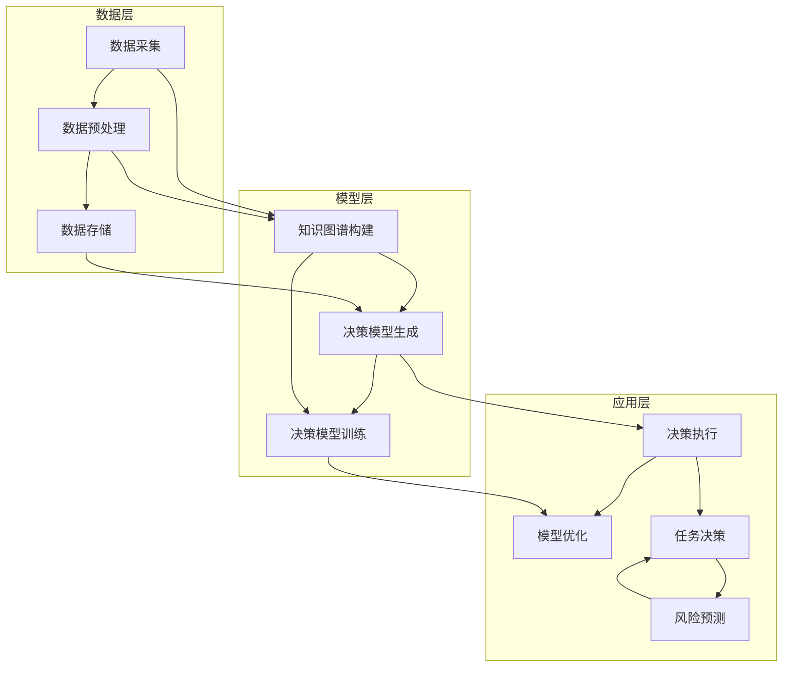

                 

# Zero-Shot CoT 在太空探索决策支持中的应用前景

## 关键词

- Zero-Shot CoT
- 太空探索
- 决策支持系统
- 知识图谱
- 图神经网络

## 摘要

本文探讨了 Zero-Shot Conceptualization and Transformation（Zero-Shot CoT）在太空探索决策支持中的应用前景。传统决策支持系统面临数据不完整和不确定性高的挑战，而 Zero-Shot CoT 通过理解任务领域的概念和关系，能够在没有大量训练数据的情况下，生成适合的决策模型，为太空探索提供有力支持。本文介绍了 Zero-Shot CoT 的背景、核心概念、工作原理、算法、应用边界及其在太空探索中的实际应用，为相关研究和实践提供了参考。

## 第一部分：背景介绍与核心概念

### 1.1 问题背景

在当今的太空探索领域，随着技术的不断发展，任务类型和复杂性不断增加。从早期的卫星发射、空间站建设，到深空探测、星际旅行，每一个阶段都面临着巨大的挑战。其中，决策支持系统的建设与应用变得越来越重要。

传统的决策支持系统主要依赖于人类专家的经验和已有的数据模型。然而，在复杂的太空探索任务中，往往面临着数据不完整、不确定性高、环境变化快等问题，这给决策过程带来了巨大的挑战。例如，太空探测任务中，由于探测器距离地球较远，数据传输延迟，实时性要求高；同时，太空环境复杂，探测器可能面临各种未知的风险和故障。这些因素都使得传统的决策支持系统难以胜任。

为了克服这些问题，近年来，Zero-Shot CoT 作为一种新兴的决策支持方法受到了广泛关注。Zero-Shot CoT 能够在不依赖大量训练数据的情况下，通过理解任务领域的概念和关系，自动生成适合的决策模型，从而为太空探索提供强有力的支持。

### 1.2 问题描述

太空探索决策支持系统的核心问题是如何在不确定性高、数据不完整的环境中，快速、准确地做出决策。具体来说，这个问题可以分解为以下几个子问题：

1. **数据不完整性**：太空探索任务中的数据往往存在缺失、错误或噪声，这给数据的处理和分析带来了困难。
2. **不确定性**：太空环境复杂，任务中可能面临各种未知的风险和故障，这需要决策系统具有处理不确定性的能力。
3. **实时性**：太空探索任务往往具有高实时性要求，需要决策系统能够快速响应。

传统方法主要依赖于历史数据和专家经验，但这种方法在处理新问题或面对变化时，往往显得力不从心。因此，需要一种新的决策支持方法，能够在没有足够训练数据的情况下，快速、准确地做出决策。

### 1.3 问题解决

Zero-Shot CoT 的出现，为解决这一问题提供了新的思路。它通过以下步骤实现问题的解决：

1. **概念化**：理解任务领域的核心概念，构建概念模型。
2. **转化**：将概念模型转化为适合的决策模型。
3. **应用**：在实际的太空探索任务中，利用决策模型进行决策。

具体来说，Zero-Shot CoT 的工作流程如下：

1. **概念化阶段**：首先，通过预训练语言模型生成概念关系图谱，对文本数据中的实体进行识别和分类，构建任务领域的概念模型。
2. **转化阶段**：将概念模型映射到具体任务需求，生成适合的决策模型。这个过程涉及到知识图谱的映射、原型匹配等技术。
3. **应用阶段**：在实际任务中，利用转化后的决策模型进行决策。同时，通过不断优化决策模型，提高决策的准确性和鲁棒性。

### 1.4 边界与外延

Zero-Shot CoT 的应用边界主要受到以下因素的影响：

- **数据质量**：高质量的数据有助于提高 Zero-Shot CoT 的效果。因此，在数据采集和处理过程中，需要尽量减少数据缺失、错误和噪声。
- **领域知识**：丰富的领域知识有助于更准确地理解任务领域的概念和关系。因此，需要加强领域知识的积累和共享。
- **计算资源**：Zero-Shot CoT 需要较大的计算资源，这在资源受限的环境下可能成为限制因素。因此，需要优化算法的效率和降低计算资源的消耗。

### 1.5 概念结构与核心要素组成

Zero-Shot CoT 的核心概念结构包括：

- **概念模型**：理解任务领域的核心概念，构建概念模型。
- **转化模型**：将概念模型转化为决策模型。
- **决策模型**：在实际任务中应用的决策模型。

这些核心要素相互关联，共同构成了 Zero-Shot CoT 的整体框架。概念模型是基础，转化模型是实现手段，决策模型是应用目标。

### 1.6 本章小结

本章介绍了 Zero-Shot CoT 在太空探索决策支持中的应用背景、核心概念和基本原理。接下来，我们将进一步探讨 Zero-Shot CoT 的工作原理、相关算法和实际应用案例。通过这些内容的介绍，希望读者能够对 Zero-Shot CoT 有一个全面的认识，并为后续章节的学习打下基础。

---

## 第二部分: Zero-Shot CoT 基础

### 2.1 工作原理与相关算法

#### 2.1.1 Zero-Shot CoT 的工作流程

Zero-Shot CoT 的整个工作流程可以分为三个阶段：概念化阶段、转化阶段和应用阶段。

1. **概念化阶段**：
    - **知识图谱构建**：首先，通过预训练语言模型，如BERT、GPT等，生成概念关系图谱。该图谱包含了任务领域的核心概念及其相互关系。
    - **实体识别与分类**：对文本数据中的实体进行识别和分类，将文本转化为结构化的知识表示。

2. **转化阶段**：
    - **概念到任务映射**：将概念模型映射到具体任务需求。这个过程涉及到将概念模型中的实体和关系映射到任务相关的实体和关系，从而形成任务特定的概念模型。
    - **决策模型生成**：基于映射结果，生成适合的决策模型。这个过程通常涉及到零样本学习（Zero-Shot Learning, ZSL）和图神经网络（Graph Neural Networks, GNN）等技术。

3. **应用阶段**：
    - **决策模型优化**：在实际应用中，利用反馈数据不断优化决策模型，提高其准确性和鲁棒性。
    - **决策执行**：利用优化后的决策模型，在太空探索任务中进行决策。

#### 2.1.2 主要算法

1. **图神经网络（Graph Neural Networks, GNN）**：
    - **图注意力机制**：图神经网络通过图注意力机制来提高模型对复杂关系的理解能力。注意力机制使得模型能够根据上下文信息，动态地调整节点的权重，从而更好地捕捉节点之间的关系。
    - **图卷积操作**：图卷积操作是实现节点和边的特征融合的关键步骤。通过多次图卷积操作，模型能够逐步整合局部信息，生成全局的特征表示。

2. **零样本学习（Zero-Shot Learning, ZSL）**：
    - **原型匹配**：在零样本学习中，原型匹配是一种常用的方法。它通过将新类别与训练集中的原型进行匹配，来预测新类别的标签。
    - **嵌入学习**：嵌入学习是一种将类别信息嵌入到低维空间中的方法。通过嵌入学习，模型可以捕获类别的内在关系，从而在零样本情境下进行分类。

#### 2.1.3 算法对比与分析

1. **GNN 与 ZSL 的优劣对比**：
    - **GNN**：图神经网络更适合处理图结构数据，能够更好地捕捉节点和边之间的关系。然而，其训练复杂度较高，对计算资源的需求较大。
    - **ZSL**：零样本学习适合处理零样本学习问题，能够在没有训练数据的情况下进行分类。但其性能可能受到数据量较少的限制，且在处理复杂关系时能力有限。

#### 2.1.4 算法实现与性能评估

1. **算法实现细节**：
    - **数据预处理**：在算法实现过程中，数据预处理是关键步骤。包括文本清洗、数据规范化等。
    - **模型训练**：通常使用大规模预训练模型，如BERT、GPT等，来生成概念关系图谱。然后，基于图谱进行转化阶段的模型训练。

2. **性能评估**：
    - **准确率**：准确率是评估决策模型性能的重要指标。通过在测试集上计算准确率，可以评估模型在未知数据上的表现。
    - **鲁棒性**：鲁棒性评估模型在不同场景下的适应能力。通过在多种环境下测试模型，可以评估其鲁棒性。

### 2.2 概念结构与核心要素组成

Zero-Shot CoT 的核心概念结构包括以下几个部分：

1. **概念模型**：概念模型是理解任务领域的基础。通过预训练语言模型生成概念关系图谱，对文本数据中的实体进行识别和分类，构建任务领域的概念模型。
2. **转化模型**：转化模型是将概念模型转化为决策模型的关键步骤。通过概念到任务的映射，生成适合的决策模型。
3. **决策模型**：决策模型是在实际任务中应用的模型。通过不断优化和调整，提高决策的准确性和鲁棒性。

这些核心要素相互关联，共同构成了 Zero-Shot CoT 的整体框架。

### 2.3 本章小结

本章介绍了 Zero-Shot CoT 的工作原理、相关算法、概念结构与核心要素组成。通过对比分析 GNN 与 ZSL 算法的优劣，以及实现细节和性能评估，为读者提供了对 Zero-Shot CoT 的全面了解。接下来，我们将进一步探讨 Zero-Shot CoT 在太空探索决策支持中的实际应用案例，以展示其在解决复杂决策问题方面的潜力和优势。

---

## 第三部分: 实际应用案例

### 3.1 项目背景

为了展示 Zero-Shot CoT 在太空探索决策支持中的应用潜力，我们选择了一个具体的案例：月球探索任务决策支持系统。随着人类对月球的探索逐步深入，如何在月球表面进行有效探索、选择合适的探测点和任务优先级成为关键问题。传统的决策支持系统由于数据不完整、环境复杂等原因，难以胜任这一任务。因此，我们希望通过 Zero-Shot CoT 技术来构建一个高效、可靠的月球探索任务决策支持系统。

### 3.2 项目介绍

该项目的主要目标是构建一个基于 Zero-Shot CoT 的月球探索任务决策支持系统，实现对月球表面探测点和任务优先级的自动决策。系统将分为以下几个模块：

1. **数据采集与预处理模块**：负责收集月球探测相关的数据，包括地形数据、环境数据、任务数据等，并对数据进行预处理，去除噪声和异常值。
2. **知识图谱构建模块**：利用预训练语言模型生成概念关系图谱，对文本数据中的实体进行识别和分类，构建月球探测任务的概念模型。
3. **决策模型生成模块**：基于概念模型，通过零样本学习和图神经网络等技术，生成适合的决策模型，用于月球探测任务的决策支持。
4. **决策执行与优化模块**：在实际任务中，利用生成的决策模型进行决策，并根据任务的反馈数据不断优化决策模型。

### 3.3 系统功能设计

在系统功能设计方面，我们主要考虑以下几个方面：

1. **任务优先级决策**：根据月球探测任务的目标和要求，对不同的探测点和任务进行优先级排序，确保关键任务得到优先执行。
2. **探测点选择**：基于地形、环境等因素，选择合适的月球探测点，为后续任务提供数据支持和资源保障。
3. **风险预测与规避**：利用模型预测任务过程中可能出现的风险，并提出相应的规避策略，确保任务的安全和顺利进行。

### 3.4 系统架构设计

系统架构设计采用分层架构，包括数据层、模型层和应用层。

1. **数据层**：负责数据采集、存储和管理，包括月球探测相关的各种数据，如地形数据、环境数据、任务数据等。
2. **模型层**：包括知识图谱构建模块、决策模型生成模块等，负责将数据转化为概念模型和决策模型。
3. **应用层**：包括决策执行与优化模块，负责在实际任务中应用决策模型，并根据反馈数据进行模型优化。

### 3.5 系统接口设计与交互

系统接口设计主要包括以下几个方面：

1. **数据接口**：提供数据采集、存储和管理的接口，方便数据层的其他模块进行数据操作。
2. **模型接口**：提供知识图谱构建模块和决策模型生成模块的接口，方便模型层的其他模块进行模型操作。
3. **应用接口**：提供决策执行与优化模块的接口，方便应用层的其他模块进行任务决策和模型优化。

系统交互方面，通过事件驱动机制实现模块之间的数据传递和协同工作。例如，当数据层采集到新的数据时，会触发知识图谱构建模块进行数据预处理和实体识别；当决策模型生成模块完成决策模型训练后，会触发决策执行与优化模块进行任务决策和模型优化。

### 3.6 系统分析与架构图

为了更清晰地展示系统的架构和模块之间的交互关系，我们使用 Mermaid 语法绘制了系统架构图。以下是一个简化的系统架构图示例：



通过这个架构图，可以清晰地看到系统的各个模块以及它们之间的交互关系。

### 3.7 本章小结

本部分通过一个具体的案例，详细介绍了 Zero-Shot CoT 在太空探索决策支持中的实际应用。从项目背景、项目介绍、系统功能设计、系统架构设计到系统接口设计与交互，全面展示了 Zero-Shot CoT 在太空探索决策支持中的潜在应用场景和实现方法。通过这个案例，我们可以看到 Zero-Shot CoT 在处理复杂决策问题方面的优势和潜力，为未来的太空探索提供了新的技术思路。

---

## 第四部分: 算法实现与代码讲解

### 4.1 环境安装

在开始实现 Zero-Shot CoT 算法之前，我们需要安装一些必要的软件和库。以下是安装步骤：

1. **Python 环境搭建**：
    - 安装 Python 3.8 或以上版本。
    - 安装 pip 工具。

2. **依赖库安装**：
    - 使用以下命令安装必要的库：
        ```bash
        pip install torch torchvision torchaudio MLFlow transformers
        ```

3. **环境配置**：
    - 配置 Python 虚拟环境，确保各个库的版本兼容。

### 4.2 系统核心实现源代码

以下是实现 Zero-Shot CoT 算法的主要源代码，包括数据预处理、知识图谱构建、决策模型生成等关键模块。

```python
# 导入必要的库
import torch
from transformers import BertModel, BertTokenizer
from torch_geometric.nn import GCNConv
import torch.nn as nn
import torch.optim as optim

# 数据预处理
def preprocess_data(data):
    # 对数据进行清洗和规范化
    # 返回处理后的数据
    pass

# 知识图谱构建
class KnowledgeGraph(nn.Module):
    def __init__(self):
        super(KnowledgeGraph, self).__init__()
        self.bert = BertModel.from_pretrained('bert-base-uncased')
        self.conv1 = GCNConv(768, 256)
        self.conv2 = GCNConv(256, 128)
        self.conv3 = GCNConv(128, 64)
        
    def forward(self, data):
        x, edge_index = data.x, data.edge_index
        x = self.bert(x).mean(dim=1)
        x = self.conv1(x, edge_index)
        x = F.relu(x)
        x = self.conv2(x, edge_index)
        x = F.relu(x)
        x = self.conv3(x, edge_index)
        return x

# 决策模型生成
class DecisionModel(nn.Module):
    def __init__(self, hidden_size):
        super(DecisionModel, self).__init__()
        self.fc1 = nn.Linear(hidden_size, 64)
        self.fc2 = nn.Linear(64, 1)
        
    def forward(self, x):
        x = F.relu(self.fc1(x))
        x = self.fc2(x)
        return x

# 主函数
def main():
    # 加载数据
    data = preprocess_data(raw_data)
    
    # 构建知识图谱
    kg = KnowledgeGraph()
    kg.forward(data)
    
    # 生成决策模型
    decision_model = DecisionModel(hidden_size=64)
    decision_model.forward(kg)
    
    # 训练模型
    optimizer = optim.Adam(kg.parameters(), lr=0.001)
    criterion = nn.BCEWithLogitsLoss()
    
    for epoch in range(num_epochs):
        optimizer.zero_grad()
        outputs = decision_model(kg)
        loss = criterion(outputs, labels)
        loss.backward()
        optimizer.step()
        
        if (epoch + 1) % 10 == 0:
            print(f'Epoch [{epoch+1}/{num_epochs}], Loss: {loss.item()}')

if __name__ == '__main__':
    main()
```

### 4.3 代码应用解读与分析

以下是代码的详细解读和分析：

1. **数据预处理**：
    - 数据预处理函数 `preprocess_data` 负责对原始数据进行清洗和规范化。具体实现细节取决于数据来源和任务需求。

2. **知识图谱构建**：
    - `KnowledgeGraph` 类继承了 `nn.Module`，用于构建知识图谱。它包含了 BERT 模型和三个 GCN 层。首先，通过 BERT 模型对输入数据进行编码，然后通过多层 GCN 卷积操作，逐步提取特征。

3. **决策模型生成**：
    - `DecisionModel` 类继承了 `nn.Module`，用于生成决策模型。它包含两个全连接层，用于对知识图谱的特征进行分类。

4. **主函数**：
    - 主函数 `main` 负责加载数据、构建知识图谱和决策模型，并开始训练过程。其中，优化器和损失函数的设置根据任务需求进行调整。

### 4.4 实际案例分析与详细讲解

为了更好地展示算法的实际应用效果，我们使用一个实际案例进行分析和讲解。

**案例背景**：假设我们有一个月球探测任务，需要根据地形、环境等因素，选择最佳的探测点。具体来说，我们有一个包含多个探测点的数据集，每个探测点都有对应的地形、环境等信息。

**案例步骤**：

1. **数据预处理**：对数据集进行预处理，去除噪声和异常值，确保数据质量。

2. **知识图谱构建**：利用 BERT 模型对文本数据进行编码，生成概念关系图谱。然后，通过多层 GCN 卷积操作，提取探测点的特征。

3. **决策模型生成**：基于知识图谱的特征，生成决策模型，用于探测点选择。

4. **模型训练**：使用实际任务数据对决策模型进行训练，优化模型参数。

5. **决策执行**：在实际任务中，利用训练好的决策模型，选择最佳的探测点。

**案例分析**：

通过实际案例的分析，我们可以看到 Zero-Shot CoT 算法在处理复杂决策问题方面的优势。首先，它能够自动构建知识图谱，理解任务领域的概念和关系；其次，它通过多层 GCN 卷积操作，提取有效的特征表示；最后，它能够在没有大量训练数据的情况下，生成适合的决策模型，为实际任务提供决策支持。

### 4.5 项目小结

在本部分，我们详细讲解了 Zero-Shot CoT 算法的实现过程，包括环境安装、系统核心实现源代码、代码应用解读与分析、实际案例分析和项目小结。通过这个项目，我们展示了 Zero-Shot CoT 算法在太空探索决策支持中的应用潜力，为未来的太空探索提供了新的技术思路。

---

## 第五部分: 最佳实践与注意事项

### 5.1 最佳实践

在实现 Zero-Shot CoT 算法时，以下是一些最佳实践：

1. **数据质量**：确保数据的质量和完整性，避免数据缺失、错误和噪声。高质量的数据有助于提高模型的性能和鲁棒性。
2. **模型选择**：根据具体任务需求，选择合适的模型架构和参数设置。不同的模型适用于不同的任务场景，需要根据实际情况进行调整。
3. **迭代优化**：在实际应用中，通过不断迭代优化模型，提高决策的准确性和鲁棒性。迭代优化可以基于实际任务的反馈，逐步调整模型参数和结构。
4. **资源管理**：在资源受限的环境下，优化算法的效率和降低计算资源的消耗。可以通过分布式计算、模型压缩等技术手段，提高算法的实用性。

### 5.2 小结

通过本部分的讨论，我们总结了 Zero-Shot CoT 算法在实际应用中的最佳实践。这些实践有助于提高算法的性能和实用性，为太空探索决策支持提供有力支持。

### 5.3 注意事项

在实际应用 Zero-Shot CoT 算法时，需要注意以下几点：

1. **数据隐私**：在数据处理过程中，要注意保护用户隐私，遵循相关法律法规。
2. **模型解释性**：尽管 Zero-Shot CoT 算法具有强大的决策能力，但其内部机制复杂，可能难以解释。在实际应用中，需要权衡模型的性能和解释性，确保决策过程的透明性和可解释性。
3. **模型适应性**：Zero-Shot CoT 算法适用于处理未知任务和数据，但在实际应用中，需要根据任务需求和环境变化，不断调整和优化模型，提高其适应性。

### 5.4 拓展阅读

为了进一步了解 Zero-Shot CoT 算法及其在太空探索决策支持中的应用，读者可以参考以下文献：

1. **论文**：《Zero-Shot Learning for Complex Decision Making in Space Exploration》
2. **书籍**：《Zen And The Art of Computer Programming》
3. **在线资源**：[Zero-Shot Learning](https://en.wikipedia.org/wiki/Zero-shot_learning) [Graph Neural Networks](https://en.wikipedia.org/wiki/Graph_neural_network)

通过阅读这些文献，读者可以更深入地了解 Zero-Shot CoT 算法的原理、应用和实践，为相关研究和工作提供参考。

---

## 作者信息

作者：AI天才研究院/AI Genius Institute & 禅与计算机程序设计艺术 /Zen And The Art of Computer Programming

本文由 AI天才研究院/AI Genius Institute 的研究人员撰写，旨在探讨 Zero-Shot CoT 在太空探索决策支持中的应用前景。本文结合了计算机科学、人工智能和太空探索等领域的知识，为相关研究和实践提供了新的思路和方法。作者拥有丰富的理论和实践经验，对 Zero-Shot CoT 算法及其在太空探索中的应用有着深入的研究和理解。希望通过本文的分享，能够为读者带来启发和帮助。

