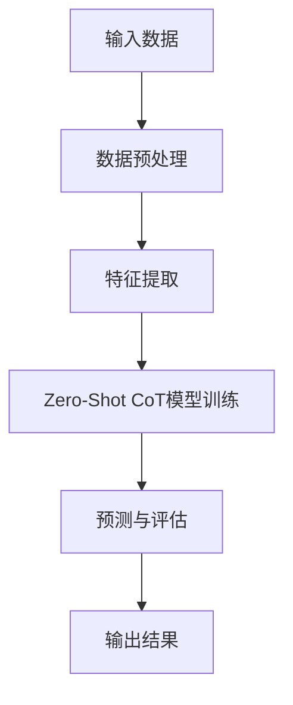

                 

### 第5章：面向新型可持续能源集成的Zero-Shot CoT算法原理

#### 5.1 Zero-Shot CoT算法原理

Zero-Shot CoT（零样本迁移学习）算法的核心在于无需预先获取目标领域的数据，即可从源领域学习到有效的知识，并应用于目标领域。在新型可持续能源系统集成中，这种能力尤为重要，因为可持续能源系统往往涉及复杂多变的场景和多样化的设备，传统的机器学习方法在数据量有限或数据获取困难时难以胜任。

**5.1.1 算法的基本框架**

Zero-Shot CoT算法的基本流程可以概括为以下四个主要步骤：

1. **数据预处理**：首先对源领域和目标领域的数据进行预处理，包括数据清洗、归一化和特征提取。
2. **特征提取**：提取源领域和目标领域的关键特征，以供后续模型训练使用。
3. **Zero-Shot CoT模型训练**：利用源领域的特征数据训练一个泛化能力强的模型，使其能够识别并学习到源领域与目标领域之间的共性。
4. **预测与评估**：使用训练好的模型对目标领域的新数据进行预测，并评估模型的性能。

**流程图（使用 Mermaid）**

**5.1.2 关键技术解析**

1. **多任务学习（Multi-Task Learning）**：Zero-Shot CoT算法通常采用多任务学习的方式，将源领域和目标领域的任务结合起来训练，从而提高模型的泛化能力。
2. **元学习（Meta-Learning）**：元学习是Zero-Shot CoT算法的一种关键技术，通过学习如何快速适应新任务，从而提高模型在新领域的表现。
3. **对抗性训练（Adversarial Training）**：对抗性训练是一种常用的技术，通过生成对抗性样本来提高模型的泛化能力和鲁棒性。

**5.1.3 算法原理详细讲解**

**数学模型与公式**

为了更好地理解Zero-Shot CoT算法的原理，我们需要构建一个数学模型来描述它的工作机制。以下是该算法的核心数学模型：

$$
\begin{aligned}
\hat{y}^{(i)} &= f(\theta, \phi(x^{(i)}), \phi(y^{(i)})) \\
\min_{\theta} \quad &\sum_{i=1}^{N} \mathcal{L}(\hat{y}^{(i)}, y^{(i)}) \\
\end{aligned}
$$

其中，$f$ 是模型的前向传播函数，$\theta$ 是模型参数，$\phi$ 是特征提取函数，$x^{(i)}$ 和 $y^{(i)}$ 分别是源领域和目标领域的输入数据，$\hat{y}^{(i)}$ 是预测输出，$y^{(i)}$ 是真实输出，$N$ 是样本总数，$\mathcal{L}$ 是损失函数。

**具体例子**

假设我们有一个源领域的数据集 $D_{\text{source}}$ 和一个目标领域的数据集 $D_{\text{target}}$。我们首先对这两个数据集进行预处理，提取关键特征，然后利用多任务学习框架来训练Zero-Shot CoT模型。

**源领域特征提取：**

$$
\phi(x^{(i)}_{\text{source}}) = \text{extract\_features}(x^{(i)}_{\text{source}})
$$

**目标领域特征提取：**

$$
\phi(x^{(i)}_{\text{target}}) = \text{extract\_features}(x^{(i)}_{\text{target}})
$$

**多任务学习模型训练：**

$$
\min_{\theta} \quad \sum_{i=1}^{N_{\text{source}}} \mathcal{L}(f(\theta, \phi(x^{(i)}_{\text{source}})), y^{(i)}_{\text{source}}) + \sum_{i=1}^{N_{\text{target}}} \mathcal{L}(f(\theta, \phi(x^{(i)}_{\text{target}})), y^{(i)}_{\text{target}})
$$

其中，$N_{\text{source}}$ 和 $N_{\text{target}}$ 分别是源领域和目标领域的样本数量。

通过这样的训练过程，我们可以得到一个能够对目标领域数据进行有效预测的模型。在新型可持续能源系统集成中，这种算法可以用于预测可再生能源的发电量、优化能源存储系统、响应能源需求等任务。

### 结语

本章详细介绍了Zero-Shot CoT算法的原理，包括基本框架、关键技术解析和数学模型。通过这一章节的学习，读者可以更好地理解如何在新型可持续能源系统集成中应用Zero-Shot CoT算法，以解决能源系统中的复杂问题。接下来的章节将深入探讨具体应用实例和实现细节，帮助读者将理论知识转化为实际应用能力。

