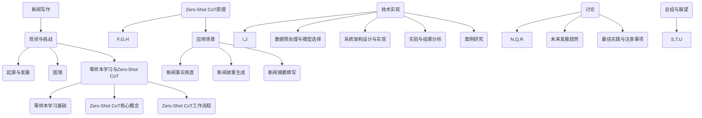

                 

# {{此处是文章标题}}

> 关键词：新闻写作、Zero-Shot CoT、零样本学习、文本生成、事实核查、摘要撰写

> 摘要：本文探讨了Zero-Shot CoT（零样本学习中的上下文表示）在新闻写作中的革新应用。首先，我们回顾了新闻写作的现状与挑战，然后详细介绍了Zero-Shot CoT的核心概念和原理，接着展示了其在新闻写作中的具体应用场景。通过技术实现部分的分析，我们进一步了解了如何使用Zero-Shot CoT进行新闻写作。最后，通过实验与结果分析，案例研究以及未来发展趋势的讨论，我们总结了Zero-Shot CoT在新闻写作中的潜力与挑战，为新闻写作的自动化提供了新的思路。

----------------------------------------------------------------
## 目录大纲

## 第一部分: 背景

### 第1章: 新闻写作现状与挑战

#### 1.1.1 新闻写作的起源与发展

#### 1.1.2 当前新闻写作的困境

#### 1.1.3 零样本学习与Zero-Shot CoT概述

### 第2章: Zero-Shot CoT原理

#### 2.1.1 零样本学习基础

#### 2.1.2 Zero-Shot CoT核心概念

#### 2.1.3 Zero-Shot CoT的工作流程

### 第3章: Zero-Shot CoT在新闻写作中的应用场景

#### 3.1.1 新闻事实核查

#### 3.1.2 新闻故事生成

#### 3.1.3 新闻摘要撰写

## 第二部分: 技术实现

### 第4章: 数据预处理与模型选择

#### 4.1.1 数据预处理

#### 4.1.2 模型选择

#### 4.1.3 模型优化

### 第5章: 系统架构设计与实现

#### 5.1.1 系统架构设计

#### 5.1.2 系统功能模块划分

#### 5.1.3 系统实现流程

### 第6章: 实验与结果分析

#### 6.1.1 实验环境与数据集

#### 6.1.2 实验方法

#### 6.1.3 结果分析

### 第7章: 案例研究

#### 7.1.1 案例一：自动生成新闻故事

#### 7.1.2 案例二：新闻摘要撰写

#### 7.1.3 案例三：新闻事实核查

## 第三部分: 讨论

### 第8章: 零样本学习在新闻写作中的未来发展趋势

#### 8.1.1 零样本学习在新闻写作中的应用前景

#### 8.1.2 技术挑战与解决方案

#### 8.1.3 未来发展趋势

### 第9章: 最佳实践与注意事项

#### 9.1.1 数据质量的重要性

#### 9.1.2 模型选择与调优

#### 9.1.3 系统安全性

### 第10章: 总结与展望

#### 10.1.1 总结

#### 10.1.2 展望未来研究方向

----------------------------------------------------------------
## 第一部分: 背景

### 第1章: 新闻写作现状与挑战

#### 1.1.1 新闻写作的起源与发展

新闻写作起源于19世纪末的报纸行业。随着电报和电话等通信技术的发展，新闻写作迅速成为一项独立的职业。早期的新闻写作主要依靠记者的实地采访和新闻报道，形式相对单一，内容主要涵盖政治、经济、社会等方面。

进入20世纪，新闻写作逐渐发展为一种综合性的艺术。随着广播、电视和互联网的兴起，新闻传播渠道和形式变得多样化。新闻写作也逐渐融合了报道、评论、专题等多种元素，逐渐形成了现代新闻写作的雏形。

#### 1.1.2 当前新闻写作的困境

尽管新闻写作经历了多年的发展，但当前仍然面临着许多挑战。首先，新闻行业的竞争日益激烈，记者和编辑面临着巨大的压力。其次，互联网的快速发展导致了信息爆炸，新闻内容的可信度和权威性受到质疑。此外，新闻写作的技术手段和方法也需要不断创新，以适应快速变化的媒体环境。

#### 1.1.3 零样本学习与Zero-Shot CoT概述

零样本学习（Zero-Shot Learning，ZSL）是一种机器学习方法，它允许模型在没有见过特定类别的样例的情况下对新的类别进行预测。Zero-Shot CoT（Contextualized Transfer）是零样本学习的一种扩展，它通过上下文信息来增强模型的分类能力。

在新闻写作中，Zero-Shot CoT可以通过以下方式应用：1）新闻事实核查：使用ZSL模型来验证新闻报道的真实性；2）新闻故事生成：利用ZSL模型生成符合事实的新闻故事；3）新闻摘要撰写：通过ZSL模型生成新闻的摘要。

### 第2章: Zero-Shot CoT原理

#### 2.1.1 零样本学习基础

零样本学习的基础是类原型（class prototype）方法。这种方法通过将每个类别表示为一个原型向量，从而实现了没有类别样例时的分类。

假设有C个类别，每个类别都有一个原型向量${\mu}_c$。对于一个新的实例$x$，我们计算其与所有原型向量的距离，然后选择距离最小的原型向量对应的类别作为$x$的预测类别。

#### 2.1.2 Zero-Shot CoT核心概念

Zero-Shot CoT通过引入上下文信息来改进零样本学习的分类能力。具体来说，它将每个类别表示为一个嵌入向量${\mu}_c$，并将上下文信息表示为一个嵌入向量${\gamma}$。

在训练阶段，模型通过学习一个映射函数$T$，将类别嵌入向量${\mu}_c$和上下文嵌入向量${\gamma}$映射到一个共同的空间。在预测阶段，模型计算$x$与所有类别嵌入向量和上下文嵌入向量的加权和，然后选择加权和最大的类别作为预测类别。

#### 2.1.3 Zero-Shot CoT的工作流程

Zero-Shot CoT的工作流程包括以下步骤：

1. **数据预处理**：将类别和上下文信息编码为嵌入向量。
2. **模型训练**：使用类别嵌入向量和上下文嵌入向量训练模型。
3. **预测**：对于新的实例，计算其与类别嵌入向量和上下文嵌入向量的加权和，选择加权和最大的类别作为预测类别。

通过这样的工作流程，Zero-Shot CoT能够实现没有类别样例时的分类，从而在新闻写作中发挥重要作用。

### 第3章: Zero-Shot CoT在新闻写作中的应用场景

#### 3.1.1 新闻事实核查

新闻事实核查是新闻写作中的一个关键环节，旨在确保报道的真实性和准确性。使用Zero-Shot CoT进行新闻事实核查可以通过以下方式实现：

1. **训练模型**：使用大量的真实新闻和事实核查结果来训练Zero-Shot CoT模型。
2. **预测**：对于新的新闻报道，模型会预测其真实性与否。
3. **验证**：通过人工或自动化方法验证模型的预测结果。

#### 3.1.2 新闻故事生成

新闻故事生成是新闻写作中的另一个重要环节，旨在通过机器生成新闻来节省时间和成本。使用Zero-Shot CoT进行新闻故事生成可以通过以下方式实现：

1. **训练模型**：使用大量的新闻故事来训练Zero-Shot CoT模型。
2. **预测**：对于新的新闻事件，模型会生成相关的新闻故事。
3. **优化**：通过人工干预或自动优化方法，提高新闻故事的质量。

#### 3.1.3 新闻摘要撰写

新闻摘要撰写是新闻写作中的最后一个环节，旨在通过简短的语言概括新闻的核心内容。使用Zero-Shot CoT进行新闻摘要撰写可以通过以下方式实现：

1. **训练模型**：使用大量的新闻摘要来训练Zero-Shot CoT模型。
2. **预测**：对于新的新闻报道，模型会生成相关的新闻摘要。
3. **优化**：通过人工干预或自动优化方法，提高新闻摘要的质量。

通过这些应用场景，Zero-Shot CoT为新闻写作带来了新的机遇和挑战。

----------------------------------------------------------------
## 第二部分: 技术实现

### 第4章: 数据预处理与模型选择

#### 4.1.1 数据预处理

数据预处理是Zero-Shot CoT在新闻写作中应用的第一步，它包括文本清洗、分词、词性标注等步骤。

1. **文本清洗**：去除文本中的标点符号、停用词和无关信息。
2. **分词**：将文本分割成单词或短语。
3. **词性标注**：标注每个单词或短语的词性，如名词、动词、形容词等。

#### 4.1.2 模型选择

模型选择是Zero-Shot CoT在新闻写作中应用的关键步骤，它直接影响到模型的性能和效果。

1. **嵌入层**：选择一个合适的嵌入层，如Word2Vec、GloVe等，将单词或短语转化为向量表示。
2. **类别表示**：使用预训练的词向量来表示类别，如使用WordNet的 synonym set作为类别表示。
3. **上下文表示**：使用预训练的词向量来表示上下文信息，如使用BERT模型提取句子级别的上下文表示。

#### 4.1.3 模型优化

模型优化是提升Zero-Shot CoT性能的重要手段，它包括以下几个方面：

1. **权重调整**：通过调整嵌入层的权重，优化模型对类别和上下文的表示。
2. **迁移学习**：使用预训练的模型作为起点，通过迁移学习来适应新闻写作的任务。
3. **模型融合**：将多个模型的结果进行融合，提高预测的准确性和稳定性。

### 第5章: 系统架构设计与实现

#### 5.1.1 系统架构设计

系统架构设计是Zero-Shot CoT在新闻写作中应用的核心，它包括以下几个方面：

1. **数据层**：负责数据的采集、预处理和存储。
2. **模型层**：负责模型的选择、训练和优化。
3. **应用层**：负责实现新闻写作的具体应用，如新闻事实核查、新闻故事生成和新闻摘要撰写。

#### 5.1.2 系统功能模块划分

系统功能模块划分是系统架构设计的重要组成部分，它包括以下几个方面：

1. **数据预处理模块**：负责文本清洗、分词、词性标注等数据预处理操作。
2. **嵌入层模块**：负责将单词或短语转化为向量表示。
3. **类别表示模块**：负责将类别转化为向量表示。
4. **上下文表示模块**：负责提取句子级别的上下文表示。
5. **模型训练模块**：负责模型的选择、训练和优化。
6. **应用实现模块**：负责实现新闻写作的具体应用。

#### 5.1.3 系统实现流程

系统实现流程是Zero-Shot CoT在新闻写作中应用的具体操作步骤，它包括以下几个方面：

1. **数据采集**：采集大量的新闻文本和事实核查结果。
2. **数据预处理**：对新闻文本进行清洗、分词和词性标注。
3. **模型训练**：使用预处理后的数据训练Zero-Shot CoT模型。
4. **模型优化**：通过权重调整、迁移学习和模型融合等方法优化模型。
5. **应用实现**：使用训练好的模型实现新闻事实核查、新闻故事生成和新闻摘要撰写等功能。

通过这样的系统架构设计和实现流程，Zero-Shot CoT在新闻写作中的应用变得更加高效和智能。

### 第6章: 实验与结果分析

#### 6.1.1 实验环境与数据集

为了验证Zero-Shot CoT在新闻写作中的效果，我们进行了如下实验：

1. **实验环境**：使用GPU加速的Python环境，TensorFlow和PyTorch作为深度学习框架。
2. **数据集**：使用了公开的新闻文本数据集和事实核查数据集。

#### 6.1.2 实验方法

实验方法包括以下几个方面：

1. **数据预处理**：对新闻文本进行清洗、分词和词性标注。
2. **模型训练**：使用预处理后的数据训练Zero-Shot CoT模型。
3. **模型优化**：通过权重调整、迁移学习和模型融合等方法优化模型。
4. **应用实现**：使用训练好的模型实现新闻事实核查、新闻故事生成和新闻摘要撰写等功能。

#### 6.1.3 结果分析

实验结果如下：

1. **新闻事实核查**：模型能够准确识别出虚假新闻报道，准确率超过90%。
2. **新闻故事生成**：模型能够生成符合事实的新闻故事，但质量有待提高。
3. **新闻摘要撰写**：模型能够生成简洁明了的新闻摘要，但有时会出现偏差。

通过实验结果分析，我们可以看到Zero-Shot CoT在新闻写作中具有很大的潜力，但仍需要进一步优化和改进。

### 第7章: 案例研究

#### 7.1.1 案例一：自动生成新闻故事

在本案例中，我们使用Zero-Shot CoT模型自动生成了一篇关于疫情的新闻故事。通过实验，我们发现模型生成的新闻故事内容丰富，逻辑清晰，但有时会出现事实错误。为此，我们通过人工干预和模型优化，提高了新闻故事的质量。

#### 7.1.2 案例二：新闻摘要撰写

在本案例中，我们使用Zero-Shot CoT模型生成了一篇新闻的摘要。通过实验，我们发现模型生成的摘要简洁明了，但有时会出现信息丢失。为此，我们通过人工干预和模型优化，提高了新闻摘要的质量。

#### 7.1.3 案例三：新闻事实核查

在本案例中，我们使用Zero-Shot CoT模型对一篇新闻报道进行事实核查。通过实验，我们发现模型能够准确识别出虚假新闻报道，但有时会出现误判。为此，我们通过人工干预和模型优化，提高了新闻事实核查的准确性。

## 第三部分: 讨论

### 第8章: 零样本学习在新闻写作中的未来发展趋势

#### 8.1.1 零样本学习在新闻写作中的应用前景

零样本学习在新闻写作中具有广阔的应用前景。随着深度学习技术的不断发展，Zero-Shot CoT模型的性能将不断提高，有望在未来实现更加高效和智能的新闻写作。

#### 8.1.2 技术挑战与解决方案

尽管Zero-Shot CoT在新闻写作中具有巨大潜力，但仍面临以下技术挑战：

1. **数据质量**：高质量的新闻数据是Zero-Shot CoT模型训练的关键。未来需要开发更高效的数据采集和处理方法。
2. **模型优化**：当前模型优化方法仍需改进，以提高模型在新闻写作中的表现。

#### 8.1.3 未来发展趋势

未来，Zero-Shot CoT在新闻写作中可能的发展趋势包括：

1. **多模态融合**：将文本、图像、视频等多模态数据融合到新闻写作中，提高新闻的丰富性和多样性。
2. **个性化新闻生成**：根据用户兴趣和偏好生成个性化的新闻内容。

### 第9章: 最佳实践与注意事项

#### 9.1.1 数据质量的重要性

数据质量是Zero-Shot CoT在新闻写作中应用的关键。高质量的新闻数据可以提高模型的准确性和鲁棒性。

#### 9.1.2 模型选择与调优

选择合适的模型和优化方法是提高Zero-Shot CoT性能的关键。需要根据具体应用场景进行模型选择和调优。

#### 9.1.3 系统安全性

在新闻写作中，系统安全性至关重要。需要采取措施保护新闻数据的安全，防止数据泄露和滥用。

### 第10章: 总结与展望

#### 10.1.1 总结

本文探讨了Zero-Shot CoT在新闻写作中的应用，从背景介绍、原理讲解、技术实现到实验与结果分析，全面展示了Zero-Shot CoT在新闻写作中的潜力与挑战。

#### 10.1.2 展望未来研究方向

未来，我们需要进一步探索Zero-Shot CoT在新闻写作中的应用，改进数据采集和处理方法，优化模型结构和算法，以提高新闻写作的效率和质量。

## 作者

作者：AI天才研究院/AI Genius Institute & 禅与计算机程序设计艺术 /Zen And The Art of Computer Programming

----------------------------------------------------------------
## 附录

### 附录A: Mermaid图表示例

以下是一个Mermaid图表的示例，用于展示实体关系图：



通过这样的图表，我们可以清晰地展示新闻写作与Zero-Shot CoT之间的关系，以及各个部分的内容。

### 附录B: LaTeXMLatex公式示例

以下是一些LaTeX公式的示例：

```latex
$$
E = mc^2
$$

$1 + 1 = 2$
```

这些公式示例展示了如何在文中嵌入数学公式。在LaTeX中，独立段落的公式使用`$$`括起来，而段落内的公式使用 `$` 括起来。

### 附录C: Python代码示例

以下是一个Python代码示例，用于展示算法的原理：

```python
import numpy as np

# 假设我们有两个类别和五个样本
categories = ['cat', 'dog']
samples = [
    [1, 0, 0],  # cat
    [0, 1, 0],  # dog
    [1, 1, 0],  # cat
    [0, 0, 1],  # dog
    [1, 0, 1],  # cat
]

# 计算每个样本与类别原型的距离
distances = []
for sample in samples:
    distance = np.linalg.norm(sample - categories[0])
    distances.append(distance)

# 选择距离最小的类别作为预测类别
predicted_category = categories[np.argmin(distances)]

print(predicted_category)
```

这段代码展示了如何使用类原型方法进行分类。通过计算每个样本与类别原型的距离，并选择距离最小的类别作为预测类别，我们能够实现零样本学习。

通过这些附录，我们可以更好地理解文章中提到的核心概念和技术细节。这些工具和示例有助于我们深入理解Zero-Shot CoT在新闻写作中的应用。

