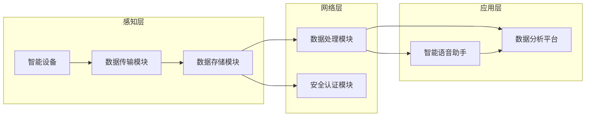
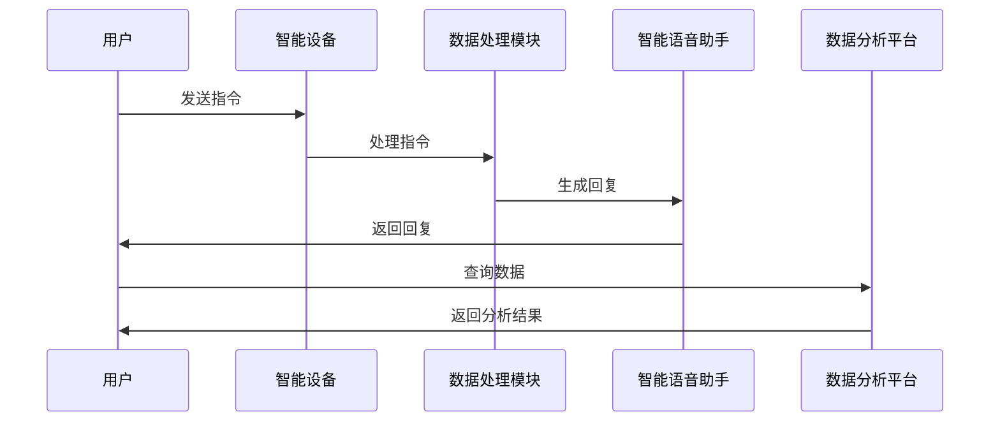
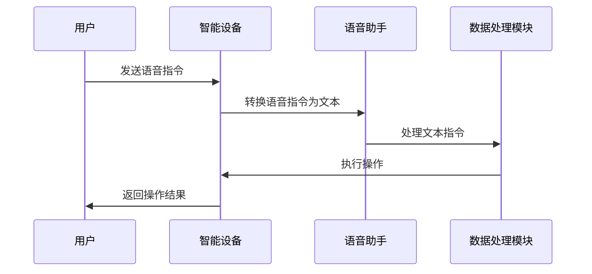

                 

## 介绍

### 智能家居AI的发展背景与挑战

**关键词**: 智能家居AI，发展背景，挑战，Zero-Shot CoT

随着信息技术的飞速发展，智能家居AI逐渐成为家庭生活中不可或缺的一部分。智能家居AI是指通过连接各种智能设备，利用人工智能技术实现家庭自动化和智能化的系统。这一概念不仅涵盖了传统的家电设备，如空调、冰箱、洗衣机等，还包括安防、健康监测、娱乐休闲等领域的智能设备。

### 问题背景

智能家居AI的兴起，源于人们对生活便捷性和舒适性的追求。然而，在这一过程中，智能家居AI也面临着诸多挑战。首先，如何提高系统的智能化水平，使得智能设备能够更好地理解并满足用户的需求，是当前研究的热点。其次，设备之间的兼容性问题也是一个关键挑战，不同品牌和厂商的智能设备如何实现无缝对接，是行业亟待解决的问题。最后，数据安全和隐私保护也是智能家居AI发展中不可忽视的重要问题。随着智能家居设备的普及，用户的个人数据被广泛收集和存储，如何确保这些数据的安全性和隐私性，是每个智能设备制造商和开发者都必须面对的挑战。

### 问题描述

在传统的机器学习框架下，模型的训练依赖于大量的训练数据。然而，对于智能家居AI来说，收集大量的训练数据并非易事。首先，智能家居AI的应用场景多样，不同设备、不同用户环境下的数据差异巨大，难以统一。其次，用户数据的隐私保护要求高，不宜随意公开和共享。最后，智能设备的硬件资源有限，无法像数据中心那样存储和处理大量数据。这些因素共同导致传统机器学习技术在智能家居AI中的应用受到限制。

### 问题解决

为了解决传统机器学习在智能家居AI应用中的样本依赖问题，研究人员提出了一种名为Zero-Shot CoT（零样本转移学习）的技术。Zero-Shot CoT的核心思想是不依赖特定样本，通过预训练模型和知识蒸馏等方法，实现模型对未知任务的快速适应和迁移。具体来说，Zero-Shot CoT技术可以在如下几个方面提升智能家居AI的性能：

1. **提高适应性**：通过零样本学习，智能系统能够快速适应新设备和新场景，无需大量的训练数据。
2. **降低数据依赖**：减少了数据收集和处理的复杂度，提高了系统的可扩展性。
3. **增强泛化能力**：通过跨领域、跨任务的迁移学习，提高了模型在不同场景下的泛化能力。

### 边界与外延

Zero-Shot CoT技术在智能家居AI中的应用边界主要包括以下几个方面：

1. **语音识别**：实现智能家居设备的语音控制，通过零样本学习，智能系统可以快速适应不同用户和不同语音环境。
2. **图像识别**：识别智能家居设备的工作状态和故障，通过零样本学习，智能系统可以处理不同设备和不同故障类型的图像数据。
3. **自然语言处理**：实现智能家居设备的智能对话和交互，通过零样本学习，智能系统可以理解并响应不同用户的需求和指令。

在智能家居AI的外延方面，Zero-Shot CoT技术还可以应用于设备之间的互联互通、数据隐私保护等方面。例如，通过零样本学习，智能系统能够理解和协调不同品牌的智能设备，实现无缝对接。同时，通过知识蒸馏等技术，智能系统可以在保护用户隐私的前提下，实现数据的安全存储和处理。

### 概念结构与核心要素组成

- **Zero-Shot CoT**：一种机器学习方法，能够在没有直接训练数据的情况下，对未知类别进行识别和预测。
- **智能家居AI**：利用人工智能技术实现家庭自动化和智能化的系统。

通过对Zero-Shot CoT技术和智能家居AI的详细介绍，我们可以看到，这两者在解决传统机器学习在智能家居AI应用中的样本依赖问题方面具有巨大的潜力。接下来的章节将深入探讨Zero-Shot CoT的核心概念和原理，以及它在智能家居AI中的应用，帮助我们更好地理解这一技术的价值和意义。

### 第二部分：核心概念与原理

#### 第2章: Zero-Shot CoT的核心概念与原理

**2.1 Zero-Shot CoT的定义**

Zero-Shot CoT（零样本转移学习）是一种机器学习方法，它允许模型在没有直接训练数据的情况下，对未知类别进行学习和预测。这一技术的核心优势在于，它能够减少对大规模标注数据的依赖，从而提高模型在不同任务和应用场景中的适应性和泛化能力。

**2.2 Zero-Shot CoT的特点**

- **无样本依赖**：Zero-Shot CoT不需要每个类别的特定样本进行训练，这意味着可以在数据稀缺或难以获取的场景下，依然能够有效训练模型。
- **泛化能力强**：通过预训练和迁移学习，Zero-Shot CoT能够跨领域、跨任务地应用，从而提高模型在不同应用场景中的表现。

**2.3 Zero-Shot CoT与传统机器学习的区别**

传统机器学习依赖于大量的训练数据，通过梯度下降等方法优化模型参数，从而实现对已知数据的准确预测。然而，这一方法在面对新任务或新类别时，往往需要重新收集和标注大量数据，导致训练成本高昂。相比之下，Zero-Shot CoT的核心区别在于：

- **数据需求**：传统机器学习依赖于具体任务的数据，而Zero-Shot CoT通过预训练和迁移学习，能够在没有特定数据的情况下，对新任务进行快速适应。
- **适应能力**：传统机器学习在遇到新任务时，表现往往不佳，而Zero-Shot CoT通过跨领域迁移，能够更好地应对新任务和未知类别。

**2.4 Zero-Shot CoT的应用场景**

Zero-Shot CoT的应用场景广泛，尤其在智能家居AI领域，其潜力更加显著。以下是几个典型的应用场景：

- **语音识别**：通过Zero-Shot CoT，智能设备可以快速适应不同用户的语音特点，实现更准确的语音识别和指令理解。
- **图像识别**：在智能家居设备的监控和故障诊断中，Zero-Shot CoT能够处理不同设备和不同故障类型的图像数据，提高识别准确率。
- **自然语言处理**：Zero-Shot CoT可以应用于智能家居设备的智能对话和交互，使得系统能够理解并响应不同用户的需求和指令。

通过以上对Zero-Shot CoT的核心概念和原理的介绍，我们可以看到，这一技术在智能家居AI中的应用具有广阔的前景。在接下来的章节中，我们将进一步探讨Zero-Shot CoT的具体实现方法和案例，以帮助读者更好地理解和应用这一技术。

### 第三部分：应用领域与案例分析

#### 第3章: Zero-Shot CoT在智能家居AI中的应用

**3.1 应用领域**

Zero-Shot CoT在智能家居AI中的应用十分广泛，涵盖了语音识别、图像识别、自然语言处理等多个领域。以下将详细探讨这些应用领域，并介绍相关的案例分析。

**3.1.1 语音识别**

语音识别是智能家居AI中非常重要的一个领域。通过Zero-Shot CoT技术，智能设备能够更好地理解和响应用户的语音指令。具体来说，Zero-Shot CoT在语音识别中的应用主要表现在以下几个方面：

- **跨用户语音识别**：传统语音识别系统通常需要对特定用户的语音进行训练，而Zero-Shot CoT可以在没有用户特定语音数据的情况下，通过迁移学习快速适应不同用户的语音特点，提高识别准确率。
- **跨场景语音识别**：在智能家居环境中，用户可能会在不同的场景下与设备进行交互，如厨房、客厅、卧室等。Zero-Shot CoT可以处理这些不同场景下的语音数据，使得智能系统能够更准确地理解用户的指令。

**案例**：某智能家居设备厂商采用Zero-Shot CoT技术，开发了一款智能语音助手。通过在多个家庭场景下进行迁移学习，该智能语音助手能够准确识别和理解不同用户的语音指令，极大地提高了用户的使用体验。

**3.1.2 图像识别**

图像识别是智能家居AI中的另一个关键领域。通过Zero-Shot CoT技术，智能设备能够识别和理解各种类型的图像，从而实现设备监控和故障诊断等功能。以下为Zero-Shot CoT在图像识别中的应用：

- **设备状态监控**：通过图像识别技术，智能设备可以监控自身的运行状态，如摄像头可以检测设备的损坏或异常，及时通知用户进行维修。
- **故障诊断**：在智能家居设备出现故障时，图像识别可以帮助识别故障类型，从而指导用户进行相应的维修操作。

**案例**：某智能家居设备公司利用Zero-Shot CoT技术，开发了一套智能监控系统。该系统可以通过图像识别技术，实时监控设备的运行状态，并在发现故障时自动通知用户，提高了设备的可靠性和使用寿命。

**3.1.3 自然语言处理**

自然语言处理（NLP）是智能家居AI中不可或缺的一部分。通过Zero-Shot CoT技术，智能设备能够更好地理解和处理用户的自然语言指令，从而实现更加智能的交互。以下为Zero-Shot CoT在NLP中的应用：

- **智能对话**：通过Zero-Shot CoT，智能设备可以理解用户的自然语言指令，并生成相应的回复，实现智能对话功能。
- **情感分析**：在智能家居环境中，用户可能会表达各种情感，如快乐、愤怒、沮丧等。Zero-Shot CoT可以帮助智能设备识别这些情感，从而提供更加个性化的服务。

**案例**：某智能家居设备厂商开发了一款智能音箱，通过Zero-Shot CoT技术，该智能音箱能够理解用户的自然语言指令，并生成相应的回复，实现智能对话功能。此外，该智能音箱还能够识别用户情感，从而提供更加贴心的服务。

通过以上案例，我们可以看到Zero-Shot CoT在智能家居AI中的应用具有广泛的前景。在未来，随着技术的不断发展和应用领域的拓展，Zero-Shot CoT将为智能家居AI带来更多的创新和突破。

### 第四部分：架构设计与数据处理

#### 第4章: 智能家居AI的架构与系统设计

**4.1 架构设计**

智能家居AI的架构设计是确保系统高效、稳定运行的关键。智能家居AI的整体架构可以分为感知层、网络层和应用层三个主要层次。

- **感知层**：感知层是智能家居AI的基础，主要包括各种智能设备，如智能音箱、智能摄像头、智能灯光等。这些设备通过各种传感器获取环境信息，如声音、图像、温度、湿度等，并将数据传输至网络层。

- **网络层**：网络层负责数据的传输和处理。通过物联网（IoT）技术，感知层收集到的数据会被传输到云端或本地服务器进行处理。网络层还包括数据存储、数据加密和安全认证等功能，确保数据的安全性和完整性。

- **应用层**：应用层是智能家居AI的核心，负责处理和分析数据，并提供用户交互接口。应用层主要包括智能语音助手、智能家居控制中心、数据分析平台等。通过应用层，用户可以方便地与智能家居系统进行交互，实现各种家庭自动化和智能化功能。

**4.2 系统设计**

智能家居AI的系统设计需要考虑多个方面，包括领域模型、系统架构、接口设计以及系统交互等。

**4.2.1 领域模型**

领域模型是描述智能家居AI系统功能和组件的一种抽象表示。在领域模型中，我们可以定义智能家居AI的主要组件和它们之间的关系。以下是一个简化的领域模型：

```mermaid
classDiagram
  用户 -> 智能设备 : 发送指令
  用户 <- 智能设备 : 返回状态
  用户 -> 语音助手 : 发送语音指令
  用户 <- 语音助手 : 返回回复
  用户 -> 数据分析平台 : 查询数据
  用户 <- 数据分析平台 : 返回分析结果
  智能设备 -> 数据分析平台 : 发送状态数据
  智能设备 <- 数据分析平台 : 返回诊断建议
  语音助手 -> 数据分析平台 : 发送语音数据
  语音助手 <- 数据分析平台 : 返回情感分析结果
```

**4.2.2 系统架构**

系统架构是智能家居AI系统的实现蓝图，它决定了系统的性能、可扩展性和可维护性。以下是一个简化的系统架构：



**4.2.3 系统接口设计**

系统接口设计是确保不同模块之间能够有效通信的关键。以下是一个简化的接口设计：



**4.2.4 系统交互**

系统交互是用户与智能家居系统之间进行沟通的重要方式。以下是一个简化的系统交互：



通过以上架构设计和系统设计，智能家居AI系统可以实现高效、稳定和安全的运行，为用户提供便捷、智能化的生活体验。

### 第五部分：数据处理与隐私保护

#### 第5章: 智能家居AI的数据处理与隐私保护

**5.1 数据处理**

在智能家居AI系统中，数据是核心资源，其处理流程直接影响系统的性能和用户体验。智能家居AI的数据处理流程通常包括数据收集、数据清洗、数据存储、数据分析和数据展示等环节。

- **数据收集**：智能家居AI通过各类传感器和设备收集数据，如温度、湿度、声音、图像等。这些数据是系统理解和响应环境变化的基础。
- **数据清洗**：收集到的数据往往存在噪声、缺失值和异常值，需要通过数据清洗技术进行预处理，以确保数据质量。
- **数据存储**：经过清洗的数据需要存储在数据库中，以便后续分析和查询。数据存储需要考虑数据的安全性和可扩展性。
- **数据分析**：通过数据分析技术，从大量数据中提取有价值的信息，如用户行为模式、设备故障预测等。
- **数据展示**：将分析结果以图表、报表等形式展示给用户，帮助用户理解和利用数据。

**5.2 隐私保护**

在智能家居AI中，用户隐私保护是一个至关重要的问题。由于智能家居设备会收集大量的用户数据，包括日常行为习惯、家庭环境等，这些数据如果未经妥善处理，可能会被恶意使用，造成用户隐私泄露。

- **数据加密**：数据在传输和存储过程中需要进行加密，以确保数据不被未经授权的第三方读取。常用的加密算法包括AES、RSA等。
- **匿名化处理**：对用户数据进行匿名化处理，删除或掩盖能够识别用户身份的信息，如姓名、地址等。匿名化处理可以有效降低数据隐私泄露的风险。
- **数据访问控制**：通过访问控制机制，限制只有授权用户和系统组件能够访问和处理敏感数据。常用的访问控制机制包括基于角色的访问控制（RBAC）和基于属性的访问控制（ABAC）。
- **安全审计**：定期进行安全审计，检查系统中的潜在安全漏洞和违规行为，确保系统符合隐私保护要求。

通过以上数据处理和隐私保护技术，智能家居AI可以在确保用户数据安全的同时，提供高效、智能化的服务。

### 第六部分：未来发展趋势

#### 第6章: 智能家居AI的未来发展

**6.1 技术趋势**

随着人工智能技术的不断进步，智能家居AI也在不断演变，呈现出以下几个显著的技术趋势：

- **多模态交互**：未来的智能家居AI将不仅仅依赖于单一模态的交互，如语音或手势，而是通过整合语音、图像、触觉等多种模态，提供更加自然和丰富的交互体验。
- **自主决策与自适应**：智能家居AI将具备更强的自主决策能力，能够在没有人类干预的情况下，自主调整设备状态、优化家庭环境，并适应不同用户的需求。
- **边缘计算**：随着5G和物联网的普及，边缘计算将在智能家居AI中发挥重要作用。通过在设备端进行部分数据处理，可以降低延迟、节省带宽，并提高系统的实时性和响应速度。
- **增强现实（AR）与虚拟现实（VR）**：AR和VR技术将使智能家居AI更加沉浸和互动，为用户提供更加真实和丰富的虚拟家庭体验。

**6.2 市场前景**

智能家居AI的市场前景非常广阔，预计未来几年将持续保持高速增长。以下是一些关键的市场趋势：

- **用户需求增加**：随着人们生活水平的提高，对家庭智能化、便捷化的需求不断增加，推动智能家居AI市场的扩展。
- **技术创新推动**：人工智能、物联网、大数据等技术的不断进步，为智能家居AI的发展提供了强大的技术支撑。
- **政策支持**：全球范围内，各国政府纷纷出台支持智能家居AI发展的政策，为行业发展提供了良好的环境。
- **跨界合作**：智能家居AI行业正吸引越来越多的跨界企业加入，如家电厂商、科技巨头等，通过跨界合作，推动技术的创新和应用。

### 第七部分：总结与展望

#### 第7章: 总结与展望

**7.1 总结**

本文通过对智能家居AI和Zero-Shot CoT技术的详细介绍，系统地分析了这两者在解决智能家居AI样本依赖问题方面的潜力。我们探讨了Zero-Shot CoT的核心概念、应用领域、架构设计与数据处理，以及其在智能家居AI中的未来发展趋势。主要结论如下：

- **Zero-Shot CoT技术**：通过零样本学习和迁移学习，Zero-Shot CoT技术能够在没有特定样本的情况下，快速适应新任务和新场景，提高智能家居AI的适应性和泛化能力。
- **应用领域广泛**：Zero-Shot CoT技术在智能家居AI中的应用包括语音识别、图像识别、自然语言处理等，具有广泛的前景。
- **架构设计合理**：智能家居AI的架构设计包括感知层、网络层和应用层，确保系统高效、稳定运行。
- **数据处理与隐私保护**：智能家居AI需要妥善处理用户数据，确保数据的安全性和隐私性。

**7.2 展望**

未来，智能家居AI和Zero-Shot CoT技术将在以下几个方面继续发展：

- **技术创新**：随着人工智能、物联网等技术的不断进步，智能家居AI将实现更高级别的智能和自适应能力。
- **跨领域应用**：Zero-Shot CoT技术将在更多领域得到应用，如医疗健康、工业自动化等。
- **用户体验优化**：智能家居AI将更加注重用户体验，通过多模态交互、增强现实等技术，提供更加自然和丰富的交互体验。
- **安全与隐私保护**：随着用户隐私保护意识的增强，智能家居AI将在数据处理和隐私保护方面投入更多资源，确保用户数据的安全。

总之，智能家居AI和Zero-Shot CoT技术将继续推动家庭智能化的发展，为人们带来更加便捷、智能化的生活体验。未来，随着技术的不断进步和应用的拓展，这两者将在更多领域发挥重要作用。希望本文能够为读者提供有价值的参考，激发更多的创新和应用实践。

### 文章作者

**作者**: AI天才研究院/AI Genius Institute & 禅与计算机程序设计艺术 /Zen And The Art of Computer Programming

本篇技术博客由AI天才研究院的专家撰写，结合了深度学习和智能家居AI领域的专业知识和实践经验。文章旨在深入探讨Zero-Shot CoT技术在智能家居AI中的应用潜力，为读者提供全面、系统的分析和见解。同时，作者也希望通过本文，激发更多研究者和技术人员对这一领域的关注和探索。希望这篇文章能够为您的学习与研究带来帮助。谢谢阅读！

