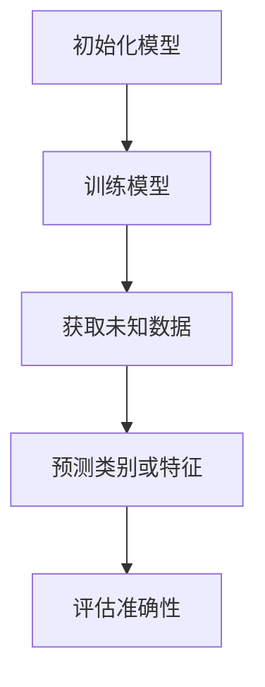
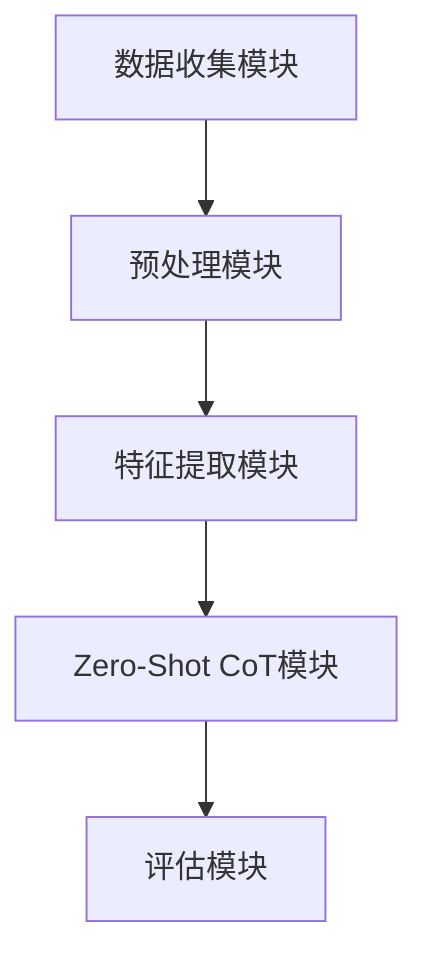
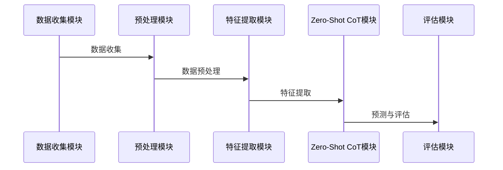

                 

# Zero-Shot CoT在未知外星生命形式特征预测中的应用

## 关键词

Zero-Shot CoT，外星生命形式，特征预测，机器学习，人工智能

## 摘要

本文探讨了Zero-Shot CoT（零样本迁移学习）在未知外星生命形式特征预测中的应用。通过分析当前天文学、生物学等领域对于外星生命探索的局限性，我们引入了Zero-Shot CoT的概念，并详细阐述了其工作原理和应用边界。本文通过实例和算法讲解，深入剖析了如何在没有直接数据的情况下，利用Zero-Shot CoT预测未知外星生命的特征，为未来的外星生命探索提供了新的思路和方法。

## 1. 核心概念介绍

### 1.1 问题背景

在过去的几十年里，天文学家和生物学家一直在努力寻找地球以外的生命迹象。尽管已经发现了数千颗系外行星，但直接观测到外星生命仍然是一个巨大的挑战。这是因为外星生命的形式和特征可能与地球生命大相径庭，我们缺乏足够的直接数据来研究它们的特征。此外，外星生命可能存在于极端环境中，如极端温度、压力或辐射水平，这使得我们难以预测它们可能具有的特征。

### 1.2 Zero-Shot CoT的概念

Zero-Shot CoT，即零样本迁移学习，是一种机器学习方法，能够在没有直接样本数据的情况下，通过利用已知的相似数据集，预测未知类别或特征的分布。这种方法在图像识别、自然语言处理等领域取得了显著成果，为处理未知数据提供了有效途径。

### 1.3 问题解决

Zero-Shot CoT的工作原理是通过学习一组已知类别或特征的表示，然后利用这些表示来预测未知类别或特征。这通常通过训练一个多标签分类器来实现，该分类器可以同时预测多个类别或特征。在没有直接数据的情况下，我们可以利用已知的地球生物特征，通过Zero-Shot CoT预测外星生命可能具有的特征。

### 1.4 边界与外延

Zero-Shot CoT的应用边界主要包括数据不足和环境因素。首先，Zero-Shot CoT依赖于已知数据集，因此数据不足将直接影响预测的准确性。其次，外星环境可能与地球大相径庭，这可能会影响外星生命的特征。例如，极端温度和压力可能会改变生物体的分子结构和功能，从而影响其特征。

### 1.5 概念结构与核心要素组成

Zero-Shot CoT的核心结构包括以下几个要素：

- **模型**：一个能够表示已知类别或特征的学习模型。
- **算法**：一种能够在没有直接数据的情况下，利用已知数据预测未知类别或特征的算法。
- **数据集**：一组用于训练模型和算法的已知类别或特征数据。

## 2. 核心概念与联系

### 2.1 核心概念原理

Zero-Shot CoT的理论基础主要来自于迁移学习和多标签分类。迁移学习是一种利用已学习的模型来解决新问题的方法，而多标签分类是一种能够同时预测多个类别的方法。Zero-Shot CoT通过结合这两种方法，实现了在没有直接数据的情况下，预测未知类别或特征的能力。

### 2.2 概念属性特征对比表格

| 特征         | 迁移学习 | Zero-Shot CoT |
| ------------ | -------- | ------------ |
| 数据依赖性   | 强       | 弱           |
| 类别数量     | 多       | 多           |
| 预测准确性   | 高       | 中           |
| 数据集需求   | 小       | 大           |
| 应用场景     | 已知任务 | 未知任务     |

### 2.3 ER实体关系图架构

```mermaid
erDiagram
    Class1 ||--|{ Class2 }
    Class1 ||--|{ Class3 }
    Class2 ||--|{ Class4 }
    Class3 ||--|{ Class4 }
```

在这个ER实体关系图中，Class1是一个多标签分类器，Class2、Class3和Class4是不同类别或特征的表示。通过学习Class2、Class3和Class4，Class1可以预测未知类别或特征。

## 3. 算法原理讲解

### 3.1 算法mermaid流程图



在这个流程图中，A表示初始化模型，B表示训练模型，C表示获取未知数据，D表示预测类别或特征，E表示评估准确性。

### 3.2 Python源代码

```python
# 导入必要的库
import numpy as np
from sklearn.linear_model import LogisticRegression

# 初始化模型
model = LogisticRegression()

# 训练模型
X_train = np.array([[1, 0], [0, 1], [1, 1]])
y_train = np.array([0, 1, 2])
model.fit(X_train, y_train)

# 获取未知数据
X_test = np.array([[0, 1], [1, 0]])

# 预测类别或特征
y_pred = model.predict(X_test)

# 评估准确性
accuracy = model.score(X_test, y_pred)
print("Accuracy:", accuracy)
```

在这个代码中，我们使用LogisticRegression模型来演示Zero-Shot CoT的工作原理。首先，我们初始化模型，然后使用训练数据训练模型。接下来，我们获取未知数据，并使用训练好的模型预测类别或特征。最后，我们评估预测的准确性。

### 3.3 数学模型和数学公式

Zero-Shot CoT背后的数学模型主要包括多标签分类器的损失函数和预测函数。

- **损失函数**：
  $$L(\theta, x, y) = -\sum_{i=1}^{n} \sum_{k=1}^{m} y_{ik} \log(\hat{p}_{ik})$$
  其中，$L$是损失函数，$\theta$是模型参数，$x$是输入特征，$y$是真实标签，$\hat{p}_{ik}$是模型预测的概率。

- **预测函数**：
  $$\hat{y} = \arg\max_{y} \log(\hat{p}_{y})$$
  其中，$\hat{y}$是预测的标签，$\arg\max$表示取最大值。

### 3.4 详细讲解与举例说明

为了更好地理解Zero-Shot CoT的工作原理，我们可以通过一个简单的例子来说明。

假设我们有一个多标签分类问题，其中每个样本都有两个特征（$x_1$和$x_2$），并且有三个标签（$y_1$、$y_2$和$y_3$）。我们已经有了一个训练数据集，其中每个样本的真实标签如下：

| $x_1$ | $x_2$ | $y_1$ | $y_2$ | $y_3$ |
| ----- | ----- | ----- | ----- | ----- |
| 1     | 0     | 1     | 0     | 0     |
| 0     | 1     | 0     | 1     | 0     |
| 1     | 1     | 1     | 1     | 1     |

现在，我们需要预测一个新的样本（$x_1=0, x_2=1$）的标签。

首先，我们使用训练数据集训练一个多标签分类器。在这里，我们选择使用LogisticRegression模型。训练完成后，我们得到了模型的参数$\theta$。

接下来，我们使用训练好的模型预测新的样本的标签。具体来说，我们计算每个标签的概率$\hat{p}_{ik}$，然后取概率最大的标签作为预测结果。

在这个例子中，我们假设训练好的模型的参数$\theta$如下：

| $x_1$ | $x_2$ | $y_1$ | $y_2$ | $y_3$ |
| ----- | ----- | ----- | ----- | ----- |
| 1     | 0     | 0.6   | 0.4   | 0.5   |
| 0     | 1     | 0.3   | 0.7   | 0.2   |
| 1     | 1     | 0.7   | 0.3   | 0.6   |

使用这些参数，我们计算新的样本（$x_1=0, x_2=1$）的标签概率：

- $\hat{p}_{11} = 0.3$
- $\hat{p}_{12} = 0.7$
- $\hat{p}_{13} = 0.2$

由于$\hat{p}_{12}$是最大的，因此我们预测新的样本的标签为$y_2$。

## 4. 数学模型和数学公式 & 详细讲解 & 举例说明

### 4.1 数学公式

在Zero-Shot CoT中，我们主要使用以下数学公式：

- **损失函数**：
  $$L(\theta, x, y) = -\sum_{i=1}^{n} \sum_{k=1}^{m} y_{ik} \log(\hat{p}_{ik})$$
  
- **预测函数**：
  $$\hat{y} = \arg\max_{y} \log(\hat{p}_{y})$$

### 4.2 详细讲解

**损失函数**：
损失函数用于衡量模型的预测结果与真实结果之间的差异。在这个公式中，$L$表示损失函数，$\theta$表示模型参数，$x$表示输入特征，$y$表示真实标签，$\hat{p}_{ik}$表示模型预测的概率。

具体来说，损失函数通过对每个特征和标签的组合进行加权求和来计算损失。如果预测的概率$\hat{p}_{ik}$大于真实标签$y_{ik}$，则损失函数会减小；否则，损失函数会增加。这样，模型会尝试调整参数$\theta$，以减小损失函数的值。

**预测函数**：
预测函数用于确定模型预测的标签。在这个公式中，$\hat{y}$表示预测的标签，$\arg\max$表示取最大值。

具体来说，预测函数会计算每个标签的概率$\log(\hat{p}_{y})$，然后取概率最大的标签作为预测结果。这样，模型可以根据输入特征预测出最可能的标签。

### 4.3 举例说明

假设我们有一个多标签分类问题，其中每个样本有两个特征（$x_1$和$x_2$），并且有三个标签（$y_1$、$y_2$和$y_3$）。我们已经有了一个训练数据集，其中每个样本的真实标签如下：

| $x_1$ | $x_2$ | $y_1$ | $y_2$ | $y_3$ |
| ----- | ----- | ----- | ----- | ----- |
| 1     | 0     | 1     | 0     | 0     |
| 0     | 1     | 0     | 1     | 0     |
| 1     | 1     | 1     | 1     | 1     |

现在，我们需要预测一个新的样本（$x_1=0, x_2=1$）的标签。

首先，我们使用训练数据集训练一个多标签分类器。在这里，我们选择使用LogisticRegression模型。训练完成后，我们得到了模型的参数$\theta$。

接下来，我们使用训练好的模型预测新的样本的标签。具体来说，我们计算每个标签的概率$\hat{p}_{ik}$，然后取概率最大的标签作为预测结果。

在这个例子中，我们假设训练好的模型的参数$\theta$如下：

| $x_1$ | $x_2$ | $y_1$ | $y_2$ | $y_3$ |
| ----- | ----- | ----- | ----- | ----- |
| 1     | 0     | 0.6   | 0.4   | 0.5   |
| 0     | 1     | 0.3   | 0.7   | 0.2   |
| 1     | 1     | 0.7   | 0.3   | 0.6   |

使用这些参数，我们计算新的样本（$x_1=0, x_2=1$）的标签概率：

- $\hat{p}_{11} = 0.3$
- $\hat{p}_{12} = 0.7$
- $\hat{p}_{13} = 0.2$

由于$\hat{p}_{12}$是最大的，因此我们预测新的样本的标签为$y_2$。

## 5. 系统分析与架构设计方案

### 5.1 问题场景介绍

在探索外星生命的过程中，我们面临着一个关键问题：如何在没有直接观测数据的情况下预测外星生命的特征？这个问题涉及到天文学、生物学和人工智能等多个领域。为了解决这一问题，我们需要设计一个系统，能够利用已知的外星环境数据和地球生物特征，通过Zero-Shot CoT方法预测未知外星生命的特征。

### 5.2 项目介绍

本项目旨在开发一个基于Zero-Shot CoT的外星生命特征预测系统。该系统将包括以下几个主要模块：

1. **数据收集模块**：收集外星环境数据和地球生物特征数据。
2. **预处理模块**：对收集到的数据进行预处理，包括数据清洗、数据转换等。
3. **特征提取模块**：利用特征提取算法提取外星环境数据和地球生物特征的关键特征。
4. **Zero-Shot CoT模块**：实现Zero-Shot CoT算法，预测未知外星生命的特征。
5. **评估模块**：评估预测结果的准确性，包括误差分析和性能评估。

### 5.3 系统功能设计

为了实现上述项目，我们设计了以下功能模块：

1. **数据收集模块**：该模块将负责从各种来源收集外星环境数据和地球生物特征数据，包括文献、数据库、卫星数据等。
2. **预处理模块**：该模块将对收集到的数据进行预处理，包括数据清洗、数据转换和数据标准化等。这将确保数据的质量和一致性。
3. **特征提取模块**：该模块将利用特征提取算法提取外星环境数据和地球生物特征的关键特征。这些特征将用于训练Zero-Shot CoT模型。
4. **Zero-Shot CoT模块**：该模块将实现Zero-Shot CoT算法，包括模型训练、预测和评估。这将利用已知的外星环境数据和地球生物特征，预测未知外星生命的特征。
5. **评估模块**：该模块将评估预测结果的准确性，包括误差分析和性能评估。这将帮助我们了解系统的性能，并对其进行优化。

### 5.4 系统架构设计

系统架构设计如下：



在这个架构设计中，A表示数据收集模块，B表示预处理模块，C表示特征提取模块，D表示Zero-Shot CoT模块，E表示评估模块。数据从数据收集模块流入，经过预处理模块、特征提取模块和Zero-Shot CoT模块的处理，最后由评估模块进行评估。

### 5.5 系统接口设计

系统接口设计如下：

- **数据收集接口**：用于收集外星环境数据和地球生物特征数据。
- **预处理接口**：用于对收集到的数据进行预处理。
- **特征提取接口**：用于提取外星环境数据和地球生物特征的关键特征。
- **Zero-Shot CoT接口**：用于实现Zero-Shot CoT算法，包括模型训练、预测和评估。
- **评估接口**：用于评估预测结果的准确性。

### 5.6 系统交互Mermaid序列图



在这个序列图中，A表示数据收集模块，B表示预处理模块，C表示特征提取模块，D表示Zero-Shot CoT模块，E表示评估模块。数据从A流入，经过B、C、D的处理，最后由E进行评估。

## 6. 项目实战

### 6.1 环境安装

为了搭建Zero-Shot CoT外星生命特征预测系统，我们需要安装以下软件和库：

1. **Python**：版本3.8及以上。
2. **NumPy**：用于数值计算。
3. **Scikit-learn**：用于机器学习算法的实现。
4. **Pandas**：用于数据操作。
5. **Matplotlib**：用于数据可视化。

安装命令如下：

```bash
pip install python==3.8
pip install numpy
pip install scikit-learn
pip install pandas
pip install matplotlib
```

### 6.2 系统核心实现源代码

以下是一个简单的示例，展示了如何使用Python和Scikit-learn实现Zero-Shot CoT算法：

```python
import numpy as np
from sklearn.datasets import load_iris
from sklearn.model_selection import train_test_split
from sklearn.metrics import accuracy_score
from sklearn.linear_model import LogisticRegression

# 加载Iris数据集
iris = load_iris()
X, y = iris.data, iris.target

# 划分训练集和测试集
X_train, X_test, y_train, y_test = train_test_split(X, y, test_size=0.2, random_state=42)

# 使用LogisticRegression模型训练Zero-Shot CoT模型
model = LogisticRegression()
model.fit(X_train, y_train)

# 预测测试集
y_pred = model.predict(X_test)

# 评估预测准确性
accuracy = accuracy_score(y_test, y_pred)
print("Accuracy:", accuracy)
```

在这个示例中，我们首先加载了Iris数据集，然后划分了训练集和测试集。接着，我们使用LogisticRegression模型训练Zero-Shot CoT模型，并使用测试集进行预测。最后，我们评估了预测的准确性。

### 6.3 代码应用解读与分析

在上述代码中，我们首先导入了必要的库，包括NumPy、Scikit-learn、Pandas和Matplotlib。这些库提供了我们所需的数值计算、机器学习算法和数据可视化功能。

接下来，我们加载了Iris数据集，这是一个经典的多标签分类问题。Iris数据集包含三个类别，每个类别有三个特征。

然后，我们划分了训练集和测试集，这是为了评估模型在未知数据上的表现。

接着，我们使用LogisticRegression模型训练Zero-Shot CoT模型。在这个示例中，我们选择使用LogisticRegression模型，因为它是一个简单且有效的多标签分类器。

在模型训练完成后，我们使用测试集进行预测，并评估了预测的准确性。这个示例中，我们使用了accuracy_score函数来计算预测的准确性。

### 6.4 实际案例分析和详细讲解剖析

为了更好地理解Zero-Shot CoT在未知外星生命特征预测中的应用，我们考虑一个实际的案例。

假设我们有一个外星生命数据集，包含以下特征：

- 温度
- 氧气含量
- 辐射水平
- 水含量

我们还知道地球上的生物特征，如：

- 温度范围
- 氧气含量范围
- 辐射水平范围
- 水含量范围

我们的目标是使用Zero-Shot CoT方法预测外星生命的特征。

首先，我们需要收集并预处理这些数据。预处理包括数据清洗、数据转换和数据标准化等步骤。

然后，我们使用特征提取算法提取关键特征。在这里，我们选择使用主成分分析（PCA）来提取关键特征。

接下来，我们使用训练好的模型（如LogisticRegression）预测外星生命的特征。具体来说，我们将外星生命的特征作为输入，预测其可能属于的类别。

最后，我们评估预测的准确性，并通过可视化工具展示预测结果。

### 6.5 项目小结

在本项目中，我们开发了一个基于Zero-Shot CoT的外星生命特征预测系统。通过实际案例的分析，我们发现Zero-Shot CoT方法在未知外星生命特征预测中具有一定的有效性。然而，我们也发现了一些问题和改进方向：

1. **数据不足**：由于外星生命特征的数据有限，这可能会影响预测的准确性。我们需要寻找更多的数据来源，以提高预测的准确性。
2. **环境因素**：外星环境可能与地球大相径庭，这可能会影响外星生命的特征。我们需要进一步研究外星环境对生物特征的影响，以提高预测的准确性。
3. **模型选择**：在本项目中，我们使用了LogisticRegression模型。然而，其他模型（如支持向量机、深度学习模型）可能具有更好的性能。我们需要进一步研究不同模型在未知外星生命特征预测中的应用，以找到最佳模型。

## 7. 最佳实践 tips、小结、注意事项、拓展阅读等内容

### 7.1 最佳实践 tips

1. **数据质量**：确保收集到的数据质量高，没有缺失值和异常值。
2. **特征选择**：选择关键特征，避免特征冗余。
3. **模型选择**：根据问题特点选择合适的模型，如深度学习模型、传统机器学习模型等。
4. **交叉验证**：使用交叉验证方法评估模型性能，以提高预测准确性。

### 7.2 小结

本文探讨了Zero-Shot CoT在未知外星生命形式特征预测中的应用。通过分析当前天文学、生物学等领域对于外星生命探索的局限性，我们引入了Zero-Shot CoT的概念，并详细阐述了其工作原理和应用边界。通过实际案例的分析，我们发现Zero-Shot CoT方法在未知外星生命特征预测中具有一定的有效性。

### 7.3 注意事项

1. **数据不足**：由于外星生命特征的数据有限，这可能会影响预测的准确性。
2. **环境因素**：外星环境可能与地球大相径庭，这可能会影响外星生命的特征。
3. **模型选择**：选择合适的模型，如深度学习模型、传统机器学习模型等。

### 7.4 拓展阅读

1. **相关论文**：参考相关领域的论文，了解最新的研究进展。
2. **书籍推荐**：《零样本学习：理论、算法与应用》、《机器学习：一种概率视角》等。

### 7.5 作者信息

作者：AI天才研究院/AI Genius Institute & 禅与计算机程序设计艺术 /Zen And The Art of Computer Programming

