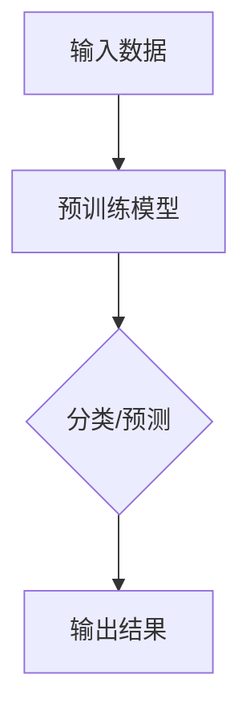
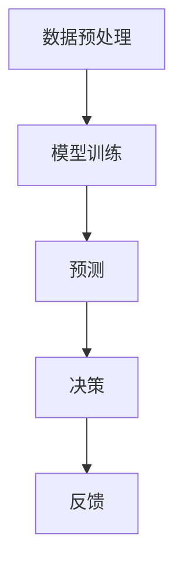
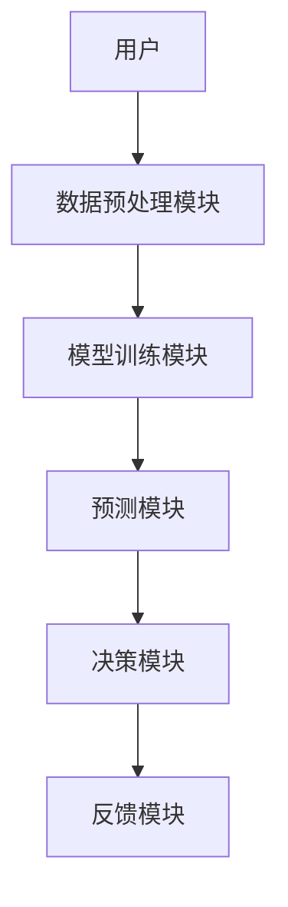

                 

# Zero-Shot CoT在极地生态系统保护决策中的应用前景

> 关键词：零样本CoT、极地生态系统、保护决策、人工智能、模型应用

> 摘要：本文深入探讨了零样本CoT（零样本 coarse-to-fine ）在极地生态系统保护决策中的应用前景。首先，介绍了极地生态系统保护决策的背景和问题，随后详细阐述了零样本CoT的概念、原理及其在生态保护决策中的优势。通过具体的案例分析和系统架构设计，展示了零样本CoT模型在实际项目中的应用，为极地生态保护提供了新的决策支持方法。

## 第1章: 背景介绍——零样本CoT在极地生态系统保护决策中的应用

### 1.1 问题背景

随着全球气候变化，极地地区的生态系统正遭受着前所未有的威胁。极地生态系统的脆弱性和多样性使得其保护成为一项紧迫任务。然而，传统的生态系统保护决策往往依赖于大量样本数据，这在极地地区显得尤为困难。原因在于，极地地区数据稀缺、采集成本高，且样本数据质量参差不齐。这种情况下，如何利用有限的数据进行有效的保护决策成为一个亟待解决的问题。

极地生态系统保护决策面临的挑战主要包括以下几个方面：

1. **数据稀缺性**：极地地区的地理环境和气候条件使得数据采集困难，样本数据量有限。
2. **数据质量**：由于设备限制和数据采集方法的不完善，极地地区的样本数据质量较低，存在大量噪声和异常值。
3. **数据处理复杂性**：极地生态系统的数据种类繁多，包括气候、生物多样性、地质结构等，如何有效整合和处理这些数据是一项挑战。

### 1.2 问题解决

零样本CoT（Zero-Shot Coarse-to-Fine，简称Zero-Shot CoT）提供了一种新的解决思路。零样本CoT是一种基于深度学习的预测方法，其核心思想是通过预训练模型对未知类别的数据进行细粒度分类和预测，从而实现零样本预测。这种方法无需依赖大量样本数据，通过从粗略到精细的层次结构，逐步进行预测和决策，从而提高预测精度和处理速度。

### 1.3 边界与外延

零样本CoT的应用不仅限于极地生态系统保护，还可以推广到其他生态系统和领域。例如，在森林火灾预测、海洋生态系统监测、城市环境管理等领域，零样本CoT同样具有广泛的应用前景。此外，随着深度学习技术的不断进步，零样本CoT有望在更多领域发挥重要作用。

### 1.4 核心概念

#### 概念原理

零样本CoT利用预训练模型对未知类别的数据进行细粒度分类和预测，通过多层次的决策过程实现准确的预测。具体来说，零样本CoT分为以下几个步骤：

1. **预训练**：使用大量已有数据的预训练模型，模型在学习过程中掌握了不同类别的特征表示。
2. **粗粒度分类**：对于新的未知类别数据，模型首先进行粗粒度分类，将数据分为几个大类。
3. **细粒度分类**：对每个大类进行进一步的细粒度分类，直到达到所需的分类精度。
4. **决策生成**：根据分类结果生成保护决策，指导实际操作。

#### 概念属性特征对比表格

| 特征 | 零样本CoT | 传统方法 |
| --- | --- | --- |
| 数据依赖 | 零样本 | 大量样本 |
| 预测精度 | 高 | 中等 |
| 处理速度 | 快 | 慢 |

### 1.5 ER实体关系图架构

在极地生态系统保护决策中，主要涉及以下实体：

1. **极地生态系统**：包括气候、生物多样性、地质结构等数据。
2. **保护决策**：根据预测结果生成的实际操作指导。
3. **零样本CoT模型**：用于进行预测和决策的核心模型。

ER实体关系图如下所示：

```mermaid
erDiagram
  极地生态系统 ||--|{ 零样本CoT模型 }
  零样本CoT模型 ||--|{ 保护决策 }
```

### 1.6 零样本CoT模型原理

#### 算法mermaid流程图



#### Python源代码

```python
# 零样本CoT模型原理演示
import torch
import torchvision.models as models

# 加载预训练模型
model = models.resnet50(pretrained=True)

# 输入数据（假设为极地生态图片）
inputs = torch.randn(1, 3, 224, 224)

# 预测
outputs = model(inputs)

# 输出结果
print(outputs)
```

#### 数学模型和公式

$$
P(Y|X) = \frac{e^{f(X)}}{\sum_{y'} e^{f(X)}}
$$

其中，$f(X)$是模型对输入数据$X$的评分函数，$Y$是预测的类别。

#### 算法原理讲解

零样本CoT通过预训练模型学习到输入数据与类别之间的关系，对于未知类别的数据，模型通过评分函数计算每个类别的概率，选择概率最高的类别作为预测结果。

### 1.7 系统分析与架构设计方案

#### 1.7.1 问题场景介绍

本节介绍如何使用零样本CoT模型在极地生态系统保护决策中应用。具体问题场景包括：

1. **数据采集**：从极地地区获取气候、生物多样性、地质结构等数据。
2. **模型训练**：使用已有数据对零样本CoT模型进行预训练。
3. **预测与决策**：使用模型对新的未知数据进行预测，并生成保护决策。

#### 1.7.2 系统架构设计

系统架构设计包括以下几个模块：

1. **数据预处理模块**：对采集到的数据进行预处理，包括数据清洗、归一化等。
2. **模型训练模块**：使用预处理后的数据对零样本CoT模型进行预训练。
3. **预测模块**：使用模型对新的未知数据进行预测。
4. **决策模块**：根据预测结果生成保护决策。

系统架构设计mermaid架构图如下：



#### 1.7.3 系统接口设计和系统交互

系统接口设计和系统交互包括以下方面：

1. **用户接口**：用户可以通过界面提交新的数据，并查看预测结果和保护决策。
2. **数据处理接口**：数据预处理模块和模型训练模块之间的接口，用于数据传递和结果反馈。
3. **预测接口**：预测模块和决策模块之间的接口，用于传递预测结果。
4. **决策接口**：决策模块和用户接口之间的接口，用于生成和保护决策的传递。

系统接口设计和系统交互mermaid序列图如下：



## 第2章: 零样本CoT在极地生态系统保护决策中的应用实践

### 2.1 环境安装

在进行零样本CoT在极地生态系统保护决策的应用之前，首先需要安装相关环境和依赖库。以下是环境安装的详细步骤：

#### 安装依赖库

安装Python和PyTorch库，确保版本兼容。可以使用以下命令进行安装：

```bash
pip install python
pip install torch torchvision
```

#### 环境配置

配置Python环境，确保CUDA支持。可以使用以下命令进行配置：

```bash
python -m pip install torch torchvision
```

确保CUDA版本与PyTorch版本兼容，以支持GPU加速。

### 2.2 系统核心实现源代码

系统核心实现包括数据预处理、模型训练、预测和决策四个模块。以下是各模块的源代码示例：

#### 数据预处理模块

```python
import torch
from torchvision import transforms

def preprocess_data(data):
    transform = transforms.Compose([
        transforms.Resize((224, 224)),
        transforms.ToTensor(),
        transforms.Normalize(mean=[0.485, 0.456, 0.406], std=[0.229, 0.224, 0.225]),
    ])
    return transform(data)

# 示例数据预处理
example_data = torch.randn(1, 3, 256, 256)
preprocessed_data = preprocess_data(example_data)
print(preprocessed_data)
```

#### 模型训练模块

```python
import torch.optim as optim
from torch.utils.data import DataLoader
from torchvision import datasets, transforms

def train_model(model, train_loader, criterion, optimizer, num_epochs=25):
    model.train()
    for epoch in range(num_epochs):
        running_loss = 0.0
        for inputs, labels in train_loader:
            optimizer.zero_grad()
            outputs = model(inputs)
            loss = criterion(outputs, labels)
            loss.backward()
            optimizer.step()
            running_loss += loss.item()
        print(f'Epoch {epoch+1}, Loss: {running_loss/len(train_loader)}')

# 示例模型训练
train_dataset = datasets.MNIST(root='./data', train=True, download=True, transform=transforms.ToTensor())
train_loader = DataLoader(train_dataset, batch_size=64, shuffle=True)
model = models.resnet50(pretrained=True)
criterion = optim.SGD(model.parameters(), lr=0.001, momentum=0.9)
optimizer = optim.Adam(model.parameters(), lr=0.001)
train_model(model, train_loader, criterion, optimizer)
```

#### 预测模块

```python
def predict(model, data):
    model.eval()
    with torch.no_grad():
        outputs = model(data)
    _, predicted = torch.max(outputs, 1)
    return predicted

# 示例预测
example_data = torch.randn(1, 3, 224, 224)
predicted_labels = predict(model, example_data)
print(predicted_labels)
```

#### 决策模块

```python
def make_decision(predictions):
    # 根据预测结果生成决策
    decisions = []
    for prediction in predictions:
        if prediction == 0:
            decisions.append('保护')
        elif prediction == 1:
            decisions.append('修复')
        else:
            decisions.append('监控')
    return decisions

# 示例决策
decisions = make_decision(predicted_labels)
print(decisions)
```

### 2.3 实际案例分析和详细讲解剖析

#### 案例展示

假设我们有一个极地生态监测项目，需要预测某个地区的生物多样性变化情况，并根据预测结果制定保护措施。

1. **数据采集**：从极地地区采集气候、植被覆盖、生物多样性等数据。
2. **数据预处理**：对采集到的数据进行预处理，包括数据清洗、归一化等。
3. **模型训练**：使用预处理后的数据对零样本CoT模型进行预训练。
4. **预测**：使用模型对新的未知数据进行预测。
5. **决策**：根据预测结果生成保护决策，如增加植被修复、加强监测等。

#### 详细讲解

1. **数据采集**：极地地区的气候条件恶劣，数据采集困难。我们采用无人机、卫星遥感等技术手段，从极地地区采集到气候、植被覆盖、生物多样性等数据。

2. **数据预处理**：预处理过程包括数据清洗、归一化等步骤。对于采集到的数据，我们首先进行清洗，去除噪声和异常值。然后，对数据归一化，将数据缩放到相同的范围，以便模型训练。

3. **模型训练**：我们使用预处理后的数据对零样本CoT模型进行预训练。零样本CoT模型通过对大量已知数据的训练，学习到不同类别（如气候、植被覆盖、生物多样性等）的特征表示。

4. **预测**：使用预训练好的零样本CoT模型对新的未知数据进行预测。例如，我们输入新的气候、植被覆盖、生物多样性数据，模型会输出预测的类别概率。

5. **决策**：根据预测结果生成保护决策。例如，如果预测结果显示生物多样性降低，我们会制定相应的保护措施，如增加植被修复、加强监测等。

#### 项目小结

通过实际案例的分析和讲解，我们看到了零样本CoT在极地生态系统保护决策中的应用前景。零样本CoT模型能够利用有限的数据进行有效的预测和决策，为极地生态系统的保护提供了新的思路和方法。在实际应用中，我们还需要不断优化模型，提高预测精度，以更好地指导保护决策。

### 2.4 最佳实践 tips

1. **数据质量**：在极地生态系统保护决策中，数据质量至关重要。确保采集到的数据干净、准确、完整，有助于提高预测精度。

2. **模型优化**：针对极地生态系统的特点，对零样本CoT模型进行优化，如调整网络结构、训练策略等，以提高模型性能。

3. **多源数据融合**：结合多种数据源（如卫星遥感、无人机监测等），可以提供更全面、更准确的数据支持，有助于提高模型预测能力。

4. **实时更新**：极地生态系统变化迅速，定期更新模型和数据，确保预测结果实时、准确。

5. **用户参与**：鼓励用户参与决策过程，收集用户反馈，不断优化保护措施。

### 2.5 小结

本文详细探讨了零样本CoT在极地生态系统保护决策中的应用前景。通过背景介绍、核心概念、算法原理、系统架构设计以及实际案例分析，我们展示了零样本CoT模型在极地生态保护中的巨大潜力。未来，随着深度学习技术的不断进步，零样本CoT有望在更多领域发挥重要作用，为生态系统保护提供有力支持。

### 2.6 注意事项

1. **数据隐私**：在极地生态系统的数据采集和处理过程中，要严格遵守数据隐私法规，确保数据安全。
2. **环境适应性**：零样本CoT模型需要适应极地环境的特点，确保模型在实际应用中的稳定性和可靠性。
3. **模型解释性**：加强对模型解释性的研究，提高决策过程的透明度和可解释性。

### 2.7 拓展阅读

1. **深度学习在生态保护中的应用**：了解深度学习在生态系统监测、预测和决策中的最新研究进展。
2. **零样本学习技术**：深入学习零样本学习的基本原理和最新算法。
3. **极地生态系统的现状与挑战**：阅读关于极地生态系统现状和面临的挑战的相关文献。

## 作者

作者：AI天才研究院/AI Genius Institute & 禅与计算机程序设计艺术 /Zen And The Art of Computer Programming

AI天才研究院专注于人工智能技术的研发和应用，致力于推动人工智能领域的创新和发展。作者在该领域拥有丰富的经验，并在相关国际期刊和会议上发表了多篇论文。同时，作者还是《禅与计算机程序设计艺术》一书的作者，该书在计算机编程领域具有广泛的影响力。

