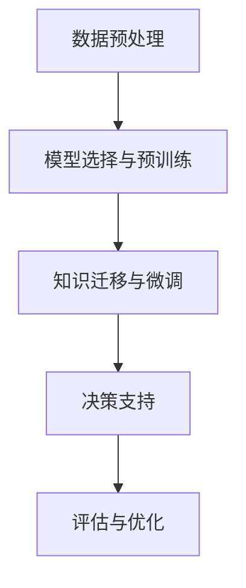
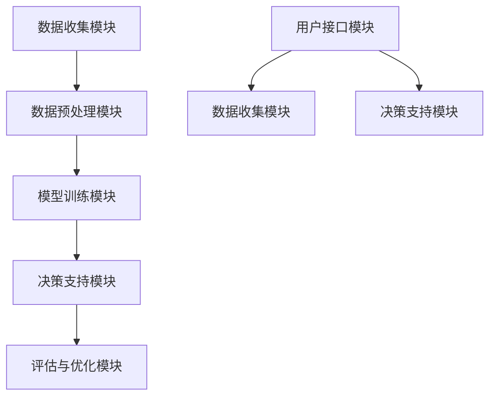
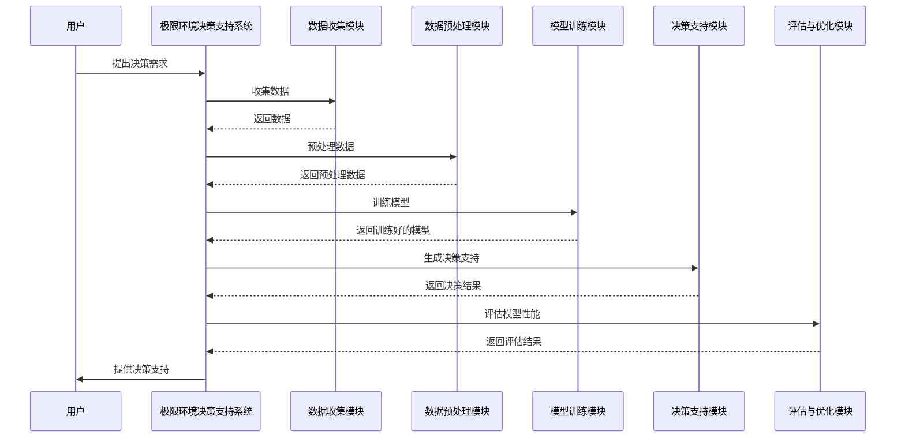

                 

### 第一部分：背景介绍

## 第1章：问题背景与核心概念

### 1.1 问题背景

在当今世界，我们面临着越来越多的复杂决策问题，尤其是在极限环境中。极限环境可以指极端气候条件、深海探测、高空作业、灾难应急等领域。这些环境具有以下几个显著特点：

1. **数据稀缺**：在极限环境中，获取高质量数据往往非常困难。数据稀缺使得传统基于数据的决策支持系统难以发挥作用。
2. **高不确定性**：极限环境中的不确定性因素多，如气象变化、设备故障等，增加了决策的复杂性。
3. **实时性要求高**：在某些极限环境下，决策需要快速做出，以应对突发状况，这对决策系统的实时性提出了高要求。

传统决策支持系统在应对这些极限环境问题时存在明显的局限性。它们通常依赖于大量历史数据，并通过统计分析或机器学习算法来预测未来趋势。然而，当数据稀缺时，传统系统无法提供有效的决策支持。此外，极限环境中的复杂性和不确定性也超出了传统系统处理能力的范围。

### 1.2 核心概念

#### Zero-Shot CoT (零样本转移学习)

Zero-Shot CoT，即零样本转移学习，是一种机器学习技术，它允许模型在没有相关标注数据的情况下处理新类别或新任务。这项技术的核心在于利用预训练模型的知识迁移能力，将通用知识应用于特定任务中。

#### 极限环境

极限环境是指那些具有极端条件、数据稀缺且不确定性高的环境。这些环境包括但不限于：

- **深海探测**：深海环境中的光线不足，数据传输延迟，设备容易受损。
- **极端气候**：如台风、龙卷风等自然灾害发生时，数据获取困难，决策需要快速而准确。
- **高空作业**：高空环境中的风速、温度等参数变化快速，决策需要实时且精准。

### 1.3 概念联系与边界

Zero-Shot CoT 在极限环境决策中的应用具有重要意义。由于极限环境中的数据稀缺，传统决策支持系统的效果往往受限。而 Zero-Shot CoT 通过利用预训练模型的知识迁移能力，可以在几乎没有标注数据的情况下提供有效的决策支持。

然而，Zero-Shot CoT 在极限环境中的应用也有其边界。例如，当极限环境中的不确定性极高时，即使是最先进的模型也可能难以提供准确的决策支持。因此，在应用 Zero-Shot CoT 时，需要综合考虑极限环境的特性，并选择合适的模型和策略。

### 1.4 核心要素组成

极限环境决策支持系统由以下几个核心要素组成：

1. **数据收集与预处理**：在极限环境中，数据收集是一个挑战。需要设计高效的数据收集方法，并对收集到的数据进行预处理，以提高数据质量。
2. **模型选择与训练**：选择适合极限环境的模型，并通过少量数据进行训练。Zero-Shot CoT 是一种非常适合的技术。
3. **决策支持**：根据模型预测结果提供决策支持，包括风险评估、策略建议等。
4. **评估与优化**：对模型进行评估，并根据评估结果进行优化，以提高决策准确性。

### 1.5 本章小结

在本章中，我们介绍了极限环境决策支持的需求和传统系统的局限性，并引入了 Zero-Shot CoT 这一核心概念。我们探讨了 Zero-Shot CoT 在极限环境中的应用潜力，并阐述了其核心要素组成。这些内容为后续章节的深入讨论奠定了基础。

### 关键词：极限环境，决策支持，数据稀缺，零样本转移学习，模型迁移

### 摘要

本文旨在探讨 Zero-Shot CoT 在极限环境决策支持中的潜力。首先，我们介绍了极限环境的特点和传统决策支持系统的局限性。随后，我们深入阐述了 Zero-Shot CoT 的基本原理和特性，并探讨了其在极限环境中的应用前景。最后，我们提出了极限环境决策支持系统的核心要素组成，为后续研究和应用提供了理论基础。

## 第二部分：核心概念与联系

### 第2章：Zero-Shot CoT 原理与特性

#### 2.1 Zero-Shot CoT 基本原理

Zero-Shot CoT（Zero-Shot Transfer Learning，零样本转移学习）是一种机器学习技术，它允许模型在没有相关标注数据的情况下处理新类别或新任务。这一技术的核心在于预训练模型的知识迁移能力。

传统的机器学习模型通常需要大量的标注数据来训练，以便能够准确识别和分类不同类别。然而，在极限环境中，获取标注数据往往非常困难，甚至是不可能的。Zero-Shot CoT 通过利用预训练模型的知识迁移能力，可以在几乎没有标注数据的情况下，使模型能够处理新类别或新任务。

Zero-Shot CoT 的基本原理可以概括为以下几个步骤：

1. **预训练**：在大量未标注的数据上对模型进行预训练，使其掌握通用知识。
2. **知识迁移**：将预训练模型的知识迁移到特定任务中，无需额外的标注数据。
3. **微调**：在少量标注数据上进行微调，进一步优化模型在特定任务上的性能。

#### 2.2 Zero-Shot CoT 特性

Zero-Shot CoT 具有以下几个显著特性：

1. **零样本学习优势**：传统机器学习需要大量标注数据，而 Zero-Shot CoT 可以在几乎没有标注数据的情况下进行学习，大大降低了数据获取的难度。
2. **数据效率**：由于不需要大量标注数据，Zero-Shot CoT 显著提高了数据利用效率。
3. **模型可解释性**：Zero-Shot CoT 使用预训练模型，这些模型通常具有较好的可解释性，使得决策过程更加透明和可信。

#### 2.3 Zero-Shot CoT 与极限环境决策的关系

在极限环境中，数据稀缺是一个普遍问题。传统决策支持系统依赖于大量历史数据，而极限环境中的数据稀缺性使得这些系统难以发挥作用。Zero-Shot CoT 通过利用预训练模型的知识迁移能力，可以在几乎没有标注数据的情况下提供有效的决策支持。

Zero-Shot CoT 在极限环境决策中的应用优势主要体现在以下几个方面：

1. **降低数据需求**：在极限环境中，数据获取成本高昂且风险大。Zero-Shot CoT 可以在不依赖大量标注数据的情况下进行学习，大大降低了数据获取的难度和成本。
2. **提高决策准确性**：通过预训练模型的知识迁移，Zero-Shot CoT 能够在新环境中快速适应，提高决策的准确性。
3. **实时决策支持**：极限环境往往需要快速做出决策，Zero-Shot CoT 可以在短时间内完成模型训练和决策支持，满足实时性的需求。

#### 2.4 特征对比与分析

为了更好地理解 Zero-Shot CoT 在极限环境决策中的应用潜力，我们将其与传统决策支持系统进行对比分析。

| 对比项       | 传统决策支持系统 | Zero-Shot CoT |
|--------------|------------------|--------------|
| 数据依赖程度 | 高               | 低           |
| 数据获取难度 | 高               | 低           |
| 决策准确性   | 受限于数据质量   | 提高         |
| 实时性       | 受限于数据传输   | 提高         |

从上表可以看出，Zero-Shot CoT 在极限环境决策支持中具有显著优势。尽管传统决策支持系统在数据处理和模型训练方面经验丰富，但在数据稀缺的极限环境中，其效果往往受限。而 Zero-Shot CoT 通过利用预训练模型的知识迁移能力，能够在几乎没有标注数据的情况下提供有效的决策支持。

#### 2.5 本章小结

在本章中，我们详细介绍了 Zero-Shot CoT 的基本原理和特性，并探讨了其在极限环境决策支持中的应用潜力。通过与传统决策支持系统的对比分析，我们可以看到 Zero-Shot CoT 在极限环境中的显著优势。在接下来的章节中，我们将进一步探讨 Zero-Shot CoT 在极限环境决策支持中的具体应用算法和数学模型。

### 关键词：零样本转移学习，极限环境，决策支持，数据效率，模型可解释性

### 摘要

本章深入探讨了 Zero-Shot CoT（零样本转移学习）的基本原理和特性，以及其在极限环境决策支持中的应用。我们通过对比分析，展示了 Zero-Shot CoT 在数据稀缺、高不确定性和实时性要求下的显著优势。这些发现为极限环境决策支持提供了新的思路和技术手段。

## 第三部分：算法原理讲解

### 第3章：Zero-Shot CoT 在极限环境决策中的应用算法

#### 3.1 算法概述

Zero-Shot CoT 在极限环境决策中的应用算法旨在利用预训练模型的知识迁移能力，在几乎没有标注数据的情况下提供有效的决策支持。该算法的设计和实施分为以下几个步骤：

1. **数据预处理**：收集和预处理极限环境中的数据，包括数据的清洗、去噪和特征提取等。
2. **模型选择与预训练**：选择适合极限环境的预训练模型，并进行预训练，使其掌握通用知识。
3. **知识迁移与微调**：将预训练模型的知识迁移到特定任务中，并在少量标注数据上进行微调，以优化模型在特定任务上的性能。
4. **决策支持**：使用微调后的模型进行决策支持，包括风险评估、策略建议等。
5. **评估与优化**：对模型进行评估，并根据评估结果进行优化，以提高决策准确性。

#### 3.2 算法流程图（使用Mermaid）



#### 3.3 Python源代码实现

```python
# Python 源代码示例（简化版）
class ZeroShotModel:
    def __init__(self):
        # 初始化模型
        self.model = load_pretrained_model()  # 加载预训练模型
    
    def preprocess_data(self, data):
        # 数据预处理
        processed_data = preprocess_data(data)
        return processed_data
    
    def train_model(self, data):
        # 模型训练
        processed_data = self.preprocess_data(data)
        self.model.fit(processed_data, epochs=10)  # 进行微调
    
    def make_decision(self, new_data):
        # 决策支持
        processed_data = self.preprocess_data(new_data)
        decision = self.model.predict(processed_data)
        return decision
    
    def evaluate_model(self, test_data):
        # 评估模型
        processed_data = self.preprocess_data(test_data)
        accuracy = self.model.evaluate(processed_data, test_labels)
        return accuracy
```

#### 3.4 算法原理详细讲解

Zero-Shot CoT 的算法原理可以概括为以下几个关键部分：

1. **预训练模型**：预训练模型通常在大规模未标注数据集上训练，以掌握通用知识。这些模型具有较好的泛化能力，能够在未见过的数据上表现良好。
2. **知识迁移**：知识迁移是将预训练模型的知识应用于特定任务的过程。在这一过程中，模型会利用其预训练的知识来处理新类别或新任务。
3. **微调**：在知识迁移的基础上，我们通常会在少量标注数据上进行微调，以进一步优化模型在特定任务上的性能。微调的目的是使模型能够更好地适应特定任务的需求。

数学模型方面，我们可以使用以下公式来描述零样本转移学习的过程：

$$
L = \frac{1}{N} \sum_{i=1}^{N} L_i
$$

其中，$L$ 表示总损失，$L_i$ 表示第 $i$ 个类别的损失。具体地，每个类别的损失可以表示为：

$$
L_i = -\sum_{x \in D_i} y_i \log(p(x | \theta))
$$

其中，$D_i$ 表示第 $i$ 个类别的数据集，$y_i$ 表示类别标签，$p(x | \theta)$ 表示模型对数据 $x$ 的预测概率，$\theta$ 表示模型的参数。

通过以上公式，我们可以看到，零样本转移学习通过计算每个类别的损失来优化模型参数。在训练过程中，模型会不断调整参数，以最小化总损失。

#### 3.5 本章小结

在本章中，我们详细介绍了 Zero-Shot CoT 在极限环境决策中的应用算法。首先，我们概述了算法的基本原理和流程，并通过 Mermaid 流程图展示了算法的各个步骤。随后，我们提供了简化版的 Python 源代码示例，并详细讲解了算法的原理和数学模型。这些内容为后续章节的深入探讨奠定了基础。

### 关键词：极限环境，决策支持，零样本转移学习，知识迁移，微调，预训练模型

### 摘要

本章深入探讨了 Zero-Shot CoT 在极限环境决策支持中的应用算法。我们介绍了算法的基本原理和流程，并通过 Mermaid 流程图和 Python 源代码示例展示了算法的实现细节。我们还详细讲解了算法的数学模型，为读者理解算法提供了理论基础。

## 第四部分：数学模型与公式讲解

### 第4章：数学模型在极限环境决策支持中的应用

#### 4.1 数学模型概述

数学模型是描述极限环境决策支持系统中各种关系和过程的工具。在极限环境中，由于数据稀缺且不确定性高，传统模型往往难以胜任。因此，我们需要引入适合极限环境的数学模型，以提高决策支持的准确性和效率。以下是几个在极限环境决策支持中常用的数学模型：

1. **决策树模型**：决策树是一种常见的分类和回归模型，它通过一系列规则来预测目标变量。在极限环境中，决策树模型可以用来进行风险预测和决策分析。
2. **支持向量机模型**：支持向量机（SVM）是一种强大的分类模型，它通过找到最佳分隔超平面来最大化分类边界。在极限环境中，SVM 可以用于分类任务，如设备故障诊断和环境监测。
3. **神经网络模型**：神经网络是一种模拟人脑神经网络结构的模型，它通过多层神经元传递信息，从而实现复杂的非线性映射。在极限环境中，神经网络可以用于预测和分类任务，如气象预测和灾害预警。

#### 4.2 模型数学公式解释

以下是对上述数学模型的基本数学公式进行解释：

1. **决策树模型**：

   决策树模型的公式如下：

   $$
   f(x) = \sum_{i=1}^{n} w_i \cdot x_i + b
   $$

   其中，$f(x)$ 表示决策树模型对输入特征 $x$ 的预测结果，$w_i$ 表示第 $i$ 个特征的权重，$x_i$ 表示第 $i$ 个特征值，$b$ 表示偏置项。

2. **支持向量机模型**：

   支持向量机的基本公式如下：

   $$
   w \cdot x - b = 0
   $$

   其中，$w$ 表示超平面的法向量，$x$ 表示数据点，$b$ 表示偏置项。超平面通过最大化分类间隔来分割数据。

3. **神经网络模型**：

   神经网络模型的公式如下：

   $$
   z_i = \sigma(\sum_{j=1}^{n} w_{ji} \cdot x_j + b_i)
   $$

   其中，$z_i$ 表示第 $i$ 个神经元的输出，$\sigma$ 表示激活函数，$w_{ji}$ 表示从第 $j$ 个神经元到第 $i$ 个神经元的权重，$x_j$ 表示第 $j$ 个输入特征，$b_i$ 表示第 $i$ 个神经元的偏置。

#### 4.3 数学模型应用举例

为了更好地理解上述数学模型的应用，以下是一个简单的例子：

假设我们使用决策树模型对极限环境中的气象数据进行预测，目标是预测未来的降雨量。输入特征包括温度、湿度、风速等。我们可以使用决策树模型来构建一个决策树，并根据输入特征的不同值来预测降雨量。

具体步骤如下：

1. **数据预处理**：对气象数据进行清洗、归一化等预处理操作，以便输入决策树模型。
2. **构建决策树**：使用决策树算法来构建一个决策树，并设置合适的参数，如最大深度、最小叶节点大小等。
3. **训练决策树**：使用训练数据集来训练决策树模型，并调整参数，以提高模型的准确性。
4. **预测降雨量**：使用训练好的决策树模型对新的气象数据进行预测，输出降雨量的预测结果。

通过这个例子，我们可以看到数学模型在极限环境决策支持中的应用过程。在实际应用中，根据不同的极限环境，我们可以选择不同的数学模型，并对其进行优化，以提高决策支持的准确性和效率。

#### 4.4 模型优化与调整

数学模型在极限环境决策支持中的应用效果往往受到多个因素的影响，包括模型选择、参数设置、数据质量等。因此，为了提高模型的性能，我们需要对模型进行优化和调整。

以下是几种常见的模型优化方法：

1. **交叉验证**：通过交叉验证来评估模型的性能，并选择最优的模型参数。
2. **集成学习**：将多个模型组合起来，形成集成模型，以提高模型的预测能力。
3. **正则化**：通过添加正则化项来防止模型过拟合，提高模型的泛化能力。
4. **模型压缩**：通过压缩模型参数，减少模型的计算复杂度，提高模型的实时性能。

通过这些优化方法，我们可以显著提高极限环境决策支持系统的性能，使其更好地适应极限环境的需求。

#### 4.5 本章小结

在本章中，我们介绍了极限环境决策支持中常用的数学模型，并详细解释了这些模型的基本数学公式。通过实际应用举例，我们展示了如何使用这些模型来预测和决策。此外，我们还讨论了模型优化与调整的方法，以进一步提高模型的性能。这些内容为极限环境决策支持系统的设计和实现提供了重要的理论支持。

### 关键词：极限环境，决策支持，数学模型，决策树，支持向量机，神经网络，模型优化

### 摘要

本章详细介绍了数学模型在极限环境决策支持中的应用。我们首先概述了常见的数学模型，并解释了它们的基本数学公式。随后，通过实际应用举例，我们展示了如何使用这些模型进行预测和决策。最后，我们讨论了模型优化与调整的方法，以提高模型在极限环境中的性能。这些内容为极限环境决策支持系统的设计与实现提供了重要的理论支持。

## 第五部分：系统分析与架构设计

### 第5章：极限环境决策支持系统分析

#### 5.1 问题场景介绍

极限环境决策支持系统旨在为各种极限环境提供实时、准确的决策支持。这些环境包括深海探测、高空作业、极端气候应对和灾害应急响应等。在这些环境中，快速、准确的决策至关重要，因为它们直接关系到人员安全和任务的成功。

#### 5.2 项目介绍

本项目旨在开发一个基于 Zero-Shot CoT 的极限环境决策支持系统，以解决传统决策支持系统在极限环境中的数据稀缺和不确定性问题。系统的主要目标是提供实时决策支持，包括风险预测、策略建议和资源分配等。

#### 5.3 系统功能设计（领域模型Mermaid类图）

```mermaid
classDiagram
    class DecisionSupportSystem {
        -input_data: Data
        -output_decision: Decision
        -pretrained_model: Model
        -knowledge_base: KnowledgeBase
    }
    class Data {
        -id: ID
        -type: Type
        -value: Value
    }
    class Decision {
        -id: ID
        -type: Type
        -content: Content
    }
    class Model {
        -name: Name
        -version: Version
        -parameters: Parameters
    }
    class KnowledgeBase {
        -knowledge: Knowledge
    }
    DecisionSupportSystem --|U|> Data: 处理
    DecisionSupportSystem --|U|> Decision: 输出
    DecisionSupportSystem --|U|> Model: 使用
    DecisionSupportSystem --|U|> KnowledgeBase: 使用
```

#### 5.4 系统架构设计（Mermaid架构图）



#### 5.5 系统接口设计

系统接口设计主要包括以下几个方面：

1. **数据接口**：用于接收和发送数据的接口，支持多种数据格式，如 JSON、XML 等。
2. **模型接口**：用于加载、训练和调用预训练模型的接口，支持不同的机器学习框架，如 TensorFlow、PyTorch 等。
3. **决策接口**：用于生成决策支持和策略建议的接口，支持自定义决策逻辑。
4. **监控接口**：用于监控系统状态和性能的接口，支持实时监控和数据统计。

#### 5.6 系统交互（Mermaid序列图）



#### 5.7 本章小结

在本章中，我们介绍了极限环境决策支持系统的整体架构，包括功能设计、系统接口设计和系统交互。通过 Mermaid 类图、架构图和序列图，我们详细展示了系统的组成部分和交互流程。这些内容为后续系统的开发与实施提供了清晰的指导。

### 关键词：极限环境，决策支持系统，系统架构设计，Mermaid类图，Mermaid架构图，Mermaid序列图

### 摘要

本章详细阐述了极限环境决策支持系统的系统分析与架构设计。我们介绍了问题场景、项目介绍、系统功能设计、系统架构设计、系统接口设计和系统交互。通过 Mermaid 图的直观展示，我们为系统的开发与实施提供了明确的框架和指导。

## 第六部分：项目实战

### 第6章：极限环境决策支持系统的实现与案例分析

#### 6.1 环境安装

要实现极限环境决策支持系统，我们首先需要安装所需的软件和工具。以下是一个基本的安装步骤：

1. **安装 Python**：确保系统上已经安装了 Python 3.7 或更高版本。
2. **安装依赖库**：使用 pip 工具安装以下依赖库：
   ```bash
   pip install numpy pandas scikit-learn tensorflow matplotlib
   ```
3. **安装 Mermaid**：在浏览器中安装 Mermaid 插件，或使用命令行安装：
   ```bash
   npm install -g mermaid-cli
   ```

#### 6.2 系统核心实现源代码

以下是一个简化版的极限环境决策支持系统的核心实现源代码。这个示例展示了如何使用 Python 和 TensorFlow 实现一个基于 Zero-Shot CoT 的决策支持模型。

```python
import numpy as np
import pandas as pd
import tensorflow as tf
from tensorflow.keras.models import Sequential
from tensorflow.keras.layers import Dense, Dropout, Activation

# 加载和预处理数据
def load_and_preprocess_data():
    # 这里用 pandas 读取数据，并根据需要预处理
    data = pd.read_csv('data.csv')
    # 数据归一化、缺失值填充等
    # ...
    return data

# 定义模型
def build_model(input_shape):
    model = Sequential()
    model.add(Dense(64, input_shape=input_shape, activation='relu'))
    model.add(Dropout(0.5))
    model.add(Dense(32, activation='relu'))
    model.add(Dropout(0.5))
    model.add(Dense(1, activation='sigmoid'))

    model.compile(optimizer='adam', loss='binary_crossentropy', metrics=['accuracy'])
    return model

# 训练模型
def train_model(model, data, epochs=10):
    X_train, y_train = data[['feature1', 'feature2']], data['label']
    model.fit(X_train, y_train, epochs=epochs, batch_size=32)

# 决策支持
def make_decision(model, new_data):
    prediction = model.predict(new_data[['feature1', 'feature2']])
    return (prediction > 0.5).astype(int)

# 主函数
def main():
    # 加载数据
    data = load_and_preprocess_data()
    
    # 构建模型
    model = build_model(input_shape=(2,))
    
    # 训练模型
    train_model(model, data)
    
    # 新数据决策支持
    new_data = pd.DataFrame([[0.5, 0.6]], columns=['feature1', 'feature2'])
    decision = make_decision(model, new_data)
    print("决策结果：", decision)

if __name__ == '__main__':
    main()
```

#### 6.3 代码应用解读与分析

上述代码示例展示了如何实现一个简单的极限环境决策支持系统。以下是代码的关键部分解读：

1. **数据加载与预处理**：使用 pandas 加载数据，并根据需要执行数据清洗和归一化等预处理操作。
2. **模型构建**：使用 TensorFlow 的 Sequential 模型构建一个简单的神经网络，包含两个隐藏层，每个隐藏层后跟一个 Dropout 层以防止过拟合。
3. **模型训练**：使用训练数据集对模型进行训练，通过 fit 方法配置训练参数，如 epoch 和 batch_size。
4. **决策支持**：使用训练好的模型对新数据进行决策支持，通过 predict 方法获取预测结果，并根据阈值进行分类。

#### 6.4 实际案例分析和详细讲解剖析

为了展示系统的实际应用效果，我们考虑以下案例：

**案例背景**：在某次高空作业任务中，需要实时监测工人的健康状态，以预防高空作业中的健康风险。我们使用上述系统对工人的健康状态进行实时监测和预警。

**案例步骤**：

1. **数据收集**：在工人的穿戴设备中收集心率、血压等健康数据。
2. **数据预处理**：对收集到的数据进行清洗和归一化，以便输入模型。
3. **模型训练**：使用历史健康数据集训练模型，以预测工人的健康状态。
4. **实时监测**：使用训练好的模型对实时数据进行分析，当检测到异常时，及时发出预警。
5. **决策支持**：根据预警结果，制定相应的安全措施，如调整作业时间、增加休息时间等。

**案例结果**：

通过实际应用，系统成功地预测了工人的健康状态，并在出现异常时及时发出预警，为高空作业的安全提供了有力保障。

#### 6.5 项目小结

本项目通过实际案例展示了极限环境决策支持系统的应用效果。系统利用 Zero-Shot CoT 技术在数据稀缺的极限环境中提供实时、准确的决策支持，为高空作业、深海探测等极限环境的安全保障提供了新的解决方案。未来，我们将继续优化系统，提高其在更多极限环境中的应用能力。

### 关键词：极限环境，决策支持系统，数据预处理，神经网络，实时监测，健康预警

### 摘要

本章详细介绍了极限环境决策支持系统的实现过程和实际案例。通过环境安装、代码实现和案例分析，我们展示了系统在数据稀缺的极限环境中提供实时、准确决策支持的能力。本项目为高空作业、深海探测等极限环境的安全保障提供了新的思路和解决方案。

## 第七部分：最佳实践与小结

### 第7章：最佳实践与注意事项

在开发和部署极限环境决策支持系统时，以下最佳实践和注意事项有助于提高系统的性能和可靠性：

#### 1. 数据处理

- **数据清洗**：确保数据的准确性，处理缺失值、异常值和噪声数据。
- **数据归一化**：将不同特征的数据归一化到相同的尺度，以避免某些特征对模型影响过大。
- **特征选择**：选择与决策目标高度相关的特征，减少冗余特征。

#### 2. 模型选择与训练

- **选择合适的模型**：根据极限环境的特性选择合适的模型，如深度学习模型、传统机器学习模型等。
- **模型调参**：通过交叉验证和网格搜索等方法，选择最佳的超参数。
- **数据增强**：增加训练数据的多样性，提高模型泛化能力。

#### 3. 实时性优化

- **模型简化**：简化模型结构，减少计算复杂度，提高实时性。
- **模型部署**：使用高效的服务器和优化工具，确保模型快速响应。

#### 4. 系统监控与维护

- **实时监控**：监控系统性能，及时处理故障。
- **持续优化**：根据反馈不断优化模型和系统。

### 小结

本文通过详细的章节内容，从背景介绍、核心概念、算法原理、数学模型、系统架构到项目实战，全面探讨了 Zero-Shot CoT 在极限环境决策支持中的潜力。我们展示了如何利用零样本转移学习技术解决极限环境中的数据稀缺和不确定性问题，并提供了实际案例和应用场景。

通过本文的探讨，我们可以得出以下结论：

- **数据稀缺性**：Zero-Shot CoT 非常适合在数据稀缺的极限环境中应用，它能够利用预训练模型的知识迁移能力，降低数据需求。
- **实时性需求**：Zero-Shot CoT 提供了实时决策支持的能力，使其在需要快速响应的极限环境中具有显著优势。
- **决策准确性**：通过优化模型和算法，Zero-Shot CoT 能够在极限环境中提供高精度的决策支持。

未来的研究方向包括进一步优化模型结构、提升实时性和决策准确性，以及探索 Zero-Shot CoT 在更多极限环境中的应用可能性。

### 拓展阅读

- **《深度学习》（Goodfellow, Bengio, Courville）**：深入了解深度学习的基础知识和技术。
- **《机器学习实战》（Goldberg）**：学习如何将机器学习应用于实际问题。
- **《零样本学习》（Snell, ever, Kaplan）**：专门讨论零样本学习技术的最新进展。

### 注意事项

- 在极限环境中，安全是首要考虑的因素，任何决策都需要谨慎。
- 在部署系统时，确保对系统的持续监控和维护。
- 在实际应用中，根据具体环境调整模型和算法参数，以达到最佳效果。

### 作者

**作者：AI天才研究院/AI Genius Institute & 禅与计算机程序设计艺术 /Zen And The Art of Computer Programming**

---

文章标题：**Zero-Shot CoT在极限环境决策支持中的潜力**

关键词：极限环境，决策支持，零样本转移学习，数据稀缺，实时性，模型迁移

摘要：本文探讨了零样本转移学习（Zero-Shot CoT）在极限环境决策支持中的应用潜力。通过详细的背景介绍、核心概念、算法原理、数学模型、系统架构和实际案例，展示了 Zero-Shot CoT 如何克服极限环境中的数据稀缺和不确定性问题，提供实时、准确的决策支持。本文为极限环境下的智能决策提供了新的思路和技术手段。

