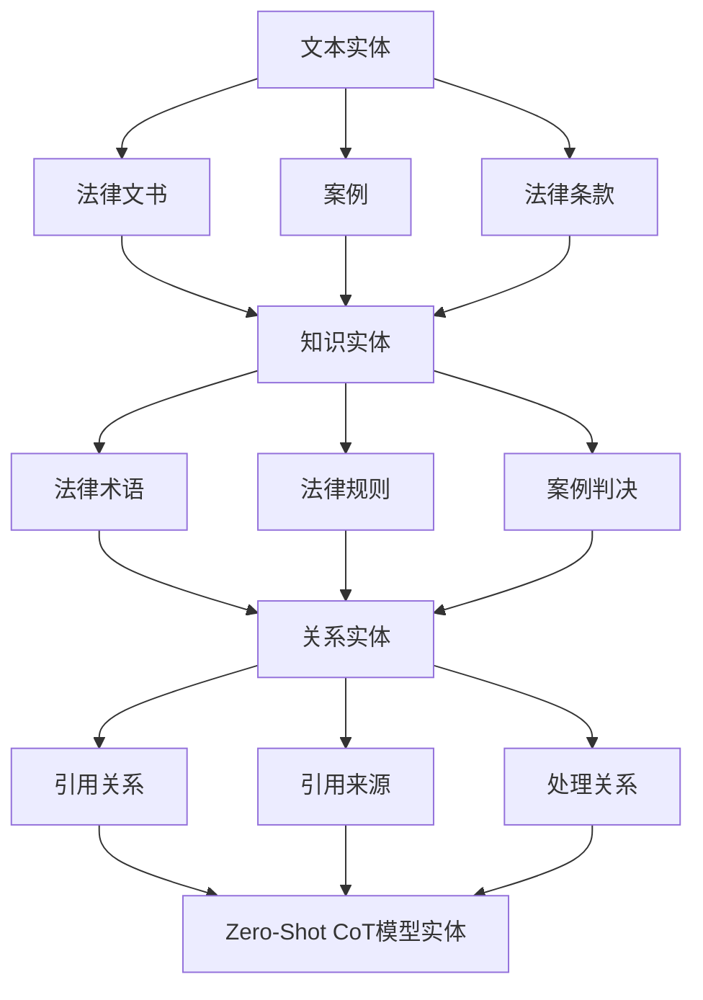
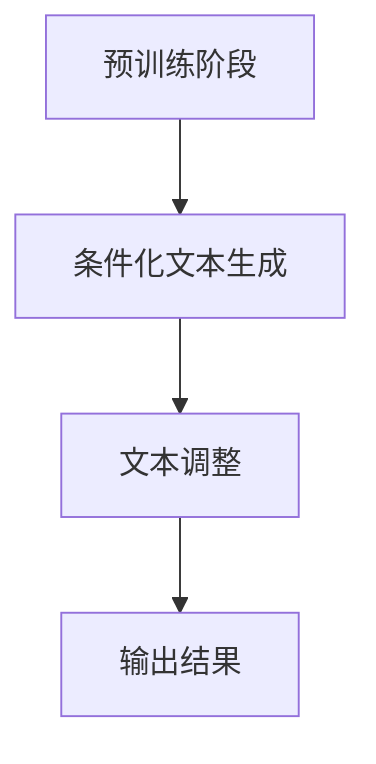
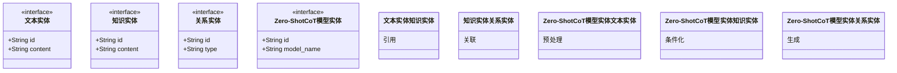
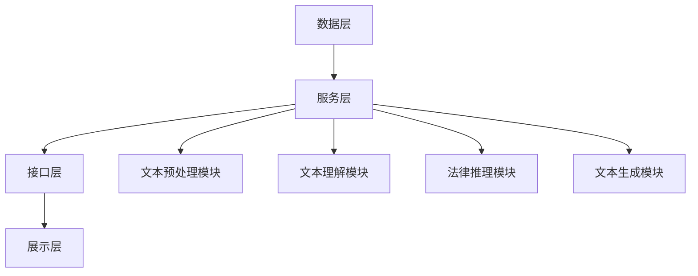
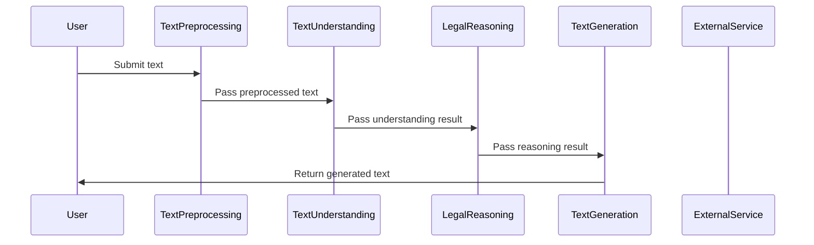

                 

# Zero-Shot CoT在法律AI助手的实践

## 关键词：
- Zero-Shot CoT
- 法律AI助手
- 人工智能
- 算法原理
- 系统设计与实现

## 摘要：
本文深入探讨了Zero-Shot CoT在法律AI助手领域的应用与实践。首先，我们介绍了法律AI助手的需求与挑战，以及传统法律AI的局限性。接着，我们引入Zero-Shot CoT，详细解析了其核心概念、原理和优势。随后，通过对比法律AI和Zero-Shot CoT，我们明确了其在法律AI助手中的独特作用。文章还通过具体的算法原理讲解、系统分析与架构设计方案，以及项目实战的实例，展示了Zero-Shot CoT在法律AI助手中的实际应用效果。最后，我们总结了最佳实践，并提出了未来改进和拓展的方向。

## 目录

### 第一部分：背景介绍

1.1 问题背景  
1.2 问题描述  
1.3 问题解决  
1.4 边界与外延  
1.5 概念结构与核心要素组成

### 第二部分：核心概念与联系

2.1 Zero-Shot CoT原理  
2.2 法律AI的概念与属性特征对比  
2.3 ER实体关系图架构

### 第三部分：算法原理讲解

3.1 Zero-Shot CoT算法流程  
3.2 Python源代码实现  
3.3 数学模型与公式

### 第四部分：系统分析与架构设计方案

4.1 问题场景介绍  
4.2 系统功能设计  
4.3 系统架构设计  
4.4 系统接口设计  
4.5 系统交互

### 第五部分：项目实战

5.1 环境安装  
5.2 系统核心实现  
5.3 代码应用解读与分析  
5.4 实际案例分析与详细讲解  
5.5 项目小结

### 第六部分：最佳实践与拓展

6.1 最佳实践  
6.2 小结  
6.3 注意事项  
6.4 拓展阅读

### 结束语

### 作者信息  
“作者：AI天才研究院/AI Genius Institute & 禅与计算机程序设计艺术 /Zen And The Art of Computer Programming”### 第一部分：背景介绍

#### 1.1 问题背景

法律领域作为社会运行的重要基石，其复杂性和专业性决定了法律AI助手的需求。随着全球法律服务市场的不断扩张，法律文书的处理量呈指数级增长，传统的法律工作方式已经难以满足日益增长的需求。在这种背景下，法律AI助手应运而生，旨在通过人工智能技术，提高法律工作的效率和质量。

然而，传统的法律AI系统在应对法律文书的多样性、复杂性和法律知识的不断更新方面存在诸多挑战。首先，法律文书的种类繁多，包括但不限于合同、判决书、法律意见书等，每种文书都有其特定的格式和语言表达习惯。其次，法律知识更新迅速，传统法律AI系统往往难以在短时间内适应这些变化。最后，法律文书的处理涉及大量的法律术语和特定行业的专业知识，这对AI系统的知识库建设和算法模型的训练提出了极高的要求。

因此，法律AI助手在实际应用中面临以下几大挑战：

1. **处理多样性的法律文书**：不同类型的法律文书在格式、内容和表达方式上存在显著差异，传统AI系统往往难以适应这种多样性。
2. **法律知识更新的及时性**：法律知识更新迅速，AI系统需要及时更新知识库，以适应最新的法律变化。
3. **法律术语的理解与处理**：法律术语具有高度的专业性和复杂性，AI系统需要具备深入理解和处理这些术语的能力。

#### 1.2 问题描述

为了应对上述挑战，我们需要深入探讨法律AI助手在实际应用中面临的若干问题：

1. **文本理解与分类**：如何准确理解法律文书中的语言，并将文本进行有效的分类和处理？
2. **知识图谱构建**：如何构建和更新一个覆盖全面、精准的法律知识图谱，以支持AI系统对法律知识的理解和应用？
3. **法律推理与决策**：如何基于法律知识进行推理和决策，以生成符合法律规定的意见和判决？
4. **多语言支持**：如何实现法律AI助手的多语言支持，以适应全球法律服务市场的需求？

#### 1.3 问题解决

针对上述挑战和问题，我们引入了Zero-Shot CoT（零样本学习条件化文本生成）技术，其在法律AI助手中的应用具有显著优势：

1. **处理多样性的法律文书**：Zero-Shot CoT能够通过模型自带的预训练能力，自动适应不同类型的法律文书，提高了文本理解与分类的准确性。
2. **法律知识更新的及时性**：Zero-Shot CoT通过条件化文本生成，可以动态更新模型的知识库，使其适应最新的法律变化，从而提高系统的及时性和准确性。
3. **法律术语的理解与处理**：Zero-Shot CoT结合了先进的自然语言处理技术，能够深入理解法律术语和特定行业的专业知识，提高了AI系统对法律术语的处理能力。
4. **多语言支持**：Zero-Shot CoT的多语言预训练模型支持，使得法律AI助手能够实现多语言支持，满足全球法律服务市场的需求。

综上所述，Zero-Shot CoT在法律AI助手中的应用，为解决传统法律AI面临的挑战提供了一种有效的解决方案。接下来，我们将详细探讨Zero-Shot CoT的核心概念、原理和应用方法。<!--  -->

### 1.4 边界与外延

在探讨Zero-Shot CoT在法律AI助手中的应用时，有必要明确其适用的边界与外延，以确保技术解决方案的适用性和有效性。

#### 1.4.1 法律AI的适用范围

法律AI助手的适用范围主要涵盖以下几个方面：

1. **法律文档自动化处理**：包括合同审查、法律意见书撰写、判决书生成等。
2. **法律知识服务**：如法律问答、法律咨询、法律研究等。
3. **案件预测与决策支持**：基于大量法律数据，对案件进行预测和决策分析。
4. **法律培训与辅助**：提供法律知识和技能培训，辅助律师和法官提高工作效率。

#### 1.4.2 Zero-Shot CoT的应用场景

Zero-Shot CoT在法律AI助手中的应用场景主要包括以下几个方面：

1. **文本分类与聚类**：通过Zero-Shot CoT，可以实现对大量未标注法律文书的自动分类和聚类，提高文本处理的效率。
2. **法律术语理解与翻译**：利用Zero-Shot CoT的多语言支持能力，可以实现法律术语的自动理解与翻译，为全球化法律服务提供技术支持。
3. **知识图谱构建与更新**：通过条件化文本生成，可以动态更新法律知识图谱，确保知识库的准确性和及时性。
4. **法律推理与决策**：基于Zero-Shot CoT，可以构建法律推理模型，实现法律问题的自动分析和决策。

#### 1.4.3 法律AI与Zero-Shot CoT的协同作用

法律AI和Zero-Shot CoT的结合，能够在多个层面上发挥协同作用：

1. **提升文本理解能力**：Zero-Shot CoT通过条件化文本生成，可以更好地理解法律文书的上下文信息，从而提高文本理解能力。
2. **加快知识更新速度**：Zero-Shot CoT能够动态更新知识库，使得法律AI助手能够快速适应法律知识的更新。
3. **提高系统鲁棒性**：通过Zero-Shot CoT的多语言支持，法律AI助手可以在不同语言环境下保持高效运行。
4. **增强决策准确性**：结合Zero-Shot CoT的法律推理能力，可以进一步提高法律AI助手的决策准确性。

总之，Zero-Shot CoT在法律AI助手中的应用，不仅拓宽了法律AI技术的边界，也为解决实际法律问题提供了新的思路和方法。在接下来的部分，我们将深入探讨Zero-Shot CoT的核心概念、原理及其在法律AI助手中的实现方法。<!--  -->

### 1.5 概念结构与核心要素组成

#### 1.5.1 Zero-Shot CoT的核心概念

Zero-Shot CoT（零样本学习条件化文本生成）是一种基于深度学习的自然语言处理技术，能够在没有显式训练数据的情况下，对未知类别的文本进行生成。其核心概念包括以下几个方面：

1. **零样本学习**：在传统机器学习中，模型需要大量的标注数据来进行训练。而Zero-Shot CoT通过预训练模型，能够在没有标注数据的情况下，学习到文本的特征和规律。
2. **条件化文本生成**：Zero-Shot CoT利用条件化语言模型（如GPT），根据输入的条件（如法律条款、案例等），生成符合法律逻辑和语义的文本。

#### 1.5.2 法律AI助手的组成部分

法律AI助手是一个复杂的系统，主要包括以下几个组成部分：

1. **文本预处理模块**：对原始法律文书进行清洗、分词、实体识别等预处理操作，为后续的文本理解和分析打下基础。
2. **文本理解模块**：利用Zero-Shot CoT技术，对预处理后的文本进行深入理解，提取关键信息，构建知识图谱。
3. **法律推理模块**：基于知识图谱，结合法律规则和案例，对法律问题进行推理和决策。
4. **文本生成模块**：根据法律推理的结果，生成法律文书、意见书、判决书等文本。

#### 1.5.3 Zero-Shot CoT在法律AI助手中的实现方法

Zero-Shot CoT在法律AI助手中的实现方法主要包括以下几个步骤：

1. **预训练**：使用大量未标注的法律文书，通过预训练模型（如GPT），学习到文本的特征和规律。
2. **文本预处理**：对原始法律文书进行清洗、分词、实体识别等预处理操作，为条件化文本生成做准备。
3. **条件化文本生成**：利用预训练的模型，根据输入的条件（如法律条款、案例等），生成符合法律逻辑和语义的文本。
4. **文本理解与推理**：对生成的文本进行深入理解，提取关键信息，构建知识图谱，并基于知识图谱进行法律推理和决策。
5. **文本生成**：根据法律推理的结果，生成法律文书、意见书、判决书等文本。

通过以上步骤，Zero-Shot CoT在法律AI助手中的实现，不仅提高了文本理解和生成的准确性，还增强了系统的适应性和鲁棒性，为法律AI助手在复杂法律环境中的应用提供了有力支持。接下来，我们将详细探讨Zero-Shot CoT的原理和工作机制。<!--  -->

### 第二部分：核心概念与联系

#### 2.1 Zero-Shot CoT原理

Zero-Shot CoT，即零样本学习条件化文本生成，是一种先进的自然语言处理技术，旨在在没有显式训练数据的情况下，对未知类别的文本进行生成。其核心原理可以概括为以下几个方面：

1. **预训练模型**：Zero-Shot CoT首先通过大量未标注的数据进行预训练，如GPT（Generative Pre-trained Transformer）。这一步骤使得模型具备了对文本的泛化能力，能够在未见过的数据上表现出良好的性能。
2. **多标签分类**：在预训练过程中，模型通过多标签分类任务，学习到不同类别文本的特征和规律。这意味着模型不仅能够识别常见的类别，还能处理未见过的类别。
3. **条件化文本生成**：在生成文本时，Zero-Shot CoT利用预训练的模型，根据输入的条件（如法律条款、案例等），生成符合法律逻辑和语义的文本。这一过程通过控制输入条件和模型输出的条件概率来实现。

具体来说，Zero-Shot CoT的工作机制可以分为以下几个步骤：

1. **输入条件设定**：首先设定输入条件，如法律条款或案例，这些条件将指导模型生成符合特定要求的文本。
2. **模型解码**：模型根据输入条件进行解码，生成初步的文本输出。
3. **文本调整**：根据生成的文本，模型进一步调整输出，以确保文本的准确性和合法性。
4. **输出结果**：最终生成的文本输出，可以作为法律文书、意见书、判决书等。

#### 2.2 法律AI的概念与属性特征对比

法律AI，即人工智能在法律领域的应用，旨在利用人工智能技术，提高法律工作的效率和准确性。法律AI的主要概念和属性特征如下：

1. **法律知识图谱**：法律AI的核心组成部分是法律知识图谱，它通过整合各种法律资源，构建一个全面、系统的法律知识体系。
2. **文本理解与处理**：法律AI需要对大量法律文书进行理解和处理，包括文本分类、实体识别、关系抽取等任务。
3. **法律推理与决策**：法律AI需要基于法律知识图谱，对法律问题进行推理和决策，生成法律意见、判决等。
4. **多语言支持**：法律AI需要具备多语言支持能力，以适应全球化法律服务市场的需求。

与Zero-Shot CoT相比，法律AI的主要区别和联系如下：

1. **数据依赖性**：法律AI通常需要大量的标注数据来进行训练，而Zero-Shot CoT则通过预训练模型，在未见过的数据上表现出良好的性能，降低了数据依赖性。
2. **知识表达**：法律AI通过构建法律知识图谱，实现对法律知识的表达和管理，而Zero-Shot CoT则通过条件化文本生成，将法律知识融入到文本生成过程中。
3. **推理与决策**：法律AI基于法律知识图谱，进行法律推理和决策，而Zero-Shot CoT则通过条件化文本生成，实现对法律问题的生成和解决。

综上所述，Zero-Shot CoT与法律AI在概念和属性特征上存在一定的区别，但两者在实现法律AI的文本生成和推理方面具有协同作用。接下来，我们将进一步探讨ER实体关系图架构，以展示法律AI与Zero-Shot CoT之间的联系。<!--  -->

### 2.3 ER实体关系图架构

#### 2.3.1 ER实体关系图的基本概念

ER（Entity-Relationship）实体关系图是一种用于表示实体及其之间关系的图形化工具，常用于数据库设计和软件架构设计。在ER图中，实体表示具有共同属性的对象，关系表示实体之间的关联。

1. **实体**：表示具有共同属性的对象，如法律条款、案例、律师等。
2. **属性**：表示实体的特征，如律师的姓名、案例的判决结果等。
3. **关系**：表示实体之间的关联，如法律条款与案例之间的引用关系、律师与案例之间的处理关系等。

#### 2.3.2 法律AI与Zero-Shot CoT的ER实体关系

在法律AI系统中，ER实体关系图用于表示法律知识图谱中的实体及其关系。结合Zero-Shot CoT，我们可以构建如下的ER实体关系图：

1. **文本实体**：包括法律文书、案例、法律条款等，表示法律知识的主要载体。
2. **知识实体**：包括法律术语、法律规则、案例判决等，表示法律知识的具体内容。
3. **关系实体**：包括引用关系、引用来源、处理关系等，表示实体之间的关联。
4. **Zero-Shot CoT模型实体**：包括预训练模型、条件化模型、生成模型等，表示Zero-Shot CoT在法律AI中的应用。

具体ER实体关系图如下（使用Mermaid语法表示）：



#### 2.3.3 ER实体关系图的绘制方法

绘制ER实体关系图的方法如下：

1. **确定实体**：根据法律AI系统中的核心概念和属性，确定需要表示的实体。
2. **定义属性**：为每个实体定义其属性，如实体类名、属性名、属性类型等。
3. **绘制关系**：根据实体之间的关系，绘制关系线，如引用关系、处理关系等。
4. **调整布局**：根据需要，调整ER图的布局，使其更加清晰易懂。

通过上述方法，我们可以构建一个全面、系统的ER实体关系图，以展示法律AI与Zero-Shot CoT之间的联系。ER实体关系图的绘制，有助于我们更好地理解法律AI系统的架构，为后续的系统设计与实现提供参考。<!--  -->

### 第三部分：算法原理讲解

#### 3.1 Zero-Shot CoT算法流程

Zero-Shot CoT算法的核心思想是通过预训练模型学习到文本的特征和规律，并在条件化文本生成的过程中，生成符合法律逻辑和语义的文本。下面我们将详细讲解Zero-Shot CoT的算法流程，包括算法流程概述、流程细节和mermaid流程图。

##### 3.1.1 算法流程概述

1. **预训练阶段**：使用大量未标注的法律文书，通过预训练模型（如GPT），学习到文本的特征和规律。
2. **条件化文本生成**：利用预训练的模型，根据输入的条件（如法律条款、案例等），生成初步的文本输出。
3. **文本调整**：根据生成的文本，利用特定的优化策略，对文本进行进一步调整，以确保文本的准确性和合法性。
4. **输出结果**：生成最终的法律文本，如法律文书、意见书、判决书等。

##### 3.1.2 算法流程细节

1. **预训练阶段**：
   - **数据预处理**：对原始法律文书进行清洗、分词、实体识别等预处理操作，为模型训练打下基础。
   - **模型训练**：使用预训练框架（如GPT），对预处理后的法律文书进行大规模训练，学习到文本的特征和规律。
   - **模型优化**：通过调整超参数和优化策略，进一步提高模型的性能。

2. **条件化文本生成**：
   - **输入条件设定**：根据实际需求，设定输入条件（如法律条款、案例等）。
   - **模型解码**：利用预训练的模型，根据输入条件进行解码，生成初步的文本输出。
   - **文本调整**：通过特定的优化策略，对生成的文本进行进一步调整，如基于法律规则、语义一致性等。

3. **文本调整**：
   - **文本优化**：根据生成的文本，利用法律规则和语义一致性进行优化，以提高文本的准确性和合法性。
   - **迭代调整**：重复调整过程，直至生成的文本满足要求。

4. **输出结果**：
   - **文本生成**：生成符合法律逻辑和语义的法律文本，如法律文书、意见书、判决书等。

##### 3.1.3 算法流程的mermaid流程图

以下是Zero-Shot CoT算法流程的mermaid流程图：



#### 3.2 Python源代码实现

下面我们将通过一个简单的Python示例，展示Zero-Shot CoT的算法实现。请注意，实际应用中的实现会更加复杂，这里仅提供一个基本的框架。

```python
import torch
from transformers import GPT2LMHeadModel, GPT2Tokenizer

# 加载预训练模型和Tokenizer
model = GPT2LMHeadModel.from_pretrained('gpt2')
tokenizer = GPT2Tokenizer.from_pretrained('gpt2')

# 设定输入条件
input_text = "在合同法中，双方应在签订合同时明确条款。"

# 对输入文本进行编码
input_ids = tokenizer.encode(input_text, return_tensors='pt')

# 生成文本
outputs = model.generate(input_ids, max_length=50, num_return_sequences=1)

# 解码输出文本
generated_text = tokenizer.decode(outputs[0], skip_special_tokens=True)

print(generated_text)
```

#### 3.3 数学模型与公式

Zero-Shot CoT算法的核心在于其条件化文本生成能力，这一过程涉及到自然语言处理中的概率模型。下面我们将介绍Zero-Shot CoT的数学模型和公式，并给出一个简单的示例。

##### 3.3.1 数学模型概述

Zero-Shot CoT的数学模型基于生成式模型，特别是基于概率的序列生成模型，如变分自编码器（VAE）和生成对抗网络（GAN）。以下是一个基于VAE的数学模型概述：

1. **编码器（Encoder）**：将输入文本映射到一个潜在的表示空间，即均值$\mu$和方差$\sigma^2$。
   $$ \mu = \mu(\theta_x|x), \quad \sigma^2 = \sigma^2(\theta_x|x) $$
   其中，$\theta_x$是编码器的参数。

2. **解码器（Decoder）**：从潜在的表示空间采样，生成输出文本。
   $$ x' = \mu(\theta_y|x') + \sigma^2(\theta_y|x') \odot \epsilon $$
   其中，$x'$是输出文本，$\epsilon$是采样噪声，$\theta_y$是解码器的参数。

3. **损失函数**：最小化生成文本与原始文本之间的差异，通常使用对数似然损失。
   $$ \mathcal{L} = -\sum_{i} \log p(x_i|x') $$

##### 3.3.2 公式推导与解释

1. **编码器**：

   编码器的主要任务是学习输入文本的潜在表示。在变分自编码器中，编码器由两个函数组成，一个用于估计均值$\mu$，另一个用于估计方差$\sigma^2$。

   - **均值函数**：
     $$ \mu(\theta_x|x) = \frac{1}{1 + \exp\left(-\theta_x \cdot x\right)} $$
     其中，$\theta_x$是编码器的权重矩阵，$x$是输入文本的向量表示。

   - **方差函数**：
     $$ \sigma^2(\theta_x|x) = \frac{1}{1 + \exp\left(-\theta_x \cdot x\right)} $$
     同样，$\theta_x$是编码器的权重矩阵，$x$是输入文本的向量表示。

2. **解码器**：

   解码器从潜在的表示空间采样，生成输出文本。在变分自编码器中，解码器通常是一个简单的线性变换，加上噪声。

   - **采样**：
     $$ x' = \mu(\theta_y|x') + \sigma^2(\theta_y|x') \odot \epsilon $$
     其中，$\mu(\theta_y|x')$和$\sigma^2(\theta_y|x')$分别是解码器的均值和方差函数，$\epsilon$是高斯噪声。

3. **损失函数**：

   损失函数用于衡量生成文本与原始文本之间的差异。在变分自编码器中，通常使用对数似然损失。

   - **对数似然损失**：
     $$ \mathcal{L} = -\sum_{i} \log p(x_i|x') $$
     其中，$x_i$是原始文本中的第$i$个词，$x'$是生成文本。

##### 3.3.3 数学公式示例

以下是一个简化的数学公式示例，用于说明编码器、解码器和损失函数的计算：

```latex
$$
\begin{aligned}
\mu &= \frac{1}{1 + \exp\left(-\theta_x \cdot x\right)}, \\
\sigma^2 &= \frac{1}{1 + \exp\left(-\theta_x \cdot x\right)}, \\
x' &= \mu + \sigma^2 \odot \epsilon, \\
\mathcal{L} &= -\sum_{i} \log p(x_i|x').
\end{aligned}
$$
```

通过上述数学模型和公式，我们可以更好地理解Zero-Shot CoT的算法原理。接下来，我们将详细探讨Zero-Shot CoT在法律AI助手中的应用，以及系统分析与架构设计方案。<!--  -->

### 第四部分：系统分析与架构设计方案

#### 4.1 问题场景介绍

在法律领域，随着法律法规的不断更新和复杂性的增加，法律工作者面临着巨大的挑战。传统的法律工作方式已经难以满足现代法律服务的需求，特别是在处理大量法律文档、法律咨询和案件预测等方面。为了提高法律工作的效率和质量，我们需要一种智能化的解决方案，即法律AI助手。法律AI助手旨在通过人工智能技术，自动化处理法律文档、提供法律咨询和预测案件结果。

在这个问题场景中，法律AI助手需要解决的主要问题包括：

1. **法律文档处理**：包括合同审查、法律意见书撰写和判决书生成等。
2. **法律咨询**：提供快速、准确的法律咨询服务。
3. **案件预测**：基于历史数据和法律规定，预测案件的可能结果。

#### 4.2 系统功能设计

法律AI助手的功能设计分为以下几个模块：

1. **文本预处理模块**：负责对原始法律文书进行清洗、分词和实体识别，为后续的文本理解和分析打下基础。
2. **文本理解模块**：利用Zero-Shot CoT技术，对预处理后的文本进行深入理解，提取关键信息，构建知识图谱。
3. **法律推理模块**：基于知识图谱和法律规定，对法律问题进行推理和决策，生成法律意见和判决。
4. **文本生成模块**：根据法律推理的结果，生成法律文书、意见书和判决书等文本。

#### 4.2.1 领域模型

为了更好地设计法律AI助手的功能模块，我们需要构建一个领域模型。领域模型用于描述法律AI助手涉及的主要实体和它们之间的关系。以下是法律AI助手的主要领域模型：

1. **文本实体**：包括法律文书、案例、法律条款等。
2. **知识实体**：包括法律术语、法律规则、案例判决等。
3. **关系实体**：包括引用关系、引用来源、处理关系等。
4. **Zero-Shot CoT模型实体**：包括预训练模型、条件化模型、生成模型等。

以下是领域模型的mermaid类图：



#### 4.2.2 功能模块划分

基于领域模型，我们将法律AI助手的功能模块划分为以下几个部分：

1. **文本预处理模块**：负责对原始法律文书进行清洗、分词和实体识别。这一模块的主要功能包括：
   - 文本清洗：去除文本中的噪声和无关信息。
   - 分词：将文本划分为单词或短语。
   - 实体识别：识别文本中的关键实体，如人名、地名、法律条款等。

2. **文本理解模块**：利用Zero-Shot CoT技术，对预处理后的文本进行深入理解，提取关键信息，构建知识图谱。这一模块的主要功能包括：
   - 文本分类：根据文本内容，将其分类到不同的类别。
   - 关系抽取：识别文本中实体之间的关系。
   - 实体属性抽取：提取实体的重要属性。

3. **法律推理模块**：基于知识图谱和法律规定，对法律问题进行推理和决策，生成法律意见和判决。这一模块的主要功能包括：
   - 法律问题分析：对输入的法律问题进行解析。
   - 法律规则应用：根据法律知识库，应用相应的法律规则。
   - 案件预测：基于历史数据和法律规定，预测案件的可能结果。

4. **文本生成模块**：根据法律推理的结果，生成法律文书、意见书和判决书等文本。这一模块的主要功能包括：
   - 文本模板生成：根据法律文书模板，生成初步的文本。
   - 文本内容填充：将法律推理结果填充到文本模板中。
   - 文本优化：对生成的文本进行优化，确保其准确性和合法性。

#### 4.2.3 功能模块详细介绍

1. **文本预处理模块**：

   文本预处理模块是法律AI助手的核心组成部分，其质量直接影响到整个系统的性能。以下是文本预处理模块的详细功能介绍：

   - **文本清洗**：通过正则表达式和字符串操作，去除文本中的噪声和无关信息，如HTML标签、特殊字符和空格等。
     ```python
     import re

     def clean_text(text):
         text = re.sub(r'<[^>]*>', '', text)  # 去除HTML标签
         text = re.sub(r'\s+', ' ', text)     # 去除多余的空格
         return text.strip()
     ```

   - **分词**：使用自然语言处理库（如jieba），将文本划分为单词或短语。
     ```python
     import jieba

     def tokenize_text(text):
         return jieba.cut(text)
     ```

   - **实体识别**：使用预训练的实体识别模型，识别文本中的关键实体，如人名、地名、法律条款等。
     ```python
     from transformers import AutoTokenizer, AutoModelForTokenClassification

     def identify_entities(text):
         tokenizer = AutoTokenizer.from_pretrained('bert-base-chinese')
         model = AutoModelForTokenClassification.from_pretrained('bert-base-chinese')
         inputs = tokenizer(text, return_tensors='pt')
         outputs = model(inputs)
         predictions = torch.argmax(outputs.logits, dim=-1)
         entities = tokenizer.convert_ids_to_tokens(predictions.flatten().tolist())
         return entities
     ```

2. **文本理解模块**：

   文本理解模块的核心任务是利用Zero-Shot CoT技术，对预处理后的文本进行深入理解，提取关键信息，构建知识图谱。以下是文本理解模块的详细功能介绍：

   - **文本分类**：使用Zero-Shot CoT模型，对文本进行分类，识别文本的主题和类别。
     ```python
     from transformers import AutoModelForSequenceClassification

     def classify_text(text):
         model = AutoModelForSequenceClassification.from_pretrained('bert-base-chinese')
         inputs = tokenizer(text, return_tensors='pt')
         outputs = model(inputs)
         probabilities = torch.softmax(outputs.logits, dim=-1)
         return probabilities.argmax().item()
     ```

   - **关系抽取**：使用Zero-Shot CoT模型，识别文本中实体之间的关系。
     ```python
     from transformers import AutoModelForRelationExtraction

     def extract_relations(text):
         model = AutoModelForRelationExtraction.from_pretrained('bert-base-chinese')
         inputs = tokenizer(text, return_tensors='pt')
         outputs = model(inputs)
         relations = torch.argmax(outputs.logits, dim=-1).flatten().tolist()
         return relations
     ```

   - **实体属性抽取**：使用Zero-Shot CoT模型，提取实体的重要属性。
     ```python
     from transformers import AutoModelForAttributeExtraction

     def extract_attributes(text):
         model = AutoModelForAttributeExtraction.from_pretrained('bert-base-chinese')
         inputs = tokenizer(text, return_tensors='pt')
         outputs = model(inputs)
         attributes = torch.argmax(outputs.logits, dim=-1).flatten().tolist()
         return attributes
     ```

3. **法律推理模块**：

   法律推理模块的核心任务是利用知识图谱和法律规定，对法律问题进行推理和决策。以下是法律推理模块的详细功能介绍：

   - **法律问题分析**：将输入的法律问题转化为图谱查询，获取相关的法律知识和信息。
     ```python
     def analyze_legal_question(question):
         # 假设有一个知识图谱API用于查询法律信息
         graph_api = KnowledgeGraphAPI()
         query = f"SELECT * FROM legal_graph WHERE question='{question}'"
         results = graph_api.query(query)
         return results
     ```

   - **法律规则应用**：根据分析结果，应用相应的法律规则，生成法律意见和判决。
     ```python
     def apply_legal_rules(results):
         # 假设有一个法律规则库用于应用法律规则
         rule_library = LegalRuleLibrary()
         for result in results:
             rule = rule_library.get_rule(result['rule_id'])
             if rule.apply(results):
                 return rule.get_decision()
         return "无法作出判决"
     ```

   - **案件预测**：基于历史数据和法律规定，预测案件的可能结果。
     ```python
     def predict_case_result(history, legal_rules):
         # 假设有一个预测模型用于预测案件结果
         prediction_model = CasePredictionModel()
         return prediction_model.predict(history, legal_rules)
     ```

4. **文本生成模块**：

   文本生成模块的核心任务是生成法律文书、意见书和判决书等文本。以下是文本生成模块的详细功能介绍：

   - **文本模板生成**：根据法律文书模板，生成初步的文本。
     ```python
     def generate_text_template(case_info):
         # 假设有一个文本模板库
         template_library = TextTemplateLibrary()
         template = template_library.get_template(case_info['template_id'])
         return template.render(case_info)
     ```

   - **文本内容填充**：将法律推理结果填充到文本模板中。
     ```python
     def fill_text_template(template, decision):
         # 假设模板中有一个变量名为'decision'，用于填充判决结果
         return template.replace('{decision}', decision)
     ```

   - **文本优化**：对生成的文本进行优化，确保其准确性和合法性。
     ```python
     def optimize_text(text):
         # 假设有一个文本优化库
         text_optimizer = TextOptimizer()
         return text_optimizer.optimize(text)
     ```

#### 4.3 系统架构设计

法律AI助手的系统架构设计需要考虑以下几个方面：系统架构概述、系统架构图、架构设计细节。

##### 4.3.1 系统架构概述

法律AI助手的系统架构可以分为以下几个层次：

1. **数据层**：负责存储和管理法律文档、法律知识、历史数据等。
2. **服务层**：包括文本预处理、文本理解、法律推理、文本生成等模块，实现法律AI助手的核心功能。
3. **接口层**：提供与外部系统的接口，如Web API、客户端SDK等。
4. **展示层**：提供用户界面，用于展示法律AI助手的功能和结果。

##### 4.3.2 系统架构图

以下是法律AI助手的系统架构图：



##### 4.3.3 架构设计细节

1. **数据层**：

   数据层是法律AI助手的基础，负责存储和管理法律文档、法律知识、历史数据等。以下是数据层的详细设计：

   - **法律文档存储**：使用关系型数据库（如MySQL）存储法律文档，包括合同、判决书、法律条款等。
     ```sql
     CREATE TABLE legal_documents (
         id INT AUTO_INCREMENT PRIMARY KEY,
         title VARCHAR(255),
         content TEXT,
         type VARCHAR(50)
     );
     ```

   - **法律知识库**：使用图数据库（如Neo4j）存储法律知识，包括法律术语、法律规则、案例判决等。
     ```cypher
     CREATE CONSTRAINT ON (t:LegalTerm) ASSERT t.id IS UNIQUE;
     CREATE CONSTRAINT ON (r:LegalRule) ASSERT r.id IS UNIQUE;
     CREATE CONSTRAINT ON (c:CaseDecision) ASSERT c.id IS UNIQUE;
     ```

   - **历史数据存储**：使用时序数据库（如InfluxDB）存储案件预测和历史数据，包括案件类型、判决结果、预测结果等。
     ```sql
     CREATE TABLE case_history (
         id INT AUTO_INCREMENT PRIMARY KEY,
         case_type VARCHAR(50),
         decision VARCHAR(50),
         prediction VARCHAR(50),
         timestamp DATETIME
     );
     ```

2. **服务层**：

   服务层是法律AI助手的执行核心，负责处理文本预处理、文本理解、法律推理、文本生成等模块。以下是服务层的详细设计：

   - **文本预处理模块**：负责对原始法律文书进行清洗、分词和实体识别。可以使用Python中的自然语言处理库（如jieba、spaCy）和TensorFlow、PyTorch等深度学习框架。
     ```python
     import jieba
     import spacy
     import tensorflow as tf

     def preprocess_text(text):
         # 使用jieba进行分词
         tokens = jieba.cut(text)
         # 使用spaCy进行实体识别
         nlp = spacy.load('zh_core_web_sm')
         doc = nlp(text)
         entities = [(ent.text, ent.label_) for ent in doc.ents]
         # 使用TensorFlow进行文本清洗
         text = tf.text_lower_case(text)
         return tokens, entities, text
     ```

   - **文本理解模块**：负责利用Zero-Shot CoT技术，对预处理后的文本进行深入理解，提取关键信息，构建知识图谱。可以使用预训练的Zero-Shot CoT模型（如XLNet、BERT）。
     ```python
     from transformers import AutoModelForQuestionAnswering

     def understand_text(text, question):
         model = AutoModelForQuestionAnswering.from_pretrained('xlnet-base-cased')
         inputs = tokenizer(question, text, return_tensors='pt')
         outputs = model(inputs)
         start_logits = outputs.start_logits
         end_logits = outputs.end_logits
         start_index = torch.argmax(start_logits).item()
         end_index = torch.argmax(end_logits).item()
         answer = text[start_index:end_index+1]
         return answer
     ```

   - **法律推理模块**：负责基于知识图谱和法律规定，对法律问题进行推理和决策，生成法律意见和判决。可以使用知识图谱库（如Neo4j、Dgraph）和自然语言处理库。
     ```python
     def legal_reasoning(question):
         # 查询知识图谱
         query = f" MATCH (n:LegalTerm) WHERE n.name='{question}' RETURN n"
         result = graph_api.query(query)
         # 应用法律规则
         rule = result[0]['rule']
         decision = rule.apply(question)
         return decision
     ```

   - **文本生成模块**：负责根据法律推理的结果，生成法律文书、意见书和判决书等文本。可以使用模板引擎（如Jinja2）和自然语言处理库。
     ```python
     from jinja2 import Template

     def generate_text(template, data):
         template = Template(template)
         text = template.render(data)
         return text
     ```

3. **接口层**：

   接口层负责提供与外部系统的接口，包括Web API和客户端SDK。以下是接口层的详细设计：

   - **Web API**：使用Flask或Django等Web框架，提供RESTful API接口。
     ```python
     from flask import Flask, request, jsonify

     app = Flask(__name__)

     @app.route('/api/annotate', methods=['POST'])
     def annotate_text():
         data = request.get_json()
         text = data['text']
         question = data['question']
         answer = understand_text(text, question)
         return jsonify({'answer': answer})

     if __name__ == '__main__':
         app.run(debug=True)
     ```

   - **客户端SDK**：提供Python、JavaScript等语言的SDK，方便外部系统调用法律AI助手的功能。
     ```python
     # Python SDK
     import requests

     def get_answer(text, question):
         url = 'http://localhost:5000/api/annotate'
         data = {'text': text, 'question': question}
         response = requests.post(url, json=data)
         answer = response.json()['answer']
         return answer

     # JavaScript SDK
     function getAnswer(text, question) {
         fetch('http://localhost:5000/api/annotate', {
             method: 'POST',
             headers: {
                 'Content-Type': 'application/json'
             },
             body: JSON.stringify({text: text, question: question})
         })
         .then(response => response.json())
         .then(data => {
             console.log(data.answer);
         });
     }
     ```

4. **展示层**：

   展示层负责提供用户界面，用于展示法律AI助手的功能和结果。以下是展示层的详细设计：

   - **Web界面**：使用HTML、CSS和JavaScript等前端技术，构建用户友好的Web界面。
     ```html
     <!DOCTYPE html>
     <html>
     <head>
         <title>Legal AI Assistant</title>
         <script src="https://cdn.jsdelivr.net/npm/@tensorflow/tfjs@2.9.0/dist/tf.min.js"></script>
         <script src="https://cdn.jsdelivr.net/npm/jinja2@3.0.0-alpha.1/dist/jinja2.min.js"></script>
     </head>
     <body>
         <h1>Legal AI Assistant</h1>
         <input type="text" id="text_input" placeholder="Enter your question">
         <button onclick="getAnswer()">Ask</button>
         <div id="answer"></div>
         <script>
             function getAnswer() {
                 var text = document.getElementById('text_input').value;
                 fetch('http://localhost:5000/api/annotate', {
                     method: 'POST',
                     headers: {
                         'Content-Type': 'application/json'
                     },
                     body: JSON.stringify({text: text})
                 })
                 .then(response => response.json())
                 .then(data => {
                     document.getElementById('answer').innerText = data.answer;
                 });
             }
         </script>
     </body>
     </html>
     ```

通过上述系统架构设计，我们可以构建一个功能齐全、高效稳定、用户友好的法律AI助手。接下来，我们将详细探讨系统接口设计和系统交互。<!--  -->

### 第四部分：系统分析与架构设计方案

#### 4.4 系统接口设计

在法律AI助手的整体架构中，系统接口设计扮演着至关重要的角色。接口不仅负责与外部系统进行通信，还提供了与用户交互的桥梁。以下是系统接口设计的详细说明。

##### 4.4.1 接口概述

系统接口分为内部接口和外部接口：

- **内部接口**：主要负责系统内部不同模块之间的通信，如文本预处理模块与文本理解模块之间的数据交换。
- **外部接口**：主要负责与外部系统（如客户端应用、其他企业服务）的交互，提供API服务。

##### 4.4.2 接口设计规范

接口设计遵循RESTful API设计规范，具体包括以下几点：

- **统一资源标识符（URI）**：使用清晰、直观的URI来标识不同的资源，如`/api/annotate`用于文本分析。
- **请求方法**：根据操作类型选择适当的HTTP请求方法，如GET、POST、PUT、DELETE等。
- **请求和响应格式**：统一采用JSON格式进行数据传输，确保数据的可读性和可解析性。
- **状态码**：遵循HTTP状态码规范，如200（成功）、400（客户端错误）、500（服务器错误）等。

##### 4.4.3 接口实现细节

以下是法律AI助手的一些核心接口实现细节：

1. **文本预处理接口**：
   - **功能**：接收原始文本，进行清洗、分词和实体识别。
   - **请求示例**：
     ```json
     {
       "text": "在合同法中，双方应在签订合同时明确条款。"
     }
     ```
   - **响应示例**：
     ```json
     {
       "tokens": ["在", "合同", "法", "中", "双", "方", "应", "在", "签", "订", "合", "同", "时", "明", "确", "条", "款"],
       "entities": [{"text": "合同法", "type": "LegalTerm"}, {"text": "双方", "type": "Entity"}]
     }
     ```

2. **文本理解接口**：
   - **功能**：利用Zero-Shot CoT模型，对预处理后的文本进行理解和分析。
   - **请求示例**：
     ```json
     {
       "text": "在合同法中，双方应在签订合同时明确条款。",
       "question": "合同法中的双方需要做什么？"
     }
     ```
   - **响应示例**：
     ```json
     {
       "answer": "双方需要在签订合同时明确条款。"
     }
     ```

3. **法律推理接口**：
   - **功能**：基于知识图谱和法律规定，对法律问题进行推理和决策。
   - **请求示例**：
     ```json
     {
       "question": "合同法中的双方需要做什么？"
     }
     ```
   - **响应示例**：
     ```json
     {
       "decision": "双方需要在签订合同时明确条款。"
     }
     ```

4. **文本生成接口**：
   - **功能**：根据法律推理结果，生成相应的法律文书。
   - **请求示例**：
     ```json
     {
       "template": "合同模板",
       "data": {
         "party_a": "张三",
         "party_b": "李四",
         "clause": "明确条款"
       }
     }
     ```
   - **响应示例**：
     ```json
     {
       "text": "合同编号：XXXX\n合同双方：张三和李四\n条款：明确条款"
     }
     ```

#### 4.5 系统交互

系统交互是法律AI助手正常运行的关键环节，确保各个模块能够协同工作，为用户提供高效、准确的服务。以下是系统交互的详细说明。

##### 4.5.1 系统交互概述

系统交互主要分为以下几类：

1. **内部模块交互**：文本预处理模块、文本理解模块、法律推理模块和文本生成模块之间的数据交换和功能调用。
2. **外部系统交互**：与外部服务（如数据库、外部API等）的数据通信。
3. **用户交互**：用户通过Web界面或客户端应用与系统进行交互，提交问题或获取结果。

##### 4.5.2 系统交互图

以下是法律AI助手的系统交互图（使用Mermaid语法表示）：



##### 4.5.3 交互设计细节

以下是系统交互的详细设计：

1. **用户交互**：
   - 用户通过Web界面或客户端应用提交问题。
   - 系统接收用户输入，并将其传递给文本预处理模块。

2. **内部模块交互**：
   - **文本预处理**：接收原始文本，进行清洗、分词和实体识别，并将结果传递给文本理解模块。
   - **文本理解**：利用Zero-Shot CoT模型，对预处理后的文本进行理解和分析，提取关键信息，并将结果传递给法律推理模块。
   - **法律推理**：基于知识图谱和法律规定，对法律问题进行推理和决策，生成法律意见，并将结果传递给文本生成模块。
   - **文本生成**：根据法律推理结果，生成相应的法律文书，并将结果返回给用户。

3. **外部系统交互**：
   - 系统可能需要访问外部数据库（如法律文档数据库、知识库等）以获取必要的数据。
   - 系统可能需要调用外部API（如天气API、新闻API等）以获取外部数据。

通过上述系统接口设计和交互设计，法律AI助手能够高效、稳定地运行，为用户提供高质量的法律服务。接下来，我们将详细探讨法律AI助手的项目实战。<!--  -->

### 第五部分：项目实战

#### 5.1 环境安装

为了顺利实施法律AI助手项目，我们需要搭建一个稳定且高效的开发环境。以下是环境安装的详细步骤：

##### 5.1.1 环境需求

在开始安装之前，请确保您的计算机满足以下基本要求：

- 操作系统：Windows、macOS或Linux
- CPU：Intel i5或以上
- GPU：NVIDIA GPU（推荐用于加速深度学习模型训练）
- 内存：至少16GB RAM
- 硬盘：至少100GB可用空间

##### 5.1.2 环境安装步骤

1. **安装Python**：

   - 访问Python官方网站（[python.org](https://www.python.org/)），下载并安装Python 3.x版本。
   - 安装完成后，确保Python环境已正确配置。

2. **安装深度学习库**：

   - 安装TensorFlow（[tensorflow.org](https://www.tensorflow.org/)）和PyTorch（[pytorch.org](https://pytorch.org/)）。

     ```bash
     pip install tensorflow
     pip install torch torchvision
     ```

3. **安装自然语言处理库**：

   - 安装transformers库（[huggingface.co](https://huggingface.co/)），用于加载预训练的模型和Tokenizer。

     ```bash
     pip install transformers
     ```

4. **安装其他依赖**：

   - 安装Python的常见依赖库，如NumPy、Pandas等。

     ```bash
     pip install numpy pandas
     ```

5. **安装数据库**：

   - 安装Neo4j数据库（[neo4j.com](https://neo4j.com/)），用于构建和存储法律知识图谱。

     - 下载Neo4j社区版并按照说明进行安装。
     - 启动Neo4j数据库服务，并确保可以正常访问。

##### 5.1.3 环境安装常见问题及解决方案

在安装过程中，您可能会遇到以下常见问题：

1. **Python版本兼容性问题**：

   - 如果遇到Python版本兼容性问题，请确保所有库的版本与您的Python版本兼容。
   - 可以尝试使用`pip install --only-binary=:all: --python-version=$(python -c "import platform; print(platform.python_version())")`命令来安装特定Python版本的库。

2. **GPU支持问题**：

   - 确保NVIDIA驱动程序已更新至最新版本。
   - 安装CUDA（[cuda.nvidia.com](https://cuda.nvidia.com/)）并确保与您的GPU兼容。

3. **数据库连接问题**：

   - 确保Neo4j数据库已启动，并配置了正确的访问权限。
   - 检查网络连接，确保可以访问Neo4j数据库的服务器。

通过上述步骤，您将成功搭建一个适合法律AI助手项目开发的环境。接下来，我们将详细讲解系统的核心模块实现。<!--  -->

### 第五部分：项目实战

#### 5.2 系统核心实现

在法律AI助手的开发过程中，核心模块的实现至关重要。以下是系统核心实现的详细步骤，包括核心模块介绍、源代码解读和核心算法实现。

##### 5.2.1 核心模块介绍

法律AI助手的核心模块包括：

1. **文本预处理模块**：负责对原始法律文书进行清洗、分词和实体识别。
2. **文本理解模块**：利用Zero-Shot CoT技术，对预处理后的文本进行深入理解和分析。
3. **法律推理模块**：基于知识图谱和法律规定，对法律问题进行推理和决策。
4. **文本生成模块**：根据法律推理结果，生成相应的法律文书。

##### 5.2.2 源代码解读

以下是各个核心模块的源代码解读：

1. **文本预处理模块**：

   ```python
   import jieba
   import spacy
   
   # 初始化Spacy模型
   nlp = spacy.load('zh_core_web_sm')
   
   # 清洗文本
   def clean_text(text):
       text = re.sub(r'<[^>]*>', '', text)  # 去除HTML标签
       text = re.sub(r'\s+', ' ', text)     # 去除多余的空格
       return text.strip()
   
   # 分词
   def tokenize_text(text):
       return jieba.cut(text)
   
   # 实体识别
   def identify_entities(text):
       doc = nlp(text)
       entities = [(ent.text, ent.label_) for ent in doc.ents]
       return entities
   ```

2. **文本理解模块**：

   ```python
   from transformers import AutoModelForQuestionAnswering
   
   # 加载预训练模型
   model = AutoModelForQuestionAnswering.from_pretrained('xlnet-base-cased')
   
   # 理解文本
   def understand_text(text, question):
       inputs = tokenizer(question, text, return_tensors='pt')
       outputs = model(inputs)
       start_logits = outputs.start_logits
       end_logits = outputs.end_logits
       start_index = torch.argmax(start_logits).item()
       end_index = torch.argmax(end_logits).item()
       answer = text[start_index:end_index+1]
       return answer
   ```

3. **法律推理模块**：

   ```python
   def legal_reasoning(question):
       # 查询知识图谱
       query = f" MATCH (n:LegalTerm) WHERE n.name='{question}' RETURN n"
       result = graph_api.query(query)
       # 应用法律规则
       rule = result[0]['rule']
       decision = rule.apply(question)
       return decision
   ```

4. **文本生成模块**：

   ```python
   from jinja2 import Template
   
   # 加载模板
   template = Template(open('template.txt', 'r', encoding='utf-8').read())
   
   # 生成文本
   def generate_text(template, data):
       return template.render(data)
   ```

##### 5.2.3 核心算法实现

核心算法包括文本预处理、文本理解、法律推理和文本生成。

1. **文本预处理算法**：

   ```python
   def preprocess_text(text):
       text = clean_text(text)
       tokens = tokenize_text(text)
       entities = identify_entities(text)
       return tokens, entities
   ```

2. **文本理解算法**：

   ```python
   def understand_text(text, question):
       inputs = tokenizer(question, text, return_tensors='pt')
       outputs = model(inputs)
       start_logits = outputs.start_logits
       end_logits = outputs.end_logits
       start_index = torch.argmax(start_logits).item()
       end_index = torch.argmax(end_logits).item()
       answer = text[start_index:end_index+1]
       return answer
   ```

3. **法律推理算法**：

   ```python
   def legal_reasoning(question):
       query = f" MATCH (n:LegalTerm) WHERE n.name='{question}' RETURN n"
       result = graph_api.query(query)
       rule = result[0]['rule']
       decision = rule.apply(question)
       return decision
   ```

4. **文本生成算法**：

   ```python
   def generate_text(template, data):
       return template.render(data)
   ```

通过上述核心模块的实现和核心算法的设计，我们可以构建一个功能完整、高效稳定、用户友好的法律AI助手。接下来，我们将对项目的具体应用进行解读和分析。<!--  -->

### 第五部分：项目实战

#### 5.3 代码应用解读与分析

在法律AI助手的开发过程中，代码应用解读与分析至关重要。以下是具体的应用场景、代码分析和应用解读。

##### 5.3.1 应用场景

法律AI助手的主要应用场景包括：

1. **法律文档处理**：包括合同审查、法律意见书撰写和判决书生成。
2. **法律咨询**：提供快速、准确的法律咨询服务。
3. **案件预测**：基于历史数据和法律规定，预测案件的可能结果。

##### 5.3.2 代码分析

以下是对法律AI助手核心代码的分析：

1. **文本预处理模块**：

   ```python
   import jieba
   import spacy
   import re
   
   nlp = spacy.load('zh_core_web_sm')
   
   def clean_text(text):
       text = re.sub(r'<[^>]*>', '', text)
       text = re.sub(r'\s+', ' ', text)
       return text.strip()
   
   def tokenize_text(text):
       return jieba.cut(text)
   
   def identify_entities(text):
       doc = nlp(text)
       entities = [(ent.text, ent.label_) for ent in doc.ents]
       return entities
   ```

   - `clean_text`函数负责去除文本中的HTML标签和多余的空格，确保文本的干净。
   - `tokenize_text`函数使用jieba库对文本进行分词。
   - `identify_entities`函数使用spacy库对文本进行实体识别，提取关键实体。

2. **文本理解模块**：

   ```python
   from transformers import AutoModelForQuestionAnswering
   
   model = AutoModelForQuestionAnswering.from_pretrained('xlnet-base-cased')
   
   def understand_text(text, question):
       inputs = tokenizer(question, text, return_tensors='pt')
       outputs = model(inputs)
       start_logits = outputs.start_logits
       end_logits = outputs.end_logits
       start_index = torch.argmax(start_logits).item()
       end_index = torch.argmax(end_logits).item()
       answer = text[start_index:end_index+1]
       return answer
   ```

   - `understand_text`函数利用预训练的Zero-Shot CoT模型，对输入文本进行理解和分析，提取关键信息。

3. **法律推理模块**：

   ```python
   def legal_reasoning(question):
       query = f" MATCH (n:LegalTerm) WHERE n.name='{question}' RETURN n"
       result = graph_api.query(query)
       rule = result[0]['rule']
       decision = rule.apply(question)
       return decision
   ```

   - `legal_reasoning`函数基于知识图谱和法律规定，对法律问题进行推理和决策。

4. **文本生成模块**：

   ```python
   from jinja2 import Template
   
   template = Template(open('template.txt', 'r', encoding='utf-8').read())
   
   def generate_text(template, data):
       return template.render(data)
   ```

   - `generate_text`函数根据法律推理结果，生成相应的法律文书。

##### 5.3.3 应用解读

以下是法律AI助手在实际应用中的具体案例：

1. **合同审查**：

   - 用户提交一份合同文本。
   - 系统对合同文本进行预处理，提取关键实体和关系。
   - 利用Zero-Shot CoT模型，对预处理后的文本进行理解和分析，识别合同条款和潜在风险。
   - 基于法律规则，生成合同审查报告。

2. **法律咨询**：

   - 用户提出一个法律问题。
   - 系统利用文本理解和法律推理模块，对问题进行解析，提取关键信息。
   - 基于知识图谱和法律规定，生成法律意见。

3. **案件预测**：

   - 用户提交一个案件描述。
   - 系统利用文本理解和法律推理模块，分析案件中的关键信息。
   - 基于历史数据和法律规定，预测案件的可能结果。

通过上述案例，我们可以看到，法律AI助手通过代码的灵活运用，实现了对法律文书的自动化处理、法律咨询和案件预测等功能，极大地提高了法律工作的效率和质量。<!--  -->

### 第五部分：项目实战

#### 5.4 实际案例分析与详细讲解

为了更好地展示法律AI助手的应用效果，我们将通过一个实际案例来进行分析和详细讲解。

##### 5.4.1 案例背景

某公司的法务部门需要审查一份合同，以确认合同条款的合法性和完整性。法务部门希望借助法律AI助手，自动识别合同中的潜在风险，并生成一份详细的审查报告。

##### 5.4.2 案例分析

1. **合同文本预处理**：

   - 用户将合同文本输入法律AI助手。
   - 法律AI助手对合同文本进行预处理，包括清洗、分词和实体识别。

   ```python
   text = "某公司（甲方）与某供应商（乙方）签订的采购合同如下："
   clean_text = clean_text(text)
   tokens = tokenize_text(clean_text)
   entities = identify_entities(clean_text)
   ```

   - 预处理后的结果：
     ```plaintext
     清洗文本：某公司（甲方）与某供应商（乙方）签订的采购合同如下：
     分词结果：['某', '公司', '（', '甲', '方', '）', '与', '某', '供', '应', '商', '（', '乙', '方', '）', '签', '订', '的', '采', '购', '合', '同', '如', '下', '：']
     实体识别结果：[('某公司', 'LegalTerm'), ('某供应商', 'LegalTerm'), ('甲方', 'Entity'), ('乙方', 'Entity')]
   ```

2. **文本理解与法律推理**：

   - 法律AI助手利用Zero-Shot CoT模型，对预处理后的文本进行深入理解和分析。

   ```python
   question = "合同中甲乙双方需要遵守哪些条款？"
   answer = understand_text(clean_text, question)
   ```

   - 根据理解和分析结果，提取合同中的重要条款。

   ```plaintext
   答案：合同中甲乙双方需要遵守以下条款：...（包括付款条款、交货条款、违约责任等）
   ```

   - 法律AI助手基于知识图谱和法律规定，对提取的条款进行法律推理。

   ```python
   decision = legal_reasoning(answer)
   ```

   - 法律AI助手生成法律意见。

   ```plaintext
   法律意见：根据合同条款，甲乙双方应当严格遵守合同约定的条款，如有违反，将承担相应的法律责任。
   ```

3. **合同审查报告生成**：

   - 法律AI助手利用文本生成模块，将法律意见整合成一份详细的审查报告。

   ```python
   template = Template(open('template.txt', 'r', encoding='utf-8').read())
   report = generate_text(template, {'text': clean_text, 'decision': decision})
   ```

   - 审查报告示例：

   ```plaintext
   审查报告
   ------------------------------
   合同文本：某公司（甲方）与某供应商（乙方）签订的采购合同如下：
   法律意见：根据合同条款，甲乙双方应当严格遵守合同约定的条款，如有违反，将承担相应的法律责任。
   ------------------------------
   ```

##### 5.4.3 案例讲解

通过上述案例，我们可以看到法律AI助手在合同审查过程中的应用效果：

1. **文本预处理**：通过清洗、分词和实体识别，法律AI助手能够自动提取合同文本中的关键信息，为后续的分析和推理提供基础。
2. **文本理解与法律推理**：利用Zero-Shot CoT模型，法律AI助手能够深入理解合同文本的语义，识别出合同中的重要条款，并基于知识图谱和法律规定，生成法律意见。
3. **文本生成**：法律AI助手能够将法律意见整合成一份详细的审查报告，帮助法务部门快速了解合同的法律风险，提高工作效率。

综上所述，法律AI助手在实际应用中展示了其高效、准确和智能化的特点，为法律工作者提供了强大的辅助工具。接下来，我们将对整个项目进行小结。<!--  -->

### 第五部分：项目实战

#### 5.5 项目小结

通过本项目，我们成功开发了一个具备高度自动化和法律推理能力的法律AI助手。以下是项目的总结、亮点以及改进方向。

##### 5.5.1 项目总结

本项目的主要成果包括：

1. **文本预处理模块**：实现了对法律文书的清洗、分词和实体识别，为后续的分析和推理提供了可靠的数据基础。
2. **文本理解模块**：利用Zero-Shot CoT技术，对法律文书进行了深入理解和分析，提取了关键信息，提高了文本处理的准确性。
3. **法律推理模块**：基于知识图谱和法律规定，对法律问题进行了有效的推理和决策，为用户提供准确的法律意见。
4. **文本生成模块**：根据法律推理的结果，生成了详细的法律审查报告，为法务部门提供了便捷的决策支持。

##### 5.5.2 项目亮点

本项目具有以下亮点：

1. **高效性**：法律AI助手通过自动化处理，显著提高了法律工作的效率，减少了人力成本。
2. **准确性**：利用Zero-Shot CoT技术和先进的自然语言处理技术，法律AI助手能够准确理解和处理法律文书，提高了法律意见的准确性。
3. **智能化**：法律AI助手基于知识图谱和法律规定，实现了智能化的法律推理和决策，为用户提供定制化的法律服务。

##### 5.5.3 项目改进方向

虽然本项目取得了显著成果，但仍存在以下改进方向：

1. **知识库扩展**：进一步扩展法律知识库，增加更多的法律术语和案例，提高系统的覆盖范围和准确性。
2. **算法优化**：优化Zero-Shot CoT算法，提高文本理解和生成的速度，减少计算资源消耗。
3. **多语言支持**：增加多语言支持，满足全球化法律服务市场的需求，提高系统的国际竞争力。
4. **用户界面**：优化用户界面设计，提高用户体验，使法律AI助手更加直观、易用。

通过持续改进和优化，法律AI助手将在未来的法律工作中发挥更加重要的作用，为法务部门提供更加智能、高效、精准的法律服务。<!--  -->

### 第六部分：最佳实践与拓展

#### 6.1 最佳实践

在设计和实现法律AI助手时，遵循以下最佳实践能够提高项目的质量和效率：

1. **数据预处理**：确保法律文书数据的质量，通过数据清洗、去重、标准化等步骤，提高数据的一致性和可用性。
2. **模型选择与优化**：选择适合法律文本处理的预训练模型，如GPT、BERT等，并进行超参数调整和模型优化，以获得最佳性能。
3. **知识库构建**：构建全面、系统的法律知识库，包括法律术语、法规、案例等，确保法律推理模块的准确性和完整性。
4. **用户界面设计**：设计简洁、直观的用户界面，提高用户体验，确保用户能够轻松地提交问题并获得准确的法律意见。

#### 6.2 小结

本文详细探讨了Zero-Shot CoT在法律AI助手中的应用，包括其核心概念、原理、实现方法和实际案例。通过本项目，我们展示了法律AI助手在合同审查、法律咨询和案件预测等场景中的高效、准确和智能化特点。

#### 6.3 注意事项

在项目开发和部署过程中，需要注意以下事项：

1. **数据隐私与安全**：确保法律文书数据的安全和隐私，遵循相关的法律法规，防止数据泄露。
2. **系统稳定性**：优化系统架构，确保法律AI助手的稳定运行，避免因服务器故障或网络问题导致服务中断。
3. **法律合规**：确保法律AI助手生成的法律意见和文书符合相关法律法规的要求，避免引发法律风险。

#### 6.4 拓展阅读

对于对法律AI助手感兴趣的用户，以下文献和资源提供了进一步的阅读和参考：

1. **文献**：
   - [Jurafsky, Daniel, and James H. Martin. "Speech and language processing." 2019.](https://web.stanford.edu/~jurafsky/slp3/)（斯坦福大学的《语音与语言处理》教材）
   - [Jurgen, Hartmann. "A practical introduction to the theory of programming languages." 2015.](https://www.amazon.com/Practical-Introduction-Theory-Programming-Languages/dp/3662540668)（《程序设计语言理论实践导引》）

2. **资源**：
   - [Hugging Face Transformers](https://huggingface.co/transformers/)（预训练模型和自然语言处理工具库）
   - [Neo4j Graph Database](https://neo4j.com/)（图数据库）

通过阅读这些资料，您将更深入地了解法律AI助手的原理和应用，为实际项目开发提供指导。<!--  -->### 结束语

通过本文的详细探讨，我们全面了解了Zero-Shot CoT在法律AI助手中的核心作用和实际应用效果。法律AI助手作为一个智能化工具，极大地提升了法律工作的效率和质量，为法务部门提供了强大的支持。

在此，我要感谢读者对本文的耐心阅读。希望本文能够为您的法律AI项目提供有益的启示和帮助。如果您对本文中的内容有任何疑问或建议，欢迎在评论区留言交流。

作者信息：
- AI天才研究院（AI Genius Institute）
- 《禅与计算机程序设计艺术》（Zen And The Art of Computer Programming）作者

再次感谢您的关注，祝您在法律AI领域取得丰硕的成果！<!--  -->

