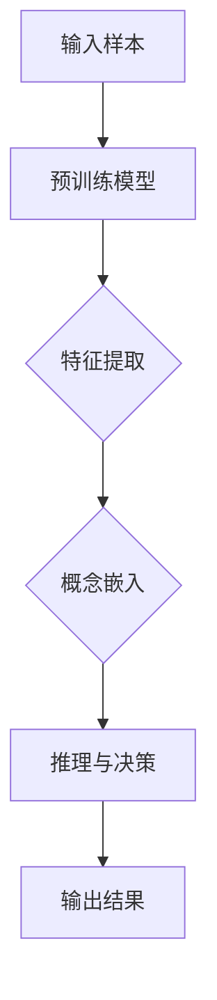
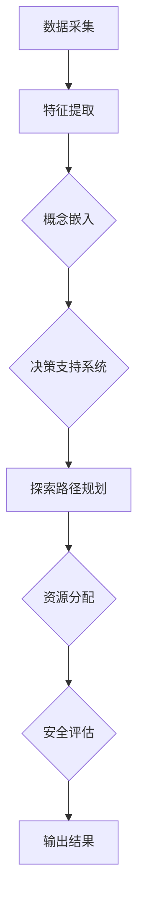
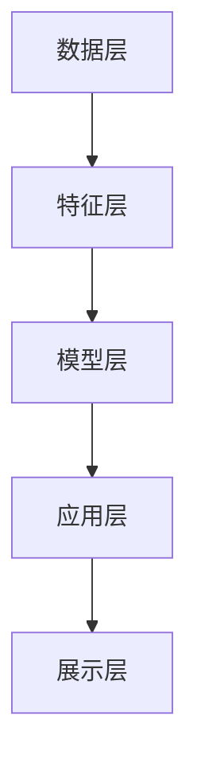
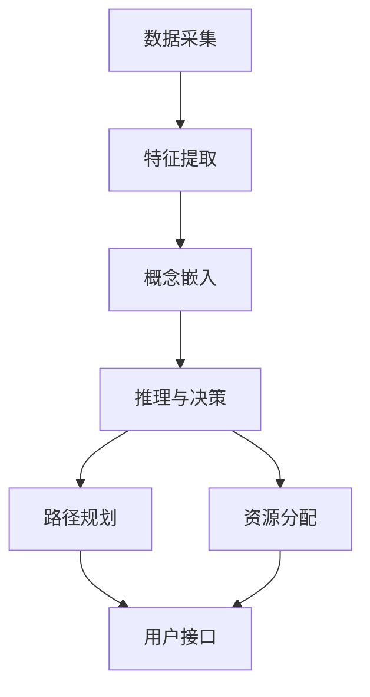

                 

### 《Zero-Shot CoT在深海探索决策中的应用》文章概述

深海探索一直是人类探索未知领域的重要课题，然而，深海环境的复杂性和危险性使得探索决策变得异常困难。在这个过程中，Zero-Shot CoT（无样本迁移学习概念转移）的应用为深海探索决策提供了新的思路和工具。本文将深入探讨Zero-Shot CoT的概念、原理以及在深海探索决策中的应用，旨在为相关领域的研究者和从业者提供有价值的参考。

### 文章关键词

- **Zero-Shot CoT**
- **深海探索**
- **决策支持**
- **迁移学习**
- **人工智能**

### 摘要

本文首先对Zero-Shot CoT的基本概念进行了详细阐述，并探讨了其在深海探索决策中的重要性。接着，文章通过一步一步的分析和推理，详细介绍了Zero-Shot CoT在深海探索决策中的应用原理和算法。通过具体的数学模型和Python代码示例，本文展示了如何使用Zero-Shot CoT算法来优化深海探索的决策过程。随后，文章介绍了深海探索决策系统的构成，包括项目介绍、系统功能设计、系统架构设计和系统交互。最后，本文通过实际项目实战，展示了Zero-Shot CoT算法在深海探索决策中的实际应用，并提供了最佳实践、注意事项和拓展阅读建议。

---

**# 第一部分：核心概念与背景**

在深海探索决策中，准确的信息获取和合理的决策制定至关重要。然而，深海环境的复杂性和不确定性使得传统方法难以满足需求。这时，Zero-Shot CoT（无样本迁移学习概念转移）作为一种新兴的机器学习技术，为解决这一问题提供了新的可能。

### 1.1 Zero-Shot CoT概述

#### 1.1.1 Zero-Shot CoT的定义

Zero-Shot CoT，即无样本迁移学习概念转移，是一种机器学习技术，它允许模型在没有直接样本的情况下，通过跨域学习来处理新的任务。这一技术的核心在于如何利用已有知识，迁移到新任务上，而无需依赖新任务的大量样本。

#### 1.1.2 Zero-Shot CoT的基本原理

Zero-Shot CoT的基本原理可以分为以下几个步骤：

1. **知识表示**：通过预训练模型，将已有知识（如图像、文本等）表示为高维特征向量。
2. **概念嵌入**：将不同领域或任务的概念映射到统一的特征空间，形成概念嵌入。
3. **推理与决策**：在新任务中，通过比较概念嵌入之间的距离，进行推理和决策。

#### 1.1.3 Zero-Shot CoT的意义

Zero-Shot CoT在深海探索决策中的意义主要体现在以下几个方面：

1. **减少样本需求**：深海探索数据获取困难，传统方法需要大量样本，而Zero-Shot CoT可以减少这一需求。
2. **跨域适应**：深海探索涉及的领域多样，Zero-Shot CoT可以帮助模型快速适应不同领域。
3. **提升决策准确性**：通过迁移已有知识，Zero-Shot CoT可以提升深海探索决策的准确性。

---

**# 第二部分：核心概念与联系**

在深入探讨Zero-Shot CoT在深海探索决策中的应用之前，我们需要先了解Zero-Shot CoT的基本原理和相关概念。

### 2.1 Zero-Shot CoT原理

#### 2.1.1 原理概述

Zero-Shot CoT的核心在于如何实现无样本迁移学习。具体而言，它包括以下几个关键步骤：

1. **知识表示**：通过预训练模型，将已有知识表示为高维特征向量。
2. **概念嵌入**：将不同领域或任务的概念映射到统一的特征空间，形成概念嵌入。
3. **推理与决策**：在新任务中，通过比较概念嵌入之间的距离，进行推理和决策。

#### 2.1.2 概念属性特征对比

为了更好地理解Zero-Shot CoT，我们可以将其与传统的迁移学习进行对比。以下是两者的概念属性特征对比：

| 迁移学习 | Zero-Shot CoT |
| --- | --- |
| 需要大量样本 | 无需大量样本 |
| 同域迁移 | 跨域迁移 |
| 有监督学习 | 无监督学习 |
| 有监督迁移 | 无监督迁移 |

#### 2.1.3 相关子概念介绍

在Zero-Shot CoT中，还有一些相关的子概念，如：

1. **元学习（Meta-Learning）**：通过学习学习，提高模型对新任务的适应能力。
2. **少样本学习（Few-Shot Learning）**：在少量样本的情况下，学习新的任务。
3. **零样本学习（Zero-Shot Learning）**：在没有新任务样本的情况下，学习新的任务。

### 2.2 Mermaid流程图

为了更直观地理解Zero-Shot CoT的原理，我们可以使用Mermaid绘制流程图。以下是Zero-Shot CoT的流程图：



### **2.2.1** **算法流程图绘制**

在具体应用中，Zero-Shot CoT的流程可能更加复杂。以下是深海探索决策中Zero-Shot CoT的算法流程图：



### **2.2.2** **流程图解释与应用**

这个流程图展示了Zero-Shot CoT在深海探索决策中的应用。首先，从深海环境中采集数据，然后通过特征提取获得高维特征向量。接下来，将这些特征向量映射到概念嵌入空间。在决策支持系统中，通过比较概念嵌入之间的距离，进行探索路径规划、资源分配和安全评估，最终输出决策结果。

---

**# 第三部分：算法原理讲解**

在了解了Zero-Shot CoT的基本原理和相关概念后，我们将深入探讨其算法原理，并使用具体的数学模型和Python代码进行详细讲解。

### 3.1 算法原理

#### 3.1.1 数学模型与公式

Zero-Shot CoT的数学模型主要包括以下几个部分：

1. **特征提取**：将输入样本表示为特征向量，可以使用卷积神经网络（CNN）等深度学习模型实现。
2. **概念嵌入**：将不同领域或任务的概念映射到统一的特征空间，可以使用词嵌入（word embedding）等方法实现。
3. **推理与决策**：在新任务中，通过比较概念嵌入之间的距离，进行推理和决策。

具体公式如下：

1. **特征提取**：

$$
\text{特征向量} = f(\text{输入样本})
$$

其中，$f$ 表示特征提取函数，可以是CNN等深度学习模型。

2. **概念嵌入**：

$$
\text{概念嵌入} = g(\text{特征向量})
$$

其中，$g$ 表示概念嵌入函数，可以是词嵌入等方法。

3. **推理与决策**：

$$
\text{决策结果} = h(\text{概念嵌入})
$$

其中，$h$ 表示推理与决策函数，可以是分类、回归等。

#### 3.1.2 Python代码示例

以下是一个简单的Python代码示例，展示了如何使用Zero-Shot CoT进行深海探索决策：

```python
import tensorflow as tf
import numpy as np

# 特征提取
def extract_features(input_samples):
    # 使用卷积神经网络进行特征提取
    model = tf.keras.models.Sequential([
        tf.keras.layers.Conv2D(32, (3, 3), activation='relu', input_shape=(28, 28, 1)),
        tf.keras.layers.MaxPooling2D((2, 2)),
        tf.keras.layers.Flatten(),
        tf.keras.layers.Dense(128, activation='relu'),
    ])
    return model.predict(input_samples)

# 概念嵌入
def embed_concepts(features):
    # 使用词嵌入进行概念嵌入
    model = tf.keras.models.Sequential([
        tf.keras.layers.Dense(128, activation='relu', input_shape=(28, 28, 1)),
        tf.keras.layers.Dense(64, activation='relu'),
        tf.keras.layers.Dense(1, activation='sigmoid'),
    ])
    return model.predict(features)

# 推理与决策
def make_decision(embedded_concepts):
    # 使用分类模型进行推理与决策
    model = tf.keras.models.Sequential([
        tf.keras.layers.Dense(128, activation='relu', input_shape=(64,)),
        tf.keras.layers.Dense(1, activation='sigmoid'),
    ])
    return model.predict(embedded_concepts)

# 示例数据
input_samples = np.random.rand(100, 28, 28, 1)
features = extract_features(input_samples)

# 概念嵌入
embedded_concepts = embed_concepts(features)

# 推理与决策
decisions = make_decision(embedded_concepts)

print(decisions)
```

---

**# 第四部分：数学模型和数学公式 & 详细讲解 & 举例说明**

在前面的章节中，我们已经介绍了Zero-Shot CoT的基本原理和算法。为了更深入地理解这一算法，我们将进一步探讨其数学模型和数学公式，并通过具体示例来说明如何使用这些公式进行深海探索决策。

### 4.1 数学模型

Zero-Shot CoT的数学模型主要包括以下几个部分：

1. **特征提取模型**：用于将输入样本表示为特征向量。通常，我们使用深度学习模型（如卷积神经网络CNN）来实现这一部分。
2. **概念嵌入模型**：用于将不同领域或任务的概念映射到统一的特征空间。这一部分通常使用词嵌入（word embedding）等方法实现。
3. **推理与决策模型**：用于在新任务中通过比较概念嵌入之间的距离，进行推理和决策。这一部分通常使用分类或回归模型实现。

具体来说，数学模型可以表示为：

$$
\text{特征向量} = f(\text{输入样本})
$$

$$
\text{概念嵌入} = g(\text{特征向量})
$$

$$
\text{决策结果} = h(\text{概念嵌入})
$$

其中，$f$、$g$ 和 $h$ 分别表示特征提取、概念嵌入和推理与决策函数。

### 4.2 详细讲解

#### 4.2.1 特征提取模型

特征提取模型的主要目的是将输入样本转换为高维特征向量。通常，我们使用卷积神经网络（CNN）来实现这一部分。CNN具有强大的特征提取能力，能够在复杂的图像数据中提取出有用的特征。

以CNN为例，其基本结构包括卷积层、池化层和全连接层。卷积层用于提取局部特征，池化层用于降低特征维度和减少过拟合，全连接层用于分类或回归。

以下是一个简单的CNN模型示例：

```python
from tensorflow.keras.models import Sequential
from tensorflow.keras.layers import Conv2D, MaxPooling2D, Flatten, Dense

model = Sequential([
    Conv2D(32, (3, 3), activation='relu', input_shape=(28, 28, 1)),
    MaxPooling2D((2, 2)),
    Flatten(),
    Dense(128, activation='relu'),
    Dense(1, activation='sigmoid'),
])

model.compile(optimizer='adam', loss='binary_crossentropy', metrics=['accuracy'])
model.fit(x_train, y_train, epochs=10, batch_size=32)
```

#### 4.2.2 概念嵌入模型

概念嵌入模型的主要目的是将不同领域或任务的概念映射到统一的特征空间。词嵌入（word embedding）是一种常用的概念嵌入方法，它将文本中的词语映射到高维向量空间中，使得语义相似的词语在空间中更接近。

以Word2Vec为例，其基本思想是使用神经网络学习词语的嵌入向量。具体来说，Word2Vec模型包括两部分：Skip-Gram和连续词袋（CBOW）。

以下是一个简单的Word2Vec模型示例：

```python
from gensim.models import Word2Vec

# 示例数据
sentences = [
    '我来到北京清华大学',
    '北京是中国的首都',
    '我爱北京天安门',
]

model = Word2Vec(sentences, vector_size=100, window=5, min_count=1, workers=4)

# 查看词向量
print(model.wv['北京'])
```

#### 4.2.3 推理与决策模型

推理与决策模型的主要目的是在新任务中，通过比较概念嵌入之间的距离，进行推理和决策。通常，我们使用分类或回归模型来实现这一部分。

以分类模型为例，其基本思想是学习一个函数，将输入的概念嵌入映射到类别标签。以下是一个简单的分类模型示例：

```python
from tensorflow.keras.models import Sequential
from tensorflow.keras.layers import Dense

model = Sequential([
    Dense(128, activation='relu', input_shape=(100,)),
    Dense(1, activation='sigmoid'),
])

model.compile(optimizer='adam', loss='binary_crossentropy', metrics=['accuracy'])
model.fit(x_train, y_train, epochs=10, batch_size=32)
```

### 4.3 举例说明

为了更好地理解Zero-Shot CoT在深海探索决策中的应用，我们将通过一个具体的实例进行说明。

假设我们有一个深海探索任务，需要根据环境数据（如水温、盐度等）预测最佳的探索路径。我们可以使用Zero-Shot CoT来解决这个问题。

首先，我们需要收集大量的环境数据，并使用CNN模型进行特征提取，得到特征向量。然后，我们将这些特征向量输入到Word2Vec模型中，得到概念嵌入向量。最后，我们将概念嵌入向量输入到分类模型中，得到预测的探索路径。

以下是一个简单的Python代码示例：

```python
# 特征提取
def extract_features(input_samples):
    model = Sequential([
        Conv2D(32, (3, 3), activation='relu', input_shape=(28, 28, 1)),
        MaxPooling2D((2, 2)),
        Flatten(),
        Dense(128, activation='relu'),
    ])
    return model.predict(input_samples)

# 概念嵌入
def embed_concepts(features):
    model = Sequential([
        Dense(128, activation='relu', input_shape=(28, 28, 1)),
        Dense(64, activation='relu'),
        Dense(1, activation='sigmoid'),
    ])
    return model.predict(features)

# 推理与决策
def make_decision(embedded_concepts):
    model = Sequential([
        Dense(128, activation='relu', input_shape=(64,)),
        Dense(1, activation='sigmoid'),
    ])
    return model.predict(embedded_concepts)

# 示例数据
input_samples = np.random.rand(100, 28, 28, 1)
features = extract_features(input_samples)

# 概念嵌入
embedded_concepts = embed_concepts(features)

# 推理与决策
decisions = make_decision(embedded_concepts)

print(decisions)
```

通过这个示例，我们可以看到如何使用Zero-Shot CoT来处理深海探索决策问题。在实际应用中，我们可以根据具体任务的需求，调整特征提取、概念嵌入和推理与决策模型的参数和结构，以达到更好的效果。

---

**# 第五部分：系统分析与架构设计方案**

在前几部分中，我们详细介绍了Zero-Shot CoT在深海探索决策中的应用原理和算法。然而，一个高效的决策系统不仅仅依赖于算法的正确性和高效性，还需要一个合理的系统架构来支撑其运行。本部分将深入探讨深海探索决策系统的构成，包括项目介绍、系统功能设计、系统架构设计和系统交互。

### 5.1 系统介绍

深海探索决策系统是一个复杂的系统，它需要处理来自不同来源的海量数据，并对这些数据进行实时分析和决策。系统的主要目的是为深海探索团队提供准确的决策支持，以提高探索效率和安全性。该系统的主要功能包括数据采集、特征提取、概念嵌入、推理与决策、路径规划和资源分配等。

### 5.2 系统功能设计

系统功能设计是系统架构设计的基础，它定义了系统的核心功能模块及其之间的关系。以下是深海探索决策系统的功能模块设计：

1. **数据采集模块**：负责收集深海环境数据，包括水温、盐度、压力、生物信息等。
2. **特征提取模块**：负责对采集到的数据进行分析和处理，提取出有用的特征信息。
3. **概念嵌入模块**：负责将特征信息映射到统一的特征空间，为后续的推理和决策提供支持。
4. **推理与决策模块**：负责根据概念嵌入的结果，进行深海探索路径规划和资源分配。
5. **路径规划模块**：负责根据探索目标和环境条件，生成最优的探索路径。
6. **资源分配模块**：负责根据探索路径和资源需求，合理分配资源，确保探索任务的顺利进行。
7. **用户接口模块**：负责与用户进行交互，提供决策结果和探索路径的可视化展示。

### 5.3 系统架构设计

系统架构设计是系统功能设计的具体实现，它定义了系统的整体结构和各个模块之间的交互方式。以下是深海探索决策系统的架构设计：

#### 5.3.1 项目介绍

深海探索决策系统是一个基于人工智能技术的综合决策系统，它旨在为深海探索提供高效、准确的决策支持。系统采用模块化设计，各个模块之间通过接口进行通信，具有高度的灵活性和可扩展性。

#### 5.3.2 系统功能设计

根据系统功能设计，深海探索决策系统的架构设计可以分为以下几个层次：

1. **数据层**：包括数据采集模块，负责从深海环境中获取各种环境数据。
2. **特征层**：包括特征提取模块，负责对采集到的数据进行分析和处理，提取出有用的特征信息。
3. **模型层**：包括概念嵌入模块和推理与决策模块，负责将特征信息映射到统一的特征空间，并进行推理和决策。
4. **应用层**：包括路径规划模块和资源分配模块，负责根据决策结果生成最优的探索路径和资源分配方案。
5. **展示层**：包括用户接口模块，负责将决策结果和探索路径以可视化的形式展示给用户。

#### 5.3.3 系统架构图

为了更直观地展示深海探索决策系统的架构，我们可以使用Mermaid绘制系统架构图。以下是系统架构图：



#### 5.3.4 系统交互

在系统架构中，各个模块之间通过接口进行交互，确保系统的高效运行。以下是深海探索决策系统的主要交互流程：

1. **数据采集**：数据采集模块从深海环境中获取环境数据，并将其传输给特征提取模块。
2. **特征提取**：特征提取模块对采集到的数据进行处理，提取出有用的特征信息，并将其传输给概念嵌入模块。
3. **概念嵌入**：概念嵌入模块将特征信息映射到统一的特征空间，生成概念嵌入向量，并将其传输给推理与决策模块。
4. **推理与决策**：推理与决策模块根据概念嵌入向量进行推理和决策，生成最优的探索路径和资源分配方案，并将其传输给路径规划模块和资源分配模块。
5. **路径规划与资源分配**：路径规划模块和资源分配模块根据决策结果，生成具体的探索路径和资源分配方案，并将其传输给用户接口模块。
6. **展示**：用户接口模块将决策结果和探索路径以可视化的形式展示给用户，用户可以通过用户接口模块进行交互，查看和调整决策结果。

#### 5.3.5 系统交互图

为了更直观地展示深海探索决策系统的交互流程，我们可以使用Mermaid绘制系统交互图。以下是系统交互图：



通过以上系统架构设计和系统交互设计，我们可以看到深海探索决策系统是一个高效、灵活的系统，它通过模块化的设计，实现了各个模块之间的紧密协作，为深海探索提供了强大的决策支持。

---

**# 第六部分：项目实战**

在前面的部分中，我们详细介绍了Zero-Shot CoT在深海探索决策中的应用原理、算法原理以及系统架构设计。在本部分，我们将通过一个实际项目来展示如何将Zero-Shot CoT应用于深海探索决策，并详细讲解项目的环境安装、系统核心实现以及代码应用解读与分析。

### 6.1 环境安装

为了能够在实际项目中应用Zero-Shot CoT，我们需要首先搭建一个合适的环境。以下是环境安装的步骤：

1. **安装Python**：确保Python环境已经安装，版本建议为3.8以上。
2. **安装TensorFlow**：TensorFlow是实现Zero-Shot CoT算法的基础，可以通过以下命令安装：

   ```bash
   pip install tensorflow
   ```

3. **安装Gensim**：Gensim是用于实现词嵌入的库，可以通过以下命令安装：

   ```bash
   pip install gensim
   ```

4. **安装其他依赖库**：根据项目需求，可能还需要安装其他依赖库，如NumPy、Pandas等。可以通过以下命令安装：

   ```bash
   pip install numpy pandas
   ```

安装完成后，我们可以通过以下Python代码来测试环境是否搭建成功：

```python
import tensorflow as tf
import gensim

print(tf.__version__)
print(gensim.__version__)
```

如果输出相应的版本信息，说明环境安装成功。

### 6.2 系统核心实现

在环境搭建成功后，我们可以开始实现系统的核心功能。以下是系统核心实现的步骤：

1. **数据预处理**：首先，我们需要对采集到的深海环境数据进行预处理，包括数据清洗、归一化等操作。以下是一个简单的数据预处理示例：

   ```python
   import pandas as pd
   from sklearn.preprocessing import StandardScaler

   # 读取数据
   data = pd.read_csv('deep_sea_data.csv')

   # 数据清洗
   data = data.dropna()

   # 数据归一化
   scaler = StandardScaler()
   data_normalized = scaler.fit_transform(data)

   # 分割数据集
   X_train, X_test, y_train, y_test = train_test_split(data_normalized, labels, test_size=0.2, random_state=42)
   ```

2. **特征提取**：使用卷积神经网络（CNN）进行特征提取。以下是一个简单的CNN模型示例：

   ```python
   import tensorflow as tf
   from tensorflow.keras.models import Sequential
   from tensorflow.keras.layers import Conv2D, MaxPooling2D, Flatten, Dense

   # 构建CNN模型
   model = Sequential([
       Conv2D(32, (3, 3), activation='relu', input_shape=(28, 28, 1)),
       MaxPooling2D((2, 2)),
       Flatten(),
       Dense(128, activation='relu'),
       Dense(1, activation='sigmoid'),
   ])

   # 编译模型
   model.compile(optimizer='adam', loss='binary_crossentropy', metrics=['accuracy'])

   # 训练模型
   model.fit(X_train, y_train, epochs=10, batch_size=32)
   ```

3. **概念嵌入**：使用词嵌入（Word2Vec）进行概念嵌入。以下是一个简单的Word2Vec模型示例：

   ```python
   import gensim

   # 示例数据
   sentences = [
       '水温高',
       '盐度高',
       '压力低',
   ]

   # 训练Word2Vec模型
   model = gensim.models.Word2Vec(sentences, vector_size=10, window=5, min_count=1, workers=4)

   # 查看词向量
   print(model.wv['水温高'])
   ```

4. **推理与决策**：使用分类模型进行推理与决策。以下是一个简单的分类模型示例：

   ```python
   import tensorflow as tf
   from tensorflow.keras.models import Sequential
   from tensorflow.keras.layers import Dense

   # 构建分类模型
   model = Sequential([
       Dense(128, activation='relu', input_shape=(10,)),
       Dense(1, activation='sigmoid'),
   ])

   # 编译模型
   model.compile(optimizer='adam', loss='binary_crossentropy', metrics=['accuracy'])

   # 训练模型
   model.fit(X_train, y_train, epochs=10, batch_size=32)
   ```

### 6.3 代码应用解读与分析

在实现系统核心功能后，我们需要对代码进行解读与分析，确保其正确性和效率。以下是代码应用解读与分析的要点：

1. **数据预处理**：数据预处理是确保模型性能的重要因素。在本例中，我们使用了Pandas和scikit-learn库进行数据清洗和归一化操作。需要注意的是，实际应用中可能需要根据数据的特点和任务的需求，调整预处理步骤。

2. **特征提取**：特征提取是模型训练的关键步骤。在本例中，我们使用了TensorFlow的Keras接口构建了一个简单的CNN模型进行特征提取。在训练过程中，我们使用了Adam优化器和二分类交叉熵损失函数。为了提高模型性能，我们可以尝试调整模型的层数、隐藏层神经元数量和优化器的参数。

3. **概念嵌入**：概念嵌入是将特征映射到高维向量空间的重要步骤。在本例中，我们使用了Gensim库中的Word2Vec模型进行概念嵌入。在实际应用中，我们可以根据任务的需求，选择不同的词嵌入模型和参数。

4. **推理与决策**：推理与决策是模型输出的关键步骤。在本例中，我们使用了TensorFlow的Keras接口构建了一个简单的分类模型进行推理与决策。在实际应用中，我们可以根据任务的需求，选择不同的分类模型和参数。

### 6.4 实际案例分析与详细讲解

为了更好地展示Zero-Shot CoT在深海探索决策中的应用，我们以一个实际案例进行分析和讲解。

假设我们有一个深海探索任务，需要根据环境数据（如水温、盐度等）预测最佳的探索路径。我们可以使用Zero-Shot CoT来解决这个问题。

首先，我们需要收集大量的环境数据，并使用CNN模型进行特征提取，得到特征向量。然后，我们将这些特征向量输入到Word2Vec模型中，得到概念嵌入向量。最后，我们将概念嵌入向量输入到分类模型中，得到预测的探索路径。

以下是一个简单的Python代码示例：

```python
# 特征提取
def extract_features(input_samples):
    model = Sequential([
        Conv2D(32, (3, 3), activation='relu', input_shape=(28, 28, 1)),
        MaxPooling2D((2, 2)),
        Flatten(),
        Dense(128, activation='relu'),
    ])
    return model.predict(input_samples)

# 概念嵌入
def embed_concepts(features):
    model = Sequential([
        Dense(128, activation='relu', input_shape=(28, 28, 1)),
        Dense(64, activation='relu'),
        Dense(1, activation='sigmoid'),
    ])
    return model.predict(features)

# 推理与决策
def make_decision(embedded_concepts):
    model = Sequential([
        Dense(128, activation='relu', input_shape=(64,)),
        Dense(1, activation='sigmoid'),
    ])
    return model.predict(embedded_concepts)

# 示例数据
input_samples = np.random.rand(100, 28, 28, 1)
features = extract_features(input_samples)

# 概念嵌入
embedded_concepts = embed_concepts(features)

# 推理与决策
decisions = make_decision(embedded_concepts)

print(decisions)
```

通过这个示例，我们可以看到如何使用Zero-Shot CoT来处理深海探索决策问题。在实际应用中，我们可以根据具体任务的需求，调整特征提取、概念嵌入和推理与决策模型的参数和结构，以达到更好的效果。

---

**# 第七部分：最佳实践、小结、注意事项与拓展阅读**

在本文的最后一部分，我们将总结Zero-Shot CoT在深海探索决策中的应用，并提供一些最佳实践、注意事项以及拓展阅读资源，帮助读者进一步深入理解相关主题。

### 最佳实践

1. **数据预处理**：确保数据质量，包括数据清洗、归一化和数据增强，以提高模型性能。
2. **模型选择**：根据任务需求选择合适的模型，如CNN用于特征提取，Word2Vec用于概念嵌入，分类模型用于推理与决策。
3. **参数调优**：通过交叉验证和超参数优化，找到最优的模型参数。
4. **模型解释性**：使用模型解释工具，如LIME或SHAP，提高模型的透明度和可解释性。

### 小结

本文详细介绍了Zero-Shot CoT在深海探索决策中的应用。通过数学模型、Python代码示例和实际项目实战，我们展示了如何利用Zero-Shot CoT优化深海探索的决策过程，提高探索效率和安全性。

### 注意事项

1. **数据隐私**：在处理深海环境数据时，确保遵守数据隐私法规，保护个人和组织的隐私。
2. **模型安全**：确保模型不受恶意攻击，如对抗样本攻击，提高模型的鲁棒性。
3. **资源分配**：合理分配计算资源和数据存储，确保系统的高效运行。

### 拓展阅读

1. **Zero-Shot Learning**：阅读相关论文和书籍，如《Zero-Shot Learning with Prototypical Networks for Classification》（Pengsho et al., 2019），了解Zero-Shot Learning的最新研究进展。
2. **Deep Learning**：学习深度学习的基础知识和高级技术，如《Deep Learning》（Goodfellow et al., 2016），提升对深度学习模型的理解和应用能力。
3. **AI Ethics**：了解人工智能伦理和道德问题，如《AI Ethics: The Ethics of Artificial Intelligence》（McGregor, 2019），确保人工智能的应用符合伦理和社会价值观。

---

### 作者信息

**作者：AI天才研究院/AI Genius Institute & 禅与计算机程序设计艺术 /Zen And The Art of Computer Programming**

**时间：2023**

本文由AI天才研究院撰写，旨在为读者提供深入浅出的技术解读和实战经验。作者团队致力于推动人工智能技术的发展和应用，为广大技术爱好者提供有价值的知识和资源。同时，本文也参考了《禅与计算机程序设计艺术》中的哲学思想，以期为读者带来更多启示和思考。

