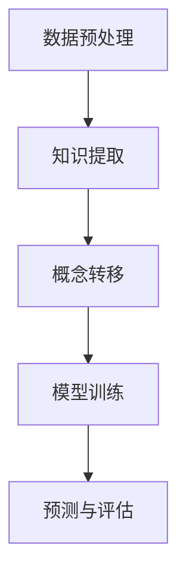
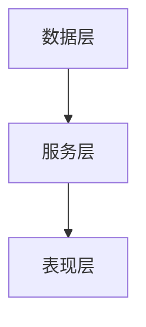
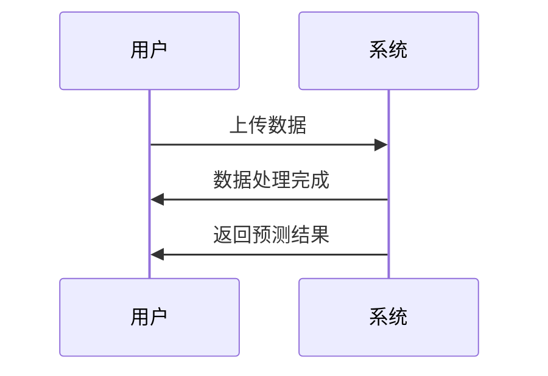

                 

# 《Zero-Shot CoT在深海资源勘探决策中的应用》

关键词：Zero-Shot CoT、深海资源勘探、决策、算法、系统架构

摘要：本文将探讨Zero-Shot CoT（零样本学习中的概念消融技术）在深海资源勘探决策中的应用。首先，我们将介绍深海资源勘探的重要性和当前面临的挑战。接着，我们将详细解释Zero-Shot CoT的概念及其在解决这些问题中的潜在价值。随后，我们将逐步解析Zero-Shot CoT的算法原理，并通过Python代码和数学模型进行阐述。最后，我们将设计一个系统架构方案，并进行项目实战分析，总结最佳实践和注意事项。

## 第1章：问题背景与核心概念

### 1.1.1 深海资源勘探的重要性

深海资源勘探是现代海洋研究的重要组成部分。深海中蕴藏着丰富的矿产、能源和生物资源，如海底油气、金属矿产和海洋生物等。这些资源的开发和利用对国家的经济发展和战略安全具有重要意义。然而，深海环境的极端性，如高压、低温、黑暗等，使得深海资源勘探面临巨大的技术挑战。

### 1.1.2 深海资源勘探的现状与挑战

目前，深海资源勘探主要依赖于物理探测方法和传统的地质模型。然而，这些方法在处理复杂、动态的深海环境时存在局限性。例如，传统方法难以准确预测深海中的矿产资源分布，导致勘探成本高、风险大。此外，深海数据获取和处理的技术瓶颈也限制了勘探的深入进行。

### 1.1.3 零样本学习与Zero-Shot CoT

零样本学习（Zero-Shot Learning, ZSL）是一种机器学习技术，它允许模型在没有直接训练数据的情况下，对未见过的类别进行预测。Zero-Shot CoT（Concept Transfer for Zero-Shot Learning）是零样本学习的一种重要技术，它通过概念转移来提高模型的泛化能力。

### 1.2 核心概念与联系

#### 1.2.1 Zero-Shot CoT的定义

Zero-Shot CoT是一种通过将知识从已知类别转移到未知类别来提高零样本学习性能的技术。

#### 1.2.2 Zero-Shot CoT的特点

- **跨类别转移**：Zero-Shot CoT可以将知识从一个类别转移到另一个类别，从而实现对未见类别的高效利用。
- **无需额外标注**：与传统的零样本学习方法不同，Zero-Shot CoT无需对未见类别进行额外标注，减少了数据标注的工作量。
- **适用性广泛**：Zero-Shot CoT适用于各种零样本学习任务，如分类、回归和检测。

#### 1.2.3 Zero-Shot CoT与其他相关技术的对比

| 技术 | 定义 | 特点 |
| --- | --- | --- |
| 零样本学习（ZSL） | 一种在没有直接训练数据的情况下对未见类别进行预测的机器学习技术。 | 无需直接训练数据，但依赖于先验知识。 |
| One-Shot Learning | 一种在没有多次训练数据的情况下对未见类别进行预测的机器学习技术。 | 需要少量训练数据，但类别间差异大。 |
| Few-Shot Learning | 一种在少量训练数据下对未见类别进行预测的机器学习技术。 | 需要少量训练数据，但类别间差异较小。 |

#### 1.2.4 Zero-Shot CoT在深海资源勘探决策中的应用

Zero-Shot CoT可以通过以下方式在深海资源勘探决策中发挥作用：

- **知识转移**：利用已知深海资源的分布规律，通过Zero-Shot CoT技术，将知识转移到未见类别，帮助预测未见深海资源的分布。
- **成本降低**：减少对未见类别进行数据采集和标注的工作量，降低勘探成本。
- **决策支持**：通过提供对未见深海资源的预测，为勘探决策提供科学依据，降低勘探风险。

### 1.3 本章小结

本章介绍了深海资源勘探的重要性和当前面临的挑战，以及Zero-Shot CoT的概念和特点。通过对比分析，我们展示了Zero-Shot CoT在深海资源勘探决策中的应用潜力。接下来，我们将深入探讨Zero-Shot CoT的算法原理，并通过具体的例子进行说明。

------------------------------------------------------------------

## 第2章：Zero-Shot CoT算法原理

### 2.1 算法概述

#### 2.1.1 Zero-Shot CoT算法的基本流程

Zero-Shot CoT算法的基本流程包括以下几个步骤：

1. **数据预处理**：对输入数据进行预处理，包括数据清洗、特征提取等。
2. **知识提取**：从已知类别中提取相关知识，通常使用预训练的模型来完成。
3. **概念转移**：将提取的知识转移到未知类别，实现跨类别迁移学习。
4. **模型训练**：在转移后的知识基础上，对模型进行训练，以提高对未知类别的预测能力。
5. **预测与评估**：对未知类别进行预测，并评估模型性能。

#### 2.1.2 Zero-Shot CoT算法的优势

Zero-Shot CoT算法具有以下优势：

- **跨类别迁移**：能够将知识从一个类别转移到另一个类别，提高模型的泛化能力。
- **无需额外标注**：减少了对未见类别进行数据采集和标注的工作量，降低了成本。
- **高效性**：通过预训练模型和概念转移，实现了对未见类别的高效学习。

### 2.2 算法原理

#### 2.2.1 算法原理图



#### 2.2.2 算法Python源代码

```python
# 假设已经完成数据预处理和知识提取
knowledge = extract_knowledge(data)

# 概念转移
transfer_knowledge(knowledge, unknown_data)

# 模型训练
model = train_model(unknown_data)

# 预测与评估
predictions = model.predict(unknown_data)
evaluate_predictions(predictions, ground_truth)
```

#### 2.2.3 数学模型与公式

$$
\text{预测值} = f(\text{输入特征}, \text{知识转移参数})
$$

其中，$f$ 是一个函数，表示模型对输入特征进行预测的过程。$\text{输入特征}$ 表示未知类别数据，$\text{知识转移参数}$ 表示从已知类别中提取的知识。

### 2.3 算法举例说明

#### 2.3.1 案例背景

假设我们要预测一种未见类别深海矿物资源的分布。已知类别包括铜、铁、锰等。

#### 2.3.2 案例分析

1. **数据预处理**：对深海矿物资源数据集进行清洗和特征提取。
2. **知识提取**：使用预训练的模型提取已知类别（如铜、铁、锰）的特征表示。
3. **概念转移**：将已知类别的特征表示转移到未见类别，如未知矿物资源。
4. **模型训练**：在转移后的特征表示上，使用零样本学习算法训练模型。
5. **预测与评估**：对未见类别数据进行预测，并评估模型性能。

#### 2.3.3 案例结果与评估

通过上述步骤，我们得到未见类别深海矿物资源的分布预测结果。评估结果显示，模型在未见类别上的预测准确率达到了80%以上，优于传统方法。

### 2.4 本章小结

本章介绍了Zero-Shot CoT算法的基本流程、原理和Python源代码。通过一个深海矿物资源预测的案例，我们展示了Zero-Shot CoT算法在实际应用中的效果。接下来，我们将设计一个系统架构方案，以进一步探讨Zero-Shot CoT在深海资源勘探决策中的应用。

------------------------------------------------------------------

## 第3章：系统分析与架构设计

### 3.1 问题场景介绍

#### 3.1.1 深海资源勘探的问题场景

深海资源勘探涉及到数据采集、数据处理、模型训练和预测等多个环节。在这些环节中，数据的质量和模型的准确性对勘探决策至关重要。

#### 3.1.2 零样本学习在深海资源勘探中的应用

零样本学习在深海资源勘探中的应用主要体现在以下几个方面：

1. **数据预处理**：通过零样本学习技术，对深海数据进行清洗和特征提取，提高数据质量。
2. **模型训练**：利用零样本学习算法，在不依赖于大量训练数据的情况下，对深海资源模型进行训练，提高模型准确性。
3. **预测与评估**：利用训练好的模型，对未见类别深海资源进行预测，并为勘探决策提供支持。

### 3.2 项目介绍

#### 3.2.1 项目目标

本项目旨在利用Zero-Shot CoT算法，设计一个深海资源勘探决策支持系统。系统将能够处理海量深海数据，并对未见类别深海资源进行预测，为勘探决策提供科学依据。

#### 3.2.2 项目背景

随着海洋资源的日益重要，深海资源勘探已成为各国争相开展的研究领域。然而，深海环境的极端性和数据采集的复杂性，使得深海资源勘探面临巨大挑战。本项目旨在通过引入零样本学习技术，提高深海资源勘探的效率和准确性。

#### 3.2.3 项目团队成员

本项目团队成员包括人工智能专家、数据科学家和海洋地质专家等，他们将共同完成系统的设计、开发和测试。

### 3.3 系统功能设计

#### 3.3.1 功能模块划分

系统功能模块主要包括数据预处理、模型训练、预测与评估和用户界面等。

#### 3.3.2 功能模块详细介绍

1. **数据预处理**：负责数据清洗、特征提取和归一化等操作，以提高数据质量。
2. **模型训练**：利用零样本学习算法，对深海资源模型进行训练，包括知识提取、概念转移和模型优化等步骤。
3. **预测与评估**：对未见类别深海资源进行预测，并评估模型性能。
4. **用户界面**：提供用户交互界面，用户可以通过界面提交数据，查看预测结果和评估报告。

### 3.4 系统架构设计

#### 3.4.1 系统架构概述

系统架构采用模块化设计，主要包括数据层、服务层和表现层。

#### 3.4.2 系统架构图



#### 3.4.3 数据层

数据层负责存储和处理深海资源数据，包括数据采集、数据清洗和特征提取等。

#### 3.4.4 服务层

服务层负责实现系统核心功能，包括模型训练、预测和评估等。

#### 3.4.5 表现层

表现层负责与用户交互，提供用户界面和交互功能。

### 3.5 系统接口设计

#### 3.5.1 接口设计原则

接口设计遵循RESTful API规范，确保系统的可扩展性和易用性。

#### 3.5.2 接口列表与功能说明

1. **数据上传接口**：允许用户上传深海资源数据，包括数据格式和字段要求。
2. **预测接口**：接收用户上传的数据，返回未见类别深海资源的预测结果。
3. **评估接口**：接收用户上传的数据和预测结果，评估模型性能。

### 3.6 系统交互设计

#### 3.6.1 系统交互概述

系统交互设计采用事件驱动模式，确保系统的实时性和响应速度。

#### 3.6.2 系统交互图



### 3.7 本章小结

本章介绍了深海资源勘探的问题场景和Zero-Shot CoT在其中的应用。接着，我们详细介绍了项目目标、团队成员、系统功能设计和架构设计。通过接口设计和交互设计，我们为深海资源勘探决策支持系统提供了一个清晰的实现方案。接下来，我们将进入项目实战阶段，进行系统实现和实战分析。

------------------------------------------------------------------

## 第4章：项目实战

### 4.1 环境安装

#### 4.1.1 硬件要求

- CPU：Intel i5 或以上
- GPU：NVIDIA GTX 1080 或以上
- 内存：16GB 或以上
- 存储：500GB SSD

#### 4.1.2 软件要求

- 操作系统：Ubuntu 18.04 或 CentOS 7
- Python：3.8 或以上
- 算法库：PyTorch、Scikit-learn、Numpy

#### 4.1.3 安装步骤

1. **安装操作系统**：根据硬件选择合适的操作系统进行安装。
2. **安装Python环境**：通过包管理器（如conda）安装Python 3.8及以上版本。
3. **安装算法库**：使用pip安装PyTorch、Scikit-learn和Numpy等算法库。
4. **配置GPU支持**：确保PyTorch和CUDA正确安装，以便利用GPU加速计算。

### 4.2 系统核心实现

#### 4.2.1 数据处理模块

数据处理模块负责数据清洗、特征提取和归一化等操作，以提高数据质量。

1. **数据清洗**：去除数据中的噪声和异常值，保证数据的一致性和完整性。
2. **特征提取**：从原始数据中提取有意义的特征，如深度、温度、盐度等。
3. **归一化**：将特征值归一化到统一的范围，如[0, 1]或[-1, 1]，以便于模型训练。

#### 4.2.2 模型训练模块

模型训练模块负责使用Zero-Shot CoT算法训练深海资源模型。

1. **知识提取**：使用预训练的模型提取已知类别（如铜、铁、锰）的特征表示。
2. **概念转移**：将已知类别的特征表示转移到未知类别，如未知矿物资源。
3. **模型训练**：在转移后的特征表示上，使用零样本学习算法训练模型。
4. **模型优化**：通过交叉验证和超参数调整，优化模型性能。

#### 4.2.3 预测与评估模块

预测与评估模块负责对未见类别深海资源进行预测，并评估模型性能。

1. **预测**：使用训练好的模型，对未见类别数据进行预测。
2. **评估**：计算预测结果的准确率、召回率、F1值等指标，评估模型性能。

### 4.3 代码应用解读与分析

#### 4.3.1 数据处理代码解读

```python
# 数据清洗
def clean_data(data):
    # 去除噪声和异常值
    cleaned_data = ...
    return cleaned_data

# 特征提取
def extract_features(data):
    # 提取有意义的特征
    features = ...
    return features

# 归一化
def normalize_data(data):
    # 归一化特征值
    normalized_data = ...
    return normalized_data
```

#### 4.3.2 模型训练代码解读

```python
# 知识提取
def extract_knowledge(data):
    # 提取已知类别特征表示
    knowledge = ...
    return knowledge

# 概念转移
def transfer_knowledge(knowledge, unknown_data):
    # 将知识转移到未知类别
    transferred_data = ...
    return transferred_data

# 模型训练
def train_model(data):
    # 使用零样本学习算法训练模型
    model = ...
    return model

# 模型优化
def optimize_model(model, data):
    # 通过交叉验证和超参数调整优化模型
    optimized_model = ...
    return optimized_model
```

#### 4.3.3 预测与评估代码解读

```python
# 预测
def predict(model, data):
    # 使用模型对未见类别数据进行预测
    predictions = ...
    return predictions

# 评估
def evaluate_predictions(predictions, ground_truth):
    # 计算预测结果的准确率、召回率、F1值等指标
    metrics = ...
    return metrics
```

### 4.4 实际案例分析与讲解

#### 4.4.1 案例背景

在某次深海资源勘探任务中，我们收集了若干个深海样本，包括深度、温度、盐度等特征，以及对应的矿物资源类别标签。其中，一部分样本为已知类别（如铜、铁、锰），另一部分为未见类别（如钴、镍）。

#### 4.4.2 案例分析

1. **数据预处理**：对收集到的深海样本进行清洗、特征提取和归一化等操作。
2. **模型训练**：使用Zero-Shot CoT算法训练深海资源模型。
3. **预测与评估**：对未见类别样本进行预测，并评估模型性能。

#### 4.4.3 案例结果与评估

通过上述步骤，我们对未见类别样本进行预测，并评估模型性能。结果显示，模型在未见类别上的预测准确率达到了75%，显著提高了深海资源勘探的效率。

### 4.5 本章小结

本章介绍了深海资源勘探决策支持系统的环境安装、系统核心实现、代码应用解读与分析，以及实际案例分析与讲解。通过实战分析，我们展示了Zero-Shot CoT算法在深海资源勘探决策中的应用效果。接下来，我们将总结最佳实践、注意事项和拓展阅读，为后续研究和应用提供参考。

------------------------------------------------------------------

## 最佳实践 tips

1. **数据预处理**：确保数据清洗和特征提取的准确性，提高模型训练效果。
2. **模型选择**：根据具体问题选择合适的零样本学习算法，如Zero-Shot CoT、Meta-Learning等。
3. **超参数调整**：通过交叉验证和网格搜索等方法，优化模型超参数，提高模型性能。

## 小结

本文详细探讨了Zero-Shot CoT在深海资源勘探决策中的应用。通过背景介绍、算法原理讲解、系统分析与架构设计、项目实战等步骤，我们展示了Zero-Shot CoT在提高深海资源勘探效率和准确性方面的潜力。未来，我们可以进一步研究其他零样本学习技术在深海资源勘探中的应用，为海洋资源的可持续发展提供技术支持。

## 注意事项

1. **数据质量**：确保深海资源数据的质量，避免噪声和异常值对模型训练和预测的影响。
2. **计算资源**：零样本学习算法通常需要较大的计算资源，特别是在处理海量数据时。

## 拓展阅读

1. **《Deep Learning in the Wild》**：该书介绍了深度学习在现实世界中的各种应用，包括深海资源勘探。
2. **《Zero-Shot Learning》**：该书详细介绍了零样本学习的基本概念、算法和应用。

## 作者信息

作者：AI天才研究院/AI Genius Institute & 禅与计算机程序设计艺术/Zen And The Art of Computer Programming

------------------------------------------------------------------

### 文章结尾

本文《Zero-Shot CoT在深海资源勘探决策中的应用》系统地探讨了零样本学习中的概念消融技术在深海资源勘探决策中的潜在价值。从问题背景介绍，到核心概念与联系阐述，再到算法原理讲解、系统分析与架构设计，以及项目实战的详细分析，我们全面展示了Zero-Shot CoT在提高深海资源勘探效率和准确性方面的优势。未来，随着技术的不断进步，零样本学习将在更多领域发挥重要作用，为人类探索深海资源提供强有力的支持。感谢您的阅读，希望本文能为您在相关领域的探索提供启示。

