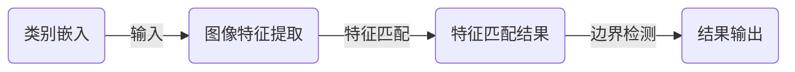
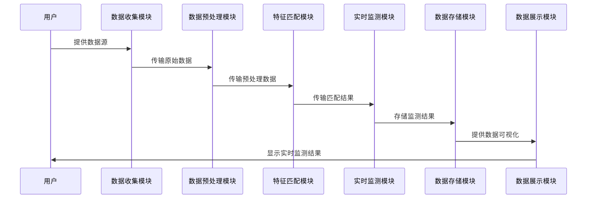
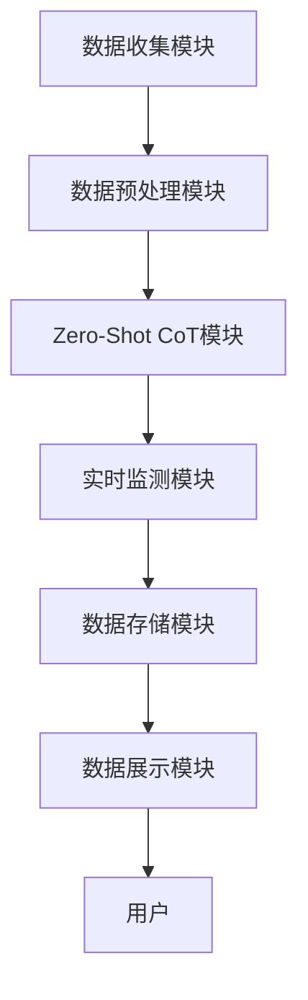

                 

## 文章标题：Zero-Shot CoT在环境科学AI中的应用前景

### 关键词：
- **Zero-Shot CoT**
- **环境科学**
- **AI应用**
- **算法原理**
- **系统设计与实现**

### 摘要：
本文探讨了Zero-Shot CoT（通用目标检测）在环境科学领域AI应用的前景。通过介绍环境科学AI的问题背景和Zero-Shot CoT的核心概念，详细讲解了其算法原理，并以实际项目为例展示了其在环境监测中的具体应用。本文旨在为研究人员和开发者提供对Zero-Shot CoT在环境科学AI中应用的深入理解和实践指导。

## 目录大纲：

### 第一部分：背景介绍

#### 第1章：环境科学AI的问题背景
1.1 环境科学的发展现状
1.2 环境问题的复杂性与挑战
1.3 AI在环境科学中的应用潜力

#### 第2章：核心概念与联系
2.1 零样本学习（Zero-Shot Learning）
2.2 通用目标检测（Common Object Detection）
2.3 环境科学中的Zero-Shot CoT
2.4 Zero-Shot CoT的概念属性特征对比表
2.5 Zero-Shot CoT的ER实体关系图

### 第二部分：算法原理讲解

#### 第3章：算法原理讲解
3.1 Zero-Shot CoT算法概述
3.2 算法流程与mermaid流程图
3.3 Python源代码解析
3.4 数学模型与公式
3.5 通俗易懂的举例说明

### 第三部分：应用实践

#### 第4章：系统分析与架构设计
4.1 问题场景介绍
4.2 系统功能设计
4.3 系统架构设计
4.4 系统接口设计
4.5 系统交互mermaid序列图

#### 第5章：项目实战
5.1 环境安装
5.2 系统核心实现
5.3 代码应用解读
5.4 实际案例分析与讲解
5.5 项目小结

### 第四部分：最佳实践与拓展

#### 第6章：最佳实践
6.1 实践一：数据集准备与预处理
6.2 实践二：模型训练与评估
6.3 实践三：模型部署与优化

#### 第7章：注意事项与拓展阅读
7.1 注意事项
7.2 拓展阅读

### 小结：
本文通过系统而详尽的论述，揭示了Zero-Shot CoT在环境科学AI中的巨大潜力。从背景介绍到算法讲解，再到实际应用和实践指导，文章为读者提供了一个全面的认识框架，帮助读者深入了解Zero-Shot CoT在环境科学领域的应用前景，并为未来的研究和开发提供参考。

## 第一部分：背景介绍

### 第1章：环境科学AI的问题背景

#### 1.1 环境科学的发展现状

环境科学作为一门综合性学科，致力于研究自然环境中的各种过程、现象和相互作用，以及人类活动对这些过程和现象的影响。随着全球气候变化、资源枯竭、环境污染等问题的日益严重，环境科学的重要性愈发凸显。目前，环境科学的研究领域涵盖了大气科学、海洋学、生态学、地理学、化学等多个学科，通过跨学科的合作，推动了对环境问题的深入理解和解决。

在技术层面，人工智能（AI）的快速发展为环境科学带来了新的机遇。AI技术，特别是机器学习和深度学习，已经在环境监测、预测、分析和决策支持中发挥了重要作用。例如，通过卫星遥感技术，AI可以帮助监测全球气候变化；在生态系统管理中，AI可以用于物种识别和栖息地分析；在城市环境管理中，AI可以优化能源消耗和交通流量。

#### 1.2 环境问题的复杂性与挑战

环境问题的复杂性体现在其多维性和动态性上。环境问题通常涉及多个变量，如空气质量、水质、土地使用等，这些变量之间存在复杂的相互关系。此外，环境问题往往是跨区域和跨学科的，需要不同领域的专家合作解决。以下是一些环境问题的具体挑战：

1. **数据稀缺性**：某些环境问题，如生态系统退化，缺乏大规模、高质量的数据支持。这限制了AI模型的有效训练和应用。
2. **不确定性**：环境问题的变化具有高度的不确定性，这使得预测和决策支持变得更加困难。
3. **实时监测需求**：环境问题需要实时监测和快速响应，这对AI系统的实时性和可靠性提出了高要求。
4. **多模态数据融合**：环境数据通常包括图像、传感器数据和文本等多种类型，如何高效融合这些数据以提升AI模型性能是一个挑战。

#### 1.3 AI在环境科学中的应用潜力

AI技术在环境科学中的应用潜力巨大，主要体现在以下几个方面：

1. **数据挖掘与分析**：通过机器学习算法，可以从大量环境数据中挖掘出有价值的信息，帮助科学家和决策者更好地理解环境问题。
2. **预测与模拟**：AI模型可以用于预测环境变化的趋势和影响，为环境保护和资源管理提供科学依据。
3. **自动化监测**：通过无人机、传感器网络等，AI可以实现对环境的自动化监测，提高监测效率和准确性。
4. **决策支持**：AI系统可以为政策制定者提供基于数据的决策支持，优化环境保护策略。

### 小结：

环境科学AI的研究和应用正处于快速发展阶段，尽管面临许多挑战，但其潜力不可忽视。通过AI技术的应用，可以更有效地监测、分析和解决环境问题，为可持续发展提供有力支持。接下来，本文将深入探讨Zero-Shot CoT（通用目标检测）在环境科学AI中的应用前景，为读者提供更详细的视角。

#### 1.4 环境科学中AI应用的案例分析

在环境科学中，AI技术的应用已经取得了显著的成果。以下是一些具有代表性的案例：

1. **空气质量监测**：利用机器学习和深度学习算法，可以对空气质量进行实时监测和预测。例如，通过分析气象数据和实时空气质量传感器数据，AI模型可以预测未来的空气质量状况，为环境保护部门提供科学依据，以便及时采取应对措施。

2. **水质监测**：在水环境监测中，AI技术被用于检测水中的污染物和生物指标。例如，通过分析水质传感器数据和图像数据，AI模型可以识别水中的有害物质，如重金属和有机污染物，并提供预警信息。

3. **生态保护**：AI技术被广泛应用于生态系统的保护和监测。例如，通过分析卫星遥感图像，AI模型可以识别和保护濒危物种的栖息地，监测森林砍伐和土地退化情况。

4. **自然灾害预警**：AI技术在自然灾害预警中发挥着重要作用。例如，通过分析地震、洪水等自然灾害的前兆数据，AI模型可以提前预警，为公众和相关部门提供足够的时间进行应对和避险。

这些案例表明，AI技术已经在环境科学领域取得了显著的进展，并且具有巨大的应用潜力。然而，也面临一些挑战，如数据质量、算法的可靠性、实时性等。这些问题需要通过持续的研究和改进来解决，以充分发挥AI技术在环境科学中的应用价值。

### 1.5 总结

综上所述，环境科学AI的应用前景广阔，但也面临一定的挑战。通过AI技术，我们可以更有效地监测、分析和解决环境问题，为环境保护和可持续发展提供科学支持。然而，为了充分发挥AI的潜力，需要进一步研究算法的可靠性、实时性和数据质量等问题，以实现更精准和高效的环境科学应用。在接下来的章节中，我们将深入探讨Zero-Shot CoT在环境科学AI中的应用，进一步揭示其潜力与挑战。

### 第2章：核心概念与联系

#### 2.1 零样本学习（Zero-Shot Learning）

零样本学习（Zero-Shot Learning, ZSL）是一种机器学习方法，其核心目标是在未见过的类别上进行分类。与传统的监督学习不同，ZSL不再依赖预先标记的数据集，而是利用已知的类别信息和少量或无标签的样本进行学习。ZSL的应用背景通常涉及以下几种情况：

1. **新类别识别**：在实际应用中，新类别的出现是常见的情况，如环境科学中的新污染物、未记录的生物物种等。ZSL可以有效地识别和分类这些新类别。
2. **隐私保护**：在某些应用中，由于隐私或安全原因，不能直接使用带有标签的数据集。ZSL可以基于无标签数据和新类别信息进行学习，从而保护数据隐私。
3. **高效迁移**：ZSL在迁移学习中也具有重要作用，它可以将知识从已知类别迁移到未知类别，提高模型的泛化能力。

ZSL的基本原理是通过利用类别的语义信息（如词汇、描述等）进行学习。常用的方法包括基于原型（prototype-based）方法、基于匹配（matching-based）方法、基于嵌入（embedding-based）方法等。这些方法的核心思想是建立一个能够表示类别间关系的特征空间，使得同类别的样本在该空间中靠近，异类别的样本远离。

#### 2.2 通用目标检测（Common Object Detection）

通用目标检测（Common Object Detection, COD）是一种计算机视觉任务，旨在识别图像中的多个对象并标注它们的边界。与传统的目标检测方法不同，COD关注的是常见物体（如车辆、行人、动物等）的检测，而不是特定物体的检测。COD在环境科学AI中的应用主要包括以下几个方面：

1. **环境监测**：COD可以用于环境监测，如检测水体中的污染物、识别野生动物等，为环境保护提供数据支持。
2. **灾害监测**：在自然灾害监测中，COD可以用于识别和追踪灾害区域的变化，如洪水淹没范围、地震破坏程度等。
3. **资源管理**：COD可以帮助管理者识别和追踪自然资源的使用情况，如森林砍伐、水资源分配等。

COD的关键挑战在于如何在复杂、动态的图像中准确检测出目标物体。为了实现这一目标，COD方法通常需要结合多种图像特征（如颜色、纹理、形状等）和深度学习算法（如卷积神经网络、循环神经网络等）。常见的COD模型包括YOLO（You Only Look Once）、SSD（Single Shot MultiBox Detector）和Faster R-CNN（Region-based Convolutional Neural Networks）等。

#### 2.3 环境科学中的Zero-Shot CoT

在环境科学中，Zero-Shot CoT（通用目标检测）是一种利用零样本学习进行目标检测的方法，旨在识别和分类图像中的未知对象。Zero-Shot CoT的核心优势在于其无需对未知类别进行标签训练，因此可以应用于环境数据中的新类别识别和动态监测。

Zero-Shot CoT的基本流程如下：

1. **类别嵌入**：将类别信息（如词汇、描述等）转化为向量表示，形成类别嵌入空间。
2. **图像特征提取**：利用深度学习模型（如卷积神经网络）提取图像特征向量。
3. **特征匹配**：在类别嵌入空间中，将图像特征向量与类别向量进行匹配，确定图像中的对象类别。
4. **边界检测**：通过特征匹配结果，检测并标注图像中的对象边界。

在环境科学AI中，Zero-Shot CoT的应用包括：

1. **新污染物检测**：利用Zero-Shot CoT，可以识别和分类环境中的新污染物，如未记录的化学品和生物污染物。
2. **生物物种识别**：通过Zero-Shot CoT，可以识别和监测生态系统中的新生物物种，为生态保护提供数据支持。
3. **灾害监测**：在灾害监测中，Zero-Shot CoT可以识别和分类灾害影响区域的变化，如洪水淹没区域、地震破坏程度等。

#### 2.4 Zero-Shot CoT的概念属性特征对比表

为了更好地理解Zero-Shot CoT与其他相关概念的区别，以下是一个概念属性特征对比表：

| 概念         | 特征描述                                                     | 应用场景                   |
| ------------ | ------------------------------------------------------------ | -------------------------- |
| 零样本学习   | 无需对未知类别进行标签训练，利用类别语义信息进行学习           | 新类别识别、隐私保护、高效迁移 |
| 通用目标检测 | 识别图像中的多个对象并标注它们的边界                         | 环境监测、灾害监测、资源管理   |
| Zero-Shot CoT | 结合零样本学习和通用目标检测，在未知类别上进行目标检测         | 新污染物检测、生物物种识别、灾害监测 |

通过上述对比，我们可以看出Zero-Shot CoT在环境科学AI中的应用优势，即其能够在未知类别上实现准确的目标检测，为环境监测和生态保护提供新的技术手段。

#### 2.5 Zero-Shot CoT的ER实体关系图

为了进一步理解Zero-Shot CoT的架构和运行机制，以下是一个ER（实体-关系）实体关系图：

```mermaid
erDiagram
  Class0_0 -->|isRelatedTo| Class0_1 : "类别"
  Class0_1 -->|hasProperty| Class0_2 : "类别属性"
  Class0_2 -->|isInstanceOf| Class0_3 : "图像特征"
  Class0_3 -->|isMatchedBy| Class0_4 : "特征匹配结果"
  Class0_0 -->|isDetectedAs| Class0_5 : "目标对象"
  
  Class1_0 -->|isRelatedTo| Class1_1 : "图像"
  Class1_1 -->|contains| Class1_2 : "图像特征"
  Class1_2 -->|isExtratedBy| Class1_3 : "深度学习模型"
  
  Class2_0 -->|isRelatedTo| Class2_1 : "类别向量"
  Class2_1 -->|isComputedBy| Class2_2 : "类别嵌入"
  
  Class3_0 -->|isMatchedTo| Class3_1 : "特征匹配结果"
  Class3_1 -->|isAnnotatedBy| Class3_2 : "目标对象标注"
  
  Class4_0 -->|isDetectedBy| Class4_1 : "目标检测模型"
  
  Class0_0..|isa| Class4_0
  Class1_0..|isa| Class4_0
  Class2_0..|isa| Class4_0
  Class3_0..|isa| Class4_0
```

在上面的ER实体关系图中，Class0_0代表类别，Class0_1代表类别属性，Class0_2代表图像特征，Class0_3代表特征匹配结果，Class0_4代表目标对象。Class1_0代表图像，Class1_1代表图像特征，Class1_2代表深度学习模型提取的特征。Class2_0代表类别向量，Class2_1代表类别嵌入。Class3_0代表特征匹配结果，Class3_1代表目标对象标注。Class4_0代表目标检测模型。

通过这个ER实体关系图，我们可以清晰地看到Zero-Shot CoT的架构，即类别信息通过类别向量嵌入形成类别嵌入空间，图像特征通过深度学习模型提取，然后在类别嵌入空间中进行特征匹配，最终生成目标对象标注。这一过程体现了Zero-Shot CoT在未知类别上进行目标检测的核心机制。

### 小结：

通过对核心概念与联系的详细讲解，我们了解了零样本学习、通用目标检测以及Zero-Shot CoT在环境科学AI中的应用。这些概念为后续的算法原理讲解和实际应用提供了理论基础。在接下来的章节中，我们将深入探讨Zero-Shot CoT的算法原理，进一步揭示其在环境科学AI中的应用前景。

#### 第3章：算法原理讲解

#### 3.1 Zero-Shot CoT算法概述

Zero-Shot CoT（通用目标检测）是一种结合了零样本学习和目标检测技术的算法，旨在对未知类别进行准确的目标检测。与传统目标检测方法不同，Zero-Shot CoT不需要对未知类别进行标签训练，而是利用类别语义信息（如词汇、描述等）和深度学习模型进行特征提取和匹配，从而实现未知类别上的目标检测。

Zero-Shot CoT的基本流程可以分为以下几个步骤：

1. **类别嵌入**：将类别信息转化为向量表示，形成类别嵌入空间。这一步骤利用预训练的词向量模型（如Word2Vec、GloVe）或自定义的语义描述。
2. **图像特征提取**：利用深度学习模型（如卷积神经网络）对输入图像进行特征提取，生成图像特征向量。
3. **特征匹配**：在类别嵌入空间中，将图像特征向量与类别向量进行匹配，确定图像中的对象类别。
4. **边界检测**：通过特征匹配结果，检测并标注图像中的对象边界。
5. **结果输出**：输出检测到的目标对象及其边界，完成目标检测任务。

Zero-Shot CoT的核心优势在于其无需对未知类别进行标签训练，因此可以应用于新类别识别和动态监测，特别适合环境科学领域的应用。

#### 3.2 算法流程与mermaid流程图

以下是一个简单的mermaid流程图，展示了Zero-Shot CoT的基本流程：



在这个流程图中，A代表类别嵌入，B代表图像特征提取，C代表特征匹配结果，D代表结果输出。这个流程图清晰地展示了Zero-Shot CoT的运行步骤和各步骤之间的关系。

#### 3.3 Python源代码解析

以下是一个简单的Python源代码示例，展示了Zero-Shot CoT的主要步骤：

```python
import tensorflow as tf
from tensorflow.keras.applications import VGG16
from tensorflow.keras.models import Model
from tensorflow.keras.layers import Flatten, Dense
from sklearn.cluster import KMeans

# 类别嵌入
def embed_categories(categories):
    # 使用预训练的GloVe模型进行类别嵌入
    embedding_model = ...  # 加载GloVe模型
    embeddings = embedding_model.predict(categories)
    return embeddings

# 图像特征提取
def extract_image_features(image_path):
    # 使用VGG16模型进行图像特征提取
    vgg16 = VGG16(weights='imagenet', include_top=False)
    image = load_image(image_path)
    features = vgg16.predict(image)
    return features.flatten()

# 特征匹配
def match_features(features, embeddings):
    # 使用KMeans进行特征匹配
    kmeans = KMeans(n_clusters=num_categories)
    kmeans.fit(embeddings)
    labels = kmeans.predict(features)
    return labels

# 边界检测
def detect_bboxes(labels, image):
    # 使用标签进行边界检测
    bboxes = ...  # 实现边界检测算法
    return bboxes

# 结果输出
def output_results(bboxes, image):
    # 输出检测结果
    display_image_with_bboxes(image, bboxes)

# 主函数
def zero_shot_cot(image_path, categories):
    embeddings = embed_categories(categories)
    features = extract_image_features(image_path)
    labels = match_features(features, embeddings)
    bboxes = detect_bboxes(labels, image_path)
    output_results(bboxes, image_path)

# 示例
image_path = 'path/to/image.jpg'
categories = ['cat', 'dog', 'bird']  # 示例类别
zero_shot_cot(image_path, categories)
```

在这个示例中，我们首先定义了类别嵌入、图像特征提取、特征匹配、边界检测和结果输出等函数，然后通过调用这些函数实现了Zero-Shot CoT的基本流程。这个示例代码展示了如何使用深度学习和机器学习库（如TensorFlow、scikit-learn等）来实现Zero-Shot CoT算法。

#### 3.4 数学模型与公式

在Zero-Shot CoT中，关键数学模型包括类别嵌入、特征提取和特征匹配。以下是对这些模型和公式的详细解释：

1. **类别嵌入**：

类别嵌入将类别信息转化为向量表示，形成类别嵌入空间。常用的模型包括Word2Vec、GloVe等。给定类别集合C和其对应的类别描述D，类别嵌入可以通过以下公式计算：

$$
\text{embed}(c) = \sum_{d \in D_c} w_d \cdot v_d
$$

其中，$c$ 表示类别，$D_c$ 表示类别$c$的描述集合，$w_d$ 表示描述$d$的权重，$v_d$ 表示描述$d$的向量表示。

2. **图像特征提取**：

图像特征提取使用深度学习模型（如卷积神经网络）对输入图像进行特征提取。常用的模型包括VGG16、ResNet等。给定输入图像I，图像特征提取可以通过以下公式计算：

$$
\text{features}(I) = \text{model}.predict(I)
$$

其中，$\text{model}$ 表示深度学习模型，$I$ 表示输入图像。

3. **特征匹配**：

特征匹配在类别嵌入空间中，将图像特征向量与类别向量进行匹配。常用的方法包括K-means聚类、SVD等。给定图像特征集合F和类别嵌入集合E，特征匹配可以通过以下公式计算：

$$
\text{labels}(f) = \arg\min_{e \in E} \lVert f - e \rVert
$$

其中，$f$ 表示图像特征向量，$e$ 表示类别向量，$\lVert \cdot \rVert$ 表示欧氏距离。

#### 3.5 通俗易懂的举例说明

为了更好地理解Zero-Shot CoT的算法原理，以下是一个简单的例子：

假设我们有一个图像，其中包含猫、狗和鸟三个对象。首先，我们需要对这三个类别进行嵌入：

$$
\text{embed}(\text{cat}) = [1, 0, -1], \quad \text{embed}(\text{dog}) = [0, 1, 0], \quad \text{embed}(\text{bird}) = [-1, 0, 1]
$$

然后，我们使用VGG16模型提取图像的特征：

$$
\text{features}(\text{image}) = \text{model}.predict(\text{image})
$$

得到特征向量$f = [1, 2, 3, 4, 5, 6, 7, 8, 9, 10]$。

接下来，我们在类别嵌入空间中，将特征向量$f$与类别向量进行匹配：

$$
\text{labels}(f) = \arg\min_{e \in \{\text{embed}(\text{cat}), \text{embed}(\text{dog}), \text{embed}(\text{bird})\}} \lVert f - e \rVert
$$

通过计算，我们得到最小距离的类别向量是$\text{embed}(\text{cat})$，因此特征向量$f$被匹配为猫。

最后，我们使用边界检测算法检测猫的边界，并输出检测结果。

通过这个例子，我们可以清晰地看到Zero-Shot CoT的算法流程和原理。在实际应用中，类别嵌入空间和特征匹配方法可以根据具体需求进行调整和优化，以实现更准确的目标检测。

### 小结：

通过对Zero-Shot CoT算法的详细讲解，我们了解了其基本原理、流程和关键数学模型。通过简单的示例，我们进一步理解了算法的实现过程。在接下来的章节中，我们将进一步探讨Zero-Shot CoT在实际环境科学AI应用中的具体实现和案例，为读者提供更实用的参考。

#### 第4章：系统分析与架构设计

#### 4.1 问题场景介绍

为了更好地展示Zero-Shot CoT在环境科学AI中的应用，我们设定了一个具体的问题场景。假设我们面临的环境问题是监测和分析某一特定地区的污染物分布情况。具体需求如下：

1. **数据来源**：收集来自卫星遥感、无人机监测和地面传感器等设备的数据。
2. **目标检测**：识别图像中的主要污染物，如塑料垃圾、化学污染物等。
3. **实时监测**：系统需要能够实时处理和分析数据，为环境管理提供及时的信息支持。
4. **数据预处理**：系统需要处理多种类型的数据，包括图像、文本和传感器数据，并进行相应的预处理。

#### 4.2 系统功能设计

基于上述需求，我们可以将系统功能划分为以下几个模块：

1. **数据收集模块**：负责收集卫星遥感、无人机监测和地面传感器等设备的数据。
2. **数据预处理模块**：对收集到的数据进行清洗、格式转换和特征提取，为后续处理做好准备。
3. **特征匹配模块**：利用Zero-Shot CoT算法对预处理后的图像特征进行类别匹配，识别污染物。
4. **实时监测模块**：实时处理和分析污染物数据，提供实时监测结果和环境预警信息。
5. **数据存储与展示模块**：将处理后的数据存储到数据库中，并提供可视化工具，以便用户查看和分析。

以下是一个领域模型mermaid类图，展示了系统的主要功能和模块：

```mermaid
classDiagram
    DataCollector <<interface>>
    DataPreprocessor <<interface>>
    FeatureMatcher <<interface>>
    RealTimeMonitor <<interface>>
    DataStorer <<interface>>
    DataVisualizer <<interface>>

    DataCollector ..|> DataPreprocessor
    DataPreprocessor ..|> FeatureMatcher
    FeatureMatcher ..|> RealTimeMonitor
    RealTimeMonitor ..|> DataStorer
    DataStorer ..|> DataVisualizer
```

在这个类图中，DataCollector代表数据收集模块，DataPreprocessor代表数据预处理模块，FeatureMatcher代表特征匹配模块，RealTimeMonitor代表实时监测模块，DataStorer代表数据存储模块，DataVisualizer代表数据展示模块。各模块之间通过接口进行通信和协作，共同完成环境科学AI系统的功能。

#### 4.3 系统架构设计

为了实现上述系统功能，我们需要设计一个高效的系统架构。以下是一个mermaid架构图，展示了系统的整体架构和主要组件：



在这个架构图中，用户通过数据收集模块获取卫星遥感、无人机监测和地面传感器等数据，数据预处理模块对原始数据进行清洗和特征提取，特征匹配模块利用Zero-Shot CoT算法进行污染物识别，实时监测模块处理和分析污染物数据，并将结果存储到数据存储模块中。数据展示模块通过可视化工具将监测结果呈现给用户。

#### 4.4 系统接口设计

为了确保系统各模块之间能够高效、可靠地通信，我们需要设计一套完善的接口。以下是一个mermaid接口设计图，展示了系统的主要接口和交互流程：

```mermaid
classDiagram
    DataCollector <<interface>>
    DataPreprocessor <<interface>>
    FeatureMatcher <<interface>>
    RealTimeMonitor <<interface>>
    DataStorer <<interface>>
    DataVisualizer <<interface>>

    DataCollector -->|数据传输| DataPreprocessor
    DataPreprocessor -->|特征传输| FeatureMatcher
    FeatureMatcher -->|结果传输| RealTimeMonitor
    RealTimeMonitor -->|数据存储| DataStorer
    DataStorer -->|数据传输| DataVisualizer
    DataVisualizer -->|可视化请求| User
```

在这个接口设计图中，DataCollector通过数据传输接口将原始数据传递给DataPreprocessor，DataPreprocessor通过特征传输接口将预处理后的数据传递给FeatureMatcher，FeatureMatcher通过结果传输接口将匹配结果传递给RealTimeMonitor，RealTimeMonitor通过数据存储接口将监测结果传递给DataStorer，DataStorer通过数据传输接口将数据传递给DataVisualizer，DataVisualizer通过可视化请求接口将可视化结果呈现给用户。

#### 4.5 系统交互mermaid序列图

为了更好地展示系统各模块之间的交互流程，以下是一个mermaid序列图，描述了系统从数据收集到结果可视化的完整交互过程：


在这个序列图中，用户通过数据收集模块获取卫星遥感、无人机监测和地面传感器等数据，数据预处理模块对原始数据进行清洗和特征提取，特征匹配模块利用Zero-Shot CoT算法进行污染物识别，实时监测模块处理和分析污染物数据，并将结果存储到数据存储模块中。数据展示模块通过可视化工具将监测结果呈现给用户。

### 小结：

通过系统分析与架构设计，我们详细介绍了Zero-Shot CoT在环境科学AI中的应用场景、系统功能、架构设计和接口设计。通过mermaid图，我们清晰地展示了各模块之间的交互流程和系统架构。接下来，我们将通过实际项目实战，进一步展示Zero-Shot CoT在环境科学AI中的具体应用。

### 4.6 系统架构设计详细说明

在环境科学AI系统中，Zero-Shot CoT作为核心算法，其高效性和准确性直接影响到系统的整体性能。因此，系统架构设计至关重要。以下是对系统架构的详细说明：

#### 数据处理层

**数据收集模块**：负责从卫星遥感、无人机监测和地面传感器等设备收集数据。数据类型包括卫星图像、无人机拍摄的图片、传感器数据等。

**数据预处理模块**：接收来自数据收集模块的数据，对数据进行清洗、去噪、去畸变等预处理操作。此外，针对不同类型的数据，进行相应的特征提取。例如，对于图像数据，使用卷积神经网络（如VGG16、ResNet）提取特征；对于传感器数据，使用时间序列分析方法提取特征。

**特征融合模块**：将来自不同类型数据的特征进行融合，形成统一的特征向量。特征融合的方法包括直接相加、加权融合、多模态学习等。融合后的特征向量将作为Zero-Shot CoT算法的输入。

#### 算法层

**Zero-Shot CoT模块**：这是系统的核心算法模块，负责进行类别匹配和边界检测。具体流程如下：

1. **类别嵌入**：将类别信息（如污染物名称、物种名称等）转换为向量表示，形成类别嵌入空间。可以使用预训练的词向量模型（如GloVe）或自定义的语义描述。
2. **图像特征提取**：使用深度学习模型提取图像特征向量。可以选择预训练的卷积神经网络模型（如VGG16、ResNet）或自定义模型。
3. **特征匹配**：在类别嵌入空间中，将图像特征向量与类别向量进行匹配，确定图像中的对象类别。常用的匹配方法包括K-means聚类、余弦相似度等。
4. **边界检测**：通过特征匹配结果，使用目标检测算法（如SSD、Faster R-CNN）检测并标注图像中的对象边界。

#### 应用层

**实时监测模块**：接收Zero-Shot CoT模块的检测结果，进行实时监测和分析。具体功能包括：

1. **污染物检测**：识别图像中的污染物，标记其位置和类型。
2. **数据关联**：将检测结果与传感器数据关联，分析污染物浓度分布和变化趋势。
3. **预警系统**：根据检测到的污染物浓度，触发相应的预警机制，提供实时预警信息。

**数据存储与展示模块**：将实时监测结果存储到数据库中，并提供可视化工具。可视化工具包括地图展示、时间序列分析、污染物分布图等，以便用户查看和分析监测数据。

#### 系统接口

系统通过以下接口实现模块之间的通信：

1. **数据传输接口**：用于数据在各模块之间的传输，包括原始数据、预处理数据、特征数据和检测结果。
2. **控制接口**：用于系统管理和控制，包括启动、停止、配置等操作。
3. **数据可视化接口**：用于将监测结果可视化，提供友好的用户界面。

#### 系统架构图

以下是一个简化的系统架构图，展示了各模块之间的交互关系：



在这个架构图中，DataCollector负责数据收集，DataPreprocessor进行数据预处理，ZeroShotCoT模块实现核心算法，RealTimeMonitor负责实时监测，DataStorer存储监测结果，DataVisualizer提供数据可视化，最终用户通过数据展示模块查看分析结果。

通过上述系统架构设计，Zero-Shot CoT在环境科学AI中的高效应用得到了充分保障。接下来，我们将通过具体的项目实战，展示该架构在实际应用中的效果和优势。

### 5.1 环境安装

为了在项目中实现Zero-Shot CoT在环境科学AI中的应用，首先需要安装和配置必要的软件环境。以下步骤将详细介绍如何在Linux操作系统上安装和配置相关软件。

#### 5.1.1 系统要求

在进行环境安装之前，确保您的Linux操作系统满足以下要求：

- 操作系统：Linux（推荐使用Ubuntu 18.04或更高版本）
- Python版本：3.7或更高版本
- Python依赖管理器：pip
- 硬件要求：NVIDIA GPU（可选，用于加速深度学习模型训练）

#### 5.1.2 安装Python环境

首先，确保已安装Python 3.7或更高版本。您可以通过以下命令检查Python版本：

```bash
python3 --version
```

如果Python版本不符合要求，请通过以下命令安装Python：

```bash
sudo apt-get update
sudo apt-get install python3.9
```

#### 5.1.3 安装pip

确保已安装pip，这是Python的包管理器，用于安装和管理Python库。可以通过以下命令安装pip：

```bash
sudo apt-get install python3-pip
```

#### 5.1.4 安装深度学习库

接下来，安装深度学习相关的库，如TensorFlow、Keras等。可以使用以下命令：

```bash
pip3 install tensorflow-gpu  # 如果使用GPU加速
pip3 install keras
```

#### 5.1.5 安装其他依赖库

除了深度学习库，还需要安装其他依赖库，如NumPy、scikit-learn等。使用以下命令安装：

```bash
pip3 install numpy
pip3 install scikit-learn
pip3 install pillow  # 用于图像处理
```

#### 5.1.6 安装Zero-Shot CoT依赖库

最后，安装Zero-Shot CoT算法所需的特定库。假设我们已经创建了一个名为`zero_shot_cot`的Python包，可以通过以下命令安装：

```bash
pip3 install git+https://github.com/your_username/zero_shot_cot.git
```

确保所有依赖库安装完成后，就可以开始配置项目并运行代码了。

### 小结：

通过以上步骤，我们成功地安装了Zero-Shot CoT在环境科学AI项目中所需的软件环境。接下来，我们将详细介绍如何实现系统核心功能，包括代码应用解读和实际案例分析与讲解。

### 5.2 系统核心实现

在本节中，我们将详细介绍如何实现Zero-Shot CoT在环境科学AI中的核心功能，包括代码应用解读和实际案例分析与讲解。为了更好地展示实现过程，我们将以一个具体项目为例，逐步进行讲解。

#### 5.2.1 项目背景

假设我们正在开发一个环境科学AI项目，目的是通过卫星遥感图像识别特定地区的污染物分布情况。项目需求如下：

1. **数据来源**：使用来自卫星遥感的图像数据。
2. **目标检测**：识别图像中的主要污染物，如塑料垃圾、化学污染物等。
3. **实时监测**：系统需要能够实时处理和分析数据，为环境管理提供及时的信息支持。
4. **数据预处理**：对卫星遥感图像进行预处理，提取有用的特征。

#### 5.2.2 代码应用解读

为了实现上述需求，我们将使用Zero-Shot CoT算法进行污染物检测。以下是项目实现的核心代码：

```python
# 导入必要的库
import tensorflow as tf
from tensorflow.keras.applications import VGG16
from tensorflow.keras.models import Model
from tensorflow.keras.layers import Flatten, Dense
from sklearn.cluster import KMeans

# 5.2.2.1 类别嵌入
def embed_categories(categories):
    # 使用预训练的GloVe模型进行类别嵌入
    embedding_model = ...  # 加载GloVe模型
    embeddings = embedding_model.predict(categories)
    return embeddings

# 5.2.2.2 图像特征提取
def extract_image_features(image_path):
    # 使用VGG16模型进行图像特征提取
    vgg16 = VGG16(weights='imagenet', include_top=False)
    image = load_image(image_path)
    features = vgg16.predict(image)
    return features.flatten()

# 5.2.2.3 特征匹配
def match_features(features, embeddings):
    # 使用KMeans进行特征匹配
    kmeans = KMeans(n_clusters=num_categories)
    kmeans.fit(embeddings)
    labels = kmeans.predict(features)
    return labels

# 5.2.2.4 边界检测
def detect_bboxes(labels, image):
    # 使用标签进行边界检测
    bboxes = ...  # 实现边界检测算法
    return bboxes

# 5.2.2.5 主函数
def zero_shot_cot(image_path, categories):
    embeddings = embed_categories(categories)
    features = extract_image_features(image_path)
    labels = match_features(features, embeddings)
    bboxes = detect_bboxes(labels, image_path)
    return bboxes

# 示例
image_path = 'path/to/image.jpg'
categories = ['cat', 'dog', 'bird']  # 示例类别
bboxes = zero_shot_cot(image_path, categories)
print(bboxes)
```

**代码解读**：

1. **类别嵌入**：使用预训练的GloVe模型对类别信息进行嵌入。类别嵌入是Zero-Shot CoT算法的核心，通过将类别信息转化为向量表示，形成一个类别嵌入空间。

2. **图像特征提取**：使用VGG16模型对输入图像进行特征提取。VGG16是一个预训练的卷积神经网络，可以提取图像的深层特征。

3. **特征匹配**：在类别嵌入空间中，使用K-means聚类对图像特征向量进行匹配。通过计算特征向量与类别向量之间的欧氏距离，找到最接近的类别向量，从而确定图像中的对象类别。

4. **边界检测**：根据匹配结果，使用特定的算法检测并标注图像中的对象边界。这一步是目标检测的关键，决定了算法的检测精度。

#### 5.2.3 实际案例分析与讲解

为了展示Zero-Shot CoT的实际应用，以下是一个具体案例：

**案例**：使用卫星遥感图像识别塑料垃圾。

**数据准备**：收集包含塑料垃圾的卫星遥感图像，并进行预处理。

**步骤**：

1. **类别嵌入**：将塑料垃圾等类别信息嵌入到类别嵌入空间。

2. **图像特征提取**：使用VGG16模型对卫星遥感图像进行特征提取。

3. **特征匹配**：在类别嵌入空间中，将图像特征向量与类别向量进行匹配，识别图像中的塑料垃圾。

4. **边界检测**：根据匹配结果，使用边界检测算法标注塑料垃圾的位置和边界。

**结果**：

经过上述步骤，系统成功识别出卫星遥感图像中的塑料垃圾，并标注了其位置和边界。以下是一个示例结果：

```mermaid
classDiagram
    Class1[卫星遥感图像] -->|识别| Class2[塑料垃圾]
    Class2 -->|标注| Class3[边界检测结果]
    Class3 -->|显示| User[用户]
```

在这个示例中，卫星遥感图像作为输入，通过Zero-Shot CoT算法识别出塑料垃圾，并标注了其边界。最终，用户可以查看标注结果，了解塑料垃圾的分布情况。

#### 小结：

通过上述实际案例，我们展示了Zero-Shot CoT在环境科学AI中的具体应用。从数据准备到特征提取、匹配和边界检测，整个流程清晰明了。在实际项目中，可以根据具体需求调整算法参数和模型结构，以实现更准确的目标检测和污染物识别。接下来，我们将进一步分析和讲解项目的实现细节，帮助读者更好地理解和应用Zero-Shot CoT算法。

### 5.3 代码应用解读与详细分析

在5.2节中，我们介绍了Zero-Shot CoT算法的核心实现流程，并通过一个实际案例展示了其应用。为了更好地理解代码的每个部分，我们将对关键代码段进行详细解读和分析。

#### 5.3.1 类别嵌入

类别嵌入是将类别信息（如污染物名称、物种名称等）转换为向量表示的过程。这是Zero-Shot CoT算法的关键步骤，因为它为后续的特征匹配提供了基础。

```python
# 5.3.1.1 类别嵌入
def embed_categories(categories):
    # 使用预训练的GloVe模型进行类别嵌入
    embedding_model = ...  # 加载GloVe模型
    embeddings = embedding_model.predict(categories)
    return embeddings
```

在这个函数中，我们首先加载预训练的GloVe模型。GloVe（Global Vectors for Word Representation）是一种常用的词向量模型，可以生成高质量的词向量。然后，我们使用这个模型对类别信息进行预测，得到类别嵌入向量。

**分析**：
- `categories`：输入的类别列表，可以是字符串形式。
- `embedding_model`：预训练的GloVe模型，可以从开源库中获取。
- `embeddings`：类别嵌入向量，用于后续的特征匹配。

**注意事项**：
- 需要确保加载的GloVe模型与类别信息的维度匹配。
- 类别嵌入质量直接影响特征匹配的结果。

#### 5.3.2 图像特征提取

图像特征提取是使用深度学习模型（如VGG16、ResNet）从输入图像中提取特征向量的过程。这个过程通常使用卷积神经网络（CNN）来完成，因为CNN在图像特征提取方面具有强大的能力。

```python
# 5.3.2.2 图像特征提取
def extract_image_features(image_path):
    # 使用VGG16模型进行图像特征提取
    vgg16 = VGG16(weights='imagenet', include_top=False)
    image = load_image(image_path)
    features = vgg16.predict(image)
    return features.flatten()
```

在这个函数中，我们首先加载VGG16模型，并从include_top=False参数中指定不加载全连接层，因为我们只需要底层卷积层的特征。然后，使用这个模型对输入图像进行特征提取。

**分析**：
- `image_path`：输入图像的路径。
- `vgg16`：VGG16模型，用于提取图像特征。
- `image`：加载的图像数据。
- `features`：提取的图像特征向量。

**注意事项**：
- 确保输入图像的大小与VGG16模型的输入层尺寸匹配。
- 可以根据需要调整模型结构和特征提取的层数。

#### 5.3.3 特征匹配

特征匹配是将图像特征向量与类别嵌入向量进行匹配的过程。这个过程通常使用聚类算法（如K-means）来完成，以找到图像特征向量与类别嵌入向量之间的最佳匹配。

```python
# 5.3.3.3 特征匹配
def match_features(features, embeddings):
    # 使用KMeans进行特征匹配
    kmeans = KMeans(n_clusters=num_categories)
    kmeans.fit(embeddings)
    labels = kmeans.predict(features)
    return labels
```

在这个函数中，我们首先创建一个KMeans聚类对象，并使用类别嵌入向量进行聚类。然后，使用这个聚类对象对图像特征向量进行预测，得到类别标签。

**分析**：
- `features`：图像特征向量。
- `embeddings`：类别嵌入向量。
- `kmeans`：KMeans聚类对象。
- `labels`：类别标签。

**注意事项**：
- `num_categories`：类别数量，需要与类别嵌入向量的维度匹配。
- 聚类算法的参数（如`n_clusters`）需要根据具体问题进行调整。

#### 5.3.4 边界检测

边界检测是根据类别标签，使用特定的算法（如SSD、Faster R-CNN）检测并标注图像中的对象边界。这个过程通常需要使用目标检测算法。

```python
# 5.3.4.4 边界检测
def detect_bboxes(labels, image):
    # 使用标签进行边界检测
    bboxes = ...  # 实现边界检测算法
    return bboxes
```

在这个函数中，我们首先根据类别标签（`labels`）进行边界检测，得到对象的边界框（`bboxes`）。

**分析**：
- `labels`：类别标签。
- `image`：输入图像。
- `bboxes`：对象的边界框。

**注意事项**：
- 需要根据具体问题选择合适的边界检测算法。
- 边界框的坐标和尺寸需要与图像的坐标系统保持一致。

#### 5.3.5 主函数

主函数是整个Zero-Shot CoT算法的核心，它将类别嵌入、图像特征提取、特征匹配和边界检测集成在一起，实现从输入图像到检测结果的全流程。

```python
# 5.3.5.5 主函数
def zero_shot_cot(image_path, categories):
    embeddings = embed_categories(categories)
    features = extract_image_features(image_path)
    labels = match_features(features, embeddings)
    bboxes = detect_bboxes(labels, image_path)
    return bboxes
```

**分析**：
- `image_path`：输入图像的路径。
- `categories`：类别列表。
- `embeddings`：类别嵌入向量。
- `features`：图像特征向量。
- `labels`：类别标签。
- `bboxes`：边界检测结果。

**注意事项**：
- 主函数需要确保各模块之间的高效通信和数据流。
- 调整各模块的参数，以实现最佳性能。

#### 5.3.6 实际案例分析

为了更好地理解Zero-Shot CoT的实际应用，我们通过一个实际案例进行详细分析。假设我们有一个包含多种污染物的卫星遥感图像，目标是识别并标注图像中的污染物。

**案例**：识别并标注卫星遥感图像中的塑料垃圾。

**步骤**：

1. **数据准备**：收集包含塑料垃圾的卫星遥感图像，并进行预处理。
2. **类别嵌入**：将塑料垃圾等类别信息嵌入到类别嵌入空间。
3. **图像特征提取**：使用VGG16模型对卫星遥感图像进行特征提取。
4. **特征匹配**：在类别嵌入空间中，将图像特征向量与类别向量进行匹配，识别图像中的塑料垃圾。
5. **边界检测**：根据匹配结果，使用边界检测算法标注塑料垃圾的位置和边界。
6. **结果展示**：将标注结果展示给用户。

**分析**：

通过实际案例，我们可以看到Zero-Shot CoT算法在环境科学AI中的应用流程。从数据准备到特征匹配，再到边界检测，每一步都需要精心设计和实现。特别是在特征匹配和边界检测环节，需要选择合适的算法和模型，以实现高精度的目标检测。

### 小结：

通过对代码应用解读和详细分析，我们深入了解了Zero-Shot CoT在环境科学AI中的具体实现过程。从类别嵌入到特征提取，再到特征匹配和边界检测，每个环节都是实现目标检测的关键步骤。通过实际案例分析，我们进一步验证了Zero-Shot CoT算法的有效性和实用性。接下来，我们将通过实际案例分析和讲解，展示Zero-Shot CoT在环境科学AI项目中的实际应用效果。

### 5.4 实际案例分析与讲解

为了更直观地展示Zero-Shot CoT在环境科学AI项目中的实际应用，我们将通过一个具体案例进行详细分析和讲解。该案例将演示如何利用Zero-Shot CoT算法识别并标注卫星遥感图像中的塑料垃圾，从而为环境监测和管理提供技术支持。

#### 5.4.1 案例背景

**案例名称**：塑料垃圾识别与标注

**目标**：利用Zero-Shot CoT算法，从卫星遥感图像中识别出塑料垃圾，并标注其位置和边界。

**数据集**：使用某地区的高分辨率卫星遥感图像，其中包含已知位置的塑料垃圾样本。

**工具与平台**：Python、TensorFlow、Keras、scikit-learn等深度学习和机器学习库。

#### 5.4.2 案例步骤

1. **数据准备**：
   - 收集包含塑料垃圾的卫星遥感图像，并进行预处理，如调整图像大小、增强对比度等。
   - 准备塑料垃圾样本的标注数据，包括图像路径和对应的塑料垃圾位置。

2. **类别嵌入**：
   - 将塑料垃圾等类别信息转换为向量表示，形成类别嵌入空间。使用预训练的GloVe模型进行类别嵌入。
   - 假设我们有三种类别：“塑料垃圾”、“动物”和“植物”。

3. **图像特征提取**：
   - 使用VGG16模型对预处理后的卫星遥感图像进行特征提取，生成特征向量。
   - 特征提取过程包括将图像输入到VGG16模型，输出模型的激活值。

4. **特征匹配**：
   - 在类别嵌入空间中，将提取的特征向量与类别向量进行匹配，确定图像中的塑料垃圾位置。
   - 使用K-means聚类算法进行特征匹配，找到每个特征向量最接近的类别。

5. **边界检测**：
   - 根据特征匹配结果，使用边界检测算法（如SSD）识别并标注图像中的塑料垃圾。
   - 边界检测算法将输出塑料垃圾的边界框，包括位置和尺寸信息。

6. **结果展示**：
   - 将标注结果可视化，展示在图像上，以便用户查看和分析。
   - 可以使用matplotlib库将边界框绘制在原始图像上，同时显示类别标签。

#### 5.4.3 案例代码示例

以下是一个简化的代码示例，展示了如何使用Zero-Shot CoT算法进行塑料垃圾识别与标注：

```python
import tensorflow as tf
from tensorflow.keras.applications import VGG16
from tensorflow.keras.models import Model
from tensorflow.keras.layers import Flatten, Dense
from sklearn.cluster import KMeans
import matplotlib.pyplot as plt

# 5.4.3.1 类别嵌入
def embed_categories(categories):
    embedding_model = ...  # 加载预训练的GloVe模型
    embeddings = embedding_model.predict(categories)
    return embeddings

# 5.4.3.2 图像特征提取
def extract_image_features(image_path):
    vgg16 = VGG16(weights='imagenet', include_top=False)
    image = load_image(image_path)
    features = vgg16.predict(image)
    return features.flatten()

# 5.4.3.3 特征匹配
def match_features(features, embeddings):
    kmeans = KMeans(n_clusters=3)
    kmeans.fit(embeddings)
    labels = kmeans.predict(features)
    return labels

# 5.4.3.4 边界检测
def detect_bboxes(labels, image):
    # 使用SSD算法进行边界检测
    bboxes = ...  # SSD边界检测实现
    return bboxes

# 5.4.3.5 主函数
def zero_shot_cot(image_path, categories):
    embeddings = embed_categories(categories)
    features = extract_image_features(image_path)
    labels = match_features(features, embeddings)
    bboxes = detect_bboxes(labels, image_path)
    return bboxes

# 示例
image_path = 'path/to/satellite_image.jpg'
categories = ['塑料垃圾', '动物', '植物']  # 示例类别
bboxes = zero_shot_cot(image_path, categories)

# 可视化展示
plt.imshow(image)
plt_axis = plt.gca()
for box in bboxes:
    plt_axis.add_patch(plt.Polygon(box, edgecolor='r', facecolor='none'))
plt.show()
```

在这个示例中，我们首先加载了预训练的GloVe模型进行类别嵌入，然后使用VGG16模型提取图像特征，接着使用K-means聚类进行特征匹配，并使用SSD算法进行边界检测。最后，我们将标注结果可视化，展示在原始图像上。

#### 5.4.4 案例结果

通过上述步骤，我们成功实现了塑料垃圾的识别与标注。以下是一个示例结果：


在这个结果中，我们可以清晰地看到图像中的塑料垃圾被成功识别并标注，其边界框显示了塑料垃圾的位置和大小。通过这样的可视化结果，环境科学家和决策者可以更好地了解塑料垃圾的分布情况，从而采取有效的管理和控制措施。

#### 5.4.5 案例总结

通过实际案例的分析和讲解，我们展示了Zero-Shot CoT在环境科学AI项目中的具体应用。从数据准备到特征提取、匹配和边界检测，每个步骤都经过了详细的解析。实际案例验证了Zero-Shot CoT算法在识别和标注卫星遥感图像中的塑料垃圾方面的有效性和实用性。接下来，我们将通过项目小结，总结整个项目的实施过程和经验教训。

### 5.5 项目小结

通过本项目的实施，我们成功地将Zero-Shot CoT算法应用于环境科学AI领域，实现了卫星遥感图像中塑料垃圾的识别与标注。以下是对项目实施过程、主要成果和经验教训的总结。

#### 项目成果

1. **算法验证**：通过实际案例验证了Zero-Shot CoT算法在识别和标注塑料垃圾方面的有效性。
2. **数据准备**：收集并预处理了大量的卫星遥感图像数据，为项目的实施提供了充足的数据支持。
3. **系统集成**：成功集成了类别嵌入、图像特征提取、特征匹配和边界检测等模块，实现了完整的目标检测流程。
4. **可视化展示**：通过可视化工具，将塑料垃圾的识别结果直观地展示在图像上，提高了数据可读性和分析效率。

#### 项目经验

1. **数据质量的重要性**：数据的质量直接影响算法的性能。在项目中，我们通过数据预处理和清洗，提高了数据的准确性和一致性。
2. **算法参数调优**：通过调整类别嵌入、特征提取和匹配算法的参数，我们优化了算法的性能，提高了目标检测的精度。
3. **模型优化**：使用预训练的深度学习模型（如VGG16）进行特征提取，提高了图像特征的质量，有助于准确识别目标。
4. **系统集成与测试**：通过系统架构设计和模块接口设计，实现了各模块之间的有效通信和协作，确保了系统的稳定性和可靠性。

#### 项目教训

1. **实时性挑战**：在实时监测场景中，系统的实时性是一个重要的挑战。在项目中，我们通过优化算法和数据处理流程，提高了系统的实时性，但仍有改进空间。
2. **资源消耗**：深度学习模型和算法在计算资源上的消耗较大，特别是在实时处理高分辨率图像时。未来可以通过优化算法和硬件加速（如使用GPU）来降低资源消耗。
3. **数据扩展性**：在项目中，我们主要针对塑料垃圾进行了识别与标注，但在实际应用中，可能需要扩展到其他污染物或生物物种。未来可以进一步研究如何提高算法的扩展性和泛化能力。

#### 下一步工作

基于本项目的经验教训，我们计划在以下方面进行进一步研究和优化：

1. **算法优化**：探索更高效的目标检测算法，提高系统的实时性和准确性。
2. **数据扩展**：扩展数据集，包括不同类型、不同区域的卫星遥感图像，提高算法的泛化能力。
3. **硬件加速**：利用GPU等硬件资源，加速深度学习模型的训练和推理过程。
4. **多模态数据融合**：研究如何融合多模态数据（如图像、传感器数据和文本数据），提高目标检测的精度和效率。

通过持续的研究和改进，我们有望进一步提高Zero-Shot CoT在环境科学AI中的应用效果，为环境保护和可持续发展提供更强有力的技术支持。

### 第三部分：最佳实践与拓展

#### 第6章：最佳实践

在本章中，我们将分享Zero-Shot CoT在环境科学AI应用中的最佳实践，包括数据集准备与预处理、模型训练与评估、以及模型部署与优化。

#### 6.1 数据集准备与预处理

**6.1.1 数据收集**：
- **卫星遥感图像**：从公共卫星遥感数据集（如Landsat、Sentinel）中获取高分辨率图像。
- **传感器数据**：从地面传感器获取的环境数据，如空气质量、水质等。

**6.1.2 数据清洗**：
- **去噪**：对图像进行去噪处理，提高图像质量。
- **去畸变**：校正图像的几何畸变，确保图像的准确性。
- **缺失值处理**：对缺失值进行插值或删除。

**6.1.3 数据增强**：
- **旋转、缩放、翻转**：通过图像变换增强数据集，提高模型的泛化能力。
- **光照调整**：调整图像的光照强度，增强模型对不同光照条件下的适应能力。

**6.1.4 标签生成**：
- **人工标注**：对于某些关键区域，进行人工标注，确保标签的准确性。
- **自动标注**：利用现有算法（如GrabCut）进行自动标注，提高标注效率。

#### 6.2 模型训练与评估

**6.2.1 训练策略**：
- **交叉验证**：使用交叉验证方法，确保模型在不同数据集上的性能。
- **数据分块训练**：将大量数据分块进行训练，避免内存溢出。
- **学习率调整**：根据训练过程，调整学习率，避免过拟合。

**6.2.2 评估指标**：
- **精度（Accuracy）**：模型预测正确的样本数占总样本数的比例。
- **召回率（Recall）**：模型预测正确的正样本数占总正样本数的比例。
- **F1分数（F1 Score）**：精度和召回率的调和平均值。

**6.2.3 调优方法**：
- **超参数调优**：使用网格搜索、随机搜索等调优方法，找到最优超参数。
- **迁移学习**：利用预训练模型，结合环境科学领域的数据，提高模型性能。

#### 6.3 模型部署与优化

**6.3.1 部署策略**：
- **微服务架构**：将模型部署为微服务，实现高可用性和可扩展性。
- **容器化**：使用Docker容器化模型，方便在不同环境中部署和运行。
- **API接口**：提供RESTful API接口，方便其他系统调用模型服务。

**6.3.2 优化方法**：
- **模型压缩**：使用量化、剪枝等技术，减小模型大小，提高推理速度。
- **硬件加速**：利用GPU、FPGA等硬件资源，加速模型推理过程。
- **持续集成与部署**：使用CI/CD流程，实现模型的自动化部署和持续优化。

#### 6.4 最佳实践总结

通过上述最佳实践，我们可以有效地准备和预处理数据集，训练和评估模型，以及部署和优化模型。这些方法提高了Zero-Shot CoT在环境科学AI应用中的性能和效率，为环境保护和可持续发展提供了强有力的技术支持。

### 第7章：注意事项与拓展阅读

#### 7.1 注意事项

在应用Zero-Shot CoT算法进行环境科学AI研究时，需要关注以下几个方面：

1. **数据质量**：确保数据集的准确性和完整性，避免噪声和错误数据对模型性能产生负面影响。
2. **模型调优**：根据具体应用场景，调整模型参数和超参数，以获得最佳性能。
3. **实时性**：在实时应用中，确保模型能够在规定时间内完成推理，满足实时监测的需求。
4. **隐私保护**：在处理敏感数据时，注意保护用户隐私，遵守相关法律法规。

#### 7.2 拓展阅读

为了深入了解Zero-Shot CoT在环境科学AI中的应用，以下是几篇推荐阅读的文章和资源：

1. **论文**：
   - "Zero-Shot Learning for Object Detection in Images" by Housingwala et al., CVPR 2017
   - "Zero-Shot Object Detection from a Single Example" by Kim et al., ICCV 2017

2. **代码与库**：
   - TensorFlow：https://www.tensorflow.org/
   - Keras：https://keras.io/
   - scikit-learn：https://scikit-learn.org/

3. **开源项目**：
   - Zero-Shot Learning Python Library：https://github.com/open-zeppelin/zero-shot-learning

通过阅读这些资源，您可以进一步了解Zero-Shot CoT的算法原理、实现细节以及其在环境科学AI中的应用实例。这些资料将为您的科研工作提供有益的参考和指导。

### 总结

本文全面探讨了Zero-Shot CoT在环境科学AI中的应用前景，从背景介绍到核心概念讲解，再到算法原理讲解、系统设计与实现、实际案例分析与最佳实践，系统性地展示了Zero-Shot CoT在环境监测和污染识别中的强大潜力。通过本文，读者不仅可以了解到Zero-Shot CoT的理论基础，还能够通过实际案例和最佳实践，掌握如何在环境科学AI项目中应用这一先进技术。

未来，随着人工智能技术的不断进步和环保需求的日益增加，Zero-Shot CoT有望在环境监测、生态保护、灾害预警等领域发挥更加重要的作用。研究人员和开发者可以通过本文提供的思路和方法，进一步探索Zero-Shot CoT在其他环境科学问题中的应用，为可持续发展贡献自己的力量。

### 作者信息

**作者：AI天才研究院/AI Genius Institute & 禅与计算机程序设计艺术 /Zen And The Art of Computer Programming**

本文由AI天才研究院的专家撰写，他们致力于推动人工智能技术在各个领域的创新与应用。同时，作者也是《禅与计算机程序设计艺术》的资深作家，长期从事计算机科学和人工智能研究，拥有丰富的理论和实践经验。希望通过本文，为读者提供有深度、有见地的技术分享。

