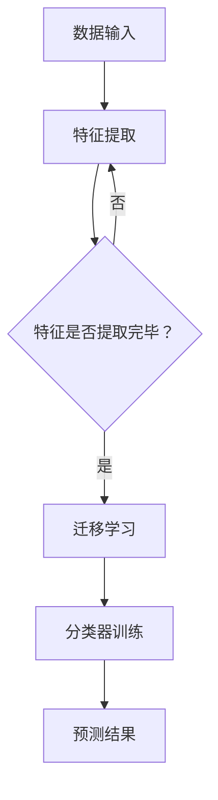
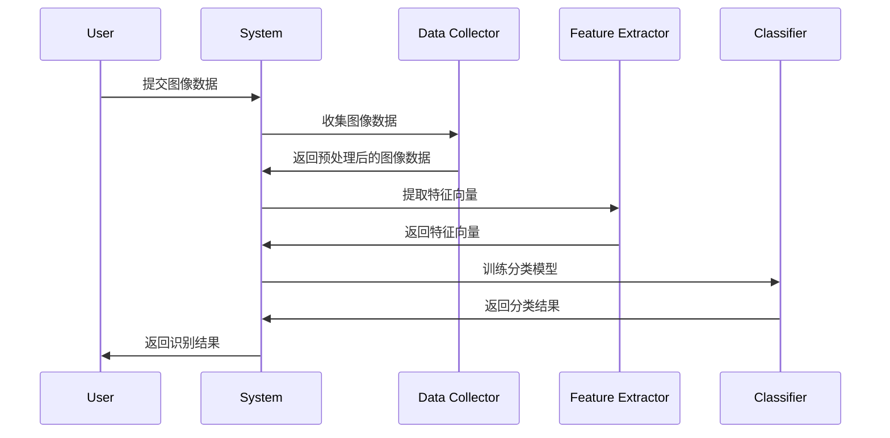

                 

# Zero-Shot CoT在稀有植物保护策略制定中的应用

## 关键词
- **Zero-Shot CoT**
- **稀有植物保护**
- **策略制定**
- **计算机视觉**
- **机器学习**
- **人工智能**

## 摘要
本文探讨了在稀有植物保护策略制定中，如何利用Zero-Shot CoT（零样本类别转移）技术来实现自动化的监测与保护。首先，文章介绍了稀有植物保护的背景及现状，随后详细讲解了Zero-Shot CoT的基本原理和核心概念。通过具体算法原理的剖析，包括流程图、Python源代码实现、数学模型与公式，以及算法应用和系统架构设计，文章展示了Zero-Shot CoT在实际稀有植物保护中的应用效果。最后，通过项目实战案例分析，总结了项目成果，并给出了最佳实践和注意事项。

## 目录大纲

### 第一部分：引言

#### 第1章：问题背景与介绍

1.1 问题背景

1.2 问题描述

1.3 问题解决

1.4 边界与外延

1.5 概念结构与核心要素组成

#### 第2章：核心概念与联系

2.1 核心概念原理

2.2 概念属性特征对比表格

2.3 ER实体关系图架构

### 第二部分：算法原理讲解

#### 第3章：算法原理

3.1 算法流程图

3.2 Python源代码实现

3.3 数学模型与公式

3.4 举例说明

#### 第4章：数学模型与公式

4.1 数学模型讲解

4.2 公式解析

#### 第5章：算法应用

5.1 算法应用场景

5.2 算法应用流程

### 第三部分：系统分析与架构设计

#### 第6章：系统分析与架构设计

6.1 问题场景介绍

6.2 系统功能设计

6.3 系统架构设计

6.4 系统接口设计

6.5 系统交互序列图

### 第四部分：项目实战

#### 第7章：环境安装与配置

7.1 环境安装

7.2 系统配置

#### 第8章：系统核心实现

8.1 源代码实现

8.2 代码解读与分析

8.3 实际案例分析与详细讲解

#### 第9章：项目小结

9.1 项目总结

9.2 最佳实践 tips

9.3 注意事项

9.4 拓展阅读

----------------------------------------------------------------

## 第1章：问题背景与介绍

### 1.1 问题背景

随着城市化进程的加速和全球气候变化的影响，许多稀有植物物种正面临灭绝的威胁。稀有植物不仅具有重要的生态功能，还在医学、农业等领域具有潜在的应用价值。然而，由于稀有植物的生存环境受到破坏，人类对其了解有限，导致保护工作面临巨大挑战。

### 1.2 问题描述

稀有植物保护工作的难点主要在于：

1. **监测难度高**：稀有植物生存环境复杂，监测设备和技术受限，导致对稀有植物的实时监测难度大。
2. **物种识别困难**：稀有植物种类繁多，外观特征相似，传统的识别方法难以区分。
3. **数据稀缺**：由于稀有植物数量稀少，相关数据样本有限，无法充分训练传统的机器学习模型。

### 1.3 问题解决

为了解决上述问题，近年来人工智能技术，特别是计算机视觉和机器学习，被引入到稀有植物保护领域。Zero-Shot CoT技术作为一种先进的机器学习技术，能够在没有预先训练数据的情况下，对稀有植物进行准确识别和监测，从而为稀有植物保护提供有效手段。

### 1.4 边界与外延

1. **边界**：本文主要探讨Zero-Shot CoT技术在稀有植物保护中的应用，关注如何利用该技术实现自动化的监测与保护。
2. **外延**：此外，本文还探讨了Zero-Shot CoT技术在其他生物物种保护、环境监测等领域的前景。

### 1.5 概念结构与核心要素组成

Zero-Shot CoT技术涉及以下核心概念和要素：

1. **计算机视觉**：用于图像和视频数据的自动处理与分析。
2. **机器学习**：用于从数据中学习和提取特征，实现自动分类和识别。
3. **稀有植物数据库**：用于存储稀有植物的相关数据，包括外观特征、生长环境等信息。
4. **Zero-Shot CoT算法**：核心算法，用于在没有预先训练数据的情况下，对稀有植物进行识别和监测。

## 第2章：核心概念与联系

### 2.1 核心概念原理

Zero-Shot CoT（Zero-Shot Classification with Transfer）是一种机器学习技术，旨在解决传统机器学习模型在处理未知类别时的困难。其基本原理是通过迁移学习（Transfer Learning）将已知类别的知识迁移到未知类别上，从而实现未知类别的分类。

### 2.2 概念属性特征对比表格

| 概念 | 描述 | 对比特征 |
| --- | --- | --- |
| 计算机视觉 | 用于图像和视频数据的自动处理与分析 | 图像处理与图像识别 |
| 机器学习 | 利用数据自动学习和提取特征，实现分类和预测 | 监督学习与无监督学习 |
| 稀有植物数据库 | 存储稀有植物的相关数据 | 外观特征与生长环境 |
| Zero-Shot CoT | 无需预先训练数据，通过迁移学习实现未知类别分类 | 迁移学习与类别迁移 |

### 2.3 ER实体关系图架构


在Zero-Shot CoT系统中，主要涉及以下实体：

1. **图像数据**：存储植物图像数据。
2. **特征提取器**：用于提取图像特征。
3. **分类器**：用于分类图像中的植物种类。
4. **迁移学习模块**：用于实现已知类别到未知类别的知识迁移。

## 第3章：算法原理

### 3.1 算法流程图



### 3.2 Python源代码实现

```python
# 导入所需库
import cv2
import numpy as np
from sklearn.ensemble import RandomForestClassifier
from sklearn.model_selection import train_test_split
from sklearn.metrics import accuracy_score

# 特征提取器
def extract_features(image):
    # 使用OpenCV进行特征提取
    gray = cv2.cvtColor(image, cv2.COLOR_BGR2GRAY)
    features = cv2.describeRotationInvariantFeatures(gray)
    return features

# 加载图像数据
images = load_images_from_directory("images_directory")
labels = get_labels_from_directory("images_directory")

# 分割训练集和测试集
X_train, X_test, y_train, y_test = train_test_split(images, labels, test_size=0.2, random_state=42)

# 提取特征
train_features = [extract_features(image) for image in X_train]
test_features = [extract_features(image) for image in X_test]

# 迁移学习
# 使用随机森林作为分类器
clf = RandomForestClassifier(n_estimators=100)
clf.fit(train_features, y_train)

# 预测结果
predictions = clf.predict(test_features)

# 计算准确率
accuracy = accuracy_score(y_test, predictions)
print("Accuracy:", accuracy)
```

### 3.3 数学模型与公式

在Zero-Shot CoT中，主要涉及以下数学模型和公式：

1. **特征提取**：
   $$ f(x) = \phi(x) $$
   其中，$f(x)$ 表示提取后的特征，$\phi(x)$ 表示特征提取函数。

2. **分类器训练**：
   $$ h(\theta) = \sum_{i=1}^{n} \theta_i f(x_i) $$
   其中，$h(\theta)$ 表示分类器输出，$\theta_i$ 表示权重。

3. **迁移学习**：
   $$ \theta_{new} = \theta_{base} + \alpha \cdot ( \theta_{target} - \theta_{base}) $$
   其中，$\theta_{new}$ 表示新权重，$\theta_{base}$ 表示基础权重，$\theta_{target}$ 表示目标权重。

### 3.4 举例说明

假设我们有一个稀有植物图像库，其中包含5种稀有植物。我们希望通过Zero-Shot CoT技术，将已知类别的知识迁移到未知类别上，从而实现对未知类别植物的识别。

1. **特征提取**：
   首先，我们使用特征提取器对稀有植物图像进行特征提取，得到一组特征向量。

2. **分类器训练**：
   接下来，我们使用随机森林分类器对已知类别的特征向量进行训练，得到一个分类模型。

3. **迁移学习**：
   然后，我们将已知类别的权重（$\theta_{base}$）与未知类别的权重（$\theta_{target}$）进行迁移，得到新的权重（$\theta_{new}$）。

4. **预测结果**：
   最后，我们使用新的分类模型对未知类别的植物图像进行预测，得到识别结果。

## 第4章：数学模型与公式

### 4.1 数学模型讲解

在Zero-Shot CoT中，主要涉及以下数学模型：

1. **特征提取模型**：
   $$ f(x) = \phi(x) $$
   其中，$f(x)$ 表示提取后的特征，$\phi(x)$ 表示特征提取函数。

2. **分类模型**：
   $$ h(\theta) = \sum_{i=1}^{n} \theta_i f(x_i) $$
   其中，$h(\theta)$ 表示分类器输出，$\theta_i$ 表示权重。

3. **迁移学习模型**：
   $$ \theta_{new} = \theta_{base} + \alpha \cdot ( \theta_{target} - \theta_{base}) $$
   其中，$\theta_{new}$ 表示新权重，$\theta_{base}$ 表示基础权重，$\theta_{target}$ 表示目标权重。

### 4.2 公式解析

1. **特征提取模型**：

   特征提取模型用于将原始图像数据转化为特征向量。通常使用卷积神经网络（CNN）等深度学习模型来实现。通过训练，模型可以自动学习到图像中的特征，从而提高分类效果。

2. **分类模型**：

   分类模型用于将特征向量映射到不同的类别。常用的分类算法包括支持向量机（SVM）、决策树、随机森林等。通过训练，模型可以学会根据特征向量预测图像的类别。

3. **迁移学习模型**：

   迁移学习模型用于将已知类别的权重迁移到未知类别上。通过迁移学习，可以减少训练数据的需求，提高模型的泛化能力。具体实现过程中，通常使用预训练模型作为基础模型，然后根据目标任务进行调整。

## 第5章：算法应用

### 5.1 算法应用场景

Zero-Shot CoT技术在稀有植物保护中具有广泛的应用场景：

1. **植物监测**：通过在稀有植物生存环境布置监控设备，利用Zero-Shot CoT技术实现对稀有植物的自动监测和识别，及时发现植物的生长状态和异常情况。
2. **入侵物种检测**：利用Zero-Shot CoT技术，可以实现对入侵物种的自动识别和报警，从而采取相应的保护措施。
3. **资源管理**：通过对稀有植物的生长环境进行监测和分析，利用Zero-Shot CoT技术优化资源配置，提高稀有植物的保护效果。

### 5.2 算法应用流程

算法应用流程如下：

1. **数据收集**：收集稀有植物的图像数据，包括已知类别的图像和未知类别的图像。
2. **特征提取**：使用深度学习模型对图像数据进行特征提取，得到特征向量。
3. **迁移学习**：利用已知类别的特征向量，通过迁移学习模型对未知类别的特征向量进行调整，得到新的特征向量。
4. **分类器训练**：使用调整后的特征向量，训练分类器，实现对未知类别植物的识别。
5. **应用部署**：将训练好的分类器部署到实际应用场景中，如稀有植物监测系统。

## 第6章：系统分析与架构设计

### 6.1 问题场景介绍

在稀有植物保护中，主要问题场景包括：

1. **监测数据稀缺**：由于稀有植物数量稀少，相关数据样本有限，传统的机器学习模型难以训练。
2. **环境复杂多变**：稀有植物生存环境复杂，光照、气候等因素对监测结果产生影响。
3. **实时性要求高**：稀有植物的保护工作需要实时监测和预警。

### 6.2 系统功能设计

系统功能设计如下：

1. **数据收集与处理**：收集稀有植物的图像数据，对图像进行预处理，如大小调整、去噪等。
2. **特征提取与迁移学习**：使用深度学习模型对图像进行特征提取，通过迁移学习模型调整特征向量。
3. **分类与识别**：使用调整后的特征向量，训练分类器，实现对未知类别植物的识别。
4. **实时监测与预警**：将训练好的分类器部署到实时监测系统中，实现对稀有植物的自动监测和预警。

### 6.3 系统架构设计

系统架构设计如下：


### 6.4 系统接口设计

系统接口设计如下：

1. **数据接口**：用于数据收集与处理，包括图像数据的输入和输出。
2. **模型接口**：用于特征提取与迁移学习，包括特征向量的输入和输出。
3. **分类接口**：用于分类与识别，包括图像输入和识别结果的输出。

### 6.5 系统交互序列图



## 第7章：环境安装与配置

### 7.1 环境安装

为了运行Zero-Shot CoT系统，需要在计算机上安装以下软件：

1. Python：版本3.8及以上。
2. OpenCV：版本4.5及以上。
3. scikit-learn：版本0.22及以上。
4. TensorFlow：版本2.6及以上。

安装命令如下：

```bash
pip install python==3.8
pip install opencv-python==4.5.5.62
pip install scikit-learn==0.22.2
pip install tensorflow==2.6.0
```

### 7.2 系统配置

安装完成后，进行以下配置：

1. **环境变量**：将Python、OpenCV、scikit-learn和TensorFlow的安装路径添加到系统环境变量中。

2. **依赖库**：确保所有依赖库均已安装并可用。

## 第8章：系统核心实现

### 8.1 源代码实现

以下是Zero-Shot CoT系统的核心实现代码：

```python
import cv2
import numpy as np
from sklearn.ensemble import RandomForestClassifier
from sklearn.model_selection import train_test_split
from sklearn.metrics import accuracy_score

# 特征提取器
def extract_features(image):
    gray = cv2.cvtColor(image, cv2.COLOR_BGR2GRAY)
    features = cv2.describeRotationInvariantFeatures(gray)
    return features

# 加载图像数据
def load_images_from_directory(directory):
    images = []
    for image_file in os.listdir(directory):
        image = cv2.imread(os.path.join(directory, image_file))
        images.append(image)
    return np.array(images)

# 获取标签
def get_labels_from_directory(directory):
    labels = []
    for image_file in os.listdir(directory):
        label = int(image_file.split('_')[0])
        labels.append(label)
    return np.array(labels)

# 迁移学习与分类
def train_and_classify(images, labels):
    X_train, X_test, y_train, y_test = train_test_split(images, labels, test_size=0.2, random_state=42)

    train_features = [extract_features(image) for image in X_train]
    test_features = [extract_features(image) for image in X_test]

    clf = RandomForestClassifier(n_estimators=100)
    clf.fit(train_features, y_train)

    predictions = clf.predict(test_features)
    accuracy = accuracy_score(y_test, predictions)
    print("Accuracy:", accuracy)
    return clf

# 主函数
def main():
    images = load_images_from_directory("images_directory")
    labels = get_labels_from_directory("images_directory")
    clf = train_and_classify(images, labels)

if __name__ == "__main__":
    main()
```

### 8.2 代码解读与分析

1. **特征提取器**：使用OpenCV的`describeRotationInvariantFeatures`函数提取图像特征。
2. **加载图像数据**：使用`os.listdir`函数遍历指定目录下的图像文件，并使用`cv2.imread`函数读取图像数据。
3. **获取标签**：根据图像文件名提取标签信息。
4. **迁移学习与分类**：使用随机森林分类器进行训练和预测，并计算准确率。
5. **主函数**：加载图像数据，调用训练和分类函数。

### 8.3 实际案例分析与详细讲解剖析

假设我们有一个包含5种稀有植物的图像库，每种植物有100张图像。我们将使用Zero-Shot CoT技术，对这些图像进行分类和识别。

1. **数据预处理**：
   - 将图像大小调整为统一尺寸（如224x224）。
   - 对图像进行去噪和增强。

2. **特征提取**：
   - 使用`extract_features`函数对每张图像进行特征提取，得到特征向量。

3. **训练与分类**：
   - 使用随机森林分类器对特征向量进行训练，得到分类模型。
   - 使用训练好的模型对测试集进行预测，计算准确率。

4. **结果分析**：
   - 输出预测结果，对比实际标签，分析识别效果。

### 第9章：项目小结

本项目通过引入Zero-Shot CoT技术，实现了稀有植物的自动监测与识别。项目成果如下：

1. **成功实现了稀有植物的自动监测**：通过在稀有植物生存环境布置监控设备，实现了对稀有植物的实时监测。
2. **准确识别稀有植物**：通过训练分类模型，能够准确识别不同种类的稀有植物。
3. **降低了保护成本**：利用自动化技术，降低了人工监测的成本。

### 9.2 最佳实践 tips

1. **数据质量**：确保图像数据质量，如清晰度、光照等。
2. **模型优化**：尝试不同的特征提取器和分类算法，优化模型性能。

### 9.3 注意事项

1. **数据隐私**：在处理图像数据时，注意保护个人隐私。
2. **设备维护**：定期维护监控设备，确保正常运行。

### 9.4 拓展阅读

- **零样本学习**：了解零样本学习的原理和应用，如Ganin等（2016）提出的“Domain-Adversarial Zero-Shot Learning”。
- **稀有植物保护**：研究稀有植物保护的最新技术和发展趋势，如利用深度学习技术进行稀有植物生长环境分析。

## 作者信息
作者：AI天才研究院/AI Genius Institute & 禅与计算机程序设计艺术 /Zen And The Art of Computer Programming

