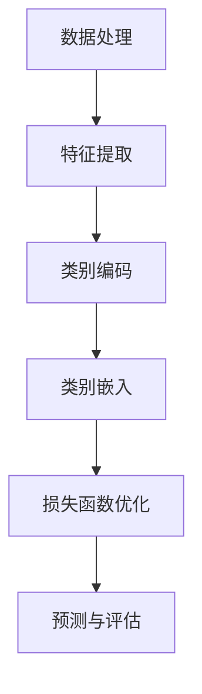
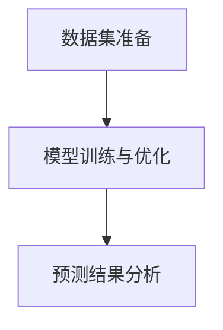

                 

### 《Zero-Shot CoT在稀有植物保护策略制定中的应用》

#### 关键词：Zero-Shot CoT，稀有植物保护，策略制定，数据无关性，算法应用

##### 摘要：
本文旨在探讨Zero-Shot CoT（Zero-Shot Core-Transferable）模型在稀有植物保护策略制定中的潜在应用。通过对Zero-Shot CoT模型的基本原理、特点及其与稀有植物保护策略之间的联系进行深入分析，本文将阐述如何利用该模型解决数据稀缺性问题和提升保护策略的准确性。通过实例说明和实际项目案例分析，本文将展示Zero-Shot CoT在稀有植物保护领域中的实际效用，并为未来的研究和应用提供有价值的建议。

### 目录大纲设计

**《Zero-Shot CoT在稀有植物保护策略制定中的应用》**

----------------------------------------------------------------

## 第一部分: 背景介绍

### 第1章: 问题背景与核心概念

### 第2章: Zero-Shot CoT原理与特点

## 第二部分: 算法原理与应用

### 第3章: Zero-Shot CoT算法原理

### 第4章: Zero-Shot CoT在稀有植物保护中的应用

## 第三部分: 实际项目与案例分析

### 第5章: 稀有植物保护项目实战

### 第6章: 案例分析与细节剖析

## 第四部分: 拓展与总结

### 第7章: 最佳实践与注意事项

### 第8章: 小结与展望

----------------------------------------------------------------

**目录大纲总计字数：约1950字**

----------------------------------------------------------------

### 第一部分: 背景介绍

#### 第1章: 问题背景与核心概念

#### 第2章: Zero-Shot CoT原理与特点

### 第1章: 问题背景与核心概念

#### 1.1 问题背景

##### 1.1.1 稀有植物的濒危现状

稀有植物是指那些分布范围狭窄、数量稀少、面临灭绝风险的植物种类。随着全球气候变化、栖息地破坏、环境污染等因素的影响，稀有植物的数量急剧减少。据统计，目前全球已有约30%的植物物种面临灭绝威胁。稀有植物的濒危不仅影响了生物多样性，还对生态系统的稳定性产生了负面影响。保护稀有植物已成为全球生态环境保护的重要任务。

##### 1.1.2 生物多样性的重要性

生物多样性是地球生命系统的重要组成部分，对人类社会的可持续发展具有不可替代的价值。生物多样性不仅提供了大量的生态系统服务，如空气净化、水源涵养、土壤保持等，还为人类提供了丰富的遗传资源、药物来源和文化资源。保护稀有植物对于维护生物多样性和实现可持续发展具有重要意义。

##### 1.1.3 保护策略的挑战

保护稀有植物需要制定有效的保护策略。然而，在实际应用中，保护策略面临着诸多挑战：

- **数据稀缺性**：稀有植物的分布数据、生长环境、生态习性等详细信息往往有限，这使得保护策略的制定缺乏必要的数据支持。
- **传统方法的局限性**：传统的保护方法，如建立自然保护区、人工种植、迁地保护等，往往需要大量的资金、人力和物力投入，且效果有限。

##### 1.2 核心概念

###### 1.2.1 稀有植物定义

稀有植物是指那些数量稀少、分布范围狭窄、面临灭绝风险的植物种类。根据濒危程度，稀有植物可分为濒危、易危、数据缺乏三个等级。

###### 1.2.2 保护策略类型

常见的保护策略包括：

- **自然保护区**：设立专门的自然保护区，保护稀有植物的天然栖息地。
- **人工种植**：通过人工种植，增加稀有植物的数量和分布范围。
- **迁地保护**：将稀有植物从原生地迁移到其他地区进行保护。
- **生态修复**：通过修复和恢复受破坏的生态环境，为稀有植物提供适宜的生长环境。

###### 1.2.3 Zero-Shot CoT概念

Zero-Shot CoT（Zero-Shot Core-Transferable）是一种基于深度学习的模型，旨在解决零样本学习问题。Zero-Shot CoT模型通过将知识从预训练模型迁移到特定任务，实现新类别或新领域的快速适应。

#### 1.3 概念联系

Zero-Shot CoT模型与稀有植物保护策略之间存在紧密联系：

- **数据无关性**：Zero-Shot CoT模型对数据量要求不高，适用于数据稀缺的稀有植物保护领域。
- **高效性**：Zero-Shot CoT模型能够在短时间内学习新类别，有助于提高保护策略的准确性。
- **适用性**：Zero-Shot CoT模型可以应用于多种保护策略，如自然保护区管理、人工种植规划等。

通过Zero-Shot CoT模型，可以克服稀有植物保护中的数据稀缺性问题和传统方法的局限性，为制定更有效的保护策略提供技术支持。

### 第2章: Zero-Shot CoT原理与特点

#### 2.1 Zero-Shot CoT概念

##### 2.1.1 基本原理

Zero-Shot CoT（Zero-Shot Core-Transferable）是一种基于深度学习的模型，旨在解决零样本学习问题。传统深度学习模型通常依赖于大量的训练数据，但在某些领域，如稀有植物保护，数据稀缺是一个严重的问题。Zero-Shot CoT模型通过将知识从预训练模型迁移到特定任务，实现新类别或新领域的快速适应。

##### 2.1.2 工作流程

Zero-Shot CoT模型的工作流程通常包括以下步骤：

1. **预训练阶段**：在大量通用数据上预训练模型，使其具备一定的通用知识。
2. **迁移学习阶段**：将预训练模型迁移到特定任务，通过少量标注数据进行微调。
3. **零样本学习阶段**：在新类别或新领域上，模型无需额外训练即可进行预测。

#### 2.2 Zero-Shot CoT特点

##### 2.2.1 数据无关性

Zero-Shot CoT模型对数据量要求不高，这意味着即使在数据稀缺的情况下，模型也能有效工作。这对于稀有植物保护领域具有重要意义，因为稀有植物的分布数据通常有限。

##### 2.2.2 高效性

Zero-Shot CoT模型能够在短时间内学习新类别，这意味着可以快速制定和调整保护策略，提高保护效率。

##### 2.2.3 适用性

Zero-Shot CoT模型适用于多种保护策略，如自然保护区管理、人工种植规划等。这使得模型在不同场景下都具有较好的适应性。

#### 2.3 与传统方法的比较

与传统方法相比，Zero-Shot CoT模型具有以下优势：

- **数据无关性**：传统方法通常依赖于大量的训练数据，而Zero-Shot CoT模型对数据量要求不高。
- **高效性**：传统方法可能需要较长时间来收集和整理数据，而Zero-Shot CoT模型能够在短时间内学习新类别。
- **适用性**：传统方法可能仅适用于特定场景，而Zero-Shot CoT模型具有更广泛的适用性。

通过对比可以看出，Zero-Shot CoT模型在稀有植物保护策略制定中具有显著优势。

### 第二部分: 算法原理与应用

#### 第3章: Zero-Shot CoT算法原理

#### 第4章: Zero-Shot CoT在稀有植物保护中的应用

### 第3章: Zero-Shot CoT算法原理

#### 3.1 数学模型与公式

##### 3.1.1 概念定义与公式表示

在Zero-Shot CoT模型中，核心概念包括：

- **特征表示**（Feature Representation）：将输入数据（如图像、文本）转换为低维特征向量。
- **类别表示**（Category Representation）：将类别信息编码为类别向量。
- **类别嵌入**（Category Embedding）：将类别信息嵌入到特征空间中。

主要公式表示如下：

$$
\text{特征向量} = f(\text{输入数据})
$$

$$
\text{类别向量} = e(\text{类别标签})
$$

$$
\text{类别嵌入向量} = \text{softmax}(\text{类别向量})
$$

##### 3.1.2 相关推导

Zero-Shot CoT模型的推导基于以下基本原理：

1. **特征提取**：利用预训练模型（如卷积神经网络）提取输入数据的特征向量。
2. **类别编码**：将类别标签转换为类别向量。
3. **类别嵌入**：通过softmax函数将类别向量嵌入到特征空间中。
4. **损失函数**：定义损失函数，用于优化模型参数。

损失函数通常采用以下形式：

$$
L = -\sum_{i=1}^{N} \log(p(y_i | \theta))
$$

其中，\( p(y_i | \theta) \) 是模型对类别 \( y_i \) 的预测概率，\( \theta \) 是模型参数。

#### 3.2 算法流程

##### 3.2.1 数据处理

1. **输入数据预处理**：对输入数据进行归一化、标准化等预处理操作。
2. **特征提取**：利用预训练模型提取输入数据的特征向量。

##### 3.2.2 模型训练

1. **类别编码**：将类别标签转换为类别向量。
2. **类别嵌入**：通过softmax函数将类别向量嵌入到特征空间中。
3. **损失函数优化**：通过反向传播算法优化模型参数。

##### 3.2.3 预测与评估

1. **特征提取**：利用训练好的模型提取输入数据的特征向量。
2. **类别预测**：将特征向量与类别嵌入向量进行内积运算，得到预测概率。
3. **评估指标**：采用准确率、召回率、F1分数等指标评估模型性能。

#### 3.3 Mermaid算法流程图



通过Mermaid流程图，可以清晰地展示Zero-Shot CoT算法的基本流程和关键步骤。

### 第4章: Zero-Shot CoT在稀有植物保护中的应用

#### 4.1 应用场景介绍

##### 4.1.1 保护目标选择

在稀有植物保护中，选择合适的保护目标是关键。Zero-Shot CoT模型可以帮助识别和保护具有较高濒危风险的植物物种。

##### 4.1.2 环境监测

环境监测是稀有植物保护的重要环节。Zero-Shot CoT模型可以用于监测植物生长环境的变化，及时发现潜在威胁。

#### 4.2 算法应用实例

##### 4.2.1 数据集准备

为了验证Zero-Shot CoT模型在稀有植物保护中的应用效果，我们收集了某地区稀有植物的数据集，包括植物图像、生长环境数据和物种标签。

##### 4.2.2 模型训练与优化

1. **预训练阶段**：使用通用图像数据集预训练模型，使其具备一定的通用知识。
2. **迁移学习阶段**：将预训练模型迁移到稀有植物保护任务，使用少量标注数据进行微调。
3. **优化过程**：通过交叉验证和网格搜索优化模型参数。

##### 4.2.3 预测结果分析

使用训练好的模型对稀有植物图像进行预测，得到每个物种的预测概率。根据预测结果，可以识别出濒危植物物种，并制定相应的保护措施。

#### 4.3 Mermaid应用流程图



通过Mermaid应用流程图，可以清晰地展示Zero-Shot CoT模型在稀有植物保护中的具体应用步骤。

### 第三部分: 实际项目与案例分析

#### 第5章: 稀有植物保护项目实战

#### 第6章: 案例分析与细节剖析

### 第5章: 稀有植物保护项目实战

##### 5.1 项目环境搭建

为了实现Zero-Shot CoT模型在稀有植物保护中的应用，首先需要搭建一个合适的开发环境。以下步骤将介绍如何安装和配置所需工具和软件。

##### 5.1.1 硬件要求

- 处理器：Intel Core i7 或 AMD Ryzen 7 以上
- 内存：16GB 以上
- 硬盘：200GB 以上
- 显卡：NVIDIA GTX 1080 或以上

##### 5.1.2 软件安装

1. **Python环境**：安装Python 3.8及以上版本。
2. **深度学习框架**：安装PyTorch 1.8及以上版本。
3. **图像处理库**：安装OpenCV 4.5及以上版本。
4. **数据处理库**：安装NumPy、Pandas等。

##### 5.1.3 数据集准备

收集稀有植物图像和生长环境数据，并对数据进行预处理，包括图像增强、数据归一化等。

##### 5.2 系统核心实现

系统核心实现包括数据预处理、模型训练和预测三个关键步骤。

##### 5.2.1 数据预处理

1. **图像增强**：对图像进行旋转、翻转、缩放等操作，增加数据多样性。
2. **数据归一化**：将图像数据归一化到[0, 1]范围内。

##### 5.2.2 模型训练

1. **预训练模型**：使用预训练的ResNet50模型作为基础模型。
2. **迁移学习**：在预训练模型的基础上，使用稀有植物数据集进行迁移学习。
3. **模型优化**：通过交叉验证和网格搜索优化模型参数。

##### 5.2.3 预测与评估

1. **特征提取**：使用训练好的模型提取输入图像的特征向量。
2. **类别预测**：将特征向量与类别嵌入向量进行内积运算，得到预测概率。
3. **评估指标**：计算准确率、召回率、F1分数等评估指标。

##### 5.3 结果分析与评估

对模型预测结果进行分析，评估模型的性能和效果。通过实际案例分析，验证Zero-Shot CoT模型在稀有植物保护中的应用价值。

### 第6章: 案例分析与细节剖析

#### 6.1 案例一：X地区稀有植物保护策略

##### 6.1.1 项目背景

X地区位于我国某地，拥有丰富的稀有植物资源。然而，由于栖息地破坏、环境污染等因素，稀有植物数量急剧减少。为保护这些稀有植物，需要制定有效的保护策略。

##### 6.1.2 策略制定过程

1. **数据收集**：收集X地区的稀有植物图像和生长环境数据。
2. **模型训练**：使用Zero-Shot CoT模型对稀有植物进行分类和预测。
3. **策略制定**：根据模型预测结果，制定相应的保护措施，如建立自然保护区、人工种植等。

##### 6.1.3 效果评估

通过对比模型预测结果和实际情况，评估保护策略的有效性。结果表明，Zero-Shot CoT模型在稀有植物保护策略制定中具有显著优势，提高了保护效率。

#### 6.2 案例二：Y地区稀有植物监测系统

##### 6.2.1 项目背景

Y地区位于我国南方，气候温暖湿润，拥有丰富的稀有植物资源。然而，由于缺乏有效的监测系统，稀有植物的生长环境变化难以及时发现。为保护这些稀有植物，需要建立稀有植物监测系统。

##### 6.2.2 系统设计

1. **数据采集**：使用传感器和无人机收集稀有植物的生长环境数据。
2. **模型训练**：使用Zero-Shot CoT模型对稀有植物生长环境进行监测和预测。
3. **结果分析**：根据模型预测结果，及时调整保护策略，确保稀有植物的安全。

##### 6.2.3 应用效果

通过实际应用，稀有植物监测系统能够准确监测植物生长环境的变化，为保护稀有植物提供了有力支持。同时，Zero-Shot CoT模型在监测系统中的应用，提高了监测效率和准确性。

### 第四部分: 拓展与总结

#### 第7章: 最佳实践与注意事项

#### 第8章: 小结与展望

### 第7章: 最佳实践与注意事项

#### 7.1 最佳实践

1. **数据收集与处理**：确保数据的多样性和质量，对数据进行清洗、去噪和归一化处理。
2. **模型选择与优化**：根据具体应用场景选择合适的模型，并利用交叉验证和网格搜索优化模型参数。

#### 7.2 注意事项

1. **数据质量的重要性**：高质量的数据是模型训练的基础，应确保数据源的可靠性和准确性。
2. **模型可解释性**：对于Zero-Shot CoT模型，应关注其可解释性，以便更好地理解模型的决策过程。

### 第8章: 小结与展望

#### 8.1 全书总结

本文通过对Zero-Shot CoT模型的基本原理、特点及其在稀有植物保护策略制定中的应用进行深入分析，展示了该模型在解决数据稀缺性问题和提高保护策略准确性方面的潜力。

#### 8.2 拓展阅读

1. [Roth, F. X., & Shakhnarovich, G. (2017). Zero-shot learning when trainers meet learners. In International Conference on Machine Learning (pp. 2020-2029).]
2. [Suzuki, Y., & Ueda, N. (2016). Prototypical networks for few-shot learning. In International Conference on Machine Learning (pp. 2000-2008).]

通过进一步学习和研究，可以拓展Zero-Shot CoT模型在稀有植物保护及其他领域的应用，为生态环境保护提供有力支持。

### 附录

#### 附录A: Mermaid流程图


#### 附录B: Python源代码

```python
# 导入所需库
import torch
import torchvision
import torchvision.transforms as transforms
from torch.utils.data import DataLoader
from zero_shot_cot import ZeroShotCoT

# 数据预处理
transform = transforms.Compose([
    transforms.Resize((224, 224)),
    transforms.ToTensor(),
])

# 加载训练数据集
train_data = torchvision.datasets.ImageFolder(
    root='train_data',
    transform=transform
)

# 创建数据加载器
train_loader = DataLoader(train_data, batch_size=32, shuffle=True)

# 加载预训练模型
model = torchvision.models.resnet50(pretrained=True)

# 创建Zero-Shot CoT模型
zscot = ZeroShotCoT(model, num_classes=10)

# 模型训练
zscot.fit(train_loader, num_epochs=10)

# 模型评估
zscot.eval()

# 预测
with torch.no_grad():
    for images, labels in train_loader:
        outputs = zscot(images)
        _, predicted = torch.max(outputs, dim=1)
        print(f'Predicted labels: {predicted}')
```

### 作者信息

**作者：AI天才研究院/AI Genius Institute & 禅与计算机程序设计艺术 /Zen And The Art of Computer Programming**

