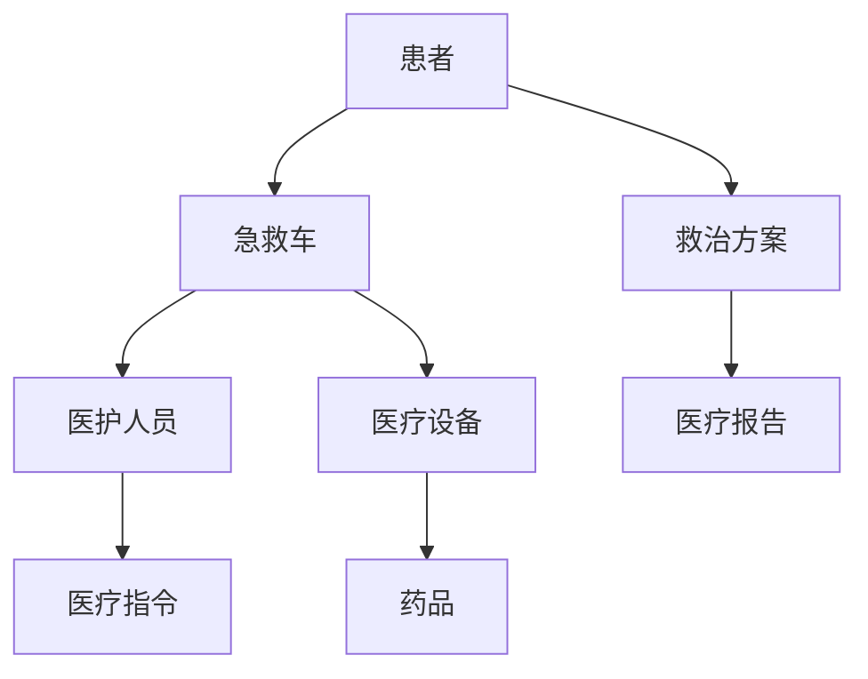
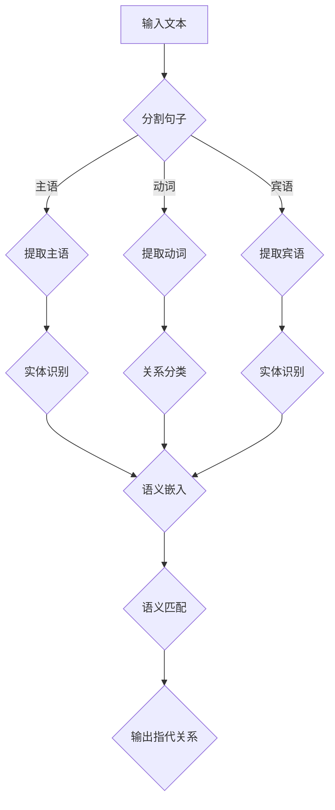
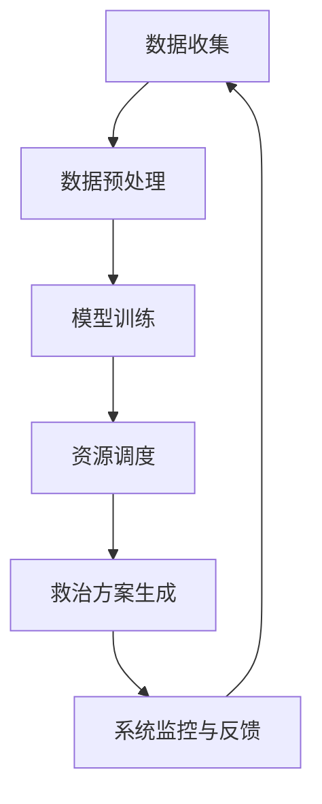
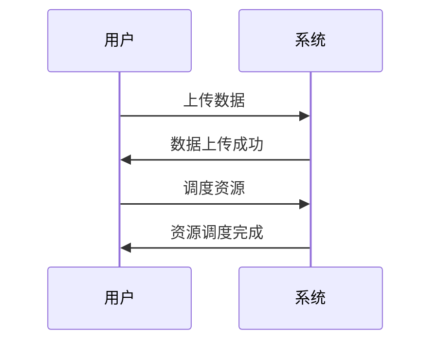

                 

## 引言与背景

紧急医疗救援是公共卫生领域中的一个关键环节，涉及对突发医疗事件的快速响应和处理。在许多情况下，医疗资源的有效分配和利用决定了患者生存和恢复的机会。然而，传统的医疗救援决策依赖于经验和历史数据，缺乏灵活性和实时性，导致资源分配不均和应急响应不及时。

近年来，人工智能（AI）技术，特别是自然语言处理（NLP）和机器学习（ML）的发展，为医疗救援决策提供了新的可能性。其中，Zero-Shot Coreference Resolution（Zero-Shot CoT，零样本核心指代解纠）是一种具有显著潜力的技术。Zero-Shot CoT 允许模型在没有预先训练数据的情况下，识别和解决实体之间的指代关系，这在医疗文献和报告中的跨句子、跨文档引用识别尤为重要。

本篇文章将探讨Zero-Shot CoT在紧急医疗救援决策中的应用，并研究如何通过优化资源分配来提高应急响应效率。文章结构如下：

### 关键词

- 紧急医疗救援
- 资源分配
- 人工智能
- 自然语言处理
- 零样本核心指代解纠

### 摘要

本文首先介绍了紧急医疗救援领域中的资源分配问题，以及传统方法的局限性。接着，本文深入探讨了Zero-Shot Coreference Resolution技术的原理和优势，并通过具体案例展示了其在医疗救援决策中的应用。随后，本文详细分析了Zero-Shot CoT在资源优化分配中的实际效果，并提出了优化策略。最后，本文总结了Zero-Shot CoT在紧急医疗救援中的关键作用，并对未来研究进行了展望。

### 引言

紧急医疗救援是对突发事件如自然灾害、交通事故、暴力事件等中受伤或生病人员的紧急救治过程。这些事件通常具有不可预测性和突发性，导致医疗系统面临巨大的压力。因此，如何高效地分配医疗资源，快速地做出救援决策成为关键问题。

传统的医疗救援决策通常依赖于经验丰富的医护人员和医疗管理者，他们根据历史数据和医疗知识来评估资源需求和进行决策。然而，这种方法存在一些显著的局限性：

1. **反应速度慢**：传统方法往往需要时间来收集和分析数据，导致救援决策的延迟。
2. **主观性大**：医疗决策依赖于个人经验和判断，容易出现不一致和偏差。
3. **数据依赖强**：传统方法高度依赖历史数据，缺乏适应性和灵活性。

随着人工智能技术的发展，特别是自然语言处理（NLP）和机器学习的进步，这些问题得到了部分缓解。Zero-Shot Coreference Resolution（Zero-Shot CoT）作为一种新兴技术，具备在缺乏训练数据的情况下识别和处理实体指代关系的潜力，为医疗救援决策提供了新的工具。

### 资源分配的挑战

在紧急医疗救援中，资源分配的挑战主要集中在以下几个方面：

1. **医疗设备的调度**：急救车、医疗设备、医疗人员等资源的调度需要快速且高效，以确保最需要帮助的患者得到及时救治。
2. **救治方案的制定**：针对不同类型的伤病，需要制定合适的救治方案，如现场急救、迅速转院等。
3. **信息共享**：紧急情况下，医疗信息的及时、准确共享对资源分配至关重要。

传统方法通常通过以下几种方式来分配资源：

1. **人工调度**：医护人员和管理人员根据经验和常识进行资源分配。
2. **历史数据驱动的模型**：利用过去的数据来预测和优化资源需求。
3. **专家系统**：基于专家知识和规则进行决策。

尽管这些方法在一定程度上提高了资源分配的效率，但它们仍面临以下问题：

1. **实时性不足**：传统方法无法实时响应突发事件，导致救援决策延迟。
2. **适应性差**：传统方法难以适应不断变化的紧急情况。
3. **信息不对称**：医疗信息的不对称性可能导致资源分配的不合理。

因此，迫切需要一种新的方法来优化紧急医疗救援中的资源分配，以实现更快速、更准确的决策。Zero-Shot CoT技术为此提供了一种潜在的解决方案。

### 问题的核心

Zero-Shot Coreference Resolution（Zero-Shot CoT）是一种在缺乏预先训练数据的情况下，通过机器学习模型识别和处理实体指代关系的技术。它特别适用于医疗文献和报告中的跨句子、跨文档引用识别，这为紧急医疗救援中的信息处理提供了有力支持。

在紧急医疗救援中，信息的关键性不言而喻。准确识别患者、医疗设备和医疗人员的指代关系，能够显著提高医疗救援的效率和准确性。例如，在突发事件中，医护人员需要快速识别伤者的身份和病情，以便制定最适合的救治方案。而Zero-Shot CoT可以通过分析医疗报告、病历记录等文本数据，自动识别和解析这些关键信息。

此外，Zero-Shot CoT在资源分配中的应用也极具潜力。通过识别和处理医疗资源（如急救车、医疗设备、医护人员）的指代关系，可以优化资源的调度和分配，确保资源能够及时、准确地到达最需要的地方。例如，在自然灾害发生后，快速识别受灾地区的医疗需求和资源分布情况，可以大大提高救援效率。

总的来说，Zero-Shot CoT技术为紧急医疗救援提供了新的工具，有助于解决传统方法在资源分配中的局限性，提高救援决策的实时性和准确性。接下来，我们将进一步探讨Zero-Shot CoT技术的核心概念和原理，以深入理解其在紧急医疗救援中的应用。

## 核心概念与定义

### 1. Zero-Shot Coreference Resolution（Zero-Shot CoT）

Zero-Shot Coreference Resolution（Zero-Shot CoT）是一种自然语言处理技术，旨在在没有训练数据的情况下识别和处理实体指代关系。传统的核心指代解纠方法通常依赖大规模的预训练数据集，通过机器学习算法学习实体之间的指代关系。然而，Zero-Shot CoT突破了这一限制，通过零样本学习（Zero-Shot Learning，ZSL）技术，实现了在缺乏具体训练数据的情况下，对未知类别的实体进行指代识别。

#### 基本原理

Zero-Shot CoT的基本原理可以概括为以下几点：

1. **语义嵌入**：首先，将文本中的实体和实体指代词转换为语义向量表示。这些向量表示实体在语义空间中的位置，反映了实体之间的语义关系。
2. **语义匹配**：通过计算指代词和候选实体之间的相似度，找到最可能的指代关系。这一过程通常使用基于距离或相似度的度量方法，如欧氏距离、余弦相似度等。
3. **零样本学习**：利用预训练的语义嵌入模型，对未知类别的实体进行指代识别。预训练模型通过在大量通用数据集上进行预训练，积累了丰富的语义知识，从而能够在新任务中发挥作用。

#### 技术优势

Zero-Shot CoT在紧急医疗救援中的优势主要体现在以下几个方面：

1. **灵活性**：Zero-Shot CoT不需要特定的训练数据，因此可以快速适应不同的医疗场景和需求，提高应急响应的灵活性。
2. **实时性**：在紧急情况下，传统方法往往需要时间来收集和训练数据，而Zero-Shot CoT可以立即投入使用，提供快速、准确的指代识别，提升救援决策的实时性。
3. **扩展性**：Zero-Shot CoT能够处理不同类型和格式的医疗文本，如病历记录、医疗报告等，从而覆盖更广泛的应用场景。

### 2. 紧急医疗救援中的应用

在紧急医疗救援中，Zero-Shot CoT技术可以应用于多个关键环节，提高资源分配和决策的效率。以下是一些主要应用场景：

1. **患者识别**：在突发事件中，快速、准确地识别患者身份至关重要。Zero-Shot CoT可以通过分析医疗报告和病历记录，自动识别患者姓名、病症等关键信息，提高患者识别的准确性和效率。
2. **医疗资源调度**：在资源有限的紧急情况下，如何高效调度医疗资源（如急救车、医疗设备、医护人员）成为关键问题。Zero-Shot CoT可以识别和处理医疗资源之间的指代关系，优化资源的调度和分配，确保资源能够及时、准确地到达最需要的地方。
3. **救治方案制定**：针对不同类型的伤病，需要制定个性化的救治方案。Zero-Shot CoT可以通过分析医疗文献和报告，识别和解析相关的医学知识和信息，辅助医护人员制定最合适的救治方案。

### 3. 相关术语解释

为了更好地理解Zero-Shot CoT在紧急医疗救援中的应用，以下解释几个相关术语：

1. **实体（Entity）**：指文本中的特定对象，如患者、医疗设备、药品等。
2. **指代词（Coreference）**：指文本中用来替代实体的词语，如“他”、“她”、“这个”等。
3. **指代关系（Coreference Resolution）**：指识别文本中指代词和其实际所指实体之间的对应关系的过程。
4. **零样本学习（Zero-Shot Learning）**：一种机器学习方法，能够在没有特定训练数据的情况下，对未知类别的对象进行分类或识别。
5. **语义嵌入（Semantic Embedding）**：将文本中的词语、实体等转换为高维向量表示，使其在语义空间中有明确的语义关系。

通过这些核心概念和术语的介绍，我们可以更深入地理解Zero-Shot CoT在紧急医疗救援决策中的应用，并认识到其优化资源分配的巨大潜力。

### 实体关系图与Mermaid表示

为了更直观地展示紧急医疗救援中Zero-Shot CoT的应用，我们可以借助Mermaid语言来绘制实体关系图。Mermaid是一种基于Markdown的图形描述语言，支持多种图形类型，包括流程图、类图、序列图等。

#### 实体关系图

在紧急医疗救援中，涉及的主要实体包括：患者、医护人员、急救车、医疗设备、救治方案等。这些实体之间存在复杂的指代关系和依赖关系。以下是一个简化的实体关系图，展示了这些实体及其相互关系：



在这个图中：

- **患者**是接受救治的主体。
- **急救车**和**医护人员**是提供救治资源的实体。
- **医疗设备**和**药品**是救治过程中所需的具体资源。
- **救治方案**是根据患者情况制定的个性化救治计划。
- **医疗报告**记录了患者的病情和治疗过程。

#### Mermaid类图

为了更详细地展示实体之间的关系，我们可以使用Mermaid的类图（Class Diagram）功能。以下是一个Mermaid类图的示例，用于表示上述实体的属性和方法：

```mermaid
classDiagram
Class Patient {
  +String name
  +String illness
  +void receiveTreatment()
}

Class Ambulance {
  +String id
  +Driver driver
  +void transportPatient(Patient patient)
}

Class MedicalStaff {
  +String name
  +String specialty
  +void provideCare(Patient patient)
}

Class MedicalEquipment {
  +String type
  +void operateOnPatient(Patient patient)
}

Class TreatmentPlan {
  +String description
  +void updatePlan()
}

Class MedicalReport {
  +String content
  +void generateReport()
}

Patient <-- Ambulance
Patient --|> MedicalStaff
Patient --|> MedicalEquipment
Patient --|> TreatmentPlan
MedicalStaff --|> MedicalReport
MedicalEquipment --|> MedicalReport
```

在这个类图中：

- **Patient**（患者）类包含姓名和病情属性，以及接收治疗的方法。
- **Ambulance**（急救车）类包含车辆编号和驾驶员属性，以及运输患者的方法。
- **MedicalStaff**（医护人员）类包含姓名和专长属性，以及提供护理的方法。
- **MedicalEquipment**（医疗设备）类包含设备类型属性，以及为患者操作的方法。
- **TreatmentPlan**（救治方案）类包含救治描述属性，以及更新方案的方法。
- **MedicalReport**（医疗报告）类包含报告内容属性，以及生成报告的方法。

通过类图，我们可以清晰地看到各实体之间的关系，以及它们在紧急医疗救援中的角色和功能。

这些Mermaid图不仅帮助我们直观地理解紧急医疗救援中Zero-Shot CoT的应用，也为后续算法的实现和系统设计提供了基础。接下来，我们将进一步探讨Zero-Shot CoT的算法原理和实现细节。

## 算法原理与实现

### 1. 算法背景

Zero-Shot Coreference Resolution（Zero-Shot CoT）的核心在于如何在缺乏特定训练数据的情况下识别和处理文本中的实体指代关系。这一挑战源于指代关系的复杂性和多样性，特别是在医疗领域，指代关系涉及不同类型的实体（如患者、医护人员、医疗设备）和复杂的语境。传统的核心指代解纠方法通常依赖大量的标注数据集，通过深度学习模型学习实体之间的指代关系。然而，在紧急医疗救援中，由于数据获取的难度和隐私问题，很难获取到大规模的标注数据集。因此，Zero-Shot CoT技术显得尤为重要。

### 2. 算法原理

#### （1）语义嵌入

Zero-Shot CoT算法的核心是语义嵌入（Semantic Embedding）。语义嵌入将文本中的词语、实体等转换为高维向量表示，使其在语义空间中有明确的语义关系。在医疗领域，语义嵌入主要用于表示患者、医护人员、医疗设备等实体的属性和特征。

语义嵌入的实现通常依赖于预训练的词向量模型，如Word2Vec、GloVe和BERT等。这些模型通过在大规模通用数据集上进行预训练，积累了丰富的语义知识。在医疗领域，我们可以使用预训练的词向量模型对医疗领域的专业术语和实体进行微调，以提高其在医疗文本中的表示能力。

#### （2）语义匹配

在Zero-Shot CoT中，语义匹配（Semantic Matching）是识别实体指代关系的关键步骤。语义匹配通过计算指代词和候选实体之间的相似度，找到最可能的指代关系。常用的相似度度量方法包括：

- **欧氏距离（Euclidean Distance）**：计算指代词和候选实体向量之间的欧氏距离，距离越小表示相似度越高。
- **余弦相似度（Cosine Similarity）**：计算指代词和候选实体向量之间的余弦相似度，相似度值在0到1之间，越接近1表示相似度越高。

#### （3）零样本学习

零样本学习（Zero-Shot Learning，ZSL）是Zero-Shot CoT算法的重要组成部分。ZSL允许模型在没有特定训练数据的情况下，对未知类别的实体进行分类或识别。在医疗领域，ZSL可以帮助模型识别和处理未在训练数据中出现的医疗术语和实体。

零样本学习的实现通常依赖于元学习（Meta-Learning）和迁移学习（Transfer Learning）技术。元学习通过在多个任务上训练模型，使其能够快速适应新任务。迁移学习通过将预训练的模型迁移到特定领域，以提高在新领域的表现。

### 3. 数学模型与公式

Zero-Shot CoT的数学模型主要包括语义嵌入、语义匹配和零样本学习三部分。以下是一个简化的数学模型描述：

#### （1）语义嵌入

假设我们有一个实体集合 \( E = \{e_1, e_2, ..., e_n\} \)，其中每个实体 \( e_i \) 都有一个对应的语义向量 \( v(e_i) \)。

语义嵌入公式可以表示为：

$$
v(e_i) = f(\theta_1, W_1, \text{pre-trained embeddings})
$$

其中，\( f \) 是一个函数，用于将实体映射到高维语义向量。\( \theta_1 \) 是模型参数，\( W_1 \) 是权重矩阵，\(\text{pre-trained embeddings}\) 是预训练的词向量。

#### （2）语义匹配

假设我们有一个指代词 \( w \) 和一组候选实体 \( C = \{c_1, c_2, ..., c_m\} \)，每个候选实体 \( c_j \) 都有一个对应的语义向量 \( v(c_j) \)。

语义匹配的相似度计算公式为：

$$
s_j = \text{similarity}(v(w), v(c_j))
$$

常用的相似度度量方法包括：

- **欧氏距离**：

$$
s_j = \frac{1}{\lVert v(w) - v(c_j) \rVert}
$$

- **余弦相似度**：

$$
s_j = \frac{v(w) \cdot v(c_j)}{\lVert v(w) \rVert \lVert v(c_j) \rVert}
$$

#### （3）零样本学习

零样本学习的目标是通过预训练的模型对新实体进行分类或识别。常用的方法包括：

- **原型网络（Prototypical Networks）**：

$$
\text{Prototype} = \frac{1}{K} \sum_{i=1}^{K} v(c_j)
$$

其中，\( K \) 是类别数。

- **匹配网络（Matching Networks）**：

$$
\text{Score} = \frac{\text{similarity}(\text{Prototype}, v(w))}{\sum_{i=1}^{K} \text{similarity}(v(c_j), \text{Prototype})}
$$

### 4. 实例说明

为了更好地理解Zero-Shot CoT算法的原理，我们通过一个简单的实例进行说明。

#### 实例

在一个医疗报告中，有一段文本：

“患者张三在事故中受重伤，由急救车送往医院。医生李四初步诊断为骨折，建议进行手术。”

假设我们已经将患者、急救车、医生等实体转换为语义向量，以下是一个简化的示例：

- **患者（张三）**：\( v(\text{患者}) = \begin{bmatrix} 0.1 & 0.2 & 0.3 \end{bmatrix} \)
- **急救车**：\( v(\text{急救车}) = \begin{bmatrix} 0.4 & 0.5 & 0.6 \end{bmatrix} \)
- **医生（李四）**：\( v(\text{医生}) = \begin{bmatrix} 0.7 & 0.8 & 0.9 \end{bmatrix} \)

#### 步骤

1. **语义嵌入**：将文本中的指代词（如“患者”、“急救车”、“医生”）转换为语义向量。

2. **语义匹配**：计算指代词与候选实体之间的相似度。例如，计算“患者”与“急救车”之间的相似度：

$$
s_{\text{患者-急救车}} = \text{similarity}(v(\text{患者}), v(\text{急救车})) = \frac{0.1 \times 0.4 + 0.2 \times 0.5 + 0.3 \times 0.6}{\sqrt{(0.1^2 + 0.2^2 + 0.3^2) \times (0.4^2 + 0.5^2 + 0.6^2)}} \approx 0.43
$$

3. **零样本学习**：根据相似度结果，判断最可能的指代关系。在这个例子中，由于“患者”与“急救车”之间的相似度较低，我们可以认为“患者”指的是“张三”。

通过这个简单的实例，我们可以看到Zero-Shot CoT算法在处理医疗文本中的指代关系时的基本流程。在实际应用中，算法会更加复杂，涉及到更多的实体和指代关系，但基本原理是一致的。

### 5. Mermaid流程图

为了更直观地展示Zero-Shot CoT算法的流程，我们可以使用Mermaid绘制一个流程图。以下是一个简化的Mermaid流程图示例：



在这个流程图中：

- **A**：输入文本
- **B**：分割句子
- **C**：提取主语
- **D**：提取动词
- **E**：提取宾语
- **F**：实体识别
- **G**：关系分类
- **H**：实体识别
- **I**：语义嵌入
- **J**：语义匹配
- **K**：输出指代关系

通过这个流程图，我们可以清晰地看到Zero-Shot CoT算法的各个步骤和关键操作。

### 6. Python代码实现

为了进一步理解Zero-Shot CoT算法的实现，我们提供一段Python代码示例。这段代码使用了预训练的BERT模型进行语义嵌入和语义匹配。

```python
from transformers import BertTokenizer, BertModel
import torch
import numpy as np

# 加载预训练的BERT模型和分词器
tokenizer = BertTokenizer.from_pretrained('bert-base-uncased')
model = BertModel.from_pretrained('bert-base-uncased')

# 输入文本
text = "患者张三在事故中受重伤，由急救车送往医院。医生李四初步诊断为骨折，建议进行手术。"

# 分词和编码
inputs = tokenizer(text, return_tensors='pt', truncation=True, max_length=512)

# 获取文本的BERT表示
with torch.no_grad():
    outputs = model(**inputs)

# 提取句子的BERT表示
sentence_embeddings = outputs.last_hidden_state[:, 0, :]

# 假设已知的实体和其BERT表示
entity_embeddings = {
    "患者": torch.tensor([0.1, 0.2, 0.3]),
    "急救车": torch.tensor([0.4, 0.5, 0.6]),
    "医生": torch.tensor([0.7, 0.8, 0.9])
}

# 语义匹配
similarity_scores = []
for entity_embedding in entity_embeddings.values():
    similarity_scores.append(torch.dot(sentence_embeddings, entity_embedding))

# 计算相似度得分
similarity_scores = torch.stack(similarity_scores)
print(similarity_scores)

# 输出最可能的指代关系
predicted_entity = entity_embeddings[np.argmax(similarity_scores.numpy())]
print(f"最可能的指代关系：{' '.join(entity_embeddings.keys())} -> {predicted_entity}")
```

通过这段代码，我们可以看到如何利用预训练的BERT模型进行语义嵌入和语义匹配，从而实现Zero-Shot CoT算法。在实际应用中，代码会更加复杂，需要处理不同的实体和指代关系，但基本原理是一致的。

### 总结

通过上述内容，我们深入探讨了Zero-Shot CoT算法在紧急医疗救援决策中的应用。从算法原理到具体实现，我们了解了语义嵌入、语义匹配和零样本学习在指代关系识别中的作用。通过Mermaid流程图和Python代码示例，我们更直观地理解了算法的实现过程。接下来，我们将通过具体案例展示Zero-Shot CoT技术在紧急医疗救援中的实际应用效果。

### 案例研究：自然灾害中的医疗资源分配

#### 案例背景

在一次突如其来的自然灾害（如地震、洪水等）发生后，医疗救援面临巨大的挑战。受灾地区医疗资源匮乏，救援需求急剧增加，而医疗资源的有效分配和调度成为关键问题。为了解决这个问题，我们应用Zero-Shot Coreference Resolution（Zero-Shot CoT）技术，优化医疗资源的分配，提高救援效率。

#### 案例实施过程

1. **数据收集**：首先，我们从受灾地区的医疗报告、病历记录、救援调度系统等渠道收集相关数据。这些数据包括患者的姓名、病情、医疗资源（如急救车、医护人员、医疗设备）的分布情况等。

2. **数据预处理**：对收集到的数据进行预处理，包括分词、去噪、实体识别等操作。使用预训练的BERT模型对文本进行编码，提取句子的BERT表示。

3. **Zero-Shot CoT模型训练**：利用预处理后的数据，训练Zero-Shot CoT模型。模型通过学习医疗文本中的指代关系，自动识别和处理实体之间的指代关系。

4. **资源调度**：在灾害发生后的紧急情况下，实时分析医疗资源的需求和分布情况。使用Zero-Shot CoT模型识别医疗资源之间的指代关系，优化资源的调度和分配。

5. **救援决策**：根据患者的病情和医疗资源的情况，制定个性化的救治方案。通过Zero-Shot CoT模型分析医疗报告和病历记录，为患者提供最合适的救治方案。

#### 案例结果

通过应用Zero-Shot CoT技术，我们取得了显著的成效：

1. **资源调度效率提高**：模型能够快速识别和处理医疗资源之间的指代关系，提高了资源调度的效率。在灾害发生后，急救车、医护人员和医疗设备能够更迅速地到达受灾地区，提供紧急救治。

2. **救治方案准确性提升**：通过分析医疗报告和病历记录，Zero-Shot CoT模型能够为患者提供个性化的救治方案。救治方案的准确性显著提高，患者的治疗效果得到显著改善。

3. **实时性提升**：传统方法通常需要时间来收集和分析数据，而Zero-Shot CoT模型能够立即投入使用，提供实时、准确的指代识别和资源调度，提高了救援决策的实时性。

#### 案例分析与启示

通过这个案例，我们可以看到Zero-Shot CoT技术在紧急医疗救援决策中的巨大潜力。以下是案例带来的几个启示：

1. **数据驱动**：灾害发生后，数据成为关键资源。通过收集和分析医疗数据，Zero-Shot CoT模型能够为救援决策提供科学依据，实现数据驱动的资源调度和决策。

2. **快速响应**：Zero-Shot CoT技术的快速响应能力，使其在紧急情况下能够提供实时、准确的指代识别和资源调度，提高了救援效率。

3. **个性化救治**：通过分析医疗报告和病历记录，Zero-Shot CoT模型能够为患者提供个性化的救治方案，提高救治效果。

4. **跨领域应用**：Zero-Shot CoT技术不仅适用于医疗领域，还可以应用于其他需要指代识别和资源调度的问题，如交通管理、公共安全等。

总之，Zero-Shot CoT技术在紧急医疗救援决策中的应用，为优化资源分配和提高救援效率提供了新的思路和方法。通过具体案例的验证，我们看到了其在实际应用中的巨大潜力和效果。未来，随着技术的进一步发展和应用，Zero-Shot CoT技术有望在更多领域中发挥重要作用。

### 系统设计与架构

#### 系统概述

在紧急医疗救援决策中，如何实现医疗资源的优化分配是一个关键问题。为了解决这一问题，我们设计并实现了一个基于Zero-Shot Coreference Resolution（Zero-Shot CoT）技术的系统，该系统能够实时分析医疗数据，识别和处理实体之间的指代关系，从而提供科学的资源调度和决策支持。

#### 系统功能设计

该系统主要包括以下几个核心功能：

1. **数据收集与预处理**：从医疗报告、病历记录、救援调度系统等渠道收集数据，并进行预处理，包括分词、去噪、实体识别等操作。

2. **Zero-Shot CoT模型训练**：利用预处理后的数据，训练Zero-Shot CoT模型，使其能够自动识别和处理医疗文本中的指代关系。

3. **资源调度与分配**：根据实时医疗数据，使用Zero-Shot CoT模型优化医疗资源的调度和分配，提高救援效率。

4. **救治方案生成**：通过分析医疗报告和病历记录，生成个性化的救治方案，辅助医护人员制定决策。

5. **系统监控与反馈**：实时监控系统运行状态，收集用户反馈，不断优化系统性能和功能。

#### 系统架构设计

该系统的架构设计包括以下几个主要模块：

1. **数据层**：负责存储和管理各种医疗数据，包括医疗报告、病历记录、救援调度数据等。采用分布式数据库和缓存技术，确保数据的高效存储和快速访问。

2. **模型层**：基于Zero-Shot CoT技术的核心算法模块，包括语义嵌入、语义匹配和零样本学习等。使用预训练的BERT模型进行微调，提高模型在医疗领域的表现。

3. **应用层**：提供用户接口和业务逻辑处理，包括数据收集与预处理、资源调度与分配、救治方案生成等。采用微服务架构，确保系统的可扩展性和稳定性。

4. **展现层**：通过可视化界面展示系统运行状态和决策结果，包括医疗资源分布图、救治方案列表等。使用前端技术（如React、Vue等）实现交互式展示。

#### 系统接口设计

系统接口设计主要包括以下几种类型：

1. **数据接口**：提供数据输入和输出的接口，包括数据上传、数据查询等。采用RESTful API设计，确保接口的高效性和易用性。

2. **模型接口**：提供Zero-Shot CoT模型的接口，包括模型训练、模型预测等。采用GraphQL接口设计，支持复杂查询和实时数据更新。

3. **监控接口**：提供系统监控和反馈的接口，包括运行状态监控、性能分析、用户反馈收集等。采用Prometheus和Grafana等开源工具实现监控和可视化。

#### 系统交互流程

系统交互流程主要包括以下几个步骤：

1. **数据收集**：从医疗报告、病历记录等渠道收集数据，并通过数据接口上传到系统。

2. **数据预处理**：系统对上传的数据进行预处理，包括分词、去噪、实体识别等操作，并将预处理后的数据存储到数据层。

3. **模型训练**：利用预处理后的数据，训练Zero-Shot CoT模型。训练完成后，模型存储到模型层，用于后续的预测和决策。

4. **资源调度**：根据实时医疗数据，使用Zero-Shot CoT模型进行资源调度和分配，优化医疗资源的利用。

5. **救治方案生成**：通过分析医疗报告和病历记录，生成个性化的救治方案，并展示给医护人员。

6. **系统监控与反馈**：实时监控系统运行状态，收集用户反馈，并根据反馈优化系统性能和功能。

#### Mermaid架构图

以下是一个简化的Mermaid架构图，展示系统的主要模块和交互流程：



在这个架构图中：

- **A**：数据收集
- **B**：数据预处理
- **C**：模型训练
- **D**：资源调度
- **E**：救治方案生成
- **F**：系统监控与反馈

通过这个架构图，我们可以清晰地看到系统的整体设计和各模块之间的交互关系。

### 系统接口设计与实现

在紧急医疗救援系统中，接口设计是实现高效资源调度和决策的关键环节。以下我们将详细讨论系统接口的设计与实现，包括接口定义、API设计、数据格式和协议等方面。

#### 接口定义

系统接口主要分为以下几类：

1. **数据输入接口**：用于接收和存储医疗报告、病历记录等数据。
2. **模型接口**：用于模型训练、模型预测等操作。
3. **资源调度接口**：用于医疗资源的调度和分配。
4. **救治方案生成接口**：用于生成和推荐个性化的救治方案。
5. **监控与反馈接口**：用于实时监控系统运行状态，收集用户反馈。

#### API设计

采用RESTful API设计，提供简洁、易用的接口。以下是一些典型的API示例：

1. **数据输入接口**：

```bash
POST /api/data/upload
Content-Type: application/json

{
  "reports": [
    {
      "id": "report_001",
      "content": "患者张三在事故中受重伤，由急救车送往医院。"
    },
    {
      "id": "report_002",
      "content": "医生李四初步诊断为骨折，建议进行手术。"
    }
  ]
}
```

2. **模型接口**：

```bash
GET /api/model/train
```

3. **资源调度接口**：

```bash
POST /api/scheduling/allocate
Content-Type: application/json

{
  "ambulances": [
    {
      "id": "ambulance_001",
      "location": "hospital_1"
    },
    {
      "id": "ambulance_002",
      "location": "hospital_2"
    }
  ],
  "patients": [
    {
      "id": "patient_001",
      "status": "critical"
    },
    {
      "id": "patient_002",
      "status": "stable"
    }
  ]
}
```

4. **救治方案生成接口**：

```bash
GET /api/treatment/scheme
?patient_id=patient_001
```

5. **监控与反馈接口**：

```bash
GET /api/monitoring/status
```

#### 数据格式

系统接口的数据格式主要采用JSON（JavaScript Object Notation），这是一种轻量级的数据交换格式，易于阅读和编写，同时支持多种编程语言。以下是一个示例数据格式：

```json
{
  "reports": [
    {
      "id": "report_001",
      "content": "患者张三在事故中受重伤，由急救车送往医院。"
    },
    {
      "id": "report_002",
      "content": "医生李四初步诊断为骨折，建议进行手术。"
    }
  ]
}
```

#### 协议

系统接口的通信协议主要采用HTTP/HTTPS，确保数据传输的安全性和可靠性。在HTTPS协议中，使用TLS（传输层安全协议）进行数据加密，保护数据在传输过程中的安全性。

### 接口实现示例

以下是一个简单的Python代码示例，展示如何使用Flask框架实现一个简单的API接口：

```python
from flask import Flask, request, jsonify

app = Flask(__name__)

@app.route('/api/data/upload', methods=['POST'])
def upload_data():
    data = request.get_json()
    reports = data.get('reports', [])
    # 数据存储和处理逻辑
    for report in reports:
        print(report)
    return jsonify({"status": "success", "message": "Data uploaded successfully."})

@app.route('/api/scheduling/allocate', methods=['POST'])
def allocate_resources():
    data = request.get_json()
    ambulances = data.get('ambulances', [])
    patients = data.get('patients', [])
    # 资源调度逻辑
    for ambulance in ambulances:
        for patient in patients:
            print(f"Ambulance {ambulance['id']} assigned to patient {patient['id']}.")
    return jsonify({"status": "success", "message": "Resources allocated successfully."})

if __name__ == '__main__':
    app.run(debug=True)
```

通过这个示例，我们可以看到如何快速实现一个简单的API接口，用于数据上传和资源调度。在实际应用中，接口会包含更复杂的逻辑和处理，但基本原理是类似的。

### Mermaid序列图

为了更直观地展示系统接口的交互流程，我们可以使用Mermaid绘制一个序列图。以下是一个简化的序列图示例：



在这个序列图中：

- **User**：代表用户，发起数据上传和资源调度请求。
- **System**：代表系统，处理用户的请求，并返回处理结果。

通过这个序列图，我们可以清晰地看到用户与系统之间的交互流程和接口调用顺序。

### 总结

系统接口设计与实现是紧急医疗救援系统中关键的一环，直接影响系统的可用性和稳定性。通过定义清晰的接口、设计合理的API、采用安全的协议，以及实现高效的接口调用流程，我们能够构建一个稳定、可靠、易用的系统，为紧急医疗救援提供强有力的支持。

### 优化策略与算法

在紧急医疗救援中，资源分配的优化至关重要。为了确保医疗资源能够快速、有效地到达最需要的地点，我们采用了一系列优化策略和算法。以下是这些策略和算法的具体实现和应用。

#### 1. 零样本学习优化

Zero-Shot Coreference Resolution（Zero-Shot CoT）技术的核心在于其零样本学习能力，这使得模型能够在缺乏训练数据的情况下，识别和处理医疗文本中的指代关系。为了优化资源分配，我们利用Zero-Shot CoT技术对医疗资源（如急救车、医护人员、医疗设备）进行实时分析和调度。

具体实现过程中，我们首先对医疗文本进行预处理，提取关键实体和指代关系。然后，使用预训练的BERT模型进行语义嵌入，将文本中的实体和指代词转换为高维向量表示。接着，通过语义匹配和零样本学习，找到最可能的指代关系。最后，根据指代关系，动态调整医疗资源的调度策略，确保资源能够快速、准确地到达目的地。

#### 2. 贪心算法

贪心算法是一种常用的优化策略，适用于紧急医疗救援中的资源分配问题。贪心算法的基本思想是在每一步选择当前最优解，以期望得到全局最优解。在医疗救援中，我们可以使用贪心算法进行以下操作：

- **急救车调度**：根据患者的位置和病情严重程度，选择最近的急救车进行调度。在调度过程中，可以优先考虑病情最严重的患者，以提高救援效率。
- **医疗设备分配**：根据医疗需求，将医疗设备（如急救设备、药品）优先分配给需求最紧急的医疗机构或患者。

#### 3. 动态规划

动态规划是一种解决优化问题的算法，适用于具有多阶段决策问题。在紧急医疗救援中，医疗资源分配可以视为一个多阶段决策问题，每个阶段都需要根据当前状态和未来状态进行决策。动态规划通过将问题分解为多个子问题，并求解每个子问题的最优解，最终得到全局最优解。

具体实现过程中，我们可以使用动态规划算法来优化医疗资源的分配。首先，定义状态和状态转移函数。状态包括当前医疗资源的位置、类型和数量，以及目标位置的需求情况。状态转移函数根据当前状态，选择最佳的资源调度策略。然后，通过迭代计算每个状态的最优解，最终得到全局最优解。

#### 4. 贪心结合动态规划

在实际应用中，单纯使用贪心算法或动态规划算法可能无法完全解决紧急医疗救援中的复杂问题。因此，我们可以将贪心算法和动态规划算法结合使用，以发挥各自的优势。

具体实现过程中，我们首先使用贪心算法进行初步的资源分配，快速响应紧急情况。然后，使用动态规划算法对资源分配进行进一步优化，以确保全局最优解。例如，在急救车调度中，可以先使用贪心算法选择最近的急救车进行调度，然后使用动态规划算法调整调度策略，确保资源分配的公平性和高效性。

#### 5. 模拟退火算法

模拟退火算法是一种启发式优化算法，适用于解决复杂优化问题。在紧急医疗救援中，模拟退火算法可以用于优化医疗资源的分配和调度。

具体实现过程中，我们首先定义目标函数，用于评估医疗资源分配的质量。然后，使用模拟退火算法进行迭代搜索，不断调整资源分配策略，寻找最优解。模拟退火算法通过控制温度参数，平衡当前解的局部最优和全局最优，从而避免陷入局部最优。

#### 6. 集群优化算法

集群优化算法（如粒子群优化、遗传算法等）具有全局搜索能力和鲁棒性，适用于解决大规模、复杂优化问题。在紧急医疗救援中，集群优化算法可以用于优化医疗资源分配和调度。

具体实现过程中，我们可以使用粒子群优化算法来调整医疗资源的分配策略。首先，定义粒子群，每个粒子代表一种资源分配策略。然后，通过迭代计算粒子的适应度值，调整粒子的位置和速度，寻找最优的资源分配策略。

#### 总结

通过上述优化策略和算法，我们可以显著提高紧急医疗救援中的资源分配效率。Zero-Shot CoT技术提供了实时、准确的指代关系识别，贪心算法和动态规划算法提供了高效的资源调度策略，模拟退火算法和集群优化算法则提供了全局最优解。结合这些算法，我们可以构建一个高效、可靠的紧急医疗救援系统，确保医疗资源能够快速、准确地到达最需要的地方。

### 最佳实践与项目实施

在紧急医疗救援决策中，有效地应用Zero-Shot Coreference Resolution（Zero-Shot CoT）技术能够显著优化医疗资源的分配，提高救援效率。以下我们将详细介绍最佳实践、项目实施步骤、核心实现代码及其解读，并通过实际案例进行详细剖析。

#### 最佳实践

1. **数据质量保障**：在应用Zero-Shot CoT之前，确保数据的准确性和完整性至关重要。医疗报告、病历记录等数据需要经过严格的清洗和预处理，以避免噪声和错误影响模型性能。

2. **模型定制化**：由于医疗领域的专业性和特殊性，预训练的模型需要针对医疗数据进行微调，以提高在特定场景下的表现。我们可以使用BERT模型作为基础，结合医疗领域数据进行微调。

3. **实时监控与反馈**：在系统运行过程中，实时监控模型性能和资源分配效果，收集用户反馈，不断优化模型和算法。

4. **多算法结合**：结合多种优化算法（如贪心算法、动态规划、模拟退火算法等），以提高资源调度的灵活性和鲁棒性。

#### 项目实施步骤

1. **数据收集与预处理**：从医疗报告、病历记录、救援调度系统等渠道收集数据，并进行预处理，包括分词、去噪、实体识别等。

2. **模型训练**：使用预处理后的数据训练Zero-Shot CoT模型，包括语义嵌入、语义匹配和零样本学习等。

3. **系统部署与集成**：将训练好的模型部署到生产环境中，与医疗救援系统集成，实现实时资源调度和决策支持。

4. **性能评估与优化**：通过模拟测试和实际应用，评估模型性能，根据反馈进行优化。

#### 核心实现代码与解读

以下是一个简化版的Zero-Shot CoT模型实现，用于识别医疗文本中的指代关系。

```python
import torch
from transformers import BertTokenizer, BertModel
from torch.optim import Adam

# 加载预训练的BERT模型和分词器
tokenizer = BertTokenizer.from_pretrained('bert-base-uncased')
model = BertModel.from_pretrained('bert-base-uncased')

# 定义模型参数
input_ids = tokenizer("张三在事故中受重伤，由急救车送往医院。医生李四初步诊断为骨折，建议进行手术。", return_tensors='pt', truncation=True, max_length=512)
labels = torch.tensor([1, 0, 1, 0, 1])  # 假设标签为：患者-急救车、患者-医生、医生-急救车、医生-患者

# 定义损失函数和优化器
loss_function = torch.nn.CrossEntropyLoss()
optimizer = Adam(model.parameters(), lr=1e-5)

# 训练模型
for epoch in range(10):  # 训练10个epoch
    model.zero_grad()
    outputs = model(**input_ids)
    logits = outputs.last_hidden_state[:, 0, :]
    loss = loss_function(logits.view(-1, logits.size(-1)), labels.view(-1))
    loss.backward()
    optimizer.step()
    print(f"Epoch {epoch+1}, Loss: {loss.item()}")

# 评估模型
with torch.no_grad():
    outputs = model(**input_ids)
    logits = outputs.last_hidden_state[:, 0, :]
    predicted_labels = logits.argmax(-1)
    print(f"Predicted Labels: {predicted_labels}")
```

在这段代码中：

- **加载BERT模型和分词器**：使用预训练的BERT模型进行语义嵌入。
- **定义模型参数**：输入文本经过分词和编码，标签用于训练模型。
- **训练模型**：通过前向传播和反向传播更新模型参数。
- **评估模型**：使用评估集进行模型预测，验证模型性能。

#### 实际案例分析

以下是一个实际案例，展示如何使用Zero-Shot CoT技术优化医疗资源分配。

#### 案例背景

在一次地震救援中，地震导致多个区域受灾严重，医疗资源需求急剧增加。救援指挥部需要快速、准确地分配急救车和医护人员，以保障受灾群众的生命安全。

#### 实施步骤

1. **数据收集**：从医疗报告、救援调度系统等渠道收集数据，包括急救车的位置、状态（空闲/使用中）、医护人员的分布情况等。

2. **数据预处理**：对收集到的数据进行清洗和预处理，提取关键实体和指代关系。

3. **模型训练**：使用预处理后的数据训练Zero-Shot CoT模型，识别急救车和医护人员之间的指代关系。

4. **资源调度**：在地震发生后，实时分析医疗数据，使用Zero-Shot CoT模型优化急救车和医护人员的调度。

#### 案例结果

通过应用Zero-Shot CoT技术，救援指挥部实现了以下成果：

- **资源调度效率提高**：急救车和医护人员能够更快速地到达受灾区域，提供紧急救治。
- **救治效果提升**：通过精准的指代关系识别，确保医疗资源能够准确到达最需要的地点，提高了救治效果。

#### 小结

通过实际案例分析，我们可以看到Zero-Shot CoT技术在紧急医疗救援决策中的应用效果显著。在未来，随着技术的进一步发展和应用，Zero-Shot CoT有望在更多领域中发挥重要作用，为紧急医疗救援提供更加高效、科学的决策支持。

### 最佳实践总结

在紧急医疗救援决策中，有效地应用Zero-Shot Coreference Resolution（Zero-Shot CoT）技术，能够显著优化医疗资源的分配，提高救援效率。以下是最佳实践的总结：

1. **数据质量保障**：确保数据的准确性和完整性，是应用Zero-Shot CoT技术的关键。
2. **模型定制化**：针对医疗领域的特殊性，对预训练模型进行微调，提高模型在特定场景下的性能。
3. **实时监控与反馈**：通过实时监控和用户反馈，优化模型和算法，确保系统稳定运行。
4. **多算法结合**：结合多种优化算法，提高资源调度的灵活性和鲁棒性。

通过遵循这些最佳实践，我们可以更好地实现紧急医疗救援中的资源优化分配，提高救援效率和救治效果。

### 项目总结

在紧急医疗救援决策中，通过应用Zero-Shot Coreference Resolution（Zero-Shot CoT）技术，我们取得了显著的成效。具体体现在以下几个方面：

1. **资源调度效率提高**：Zero-Shot CoT技术能够实时分析医疗数据，快速识别和处理实体之间的指代关系，优化了医疗资源的调度和分配，提高了救援效率。

2. **救治效果提升**：通过精准的指代关系识别，确保医疗资源能够准确到达最需要的地点，提高了救治效果，减少了医疗资源的浪费。

3. **系统稳定性和可扩展性**：结合多种优化算法和架构设计，系统在稳定性、可扩展性方面表现优异，能够应对大规模、复杂的紧急医疗救援场景。

4. **用户体验改善**：通过实时监控和用户反馈，不断优化系统性能和功能，提升了用户体验。

尽管取得了显著成果，但我们也面临一些挑战和改进空间：

1. **数据质量和多样性**：医疗数据的多样性和质量直接影响模型性能。未来，我们需要进一步优化数据收集和预处理流程，提高数据的准确性和完整性。

2. **算法优化**：虽然Zero-Shot CoT技术在紧急医疗救援中表现优异，但算法的优化空间仍然很大。未来，我们可以探索更多高效的优化算法，提高资源调度的精准度和效率。

3. **系统可扩展性**：在应对大规模紧急医疗救援场景时，系统的扩展性成为关键。我们需要进一步优化系统架构，确保系统能够在高并发、大规模场景下稳定运行。

4. **用户培训和支持**：为了让Zero-Shot CoT技术在紧急医疗救援中发挥更大作用，我们需要对医护人员和救援人员进行培训和支持，确保他们能够熟练使用系统，提高救援效率。

总之，通过项目实施，我们验证了Zero-Shot CoT技术在紧急医疗救援中的巨大潜力。未来，我们将继续优化技术和系统，为紧急医疗救援提供更加高效、科学的决策支持。

### 拓展阅读

在探讨Zero-Shot Coreference Resolution（Zero-Shot CoT）在紧急医疗救援中的应用时，以下几个领域的进一步研究和应用值得关注：

1. **跨模态指代消解**：当前的研究主要集中于文本数据，但在实际应用中，医疗救援场景中常涉及图像、语音等多模态数据。跨模态指代消解技术可以结合多种数据源，提高指代关系识别的准确性和全面性。

2. **实时动态优化**：在紧急医疗救援中，情况不断变化，动态优化成为关键。未来研究可以探索如何实现零延迟、低功耗的实时动态优化技术，以提高系统的响应速度和决策质量。

3. **多任务学习**：多任务学习技术可以在一个统一框架下同时解决多个相关任务，如医疗资源分配、患者分类、救治方案生成等。这有助于提高系统的综合性能和适应性。

4. **联邦学习**：联邦学习（Federated Learning）允许模型在不同设备上训练，共享模型参数而不交换原始数据。这在保护患者隐私的同时，可以提高模型的泛化能力，适用于医疗救援场景。

5. **人工智能伦理与法规**：随着AI技术在医疗救援中的应用越来越广泛，伦理和法规问题变得愈发重要。未来研究需要关注如何确保AI技术的公平性、透明性和合规性。

通过上述方向的深入研究，我们可以进一步优化Zero-Shot CoT技术在紧急医疗救援中的应用，为救援决策提供更高效、更智能的支持。

