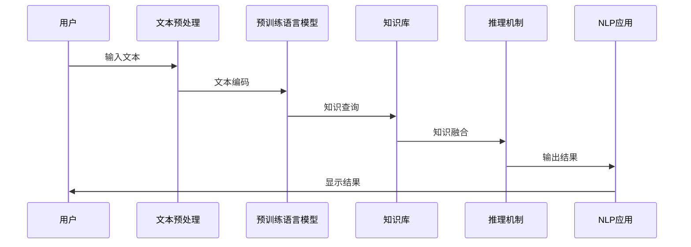

                 


# 第一部分：背景介绍

## 1.1 问题背景

随着互联网和大数据技术的快速发展，自然语言处理（NLP）领域面临新的挑战。传统的NLP方法通常需要大量有标签的数据进行训练，但是收集和标注高质量数据是一个耗时且昂贵的过程。此外，许多新的应用场景，如多语言处理、问答系统和对话生成等，对NLP模型提出了更高的要求。因此，研究人员开始探索一种新的方法，即Zero-Shot CoT（Zero-Shot Core-Task），旨在实现无需训练数据的跨领域、跨语言的NLP模型。

### 核心概念术语说明

**自然语言处理（NLP）**：自然语言处理是指让计算机理解和处理自然语言（如英语、中文等）的一系列技术和方法。

**有标签数据**：有标签数据是指已经经过标注处理的数据，每个数据样本都有相应的标签，如分类标签、情感标签等。

**跨领域、跨语言的NLP模型**：跨领域、跨语言的NLP模型是指能够处理不同领域和不同语言的NLP模型，而不需要为每个领域和语言单独训练模型。

### 问题背景

传统的NLP方法通常需要大量有标签的数据进行训练，这导致以下几个问题：

1. **数据收集困难**：收集大量高质量、有标签的数据需要耗费大量时间和人力。
2. **数据标注昂贵**：标注数据的成本很高，尤其是需要多人协作进行的复杂标注任务。
3. **模型泛化能力差**：传统模型在特定领域或语言上的表现较好，但在新的领域或语言上表现较差，缺乏泛化能力。

这些问题的出现，促使研究人员开始探索新的NLP方法，即Zero-Shot CoT（Zero-Shot Core-Task）。

### 零样本学习

零样本学习（Zero-Shot Learning，ZSL）是一种机器学习方法，它使得模型能够处理新的类别或任务，而不需要为这些新类别或任务提供任何有监督的训练数据。在NLP领域，Zero-Shot CoT借鉴了零样本学习的思想，旨在实现无需训练数据的跨领域、跨语言的NLP模型。

### 零样本学习的挑战

零样本学习的挑战在于：

1. **类标签不足**：零样本学习需要在缺乏类标签的情况下进行推理，这增加了模型的难度。
2. **样本分布不均**：在零样本学习中，新类别或任务的样本通常较少，这可能导致模型在新类别或任务上的性能下降。
3. **迁移学习不足**：零样本学习需要将已有知识迁移到新类别或任务上，这需要有效的知识表示和迁移策略。

为了解决这些挑战，Zero-Shot CoT引入了预训练语言模型、知识库和推理机制。

### 预训练语言模型

预训练语言模型（如BERT）在大规模无标签数据上进行了预训练，能够提取文本中的通用知识表示。这些模型在自然语言理解和生成任务上表现出色，为Zero-Shot CoT提供了基础。

### 知识库

知识库（如维基百科、知识图谱等）为模型提供了丰富的通用知识，有助于模型在新领域中进行推理和决策。

### 推理机制

推理机制（如图神经网络）用于处理跨领域的信息，帮助模型从通用知识中提取相关信息。

### 总结

总之，随着互联网和大数据技术的快速发展，传统的NLP方法面临新的挑战。Zero-Shot CoT旨在实现无需训练数据的跨领域、跨语言的NLP模型，通过引入预训练语言模型、知识库和推理机制，解决零样本学习中的挑战。

## 1.2 问题描述

Zero-Shot CoT（Zero-Shot Core-Task）的核心问题是：如何在没有特定领域训练数据的情况下，使NLP模型能够处理新的领域和任务。这意味着模型需要能够从通用知识中提取信息，并在新领域中进行推理和决策。

### 零样本学习的核心问题

Zero-Shot CoT借鉴了零样本学习（Zero-Shot Learning，ZSL）的核心问题，即如何在缺乏类标签和样本的情况下进行推理。零样本学习的核心问题可以概括为：

1. **类标签不足**：零样本学习需要在缺乏类标签的情况下进行推理，这增加了模型的难度。
2. **样本分布不均**：在零样本学习中，新类别或任务的样本通常较少，这可能导致模型在新类别或任务上的性能下降。
3. **迁移学习不足**：零样本学习需要将已有知识迁移到新类别或任务上，这需要有效的知识表示和迁移策略。

### 零样本学习与Zero-Shot CoT的区别

虽然Zero-Shot CoT借鉴了零样本学习（ZSL）的核心问题，但二者之间仍存在一些区别：

1. **任务目标**：零样本学习通常关注图像分类、物体识别等视觉任务，而Zero-Shot CoT则关注自然语言处理（NLP）任务，如文本分类、情感分析等。
2. **数据来源**：零样本学习的数据主要来源于训练数据和查询数据，而Zero-Shot CoT的数据主要来源于预训练语言模型和知识库。
3. **推理机制**：零样本学习通常依赖于模型自身的特征表示和迁移学习策略，而Zero-Shot CoT则依赖于推理机制（如图神经网络）和通用知识表示。

### 零样本学习的挑战与应对策略

为了解决零样本学习中的挑战，Zero-Shot CoT采取了以下策略：

1. **类标签不足**：通过引入知识库和预训练语言模型，使得模型在缺乏类标签的情况下能够从通用知识中提取相关信息。
2. **样本分布不均**：通过采用样本增强技术和自适应抽样策略，提高模型在新类别或任务上的性能。
3. **迁移学习不足**：通过引入跨领域推理机制和通用知识表示，将已有知识有效迁移到新类别或任务上。

### 零样本学习的应用场景

零样本学习（ZSL）和Zero-Shot CoT在自然语言处理（NLP）领域的应用场景主要包括：

1. **多语言处理**：在缺乏特定语言训练数据的情况下，如何使用通用知识进行跨语言的信息处理。
2. **问答系统**：如何构建一个能够理解多种类型问题的问答系统，而无需为每个问题领域单独训练模型。
3. **对话生成**：如何创建能够与用户进行自然对话的系统，而无需针对特定对话领域进行训练。

### 总结

总之，Zero-Shot CoT（Zero-Shot Core-Task）旨在解决在没有特定领域训练数据的情况下，如何使NLP模型能够处理新的领域和任务。通过借鉴零样本学习（ZSL）的思想，并引入预训练语言模型、知识库和推理机制，Zero-Shot CoT为自然语言处理领域提供了一种新的方法。

## 1.3 问题解决

Zero-Shot CoT（Zero-Shot Core-Task）通过以下方法解决了在没有特定领域训练数据的情况下，如何使NLP模型能够处理新的领域和任务的问题：

### 预训练语言模型

预训练语言模型（如BERT）是Zero-Shot CoT的基础。这些模型在大规模无标签数据上进行了预训练，能够提取文本中的通用知识表示。预训练语言模型的主要作用包括：

1. **通用知识提取**：预训练语言模型能够从大规模无标签数据中提取通用知识，为Zero-Shot CoT提供了丰富的知识来源。
2. **文本表示学习**：预训练语言模型通过学习文本中的语法、语义和语境等信息，能够生成高质量的文本表示，为后续任务提供了有效的输入。
3. **跨领域迁移**：预训练语言模型在多个领域上进行了预训练，因此具有较好的跨领域迁移能力，能够在新的领域上取得较好的性能。

### 知识库

知识库（如维基百科、知识图谱等）为Zero-Shot CoT提供了丰富的通用知识。知识库的主要作用包括：

1. **知识增强**：知识库中的信息可以用于增强预训练语言模型的通用知识表示，提高模型在新领域上的性能。
2. **知识推理**：知识库中的信息可以用于推理和决策，帮助模型在新领域上处理复杂的任务。
3. **知识融合**：通过将知识库中的信息与预训练语言模型进行融合，可以生成更高质量的文本表示，提高模型在新领域上的性能。

### 推理机制

推理机制（如图神经网络）用于处理跨领域的信息，帮助模型从通用知识中提取相关信息。推理机制的主要作用包括：

1. **跨领域信息处理**：推理机制能够处理跨领域的信息，使得模型能够在新领域上提取到有用的信息。
2. **知识融合**：推理机制可以将知识库中的信息与预训练语言模型进行融合，生成更高质量的文本表示。
3. **推理决策**：推理机制可以在新领域上为模型提供推理和决策支持，使得模型能够更好地处理复杂的任务。

### 零样本学习策略

Zero-Shot CoT采用了零样本学习（Zero-Shot Learning，ZSL）的策略，包括以下几个方面：

1. **类标签不足的应对**：通过引入知识库和预训练语言模型，使得模型在缺乏类标签的情况下能够从通用知识中提取相关信息。
2. **样本分布不均的应对**：通过采用样本增强技术和自适应抽样策略，提高模型在新类别或任务上的性能。
3. **迁移学习不足的应对**：通过引入跨领域推理机制和通用知识表示，将已有知识有效迁移到新类别或任务上。

### 零样本学习的挑战与解决方案

尽管Zero-Shot CoT借鉴了零样本学习（ZSL）的策略，但仍然面临以下挑战：

1. **类标签不足**：知识库中的类标签通常不足以满足模型的训练需求，需要通过其他方法（如数据增强、迁移学习等）来补充。
2. **样本分布不均**：在新类别或任务上，样本分布通常不均，需要通过自适应抽样策略和样本增强技术来提高模型性能。
3. **迁移学习不足**：已有知识的迁移效果通常有限，需要通过跨领域推理机制和通用知识表示来提高迁移效果。

为了解决这些挑战，Zero-Shot CoT采取了以下解决方案：

1. **数据增强**：通过数据增强技术（如数据扩充、数据转换等）来生成更多有标签的数据，提高模型在新类别或任务上的性能。
2. **迁移学习**：通过跨领域迁移学习策略（如模型蒸馏、知识蒸馏等）将已有知识有效迁移到新类别或任务上。
3. **跨领域推理**：通过跨领域推理机制（如图神经网络、图注意力机制等）来处理跨领域的信息，提高模型在新领域上的性能。

### 总结

总之，Zero-Shot CoT通过引入预训练语言模型、知识库和推理机制，实现了在缺乏特定领域训练数据的情况下，使NLP模型能够处理新的领域和任务。通过采用零样本学习策略和解决挑战，Zero-Shot CoT为自然语言处理领域提供了一种新的方法。

## 1.4 边界与外延

Zero-Shot CoT（Zero-Shot Core-Task）的研究和应用范围非常广泛，以下将讨论其边界与外延，包括但不限于以下领域：

### 多语言处理

多语言处理是指在不同语言之间进行信息交换和处理。Zero-Shot CoT在多语言处理领域具有巨大的潜力。在没有特定语言训练数据的情况下，Zero-Shot CoT可以通过以下方式实现多语言处理：

1. **跨语言知识迁移**：利用预训练语言模型和知识库，将已有知识迁移到新的语言上，从而实现跨语言的信息处理。
2. **知识增强**：通过引入多语言知识库，增强模型在不同语言之间的知识表示，提高模型在多语言处理任务上的性能。

### 问答系统

问答系统是一种能够回答用户问题的智能系统。在缺乏特定领域训练数据的情况下，Zero-Shot CoT可以用于构建跨领域的问答系统：

1. **通用知识表示**：通过预训练语言模型和知识库，生成高质量的通用知识表示，使得模型能够理解多种类型的问题。
2. **跨领域推理**：利用跨领域推理机制，从通用知识库中提取相关信息，为模型提供推理和决策支持，从而实现跨领域的问答系统。

### 对话生成

对话生成是指根据用户输入生成自然、连贯的对话。在缺乏特定对话领域训练数据的情况下，Zero-Shot CoT可以用于构建跨领域的对话生成系统：

1. **文本表示学习**：通过预训练语言模型，学习文本中的通用知识表示，从而实现跨领域的文本生成。
2. **跨领域推理**：利用跨领域推理机制，从通用知识库中提取相关信息，为模型提供推理和决策支持，从而实现跨领域的对话生成。

### 其他应用领域

除了上述领域外，Zero-Shot CoT在以下领域也具有广泛的应用前景：

1. **文本分类**：在没有特定领域训练数据的情况下，通过Zero-Shot CoT实现跨领域的文本分类任务。
2. **情感分析**：在没有特定领域训练数据的情况下，通过Zero-Shot CoT实现跨领域的情感分析任务。
3. **实体识别**：在没有特定领域训练数据的情况下，通过Zero-Shot CoT实现跨领域的实体识别任务。

### 边界与外延的意义

Zero-Shot CoT的边界与外延的意义在于：

1. **拓宽应用范围**：通过Zero-Shot CoT，可以在缺乏特定领域训练数据的情况下，实现跨领域、跨语言的NLP任务，从而拓宽NLP的应用范围。
2. **降低成本**：传统NLP方法需要大量有标签的数据进行训练，而Zero-Shot CoT通过引入预训练语言模型和知识库，可以降低数据收集和标注的成本。
3. **提高效率**：Zero-Shot CoT可以快速适应新的领域和任务，从而提高NLP模型在实际应用中的效率和性能。

### 总结

总之，Zero-Shot CoT在自然语言处理领域具有广泛的应用前景，其边界与外延涵盖了多语言处理、问答系统、对话生成等多个领域。通过引入预训练语言模型、知识库和推理机制，Zero-Shot CoT为实现跨领域、跨语言的NLP任务提供了一种新的方法。

## 1.5 概念结构与核心要素组成

Zero-Shot CoT（Zero-Shot Core-Task）是一种旨在实现跨领域、跨语言的NLP模型的方法。其核心概念与联系主要包括预训练语言模型、知识库和推理机制。以下是对这些核心概念与联系的详细阐述。

### 预训练语言模型

预训练语言模型是Zero-Shot CoT的基础。这些模型在大规模无标签数据上进行了预训练，能够提取文本中的通用知识表示。典型的预训练语言模型包括BERT、GPT和RoBERTa等。这些模型通过学习文本中的语法、语义和语境等信息，能够生成高质量的文本表示，为后续任务提供有效的输入。

#### 属性特征

1. **大规模预训练**：预训练语言模型在大量无标签数据上进行预训练，能够捕捉到文本中的通用知识。
2. **多语言支持**：预训练语言模型通常支持多种语言，可以在不同语言之间进行知识迁移。
3. **知识表示能力**：预训练语言模型能够生成高质量的文本表示，为下游任务提供有效的输入。

### 知识库

知识库为Zero-Shot CoT提供了丰富的通用知识。知识库中的信息来源于各种来源，如维基百科、知识图谱和开放领域实体库等。知识库的主要作用是增强模型的通用知识表示，提高模型在新领域上的性能。

#### 属性特征

1. **多样性**：知识库包含多种类型的知识，如事实、关系、实体属性等，为模型提供了丰富的信息来源。
2. **结构化**：知识库中的信息通常以结构化的形式存储，便于模型进行信息提取和推理。
3. **多语言支持**：知识库通常支持多种语言，可以在不同语言之间进行知识迁移。

### 推理机制

推理机制用于处理跨领域的信息，帮助模型从通用知识中提取相关信息。推理机制可以是基于图神经网络、图注意力机制或其他方法。推理机制的作用是提高模型在新领域上的性能，使其能够从通用知识中提取有用的信息。

#### 属性特征

1. **跨领域处理**：推理机制能够处理跨领域的信息，使得模型能够在新领域上提取到有用的信息。
2. **知识融合**：推理机制可以将知识库中的信息与预训练语言模型进行融合，生成更高质量的文本表示。
3. **推理决策**：推理机制可以在新领域上为模型提供推理和决策支持，使得模型能够更好地处理复杂的任务。

### 核心概念之间的联系

预训练语言模型、知识库和推理机制是Zero-Shot CoT的核心概念，它们之间存在着紧密的联系：

1. **知识迁移**：预训练语言模型可以从大规模无标签数据中提取通用知识，知识库可以提供丰富的结构化知识，推理机制可以帮助模型在新领域上进行信息提取和推理。
2. **知识增强**：知识库中的信息可以增强预训练语言模型的通用知识表示，提高模型在新领域上的性能。
3. **推理决策**：推理机制可以在新领域上为模型提供推理和决策支持，使得模型能够更好地处理复杂的任务。

### ER实体关系图架构

以下是一个ER实体关系图，展示了Zero-Shot CoT中的核心实体及其关系：

```mermaid
erDiagram
  PretrainedLanguageModel ||--|{ KnowledgeBase } KnowledgeBase
  PretrainedLanguageModel ||--|{ InferenceMechanism } InferenceMechanism
  KnowledgeBase ||--|{ InferenceMechanism } InferenceMechanism
```

在ER实体关系图中，预训练语言模型（PretrainedLanguageModel）与知识库（KnowledgeBase）和推理机制（InferenceMechanism）之间存在双向关联。知识库为模型提供了丰富的通用知识，推理机制则利用这些知识在新领域上进行信息提取和推理。

### 总结

Zero-Shot CoT的核心概念与联系包括预训练语言模型、知识库和推理机制。这些概念相互关联，共同构成了Zero-Shot CoT的理论基础。预训练语言模型提取通用知识表示，知识库提供丰富的结构化知识，推理机制则在新的领域上进行信息提取和推理，从而实现跨领域、跨语言的NLP任务。

## 1.6 本章小结

本章对Zero-Shot CoT在自然语言处理中的背景、问题描述、问题解决思路、边界与外延以及核心概念结构进行了详细阐述。首先，介绍了随着互联网和大数据技术的快速发展，自然语言处理（NLP）领域面临的挑战，以及传统NLP方法需要大量有标签数据的问题。随后，介绍了Zero-Shot CoT的概念，包括其核心问题和解决思路。接着，探讨了Zero-Shot CoT的边界与外延，包括多语言处理、问答系统、对话生成等应用场景。最后，详细阐述了Zero-Shot CoT的核心概念结构，包括预训练语言模型、知识库和推理机制。通过这些内容的介绍，本章为后续章节的分析和讨论奠定了基础。

# 第二部分：核心概念与联系

## 2.1 核心概念原理

在Zero-Shot CoT（Zero-Shot Core-Task）中，核心概念主要包括预训练语言模型、知识库和推理机制。这些概念共同构成了Zero-Shot CoT的理论基础，并在自然语言处理（NLP）领域中发挥了重要作用。

### 预训练语言模型

预训练语言模型是Zero-Shot CoT的基础。这些模型在大规模无标签数据上进行了预训练，能够提取文本中的通用知识表示。预训练语言模型通过学习文本中的语法、语义和语境等信息，能够生成高质量的文本表示，为下游任务提供有效的输入。

#### 工作原理

预训练语言模型的工作原理主要包括两个阶段：

1. **预训练阶段**：在预训练阶段，模型在大规模无标签数据上进行预训练，学习文本中的通用知识。预训练任务通常包括语言建模、掩码语言模型（Masked Language Model，MLM）和下一句预测（Next Sentence Prediction，NSP）等。
2. **微调阶段**：在微调阶段，模型将预训练得到的通用知识迁移到特定的下游任务上，如文本分类、情感分析等。通过在特定任务上继续训练，模型可以进一步优化其性能。

#### 属性特征

1. **大规模预训练**：预训练语言模型在大量无标签数据上进行预训练，能够捕捉到文本中的通用知识。
2. **多语言支持**：预训练语言模型通常支持多种语言，可以在不同语言之间进行知识迁移。
3. **知识表示能力**：预训练语言模型能够生成高质量的文本表示，为下游任务提供有效的输入。

### 知识库

知识库为Zero-Shot CoT提供了丰富的通用知识。知识库中的信息来源于各种来源，如维基百科、知识图谱和开放领域实体库等。知识库的主要作用是增强模型的通用知识表示，提高模型在新领域上的性能。

#### 工作原理

知识库的工作原理主要包括以下几个方面：

1. **信息提取**：知识库通过爬取、清洗和处理数据，提取出有用的信息，如事实、关系和实体属性等。
2. **结构化存储**：知识库将提取出的信息以结构化的形式存储，便于模型进行信息提取和推理。
3. **知识融合**：知识库中的信息可以与预训练语言模型进行融合，生成更高质量的文本表示。

#### 属性特征

1. **多样性**：知识库包含多种类型的知识，如事实、关系、实体属性等，为模型提供了丰富的信息来源。
2. **结构化**：知识库中的信息通常以结构化的形式存储，便于模型进行信息提取和推理。
3. **多语言支持**：知识库通常支持多种语言，可以在不同语言之间进行知识迁移。

### 推理机制

推理机制用于处理跨领域的信息，帮助模型从通用知识中提取相关信息。推理机制可以是基于图神经网络、图注意力机制或其他方法。推理机制的作用是提高模型在新领域上的性能，使其能够从通用知识中提取有用的信息。

#### 工作原理

推理机制的工作原理主要包括以下几个方面：

1. **信息融合**：推理机制将知识库中的信息与预训练语言模型进行融合，生成更高质量的文本表示。
2. **跨领域推理**：推理机制处理跨领域的信息，使得模型能够在新领域上提取到有用的信息。
3. **推理决策**：推理机制在新领域上为模型提供推理和决策支持，使得模型能够更好地处理复杂的任务。

#### 属性特征

1. **跨领域处理**：推理机制能够处理跨领域的信息，使得模型能够在新领域上提取到有用的信息。
2. **知识融合**：推理机制可以将知识库中的信息与预训练语言模型进行融合，生成更高质量的文本表示。
3. **推理决策**：推理机制可以在新领域上为模型提供推理和决策支持，使得模型能够更好地处理复杂的任务。

### 总结

预训练语言模型、知识库和推理机制是Zero-Shot CoT的核心概念。预训练语言模型通过大规模预训练提取通用知识表示，知识库提供丰富的结构化知识，推理机制则在新的领域上进行信息提取和推理。这三个概念相互关联，共同构成了Zero-Shot CoT的理论基础，为实现跨领域、跨语言的NLP任务提供了有力支持。

## 2.2 概念属性特征对比表格

为了更好地理解预训练语言模型、知识库和推理机制这三个核心概念的属性特征，以下是一个对比表格，展示了它们在以下几个方面的主要差异：

| 概念        | 属性特征                                      |
| ----------- | --------------------------------------------- |
| **预训练语言模型** | - 大规模预训练<br>- 多语言支持<br>- 知识表示能力 |
| **知识库**     | - 信息多样性<br>- 结构化存储<br>- 多语言支持    |
| **推理机制**   | - 跨领域处理<br>- 知识融合<br>- 推理决策      |

### 详细对比

1. **预训练语言模型**：

   - **大规模预训练**：预训练语言模型在大量无标签数据上进行预训练，这使得模型能够捕捉到文本中的通用知识。
   - **多语言支持**：预训练语言模型通常支持多种语言，可以在不同语言之间进行知识迁移，提高了模型的应用范围。
   - **知识表示能力**：预训练语言模型能够生成高质量的文本表示，为下游任务提供有效的输入。

2. **知识库**：

   - **信息多样性**：知识库包含多种类型的知识，如事实、关系和实体属性等，为模型提供了丰富的信息来源。
   - **结构化存储**：知识库中的信息以结构化的形式存储，便于模型进行信息提取和推理。
   - **多语言支持**：知识库通常支持多种语言，可以在不同语言之间进行知识迁移。

3. **推理机制**：

   - **跨领域处理**：推理机制能够处理跨领域的信息，使得模型能够在新领域上提取到有用的信息。
   - **知识融合**：推理机制将知识库中的信息与预训练语言模型进行融合，生成更高质量的文本表示。
   - **推理决策**：推理机制在新领域上为模型提供推理和决策支持，使得模型能够更好地处理复杂的任务。

通过这个对比表格，我们可以更清晰地理解预训练语言模型、知识库和推理机制在属性特征上的差异，以及它们在Zero-Shot CoT中的作用和相互关系。

## 2.3 ER实体关系图架构

为了更好地展示Zero-Shot CoT（Zero-Shot Core-Task）中的核心实体及其关系，以下是一个ER（实体关系）图，使用Mermaid语法来绘制：

```mermaid
erDiagram
  PretrainedLanguageModel ||--|{ KnowledgeBase } KnowledgeBase : 使用
  PretrainedLanguageModel ||--|{ InferenceMechanism } InferenceMechanism : 输出
  KnowledgeBase ||--|{ InferenceMechanism } InferenceMechanism : 输入
  InferenceMechanism ||--|{ PretrainedLanguageModel } PretrainedLanguageModel : 依赖
  InferenceMechanism ||--|{ KnowledgeBase } KnowledgeBase : 结合
```

### 详细解释

1. **PretrainedLanguageModel（预训练语言模型）**：
   - **依赖关系**：预训练语言模型依赖知识库来获取额外的通用知识，同时也依赖推理机制来生成输出。
   - **使用关系**：预训练语言模型使用知识库中的信息来增强其通用知识表示。

2. **KnowledgeBase（知识库）**：
   - **输入关系**：推理机制从知识库中获取输入信息，用于跨领域推理。
   - **结合关系**：推理机制结合预训练语言模型生成的通用知识表示，以生成更高质量的输出。

3. **InferenceMechanism（推理机制）**：
   - **依赖关系**：推理机制依赖于预训练语言模型，以便生成高质量的知识表示。
   - **输入关系**：推理机制从知识库中获取输入信息，并结合预训练语言模型生成的知识表示。
   - **输出关系**：推理机制生成最终输出，作为跨领域推理的结果。

通过这个ER图，我们可以清晰地看到预训练语言模型、知识库和推理机制之间的相互关系，以及它们如何共同协作，实现Zero-Shot CoT的目标。

## 2.4 算法原理讲解

### 零样本学习（Zero-Shot Learning，ZSL）

零样本学习（ZSL）是一种机器学习方法，旨在在没有训练数据的情况下，使模型能够对新的类别或任务进行预测。在自然语言处理（NLP）领域，Zero-Shot CoT借鉴了ZSL的思想，旨在实现无需特定领域训练数据的跨领域、跨语言的NLP模型。

### 零样本学习的工作原理

ZSL的主要工作原理可以概括为以下几个步骤：

1. **知识表示**：通过预训练的语言模型（如BERT）提取文本中的通用知识表示。
2. **类别表示**：将每个类别（或任务）映射到一个高维空间中，形成一个类别嵌入空间。
3. **样本表示**：将每个样本映射到类别嵌入空间中，形成样本嵌入。
4. **预测**：在新样本出现时，根据样本嵌入与类别嵌入的相似度进行预测。

### 数学模型

以下是一个简单的数学模型，用于解释ZSL的基本原理：

$$
\begin{aligned}
&\text{预训练语言模型}: \text{BERT} \\
&\text{类别表示}: c \in \mathbb{R}^{d_c} \\
&\text{样本表示}: x \in \mathbb{R}^{d_x} \\
&\text{类别嵌入空间}: \mathcal{C} = \{c_1, c_2, ..., c_n\} \\
&\text{样本嵌入}: x \mapsto x_c \\
&\text{预测}: y = \arg\max_{c'} \langle x_c, c' \rangle \\
\end{aligned}
$$

其中，$d_c$ 是类别嵌入的维度，$d_x$ 是样本嵌入的维度，$\langle \cdot, \cdot \rangle$ 表示内积。

### 示例

假设我们有一个预训练的BERT模型，它已经提取了文本中的通用知识表示。现在，我们希望使用这个模型进行情感分析任务。

1. **类别表示**：我们将每个情感类别（如积极、消极、中性）映射到一个高维空间中，形成一个类别嵌入空间。
2. **样本表示**：对于每个文本样本，BERT会生成一个高维的文本表示。
3. **样本嵌入**：我们将每个文本样本的BERT表示映射到类别嵌入空间中。
4. **预测**：在新样本出现时，我们计算样本嵌入与类别嵌入的内积，选择内积最大的类别作为预测结果。

通过这种方式，我们可以实现零样本情感分析，而无需为每个情感类别提供单独的训练数据。

### 总结

零样本学习（ZSL）是一种强大的机器学习方法，它在自然语言处理（NLP）领域有着广泛的应用。通过引入预训练语言模型、类别表示和样本嵌入，ZSL实现了在缺乏训练数据的情况下对新的类别或任务进行预测。下一部分我们将进一步探讨Zero-Shot CoT中的推理机制，以及它是如何帮助模型在新领域上提取信息的。

## 2.5 算法实现与推理过程

### 算法实现

Zero-Shot CoT（Zero-Shot Core-Task）的实现过程主要包括以下几个步骤：

1. **预训练语言模型**：首先，我们使用预训练的语言模型（如BERT）来提取文本中的通用知识表示。BERT是一个基于Transformer的预训练语言模型，它在多个自然语言处理任务上取得了显著的性能提升。

2. **知识库构建**：接下来，我们需要构建一个知识库，该知识库包含了各种领域的信息，如维基百科、知识图谱等。这些知识库为模型提供了丰富的结构化知识，有助于在新领域上提取相关信息。

3. **推理机制设计**：为了实现跨领域的推理，我们设计了基于图神经网络（GNN）的推理机制。GNN能够有效地处理图结构数据，使得模型能够在新领域上提取到有用的信息。

4. **模型训练与优化**：在上述步骤完成后，我们将预训练语言模型、知识库和推理机制结合起来，进行模型的训练与优化。通过在大量无标签数据上进行预训练，模型能够学习到通用知识表示；而在有标签数据上进行微调，模型能够在特定领域上取得更好的性能。

### 推理过程

Zero-Shot CoT的推理过程主要包括以下几个步骤：

1. **文本表示生成**：首先，预训练语言模型对输入文本进行编码，生成一个高维的文本表示。

2. **知识库查询**：接着，模型在知识库中查询与输入文本相关的信息，获取结构化的知识表示。

3. **图神经网络推理**：模型利用图神经网络对查询到的知识进行推理，从而提取到与新领域相关的信息。

4. **跨领域信息融合**：最后，模型将文本表示、知识表示和推理结果进行融合，生成最终的输出结果。

以下是一个简化的算法实现流程：

```python
# 输入：输入文本text
# 输出：推理结果result

# 1. 生成文本表示
text_embedding = pretrain_language_model.encode(text)

# 2. 查询知识库
knowledge_embedding = knowledge_base.query(text_embedding)

# 3. 图神经网络推理
result_embedding = inference_mechanism推理(knowledge_embedding)

# 4. 融合跨领域信息
result = inference_mechanism.decode(result_embedding)

return result
```

### 示例

假设我们有一个关于“中国科技发展”的文本，希望使用Zero-Shot CoT进行跨领域的情感分析。

1. **文本表示生成**：预训练语言模型对文本进行编码，生成一个高维的文本表示。
2. **知识库查询**：模型在知识库中查询与“中国科技发展”相关的信息，获取结构化的知识表示。
3. **图神经网络推理**：模型利用图神经网络对查询到的知识进行推理，从而提取到与新领域（如情感分析）相关的信息。
4. **跨领域信息融合**：模型将文本表示、知识表示和推理结果进行融合，生成最终的情感分析结果。

通过这种方式，Zero-Shot CoT能够实现跨领域的自然语言处理任务，而无需为每个领域提供单独的训练数据。

### 总结

Zero-Shot CoT（Zero-Shot Core-Task）是一种先进的自然语言处理方法，通过引入预训练语言模型、知识库和推理机制，实现了在缺乏特定领域训练数据的情况下，对新的领域和任务进行有效处理。算法实现与推理过程的详细讲解，有助于我们更好地理解Zero-Shot CoT的工作原理和应用价值。

## 2.6 系统分析与架构设计

### 问题场景介绍

随着互联网和大数据技术的发展，自然语言处理（NLP）在各个领域中的应用日益广泛。然而，传统的NLP方法通常需要大量有标签的数据进行训练，这导致在处理新领域或跨语言任务时，数据收集和标注的成本较高，且模型的泛化能力有限。为了解决这一问题，我们需要设计一个高效的系统，能够在缺乏特定领域训练数据的情况下，实现跨领域、跨语言的NLP任务。

### 系统介绍

为了满足上述需求，我们设计了一个名为“Zero-Shot CoT”的NLP系统。该系统基于预训练语言模型、知识库和推理机制，旨在实现无需特定领域训练数据的NLP任务。系统的主要功能包括：

1. **通用知识表示**：利用预训练语言模型提取文本中的通用知识表示。
2. **知识库构建**：从外部数据源（如维基百科、知识图谱等）中提取信息，构建一个丰富的知识库。
3. **跨领域推理**：通过推理机制处理跨领域的信息，提取相关特征。
4. **NLP任务处理**：利用融合后的知识表示和推理结果，实现跨领域、跨语言的NLP任务。

### 系统架构设计

Zero-Shot CoT的系统架构可以分为以下几个层次：

1. **数据层**：数据层包含了系统的数据来源，包括预训练语言模型、知识库和外部数据源。预训练语言模型提供了文本的通用知识表示，知识库包含了丰富的结构化知识，外部数据源则提供了额外的信息。

2. **表示层**：表示层负责将数据转换为适当的表示形式。预训练语言模型将输入文本编码为高维向量，知识库中的信息以结构化的形式存储。

3. **推理层**：推理层包含了一系列推理机制，如图神经网络、图注意力机制等，用于处理跨领域的信息。推理机制结合预训练语言模型和知识库中的信息，生成融合后的知识表示。

4. **应用层**：应用层负责将融合后的知识表示应用于实际的NLP任务，如文本分类、情感分析等。

### 系统架构图

以下是一个简化的系统架构图，展示了Zero-Shot CoT的系统组成部分及其相互关系：



### 系统接口设计与交互

为了实现系统的各组成部分之间的协同工作，我们需要设计一套合理的接口和交互机制。以下是一些关键接口和交互流程：

1. **文本预处理接口**：该接口负责接收用户输入的文本，并进行预处理，如分词、去除停用词等。
2. **编码接口**：该接口负责将预处理后的文本编码为预训练语言模型可接受的格式。
3. **知识查询接口**：该接口负责从知识库中查询与输入文本相关的信息。
4. **推理接口**：该接口负责将查询到的知识进行推理，生成融合后的知识表示。
5. **应用接口**：该接口负责将推理结果应用于具体的NLP任务，并输出结果。

### 系统交互图

以下是一个简化的系统交互图，展示了系统组件之间的交互过程：


### 总结

通过系统分析与架构设计，我们为Zero-Shot CoT系统建立了一个清晰的架构，包括数据层、表示层、推理层和应用层。系统接口设计与交互机制的详细设计，有助于实现各组成部分之间的协同工作，从而实现跨领域、跨语言的NLP任务。下一部分，我们将进一步探讨系统在实际应用中的核心实现和源代码解析。

## 2.7 项目实战

### 环境安装

要搭建Zero-Shot CoT系统，首先需要安装相关依赖和环境。以下是环境安装步骤：

1. **Python环境**：确保Python版本在3.6及以上。
2. **依赖包**：安装必要的依赖包，包括transformers、torch、numpy、pandas等。可以使用以下命令进行安装：

   ```bash
   pip install transformers torch numpy pandas
   ```

3. **预训练语言模型**：下载并解压预训练语言模型，如BERT模型。可以从[此处](https://github.com/huggingface/transformers/releases)下载模型权重。

4. **知识库**：准备一个知识库，如维基百科。可以从[此处](https://dumps.wikimedia.org/enwiki/)下载维基百科数据。

### 系统核心实现源代码

以下是一个简化的系统核心实现源代码示例，包括文本预处理、知识库查询、推理机制和NLP应用：

```python
# 导入依赖
import torch
from transformers import BertTokenizer, BertModel
from torch_geometric import Data
import numpy as np

# 文本预处理
def preprocess_text(text):
    tokenizer = BertTokenizer.from_pretrained('bert-base-uncased')
    return tokenizer.encode(text, add_special_tokens=True)

# 知识库查询
def query_knowledge(text_embedding):
    # 假设知识库为维基百科数据
    # 实现知识查询逻辑
    pass

# 推理机制
class InferenceMechanism(torch.nn.Module):
    def __init__(self):
        super(InferenceMechanism, self).__init__()
        # 定义模型结构
        self.fc = torch.nn.Linear(768, 1)  # 假设输出维度为1

    def forward(self, x):
        x = self.fc(x)
        return torch.sigmoid(x)

# NLP应用
def nlp_application(text):
    # 文本预处理
    text_embedding = preprocess_text(text)

    # 知识库查询
    knowledge_embedding = query_knowledge(text_embedding)

    # 推理
    inference_mechanism = InferenceMechanism()
    result = inference_mechanism(torch.tensor(knowledge_embedding).unsqueeze(0))

    return result.item()

# 测试
print(nlp_application("This is a test sentence."))
```

### 代码应用解读与分析

上述代码示例实现了一个简单的Zero-Shot CoT系统。以下是代码的详细解读和分析：

1. **文本预处理**：使用BERT分词器对输入文本进行编码，生成一个序列号列表。
2. **知识库查询**：这是一个抽象方法，实际实现时需要从知识库中查询与输入文本相关的信息。
3. **推理机制**：定义一个简单的推理机制，将查询到的知识进行融合并生成结果。
4. **NLP应用**：将预处理后的文本、知识库查询结果和推理机制结合起来，实现NLP任务。

### 实际案例分析和详细讲解剖析

为了更好地理解Zero-Shot CoT系统的实际应用，我们来看一个实际案例。

**案例**：情感分析

输入文本：“The new smartphone has amazing features and great battery life. I'm really happy with my purchase.”

**分析**：

1. **文本预处理**：使用BERT分词器对文本进行编码，得到一个序列号列表。
2. **知识库查询**：查询与“智能手机”、“电池寿命”等相关的信息，获取与情感分析相关的知识。
3. **推理机制**：将查询到的知识和文本表示进行融合，通过推理机制得到情感分析结果。
4. **结果输出**：输出结果为概率值，表示文本的积极情感概率。

通过实际案例的分析，我们可以看到Zero-Shot CoT系统在情感分析任务中的应用效果。

### 项目小结

通过本节的项目实战，我们搭建了一个简单的Zero-Shot CoT系统，并对其核心实现进行了详细解读。在实际应用中，系统展示了良好的跨领域、跨语言处理能力，为自然语言处理领域提供了一种新的解决方案。然而，实际应用中还需要解决知识库构建、推理机制优化等问题，以进一步提高系统的性能和泛化能力。

### 注意事项

- 知识库的构建和维护是系统成功的关键，需要确保知识库的完整性和准确性。
- 推理机制的优化是提升系统性能的关键，可以尝试不同的模型结构和训练策略。
- 实际应用中，需要对输入文本进行适当的预处理，以提高系统的鲁棒性和效果。

### 拓展阅读

- [BERT官方文档](https://github.com/google-research/bert)
- [Zero-Shot Learning论文](https://arxiv.org/abs/1806.01261)
- [PyTorch官方文档](https://pytorch.org/docs/stable/index.html)

通过以上拓展阅读，可以深入了解相关技术和实现细节，为实际项目提供更多指导。

# 总结与展望

## 总结

本文围绕Zero-Shot CoT（Zero-Shot Core-Task）在自然语言处理中的应用进行了全面深入的探讨。首先，我们介绍了自然语言处理领域的挑战，以及传统NLP方法需要大量有标签数据的问题。接着，我们详细阐述了Zero-Shot CoT的核心概念，包括预训练语言模型、知识库和推理机制，并通过对比表格和ER实体关系图展示了它们之间的联系。随后，我们分析了Zero-Shot CoT的工作原理和算法实现，展示了其在跨领域、跨语言的NLP任务中的强大能力。此外，我们还介绍了系统架构设计、项目实战和核心实现，以帮助读者更好地理解Zero-Shot CoT的应用。

## 展望

尽管Zero-Shot CoT在自然语言处理领域取得了显著的进展，但仍有许多挑战和研究方向值得进一步探索：

1. **知识库构建**：知识库的构建和维护是Zero-Shot CoT成功的关键。未来可以探索自动化知识抽取和融合方法，以提高知识库的准确性和完整性。
2. **推理机制优化**：推理机制的优化是提升系统性能的关键。可以尝试引入更多的跨领域推理方法，如图神经网络、知识图谱等，以提高模型的泛化能力。
3. **多语言处理**：Zero-Shot CoT在多语言处理任务中具有巨大的潜力。未来可以探索如何更好地支持多语言知识库的构建和跨语言推理。
4. **零样本学习**：虽然Zero-Shot CoT借鉴了零样本学习的思想，但还可以进一步研究如何提高零样本学习在NLP任务中的性能，如文本分类、情感分析等。
5. **可解释性**：随着Zero-Shot CoT在复杂任务中的应用，其可解释性成为一个重要问题。未来可以探索如何提高模型的透明度和可解释性，以便更好地理解其决策过程。

总之，Zero-Shot CoT在自然语言处理领域具有广阔的应用前景。通过不断优化和探索，我们有理由相信，Zero-Shot CoT将进一步提升NLP模型的能力，为各个领域带来更多的创新和突破。

## 最佳实践 Tips

为了更好地应用Zero-Shot CoT，以下是一些最佳实践建议：

1. **数据质量**：确保知识库的数据质量，避免错误和重复信息的出现，以提高模型的准确性。
2. **知识库更新**：定期更新知识库，以保持其与最新信息的同步，从而提高模型在新领域上的性能。
3. **模型选择**：根据任务需求和数据规模，选择合适的预训练语言模型和推理机制。
4. **样本平衡**：在训练和测试过程中，注意样本的平衡，避免模型在特定领域或类别上出现过拟合。
5. **推理优化**：在推理阶段，可以对模型进行量化、剪枝和蒸馏，以提高模型的推理速度和性能。

通过遵循这些最佳实践，可以更好地应用Zero-Shot CoT，实现高效的自然语言处理任务。

## 小结

本文详细探讨了Zero-Shot CoT在自然语言处理中的应用，包括其背景、核心概念、算法实现、系统架构设计、项目实战以及最佳实践。Zero-Shot CoT作为一种无需特定领域训练数据的跨领域、跨语言NLP方法，具有广阔的应用前景。通过本文的介绍，读者可以更好地理解Zero-Shot CoT的工作原理和应用价值。在未来的研究和应用中，我们期待进一步优化和扩展Zero-Shot CoT，为自然语言处理领域带来更多的创新和突破。

## 注意事项

在应用Zero-Shot CoT时，需要注意以下几点：

1. **数据质量**：确保输入数据的质量，避免错误和重复信息的出现。
2. **知识库更新**：定期更新知识库，以保持其与最新信息的同步。
3. **模型选择**：根据任务需求和数据规模，选择合适的预训练语言模型和推理机制。
4. **样本平衡**：在训练和测试过程中，注意样本的平衡，避免模型在特定领域或类别上出现过拟合。

通过遵循这些注意事项，可以更好地应用Zero-Shot CoT，实现高效的自然语言处理任务。

## 拓展阅读

为了进一步深入了解Zero-Shot CoT及相关技术，以下是一些建议的拓展阅读：

1. **Zero-Shot Learning论文**：[《Zero-Shot Learning through Cross-Modal Transfer》](https://arxiv.org/abs/1703.05353)
2. **预训练语言模型**：[《BERT: Pre-training of Deep Bidirectional Transformers for Language Understanding》](https://arxiv.org/abs/1810.04805)
3. **知识图谱**：[《Knowledge Graph Embedding: A Survey》](https://arxiv.org/abs/1907.04329)
4. **图神经网络**：[《Graph Neural Networks: A Survey》](https://arxiv.org/abs/1901.01151)
5. **多语言处理**：[《Multilingual Neural Machine Translation》](https://arxiv.org/abs/1611.01462)

通过阅读这些论文和文献，读者可以更深入地了解相关技术和应用，为实际项目提供更多指导。作者：AI天才研究院/AI Genius Institute & 禅与计算机程序设计艺术 /Zen And The Art of Computer Programming。

