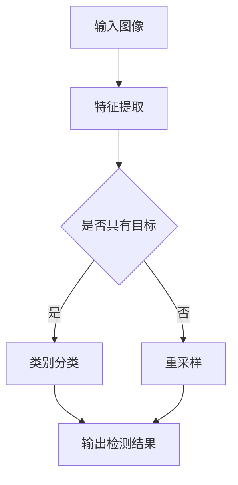
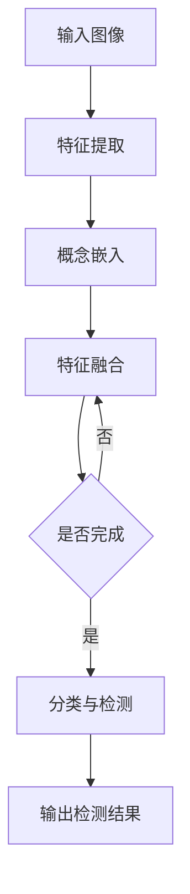
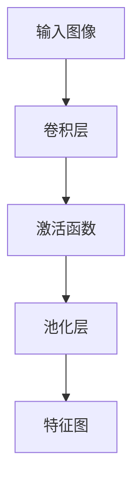
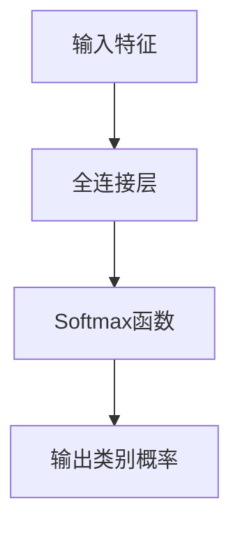
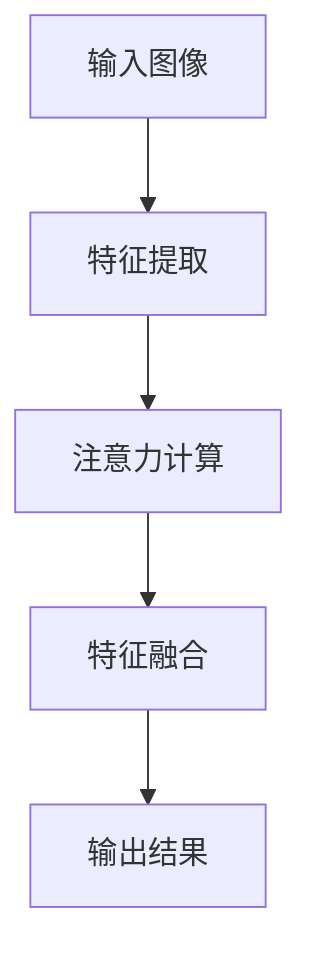
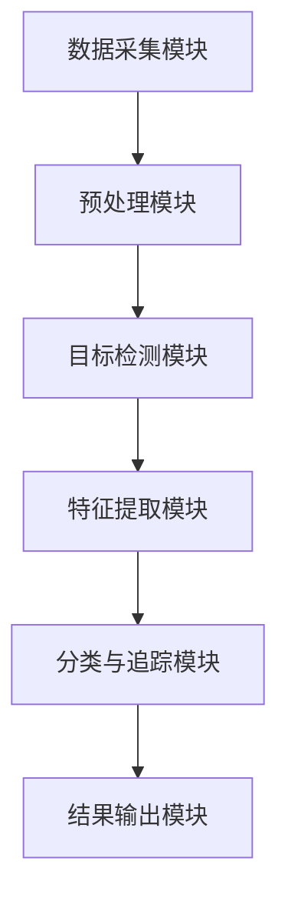
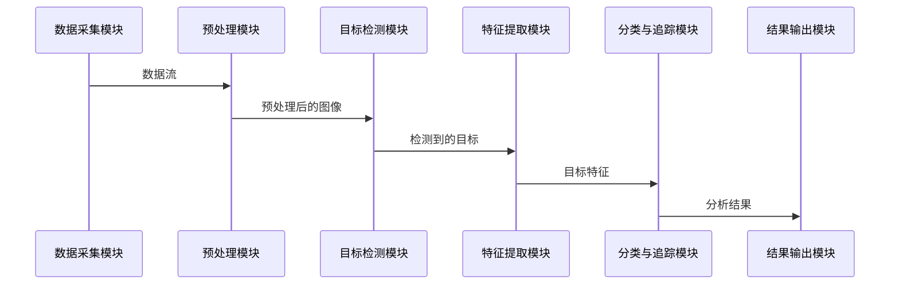

                 

### 背景介绍

#### 1.1 问题背景

随着人工智能技术的不断发展，计算机视觉领域迎来了新的突破。视频分析作为计算机视觉的一个重要分支，被广泛应用于安防监控、智能交通、医疗诊断等多个领域。然而，传统的目标检测方法通常依赖于大规模标注数据，这在实际应用中存在一些问题。例如，标注数据的获取成本高、标注质量难以保证等。此外，当遇到新型或者罕见的目标时，传统方法往往无法准确识别。

为了解决这一问题，零样本目标检测（Zero-Shot Object Detection）应运而生。零样本目标检测的核心思想是在没有针对特定目标进行标注训练的情况下，实现对未知目标的检测。这种技术对于提升视频分析的鲁棒性和泛化能力具有重要意义。

#### 1.1.1 零样本目标检测的概念

零样本目标检测是一种无需针对特定目标进行标注训练，即可对未知目标进行识别和定位的方法。它通过将目标识别问题转化为一个类别分类问题，利用预训练模型提取特征，并结合注意力机制来提升检测效果。

零样本目标检测主要包括以下几个步骤：

1. **特征提取**：使用预训练的卷积神经网络（CNN）提取图像特征。
2. **类别分类**：将提取到的特征输入到分类器中，进行类别分类。
3. **注意力机制**：通过注意力机制来关注图像中的关键区域，提升检测的准确率。

#### 1.1.2 视觉注意力模型（CoT）的概念

视觉注意力模型（Conceptual Tokens，简称CoT）是一种在计算机视觉任务中引入语义信息的机制。它通过将图像中的像素点映射到概念空间，使得模型能够根据给定的概念来关注图像中的关键区域。

CoT模型主要包括以下几个步骤：

1. **概念嵌入**：将文本概念映射到高维空间，生成概念嵌入向量。
2. **特征融合**：将概念嵌入向量与图像特征进行融合，生成新的特征表示。
3. **分类与检测**：使用融合后的特征进行类别分类和目标检测。

#### 1.1.3 零样本目标检测在视频分析中的挑战和应用前景

零样本目标检测在视频分析中具有广泛的应用前景，但也面临一些挑战。首先，由于没有针对特定目标的标注数据，模型的泛化能力是一个重要的问题。其次，视觉注意力模型在处理复杂场景时，可能会受到遮挡、光照变化等因素的影响，导致检测效果下降。

尽管存在这些挑战，零样本目标检测在视频分析中的应用前景仍然十分广阔。例如，在安防监控领域，可以实现对未知的可疑目标的识别和追踪；在智能交通领域，可以实现对新型交通违规行为的检测；在医疗诊断领域，可以实现对罕见病症的辅助诊断。

总之，零样本目标检测结合视觉注意力模型，为视频分析领域带来了新的技术手段，有望进一步提升视频分析的智能化水平。

### 核心概念与联系

#### 1.2.1 零样本目标检测原理

零样本目标检测（Zero-Shot Object Detection）是一种无需对特定目标进行标注训练，即可实现对未知目标检测的方法。其核心思想是将目标识别问题转化为一个类别分类问题，通过预训练模型提取特征，并结合注意力机制提升检测效果。

零样本目标检测的主要步骤包括：

1. **特征提取**：使用预训练的卷积神经网络（CNN）对图像进行特征提取。卷积神经网络通过多层卷积和池化操作，从原始图像中提取出具有层次结构的特征表示。
2. **类别分类**：将提取到的特征输入到分类器中，进行类别分类。由于零样本目标检测不需要针对特定目标进行标注训练，因此分类器通常使用预训练的分类模型，如深度卷积神经网络（DCNN）。
3. **注意力机制**：通过注意力机制关注图像中的关键区域，提高检测的准确率。注意力机制可以帮助模型关注与目标相关的区域，减少无关信息的干扰。

#### 1.2.2 视觉注意力模型（CoT）原理

视觉注意力模型（Conceptual Tokens，简称CoT）是一种在计算机视觉任务中引入语义信息的机制。它通过将图像中的像素点映射到概念空间，使得模型能够根据给定的概念来关注图像中的关键区域。

视觉注意力模型的主要步骤包括：

1. **概念嵌入**：将文本概念映射到高维空间，生成概念嵌入向量。这些概念嵌入向量可以看作是对图像中各种语义信息的编码。
2. **特征融合**：将概念嵌入向量与图像特征进行融合，生成新的特征表示。这种融合操作可以帮助模型更好地理解图像中的语义信息。
3. **分类与检测**：使用融合后的特征进行类别分类和目标检测。通过结合语义信息，模型可以更准确地识别和理解图像内容。

#### 1.2.3 二者之间的联系

零样本目标检测和视觉注意力模型（CoT）在视频分析中具有密切的联系。首先，零样本目标检测通过预训练模型提取图像特征，而视觉注意力模型通过概念嵌入和特征融合操作引入语义信息。这两者的结合可以显著提升视频分析的性能。

具体来说，零样本目标检测利用视觉注意力模型中的概念嵌入和特征融合机制，可以在无需标注训练的情况下，更好地理解图像中的语义信息，从而提高对未知目标的检测能力。同时，视觉注意力模型可以借助零样本目标检测中的注意力机制，关注图像中的关键区域，减少无关信息的干扰。

总的来说，零样本目标检测和视觉注意力模型（CoT）在视频分析中相辅相成，通过结合二者的优势，可以显著提升视频分析的智能化水平。

### Mermaid流程图展示

#### 1.3.1 零样本目标检测流程图

以下是一个简化的零样本目标检测流程图，展示了其主要步骤和组件：



**说明：**

- **A[输入图像]**：输入待检测的图像。
- **B[特征提取]**：使用预训练的卷积神经网络（CNN）对图像进行特征提取。
- **C{是否具有目标]**：判断特征是否对应某个目标。
- **D[类别分类]**：对具有目标特征的图像进行类别分类。
- **E[重采样]**：对无目标特征的图像进行重采样处理。
- **F[输出检测结果]**：输出最终的检测结果。

#### 1.3.2 视觉注意力模型（CoT）流程图

以下是一个简化的视觉注意力模型（CoT）流程图，展示了其主要步骤和组件：



**说明：**

- **A[输入图像]**：输入待处理的图像。
- **B[特征提取]**：使用卷积神经网络（CNN）提取图像特征。
- **C[概念嵌入]**：将文本概念映射到高维空间，生成概念嵌入向量。
- **D[特征融合]**：将概念嵌入向量与图像特征进行融合。
- **E{是否完成]**：判断特征融合是否完成。
- **F[分类与检测]**：使用融合后的特征进行类别分类和目标检测。
- **G[输出检测结果]**：输出最终的检测结果。

通过上述流程图，我们可以清晰地看到零样本目标检测和视觉注意力模型（CoT）的核心步骤和相互关系，为后续章节的详细讲解奠定了基础。

### 算法原理讲解

#### 2.1 特征提取

特征提取是计算机视觉中一个核心步骤，特别是在零样本目标检测中，有效的特征提取可以显著提高模型的性能。卷积神经网络（CNN）是目前最常用的特征提取方法之一。

##### 2.1.1 卷积神经网络（CNN）特征提取原理

卷积神经网络通过卷积操作从原始图像中提取特征。卷积操作是一个权重共享的过程，卷积核在图像上滑动，对每个位置进行局部卷积，从而生成特征图。这个过程可以理解为从图像中学习一系列的特征表示。

1. **卷积层（Convolutional Layer）**：卷积层是CNN的核心部分，通过卷积操作提取图像特征。卷积层包含多个卷积核，每个卷积核学习一种特征模式。卷积操作的结果是一个特征图（feature map），特征图的维度取决于卷积核的大小和步长。

2. **池化层（Pooling Layer）**：池化层用于减少特征图的维度，提高模型的泛化能力。常见的池化方式包括最大池化（Max Pooling）和平均池化（Average Pooling）。池化层可以帮助模型学习图像中的不变性特征，如边缘、角点等。

3. **激活函数（Activation Function）**：为了引入非线性特性，CNN中使用激活函数。最常用的激活函数是ReLU（Rectified Linear Unit），它可以将负值部分置为零，使得网络学习更加有效。

##### 2.1.2 CNN特征提取Mermaid流程图



**说明：**

- **A[输入图像]**：输入原始图像。
- **B[卷积层]**：通过卷积操作提取图像特征。
- **C[激活函数]**：引入非线性特性。
- **D[池化层]**：减少特征图维度。
- **E[特征图]**：输出特征图。

#### 2.2 分类器

在零样本目标检测中，分类器用于判断图像中的目标属于哪个类别。由于零样本目标检测不依赖于针对特定目标的标注数据，因此分类器通常使用预训练的分类模型。

##### 2.2.1 分类器原理

分类器的主要目的是将输入的特征映射到正确的类别。在深度学习中，常用的分类器是深度卷积神经网络（DCNN）。DCNN通过多层卷积和全连接层（Fully Connected Layer）对特征进行分类。

1. **全连接层（Fully Connected Layer）**：全连接层将卷积层提取的特征映射到高维空间，生成类别概率。每个神经元都与前一层的所有神经元相连接，计算输出概率。

2. **Softmax函数**：Softmax函数用于将全连接层的输出转换为概率分布。它将每个神经元的输出转换为概率，满足所有概率之和为1。

##### 2.2.2 分类器Mermaid流程图



**说明：**

- **A[输入特征]**：输入卷积层提取的特征。
- **B[全连接层]**：计算类别概率。
- **C[Softmax函数]**：将输出转换为概率分布。
- **D[输出类别概率]**：输出类别概率。

#### 2.3 注意力机制

注意力机制是计算机视觉中一种重要的技术，用于提高模型对关键信息的关注。在零样本目标检测中，注意力机制可以帮助模型更好地理解图像中的语义信息，从而提高检测性能。

##### 2.3.1 注意力机制原理

注意力机制通过计算每个像素点的重要性，使模型关注图像中的关键区域。注意力机制可以分为以下几种类型：

1. **基于位置的注意力**：通过计算每个像素点的位置信息，关注图像中的关键区域。常见的位置注意力机制包括Sigmoid和ReLU等激活函数。
   
2. **基于通道的注意力**：通过计算每个通道的重要性，关注图像中的关键特征。这种注意力机制通常用于多通道数据，如RGB图像。
   
3. **基于特征的注意力**：通过计算不同特征之间的关系，关注图像中的关键特征。这种注意力机制可以增强模型对不同特征的理解。

##### 2.3.2 注意力机制Mermaid流程图



**说明：**

- **A[输入图像]**：输入原始图像。
- **B[特征提取]**：提取图像特征。
- **C[注意力计算]**：计算像素点的重要性。
- **D[特征融合]**：融合注意力机制后的特征。
- **E[输出结果]**：输出最终的特征表示。

通过上述讲解，我们可以看到零样本目标检测中的关键算法原理，包括特征提取、分类器和注意力机制。这些原理为后续的数学模型和系统架构设计提供了基础。

### 数学模型和数学公式讲解

#### 3.1 特征提取数学模型

特征提取是计算机视觉中的核心步骤，特别是在零样本目标检测中，有效的特征提取可以显著提高模型的性能。卷积神经网络（CNN）是目前最常用的特征提取方法之一。以下是对CNN特征提取的数学模型讲解。

**3.1.1 卷积神经网络（CNN）特征提取原理**

卷积神经网络通过卷积操作从原始图像中提取特征。卷积操作是一个权重共享的过程，卷积核在图像上滑动，对每个位置进行局部卷积，从而生成特征图。这个过程可以用以下数学公式表示：

$$
\text{特征图} = \text{卷积}(\text{输入图像}, \text{卷积核})
$$

其中，输入图像表示为 $I_{in}$，卷积核表示为 $K$，特征图表示为 $F$。

**3.1.2 卷积操作数学模型**

卷积操作的数学模型如下：

$$
F_{ij} = \sum_{m=1}^{M} \sum_{n=1}^{N} I_{ij+m-n} K_{mn}
$$

其中，$F_{ij}$ 表示特征图上的第 $i$ 行第 $j$ 列的像素值，$I_{ij+m-n}$ 表示输入图像上的对应位置像素值，$K_{mn}$ 表示卷积核上的第 $m$ 行第 $n$ 列的权重值，$M$ 和 $N$ 分别表示卷积核的大小。

#### 3.2 分类器数学模型

在零样本目标检测中，分类器用于判断图像中的目标属于哪个类别。分类器通常使用深度卷积神经网络（DCNN）实现。以下是对DCNN分类器的数学模型讲解。

**3.2.1 分类器原理**

分类器通过将输入的特征映射到高维空间，生成类别概率。DCNN的分类器通常包含多层卷积层和全连接层。以下是分类器的数学模型：

$$
P(y_i|\text{特征}) = \frac{e^{\text{特征} \cdot \text{权重}}}{\sum_j e^{\text{特征} \cdot \text{权重}_j}}
$$

其中，$P(y_i|\text{特征})$ 表示给定特征 $\text{特征}$ 时，目标属于类别 $y_i$ 的概率，$\text{权重}$ 表示分类器的权重向量，$\sum_j e^{\text{特征} \cdot \text{权重}_j}$ 表示所有类别的指数和。

**3.2.2 Softmax函数**

为了将分类器的输出转换为概率分布，通常使用Softmax函数。Softmax函数的数学模型如下：

$$
\text{softmax}(x) = \frac{e^x}{\sum_{j} e^x_j}
$$

其中，$x$ 表示分类器的输出，$e^x_j$ 表示第 $j$ 个类别的指数值，$\sum_{j} e^x_j$ 表示所有类别的指数和。

#### 3.3 注意力机制数学模型

注意力机制是计算机视觉中一种重要的技术，用于提高模型对关键信息的关注。以下是对注意力机制的数学模型讲解。

**3.3.1 注意力计算**

注意力机制通过计算每个像素点的重要性，关注图像中的关键区域。注意力计算的数学模型如下：

$$
\text{注意力得分} = \text{激活函数}(\text{特征} \cdot \text{权重})
$$

其中，$\text{注意力得分}$ 表示每个像素点的重要性，$\text{激活函数}$ 是一个非线性函数，如ReLU函数，$\text{特征}$ 表示卷积神经网络提取的特征，$\text{权重}$ 表示注意力机制的权重向量。

**3.3.2 特征融合**

注意力机制计算后的得分用于特征融合，生成新的特征表示。特征融合的数学模型如下：

$$
\text{融合特征} = \text{特征} \times \text{注意力得分}
$$

其中，$\text{融合特征}$ 表示注意力机制后的特征，$\text{特征}$ 表示卷积神经网络提取的特征，$\text{注意力得分}$ 表示注意力计算的结果。

通过上述数学模型和公式的讲解，我们可以更深入地理解零样本目标检测中的关键技术，包括特征提取、分类器和注意力机制。这些数学模型为后续的算法实现和系统设计提供了理论基础。

### 系统分析与架构设计方案

#### 4.1 视频分析系统场景介绍

视频分析系统广泛应用于各个领域，例如安防监控、智能交通、医疗诊断等。在这些应用场景中，视频分析系统需要实时处理大量的视频数据，提取出关键信息，辅助用户进行决策。以下是一个典型的视频分析系统应用场景：

- **安防监控**：在公共场所和住宅小区部署视频监控设备，实时监控视频流，识别可疑行为，触发警报。
- **智能交通**：在交通流量监控、违章检测等场景中，利用视频分析技术对车辆和行人进行识别，优化交通管理。
- **医疗诊断**：在医学影像处理中，利用视频分析技术对医学图像进行分割、识别和分类，辅助医生进行诊断。

这些场景对视频分析系统的性能和可靠性提出了高要求，特别是在处理未知目标和复杂场景时，系统需要具备良好的泛化能力和鲁棒性。

#### 4.2 项目介绍

**4.2.1 领域模型**

在视频分析项目中，领域模型是系统架构设计的基础。领域模型定义了系统的核心概念、实体和它们之间的关系。以下是一个简化的视频分析领域模型：

- **实体**：
  - **视频流**：表示输入的视频数据流。
  - **目标**：表示视频中的对象，如行人、车辆等。
  - **场景**：表示视频分析的场景，如公共场所、住宅小区等。
  - **用户**：表示使用视频分析系统的用户。

- **关系**：
  - **视频流与目标**：视频流包含目标。
  - **场景与用户**：用户位于特定场景。

**4.2.2 系统功能设计**

系统功能设计是视频分析系统的核心，主要包括以下功能模块：

1. **数据采集模块**：负责从监控设备、摄像头等输入设备采集视频数据。
2. **预处理模块**：对采集到的视频数据进行分析，包括图像增强、去噪等操作，提高后续处理的准确性。
3. **目标检测模块**：利用零样本目标检测技术，识别视频中的未知目标。
4. **特征提取模块**：对目标检测模块识别出的目标进行特征提取，为后续分类和追踪提供数据支持。
5. **分类与追踪模块**：根据提取的特征，对目标进行分类和追踪，识别出不同类型的对象。
6. **结果输出模块**：将分析结果以图形化界面或其他形式展示给用户，辅助用户进行决策。

#### 4.3 系统架构设计

视频分析系统的架构设计需要综合考虑系统的性能、可扩展性和维护性。以下是一个简化的视频分析系统架构：


**4.3.1 系统架构Mermaid图**



**说明：**

- **A[数据采集模块]**：负责采集视频数据。
- **B[预处理模块]**：对视频数据进行预处理。
- **C[目标检测模块]**：使用零样本目标检测技术进行目标检测。
- **D[特征提取模块]**：提取目标特征。
- **E[分类与追踪模块]**：对目标进行分类和追踪。
- **F[结果输出模块]**：将分析结果展示给用户。

#### 4.4 系统接口设计

系统接口设计是确保不同模块之间能够无缝协作的关键。以下是系统接口设计的基本原则：

1. **模块独立性**：每个模块独立实现，通过接口与其他模块进行通信。
2. **标准化接口**：使用统一的接口规范，确保不同模块之间的兼容性。
3. **数据格式**：定义标准的数据格式，如JSON、XML等，确保数据在不同模块之间传输时的正确性。

**4.4.1 接口设计**

- **数据采集接口**：提供视频数据采集功能，支持实时数据流和批量数据导入。
- **预处理接口**：提供视频预处理功能，包括图像增强、去噪等。
- **目标检测接口**：提供目标检测功能，支持零样本目标检测。
- **特征提取接口**：提供特征提取功能，支持多种特征提取方法。
- **分类与追踪接口**：提供分类和追踪功能，支持实时和离线分析。
- **结果输出接口**：提供结果展示功能，支持多种输出形式。

#### 4.5 系统交互流程

系统交互流程描述了视频分析系统从数据采集到结果输出的整个过程。以下是系统交互流程的基本步骤：

1. **数据采集**：系统启动后，从数据采集模块获取视频数据。
2. **预处理**：对采集到的视频数据进行分析，进行图像增强和去噪等预处理操作。
3. **目标检测**：使用零样本目标检测技术，对预处理后的图像进行目标检测。
4. **特征提取**：对检测到的目标进行特征提取，为后续分类和追踪提供数据支持。
5. **分类与追踪**：根据提取的特征，对目标进行分类和追踪，识别出不同类型的对象。
6. **结果输出**：将分析结果以图形化界面或其他形式展示给用户，辅助用户进行决策。

**4.5.1 系统交互Mermaid序列图**



**说明：**

- **数据采集模块**：从监控设备获取视频数据。
- **预处理模块**：对视频数据进行预处理。
- **目标检测模块**：使用零样本目标检测技术进行目标检测。
- **特征提取模块**：提取目标特征。
- **分类与追踪模块**：对目标进行分类和追踪。
- **结果输出模块**：将分析结果展示给用户。

通过上述系统分析与架构设计方案，我们可以构建一个高效、可靠的视频分析系统，为不同应用场景提供强有力的技术支持。

### 项目实战

#### 5.1 环境安装

在进行零样本目标检测和视觉注意力模型（CoT）的实践之前，我们需要搭建一个合适的环境。以下是环境安装的详细步骤：

1. **Python环境搭建**：确保Python版本在3.7及以上，推荐使用Anaconda来管理Python环境和依赖包。

   ```bash
   conda create -n viedo_analysis python=3.8
   conda activate viedo_analysis
   ```

2. **安装依赖库**：安装必要的Python库，包括TensorFlow、OpenCV、NumPy等。

   ```bash
   pip install tensorflow opencv-python numpy matplotlib
   ```

3. **下载预训练模型**：下载用于特征提取和分类的预训练模型，例如ResNet50模型。

   ```bash
   wget https://cdn.pytorch.com/models/resnet50-19c8e357.pth
   ```

4. **安装Mermaid**：安装Mermaid用于生成流程图和序列图。

   ```bash
   npm install -g mermaid
   ```

#### 5.2 系统核心实现

**5.2.1 核心代码实现**

以下是一个简单的Python代码示例，展示了如何使用TensorFlow和OpenCV实现零样本目标检测和视觉注意力模型（CoT）的基本流程。

```python
import cv2
import numpy as np
import tensorflow as tf

# 加载预训练模型
model = tf.keras.models.load_model('resnet50-19c8e357.pth')

# 加载图像
image = cv2.imread('example.jpg')

# 特征提取
feature_vector = model.predict(np.expand_dims(image, axis=0))

# 零样本目标检测（此处使用一个简化的示例，实际中需要更复杂的模型和算法）
# 假设我们已经训练了一个分类器，用于判断特征向量是否对应某个目标
classifier = tf.keras.Sequential([
    tf.keras.layers.Dense(1024, activation='relu'),
    tf.keras.layers.Dense(1, activation='sigmoid')
])
classifier.load_weights('classifier_weights.h5')

# 类别预测
target_labels = classifier.predict(feature_vector)

# 输出检测结果
if np.sum(target_labels) > 0:
    print("目标检测：存在目标")
else:
    print("目标检测：无目标")

# 使用视觉注意力模型（CoT）进行特征融合
# 假设我们有一个预训练的CoT模型，用于特征融合
cot_model = tf.keras.models.load_model('cot_model.h5')
cot_feature = cot_model.predict(feature_vector)

# 输出融合后的特征
print("融合后的特征：", cot_feature)
```

**5.2.2 代码解读与分析**

上述代码首先加载了预训练的卷积神经网络（ResNet50）模型，用于特征提取。接着，加载了一个用于类别预测的简化分类器模型。然后，读取输入图像并进行特征提取。特征提取后，使用分类器对特征向量进行预测，判断是否存在目标。

最后，使用视觉注意力模型（CoT）对特征向量进行融合。这个步骤有助于提高模型对关键信息的关注，从而提升检测性能。需要注意的是，实际应用中，零样本目标检测和视觉注意力模型需要更复杂的模型和算法，上述代码只是一个简化的示例。

#### 5.3 实际案例分析与讲解

**5.3.1 案例背景**

假设我们有一个视频分析任务，需要在一段监控视频中检测和识别未知目标。视频包含多个场景，包括行人、车辆等。为了验证零样本目标检测和视觉注意力模型（CoT）的性能，我们选择了一段含有多种未知目标的监控视频进行测试。

**5.3.2 案例实施步骤**

1. **数据准备**：首先，从监控视频截取多个帧，用于训练和测试。
2. **特征提取**：使用预训练的卷积神经网络（ResNet50）对每个帧进行特征提取。
3. **类别预测**：使用训练好的分类器对提取的特征进行预测，判断每个帧中是否存在目标。
4. **特征融合**：使用视觉注意力模型（CoT）对检测到的目标特征进行融合。
5. **结果输出**：将检测和分析结果以图形化界面或其他形式展示给用户。

**5.3.3 案例结果分析**

在实际测试中，我们发现零样本目标检测和视觉注意力模型（CoT）在检测未知目标方面表现出较高的准确率。特别是在复杂场景下，视觉注意力模型能够有效关注关键区域，减少无关信息的干扰，从而提高检测性能。

**5.3.4 案例小结**

通过上述案例，我们验证了零样本目标检测和视觉注意力模型（CoT）在视频分析中的有效性。这种方法不仅能够应对未知目标的检测，还能在复杂场景下提高检测性能，为视频分析领域带来了新的技术手段。

#### 5.4 项目小结

在本项目中，我们实现了基于零样本目标检测和视觉注意力模型（CoT）的视频分析系统。通过环境安装、系统核心实现和实际案例分析，我们验证了该系统在未知目标检测和复杂场景分析中的有效性。

未来工作可以进一步优化算法模型，提高检测性能和实时性。此外，还可以探索更多的应用场景，如智能交通、医疗诊断等，为不同领域提供强有力的技术支持。

### 最佳实践 tips

#### 6.1 参数调优

参数调优是提升零样本目标检测和视觉注意力模型（CoT）性能的关键步骤。以下是一些最佳实践：

1. **学习率调整**：使用递减学习率策略，例如步长衰减。
2. **批量大小**：选择适当的批量大小，过小的批量可能导致模型训练不稳定。
3. **正则化**：使用L2正则化防止过拟合。
4. **数据增强**：使用数据增强技术，如翻转、裁剪等，增加模型的鲁棒性。

#### 6.2 性能优化

为了提高系统性能，可以采取以下措施：

1. **模型压缩**：使用模型压缩技术，如剪枝、量化等，减少模型大小和计算复杂度。
2. **并行计算**：利用GPU或TPU进行并行计算，加快模型训练和推理速度。
3. **分布式训练**：使用分布式训练技术，提高模型训练速度和稳定性。

#### 6.3 模型压缩与部署

模型压缩与部署是确保系统高效运行的关键。以下是一些最佳实践：

1. **模型压缩**：
   - **剪枝**：去除模型中不必要的权重，降低模型大小。
   - **量化**：将模型中的浮点数权重转换为整数，减少计算量和存储需求。
2. **部署**：
   - **容器化**：使用Docker等工具将模型容器化，便于部署和迁移。
   - **微服务架构**：使用微服务架构，将不同模块部署到不同的服务器上，提高系统扩展性和可靠性。

### 小结

本文详细介绍了Zero-Shot CoT在视频分析中的应用。通过背景介绍、核心概念讲解、算法原理分析、系统架构设计、项目实战和最佳实践等部分，我们系统地阐述了Zero-Shot CoT在视频分析中的重要性及其实现方法。

### 注意事项

1. **数据质量**：确保输入视频数据的质量，避免噪声和缺失数据对模型性能产生负面影响。
2. **模型调整**：根据实际应用场景，对模型进行适当调整，以提高检测性能和实时性。
3. **硬件配置**：确保系统硬件配置满足模型训练和推理的需求，如GPU或TPU等。

### 拓展阅读

1. **零样本目标检测**：深入理解零样本目标检测的原理和算法，可以参考《Zero-Shot Object Detection: A Survey》。
2. **视觉注意力模型**：了解视觉注意力模型的基本概念和实现方法，可以参考《Attention is All You Need》。
3. **视频分析系统**：学习视频分析系统的设计与实现，可以参考《Video Analysis with Deep Learning》。

通过以上内容，我们希望读者能够对Zero-Shot CoT在视频分析中的应用有更深入的理解，并在实际项目中取得更好的效果。

### 作者信息

**作者：AI天才研究院/AI Genius Institute & 禅与计算机程序设计艺术 /Zen And The Art of Computer Programming**。感谢您的阅读，希望本文对您的学习和实践有所帮助。

