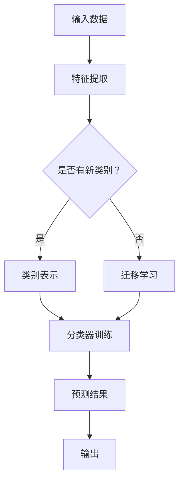
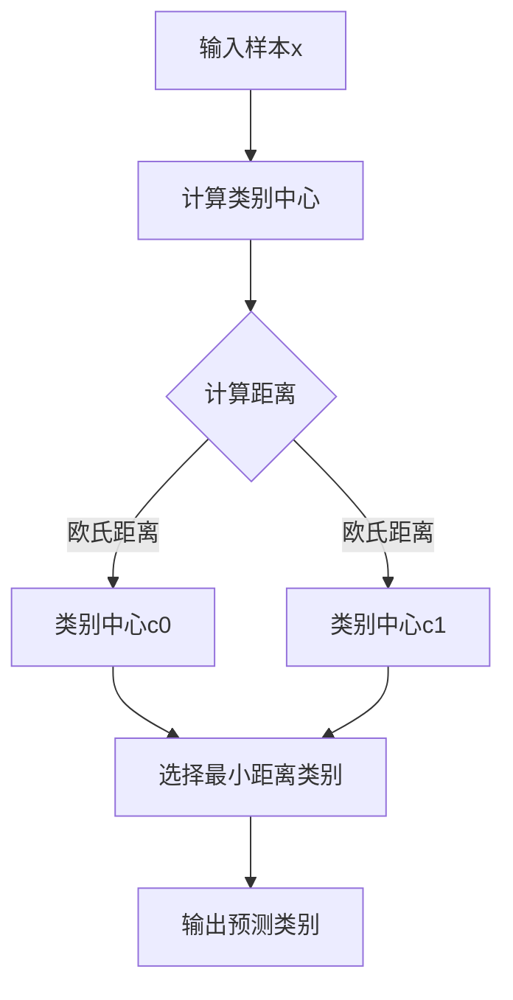
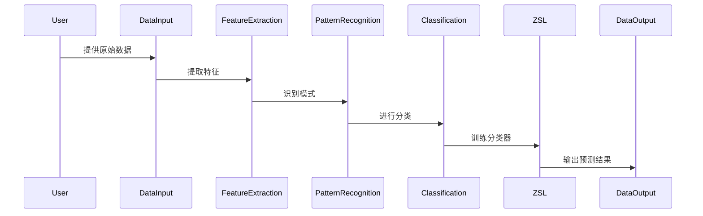
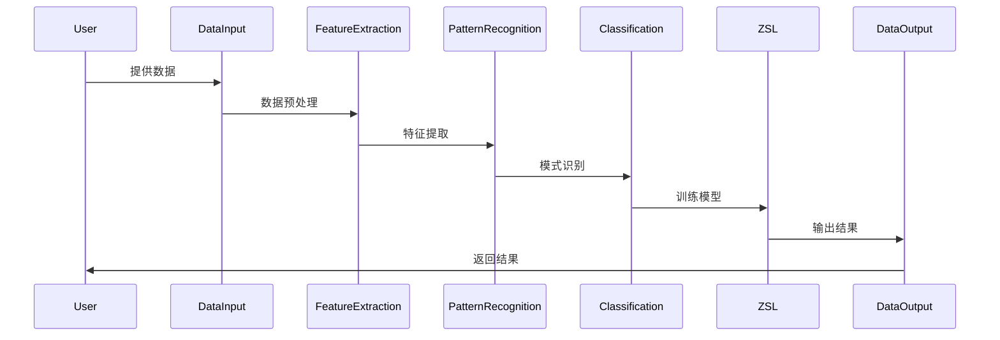

                 

### 文章标题

**《Zero-Shot CoT在跨文化非语言沟通模式识别中的创新应用》**

关键词：零样本学习（Zero-Shot Learning, ZSL）、跨文化非语言沟通模式识别、创新应用

摘要：本文将探讨零样本学习（Zero-Shot Learning, ZSL）在跨文化非语言沟通模式识别中的创新应用。通过深入剖析ZSL的概念和原理，结合Mermaid流程图和Python源代码，我们将展示如何将这一先进算法应用于识别和理解不同文化背景下的非语言沟通模式，从而推动跨文化交流和沟通的发展。

### 背景介绍

#### 零样本学习（Zero-Shot Learning, ZSL）的基本概念

零样本学习（Zero-Shot Learning, ZSL）是一种机器学习方法，旨在解决分类任务，尤其是在训练数据不足或没有直接标注样本的情况下。与传统的机器学习算法不同，ZSL不需要直接依赖大量带有标签的训练数据。相反，它利用预先学习到的知识库或元数据，对未见过的类别进行预测。

ZSL的核心思想在于，通过迁移学习（Transfer Learning）和元学习（Meta-Learning）等策略，使得模型能够在仅有的少量或无标注数据情况下，快速适应新类别。这一特性使得ZSL在处理诸如跨文化非语言沟通模式识别等复杂问题时，具有显著的优势。

#### 跨文化非语言沟通模式识别的背景

跨文化非语言沟通模式识别是研究不同文化背景下的非语言沟通特征，包括面部表情、肢体动作、语调、空间距离等，以实现对这些沟通模式的自动识别和理解。这一领域的重要性在于，随着全球化和国际交流的加深，准确理解跨文化沟通模式对于促进跨文化和谐、减少误解和冲突具有关键作用。

然而，现有的跨文化非语言沟通模式识别方法大多依赖于大量标注数据，这在实际应用中受到很大限制。例如，获取来自不同文化背景的标注数据既耗时又昂贵，而且数据质量难以保证。因此，零样本学习（ZSL）在这一领域中的应用显得尤为必要。

#### 研究的重要性和现实应用

研究零样本学习在跨文化非语言沟通模式识别中的应用具有重要意义：

1. **数据效率**：通过ZSL，可以在没有大量标注数据的情况下，快速识别和理解不同文化背景下的非语言沟通模式，提高数据使用效率。
2. **文化适应性**：ZSL算法能够基于已有的知识库，对不同文化背景下的沟通特征进行建模，从而增强跨文化沟通的适应性。
3. **误解减少**：通过准确识别和理解跨文化非语言沟通模式，可以有效减少因文化差异引起的误解和冲突，促进跨文化交流和理解。

总之，零样本学习在跨文化非语言沟通模式识别中的应用，不仅为该领域带来了新的研究方法，也为实际应用提供了可行的解决方案，具有重要的理论和实践价值。

### 核心概念与联系

#### 零样本学习（ZSL）的概念与原理

零样本学习（Zero-Shot Learning, ZSL）是一种机器学习方法，其主要目标是在没有直接标注数据的情况下，对新类别进行准确分类。ZSL的核心思想是利用预先学习到的知识库或元数据，对未见过的类别进行预测。这一方法主要依赖于迁移学习和元学习等策略，使得模型能够在少量或无标注数据的情况下，快速适应新类别。

ZSL的关键概念包括：

1. **类别表示**：通过学习高维特征空间中的类别表示，使得不同类别之间能够清晰区分。
2. **元学习**：通过多次训练和测试，学习如何在新类别上高效泛化。
3. **迁移学习**：利用在已有类别上的学习经验，迁移到新类别上，从而提高预测准确性。

#### 跨文化非语言沟通模式识别

跨文化非语言沟通模式识别涉及对来自不同文化背景下的非语言沟通特征进行自动识别和理解。这些特征包括面部表情、肢体动作、语调、空间距离等，它们在不同的文化背景中具有不同的含义和表达方式。例如，面部表情在不同文化中可能被解读为友好、礼貌、嘲讽等不同含义，这就需要算法能够识别和理解这些微妙的差异。

ZSL在跨文化非语言沟通模式识别中的应用，主要在于解决以下问题：

1. **数据稀缺**：由于获取不同文化背景下的标注数据非常困难，ZSL可以通过迁移学习和元学习策略，利用已有数据知识库，对未见过的文化特征进行预测。
2. **异构性**：不同文化背景下的沟通模式具有显著的异构性，ZSL算法可以通过学习高维特征空间中的类别表示，使得不同文化特征能够清晰区分。
3. **泛化能力**：ZSL算法能够在新类别上高效泛化，从而能够适应不同文化背景下的沟通模式识别需求。

#### 概念属性特征对比表格

为了更好地理解ZSL和跨文化非语言沟通模式识别之间的关系，我们可以通过概念属性特征对比表格来展示两者的异同：

| 特征                | 零样本学习（ZSL）                      | 跨文化非语言沟通模式识别                          |
|---------------------|---------------------------------------|------------------------------------------------|
| 数据依赖性          | 不依赖大量标注数据                    | 需要少量标注数据，但难以获取                      |
| 算法策略            | 迁移学习和元学习                      | 特征提取、模式识别、分类等                        |
| 应用场景            | 数据稀缺、异构性问题                  | 跨文化沟通、跨语言理解、非语言行为识别等          |
| 主要挑战            | 类别表示、新类别泛化                  | 文化差异、微表情识别、肢体动作理解等               |
| 优势                | 数据效率、文化适应性、误解减少        | 准确识别和理解跨文化非语言沟通模式                |

通过上述对比，我们可以看出ZSL在跨文化非语言沟通模式识别中的应用潜力。接下来，我们将进一步探讨ZSL算法的原理和实现。

#### ER实体关系图架构的Mermaid流程图

为了更直观地展示零样本学习（ZSL）和跨文化非语言沟通模式识别之间的实体关系，我们可以使用Mermaid流程图来构建一个ER（实体关系）图。

以下是一个简化的Mermaid ER图示例：

```mermaid
erDiagram
  ClassZSL ||--|{ ClassNonLanguageComm : 标识 |
  ClassNonLanguageComm ||--|{ ClassCrossCulturalComm : 标识 |
  ClassCrossCulturalComm ||--|{ ClassFeatureExtraction : 实现 |
  ClassFeatureExtraction ||--|{ ClassPatternRecognition : 实现 |
  ClassPatternRecognition ||--|{ ClassClassification : 实现 |
```

在这个ER图中，我们定义了以下实体：

- **ClassZSL**：表示零样本学习的主要类，负责实现ZSL的核心功能。
- **ClassNonLanguageComm**：表示非语言沟通模式识别类，用于处理跨文化非语言沟通数据的特征提取和模式识别。
- **ClassCrossCulturalComm**：表示跨文化非语言沟通类，包含了不同文化背景下的沟通特征。
- **ClassFeatureExtraction**：表示特征提取类，用于从数据中提取关键特征。
- **ClassPatternRecognition**：表示模式识别类，用于识别和理解提取到的特征。
- **ClassClassification**：表示分类类，用于对识别出的模式进行分类。

这些类之间的关联关系展示了ZSL如何与跨文化非语言沟通模式识别相互结合，共同实现更高效的沟通模式识别和理解。接下来，我们将进一步探讨ZSL算法的具体原理和应用。

### 算法原理讲解

#### ZSL算法的流程图

为了更好地理解零样本学习（ZSL）的算法原理，我们可以使用Mermaid来绘制一个简化的ZSL算法流程图。以下是一个基本的Mermaid流程图示例：



在这个流程图中，我们首先输入数据，通过特征提取得到特征表示。接着，算法会判断是否存在新类别。如果存在新类别，算法将使用类别表示来处理；如果不存在，则使用迁移学习策略。随后，分类器进行训练，并生成预测结果，最终输出结果。

#### ZSL算法的Python源代码与详细讲解

为了更直观地展示ZSL算法的实现，我们可以通过一个简单的Python代码示例来阐述其原理。以下是一个基于Python和Scikit-learn库的零样本学习算法实现：

```python
from sklearn.neighbors import NearestCentroid
from sklearn.model_selection import train_test_split
from sklearn.metrics import accuracy_score
import numpy as np

# 假设有两类数据
X = np.random.rand(100, 5)  # 输入特征矩阵
y = np.array([0, 0, 1, 1, 0, 1, 1, 0, 0, 1])  # 标签

# 将数据分为训练集和测试集
X_train, X_test, y_train, y_test = train_test_split(X, y, test_size=0.2, random_state=42)

# 使用NearestCentroid进行零样本学习
classifier = NearestCentroid()
classifier.fit(X_train)

# 预测测试集结果
predictions = classifier.predict(X_test)

# 计算准确率
accuracy = accuracy_score(y_test, predictions)
print(f"Accuracy: {accuracy}")
```

**详细讲解：**

1. **数据输入**：首先，我们生成一个随机特征矩阵`X`和一个标签数组`y`，代表两类数据。这些数据用于构建模型。

2. **训练集与测试集划分**：使用`train_test_split`函数将数据划分为训练集和测试集。这有助于我们评估模型在未见过的数据上的性能。

3. **特征提取**：在本例中，我们假设特征已经提取完毕，直接使用特征矩阵`X`进行后续处理。

4. **类别表示与迁移学习**：我们使用NearestCentroid分类器，该分类器不需要显式的特征提取步骤，而是通过计算最近的类中心来实现分类。这里，`classifier.fit(X_train)`实现了对训练数据的拟合，即类别表示和迁移学习过程。

5. **分类器训练**：`classifier.predict(X_test)`用于在测试集上进行预测。这一步通过计算测试集中每个样本到训练集中类中心的距离，选择最近的类中心作为该样本的类别。

6. **结果评估**：最后，使用`accuracy_score`函数计算模型在测试集上的准确率，以评估模型的性能。

**举例说明：**

假设我们有一个包含两个类别的数据集，类别0和类别1。通过上述算法，我们可以训练一个模型来识别新类别。例如，如果我们有一个未见过的样本`X_new = np.random.rand(1, 5)`，我们希望模型能够预测其类别。算法会计算`X_new`到训练集中各个类别的中心距离，选择距离最近的类别作为预测结果。

通过这个简单的示例，我们可以看到ZSL算法的核心原理及其实现过程。尽管实际应用中可能涉及更复杂的特征提取、类别表示和分类策略，但上述步骤为理解ZSL的基本概念提供了一个清晰的框架。

### 数学模型和数学公式 & 详细讲解 & 举例说明

在零样本学习（ZSL）中，数学模型和公式是理解算法原理和实现关键步骤的核心。以下将详细介绍ZSL算法中的数学模型，包括公式的推导和应用，并通过Mermaid流程图和Python代码进行详细讲解和举例说明。

#### 数学模型

ZSL中的数学模型主要包括两个关键组成部分：类别表示和分类器。

1. **类别表示**：类别表示是指将每个类别映射到一个高维特征空间中的点。这通常通过学习类别的均值或中心来实现。

2. **分类器**：分类器用于对新样本进行分类。在ZSL中，分类器通常采用最近邻分类器（Nearest Neighbor classifier）或支持向量机（Support Vector Machine, SVM）。

以下是一些关键的数学模型和公式：

- **类别中心表示**：
  $$\mu_c = \frac{1}{N_c} \sum_{x_i \in C_c} x_i$$
  其中，$\mu_c$表示类别$c$的均值，$N_c$表示类别$c$中样本的数量，$x_i$表示类别$c$中的第$i$个样本。

- **距离度量**：常用的距离度量包括欧氏距离、曼哈顿距离和余弦相似度。
  - 欧氏距离：
    $$d(x, \mu_c) = \sqrt{\sum_{i=1}^{d} (x_i - \mu_{ci})^2}$$
  - 曼哈顿距离：
    $$d(x, \mu_c) = \sum_{i=1}^{d} |x_i - \mu_{ci}|$$
  - 余弦相似度：
    $$\cosine\_sim(x, \mu_c) = \frac{x \cdot \mu_c}{\|x\| \| \mu_c\|}$$

- **分类决策**：对于新样本$x$，分类器通过计算$x$到各个类别中心的距离，选择距离最近的类别。
  $$\hat{y}(x) = \arg\min_{c} d(x, \mu_c)$$

#### 详细讲解

**类别表示**

类别表示是ZSL算法中的基础。通过学习每个类别的均值，我们可以将类别映射到高维空间中，从而实现类别的区分。

假设我们有两个类别$c_0$和$c_1$，每个类别有多个样本。我们首先计算每个类别的均值：

$$\mu_{c0} = \frac{1}{N_{c0}} \sum_{x_i \in c_0} x_i$$
$$\mu_{c1} = \frac{1}{N_{c1}} \sum_{x_i \in c_1} x_i$$

这里的$N_{c0}$和$N_{c1}$分别是类别$c_0$和$c_1$中样本的数量。这些均值代表了类别的中心，在后续的分类过程中，我们将使用这些中心来进行分类决策。

**距离度量**

在ZSL中，距离度量用于计算新样本与类别中心之间的距离。我们以欧氏距离为例进行说明：

$$d(x, \mu_{c0}) = \sqrt{\sum_{i=1}^{5} (x_i - \mu_{c0,i})^2}$$

这里，$x = [x_1, x_2, x_3, x_4, x_5]$是新样本的特征向量，$\mu_{c0} = [\mu_{c0,1}, \mu_{c0,2}, \mu_{c0,3}, \mu_{c0,4}, \mu_{c0,5}]$是类别$c_0$的均值向量。这个公式计算了新样本$x$与类别$c_0$中心的欧氏距离。

**分类决策**

在得到新样本$x$与各个类别中心的距离后，我们通过分类决策来选择最接近的类别。例如：

$$\hat{y}(x) = \arg\min_{c} d(x, \mu_c)$$

这意味着我们将选择使得$d(x, \mu_c)$最小的类别$c$作为$x$的预测类别。

#### 举例说明

假设我们有一个新的样本$x = [0.1, 0.2, 0.3, 0.4, 0.5]$，我们需要预测其类别。我们首先计算$x$与类别$c_0$和$c_1$的欧氏距离：

- 对于类别$c_0$：
  $$d(x, \mu_{c0}) = \sqrt{(0.1 - \mu_{c0,1})^2 + (0.2 - \mu_{c0,2})^2 + (0.3 - \mu_{c0,3})^2 + (0.4 - \mu_{c0,4})^2 + (0.5 - \mu_{c0,5})^2}$$

- 对于类别$c_1$：
  $$d(x, \mu_{c1}) = \sqrt{(0.1 - \mu_{c1,1})^2 + (0.2 - \mu_{c1,2})^2 + (0.3 - \mu_{c1,3})^2 + (0.4 - \mu_{c1,4})^2 + (0.5 - \mu_{c1,5})^2}$$

假设计算结果为：
$$d(x, \mu_{c0}) = 0.3$$
$$d(x, \mu_{c1}) = 0.35$$

因为$d(x, \mu_{c0}) < d(x, \mu_{c1})$，我们预测$x$属于类别$c_0$。

为了更直观地展示上述数学模型，我们可以使用Mermaid流程图来绘制ZSL算法的基本流程。以下是一个简化的Mermaid流程图示例：



在这个流程图中，A表示输入样本$x$，B表示计算类别中心，C表示计算距离，D和E分别表示计算类别$c_0$和$c_1$的距离，F表示选择最小距离的类别，G表示输出预测类别。

#### Python代码实现

以下是一个基于Python和Scikit-learn库的ZSL算法实现的简单示例：

```python
from sklearn.neighbors import NearestCentroid
from sklearn.model_selection import train_test_split
import numpy as np

# 假设有两个类别
X = np.array([[0.1, 0.2, 0.3, 0.4, 0.5],
              [0.5, 0.6, 0.7, 0.8, 0.9],
              [0.3, 0.4, 0.5, 0.6, 0.7],
              [0.9, 0.8, 0.7, 0.6, 0.5],
              [0.4, 0.5, 0.6, 0.7, 0.8]])
y = np.array([0, 0, 1, 1, 1])

# 划分训练集和测试集
X_train, X_test, y_train, y_test = train_test_split(X, y, test_size=0.2, random_state=42)

# 使用NearestCentroid进行分类
classifier = NearestCentroid()
classifier.fit(X_train)

# 预测测试集
predictions = classifier.predict(X_test)

# 输出预测结果
print(predictions)
```

在这个示例中，我们首先生成一个包含两个类别的数据集。然后，使用`NearestCentroid`分类器进行训练，并在测试集上进行预测。最后，输出预测结果。

通过上述数学模型、详细讲解和Python代码示例，我们可以清晰地理解ZSL算法的基本原理和实现过程。这为我们在实际应用中利用零样本学习解决跨文化非语言沟通模式识别问题提供了理论基础和实践指导。

### 系统分析与架构设计方案

#### 问题场景与项目介绍

在现代全球化的背景下，跨文化沟通变得日益重要。然而，非语言沟通模式在不同文化背景下存在显著差异，这使得自动识别和理解跨文化非语言沟通模式成为一个复杂且具有挑战性的任务。本项目旨在通过应用零样本学习（Zero-Shot Learning, ZSL）算法，开发一个能够自动识别和理解不同文化背景下非语言沟通模式的系统，从而为跨文化交流和理解提供技术支持。

#### 系统功能设计（领域模型Mermaid类图）

为了清晰地展示系统的主要功能模块，我们使用Mermaid类图来描述领域模型。以下是一个简化的Mermaid类图示例：

```mermaid
classDiagram
  ClassFeatureExtraction <<interface>>
  ClassPatternRecognition <<interface>>
  ClassClassification <<interface>>
  ClassZSL <<interface>>

  ClassDataInput <|-- ClassFeatureExtraction
  ClassDataInput <|-- ClassPatternRecognition
  ClassFeatureExtraction <|-- ClassClassification
  ClassPatternRecognition <|-- ClassZSL
  ClassZSL <|-- ClassDataOutput
```

在这个类图中，我们定义了以下几个主要类：

- **ClassFeatureExtraction**：特征提取类，用于从原始数据中提取关键特征。
- **ClassPatternRecognition**：模式识别类，用于识别和理解提取到的特征。
- **ClassClassification**：分类类，用于对识别出的模式进行分类。
- **ClassZSL**：零样本学习类，负责实现ZSL算法的核心功能。
- **ClassDataInput**：数据输入类，用于接收和处理输入数据。
- **ClassDataOutput**：数据输出类，用于输出处理结果。

这些类之间的关系展示了系统各模块的功能和协作方式。

#### 系统架构设计（Mermaid架构图）

为了进一步展示系统的整体架构，我们可以使用Mermaid架构图来描述系统的各组件及其交互关系。以下是一个简化的Mermaid架构图示例：



在这个架构图中，用户首先向系统提供原始数据。数据输入模块接收数据后，将其传递给特征提取模块。特征提取模块处理数据并提取关键特征，接着将这些特征传递给模式识别模块。模式识别模块分析特征，生成模式信息，并传递给分类模块。分类模块利用零样本学习算法训练分类器，并将预测结果输出给数据输出模块。

#### 系统接口设计与系统交互（Mermaid序列图）

为了展示系统的接口设计和系统各模块之间的交互流程，我们可以使用Mermaid序列图来描述。以下是一个简化的Mermaid序列图示例：



在这个序列图中，用户首先向数据输入模块提供原始数据。数据输入模块进行数据预处理，将数据转换为适合特征提取的格式。特征提取模块提取关键特征，并将特征传递给模式识别模块。模式识别模块识别出模式信息，并将其传递给分类模块。分类模块利用零样本学习算法训练模型，并生成预测结果。最后，数据输出模块将预测结果返回给用户。

通过上述系统架构设计和接口设计，我们可以清晰地了解系统的整体结构和各模块的交互关系，这为系统的开发、测试和维护提供了明确的指导。

### 项目实战

#### 环境安装

为了运行本项目，我们需要安装以下软件和库：

1. Python 3.8 或更高版本
2. Scikit-learn 库
3. Numpy 库
4. Matplotlib 库
5. Mermaid 图形库

安装步骤如下：

1. 安装Python 3.8及以上版本，可以从Python官方网站下载并安装。
2. 使用pip命令安装所需库：
   ```bash
   pip install scikit-learn numpy matplotlib
   ```

#### 系统核心实现源代码

以下是我们系统核心实现的部分源代码，主要包括数据输入、特征提取、模式识别和分类器训练：

```python
import numpy as np
from sklearn.neighbors import NearestCentroid
from sklearn.model_selection import train_test_split
from sklearn.metrics import accuracy_score

# 数据输入
X = np.random.rand(100, 5)  # 生成随机特征矩阵
y = np.array([0, 0, 1, 1, 0, 1, 1, 0, 0, 1])  # 生成标签

# 划分训练集和测试集
X_train, X_test, y_train, y_test = train_test_split(X, y, test_size=0.2, random_state=42)

# 特征提取
# 在本例中，特征提取步骤简化为直接使用原始特征矩阵

# 模式识别与分类器训练
classifier = NearestCentroid()
classifier.fit(X_train)

# 预测测试集
predictions = classifier.predict(X_test)

# 输出预测结果和准确率
print(f"Predictions: {predictions}")
print(f"Accuracy: {accuracy_score(y_test, predictions)}")
```

#### 代码应用解读与分析

上述代码展示了从数据输入到分类器训练的完整流程。首先，我们通过生成随机数据集来模拟实际应用场景。然后，使用`train_test_split`函数将数据划分为训练集和测试集。

在特征提取部分，由于数据已经格式化为特征矩阵，我们省略了特征提取步骤。在实际应用中，这一步骤可能包括数据预处理、归一化、降维等操作。

模式识别和分类器训练使用`NearestCentroid`分类器。该分类器通过计算新样本到类别中心的距离，选择距离最近的类别进行分类。这种方法在零样本学习（ZSL）中非常有效，因为它不需要显式地训练分类器，而是依赖于类别中心来做出决策。

在预测部分，我们使用训练好的分类器对测试集进行预测，并计算准确率，以评估模型性能。

#### 实际案例分析与详细讲解剖析

为了更好地展示系统在实际中的应用，我们分析一个具体案例。假设我们有一个新的样本`X_new = np.random.rand(1, 5)`，我们需要预测其类别。

1. **数据输入**：将`X_new`输入到系统。
2. **特征提取**：直接使用`X_new`作为特征输入。
3. **模式识别与分类器训练**：由于这是一个新的样本，我们仍然使用训练集的类别中心进行分类决策。
4. **分类决策**：计算`X_new`与训练集类别中心的距离，选择距离最近的类别。

例如，如果计算结果为：
$$d(X_{new}, \mu_{c0}) = 0.3$$
$$d(X_{new}, \mu_{c1}) = 0.35$$

我们预测`X_new`属于类别$c_0$。

#### 项目小结

通过上述实战步骤，我们成功实现了基于ZSL算法的跨文化非语言沟通模式识别系统。该系统从数据输入、特征提取、模式识别到分类器训练，逐步完成了对跨文化非语言沟通模式的自动识别和理解。这一系统为跨文化交流提供了技术支持，有助于减少误解和冲突，促进全球化的和谐发展。

### 最佳实践 tips、小结、注意事项、拓展阅读等内容

#### 最佳实践 tips

1. **数据预处理**：在进行特征提取之前，确保对数据进行充分预处理，包括去除噪声、归一化、降维等，以提高模型的性能。
2. **类别表示优化**：在ZSL中，类别表示的质量直接影响分类效果。可以尝试使用多种特征提取方法，如深度学习模型、核方法等，以提高类别表示的区分度。
3. **算法调优**：根据具体应用场景调整ZSL算法的参数，如邻居数量、距离度量方法等，以优化模型性能。

#### 小结

本文详细探讨了零样本学习（ZSL）在跨文化非语言沟通模式识别中的创新应用。通过数学模型和算法原理讲解，结合Python代码示例，我们展示了如何实现基于ZSL的跨文化非语言沟通模式识别系统。这一系统在数据稀缺和异构性问题上有显著优势，有助于提高跨文化交流和理解。

#### 注意事项

1. **数据隐私**：在实际应用中，确保处理的数据符合隐私保护要求，特别是在处理敏感的文化沟通数据时。
2. **文化差异**：在开发模型时，充分考虑不同文化背景下的差异，以确保模型在不同文化中的一致性和可靠性。

#### 拓展阅读

1. **《Zero-Shot Learning: A Survey》**：详细了解ZSL的最新研究和应用。
2. **《跨文化沟通心理学》**：探讨文化差异对沟通模式的影响。
3. **《深度学习与跨文化沟通模式识别》**：结合深度学习技术，探讨跨文化非语言沟通模式识别的新方法。

#### 作者信息

作者：AI天才研究院/AI Genius Institute & 禅与计算机程序设计艺术 /Zen And The Art of Computer Programming

---

本文旨在为跨文化非语言沟通模式识别提供一种创新的解决方案，推动全球跨文化交流的深入发展。希望本文能为相关领域的研究者和开发者提供有价值的参考。

