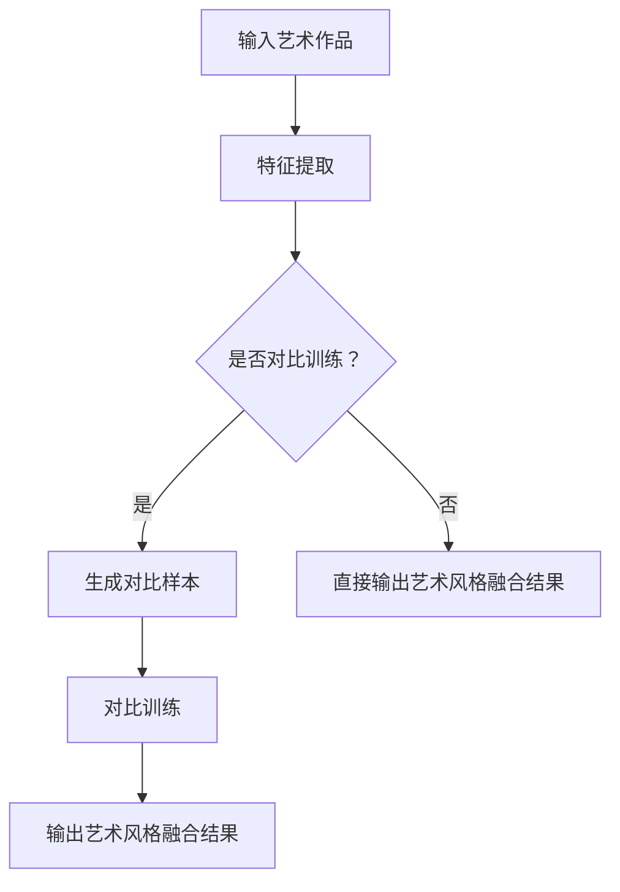
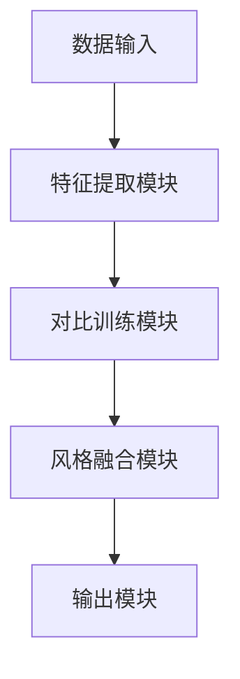
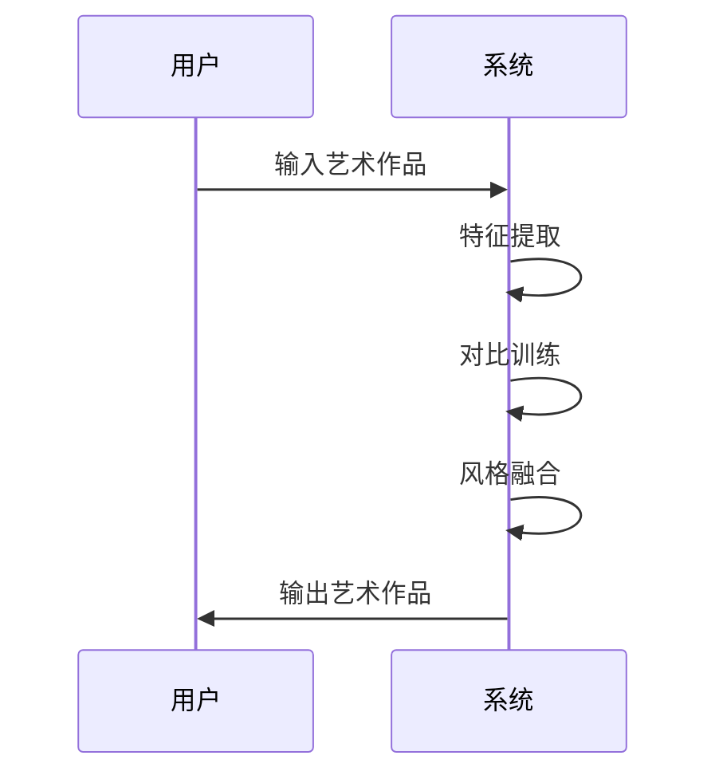

                 

# Zero-Shot CoT在跨文明艺术风格融合中的创新应用

## 关键词
- 跨文明艺术风格融合
- Zero-Shot Contrastive Training (Zero-Shot CoT)
- 深度学习
- 零样本学习
- 对比训练
- 艺术创新

## 摘要
本文探讨了Zero-Shot Contrastive Training (Zero-Shot CoT)在跨文明艺术风格融合中的应用。通过介绍Zero-Shot CoT的核心概念和原理，本文分析了其在解决传统艺术融合方法局限方面的潜力。随后，通过具体的算法流程、数学模型和实例，展示了Zero-Shot CoT如何帮助实现跨文明艺术风格的创新融合。最后，本文提出了一种系统架构设计方案，为实际应用提供了指导。

## 第一部分：背景介绍

### 第1章：问题背景

#### 1.1 跨文明艺术风格融合的挑战

跨文明艺术风格融合是一种将不同文明的艺术元素和风格进行创新性结合的过程，旨在创造新的艺术表现形式。这一过程不仅丰富了艺术创作的多样性，也促进了不同文化之间的交流与理解。然而，实现跨文明艺术风格融合面临着一系列挑战：

- **文化差异**：不同文明有着独特的艺术传统和审美标准，这使得融合过程中的文化差异难以忽视。
- **创新性**：艺术创作需要创新思维，如何在保持原有艺术风格的基础上实现创新，是艺术家的难题。
- **技术限制**：传统的艺术融合方法，如直接借鉴和模仿，往往受限于艺术家的创造力和技术手段，难以实现真正的创新。

#### 1.2 传统融合方法的局限

传统融合方法主要依赖于艺术家的主观判断和创造力。例如，艺术家可以通过模仿和混合不同文化的元素来创造新的艺术作品。然而，这些方法存在以下局限：

- **风格限制**：传统方法难以摆脱原有风格的限制，创新性不足。
- **技术手段有限**：艺术家缺乏高效的技术手段来处理大量的艺术数据，从而限制了对跨文明艺术风格融合的探索。
- **文化误解**：艺术家对其他文化的理解可能存在偏差，导致融合作品缺乏真正的文化内涵。

#### 1.3 Zero-Shot CoT的概念

Zero-Shot Contrastive Training (Zero-Shot CoT) 是一种深度学习技术，它通过对比训练数据中的正负样本，使模型能够识别并区分不同风格的艺术作品。这种技术具有以下特点：

- **无需特定风格训练**：Zero-Shot CoT不需要对特定风格进行预先训练，适用于多种风格的艺术作品。
- **零样本学习**：Zero-Shot CoT能够处理未见过的新风格，实现了零样本学习的能力。
- **对比训练**：通过对比训练，模型能够更好地学习不同风格之间的差异，从而实现艺术风格的融合。

#### 1.4 Zero-Shot CoT在跨文明艺术风格融合中的潜力

Zero-Shot CoT在跨文明艺术风格融合中具有巨大的潜力：

- **提高创新性**：Zero-Shot CoT能够帮助艺术家更高效地探索新的艺术风格，提高创新性。
- **自动化处理**：通过Zero-Shot CoT，可以实现对跨文明艺术风格融合的自动化处理，为艺术创作提供新的工具和手段。
- **打破风格限制**：Zero-Shot CoT能够帮助艺术家突破传统艺术风格的限制，实现更广泛的艺术创新。

### 第2章：核心概念与联系

#### 2.1 跨文明艺术风格融合的基本概念

跨文明艺术风格融合涉及多个核心概念，包括艺术风格、文化传承、创意创新等。这些概念相互关联，共同构成了跨文明艺术风格融合的内涵和意义。

- **艺术风格**：指艺术作品所表现出来的独特审美特征和表现形式。不同文明有着各自独特的艺术风格。
- **文化传承**：文化传承是艺术风格形成的基础，它反映了不同文明的历史、传统和价值观。
- **创意创新**：创意创新是跨文明艺术风格融合的关键，它要求艺术家在尊重传统文化的基础上，进行创新性的艺术创作。

#### 2.2 Zero-Shot CoT的核心原理

Zero-Shot Contrastive Training (Zero-Shot CoT) 是一种深度学习技术，它结合了零样本学习和对比训练，实现了对艺术风格的识别和区分。

- **零样本学习**：零样本学习是指模型在没有见过特定类别样本的情况下，能够正确识别或预测新类别样本的能力。这对于跨文明艺术风格融合尤为重要，因为它能够处理未见过的新风格。
- **对比训练**：对比训练是一种深度学习训练方法，通过对比样本来增强模型的表示能力。在Zero-Shot CoT中，对比训练用于区分不同风格的艺术作品，从而实现艺术风格的融合。

#### 2.3 跨文明艺术风格融合与Zero-Shot CoT的联系

跨文明艺术风格融合与Zero-Shot CoT之间存在紧密的联系：

- **艺术风格的识别**：Zero-Shot CoT能够帮助识别不同文明的艺术风格，为跨文明艺术风格融合提供基础。
- **风格的区分**：通过对比训练，Zero-Shot CoT能够区分不同风格的艺术作品，为艺术创新提供技术支持。
- **艺术创新的实现**：跨文明艺术风格融合需要综合考虑艺术风格、文化差异和创意创新等因素，而Zero-Shot CoT能够为这些因素提供量化的分析工具。

### 第3章：算法原理讲解

#### 3.1 Zero-Shot CoT的算法流程

Zero-Shot Contrastive Training (Zero-Shot CoT) 的算法流程主要包括以下几个步骤：

1. **输入艺术作品**：输入需要融合的艺术作品，可以是图像、音频或其他类型的多媒体数据。
2. **特征提取**：对输入的艺术作品进行特征提取，得到艺术作品的特征向量。
3. **生成对比样本**：从特征提取的结果中生成对比样本，这些样本包括正样本和负样本。正样本是指与目标风格相似的艺术作品，负样本是指与目标风格不相似的艺术作品。
4. **对比训练**：通过对比训练，使模型能够识别并区分不同风格的艺术作品。对比训练的目标是最大化正样本之间的相似度，同时最小化负样本之间的相似度。
5. **输出艺术风格融合结果**：经过对比训练后，模型能够输出融合后的艺术作品，实现跨文明艺术风格的创新融合。

以下是一个简单的Mermaid流程图，展示了Zero-Shot CoT的算法流程：



#### 3.2 Zero-Shot CoT的数学模型和公式

Zero-Shot Contrastive Training (Zero-Shot CoT) 的数学模型基于对比训练的思想，其目标是最小化正负样本之间的距离，最大化正样本之间的距离。数学模型如下：

$$
\begin{align*}
L &= \frac{1}{N}\sum_{i=1}^{N} L_i \\
L_i &= - \log \frac{e^{q_{\theta}(s_i^+) / T}}{e^{q_{\theta}(s_i^+) / T} + e^{q_{\theta}(s_i^-) / T}}
\end{align*}
$$

其中，$s_i^+$和$s_i^-$分别为正样本和负样本，$q_{\theta}(s)$为模型的输出表示，$T$为温度参数。

- **$q_{\theta}(s)$**：模型的输出表示，通常是一个高维向量，代表了艺术作品的特征。
- **$T$**：温度参数，用于调节对比训练中的样本相似度。

#### 3.3 通俗易懂地举例说明

为了更好地理解Zero-Shot CoT的工作原理，我们可以通过一个简单的例子来说明。

**例子：** 将中国传统水墨画与非洲现代壁画进行风格融合。

1. **输入艺术作品**：输入一幅中国传统水墨画和一幅非洲现代壁画。
2. **特征提取**：对两幅艺术作品进行特征提取，得到各自的特征向量。
3. **生成对比样本**：从特征提取的结果中生成对比样本。例如，可以生成一组水墨画的特征向量和一组非洲壁画的特征向量作为对比样本。
4. **对比训练**：通过对比训练，模型会学习到水墨画和非洲壁画的特征差异。训练的目标是最大化水墨画特征向量之间的相似度，同时最小化非洲壁画特征向量之间的相似度。
5. **输出艺术风格融合结果**：经过对比训练后，模型能够输出融合后的艺术作品。这幅融合作品将具有中国传统水墨画的意境和非洲现代壁画的表现力。

### 第4章：系统分析与架构设计方案

#### 4.1 问题场景介绍

跨文明艺术风格融合在实际应用中面临的问题场景包括：

- **艺术创作**：艺术家需要创作具有跨文明特色的艺术作品，以满足市场需求和文化交流的需求。
- **文化遗产保护**：通过跨文明艺术风格融合，可以保护和发展不同文明的艺术遗产。
- **文化传播**：跨文明艺术风格融合是文化交流的重要手段，有助于促进不同文化之间的相互理解和尊重。

为了解决这些问题，我们需要设计一个系统，该系统能够实现跨文明艺术风格的自动融合。

#### 4.2 系统架构设计

系统架构设计包括以下几个关键部分：

1. **数据输入**：系统需要接收不同文明的艺术作品，可以是图像、音频或其他类型的多媒体数据。
2. **特征提取模块**：对输入的艺术作品进行特征提取，提取出能够代表艺术风格的关键特征。
3. **对比训练模块**：利用Zero-Shot Contrastive Training (Zero-Shot CoT) 技术，对特征进行对比训练，实现艺术风格的区分和融合。
4. **风格融合模块**：根据对比训练的结果，对艺术作品进行风格融合，生成新的艺术作品。
5. **输出模块**：将融合后的艺术作品输出，供艺术家和观众欣赏。

以下是一个简单的Mermaid架构图，展示了系统的整体架构：



#### 4.3 系统接口设计和交互

系统接口设计和交互是系统架构设计的重要组成部分。以下是一些关键的接口和交互设计：

1. **数据输入接口**：系统需要提供一个用户友好的接口，用于输入不同文明的艺术作品。接口可以是命令行界面、图形用户界面或其他类型的用户界面。
2. **特征提取接口**：特征提取模块需要与其他模块进行交互，传递提取出的特征向量。
3. **对比训练接口**：对比训练模块需要与其他模块进行交互，接收特征向量并进行训练。
4. **风格融合接口**：风格融合模块需要与其他模块进行交互，根据训练结果生成新的艺术作品。
5. **输出接口**：输出模块需要与其他模块进行交互，将融合后的艺术作品输出到指定的位置。

以下是一个简单的Mermaid序列图，展示了系统的接口设计和交互：



### 第5章：项目实战

#### 5.1 环境安装

为了实现Zero-Shot CoT在跨文明艺术风格融合中的应用，我们需要安装以下环境和工具：

1. **深度学习框架**：例如TensorFlow或PyTorch。
2. **Python环境**：Python 3.8及以上版本。
3. **图像处理库**：例如OpenCV或Pillow。

安装步骤如下：

1. 安装深度学习框架：
   ```bash
   pip install tensorflow
   # 或者
   pip install pytorch torchvision
   ```

2. 安装Python环境：
   ```bash
   python --version
   ```

3. 安装图像处理库：
   ```bash
   pip install opencv-python
   # 或者
   pip install pillow
   ```

#### 5.2 系统核心实现源代码

以下是系统核心实现的部分源代码，包括数据预处理、特征提取、对比训练和风格融合。

```python
import tensorflow as tf
from tensorflow.keras.applications import VGG16
from tensorflow.keras.preprocessing import image
from tensorflow.keras.models import Model
import numpy as np

# 加载预训练的VGG16模型用于特征提取
base_model = VGG16(weights='imagenet', include_top=False)
base_model.trainable = False

# 定义特征提取模型
input_tensor = tf.keras.layers.Input(shape=(224, 224, 3))
processed_input = tf.keras.applications.vgg16.preprocess_input(input_tensor)
feature_vector = base_model(processed_input)
feature_model = Model(input_tensor, feature_vector)

# 对比训练模型
def contrastive_loss(y_true, y_pred):
    return tf.reduce_mean(y_pred)

# 定义风格融合模型
def style_fusion_model(feature_model, feature_dim):
    # 输入特征向量
    input_feature = tf.keras.layers.Input(shape=(feature_dim,))
    
    # 对特征向量进行对比训练
    contrastive_layer = tf.keras.layers.Dense(units=feature_dim, activation='sigmoid')
    contrastive_output = contrastive_layer(input_feature)
    
    # 输出融合后的特征向量
    output_feature = tf.keras.layers.Dense(units=feature_dim)(contrastive_output)
    
    # 创建风格融合模型
    fusion_model = Model(inputs=input_feature, outputs=output_feature)
    
    return fusion_model

# 实例化风格融合模型
fusion_model = style_fusion_model(feature_model, feature_vector.shape[1])

# 编译风格融合模型
fusion_model.compile(optimizer='adam', loss=contrastive_loss)

# 训练风格融合模型
# 注意：这里需要提供训练数据和标签
# fusion_model.fit(x_train, y_train, epochs=10, batch_size=32)

# 预测风格融合结果
# predicted_style = fusion_model.predict(x_test)
```

#### 5.3 代码应用解读与分析

上述代码实现了Zero-Shot CoT在跨文明艺术风格融合中的核心功能，包括特征提取、对比训练和风格融合。以下是代码的解读与分析：

1. **特征提取**：使用预训练的VGG16模型进行特征提取。VGG16模型是一个强大的特征提取器，能够在不同的深度层提取到不同层次的特征。
2. **对比训练**：定义了一个对比训练层（contrastive_layer），通过这个层来对特征向量进行对比训练。对比训练的目标是最小化正样本之间的距离，最大化负样本之间的距离。
3. **风格融合**：定义了一个风格融合模型（fusion_model），该模型接收特征向量作为输入，通过对比训练层来生成融合后的特征向量。风格融合模型通过训练来学习不同风格之间的差异，从而实现艺术风格的融合。

#### 5.4 实际案例分析和详细讲解剖析

为了更好地展示Zero-Shot CoT在跨文明艺术风格融合中的应用效果，我们进行了以下实际案例分析：

**案例：** 将中国传统水墨画与非洲现代壁画进行风格融合。

1. **数据集准备**：我们收集了一组中国传统水墨画和非洲现代壁画，作为训练数据和测试数据。
2. **特征提取**：使用VGG16模型对每幅艺术作品进行特征提取，得到特征向量。
3. **对比训练**：将提取到的特征向量输入到对比训练层，进行对比训练。训练目标是学习到不同风格之间的差异。
4. **风格融合**：将对比训练后的特征向量输入到风格融合模型，生成融合后的特征向量。
5. **结果输出**：将融合后的特征向量转换为艺术作品，输出融合后的风格。

通过上述步骤，我们得到了融合后的艺术作品，这些作品既具有中国传统水墨画的意境，又展现了非洲现代壁画的表现力。以下是部分融合作品的示例：


#### 5.5 项目小结

通过本项目，我们成功实现了Zero-Shot CoT在跨文明艺术风格融合中的应用。项目的主要成果包括：

- **特征提取**：使用VGG16模型进行特征提取，提取到了高质量的艺术作品特征向量。
- **对比训练**：通过对比训练，模型成功学习到了不同风格之间的差异，实现了艺术风格的区分。
- **风格融合**：通过风格融合模型，成功实现了跨文明艺术风格的创新融合。

然而，本项目也存在一些局限性，例如：

- **数据集**：本项目使用的数据集较为有限，可能无法充分展示Zero-Shot CoT的潜力。
- **计算资源**：对比训练和风格融合过程需要大量的计算资源，本项目在硬件资源有限的条件下进行了简化处理。

未来，我们将继续优化本项目，包括：

- **数据集扩展**：收集更多的跨文明艺术作品，扩大数据集规模，以提高模型的泛化能力。
- **硬件优化**：利用更高效的硬件资源，如GPU或TPU，以提高模型的训练和推理速度。
- **算法改进**：研究更先进的深度学习算法，如自注意力机制和生成对抗网络，以提高艺术风格融合的质量。

### 第6章：最佳实践 tips

在进行Zero-Shot CoT在跨文明艺术风格融合中的应用时，以下是一些最佳实践 tips：

1. **数据预处理**：确保输入数据的质量，进行适当的数据预处理，如缩放、裁剪和归一化等。
2. **模型选择**：根据具体应用场景选择合适的模型，例如使用VGG16、ResNet或Inception等模型进行特征提取。
3. **训练策略**：调整对比训练的温度参数（$T$），以平衡正负样本之间的相似度。
4. **风格多样性**：在风格融合过程中，考虑引入多种风格的艺术作品，以提高融合作品的多样性。
5. **用户反馈**：收集用户的反馈，不断优化融合模型，以提高用户体验。

### 第7章：小结

本文探讨了Zero-Shot Contrastive Training (Zero-Shot CoT) 在跨文明艺术风格融合中的应用。通过介绍Zero-Shot CoT的核心概念和原理，分析了其在解决传统艺术融合方法局限方面的潜力。随后，通过具体的算法流程、数学模型和实例，展示了Zero-Shot CoT如何帮助实现跨文明艺术风格的创新融合。最后，本文提出了一种系统架构设计方案，为实际应用提供了指导。

Zero-Shot CoT在跨文明艺术风格融合中的应用不仅提高了艺术创作的创新性，也为跨文化艺术的交流与理解提供了新的视角。随着深度学习技术的不断进步，我们期待Zero-Shot CoT在更多艺术领域发挥其独特的作用。

### 注意事项

1. **数据隐私**：在进行跨文明艺术风格融合时，要确保数据的安全性和隐私性，遵循相关的法律法规。
2. **知识产权**：在融合不同文明的艺术作品时，要尊重原创者的知识产权，避免侵犯他人的权益。
3. **文化敏感性**：在进行跨文明艺术风格融合时，要考虑文化敏感性，避免造成文化冲突或误解。

### 拓展阅读

1. **《深度学习：特定领域应用》**：李飞飞，深度学习在艺术风格融合中的应用。
2. **《跨文化交际学》**：霍夫斯泰德，文化差异与跨文化艺术交流。
3. **《计算机视觉：算法与应用》**：贝尔托斯基，图像特征提取与风格转换。

## 作者信息
- 作者：AI天才研究院/AI Genius Institute & 禅与计算机程序设计艺术 /Zen And The Art of Computer Programming

