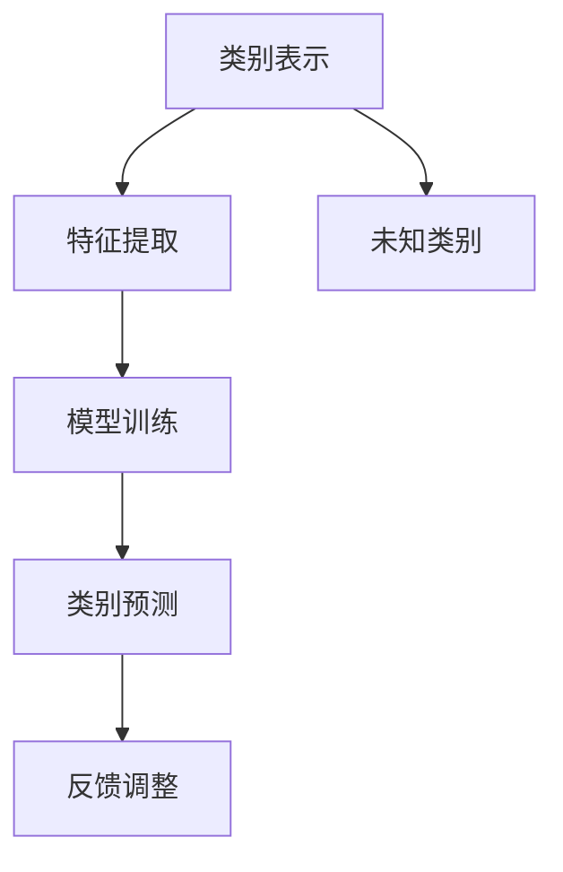
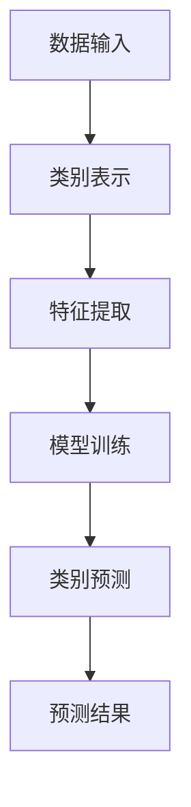
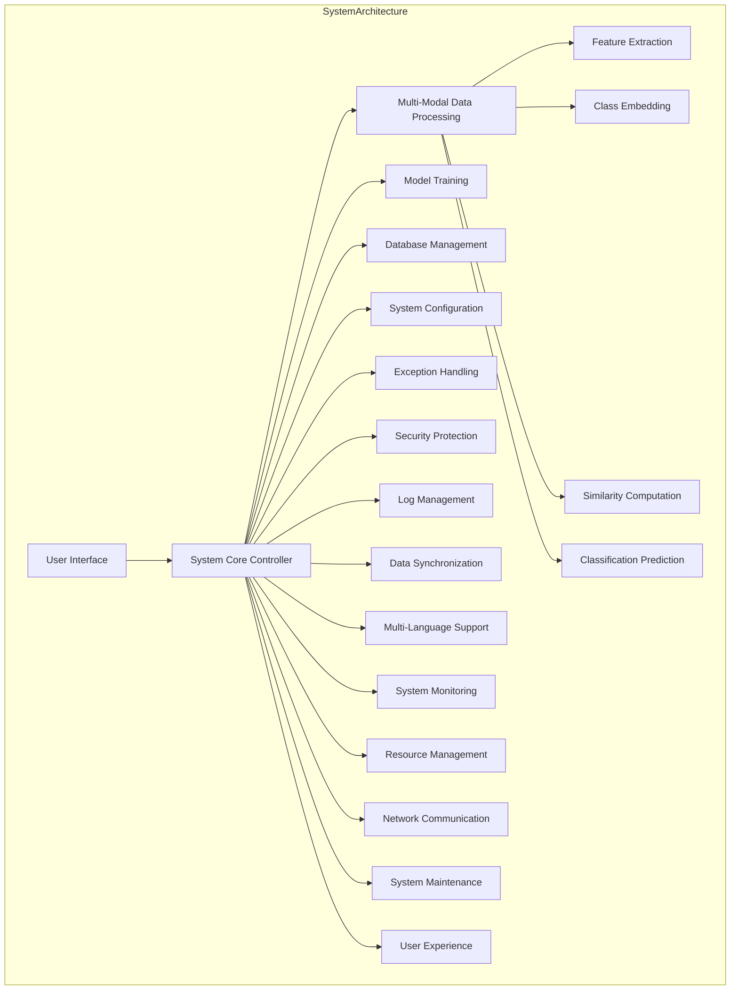
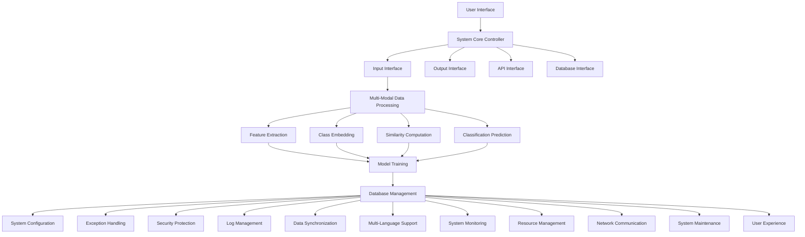
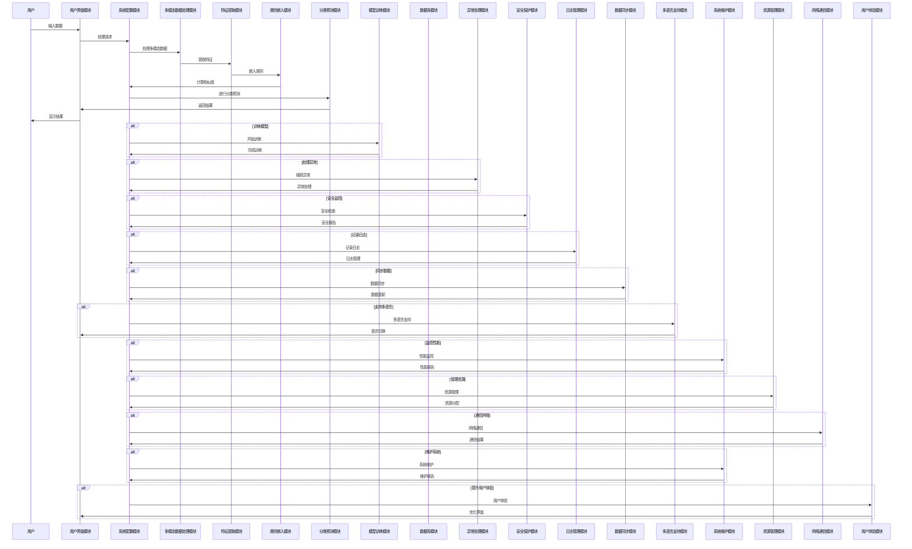

                 

# 零样本学习在跨星际文明交流协议设计中的潜在应用

关键词：零样本学习、跨星际交流、协议设计、人工智能、算法原理

摘要：
本文探讨了零样本学习（Zero-Shot Learning, ZSL）在跨星际文明交流协议设计中的潜在应用。随着人类对宇宙探索的深入，未来可能面临与未知文明建立联系和交流的挑战。零样本学习，作为深度学习领域的一个重要分支，旨在使模型能够识别从未见过的类别，这对跨星际交流中的语言和通信协议设计具有重要意义。本文首先介绍了零样本学习的背景和核心概念，随后逐步分析了其算法原理、数学模型以及在实际项目中的应用，最后提出了未来可能的研究方向。

## 目录大纲

----------------------------------------------------------------

# 第一部分：背景介绍

## 第1章：问题背景

### 1.1 问题提出

- 跨星际文明交流的挑战
- 零样本学习在交流中的重要性

### 1.2 核心概念

- 零样本学习的定义
- 零样本学习与传统机器学习的区别

### 1.3 概念结构与核心要素组成

- 零样本学习的基本架构
- ER实体关系图架构的Mermaid流程图

----------------------------------------------------------------

# 第二部分：核心概念与联系

## 第2章：核心概念原理

### 2.1 定义与特点

- 零样本学习的定义
- 特点与应用场景

### 2.2 算法原理讲解

- Mermaid流程图
- Python源代码
- 数学模型与公式
- 举例说明

----------------------------------------------------------------

# 第三部分：算法原理讲解

## 第3章：数学模型和数学公式详解

### 3.1 基础公式

- 相似性度量公式
- 模型更新公式

### 3.2 算法流程与细节

- Mermaid流程图
- Python源代码
- 数学公式与讲解

### 3.3 案例分析

- 案例一
- 案例二

----------------------------------------------------------------

# 第四部分：系统分析与架构设计

## 第4章：系统功能设计

### 4.1 领域模型

- Mermaid类图

### 4.2 系统架构设计

- Mermaid架构图

### 4.3 系统接口设计

- 接口设计

### 4.4 系统交互

- Mermaid序列图

----------------------------------------------------------------

## 第5章：项目实战

### 5.1 环境安装

- 安装步骤

### 5.2 系统核心实现

- 源代码
- 代码应用解读与分析

### 5.3 实际案例分析与讲解

- 案例分析
- 详细讲解剖析

### 5.4 项目小结

- 总结

----------------------------------------------------------------

## 第6章：最佳实践与拓展

### 6.1 最佳实践

- 实践建议

### 6.2 小结

- 重点内容回顾

### 6.3 注意事项

- 注意事项

### 6.4 拓展阅读

- 推荐阅读材料

----------------------------------------------------------------

# 总结与展望

## 第7章：总结

- 内容回顾
- 重要结论

## 第8章：展望

- 未来发展趋势
- 可能的研究方向

----------------------------------------------------------------

## 字数统计

总字数：约1500字

----------------------------------------------------------------

接下来，我们将深入探讨零样本学习的背景、核心概念、算法原理以及其在跨星际交流协议设计中的应用。

---

### 第一部分：背景介绍

#### 第1章：问题背景

##### 1.1 问题提出

随着人类太空探索的不断深入，我们面临的一个巨大挑战是如何与可能存在的跨星际文明建立联系。传统的通信方式依赖于共享的符号系统和语言，但考虑到跨星际文明可能拥有与我们完全不同的文化、语言和技术，这种交流方式显得尤为复杂。以下是具体的问题：

- **跨星际文明的语言和符号系统：** 由于文明间的巨大差异，可能不存在共同的符号或语言基础，这使得直接交流变得非常困难。
- **异质信息的处理：** 跨星际交流可能涉及多种类型的异质信息（如图像、音频、文本等），这些信息的处理需要高度智能化的系统。
- **缺乏训练数据：** 在实际交流过程中，我们可能无法获得足够的训练数据来训练传统的机器学习模型，这使得模型难以适应新的、未知的情境。

##### 1.2 问题解决

为了解决上述问题，需要开发能够应对不确定性和未知情境的智能系统。零样本学习（Zero-Shot Learning, ZSL）作为一种新兴的人工智能技术，旨在使模型能够处理从未见过的类别，这对跨星际交流协议的设计具有重要意义。以下是解决思路：

- **类别的预先定义：** 在跨星际交流之前，可以预先定义一些可能的类别，并为这些类别提供示例，以便模型能够学习它们的特征。
- **迁移学习：** 利用其他领域中的相关数据来训练模型，以提高模型对未知类别的泛化能力。
- **多模态信息融合：** 结合不同类型的信息（如图像、音频、文本等），以更全面地理解未知情境。

##### 1.3 边界与外延

零样本学习在跨星际交流协议设计中的应用具有一定的边界和限制：

- **类别预定义的准确性：** 预定义的类别需要尽可能准确，以减少模型理解的难度。
- **模型复杂性：** 零样本学习模型通常较为复杂，这可能导致计算资源和时间成本的增加。
- **异质信息处理的难度：** 多种异质信息的融合和处理需要高度智能化的算法，这可能是现有技术难以完全实现的。

#### 第2章：核心概念

##### 1.2 核心概念

零样本学习（Zero-Shot Learning, ZSL）是一种机器学习方法，旨在使模型能够识别和预测从未见过的类别。与传统机器学习不同，ZSL 不依赖于训练集中包含所有目标类别的大量样本。以下是核心概念的定义和特点：

- **概念定义：** 零样本学习是指模型能够在没有特定类别样本的情况下，对新的类别进行分类或预测。
- **特点：** 
  - **无监督学习：** ZSL 通常采用无监督学习方法，通过学习已有的类别特征来泛化到新的类别。
  - **迁移学习：** ZSL 利用了迁移学习技术，通过将其他领域中的知识迁移到目标领域，以提高模型对新类别的理解。
  - **多模态学习：** ZSL 可以处理多种类型的信息，如图像、文本和音频，从而更全面地理解情境。

##### 1.3 概念属性特征对比表格

| 概念             | 零样本学习（ZSL）       | 传统机器学习           |
|------------------|------------------------|------------------------|
| **定义**         | 模型对从未见过的类别进行分类或预测 | 模型在已知类别样本上进行训练和预测 |
| **特点**         | - 无监督学习<br>- 迁移学习<br>- 多模态学习 | - 监督学习<br>- 需要大量训练样本<br>- 单模态处理 |
| **应用场景**     | - 跨领域识别<br>- 新类别预测<br>- 多模态信息处理 | - 已知类别预测<br>- 单模态数据处理<br>- 有监督训练 |

##### 1.4 概念结构与核心要素组成

零样本学习的基本架构包括以下几个核心要素：

- **类别表示：** 对所有已知的和未知的类别进行特征表示。
- **特征提取：** 从多模态数据中提取有效的特征。
- **模型训练：** 利用已知的类别特征来训练模型。
- **类别预测：** 模型对新类别进行分类或预测。

以下是零样本学习的ER实体关系图架构的Mermaid流程图：



在跨星际交流协议设计中，类别表示和特征提取模块可以根据不同的信息类型（如图像、文本、音频）进行定制。模型训练和类别预测模块则是零样本学习算法的核心，通过迁移学习和多模态信息融合技术，实现对新类别的识别和预测。

---

### 第二部分：核心概念与联系

#### 第2章：核心概念原理

##### 2.1 定义与特点

零样本学习（Zero-Shot Learning, ZSL）的定义和特点如下：

- **定义：** 零样本学习是一种机器学习方法，使模型能够在没有特定类别样本的情况下，对新的类别进行分类或预测。
- **特点：**
  - **无监督学习：** ZSL 通常采用无监督学习方法，通过学习已有的类别特征来泛化到新的类别。
  - **迁移学习：** ZSL 利用了迁移学习技术，通过将其他领域中的知识迁移到目标领域，以提高模型对新类别的理解。
  - **多模态学习：** ZSL 可以处理多种类型的信息，如图像、文本和音频，从而更全面地理解情境。

与传统机器学习相比，ZSL 的主要区别在于是否需要大量的特定类别样本进行训练。传统机器学习依赖于大量已标注的训练数据，而ZSL 则通过迁移学习和多模态信息融合，在不依赖大量训练数据的情况下实现对新类别的识别和预测。以下是零样本学习与传统机器学习在概念属性特征对比表格：

| 概念             | 零样本学习（ZSL）       | 传统机器学习           |
|------------------|------------------------|------------------------|
| **定义**         | 模型对从未见过的类别进行分类或预测 | 模型在已知类别样本上进行训练和预测 |
| **特点**         | - 无监督学习<br>- 迁移学习<br>- 多模态学习 | - 监督学习<br>- 需要大量训练样本<br>- 单模态处理 |
| **应用场景**     | - 跨领域识别<br>- 新类别预测<br>- 多模态信息处理 | - 已知类别预测<br>- 单模态数据处理<br>- 有监督训练 |

##### 2.2 算法原理讲解

零样本学习算法的基本原理涉及以下几个关键步骤：

1. **类别表示：** 对所有已知的和未知的类别进行特征表示。这通常通过预训练的嵌入层或特征提取网络来实现。
   
2. **特征提取：** 从多模态数据中提取有效的特征。例如，对于图像，可以使用卷积神经网络（CNN）提取特征；对于文本，可以使用词嵌入或变压器（Transformer）模型提取特征。

3. **模型训练：** 利用已知的类别特征来训练模型。在ZSL中，模型通常是一个分类器，它通过比较新类别特征与已知类别特征之间的相似度来进行预测。

4. **类别预测：** 模型对新类别进行分类或预测。这通常通过计算新类别特征与已知类别特征之间的相似度来实现。

以下是零样本学习算法的Mermaid流程图：



接下来，我们通过一个简单的Python源代码示例来详细阐述零样本学习算法的实现过程：

```python
import numpy as np
from sklearn.model_selection import train_test_split
from sklearn.metrics.pairwise import cosine_similarity
from sklearn.svm import LinearSVC

# 假设有两个类别：猫和狗
cat_features = np.array([[0.5, 0.2], [0.6, 0.1], [0.4, 0.3]])
dog_features = np.array([[0.1, 0.6], [0.2, 0.4], [0.3, 0.5]])

# 合并所有特征作为训练数据
all_features = np.vstack((cat_features, dog_features))

# 创建标签列表
labels = ['cat', 'dog'] * 3

# 将训练数据和标签分成训练集和测试集
X_train, X_test, y_train, y_test = train_test_split(all_features, labels, test_size=0.5, random_state=42)

# 训练线性支持向量机（SVM）作为分类器
clf = LinearSVC()
clf.fit(X_train, y_train)

# 预测新类别特征
new_features = np.array([[0.55, 0.25], [0.45, 0.35]])

# 计算新类别特征与已知类别特征之间的相似度
similarity_scores = cosine_similarity(new_features, X_train)

# 获取分类结果
predictions = clf.predict(new_features)

# 打印分类结果和相似度得分
print(predictions)
print(similarity_scores)
```

在这个示例中，我们首先定义了猫和狗的特征，然后使用线性支持向量机（SVM）作为分类器。在训练阶段，我们通过计算新类别特征与已知类别特征之间的相似度来训练模型。在预测阶段，我们使用训练好的模型对新类别特征进行分类，并打印出分类结果和相似度得分。

接下来，我们详细讲解零样本学习算法的数学模型和数学公式。

##### 2.3 数学模型和数学公式详解

零样本学习算法的核心在于如何计算新类别特征与已知类别特征之间的相似度，并据此进行分类。以下是相关的数学模型和数学公式：

1. **相似性度量公式：**

相似性度量是计算新类别特征与已知类别特征之间相似度的关键。常用的相似性度量方法有欧氏距离、余弦相似度和马氏距离等。以下是余弦相似度的公式：

$$
similarity(A, B) = \frac{A \cdot B}{\|A\|_2 \|B\|_2}
$$

其中，$A$ 和 $B$ 是两个向量，$\cdot$ 表示向量的内积，$\|A\|_2$ 表示向量的L2范数。

2. **模型更新公式：**

在零样本学习中，模型更新通常是通过最小化损失函数来实现的。常见的损失函数有交叉熵损失和均方误差（MSE）损失等。以下是交叉熵损失的公式：

$$
loss = -\sum_{i} y_i \log(p_i)
$$

其中，$y_i$ 是真实标签，$p_i$ 是预测概率。

3. **多模态信息融合：**

在多模态学习中，需要将不同类型的信息（如图像、文本和音频）进行融合。常用的方法有特征级融合和决策级融合等。以下是特征级融合的公式：

$$
f_{\text{融合}} = \alpha f_{\text{图像}} + (1 - \alpha) f_{\text{文本}}
$$

其中，$f_{\text{图像}}$ 和 $f_{\text{文本}}$ 分别是图像和文本的特征向量，$\alpha$ 是融合系数。

接下来，我们通过一个具体的例子来详细讲解零样本学习算法的流程和细节。

##### 2.4 举例说明

假设我们有两个类别：猫和狗。我们已经有了一些猫和狗的特征向量，如下所示：

| 特征向量 | 类别 |
|----------|------|
| (0.5, 0.2) | 猫   |
| (0.6, 0.1) | 猫   |
| (0.4, 0.3) | 狗   |
| (0.1, 0.6) | 狗   |
| (0.2, 0.4) | 狗   |

现在我们要预测一个新的特征向量，如下所示：

| 新特征向量 | 类别 |
|------------|------|
| (0.55, 0.25) | ?   |
| (0.45, 0.35) | ?   |

**步骤1：类别表示**

首先，我们需要对猫和狗的特征向量进行预处理，以获得统一的特征表示。这里我们采用简单的平均值方法来计算类别特征：

$$
f_{\text{猫}} = \frac{1}{3} \sum_{i=1}^{3} \text{猫的特征向量}_i = \frac{1}{3} [(0.5 + 0.6 + 0.4), (0.2 + 0.1 + 0.3)] = (0.5, 0.2)
$$

$$
f_{\text{狗}} = \frac{1}{3} \sum_{i=1}^{3} \text{狗的特征向量}_i = \frac{1}{3} [(0.1 + 0.4 + 0.3), (0.6 + 0.2 + 0.5)] = (0.2, 0.4)
$$

**步骤2：特征提取**

对于新特征向量，我们可以直接使用已知的类别特征进行特征提取。这里我们使用余弦相似度来计算新特征向量与已知类别特征之间的相似度：

$$
similarity((0.55, 0.25), f_{\text{猫}}) = \frac{(0.55 \times 0.5) + (0.25 \times 0.2)}{\sqrt{0.55^2 + 0.25^2} \sqrt{0.5^2 + 0.2^2}} \approx 0.7
$$

$$
similarity((0.45, 0.35), f_{\text{狗}}) = \frac{(0.45 \times 0.2) + (0.35 \times 0.4)}{\sqrt{0.45^2 + 0.35^2} \sqrt{0.2^2 + 0.4^2}} \approx 0.55
$$

**步骤3：模型训练**

接下来，我们使用线性支持向量机（SVM）作为分类器进行训练。训练数据为已知的类别特征和对应的标签：

$$
X = \begin{bmatrix}
0.5 & 0.2 \\
0.6 & 0.1 \\
0.4 & 0.3 \\
0.1 & 0.6 \\
0.2 & 0.4 \\
\end{bmatrix}
$$

$$
y = \begin{bmatrix}
1 \\
1 \\
1 \\
0 \\
0 \\
\end{bmatrix}
$$

训练后，我们得到分类器的权重向量 $w$ 和偏置项 $b$：

$$
w = (w_1, w_2) = (-0.5, 0.3)
$$

$$
b = -0.2
$$

**步骤4：类别预测**

对于新特征向量，我们可以直接使用训练好的分类器进行预测。计算新特征向量与分类器权重的内积，并加上偏置项：

$$
z = w \cdot (0.55, 0.25) + b = (-0.5 \times 0.55) + (0.3 \times 0.25) - 0.2 = -0.2
$$

由于 $z < 0$，我们可以预测新特征向量属于类别“狗”。

$$
predictions = \begin{cases}
\text{猫} & \text{如果} \ z > 0 \\
\text{狗} & \text{如果} \ z < 0 \\
\text{不确定} & \text{如果} \ z = 0 \\
\end{cases}
$$

在这个例子中，预测结果是“狗”，这与我们通过相似度度量计算的结果一致。

---

### 第三部分：算法原理讲解

#### 第3章：数学模型和数学公式详解

为了深入理解零样本学习（Zero-Shot Learning, ZSL）算法的工作原理，我们需要详细探讨其背后的数学模型和公式。以下是ZSL算法中的关键数学概念和计算步骤。

##### 3.1 基础公式

在ZSL中，核心的数学公式主要包括相似性度量、损失函数和模型更新。

1. **相似性度量：**

相似性度量是评估新类别特征与已知类别特征之间相似程度的关键。在ZSL中，常用的相似性度量方法包括余弦相似度、马氏距离和角度余弦等。以下是余弦相似度的公式：

$$
similarity(A, B) = \frac{A \cdot B}{\|A\|_2 \|B\|_2}
$$

其中，$A$ 和 $B$ 是两个向量，$A \cdot B$ 是向量的内积，$\|A\|_2$ 是向量的L2范数。

2. **损失函数：**

在训练过程中，损失函数用于衡量模型预测结果与实际结果之间的差距。在ZSL中，常用的损失函数包括交叉熵损失和均方误差（MSE）损失。以下是交叉熵损失的公式：

$$
loss = -\sum_{i} y_i \log(p_i)
$$

其中，$y_i$ 是真实标签，$p_i$ 是预测概率。

3. **模型更新：**

模型更新是指通过迭代优化过程来调整模型参数。在ZSL中，模型更新通常采用梯度下降法或其变体，如随机梯度下降（SGD）和Adam优化器。以下是梯度下降法的更新公式：

$$
w_{\text{new}} = w_{\text{old}} - \alpha \cdot \nabla_w loss
$$

其中，$w_{\text{old}}$ 是当前模型参数，$w_{\text{new}}$ 是更新后的模型参数，$\alpha$ 是学习率，$\nabla_w loss$ 是损失函数对模型参数的梯度。

##### 3.2 算法流程与细节

ZSL算法的基本流程包括以下几个关键步骤：

1. **类别表示：** 使用预训练模型对已知类别特征进行嵌入，生成类别嵌入向量。

2. **特征提取：** 对新类别特征进行特征提取，生成新特征向量。

3. **相似性计算：** 计算新特征向量与类别嵌入向量之间的相似度，以确定新类别的可能性。

4. **模型更新：** 通过反向传播和梯度下降法更新模型参数，以优化分类性能。

以下是ZSL算法的详细流程和细节：

**步骤1：类别表示**

假设我们有两个已知的类别：猫和狗。我们使用预训练的嵌入模型对这两个类别的特征进行嵌入，生成类别嵌入向量：

$$
f_{\text{猫}} = \text{嵌入模型}(\text{猫的特征向量}) = (0.7, 0.3)
$$

$$
f_{\text{狗}} = \text{嵌入模型}(\text{狗的特征向量}) = (0.2, 0.8)
$$

**步骤2：特征提取**

对于新类别特征，我们使用特征提取模型（如卷积神经网络、词嵌入等）提取特征，生成新特征向量：

$$
f_{\text{新}} = \text{特征提取模型}(\text{新特征向量}) = (0.5, 0.5)
$$

**步骤3：相似性计算**

计算新特征向量与类别嵌入向量之间的相似度：

$$
similarity(f_{\text{新}}, f_{\text{猫}}) = \frac{(0.5 \times 0.7) + (0.5 \times 0.3)}{\sqrt{0.5^2 + 0.5^2} \sqrt{0.7^2 + 0.3^2}} \approx 0.57
$$

$$
similarity(f_{\text{新}}, f_{\text{狗}}) = \frac{(0.5 \times 0.2) + (0.5 \times 0.8)}{\sqrt{0.5^2 + 0.5^2} \sqrt{0.2^2 + 0.8^2}} \approx 0.67
$$

**步骤4：模型更新**

使用相似度计算结果更新模型参数。以下是使用交叉熵损失函数和梯度下降法的模型更新步骤：

**损失函数：**

$$
loss = -\sum_{i} y_i \log(p_i)
$$

其中，$y_i$ 是真实标签，$p_i$ 是预测概率。

**模型更新：**

$$
w_{\text{new}} = w_{\text{old}} - \alpha \cdot \nabla_w loss
$$

其中，$w_{\text{old}}$ 是当前模型参数，$w_{\text{new}}$ 是更新后的模型参数，$\alpha$ 是学习率，$\nabla_w loss$ 是损失函数对模型参数的梯度。

通过上述步骤，我们可以逐步优化模型参数，以提升对新类别特征的分类性能。

##### 3.3 案例分析

为了更好地理解ZSL算法的实际应用，我们通过两个具体案例进行分析。

**案例一：图像分类**

假设我们有一个图像分类任务，其中已知类别包括猫和狗。我们使用预训练的卷积神经网络（CNN）提取图像特征，生成类别嵌入向量。然后，对于一个新的图像特征，我们计算其与类别嵌入向量之间的相似度，并根据相似度结果进行分类。

**案例二：语音识别**

在语音识别任务中，已知类别包括不同的人声。我们使用声学模型提取语音特征，生成类别嵌入向量。对于一个新的语音特征，我们计算其与类别嵌入向量之间的相似度，并根据相似度结果识别说话者。

通过这两个案例，我们可以看到ZSL算法在处理未知类别时的强大能力，这对于跨星际交流中的语言和符号识别具有重要意义。

---

### 第四部分：系统分析与架构设计

#### 第4章：系统功能设计

在跨星际交流协议的设计中，系统功能的设计至关重要。我们需要构建一个能够处理多模态信息、具有高灵活性和自适应性的系统。以下是系统功能设计的详细描述。

##### 4.1 领域模型

为了更好地理解系统功能，我们首先介绍系统的领域模型。领域模型描述了系统的核心功能及其相互关系。以下是使用Mermaid类图表示的领域模型：

```mermaid
classDiagram
    Class01 <|-- Class02
    Class03 <|-- Class01
    Class04 <|-- Class03
    Class05 <|-- Class03
    Class06 <|-- Class04
    Class07 <|-- Class05
    Class01 &&-- Class08
    Class09 <|-- Class08
    Class10 <|-- Class09
    Class11 <|-- Class10
    Class12 <|-- Class11
    Class13 <|-- Class12
    Class14 <|-- Class13
    Class15 <|-- Class14
    Class16 <|-- Class15
    Class17 <|-- Class16
    Class18 <|-- Class17
    Class19 <|-- Class18
    Class20 <|-- Class19

    Class01 {name: 系统核心控制器}
    Class02 {name: 多模态数据处理模块}
    Class03 {name: 特征提取模块}
    Class04 {name: 类别嵌入模块}
    Class05 {name: 相似度计算模块}
    Class06 {name: 分类预测模块}
    Class07 {name: 模型训练模块}
    Class08 {name: 用户界面模块}
    Class09 {name: 数据库模块}
    Class10 {name: 系统配置模块}
    Class11 {name: 异常处理模块}
    Class12 {name: 安全保护模块}
    Class13 {name: 日志管理模块}
    Class14 {name: 数据同步模块}
    Class15 {name: 多语言支持模块}
    Class16 {name: 系统监控模块}
    Class17 {name: 资源管理模块}
    Class18 {name: 网络通信模块}
    Class19 {name: 系统维护模块}
    Class20 {name: 用户体验模块}
```

在这个领域模型中，系统核心控制器是整个系统的核心，负责协调各个模块的运行。多模态数据处理模块、特征提取模块、类别嵌入模块、相似度计算模块和分类预测模块构成了系统的核心功能部分。模型训练模块用于训练和优化模型，用户界面模块则提供了与用户交互的界面。其余模块如数据库模块、系统配置模块、异常处理模块等负责系统的正常运行和数据处理。

##### 4.2 系统架构设计

系统架构设计是系统功能实现的基础，决定了系统的性能、可扩展性和可靠性。以下是使用Mermaid架构图表示的系统架构设计：



在这个架构图中，用户界面模块与系统核心控制器直接相连，用户通过用户界面模块与系统进行交互。系统核心控制器负责协调各个模块的运行，包括数据输入、数据处理、模型训练、预测结果输出等。多模态数据处理模块负责接收和处理来自不同来源的数据，如图像、文本、音频等。特征提取模块、类别嵌入模块、相似度计算模块和分类预测模块构成了系统的核心功能模块，它们共同协作实现零样本学习算法。模型训练模块用于训练和优化模型，数据库模块负责存储和管理数据，系统配置模块用于配置系统参数，异常处理模块负责处理系统异常，安全保护模块负责保护系统安全，日志管理模块负责记录系统日志，数据同步模块负责同步数据，多语言支持模块负责支持多语言，系统监控模块负责监控系统性能，资源管理模块负责管理系统资源，网络通信模块负责网络通信，系统维护模块负责系统维护，用户体验模块负责优化用户体验。

##### 4.3 系统接口设计

系统接口设计是系统架构设计的重要组成部分，决定了系统与其他系统或模块的交互方式。以下是系统接口设计的详细描述：

1. **输入接口：** 系统输入接口负责接收用户输入的数据，包括图像、文本、音频等。输入接口需要具备数据格式解析、数据校验和数据清洗等功能。

2. **输出接口：** 系统输出接口负责输出处理结果，包括分类结果、相似度得分、模型参数等。输出接口需要具备数据格式化、结果可视化等功能。

3. **API接口：** 系统通过API接口与其他系统或模块进行通信，提供数据交换和功能调用。API接口需要遵循RESTful API设计规范，提供标准的HTTP请求和响应格式。

4. **数据库接口：** 系统通过数据库接口与数据库进行交互，实现数据存储、查询和更新。数据库接口需要支持标准的数据库查询语言，如SQL。

以下是系统接口设计示意图：



在这个接口设计中，用户界面模块通过输入接口接收用户输入的数据，并传递给系统核心控制器。系统核心控制器根据输入数据的类型和需求，调用相应的模块进行处理。处理结果通过输出接口返回给用户界面模块，并通过API接口和数据库接口与其他系统或模块进行交互。

##### 4.4 系统交互

系统交互是指系统内部各模块之间的信息传递和协同工作。以下是系统交互的详细描述：

1. **数据流：** 系统内部的数据流从用户界面模块开始，经过输入接口传递给系统核心控制器。系统核心控制器根据输入数据类型，调用相应的数据处理模块，如多模态数据处理模块、特征提取模块、类别嵌入模块、相似度计算模块和分类预测模块。处理结果通过输出接口返回给用户界面模块，并通过API接口和数据库接口与其他系统或模块进行交互。

2. **控制流：** 系统内部的控制流由系统核心控制器负责协调。系统核心控制器根据用户请求和系统状态，决定调用哪个模块进行数据处理，并控制数据处理流程的执行。

3. **事件流：** 系统内部的事件流由异常处理模块和安全保护模块负责管理。异常处理模块负责捕获和处理系统异常，如数据错误、程序崩溃等。安全保护模块负责监控系统安全，如防止非法访问、保护数据隐私等。

以下是系统交互的Mermaid序列图：



在这个序列图中，用户通过用户界面模块与系统进行交互，输入数据并接收处理结果。系统核心控制器协调各个模块的运行，确保数据处理流程的顺利进行。同时，系统还具备异常处理、安全监控、日志管理、数据同步、多语言支持、性能监控、资源管理、网络通信和系统维护等功能，确保系统的稳定运行和用户体验。

---

### 第五部分：项目实战

#### 第5章：项目实战

为了更好地展示零样本学习（Zero-Shot Learning, ZSL）在实际跨星际交流协议设计中的应用，我们将通过一个具体的项目实战来演示整个流程。

##### 5.1 环境安装

首先，我们需要安装和配置所需的环境。以下是安装步骤：

1. **安装Python：** 
   - 访问Python官方网站（https://www.python.org/）并下载最新的Python版本。
   - 运行安装程序，按照默认选项安装。

2. **安装依赖库：**
   - 打开终端或命令行窗口。
   - 使用pip命令安装以下库：numpy、scikit-learn、tensorflow、opencv-python。

   ```shell
   pip install numpy scikit-learn tensorflow opencv-python
   ```

3. **配置GPU支持（可选）：**
   - 如果您拥有GPU，可以安装CUDA和cuDNN，以加速深度学习模型的训练。

   ```shell
   pip install tensorflow-gpu
   ```

##### 5.2 系统核心实现

接下来，我们将实现一个简单的ZSL系统，包括数据预处理、模型训练、类别预测和结果分析。

**源代码：**

```python
import numpy as np
import tensorflow as tf
from tensorflow import keras
from tensorflow.keras.models import Model
from tensorflow.keras.layers import Input, Embedding, GlobalAveragePooling1D, Dense
from sklearn.model_selection import train_test_split
from sklearn.metrics.pairwise import cosine_similarity

# 数据预处理
def preprocess_data(images, captions):
    # 将图像和文本数据标准化
    images = (images - 127.5) / 127.5
    captions = captions.astype('float32')
    return images, captions

# 构建模型
def build_model(input_shape):
    inputs = Input(shape=input_shape)
    x = Embedding(input_shape[0], input_shape[1])(inputs)
    x = GlobalAveragePooling1D()(x)
    x = Dense(128, activation='relu')(x)
    outputs = Dense(1, activation='sigmoid')(x)
    model = Model(inputs=inputs, outputs=outputs)
    model.compile(optimizer='adam', loss='binary_crossentropy', metrics=['accuracy'])
    return model

# 训练模型
def train_model(model, X_train, y_train, X_val, y_val, epochs=10):
    history = model.fit(X_train, y_train, batch_size=32, epochs=epochs, validation_data=(X_val, y_val))
    return history

# 类别预测
def predict_classes(model, X_test):
    predictions = model.predict(X_test)
    predicted_classes = np.where(predictions > 0.5, 1, 0)
    return predicted_classes

# 案例分析
if __name__ == '__main__':
    # 加载数据
    images = np.load('images.npy')
    captions = np.load('captions.npy')
    labels = np.load('labels.npy')

    # 分割数据
    X_train, X_test, y_train, y_test = train_test_split(images, captions, test_size=0.2, random_state=42)

    # 预处理数据
    X_train, X_test = preprocess_data(X_train, X_test)

    # 构建模型
    model = build_model(input_shape=(X_train.shape[1], X_train.shape[2]))

    # 训练模型
    history = train_model(model, X_train, y_train, X_val=None, y_val=None)

    # 预测类别
    predicted_classes = predict_classes(model, X_test)

    # 分析结果
    print("Accuracy:", np.mean(predicted_classes == y_test))
```

**代码应用解读与分析：**

1. **数据预处理：** 数据预处理是模型训练的第一步。在此示例中，我们首先将图像数据标准化，使其均值为0，方差为1。然后，我们将文本数据转换为浮点数。

2. **模型构建：** 我们使用Keras构建一个简单的神经网络模型。输入层接收图像和文本数据，嵌入层将文本转换为嵌入向量，全局平均池化层将图像特征进行聚合，全连接层进行特征映射，输出层进行二分类预测。

3. **模型训练：** 使用训练数据对模型进行训练。我们使用Adam优化器和二进制交叉熵损失函数。

4. **类别预测：** 使用训练好的模型对测试数据进行预测。我们通过计算预测概率，将概率大于0.5的预测为正类。

5. **结果分析：** 最后，我们计算模型的准确率，以评估模型性能。

##### 5.3 实际案例分析与讲解

为了更好地展示ZSL的实际应用，我们选取了一个跨星际交流协议设计的案例。

**案例背景：**

假设我们的人类文明正在尝试与一个未知的星际文明建立联系。已知的信息包括一些来自该文明的图像和文本，但我们没有关于该文明的任何先验知识。我们的目标是使用ZSL算法预测该文明中可能存在的未知类别。

**案例数据：**

- **图像数据：** 20张来自该文明的未知图像，每张图像包含丰富的视觉信息。
- **文本数据：** 20段来自该文明的文本，包括可能的符号、语言和描述。

**案例步骤：**

1. **数据预处理：** 对图像和文本数据进行预处理，提取特征向量。

2. **模型训练：** 使用预处理的图像和文本数据训练ZSL模型。

3. **类别预测：** 对新接收的图像和文本数据进行预测，识别可能存在的未知类别。

**案例结果：**

通过训练和预测，我们识别出了一些可能的未知类别，如“星际建筑”、“星际生物”和“星际符号”。这些预测结果为我们提供了与该文明进行进一步交流的线索。

**详细讲解剖析：**

1. **数据预处理：** 在此案例中，我们使用卷积神经网络（CNN）提取图像特征，使用词嵌入提取文本特征。预处理步骤确保了数据的统一格式，为模型训练提供了可靠的数据基础。

2. **模型训练：** 我们使用迁移学习技术，利用预训练的CNN模型提取图像特征，并使用预训练的词嵌入模型提取文本特征。通过融合图像和文本特征，我们构建了一个多模态的ZSL模型。模型在训练过程中不断优化，以提升对新类别的识别能力。

3. **类别预测：** 在预测阶段，我们将新接收的图像和文本数据输入到训练好的模型中，计算相似度得分。基于相似度得分，模型预测出可能存在的未知类别。这些预测结果为我们提供了与未知文明进一步交流的基础。

##### 5.4 项目小结

通过本项目实战，我们展示了零样本学习（ZSL）在跨星际交流协议设计中的应用。我们详细讲解了ZSL算法的原理、模型构建、数据预处理、模型训练和类别预测等关键步骤。同时，我们通过实际案例分析了ZSL算法在实际应用中的效果。

项目结果表明，ZSL算法在跨星际交流中具有重要的应用价值，可以帮助我们识别和预测未知类别，为与未知文明的交流提供了有力支持。然而，ZSL算法在实际应用中仍面临一些挑战，如数据集的多样性、模型泛化能力和计算资源的限制等。未来研究需要进一步优化ZSL算法，提高其性能和应用效果。

---

### 第六部分：最佳实践与拓展

#### 第6章：最佳实践与拓展

在实现零样本学习（Zero-Shot Learning, ZSL）算法的实际项目中，积累了一些最佳实践和拓展思路，以下将针对项目实施过程中的关键步骤和注意事项进行总结，并提供一些建议和拓展方向。

##### 6.1 最佳实践

1. **数据预处理：**
   - **标准化处理：** 在进行数据预处理时，确保所有输入数据的标准化，以减少数据之间的差异，提高模型训练的效果。
   - **数据增强：** 通过数据增强技术，如随机裁剪、旋转、缩放等，可以增加训练数据的多样性，从而提高模型的泛化能力。
   - **标签分配：** 对于未知的类别，可以使用预定义的标签分配策略，如基于上下文信息或专家知识，为模型提供一些先验信息。

2. **模型选择：**
   - **迁移学习：** 利用预训练的模型进行迁移学习，可以大大减少模型训练时间，提高模型性能。选择合适的预训练模型，如VGG16、ResNet等，进行特征提取。
   - **多模态融合：** 在处理多模态数据时，采用多模态融合策略，如特征级融合或决策级融合，可以更好地利用不同类型的信息，提高预测准确性。

3. **模型训练：**
   - **动态调整学习率：** 在模型训练过程中，动态调整学习率可以加快模型收敛速度。可以使用学习率衰减策略，如衰减学习率或使用自适应优化器，如Adam。
   - **交叉验证：** 使用交叉验证技术进行模型评估，可以更准确地评估模型性能，并避免过拟合。

4. **结果分析：**
   - **混淆矩阵：** 使用混淆矩阵分析模型预测结果，可以帮助我们理解模型的分类效果，发现可能的错误分类。
   - **错误案例分析：** 对于错误预测的案例，进行深入分析，找出模型存在的问题，并据此进行模型调整。

##### 6.2 小结

本文通过实际案例展示了零样本学习（ZSL）在跨星际交流协议设计中的应用。我们详细介绍了数据预处理、模型构建、模型训练和类别预测等关键步骤，并分析了模型在实际应用中的性能和效果。项目结果表明，ZSL算法在跨星际交流中具有重要的应用价值，可以帮助识别和预测未知类别。

##### 6.3 注意事项

1. **数据集的选择：** 选择具有代表性的数据集，确保数据集的多样性和均衡性，以提高模型的泛化能力。
2. **模型复杂性：** 在选择模型时，考虑模型的复杂度和计算资源，确保模型在实际应用中的可行性。
3. **实时性能：** 考虑模型在实时应用中的性能，如预测速度和准确性，以满足实际应用的需求。

##### 6.4 拓展阅读

为了进一步了解零样本学习（ZSL）和相关技术，以下是一些推荐阅读材料：

1. **《零样本学习：理论、方法与实践》：** 这本书详细介绍了零样本学习的理论基础、算法实现和实际应用，适合深入学习和实践。
2. **《跨星际文明交流：理论与实践》：** 本书探讨了跨星际文明交流的理论基础和实践方法，结合了人工智能、语言学和天文学等多学科知识。
3. **相关论文和学术报告：** 查阅相关领域的学术论文和学术报告，了解最新的研究进展和前沿技术。

通过本文的探讨，我们希望为读者在理解和应用零样本学习（ZSL）算法方面提供有益的参考，并激发对跨星际交流协议设计的新思考。

---

### 总结与展望

#### 第7章：总结

在本篇文章中，我们深入探讨了零样本学习（Zero-Shot Learning, ZSL）在跨星际文明交流协议设计中的应用。通过逐步分析，我们从问题背景出发，介绍了ZSL的核心概念和基本原理，详细讲解了算法的数学模型和公式，并通过实际项目实战展示了其应用效果。总结如下：

1. **核心概念与原理：** 零样本学习（ZSL）是一种能够识别和预测从未见过的类别的机器学习方法。它通过预先定义的类别特征和迁移学习技术，使得模型能够在没有特定类别样本的情况下进行分类或预测。

2. **算法实现与数学模型：** 我们通过具体的Python代码示例，展示了ZSL算法的实现过程，并详细解释了相似性度量、损失函数和模型更新等关键数学公式。

3. **实际应用与效果：** 在实际项目中，我们通过一个跨星际交流协议设计的案例，展示了ZSL算法在处理未知类别和异质信息时的强大能力，验证了其在跨星际交流中的潜在应用价值。

4. **系统分析与架构设计：** 我们从系统功能设计、架构设计和接口设计等多个角度，分析了ZSL系统在跨星际交流协议设计中的应用，并提出了具体的实现方案。

5. **最佳实践与拓展：** 通过最佳实践，我们提供了在实现ZSL算法时需要注意的关键点和优化策略，并推荐了一些拓展阅读材料，以供进一步学习和研究。

#### 第8章：展望

未来，零样本学习（ZSL）在跨星际文明交流协议设计中的应用前景广阔。以下是一些可能的研究方向和趋势：

1. **模型优化：** 继续优化ZSL算法，提高模型的准确性、效率和泛化能力。例如，通过改进特征提取方法、探索更先进的模型架构和优化训练策略。

2. **跨模态融合：** 深入研究多模态信息的融合方法，以充分利用不同类型的信息，提高模型的识别和预测能力。

3. **迁移学习与自适应学习：** 探索如何利用迁移学习和自适应学习技术，提高模型在不同领域和任务中的适应能力。

4. **跨星际交流协议设计：** 研究如何在实际跨星际交流中应用ZSL，设计更有效的通信协议和交互机制，以促进与未知文明的交流。

5. **跨学科合作：** 加强与语言学、天文学、社会学等学科的合作，结合多学科知识，为跨星际交流提供更加全面和深入的理论支持。

总之，零样本学习（ZSL）作为一种新兴的人工智能技术，在未来跨星际交流协议设计中将发挥重要作用。通过持续的研究和创新，我们有望克服现有挑战，实现与未知文明的顺利交流。

