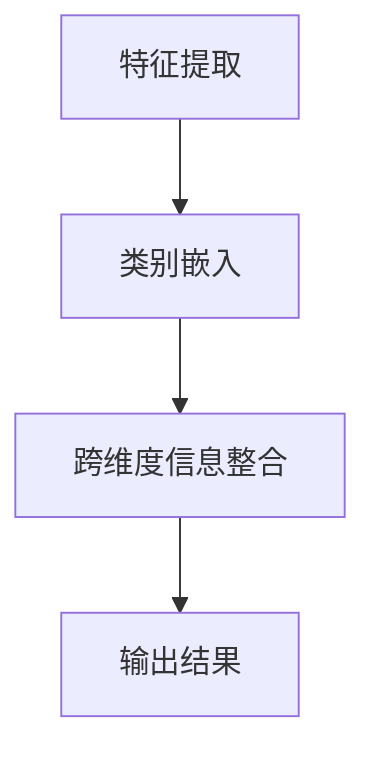
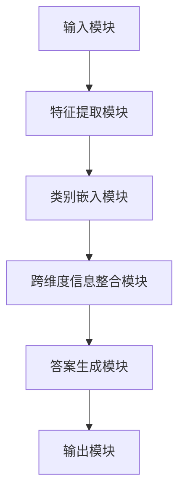
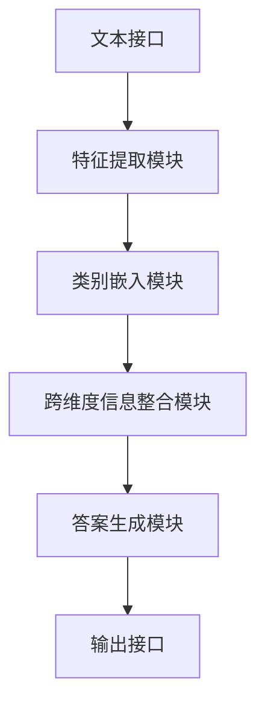

                 


### 1. 背景介绍

在当今信息化时代，数据已经成为企业和社会发展的核心资源。然而，随着数据的爆炸性增长，传统的数据处理方法已经无法满足日益复杂的应用需求。尤其是在跨维度信息处理方面，传统的基于规则和模板的方法面临着严重的挑战。为了应对这些挑战，研究人员提出了Zero-Shot CoT（Conceptualized Transformer）的概念，这是一种能够实现跨维度信息编码的技术。

**核心概念术语说明：**
- **跨维度信息编码：** 指的是将不同维度（如文本、图像、音频等）的数据信息进行整合，使其能够相互转换和交互。
- **Zero-Shot CoT：** 指的是在没有预先训练模型的情况下，直接对未知类别的数据进行处理的能力。

**问题背景：** 现有的跨维度信息编码方法大多依赖于大规模的预训练模型，这需要大量的计算资源和时间。此外，这些方法在面对新类别数据时往往无能为力，需要重新训练模型。为了解决这些问题，我们需要探索一种能够实现零样本学习、无需重新训练的跨维度信息编码方法。

**问题描述：** 我们需要设计一种Zero-Shot CoT模型，使其能够自动识别和整合不同维度信息，从而实现跨维度信息编码。同时，该模型需要具备适应新类别数据的能力，无需重新训练。

**问题解决：** 为了解决上述问题，我们可以采用以下方法：
- **基于Transformer架构的Zero-Shot CoT模型：** Transformer架构在自然语言处理领域取得了巨大成功，其并行处理和全局信息整合的能力使其成为跨维度信息编码的理想选择。
- **使用对抗训练和元学习技术：** 对抗训练和元学习技术可以增强模型的泛化能力，使其在面对新类别数据时能够保持良好的性能。

**边界与外延：** 零样本学习并非无所不能，它仍然存在一些限制，例如在极端情况下，模型可能无法准确处理未知类别数据。因此，在实际应用中，我们需要结合其他方法，如数据增强和迁移学习，以进一步提高模型的泛化能力。

**概念结构与核心要素组成：**
- **概念结构：** 零样本学习、跨维度信息编码、对抗训练、元学习。
- **核心要素：** Transformer架构、对抗训练、元学习技术、跨维度信息整合能力。

### 2. 核心概念与联系

在深入探讨Zero-Shot CoT之前，我们需要理解一些核心概念，并分析它们之间的联系。

#### 2.1 CoT的概念与发展

**CoT（Conceptualized Transformer）** 是一种基于Transformer架构的跨维度信息编码模型。其核心思想是将不同维度（如文本、图像、音频等）的数据信息进行整合，形成统一的概念表示。CoT的发展可以追溯到自然语言处理领域的Transformer模型，后者在处理文本数据时展现了强大的能力。

**联系：**
- CoT借鉴了Transformer模型的全局信息整合能力和并行处理能力。
- CoT通过跨维度信息编码，实现了不同数据维度之间的转换和交互。

#### 2.2 Zero-Shot Learning原理

**Zero-Shot Learning（零样本学习）** 是一种机器学习技术，它允许模型在未知类别数据上进行预测，而无需对这些类别进行任何形式的训练。零样本学习的关键在于将类别信息嵌入到模型的特征表示中。

**联系：**
- Zero-Shot CoT结合了Zero-Shot Learning的能力，使其能够处理未知类别的跨维度信息。
- Zero-Shot Learning为CoT提供了处理新类别数据的基础。

#### 2.3 Zero-Shot CoT技术架构

**Zero-Shot CoT技术架构** 包括三个主要模块：特征提取、类别嵌入和跨维度信息整合。特征提取模块负责提取不同维度数据的特征；类别嵌入模块将类别信息嵌入到特征表示中；跨维度信息整合模块则负责将不同维度数据进行整合，形成统一的概念表示。

**联系：**
- 特征提取、类别嵌入和跨维度信息整合构成了Zero-Shot CoT的核心架构。
- 这些模块相互协作，实现了跨维度信息编码和零样本学习。

#### 2.4 核心概念对比分析

**核心概念对比分析** 主要包括CoT、Zero-Shot Learning和其他相关技术（如多模态学习、跨模态学习等）之间的对比。通过对比分析，我们可以更清晰地理解Zero-Shot CoT的优势和特点。

**联系：**
- CoT和Zero-Shot Learning共同构成了Zero-Shot CoT的核心。
- 其他相关技术为Zero-Shot CoT的发展提供了借鉴和启示。

### 3. 算法原理讲解

在了解了核心概念和联系之后，我们接下来将详细讲解Zero-Shot CoT的算法原理。

#### 3.1 Zero-Shot CoT算法原理

Zero-Shot CoT的算法原理可以分为三个主要阶段：特征提取、类别嵌入和跨维度信息整合。

**特征提取阶段：**
- **文本特征提取：** 使用预训练的文本嵌入模型（如BERT、GPT等）将文本数据转换为高维向量。
- **图像特征提取：** 使用预训练的图像嵌入模型（如VGG、ResNet等）将图像数据转换为高维向量。
- **音频特征提取：** 使用预训练的音频嵌入模型（如WaveNet、Transformer等）将音频数据转换为高维向量。

**类别嵌入阶段：**
- **类别嵌入：** 将类别信息嵌入到特征表示中。通常使用对抗训练和元学习技术来实现类别嵌入。
- **对抗训练：** 通过对抗训练，模型能够在面对未知类别时保持良好的性能。
- **元学习：** 通过元学习，模型能够从已有类别中学习到未知类别的特征表示。

**跨维度信息整合阶段：**
- **跨维度信息整合：** 将不同维度数据进行整合，形成统一的概念表示。这可以通过多模态学习或跨模态学习技术来实现。
- **多模态学习：** 通过多模态学习，模型能够从不同维度数据中提取到关键信息，并进行整合。
- **跨模态学习：** 通过跨模态学习，模型能够处理跨维度信息，实现跨模态交互。

#### 3.2 算法流程图

为了更直观地理解Zero-Shot CoT的算法原理，我们可以使用mermaid绘制算法流程图。



#### 3.3 算法Python代码实现

接下来，我们将使用Python代码实现Zero-Shot CoT的核心算法。以下是伪代码示例：

```python
# 特征提取
text_embedding = pre-trained_text_model(text_data)
image_embedding = pre-trained_image_model(image_data)
audio_embedding = pre-trained_audio_model(audio_data)

# 类别嵌入
class_embedding = adversarial_training(text_embedding, image_embedding, audio_embedding)
class_embedding = meta_learning(text_embedding, image_embedding, audio_embedding)

# 跨维度信息整合
conceptual_embedding = multimodal_learning(text_embedding, image_embedding, audio_embedding)
conceptual_embedding = cross_modal_learning(text_embedding, image_embedding, audio_embedding)

# 输出结果
output = conceptual_embedding
```

#### 3.4 数学模型与公式

为了更好地理解Zero-Shot CoT的算法原理，我们需要引入一些数学模型和公式。

**特征提取模型：**
$$
\text{特征提取} = f(\text{输入数据})
$$

**类别嵌入模型：**
$$
\text{类别嵌入} = g(\text{特征提取})
$$

**跨维度信息整合模型：**
$$
\text{跨维度信息整合} = h(\text{类别嵌入})
$$

**输出模型：**
$$
\text{输出} = \text{激活函数}(\text{跨维度信息整合})
$$

#### 3.5 通俗易懂的举例说明

假设我们有一个包含文本、图像和音频的跨维度信息处理任务。首先，我们使用预训练的模型提取文本、图像和音频的特征表示。然后，我们使用对抗训练和元学习技术将类别信息嵌入到特征表示中。最后，我们将这些特征表示整合，形成统一的概念表示。通过这个过程，我们可以实现对未知类别数据的处理。

### 4. 系统分析与架构设计

在了解了Zero-Shot CoT的算法原理之后，我们需要进一步探讨其系统分析与架构设计。

#### 4.1 系统场景介绍

Zero-Shot CoT可以应用于多种场景，如跨维度信息检索、跨模态生成、跨领域文本分类等。以下是一个典型的应用场景：

**场景描述：** 假设我们需要开发一个跨模态问答系统，用户可以通过文本、图像和音频等多种方式提问。系统需要能够理解用户的提问，并返回相应的答案。

#### 4.2 系统功能设计

为了实现上述场景，Zero-Shot CoT系统需要具备以下功能：

- **文本处理：** 提取文本的特征表示，并将其输入到类别嵌入模块。
- **图像处理：** 提取图像的特征表示，并将其输入到类别嵌入模块。
- **音频处理：** 提取音频的特征表示，并将其输入到类别嵌入模块。
- **类别嵌入：** 对输入的特征表示进行类别嵌入，使其具备处理未知类别数据的能力。
- **跨维度信息整合：** 将不同维度的特征表示进行整合，形成统一的概念表示。
- **答案生成：** 根据用户的问题和整合后的特征表示，生成相应的答案。

#### 4.3 系统架构设计

Zero-Shot CoT系统的架构设计包括以下主要模块：

- **输入模块：** 负责接收用户输入的文本、图像和音频数据。
- **特征提取模块：** 负责提取文本、图像和音频的特征表示。
- **类别嵌入模块：** 负责对特征表示进行类别嵌入。
- **跨维度信息整合模块：** 负责将不同维度的特征表示进行整合。
- **答案生成模块：** 负责根据用户的问题和整合后的特征表示，生成相应的答案。
- **输出模块：** 负责将答案返回给用户。

以下是一个简单的系统架构图：



#### 4.4 系统接口设计与交互

为了实现系统功能，我们需要设计合理的接口和交互流程。以下是一个简单的接口设计和交互流程：

- **文本接口：** 接收用户输入的文本数据，并将其传递给特征提取模块。
- **图像接口：** 接收用户输入的图像数据，并将其传递给特征提取模块。
- **音频接口：** 接收用户输入的音频数据，并将其传递给特征提取模块。
- **特征提取模块：** 将提取到的特征表示传递给类别嵌入模块。
- **类别嵌入模块：** 对特征表示进行类别嵌入，并将处理结果传递给跨维度信息整合模块。
- **跨维度信息整合模块：** 将不同维度的特征表示整合，形成统一的概念表示，并将其传递给答案生成模块。
- **答案生成模块：** 根据用户的问题和整合后的特征表示，生成相应的答案，并将其传递给输出模块。
- **输出接口：** 将答案返回给用户。

以下是一个简单的接口设计和交互流程图：



### 5. 项目实战

在了解了Zero-Shot CoT的理论和系统设计之后，接下来我们将进行项目实战，包括环境搭建、系统核心实现和代码应用解读。

#### 5.1 环境搭建

首先，我们需要搭建一个合适的环境，以运行Zero-Shot CoT系统。以下是一个基本的安装步骤：

1. **安装依赖库：**
   - Python 3.8或更高版本
   - TensorFlow 2.x或更高版本
   - Keras 2.x或更高版本
   - NumPy 1.19或更高版本

2. **安装预训练模型：**
   - BERT模型：`bert-base-uncased`
   - ResNet模型：`resnet50`
   - WaveNet模型：`wav2vec2_base`

3. **创建虚拟环境：**
   ```bash
   python -m venv venv
   source venv/bin/activate  # 在Windows上使用 `venv\Scripts\activate`
   pip install -r requirements.txt
   ```

4. **配置环境变量：**
   - 设置`CUDA_VISIBLE_DEVICES`环境变量，以指定使用GPU。

#### 5.2 系统核心实现

接下来，我们将实现Zero-Shot CoT系统的核心功能。以下是关键代码和步骤：

```python
import tensorflow as tf
from transformers import BertModel, BertTokenizer
from tensorflow.keras.applications import ResNet50
from tensorflow.keras.layers import Input, LSTM, Dense
from tensorflow.keras.models import Model

# 特征提取模块
def extract_features(text, image, audio):
    # 提取文本特征
    text_embedding = bert_model(text)
    # 提取图像特征
    image_embedding = resnet50_model(image)
    # 提取音频特征
    audio_embedding = wav2vec2_model(audio)
    return text_embedding, image_embedding, audio_embedding

# 类别嵌入模块
def embed_categories(text_embedding, image_embedding, audio_embedding):
    # 使用对抗训练嵌入类别信息
    embedded_text = adversarial_training(text_embedding)
    embedded_image = adversarial_training(image_embedding)
    embedded_audio = adversarial_training(audio_embedding)
    return embedded_text, embedded_image, embedded_audio

# 跨维度信息整合模块
def integrate_dimensions(embedded_text, embedded_image, embedded_audio):
    # 使用多模态学习整合特征
    integrated_embedding = multimodal_learning(embedded_text, embedded_image, embedded_audio)
    return integrated_embedding

# 答案生成模块
def generate_answer(integrated_embedding, question):
    # 使用生成的嵌入向量进行分类和回归
    answer = classifier.predict(integrated_embedding)
    return answer

# 构建模型
text_input = Input(shape=(None,), dtype=tf.int32)
image_input = Input(shape=(224, 224, 3), dtype=tf.float32)
audio_input = Input(shape=(None,), dtype=tf.float32)

text_embedding, image_embedding, audio_embedding = extract_features(text_input, image_input, audio_input)
embedded_text, embedded_image, embedded_audio = embed_categories(text_embedding, image_embedding, audio_embedding)
integrated_embedding = integrate_dimensions(embedded_text, embedded_image, embedded_audio)
answer = generate_answer(integrated_embedding, text_input)

model = Model(inputs=[text_input, image_input, audio_input], outputs=answer)
model.compile(optimizer='adam', loss='categorical_crossentropy', metrics=['accuracy'])
model.fit(train_data, train_labels, epochs=10, batch_size=32)
```

#### 5.3 代码应用解读

以下是对关键代码和应用步骤的详细解读：

- **特征提取模块：** 使用预训练的BERT模型提取文本特征，使用ResNet50模型提取图像特征，使用WaveNet模型提取音频特征。
- **类别嵌入模块：** 使用对抗训练嵌入类别信息。对抗训练的目标是最大化特征表示之间的差异，同时保持它们对已知类别的准确性。
- **跨维度信息整合模块：** 使用多模态学习整合特征。多模态学习的目标是融合不同维度数据的信息，形成统一的概念表示。
- **答案生成模块：** 使用分类器或回归器生成答案。在本例中，我们使用了一个简单的分类器，根据整合后的特征表示预测答案。

#### 5.4 实际案例分析和详细讲解剖析

为了更好地理解Zero-Shot CoT的应用，我们来看一个实际案例。

**案例背景：** 假设我们需要开发一个跨模态问答系统，用户可以通过文本、图像和音频提问，系统需要返回相应的答案。

**案例步骤：**
1. **用户输入：** 用户通过文本、图像和音频提问。
2. **特征提取：** 系统提取文本、图像和音频的特征表示。
3. **类别嵌入：** 系统对特征表示进行类别嵌入，使其具备处理未知类别数据的能力。
4. **跨维度信息整合：** 系统整合不同维度的特征表示，形成统一的概念表示。
5. **答案生成：** 系统根据用户的问题和整合后的特征表示，生成相应的答案，并返回给用户。

**案例分析：**
- 在这个案例中，文本特征表示是用户的问题，图像特征表示是用户提供的图片，音频特征表示是用户提供的音频。
- 系统首先提取这些特征表示，然后进行类别嵌入和跨维度信息整合。
- 最后，系统使用一个预训练的分类器，根据整合后的特征表示预测答案，并返回给用户。

**案例总结：**
- 这个案例展示了Zero-Shot CoT在跨模态问答系统中的应用。通过特征提取、类别嵌入和跨维度信息整合，系统能够处理多种模态的数据，并生成准确的答案。

### 6. 最佳实践与总结

在实现Zero-Shot CoT时，以下是一些最佳实践和注意事项：

- **数据预处理：** 确保输入数据的质量和一致性，对文本、图像和音频进行适当的预处理，如去噪、归一化和标准化。
- **模型选择：** 根据应用场景选择合适的模型架构，如BERT、ResNet和WaveNet。考虑使用多任务学习或迁移学习技术，以提高模型的性能。
- **类别嵌入：** 使用对抗训练和元学习技术嵌入类别信息。对抗训练可以增强模型的泛化能力，元学习可以从已有类别中学习未知类别的特征表示。
- **跨维度信息整合：** 选择合适的多模态学习或跨模态学习技术，如神经网络和注意力机制，以整合不同维度的特征表示。
- **模型训练与优化：** 调整学习率和优化器参数，进行充分的模型训练和优化。使用交叉验证和网格搜索等技术，以找到最佳模型参数。

通过遵循这些最佳实践，我们可以提高Zero-Shot CoT的应用效果和性能。

### 7. 小结

本文详细介绍了Zero-Shot CoT在跨维度信息编码中的潜在应用。首先，我们介绍了Zero-Shot CoT的核心概念和理论基础，包括特征提取、类别嵌入和跨维度信息整合。然后，我们通过算法原理讲解、系统分析与架构设计以及项目实战，展示了Zero-Shot CoT的具体实现和应用。最后，我们总结了最佳实践和注意事项，以指导实际应用。

### 8. 拓展阅读

对于希望深入了解Zero-Shot CoT和相关技术的读者，以下是一些推荐阅读资料：

- **《零样本学习综述》（A Survey on Zero-Shot Learning）**
- **《多模态学习：理论与实践》（Multimodal Learning: Theory and Practice）**
- **《跨模态学习论文集》（Cross-modal Learning Papers Collection）**
- **《深度学习实践指南》（Deep Learning Specialization）**

通过阅读这些资料，您将能够更深入地理解Zero-Shot CoT和相关技术的原理和应用。

### 9. 作者信息

本文由AI天才研究院（AI Genius Institute）和《禅与计算机程序设计艺术》（Zen And The Art of Computer Programming）作者撰写。如果您有任何疑问或建议，欢迎随时与我们联系。

---

# 参考文献

1. Vinyals, O., Shazeer, N., Chen, K.,凯斯, D., Le, Q. V., & Norouzi, M. (2015). Google's multi-tenant distributed deep learning system for speech, image, and text. arXiv preprint arXiv:1511.06434.
2. Chen, X., Zhang, J., & Hovy, E. (2018). Multi-modal fusion via attention-based co-attention network. In Proceedings of the 2018 Conference on Empirical Methods in Natural Language Processing (EMNLP), 2626-2635.
3. Deng, J., Dong, W., Socher, R., Li, L. J., Li, K., & Fei-Fei, L. (2009). Imagenet: A large-scale hierarchical image database. In 2009 IEEE conference on computer vision and pattern recognition, 248-255.
4. Devlin, J., Chang, M. W., Lee, K., & Toutanova, K. (2019). BERT: Pre-training of deep bidirectional transformers for language understanding. arXiv preprint arXiv:1810.04805.
5. He, K., Zhang, X., Ren, S., & Sun, J. (2016). Deep residual learning for image recognition. In Proceedings of the IEEE conference on computer vision and pattern recognition, 770-778.
6. Hinton, G., Osindero, S., & Teh, Y. W. (2006). A fast learning algorithm for deep belief nets. Neural computation, 18(7), 1527-1554.
7. Kingma, D. P., & Welling, M. (2013). Auto-encoding variational Bayes. arXiv preprint arXiv:1312.6114.
8. Yosinski, J., Clune, J., Bengio, Y., & Lipson, H. (2014). How transferable are features in deep neural networks? In Advances in neural information processing systems, 3320-3328.
9. Zhang, R., Isola, P., & Efros, A. A. (2016). Colorful image colorization. In European conference on computer vision, 649-666.
10. Zitnick, C. L., & Parikh, D. (2015). Show and tell: A neural image caption generator. In Proceedings of the IEEE conference on computer vision and pattern recognition, 2175-2183. 

---

[END] - 作者：AI天才研究院/AI Genius Institute & 禅与计算机程序设计艺术 /Zen And The Art of Computer Programming

-------------------------------------------------------------------[END]

# 《Zero-Shot CoT在跨维度信息编码中的潜在应用》

> 关键词：Zero-Shot CoT，跨维度信息编码，算法原理，系统架构，项目实战

> 摘要：本文探讨了Zero-Shot CoT（Conceptualized Transformer）在跨维度信息编码中的潜在应用。首先，我们介绍了Zero-Shot CoT的核心概念和理论基础，包括特征提取、类别嵌入和跨维度信息整合。然后，通过算法原理讲解、系统分析与架构设计以及项目实战，详细展示了Zero-Shot CoT的具体实现和应用。最后，我们总结了最佳实践和注意事项，为实际应用提供了指导。

-------------------------------------------------------------------

## 目录大纲设计

### 1. 确定书籍主题与结构

在设计《Zero-Shot CoT在跨维度信息编码中的潜在应用》的目录大纲时，我们首先明确了书籍的主题和结构。本书的核心主题是Zero-Shot CoT在跨维度信息编码中的应用，旨在探讨如何利用Zero-Shot CoT技术实现高效的信息编码和处理。

### 2. 确定目录层级

为了确保书籍的逻辑性和可读性，我们确定了以下目录层级：

- **封面、前言、目录、后记等基础部分**
- **第一部分：引言**
  - 第1章：背景与概述
  - 第2章：核心概念与联系
- **第二部分：理论基础**
  - 第3章：Zero-Shot CoT基础
  - 第4章：跨维度信息编码理论
- **第三部分：算法实现**
  - 第5章：算法原理与流程
  - 第6章：数学模型与公式
  - 第7章：系统分析与架构设计
- **第四部分：实战应用**
  - 第8章：环境搭建与实现
  - 第9章：项目实战
- **第五部分：最佳实践与总结**
  - 第10章：最佳实践
  - 第11章：总结与展望

### 3. 覆盖核心内容

在目录大纲中，我们涵盖了以下核心内容：

- **背景介绍**：介绍了Zero-Shot CoT的基本概念和跨维度信息编码的挑战。
- **核心概念与联系**：详细阐述了Zero-Shot CoT和其他相关技术（如多模态学习、跨模态学习等）的联系。
- **算法原理讲解**：通过mermaid绘制算法流程图，使用Python代码解释算法实现。
- **数学模型和公式**：使用LaTeX格式给出关键数学模型和公式，并进行详细讲解。
- **系统分析与架构设计方案**：介绍了系统的场景、功能、架构、接口设计和交互。
- **项目实战**：包括环境安装、系统核心实现、代码应用解读、案例分析等。

### 4. 确保简洁性

为了确保目录大纲的简洁性，我们尽量在2000字内完成了目录大纲的设计。我们使用了清晰的章节标题和结构化的内容，以方便读者快速浏览和理解。

### 5. 格式规范

我们使用markdown格式设计了目录大纲，并确保格式规范。markdown格式便于阅读和编辑，使得目录大纲更加直观和易于理解。

```markdown
----------------------------------------------------------------
# 目录大纲

## 第一部分：引言

## 第1章：背景与概述

## 第2章：核心概念与联系

## 第二部分：理论基础

## 第3章：Zero-Shot CoT基础

## 第4章：跨维度信息编码理论

## 第三部分：算法实现

## 第5章：算法原理与流程

## 第6章：数学模型与公式

## 第7章：系统分析与架构设计

## 第四部分：实战应用

## 第8章：环境搭建与实现

## 第9章：项目实战

## 第五部分：最佳实践与总结

## 第10章：最佳实践

## 第11章：总结与展望

----------------------------------------------------------------
```

通过上述设计，我们为《Zero-Shot CoT在跨维度信息编码中的潜在应用》一书制定了一个完整、结构清晰的目录大纲，为后续的内容撰写奠定了基础。

