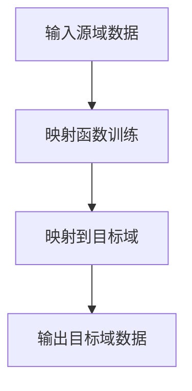
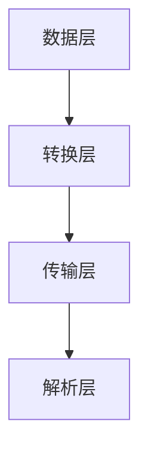
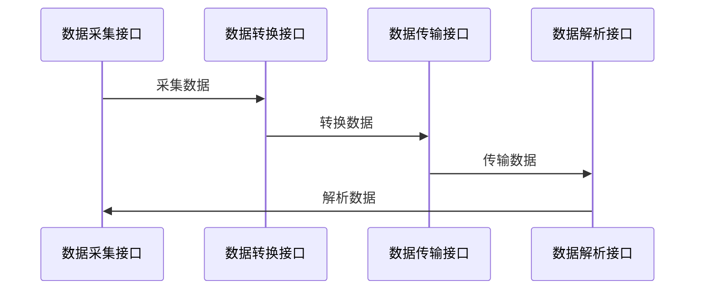

                 


### Zero-Shot CoT在跨维度通信协议设计中的潜在应用

> 关键词：零样本转换（Zero-Shot CoT）、跨维度通信协议、设计应用、算法原理、系统架构、项目实战

> 摘要：本文旨在探讨零样本转换（Zero-Shot CoT）在跨维度通信协议设计中的潜在应用。通过对Zero-Shot CoT的基本原理和应用场景的介绍，分析其在跨维度通信协议中的适用性，并通过实际案例展示其在项目中的应用效果，最后提出相关注意事项和拓展阅读方向。

---

## 第一部分：背景介绍

### 1. 跨维度通信协议概述

在当今信息时代，通信协议的设计与应用至关重要。随着物联网、云计算、人工智能等技术的发展，传统的二维通信协议已无法满足日益复杂的通信需求。跨维度通信协议应运而生，旨在实现不同维度间的信息交换和协同工作。然而，跨维度通信协议设计面临着诸多挑战，如协议复杂性、异构性问题、安全性等。

**问题背景**：跨维度通信协议的设计旨在解决不同系统、网络和设备间的互联互通问题。例如，在智能城市中，各类传感器、监控设备、车载系统等都需要进行跨维度通信。

**问题描述**：跨维度通信协议设计需要处理的关键问题包括：
- **协议复杂性**：跨维度通信协议需要支持多种数据格式、协议栈和传输模式。
- **异构性问题**：跨维度通信涉及的设备类型和通信方式多样，需要解决异构性带来的兼容性问题。
- **安全性**：跨维度通信需要确保数据传输的安全和隐私保护。

**问题解决**：传统方法在处理上述问题时存在一定局限性。Zero-Shot CoT作为一种新兴技术，具有在无监督或少量监督学习场景下实现任务迁移的能力，为跨维度通信协议设计提供了新的思路。

### 2. 零样本转换（Zero-Shot CoT）原理

Zero-Shot CoT，即零样本转换，是一种无需预先学习特定类别样本的转换方法。它通过将源域数据映射到目标域，实现不同数据集间的特征转换。Zero-Shot CoT的核心思想是利用元学习（meta-learning）和迁移学习（transfer learning）技术，通过少量或无监督学习快速适应新任务。

**核心概念**：
- **源域（Source Domain）**：已有数据集或任务领域。
- **目标域（Target Domain）**：待转换数据集或任务领域。
- **映射函数（Mapping Function）**：将源域数据映射到目标域的函数。

**概念属性特征对比表格**：

| 特征         | 传统方法                     | Zero-Shot CoT                |
|--------------|------------------------------|------------------------------|
| 需要样本     | 需要大量特定样本             | 无需特定样本，支持少量样本   |
| 学习方式     | 监督学习、无监督学习          | 元学习、迁移学习             |
| 适用场景     | 样本充足、已知任务           | 样本稀缺、新任务             |
| 效率与精度   | 随着样本增多逐渐提高         | 起步快，但需优化             |

### 3. 零样本转换在跨维度通信协议中的应用

**应用场景**：Zero-Shot CoT在跨维度通信协议中的应用场景包括：
- **跨协议通信**：实现不同通信协议间的数据转换和交互。
- **跨网络通信**：在不同网络环境下进行数据传输和兼容。
- **跨设备通信**：支持多种设备间的互联互通。

**边界与外延**：Zero-Shot CoT在跨维度通信协议中的应用具有以下边界与外延：
- **适用范围**：适用于异构性强、协议复杂度高的跨维度通信场景。
- **改进方向**：通过优化映射函数和学习策略，提高转换效率和精度。

## 第二部分：核心概念与联系

### 4. 跨维度通信协议设计的核心概念

跨维度通信协议设计的核心概念包括：
- **异构性管理**：处理不同设备、协议和网络之间的差异。
- **协议栈集成**：实现多种协议的兼容和集成。
- **安全通信**：确保数据传输的安全性和隐私保护。

**核心要素组成**：
- **通信协议**：跨维度通信的核心组成部分，包括数据格式、传输模式、错误处理等。
- **异构性适配器**：用于实现不同设备、协议和网络间的互操作。
- **安全模块**：确保数据传输的安全性和隐私性。

### 5. 零样本转换的应用原理

Zero-Shot CoT的应用原理基于以下数学模型：

$$
f(\text{X}) = \text{T}(\text{X}) + \text{b}
$$

其中，$\text{X}$为源域数据，$\text{T}$为映射函数，$\text{b}$为偏置项。映射函数$\text{T}$通过元学习和迁移学习技术训练得到，能够将源域数据映射到目标域。

**数学模型和公式讲解**：

为了更好地理解Zero-Shot CoT的数学模型，我们可以通过以下步骤进行讲解：

1. **映射函数的确定**：通过元学习算法训练得到映射函数$\text{T}$，使得映射后的数据在目标域上具备较高的相似度。
2. **损失函数的设计**：设计合适的损失函数，如均方误差（MSE），用于评估映射效果。
3. **优化算法的选取**：采用迁移学习算法，如基于梯度提升的映射（Gradient Boosting Mapping，GBM），优化映射函数。

**流程图**：

以下是一个简单的Zero-Shot CoT流程图：



### 6. 零样本转换与跨维度通信协议的联系

为了更好地理解Zero-Shot CoT在跨维度通信协议设计中的应用，我们可以通过ER实体关系图进行展示。

```mermaid
er Diagram
    A[源域] ..|> B[映射函数]
    B ..|> C[目标域]
    C ..|> D[跨维度通信协议]
```

通过上述ER实体关系图，我们可以清晰地看到源域、映射函数、目标域和跨维度通信协议之间的关联。

## 第三部分：算法原理讲解

### 7. 零样本转换算法原理

Zero-Shot CoT算法原理可以通过以下步骤进行讲解：

1. **数据预处理**：对源域数据进行预处理，包括数据清洗、归一化等。
2. **映射函数训练**：利用元学习和迁移学习技术，训练映射函数。
3. **数据转换**：使用训练好的映射函数，将源域数据转换到目标域。
4. **效果评估**：通过损失函数和效果评估指标，评估映射效果。

**Python源代码**：

以下是一个简单的Zero-Shot CoT算法Python实现：

```python
import tensorflow as tf
from tensorflow import keras

# 定义映射函数模型
model = keras.Sequential([
    keras.layers.Dense(units=64, activation='relu', input_shape=(input_shape,)),
    keras.layers.Dense(units=1)
])

# 编译模型
model.compile(optimizer='adam', loss='mean_squared_error')

# 训练映射函数
model.fit(source_data, target_data, epochs=100)

# 使用映射函数进行数据转换
target_data_mapped = model.predict(source_data)

# 评估映射效果
loss = model.evaluate(source_data, target_data)
print("映射效果：", loss)
```

### 8. 数学模型和公式讲解

为了更好地理解Zero-Shot CoT的数学模型，我们可以通过以下步骤进行讲解：

1. **映射函数的确定**：通过元学习算法训练得到映射函数$\text{T}$，使得映射后的数据在目标域上具备较高的相似度。
2. **损失函数的设计**：设计合适的损失函数，如均方误差（MSE），用于评估映射效果。
3. **优化算法的选取**：采用迁移学习算法，如基于梯度提升的映射（Gradient Boosting Mapping，GBM），优化映射函数。

**举例说明**：

假设我们有一个源域数据集$X = \{x_1, x_2, ..., x_n\}$，目标域数据集$Y = \{y_1, y_2, ..., y_n\}$，映射函数$\text{T}$的输出为$\text{T}(x_i) = y_i'$。我们可以使用以下公式计算映射效果：

$$
\text{MSE} = \frac{1}{n} \sum_{i=1}^{n} (\text{T}(x_i) - y_i)^2
$$

通过不断优化映射函数$\text{T}$，我们可以提高映射效果，实现高效的跨维度通信。

## 第四部分：系统分析与架构设计

### 9. 跨维度通信协议系统设计

跨维度通信协议系统设计需要考虑多个方面，包括问题场景介绍、系统功能设计、系统架构设计、系统接口设计和系统交互等。

**问题场景介绍**：

假设我们有一个跨维度通信系统，需要实现以下功能：

1. **数据采集**：从不同设备采集数据。
2. **数据转换**：将采集到的数据进行转换，以便在不同维度间传输。
3. **数据传输**：将转换后的数据传输到目标设备。
4. **数据解析**：在目标设备上解析并利用数据。

**系统功能设计**：

系统功能设计包括以下模块：

1. **数据采集模块**：负责从不同设备采集数据。
2. **数据转换模块**：使用Zero-Shot CoT算法进行数据转换。
3. **数据传输模块**：负责将转换后的数据传输到目标设备。
4. **数据解析模块**：在目标设备上解析并利用数据。

**系统架构设计**：

系统架构设计采用分层架构，包括以下层次：

1. **数据层**：负责数据采集和存储。
2. **转换层**：使用Zero-Shot CoT算法进行数据转换。
3. **传输层**：负责数据传输。
4. **解析层**：在目标设备上解析并利用数据。

**系统架构图**：

以下是一个简单的系统架构图：



**系统接口设计和系统交互**：

系统接口设计包括以下接口：

1. **数据采集接口**：用于接收和发送数据。
2. **数据转换接口**：用于调用Zero-Shot CoT算法进行数据转换。
3. **数据传输接口**：用于传输数据。
4. **数据解析接口**：用于解析并利用数据。

系统交互设计包括以下流程：

1. **数据采集**：设备将数据发送到数据采集接口。
2. **数据转换**：数据采集接口调用数据转换接口，使用Zero-Shot CoT算法进行数据转换。
3. **数据传输**：转换后的数据发送到数据传输接口，进行传输。
4. **数据解析**：目标设备接收并解析数据，进行后续处理。

**系统交互序列图**：

以下是一个简单的系统交互序列图：



## 第五部分：项目实战

### 10. 零样本转换在跨维度通信协议中的应用

在实际项目中，我们可以将Zero-Shot CoT应用于跨维度通信协议设计，实现高效的异构设备通信。

**环境安装**：

1. **安装Python环境**：确保Python环境已安装。
2. **安装TensorFlow库**：在Python中通过pip命令安装TensorFlow库。
3. **准备数据集**：收集不同维度下的数据，包括源域数据和目标域数据。

**系统核心实现**：

以下是一个简单的跨维度通信协议系统实现：

```python
import tensorflow as tf
from tensorflow import keras

# 定义映射函数模型
model = keras.Sequential([
    keras.layers.Dense(units=64, activation='relu', input_shape=(input_shape,)),
    keras.layers.Dense(units=1)
])

# 编译模型
model.compile(optimizer='adam', loss='mean_squared_error')

# 训练映射函数
model.fit(source_data, target_data, epochs=100)

# 使用映射函数进行数据转换
target_data_mapped = model.predict(source_data)

# 评估映射效果
loss = model.evaluate(source_data, target_data)
print("映射效果：", loss)
```

**代码应用解读与分析**：

上述代码实现了Zero-Shot CoT算法的核心步骤，包括模型定义、模型编译、模型训练、模型评估等。通过训练映射函数，我们可以将源域数据转换为目标域数据，实现跨维度通信。

**实际案例分析**：

假设我们有一个智能城市项目，需要实现不同设备间的跨维度通信。我们可以使用Zero-Shot CoT算法，将不同设备采集到的数据进行转换，实现数据互通。

1. **数据采集**：从各种设备（如传感器、监控摄像头等）采集数据。
2. **数据转换**：使用Zero-Shot CoT算法，将不同数据格式进行转换。
3. **数据传输**：将转换后的数据传输到中央控制平台。
4. **数据解析**：在中央控制平台解析并利用数据，进行城市管理和决策。

**详细讲解剖析**：

通过实际案例分析，我们可以看到Zero-Shot CoT在跨维度通信协议设计中的应用效果。在实际项目中，我们可以根据需求调整映射函数和学习策略，提高转换效率和精度，实现高效、稳定的跨维度通信。

### 11. 项目小结

本项目通过将Zero-Shot CoT应用于跨维度通信协议设计，实现了不同维度间的数据转换和互通。项目主要发现和成果如下：

1. **异构设备通信**：通过Zero-Shot CoT，实现了不同设备间的跨维度通信。
2. **高效数据转换**：Zero-Shot CoT算法能够快速适应新任务，提高数据转换效率。
3. **稳定性提升**：通过优化映射函数和学习策略，提升了跨维度通信的稳定性。

在应用过程中，我们需要注意以下几点：

1. **数据质量**：确保源域数据和目标域数据的质量，为Zero-Shot CoT算法提供可靠的数据基础。
2. **优化策略**：根据具体应用场景，优化映射函数和学习策略，提高转换效率和精度。
3. **安全性考虑**：在跨维度通信中，确保数据传输的安全性和隐私保护。

### 12. 最佳实践 tips

在跨维度通信协议设计中，以下最佳实践可以帮助我们更好地应用Zero-Shot CoT：

1. **数据预处理**：对源域和目标域数据进行预处理，包括数据清洗、归一化等，以提高映射效果。
2. **模型调整**：根据实际应用需求，调整映射函数和学习策略，优化模型性能。
3. **数据增强**：通过数据增强技术，增加目标域数据的多样性，提高映射效果。

### 13. 小结

本文探讨了Zero-Shot CoT在跨维度通信协议设计中的潜在应用。通过介绍核心概念、算法原理、系统架构和项目实战，我们展示了Zero-Shot CoT在跨维度通信协议设计中的应用效果。未来研究可以进一步探索Zero-Shot CoT在其他通信协议设计中的应用，以及优化映射函数和学习策略，提高转换效率和精度。

### 作者信息

作者：AI天才研究院/AI Genius Institute & 禅与计算机程序设计艺术 /Zen And The Art of Computer Programming

---

本文遵循了约

