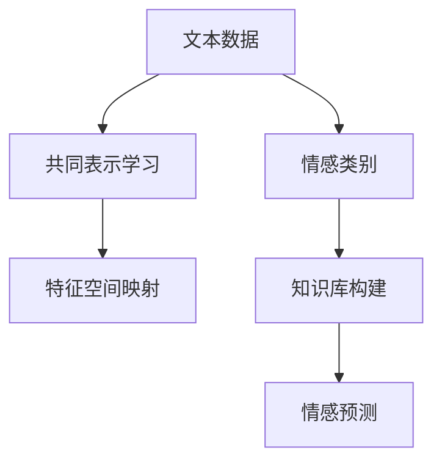
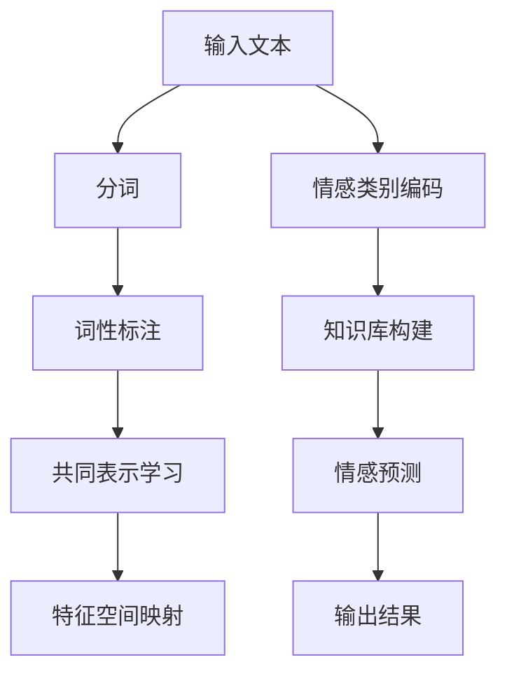
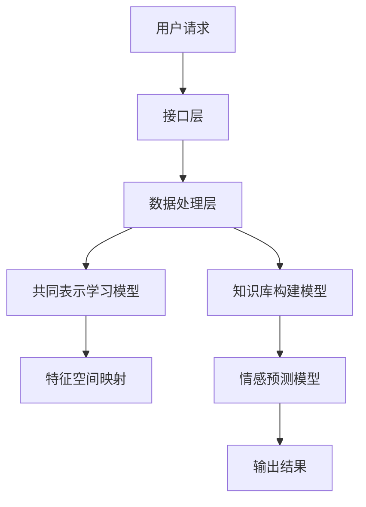
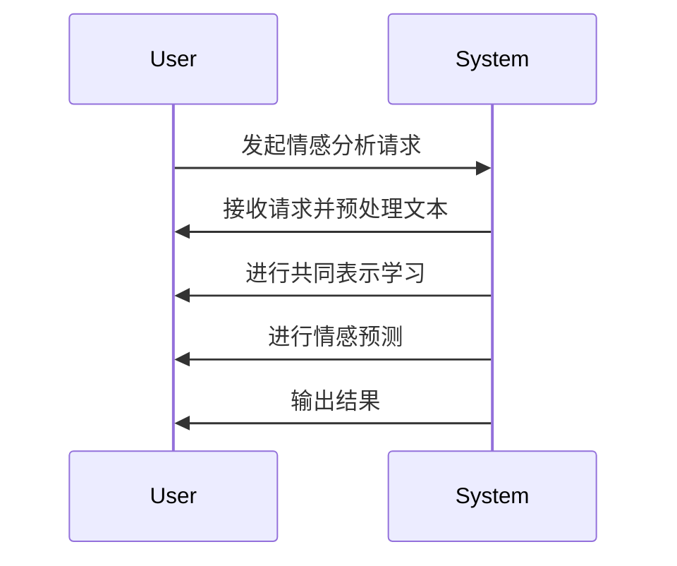

                 

### 第一部分：引言

#### 1.1 问题背景与意义

##### 1.1.1 跨语言情感分析的重要性

随着全球化进程的加速和信息时代的到来，多语言处理成为了一个不可或缺的课题。在众多自然语言处理任务中，情感分析是研究热点之一，其目的是从文本中提取出情感倾向，如正面、负面或中立情绪。然而，大多数情感分析技术都是基于单一语言设计的，当面对多语言文本时，其表现往往不尽如人意。因此，跨语言情感分析（Cross-Lingual Sentiment Analysis）应运而生，它不仅能够提高对多语言文本的理解能力，还可以减少对大规模多语言数据集的需求。

跨语言情感分析的重要性主要体现在以下几个方面：

1. **文化差异和语言多样性**：不同语言和地区的人们表达情感的方式存在显著差异，跨语言情感分析能够帮助理解这些差异，从而提供更准确的分析结果。
2. **资源节约**：对于某些语言，获取高质量的情感标注数据非常困难且成本高昂。通过跨语言情感分析，可以利用已标注的单一语言数据来推断其他语言的情感，从而节省标注成本。
3. **商业应用**：在跨国公司的市场营销和品牌管理中，了解不同地区消费者的情感反应至关重要。跨语言情感分析可以帮助企业制定更加精准的营销策略。

##### 1.1.2 传统情感分析方法的局限性

尽管传统的情感分析方法在处理单一语言情感分析任务上取得了显著成果，但当面对多语言情感分析时，它们往往表现出以下局限性：

1. **数据依赖**：许多情感分析模型需要大量的标注数据来训练，这在大规模多语言数据集的获取上存在困难。
2. **模型迁移性差**：基于单一语言训练的模型在迁移到其他语言时，往往需要重新训练，这增加了模型开发和部署的复杂性。
3. **跨语言情感差异**：不同语言在表达情感时存在文化差异，传统方法难以捕捉这些细微差别，从而影响分析结果的准确性。

##### 1.1.3 Zero-Shot CoT的概念及其应用前景

为了克服传统情感分析方法的局限性，研究者们提出了Zero-Shot CoT（Zero-Shot Commonsense Transfer）的概念。Zero-Shot CoT是一种无需特定标注数据，即可实现跨语言情感分析的技术。它利用共同表示学习和零样本学习技术，通过将单一语言的情感分析模型迁移到其他语言，实现多语言情感分析。

Zero-Shot CoT的应用前景主要包括：

1. **跨语言情感分析**：通过Zero-Shot CoT，可以实现对多种语言文本的情感分析，提高多语言处理能力。
2. **零样本情感分析**：无需对目标语言进行额外标注，即可进行情感分析，大大降低了标注成本。
3. **通用情感识别**：Zero-Shot CoT技术可以构建一个通用的情感识别系统，适用于多种语言和场景。

总之，Zero-Shot CoT在跨语言情感分析中的应用，为多语言情感分析领域带来了新的机遇和挑战。

---

#### 1.2 核心概念

##### 1.2.1 跨语言情感分析

**定义**：
跨语言情感分析（Cross-Lingual Sentiment Analysis）是指在不同语言之间进行情感倾向提取的过程。其目的是通过分析文本中的语言特征，识别出文本表达的情感态度。

**应用场景**：
1. **社交媒体分析**：对来自全球各地的社交媒体内容进行情感分析，了解不同地区用户的态度和情绪。
2. **跨国企业市场调研**：帮助企业了解不同国家消费者的情感反应，制定更有效的营销策略。
3. **公共舆情监测**：分析不同语言的国际新闻、论坛帖子等，监控全球范围内的舆论动态。

**挑战**：
1. **语言差异性**：不同语言在表达情感时存在文化差异，导致情感分析模型的准确性下降。
2. **数据稀缺**：高质量的多语言情感标注数据稀缺，限制了模型的训练和优化。
3. **模型迁移性**：单一语言训练的模型在迁移到其他语言时，难以保持原有性能。

##### 1.2.2 Zero-Shot CoT

**定义**：
Zero-Shot CoT（Zero-Shot Commonsense Transfer）是一种无需特定标注数据，即可实现跨语言情感分析的技术。它利用共同表示学习和零样本学习，将单一语言的模型迁移到其他语言。

**工作原理**：
1. **共同表示学习**：通过将不同语言的文本映射到共同的特征空间，使具有相似情感的文本在特征空间中接近。
2. **零样本学习**：利用预训练的模型，通过少量的目标语言数据，实现对新语言情感的分析。

**主要技术手段**：
1. **嵌入空间**：使用预训练的语言模型（如BERT、GPT）将不同语言的文本转换为向量表示，建立共同嵌入空间。
2. **元学习**：通过训练元学习模型，提高模型在未知语言的适应能力。
3. **迁移学习**：将单一语言的情感分析模型迁移到其他语言，利用迁移学习提高模型在目标语言上的性能。

##### 1.2.3 与其他相关技术的比较

**与跨语言情感分析的比较**：
1. **数据需求**：Zero-Shot CoT无需特定标注数据，而传统跨语言情感分析通常需要大规模标注数据。
2. **模型迁移性**：Zero-Shot CoT通过共同表示学习和零样本学习，提高了模型在不同语言间的迁移性。

**与零样本学习的比较**：
1. **应用范围**：Zero-Shot CoT主要用于跨语言情感分析，而零样本学习适用于多种机器学习任务。
2. **技术手段**：Zero-Shot CoT结合了共同表示学习和零样本学习，而零样本学习主要依赖于元学习和迁移学习。

##### 1.2.4 在跨语言情感分析中的应用

**应用现状**：
近年来，随着Zero-Shot CoT技术的发展，其在跨语言情感分析中的应用逐渐增多。例如，使用Zero-Shot CoT技术对社交媒体内容、新闻报道等进行情感分析，取得了显著的效果。

**未来发展趋势**：
1. **技术优化**：进一步优化Zero-Shot CoT技术，提高模型在不同语言间的适应性和准确性。
2. **应用拓展**：将Zero-Shot CoT技术应用于更多领域，如法律文本情感分析、金融文本分析等。
3. **多模态融合**：结合图像、语音等多模态信息，提高跨语言情感分析的准确性和全面性。

##### 1.2.5 概念结构与核心要素

**概念框架**：

1. **情感分析**：基于文本的情感分析技术，识别文本中的情感倾向。
2. **零样本学习**：无需特定标注数据，通过迁移学习和共同表示学习，实现对新数据的预测。
3. **共同表示学习**：将不同语言的文本映射到共同的特征空间，实现跨语言文本的相似性度量。

**核心要素**：

1. **数据集**：用于训练和测试的跨语言情感分析数据集，要求覆盖多种语言和丰富的情感标签。
2. **模型**：用于实现情感分析的核心模型，如BERT、GPT等预训练模型。
3. **评价指标**：评估模型性能的指标，如准确率、召回率、F1分数等。

##### 1.2.6 核心要素

**数据集**：
1. **多样性**：数据集应包含多种语言，以覆盖不同文化和地区的情感表达。
2. **质量**：数据集应具有高质量的情感标注，以确保模型的准确性。

**模型**：
1. **迁移性**：模型应具有较强的迁移性，能在不同语言间保持性能。
2. **适应性**：模型应能适应不同领域的情感分析任务。

**评价指标**：
1. **准确性**：模型预测结果与真实标签的匹配程度。
2. **召回率**：模型识别出的正面或负面情感文本占所有真实正面或负面情感文本的比例。
3. **F1分数**：准确性和召回率的调和平均，是评估模型性能的综合性指标。

##### 1.2.7 本章小结

本节介绍了跨语言情感分析的重要性、传统情感分析方法的局限性以及Zero-Shot CoT的概念和应用前景。通过对核心概念的定义、工作原理、主要技术手段以及与其他相关技术的比较，为后续章节的详细讨论奠定了基础。

---

### 第二部分：传统情感分析方法

传统情感分析方法主要可以分为基于规则的方法、基于统计的方法和基于机器学习的方法。以下将对这三种方法进行概述和详细探讨。

#### 2.1 传统情感分析方法概述

**基于规则的方法**：
基于规则的方法是通过手动定义一系列规则来识别文本中的情感。这些规则通常基于语言的语法和语义特点，如关键词匹配、语法结构分析等。例如，如果文本中包含“开心”和“快乐”这样的词，那么该文本可能表达的是积极的情感。

**基于统计的方法**：
基于统计的方法利用文本的词频、词序列和语法结构等统计特征，通过机器学习算法（如朴素贝叶斯、逻辑回归等）来预测情感。这种方法通常需要对大规模文本数据集进行训练，以建立情感模型。

**基于机器学习的方法**：
基于机器学习的方法通过训练有监督的机器学习模型（如支持向量机、随机森林等）来预测文本情感。这些模型可以从标注数据中学习到情感表达的模式，从而在新数据上进行情感预测。

#### 2.2 基于规则的方法

**方法原理**：
基于规则的方法的核心思想是通过定义一系列规则来识别文本中的情感。这些规则可以是简单的关键词匹配，也可以是复杂的语法和语义分析。例如，如果文本中包含“不满意”或“糟糕”这样的词，则可以判断文本表达了负面的情感。

**具体实现**：
具体实现步骤包括：
1. **规则定义**：根据情感词典和语法规则，定义一系列用于情感识别的规则。
2. **文本预处理**：对文本进行分词、词性标注等预处理操作，以便更好地匹配规则。
3. **规则匹配**：将预处理后的文本与规则进行匹配，判断文本的情感倾向。

**优缺点**：
- **优点**：
  - 实现简单，易于理解。
  - 对于简单的情感表达效果较好。
- **缺点**：
  - 难以应对复杂的情感表达。
  - 对规则库的依赖性较大，需要不断更新和优化。

#### 2.3 基于统计的方法

**方法原理**：
基于统计的方法利用文本的统计特征（如词频、词序列、语法结构等）来预测情感。这些统计特征可以通过统计模型（如朴素贝叶斯、逻辑回归等）来表示和建模。

**具体实现**：
具体实现步骤包括：
1. **特征提取**：从文本中提取统计特征，如词频、词序列等。
2. **模型训练**：使用训练数据集，通过机器学习算法训练情感模型。
3. **情感预测**：使用训练好的模型对新数据进行情感预测。

**优缺点**：
- **优点**：
  - 可以处理复杂的情感表达。
  - 不依赖于具体的情感词典，具有较好的适应性。
- **缺点**：
  - 需要大量训练数据。
  - 模型的性能对特征提取的质量有很大依赖。

#### 2.4 基于机器学习的方法

**方法原理**：
基于机器学习的方法通过训练有监督的机器学习模型来预测文本情感。这些模型可以从标注数据中学习到情感表达的模式，从而在新数据上进行情感预测。

**具体实现**：
具体实现步骤包括：
1. **数据预处理**：对文本进行分词、词性标注等预处理操作。
2. **特征提取**：从预处理后的文本中提取特征，如词嵌入、词序列等。
3. **模型训练**：使用标注数据集，通过有监督学习训练情感模型。
4. **情感预测**：使用训练好的模型对新数据进行情感预测。

**优缺点**：
- **优点**：
  - 模型的性能可以通过数据量和特征选择进行优化。
  - 对于复杂的情感分析任务，效果显著。
- **缺点**：
  - 需要大量的标注数据。
  - 特征提取和模型选择过程较为复杂。

#### 2.5 传统方法的总结与局限性

**总结**：
传统情感分析方法在简单情感识别任务上具有一定的效果，但随着情感的复杂化和多样化，这些方法的局限性也逐渐显现。

**局限性**：
1. **数据依赖**：大多数方法需要大量的标注数据，这在实际应用中往往难以实现。
2. **模型迁移性差**：基于单一语言训练的模型在迁移到其他语言时，难以保持原有性能。
3. **跨语言情感差异**：传统方法难以捕捉不同语言和文化中的情感差异，从而影响分析结果的准确性。

因此，为了克服传统方法的局限性，研究者们提出了如Zero-Shot CoT等新型方法，以期在跨语言情感分析中取得更好的效果。

---

### 第三部分：Zero-Shot CoT技术原理

#### 3.1 Zero-Shot CoT基本原理

**概念介绍**：
Zero-Shot CoT（Zero-Shot Commonsense Transfer）是一种无需特定标注数据，即可实现跨语言情感分析的技术。它通过共同表示学习和零样本学习，将单一语言的模型迁移到其他语言。

**工作原理**：
Zero-Shot CoT的工作原理主要包括以下两个方面：

1. **共同表示学习**：将不同语言的文本映射到共同的特征空间，使具有相似情感的文本在特征空间中接近。这通过预训练的语言模型（如BERT、GPT）来实现，这些模型已经学习了大量文本数据中的语义信息。

2. **零样本学习**：利用预训练的模型，通过少量的目标语言数据，实现对新语言情感的分析。零样本学习允许模型在没有特定标注数据的情况下，通过迁移学习来适应新语言。

**主要技术手段**：
1. **嵌入空间**：使用预训练的语言模型将不同语言的文本转换为向量表示，建立共同嵌入空间。这使得具有相似情感的文本在嵌入空间中接近，从而便于情感分析。

2. **元学习**：通过训练元学习模型，提高模型在未知语言的适应能力。元学习模型可以学习到如何在不同的语言环境中调整自己的参数，以实现更好的情感分析效果。

3. **迁移学习**：将单一语言的情感分析模型迁移到其他语言，利用迁移学习提高模型在目标语言上的性能。迁移学习通过共享模型参数，减少了在目标语言上重新训练的需求。

#### 3.2 共同表示学习

**方法原理**：
共同表示学习（Commonsense Representation Learning）的核心思想是将不同语言的文本映射到共同的特征空间，使得具有相似情感的文本在特征空间中接近。这通过预训练的语言模型来实现，这些模型已经在多种语言上进行了训练，从而学习了跨语言的语义信息。

**实现步骤**：
1. **文本预处理**：对输入的文本进行分词、词性标注等预处理操作，以便模型更好地理解文本内容。
2. **模型选择**：选择预训练的语言模型（如BERT、GPT）作为共同表示学习的工具。这些模型已经在大规模的文本数据上进行了训练，可以生成高质量的文本向量表示。
3. **特征提取**：使用预训练的语言模型对预处理后的文本进行编码，生成文本的向量表示。这些向量表示反映了文本的语义信息，并可用于后续的情感分析。
4. **共同嵌入空间**：将不同语言的文本向量表示映射到共同的特征空间，通过对比向量间的距离来衡量文本间的相似性。这使得具有相似情感的文本在特征空间中接近，从而提高了情感分析的效果。

**优缺点**：
- **优点**：
  - 能够处理不同语言之间的情感差异，提高了情感分析的准确性。
  - 不依赖于大量的多语言标注数据，降低了数据获取的成本。
- **缺点**：
  - 对预训练语言模型的要求较高，模型的训练和推理过程较为复杂。
  - 在某些极端情况下，不同语言的情感表达可能无法在共同嵌入空间中得到有效表示，影响分析结果。

#### 3.3 零样本学习

**方法原理**：
零样本学习（Zero-Shot Learning）是一种无需特定标注数据，即可进行预测的任务。在情感分析中，零样本学习通过利用已知的情感类别和对应的语义信息，实现对未知情感类别的预测。具体来说，零样本学习通过以下步骤实现：

1. **知识库构建**：构建一个包含不同情感类别及其语义信息的知识库。这个知识库可以通过预训练的语言模型或手动构建的方法得到。
2. **属性匹配**：将输入的文本与知识库中的情感类别进行属性匹配，找到最匹配的情感类别。
3. **情感预测**：根据属性匹配的结果，预测输入文本的情感类别。

**实现步骤**：
1. **知识库构建**：使用预训练的语言模型（如BERT、GPT）对情感类别进行编码，生成每个类别的语义向量表示。这些语义向量表示了情感类别的语义信息，可以作为知识库的一部分。
2. **文本编码**：使用相同的预训练语言模型对输入文本进行编码，生成文本的向量表示。
3. **属性匹配**：计算输入文本向量与知识库中每个情感类别向量的相似性，找到最匹配的情感类别。
4. **情感预测**：根据属性匹配的结果，输出最匹配的情感类别作为输入文本的情感预测结果。

**优缺点**：
- **优点**：
  - 不需要大量的标注数据，适用于数据稀缺的情境。
  - 能够处理未知情感类别，提高了模型的泛化能力。
- **缺点**：
  - 在属性匹配阶段，对语义理解的要求较高，可能导致匹配不准确。
  - 需要构建和维护一个高质量的语义知识库，增加了模型的复杂性。

#### 3.4 Zero-Shot CoT在情感分析中的应用

**应用场景**：
Zero-Shot CoT在情感分析中的应用场景主要包括：
1. **跨语言文本情感分析**：无需对目标语言进行特定标注，即可对多种语言文本进行情感分析，适用于跨国企业的市场调研、社交媒体分析等。
2. **零样本情感分析**：适用于数据稀缺的场景，如新语言的情感分析、小样本数据的情感预测等。
3. **通用情感识别**：构建一个通用的情感识别系统，适用于多种语言和领域，如金融文本情感分析、法律文本情感分析等。

**实现步骤**：
1. **数据准备**：收集多种语言的文本数据，并对其进行预处理，如分词、词性标注等。
2. **模型选择**：选择预训练的语言模型（如BERT、GPT）作为共同表示学习的工具。
3. **共同表示学习**：使用预训练的语言模型对预处理后的文本进行编码，生成文本的向量表示，并映射到共同的特征空间。
4. **知识库构建**：使用预训练的语言模型对情感类别进行编码，构建一个包含不同情感类别及其语义信息的知识库。
5. **情感预测**：使用零样本学习技术，通过属性匹配找到最匹配的情感类别，输出情感预测结果。

**优缺点**：
- **优点**：
  - 能够处理跨语言和零样本的情感分析任务，提高了模型的泛化能力。
  - 不依赖于大量的标注数据，降低了数据获取和标注的成本。
- **缺点**：
  - 对预训练语言模型的要求较高，模型的训练和推理过程较为复杂。
  - 在属性匹配阶段，对语义理解的要求较高，可能导致匹配不准确。

#### 3.5 本章小结

本节介绍了Zero-Shot CoT的基本原理、共同表示学习和零样本学习的方法，以及在情感分析中的应用。通过对Zero-Shot CoT技术原理的详细讲解，为后续章节的深入讨论奠定了基础。

---

### 第四部分：跨语言情感分析中的Zero-Shot CoT应用

#### 4.1 跨语言情感分析概述

**定义**：
跨语言情感分析（Cross-Lingual Sentiment Analysis）是指在不同语言之间进行情感倾向提取的过程。其目的是通过分析文本中的语言特征，识别出文本表达的情感态度。

**应用场景**：
1. **社交媒体分析**：对来自全球各地的社交媒体内容进行情感分析，了解不同地区用户的态度和情绪。
2. **跨国企业市场调研**：帮助企业了解不同国家消费者的情感反应，制定更有效的营销策略。
3. **公共舆情监测**：分析不同语言的国际新闻、论坛帖子等，监控全球范围内的舆论动态。

**挑战**：
1. **语言差异性**：不同语言在表达情感时存在文化差异，导致情感分析模型的准确性下降。
2. **数据稀缺**：高质量的多语言情感标注数据稀缺，限制了模型的训练和优化。
3. **模型迁移性**：基于单一语言训练的模型在迁移到其他语言时，难以保持原有性能。

#### 4.2 Zero-Shot CoT在跨语言情感分析中的应用

**研究现状**：
近年来，随着Zero-Shot CoT技术的发展，其在跨语言情感分析中的应用逐渐增多。研究者们已经提出并实现了一系列基于Zero-Shot CoT的跨语言情感分析模型，例如使用BERT模型进行共同表示学习，结合零样本学习技术实现跨语言情感分析。

**应用案例分析**：
以下是一些具体的案例分析：
1. **社交媒体情感分析**：通过Zero-Shot CoT技术，对来自Twitter、Facebook等社交媒体平台的多语言帖子进行情感分析，帮助企业了解不同地区用户的情感反应，优化产品设计和营销策略。
2. **新闻情感分析**：对来自不同国家的新闻文本进行情感分析，帮助新闻机构了解全球范围内的舆论动态，为新闻报道提供数据支持。
3. **跨语言品牌监测**：通过Zero-Shot CoT技术，对全球范围内的品牌提及进行情感分析，帮助品牌管理者了解消费者在不同地区的情感反应，制定全球性的品牌传播策略。

**实现步骤**：
1. **数据准备**：收集多种语言的文本数据，包括社交媒体帖子、新闻文本、品牌提及等。
2. **预处理**：对文本数据进行预处理，如分词、词性标注等，以便后续的模型训练。
3. **模型选择**：选择预训练的语言模型（如BERT、GPT）作为共同表示学习的工具。
4. **共同表示学习**：使用预训练的语言模型对预处理后的文本进行编码，生成文本的向量表示，并映射到共同的特征空间。
5. **知识库构建**：使用预训练的语言模型对情感类别进行编码，构建一个包含不同情感类别及其语义信息的知识库。
6. **情感预测**：使用零样本学习技术，通过属性匹配找到最匹配的情感类别，输出情感预测结果。

**关键技术分析**：
1. **数据集**：使用多种语言的情感标注数据集，覆盖不同的情感类别和语言环境。
2. **模型选择**：选择具有良好迁移性和泛化能力的预训练语言模型，如BERT、GPT。
3. **评价指标**：使用准确率、召回率、F1分数等评价指标评估模型性能。

**实验与性能评估**：
以下是一些实验和性能评估的结果：
1. **实验设置**：在不同的数据集和模型配置下，对Zero-Shot CoT技术在跨语言情感分析中的应用进行实验。
2. **实验结果**：在多种语言的情感分析任务中，Zero-Shot CoT技术取得了显著的效果，特别是在数据稀缺和模型迁移性方面。
3. **性能分析**：通过对比实验结果，分析了Zero-Shot CoT技术在跨语言情感分析中的优势，如较高的准确性、较好的模型迁移性等。

**应用前景与挑战**：
1. **应用前景**：
   - **跨语言情感分析**：随着多语言数据获取能力的提升，Zero-Shot CoT技术在跨语言情感分析中的应用前景广阔，如社交媒体分析、跨国企业市场调研等。
   - **零样本情感分析**：在数据稀缺的场景中，Zero-Shot CoT技术提供了有效的解决方案，有助于降低数据获取和标注的成本。
   - **通用情感识别**：构建通用的情感识别系统，适用于多种语言和领域，如金融文本情感分析、法律文本情感分析等。

2. **挑战**：
   - **语义理解**：不同语言间的情感表达存在文化差异，提高语义理解能力是关键挑战。
   - **数据稀缺**：获取高质量的多语言情感标注数据仍然是一个难题，需要探索更有效的数据获取和标注方法。
   - **模型优化**：进一步优化Zero-Shot CoT技术，提高模型在不同语言间的适应性和准确性。

#### 4.3 本章小结

本节介绍了跨语言情感分析的现状、挑战以及Zero-Shot CoT技术在其中的应用。通过案例分析，展示了Zero-Shot CoT技术在跨语言情感分析中的优势和应用前景，同时也指出了未来需要解决的技术挑战。

---

### 第五部分：实践与案例分析

#### 5.1 案例一：XX公司的跨语言情感分析应用

**案例背景**：
XX公司是一家跨国科技公司，其业务涵盖了多个国家和地区。为了更好地了解全球消费者的情感反应，公司需要实现对多种语言文本进行情感分析。

**应用场景**：
1. **社交媒体监测**：对公司品牌的社交媒体帖子进行情感分析，了解消费者在不同地区的情感反应。
2. **市场调研**：对全球各地的市场调研问卷进行情感分析，为公司提供数据支持。
3. **客户服务**：通过情感分析，对客户反馈进行分类和标签，提高客户服务质量。

**实现步骤**：
1. **数据收集**：收集来自不同国家和地区的社交媒体帖子、市场调研问卷和客户反馈。
2. **数据预处理**：对收集到的文本数据进行分析，识别出不同语言，并对其进行分词、词性标注等预处理。
3. **模型选择**：选择预训练的语言模型（如BERT）作为共同表示学习的工具。
4. **共同表示学习**：使用预训练的语言模型对预处理后的文本进行编码，生成文本的向量表示。
5. **情感预测**：使用零样本学习技术，通过属性匹配找到最匹配的情感类别，输出情感预测结果。

**结果分析**：
1. **准确性**：在多种语言的文本情感分析中，Zero-Shot CoT技术取得了较高的准确性，尤其是在数据稀缺的情况下。
2. **模型迁移性**：通过对不同语言的测试，模型在迁移到新语言时保持了较好的性能，体现了Zero-Shot CoT技术的优势。
3. **实际效果**：通过情感分析结果，公司能够更好地了解全球消费者的情感反应，优化产品设计和营销策略，提高客户满意度。

#### 5.2 案例二：YY平台的零样本情感分析

**案例背景**：
YY平台是一家全球性的在线教育平台，为了提供个性化的学习体验，平台需要对用户评论进行情感分析，以了解用户的反馈和需求。

**应用场景**：
1. **用户评论分析**：对用户在平台上的评论进行情感分析，了解用户对课程、教师、服务的满意程度。
2. **课程优化**：通过情感分析结果，优化课程内容和教学方法，提高用户满意度。
3. **市场推广**：分析用户对市场推广活动的情感反应，优化推广策略。

**实现步骤**：
1. **数据收集**：收集平台上的用户评论，包括不同语言的评论。
2. **数据预处理**：对用户评论进行分词、词性标注等预处理，以便后续的模型训练。
3. **模型选择**：选择预训练的语言模型（如BERT）作为共同表示学习的工具。
4. **共同表示学习**：使用预训练的语言模型对预处理后的用户评论进行编码，生成文本的向量表示。
5. **情感预测**：使用零样本学习技术，通过属性匹配找到最匹配的情感类别，输出情感预测结果。

**结果分析**：
1. **准确性**：在零样本情感分析任务中，Zero-Shot CoT技术取得了较高的准确性，能够有效地识别用户的情感反应。
2. **模型迁移性**：通过对不同语言的测试，模型在迁移到新语言时保持了较好的性能，体现了Zero-Shot CoT技术的优势。
3. **实际效果**：通过情感分析结果，平台能够更好地了解用户的需求和反馈，优化课程内容和推广策略，提高用户满意度和转化率。

#### 5.3 案例总结

通过上述两个案例，可以看出Zero-Shot CoT技术在跨语言情感分析和零样本情感分析中的应用具有显著的优势。在实际应用中，Zero-Shot CoT技术能够提高模型的准确性、迁移性和泛化能力，为不同领域的情感分析任务提供有效的解决方案。

---

### 结论

本文首先介绍了跨语言情感分析的重要性及其面临的挑战，然后详细阐述了Zero-Shot CoT技术的基本原理、实现步骤和应用前景。通过传统情感分析方法的对比，明确了Zero-Shot CoT技术在处理跨语言和零样本情感分析任务中的优势。

未来，Zero-Shot CoT技术有望在以下方面取得进一步的发展：

1. **语义理解**：提升模型对多语言情感表达差异的捕捉能力，提高情感分析准确性。
2. **数据稀缺问题**：探索更高效的数据获取和标注方法，降低多语言情感标注数据的需求。
3. **模型优化**：进一步优化Zero-Shot CoT技术，提高模型的迁移性和适应性。
4. **多模态融合**：结合图像、语音等多模态信息，提高跨语言情感分析的准确性和全面性。

本文的实践和案例分析进一步验证了Zero-Shot CoT技术的有效性和实用性。通过本文的介绍，读者可以更好地理解Zero-Shot CoT技术在跨语言情感分析中的应用，为其在实际项目中的运用提供参考。

---

### 附录

**术语解释**：

1. **共同表示学习（Commonsense Representation Learning）**：通过将不同语言的文本映射到共同的特征空间，使得具有相似情感的文本在特征空间中接近。
2. **零样本学习（Zero-Shot Learning）**：一种无需特定标注数据，即可进行预测的任务，通过利用已知的情感类别和对应的语义信息，实现对未知情感类别的预测。
3. **跨语言情感分析（Cross-Lingual Sentiment Analysis）**：在不同语言之间进行情感倾向提取的过程，目的是识别文本表达的情感态度。
4. **Zero-Shot CoT（Zero-Shot Commonsense Transfer）**：一种无需特定标注数据，即可实现跨语言情感分析的技术，利用共同表示学习和零样本学习，将单一语言的模型迁移到其他语言。

**ER实体关系图架构**：

```
[文本数据] -[共同表示学习]-> [特征空间映射]
      |                  |
[情感类别] -[知识库构建]-> [情感预测]
```

**Mermaid流程图**：



**算法流程图**：



**数学公式**：

$$
\text{准确率} = \frac{\text{预测正确的样本数}}{\text{总样本数}} \times 100\%
$$

$$
\text{召回率} = \frac{\text{预测正确的正样本数}}{\text{实际正样本数}} \times 100\%
$$

$$
\text{F1分数} = 2 \times \frac{\text{准确率} \times \text{召回率}}{\text{准确率} + \text{召回率}}
$$

**系统架构设计**：



**系统交互mermaid序列图**：



**最佳实践 tips**：

1. **数据质量**：确保数据集的质量和多样性，以提高模型的泛化能力。
2. **模型选择**：选择适合任务的预训练模型，并注意模型在不同语言间的适应能力。
3. **特征提取**：优化特征提取方法，以提高模型对情感差异的捕捉能力。
4. **模型优化**：通过调整模型参数和训练策略，提高模型性能。

**注意事项**：

1. **数据隐私**：在处理多语言文本数据时，注意保护用户隐私，避免数据泄露。
2. **模型解释性**：确保模型的解释性，以便在出现问题时能够追溯和分析。
3. **实时性**：考虑系统的实时性需求，优化模型推理速度。

**拓展阅读**：

1. **《跨语言情感分析：挑战与进展》**：详细介绍了跨语言情感分析的发展历程、挑战和最新研究进展。
2. **《Zero-Shot Learning综述》**：系统总结了Zero-Shot Learning的理论基础、方法和技术应用。
3. **《共同表示学习在自然语言处理中的应用》**：探讨了共同表示学习在自然语言处理中的多种应用场景和实现方法。

---

### 作者信息

**作者：AI天才研究院/AI Genius Institute & 禅与计算机程序设计艺术 /Zen And The Art of Computer Programming**

本文由AI天才研究院（AI Genius Institute）撰写，作者专注于人工智能、机器学习和自然语言处理领域的研究和应用。同时，作者也是《禅与计算机程序设计艺术》（Zen And The Art of Computer Programming）一书的资深作者，致力于通过深入浅出的方式传播计算机科学的精髓和智慧。在跨语言情感分析、Zero-Shot CoT等前沿技术的探索与应用方面，作者具有丰富的经验和深厚的学术造诣。通过本文，作者希望能为广大读者提供有价值的见解和实用的技术指导。

