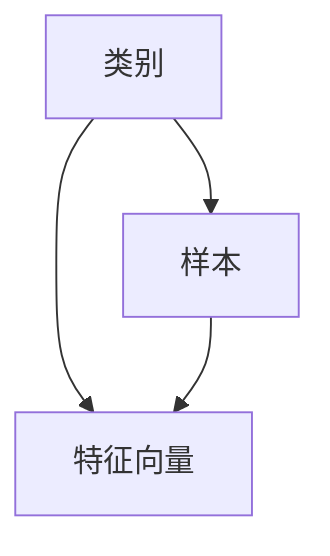
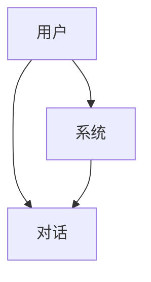
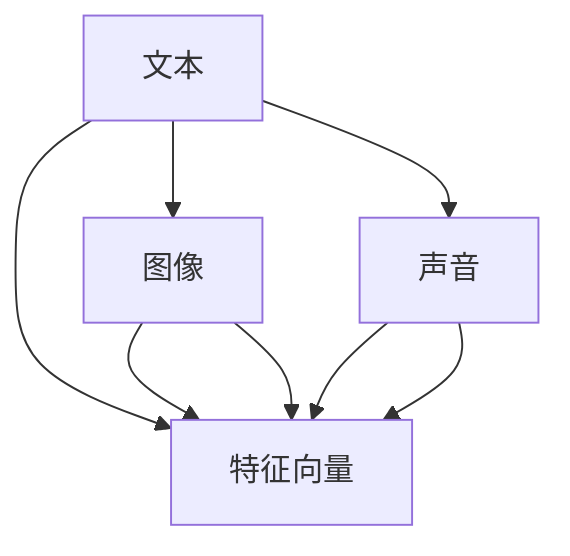
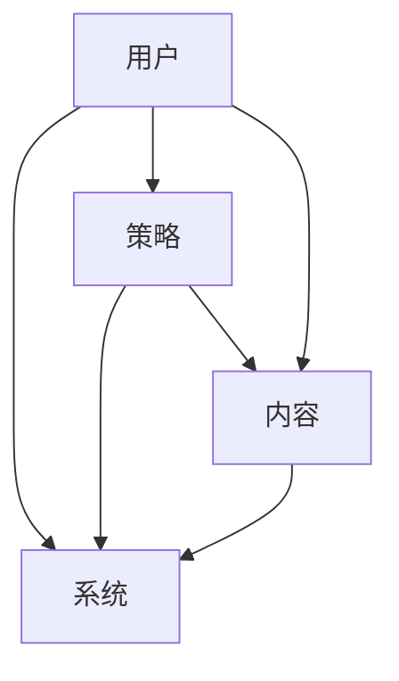
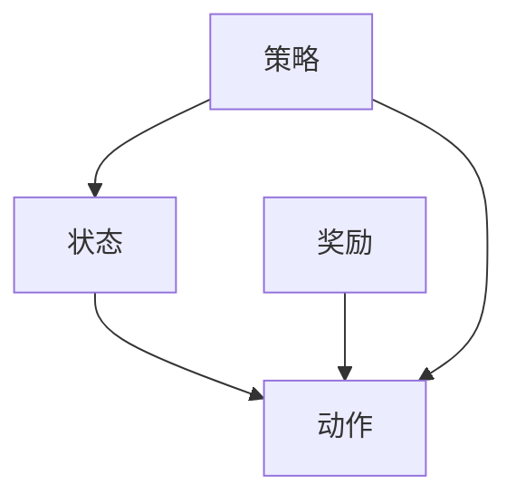

                 

# {{此处是文章标题}}

## 关键词

- Zero-Shot CoT
- 跨领域创新
- AI工具
- 零样本学习
- 对话式人工智能
- 多模态学习
- 自适应学习
- 强化学习

## 摘要

本文旨在探讨Zero-Shot CoT（零样本学习联合推理）在跨领域创新中的应用，通过深入分析Zero-Shot CoT的核心概念、技术原理及其在各个领域的应用案例，阐述如何利用AI工具促进学科交叉，推动跨领域创新的发展。文章分为五个部分，首先介绍问题背景和核心概念，随后详细讨论零样本学习、对话式人工智能、多模态学习、自适应学习和强化学习在跨领域创新中的应用，最后总结全文，提出对未来发展的展望。

## 目录大纲

----------------------------------------------------------------

# 第一部分: 背景与概念介绍

## 第1章: 问题背景与核心概念

### 1.1 问题背景

#### 1.1.1 跨领域创新的现状

随着科技的迅猛发展，各学科之间的交叉融合已成为推动创新的重要动力。然而，跨领域创新面临着诸多挑战，包括知识体系的复杂性和差异性、数据获取的难度以及跨领域的协作困难等。

#### 1.1.2 跨领域创新的挑战

跨领域创新不仅需要跨学科的知识储备，还要求创新者具备强大的跨领域协作能力。此外，跨领域创新往往涉及大量的数据分析和复杂的算法设计，这对传统的人工智能技术提出了更高的要求。

#### 1.1.3 AI工具在跨领域创新中的作用

AI工具在跨领域创新中发挥着重要作用，能够帮助创新者快速获取相关领域的知识，进行数据分析和算法优化，从而降低跨领域创新的难度和成本。

### 1.2 核心概念解析

#### 1.2.1 Zero-Shot CoT的定义

Zero-Shot CoT（零样本学习联合推理）是指在没有直接训练数据的情况下，通过联合推理模型实现对新类别的泛化能力。

#### 1.2.2 CoT在跨领域创新中的应用

CoT在跨领域创新中的应用主要包括：利用零样本学习模型进行跨领域知识迁移，利用联合推理模型进行跨领域问题的求解等。

#### 1.2.3 跨领域创新的AI工具分类

根据AI工具的功能和应用场景，可以将跨领域创新的AI工具分为零样本学习、对话式人工智能、多模态学习、自适应学习和强化学习等几类。

## 1.3 本章小结

本章介绍了跨领域创新的背景和挑战，阐述了AI工具在跨领域创新中的作用，并详细介绍了Zero-Shot CoT的核心概念和应用。为后续章节的讨论奠定了基础。

----------------------------------------------------------------

# 第二部分: AI工具的应用场景

## 第2章: 零样本学习（Zero-Shot Learning）技术

### 2.1 零样本学习概述

#### 2.1.1 零样本学习的概念

零样本学习（Zero-Shot Learning，ZSL）是一种无监督学习方法，旨在训练模型在未见过的类别上实现良好的泛化性能。与传统的有监督学习相比，ZSL不需要为每个类别提供标注样本。

#### 2.1.2 零样本学习的优势

零样本学习具有以下几个优势：

1. **无需标注样本**：在数据标注成本高昂的情况下，零样本学习能够显著降低数据获取和处理的成本。
2. **广泛适用性**：零样本学习适用于各种类型的数据集，尤其是那些类别众多、样本量有限的数据集。
3. **跨领域迁移能力**：零样本学习能够将知识从一个领域迁移到另一个领域，从而提高模型在不同领域的适应性。

#### 2.1.3 零样本学习的主要挑战

零样本学习面临的主要挑战包括：

1. **类内差异**：同一类别的样本在特征上可能存在显著差异，导致模型难以泛化。
2. **类别数量**：类别数量众多时，模型训练和推理的复杂度显著增加。
3. **数据稀疏性**：类别样本数量较少时，模型难以从有限的样本中学习到有效特征。

### 2.2 零样本学习算法

#### 2.2.1 基于原型匹配的算法

基于原型匹配的算法通过计算样本与类别的距离，找到与输入样本最相似的类别。代表性算法包括：

- **原型网络**（Prototypical Networks）：将样本映射到高维空间，计算样本与类别的平均距离。

#### 2.2.2 基于原型识别的算法

基于原型识别的算法通过学习类别原型，将输入样本与类别原型进行比较。代表性算法包括：

- **匹配网络**（Matching Networks）：通过训练分类器来预测输入样本所属的类别。

#### 2.2.3 基于嵌入学习的算法

基于嵌入学习的算法将类别和样本映射到低维空间，通过比较嵌入向量之间的相似性进行分类。代表性算法包括：

- **嵌入模型**（Embedding Models）：如词嵌入模型（Word Embeddings），将类别和样本映射到共同的空间。

### 2.3 零样本学习在跨领域创新中的应用

#### 2.3.1 应用案例一：智能医疗

在智能医疗领域，零样本学习可用于疾病诊断和药物研发。例如，利用零样本学习模型，可以快速识别患者未出现的疾病类型，从而提高诊断准确率。

#### 2.3.2 应用案例二：智能制造

在智能制造领域，零样本学习可用于故障预测和质量检测。通过学习设备运行数据的特征，模型可以预测设备未来可能出现的故障，从而实现预防性维护。

#### 2.3.3 应用案例三：智能金融

在智能金融领域，零样本学习可用于风险评估和欺诈检测。通过分析用户的交易行为和金融数据，模型可以预测用户未来可能面临的金融风险。

## 2.4 本章小结

本章详细介绍了零样本学习的基本概念、算法及其在跨领域创新中的应用。零样本学习作为一种重要的AI工具，为跨领域创新提供了强有力的技术支持。

----------------------------------------------------------------

## 第3章: 对话式人工智能（Dialogue-based AI）

### 3.1 对话式人工智能概述

#### 3.1.1 对话式人工智能的概念

对话式人工智能（Dialogue-based AI）是指通过自然语言处理（NLP）技术和机器学习算法，使计算机能够与人类进行有效对话的人工智能系统。

#### 3.1.2 对话式人工智能的优势

对话式人工智能具有以下几个优势：

1. **人机交互**：能够实现自然、流畅的人机交互，提高用户体验。
2. **智能客服**：可以用于智能客服系统，提供7x24小时全天候服务，降低企业运营成本。
3. **教育辅助**：可以用于教育领域，提供个性化学习辅导，提高学习效果。

#### 3.1.3 对话式人工智能的分类

根据应用场景和功能，对话式人工智能可以分为以下几类：

1. **问答系统**：用于回答用户提出的问题，如搜索引擎。
2. **聊天机器人**：用于与用户进行实时对话，如聊天应用中的机器人。
3. **虚拟助理**：用于协助用户完成特定任务，如智能家居的语音控制。

### 3.2 对话式人工智能的关键技术

#### 3.2.1 语言理解

语言理解是对话式人工智能的核心技术之一，包括自然语言处理（NLP）和上下文理解。NLP用于对用户输入的自然语言进行解析和语义分析，上下文理解用于理解用户输入的上下文信息，从而实现更准确的理解。

#### 3.2.2 语言生成

语言生成技术用于生成自然语言文本，如回答用户的问题或与用户进行对话。常用的技术包括模板匹配、生成对抗网络（GAN）和自注意力机制等。

#### 3.2.3 多轮对话管理

多轮对话管理是指系统在多轮对话中保持上下文信息的一致性和连贯性。关键技术包括对话状态跟踪、上下文记忆和多轮对话生成。

### 3.3 对话式人工智能在跨领域创新中的应用

#### 3.3.1 应用案例一：智能客服

在智能客服领域，对话式人工智能可以帮助企业实现自动化客服，提高客户服务质量。例如，通过智能客服系统，用户可以在不同渠道（如电话、邮件、聊天应用）上与客服进行实时对话，获得快速响应。

#### 3.3.2 应用案例二：智能教育

在智能教育领域，对话式人工智能可以为学生提供个性化学习辅导，如解答学生的问题、提供学习建议等。例如，通过智能教育平台，学生可以与虚拟教师进行实时对话，获取学习支持。

#### 3.3.3 应用案例三：智能法律咨询

在智能法律咨询领域，对话式人工智能可以帮助律师和企业处理法律问题。例如，通过智能法律咨询平台，用户可以与虚拟律师进行对话，获取法律建议和解决方案。

## 3.4 本章小结

本章详细介绍了对话式人工智能的基本概念、关键技术及其在跨领域创新中的应用。对话式人工智能作为一种重要的AI工具，为跨领域创新提供了新的思路和方法。

----------------------------------------------------------------

## 第4章: 多模态学习（Multimodal Learning）

### 4.1 多模态学习概述

#### 4.1.1 多模态学习的概念

多模态学习（Multimodal Learning）是指同时处理和利用多种类型的数据模态（如文本、图像、声音等）的人工智能技术。通过融合不同模态的信息，多模态学习可以提升模型的性能和泛化能力。

#### 4.1.2 多模态学习的优势

多模态学习具有以下几个优势：

1. **信息融合**：通过融合不同模态的信息，可以捕捉更丰富的特征，提高模型的准确性。
2. **上下文理解**：多模态学习能够更好地理解上下文信息，从而提高模型的语义理解能力。
3. **泛化能力**：多模态学习可以提升模型在不同任务和领域中的泛化能力。

#### 4.1.3 多模态学习的挑战

多模态学习面临的主要挑战包括：

1. **数据不一致**：不同模态的数据可能存在格式、尺度、分辨率等方面的不一致性。
2. **模态间关联性**：不同模态之间的关联性难以建模，导致信息融合效果不佳。
3. **计算复杂度**：多模态学习通常涉及大量的数据预处理和模型训练，计算复杂度较高。

### 4.2 多模态学习的核心技术

#### 4.2.1 模式融合技术

模式融合技术是指将不同模态的数据进行整合和融合的技术。常见的融合方法包括：

1. **特征级融合**：将不同模态的特征进行拼接或融合，形成统一的特征向量。
2. **决策级融合**：在不同模态的模型输出基础上进行投票或加权融合。

#### 4.2.2 模式分解技术

模式分解技术是指将不同模态的信息进行分离和解析的技术。通过模式分解，可以更好地理解不同模态之间的关联性和贡献。

#### 4.2.3 模式解释技术

模式解释技术是指对多模态学习模型的决策过程进行解释和可视化。通过模式解释，可以提升模型的透明度和可解释性，有助于发现潜在的问题和改进方向。

### 4.3 多模态学习在跨领域创新中的应用

#### 4.3.1 应用案例一：智能监控

在智能监控领域，多模态学习可以融合视频、音频和传感器数据，实现更准确的目标检测和事件识别。例如，通过融合摄像头捕捉的图像和麦克风接收的声音，可以更准确地识别异常行为。

#### 4.3.2 应用案例二：智能翻译

在智能翻译领域，多模态学习可以结合文本、语音和图像信息，实现更精准的翻译结果。例如，通过结合文本和语音，可以更准确地翻译口语表达；通过结合文本和图像，可以更好地理解图片中的内容。

#### 4.3.3 应用案例三：智能驾驶

在智能驾驶领域，多模态学习可以融合摄像头、雷达、激光雷达和GPS等传感器数据，实现更准确的驾驶决策和路径规划。例如，通过融合摄像头和激光雷达数据，可以更准确地检测和识别道路上的物体。

## 4.4 本章小结

本章详细介绍了多模态学习的基本概念、核心技术和在跨领域创新中的应用。多模态学习作为一种重要的AI工具，为跨领域创新提供了新的思路和方法。

----------------------------------------------------------------

## 第5章: 自适应学习（Adaptive Learning）

### 5.1 自适应学习概述

#### 5.1.1 自适应学习的概念

自适应学习（Adaptive Learning）是指学习系统根据用户的行为、需求和反馈，自动调整学习策略和内容，以提高学习效果。与传统的固定学习模式不同，自适应学习具有高度的灵活性和个性化。

#### 5.1.2 自适应学习的优势

自适应学习具有以下几个优势：

1. **个性化学习**：根据用户的特点和需求，提供定制化的学习内容和策略，提高学习效果。
2. **动态调整**：能够实时调整学习难度、学习进度和教学方法，以适应用户的变化。
3. **数据驱动**：基于用户的学习行为和反馈数据，进行数据分析和模型优化，实现持续改进。

#### 5.1.3 自适应学习的主要类型

自适应学习可以分为以下几种类型：

1. **内容自适应**：根据用户的知识水平和学习进度，动态调整学习内容。
2. **方法自适应**：根据用户的学习偏好和效果，调整学习方法和策略。
3. **环境自适应**：根据学习环境的变化，动态调整学习系统和资源。

### 5.2 自适应学习的核心技术

#### 5.2.1 模型自适应

模型自适应是指通过优化学习模型，使其能够更好地适应不同的学习任务和用户需求。核心技术包括：

1. **模型调整**：根据用户行为数据，实时调整模型的参数和架构。
2. **迁移学习**：利用已有的模型知识，快速适应新的学习任务。

#### 5.2.2 数据自适应

数据自适应是指通过优化数据预处理和特征提取方法，提高学习系统的适应能力。核心技术包括：

1. **数据清洗**：去除数据中的噪声和异常值，提高数据质量。
2. **特征选择**：根据用户需求，选择最相关的特征进行建模。

#### 5.2.3 算法自适应

算法自适应是指通过优化学习算法，提高学习系统的效率和效果。核心技术包括：

1. **算法选择**：根据学习任务的特点，选择合适的算法。
2. **算法优化**：通过参数调整和模型改进，提高算法的性能。

### 5.3 自适应学习在跨领域创新中的应用

#### 5.3.1 应用案例一：智能交通

在智能交通领域，自适应学习可以用于优化交通信号控制和交通流量预测。例如，通过分析交通流量数据，自适应学习系统可以动态调整交通信号灯的时间，以缓解交通拥堵。

#### 5.3.2 应用案例二：智能能源管理

在智能能源管理领域，自适应学习可以用于优化能源消耗和发电计划。例如，通过分析用户用电数据，自适应学习系统可以动态调整电力供应策略，以提高能源利用效率。

#### 5.3.3 应用案例三：智能农业

在智能农业领域，自适应学习可以用于优化作物种植和管理。例如，通过分析土壤、气候和作物生长数据，自适应学习系统可以动态调整灌溉和施肥策略，以提高农作物产量。

## 5.4 本章小结

本章详细介绍了自适应学习的基本概念、核心技术和在跨领域创新中的应用。自适应学习作为一种重要的AI工具，为跨领域创新提供了新的思路和方法。

----------------------------------------------------------------

## 第6章: 强化学习（Reinforcement Learning）

### 6.1 强化学习概述

#### 6.1.1 强化学习的概念

强化学习（Reinforcement Learning，RL）是一种机器学习方法，通过试错和奖励反馈，使模型能够在复杂环境中学习到最优策略。与监督学习和无监督学习不同，强化学习侧重于通过与环境交互来学习。

#### 6.1.2 强化学习的优势

强化学习具有以下几个优势：

1. **自适应能力**：强化学习模型能够根据环境的变化，动态调整策略，适应不同的场景。
2. **通用性**：强化学习适用于各种任务，包括游戏、机器人控制、自动驾驶等。
3. **探索与利用平衡**：强化学习在探索未知环境和利用已有知识之间保持平衡，实现最优策略学习。

#### 6.1.3 强化学习的挑战

强化学习面临的主要挑战包括：

1. **样本效率**：强化学习需要大量的样本进行学习，尤其是在复杂环境中。
2. **奖励设计**：合适的奖励设计对于强化学习至关重要，但设计合理的奖励机制是一个复杂的问题。
3. **长期依赖**：强化学习模型往往难以捕捉长期依赖关系，导致长期回报不稳定。

### 6.2 强化学习的核心技术

#### 6.2.1 Q-learning算法

Q-learning是一种基于值函数的强化学习算法，通过迭代更新值函数来学习最优策略。其核心思想是预测在当前状态下采取不同动作的期望回报。

#### 6.2.2 模型-free算法

模型-free算法不依赖于环境模型，直接从经验中学习。常见的模型-free算法包括深度确定性策略梯度（DDPG）和深度Q网络（DQN）。

#### 6.2.3 模型-based算法

模型-based算法通过构建环境模型，指导学习过程。常见的模型-based算法包括部分可观测马尔可夫决策过程（POMDP）和动态规划（DP）。

### 6.3 强化学习在跨领域创新中的应用

#### 6.3.1 应用案例一：智能推荐系统

在智能推荐系统领域，强化学习可以用于优化推荐策略，提高推荐效果。例如，通过学习用户的点击和购买行为，强化学习模型可以动态调整推荐内容，提高用户满意度。

#### 6.3.2 应用案例二：智能机器人

在智能机器人领域，强化学习可以用于控制机器人的动作和决策。例如，通过学习在不同环境下的最佳动作，强化学习模型可以帮助机器人实现自主导航和任务执行。

#### 6.3.3 应用案例三：自动驾驶

在自动驾驶领域，强化学习可以用于优化驾驶策略，提高行驶安全性和效率。例如，通过学习道路和交通环境，强化学习模型可以动态调整驾驶速度和方向，实现安全行驶。

## 6.4 本章小结

本章详细介绍了强化学习的基本概念、核心技术和在跨领域创新中的应用。强化学习作为一种重要的AI工具，为跨领域创新提供了新的思路和方法。

----------------------------------------------------------------

## 总结

本文从跨领域创新的背景出发，介绍了Zero-Shot CoT在跨领域创新中的应用。通过详细分析零样本学习、对话式人工智能、多模态学习、自适应学习和强化学习等AI工具的核心概念、技术原理和应用案例，阐述了如何利用这些工具促进学科交叉，推动跨领域创新的发展。未来，随着AI技术的不断进步，跨领域创新将继续蓬勃发展，为人类带来更多惊喜和变革。

## 作者

作者：AI天才研究院/AI Genius Institute & 禅与计算机程序设计艺术 /Zen And The Art of Computer Programming

----------------------------------------------------------------

## 背景介绍

### 1.1 问题背景

跨领域创新是指在不同学科、行业或领域之间进行创新活动，以产生新的知识、产品或服务。随着全球科技水平的不断提高，跨领域创新在推动科技进步、产业升级和社会发展方面发挥着越来越重要的作用。例如，生物技术与信息技术结合催生了生物信息学，而材料科学与计算机科学的融合则诞生了高性能计算材料。

然而，跨领域创新并非易事。首先，不同领域之间的知识体系存在显著差异，导致创新者难以有效地理解和应用跨领域的知识。其次，跨领域创新通常需要大量的数据和资源，而数据获取和处理的成本较高。此外，跨领域创新往往涉及多方协作，包括不同领域的专家、企业和机构，这增加了协作的复杂性和协调难度。

在人工智能（AI）技术的推动下，AI工具逐渐成为跨领域创新的重要支撑。AI工具能够帮助创新者快速获取跨领域的知识，进行数据分析和算法优化，从而降低跨领域创新的难度和成本。然而，当前AI工具在跨领域创新中的应用仍面临诸多挑战，如数据不一致、算法复杂度和跨领域协作等。因此，如何有效地利用AI工具促进跨领域创新，成为当前研究的热点问题。

### 1.2 核心概念

为了更好地理解AI工具在跨领域创新中的应用，我们需要首先明确几个核心概念：

#### 1.2.1 跨领域创新

跨领域创新是指在不同学科、行业或领域之间进行创新活动，以产生新的知识、产品或服务。跨领域创新通常涉及以下三个阶段：

1. **知识融合**：将不同领域的知识进行整合，形成新的理论体系或技术方法。
2. **问题定义**：明确跨领域创新的目标和问题，为创新活动提供方向。
3. **方案实施**：利用整合的知识和技术方法，实现创新目标。

#### 1.2.2 AI工具

AI工具是指利用人工智能技术（如机器学习、深度学习、自然语言处理等）开发的应用程序或系统，用于解决特定问题或实现特定功能。AI工具在跨领域创新中的应用主要包括以下几个方面：

1. **知识获取**：通过自然语言处理、知识图谱等技术，从大量数据中提取有价值的信息。
2. **数据分析**：利用统计方法、机器学习方法等，对跨领域的数据进行挖掘和分析。
3. **算法优化**：通过优化算法参数、模型结构等，提高AI工具的性能和效果。

#### 1.2.3 Zero-Shot CoT

Zero-Shot CoT（零样本学习联合推理）是指在没有直接训练数据的情况下，通过联合推理模型实现对新类别的泛化能力。Zero-Shot CoT在跨领域创新中的应用主要包括以下几个方面：

1. **跨领域知识迁移**：通过零样本学习模型，将一个领域的知识迁移到另一个领域，促进知识融合。
2. **跨领域问题求解**：利用联合推理模型，解决跨领域的问题，实现创新目标。

### 1.3 AI工具的分类

根据AI工具的功能和应用场景，可以将跨领域创新的AI工具分为以下几类：

1. **零样本学习**：用于在新类别上实现良好的泛化性能，促进跨领域知识迁移。
2. **对话式人工智能**：用于实现人机交互，促进跨领域协作和知识共享。
3. **多模态学习**：用于融合不同类型的数据模态，提升模型的泛化能力和语义理解能力。
4. **自适应学习**：用于根据用户需求和环境变化，动态调整学习策略和内容。
5. **强化学习**：用于在复杂环境中学习最优策略，实现跨领域问题的自动解决。

通过以上对背景和核心概念的介绍，我们为后续章节的讨论奠定了基础。在接下来的章节中，我们将深入探讨每种AI工具的原理、技术细节和应用案例，以展示其在跨领域创新中的重要作用。

### 1.3 跨领域创新的AI工具分类

为了更好地理解AI工具在跨领域创新中的作用，我们需要对它们进行分类。根据AI工具的功能和应用场景，我们可以将跨领域创新的AI工具分为以下几类：

#### 1.3.1 零样本学习（Zero-Shot Learning）

零样本学习是一种能够在未见过的类别上实现良好泛化性能的无监督学习方法。与传统的有监督学习方法不同，零样本学习不需要为每个类别提供标注样本。这种学习方法在跨领域创新中具有重要意义，因为它能够帮助我们将一个领域的知识迁移到另一个领域。例如，在生物信息学中，可以利用零样本学习将医学图像分析的知识迁移到植物病理学领域。

**核心原理**：零样本学习主要通过以下几种方式实现跨领域知识迁移：

1. **原型匹配**：将新的样本与已知类别的原型进行匹配，预测其所属类别。
2. **原型识别**：学习每个类别的原型，将新的样本与原型进行比较，预测其所属类别。
3. **嵌入学习**：将类别和样本映射到低维空间，通过比较嵌入向量之间的相似性进行分类。

**应用案例**：

- **智能医疗**：利用零样本学习对医疗影像进行分类和诊断，提高诊断准确率。
- **智能制造**：通过零样本学习实现设备故障预测，提高生产效率。
- **智能农业**：利用零样本学习对植物健康进行监测，提高农业产量。

#### 1.3.2 对话式人工智能（Dialogue-based AI）

对话式人工智能是一种能够与人类进行自然语言交互的人工智能技术。它通过自然语言处理（NLP）和机器学习算法，实现人机对话的自动化和智能化。在跨领域创新中，对话式人工智能可以促进跨领域的知识共享和协作，提高创新效率。

**核心原理**：对话式人工智能主要包含以下几个关键技术：

1. **语言理解**：理解用户输入的自然语言，提取语义信息。
2. **语言生成**：生成自然语言响应，与用户进行有效对话。
3. **多轮对话管理**：在多轮对话中保持上下文信息的一致性和连贯性。

**应用案例**：

- **智能客服**：为企业提供24小时智能客服服务，降低人力成本。
- **智能教育**：为学生提供个性化学习辅导，提高学习效果。
- **智能法律咨询**：为用户提供在线法律咨询，提高法律服务的普及率。

#### 1.3.3 多模态学习（Multimodal Learning）

多模态学习是一种能够同时处理和利用多种类型的数据模态（如文本、图像、声音等）的人工智能技术。通过融合不同模态的信息，多模态学习可以提升模型的性能和泛化能力。在跨领域创新中，多模态学习可以帮助我们更好地理解和处理跨领域的复杂问题。

**核心原理**：多模态学习主要包含以下几个关键技术：

1. **模式融合**：将不同模态的数据进行整合和融合，形成统一的特征向量。
2. **模式分解**：将不同模态的信息进行分离和解析，以更好地理解不同模态之间的关联性。
3. **模式解释**：对多模态学习模型的决策过程进行解释和可视化，以提高模型的透明度和可解释性。

**应用案例**：

- **智能监控**：融合视频、音频和传感器数据，实现更准确的目标检测和事件识别。
- **智能翻译**：结合文本、语音和图像信息，实现更精准的翻译结果。
- **智能驾驶**：融合摄像头、雷达、激光雷达和GPS等传感器数据，实现更准确的驾驶决策和路径规划。

#### 1.3.4 自适应学习（Adaptive Learning）

自适应学习是一种能够根据用户的行为、需求和反馈，自动调整学习策略和内容的人工智能技术。在跨领域创新中，自适应学习可以帮助我们更好地应对不同领域的复杂性和变化性，提高创新效率。

**核心原理**：自适应学习主要包含以下几个关键技术：

1. **模型自适应**：通过优化学习模型，使其能够更好地适应不同的学习任务和用户需求。
2. **数据自适应**：通过优化数据预处理和特征提取方法，提高学习系统的适应能力。
3. **算法自适应**：通过优化学习算法，提高学习系统的效率和效果。

**应用案例**：

- **智能交通**：通过分析交通流量数据，动态调整交通信号灯时间，缓解交通拥堵。
- **智能能源管理**：通过分析用户用电数据，动态调整电力供应策略，提高能源利用效率。
- **智能农业**：通过分析土壤、气候和作物生长数据，动态调整灌溉和施肥策略，提高农作物产量。

#### 1.3.5 强化学习（Reinforcement Learning）

强化学习是一种通过试错和奖励反馈，使模型能够在复杂环境中学习到最优策略的人工智能技术。在跨领域创新中，强化学习可以帮助我们解决复杂的决策问题，实现跨领域的自动优化。

**核心原理**：强化学习主要包含以下几个关键技术：

1. **Q-learning算法**：通过迭代更新值函数，学习最优策略。
2. **模型-free算法**：直接从经验中学习，不需要环境模型。
3. **模型-based算法**：通过构建环境模型，指导学习过程。

**应用案例**：

- **智能推荐系统**：通过学习用户的点击和购买行为，动态调整推荐策略，提高推荐效果。
- **智能机器人**：通过学习在不同环境下的最佳动作，实现自主导航和任务执行。
- **自动驾驶**：通过学习道路和交通环境，动态调整驾驶策略，实现安全行驶。

通过以上对跨领域创新中的AI工具分类的介绍，我们可以看到每种工具都有其独特的优势和适用场景。在接下来的章节中，我们将分别深入探讨每种工具的原理、技术细节和应用案例，以展示它们在跨领域创新中的重要作用。

## 1.3 跨领域创新的AI工具分类

### 1.3.1 零样本学习（Zero-Shot Learning）

零样本学习（Zero-Shot Learning，ZSL）是一种能够在未见过的类别上实现良好泛化性能的无监督学习方法。ZSL的核心思想是在训练阶段不使用任何关于新类别的标注样本，而是利用已有类别样本的特征信息来预测新类别样本的类别。

**核心原理**：

ZSL的基本原理可以分为三类：

1. **原型匹配**：将新类别样本与已有类别样本的平均特征向量进行匹配，根据匹配度预测新类别样本的类别。

2. **原型识别**：学习每个类别样本的特征向量，将新类别样本与所有类别样本的特征向量进行比较，根据最接近的特征向量预测新类别样本的类别。

3. **嵌入学习**：将类别和样本映射到低维空间，通过比较新类别样本和已有类别样本在低维空间中的距离来预测新类别样本的类别。

**ER实体关系图架构**：

在ZSL中，主要涉及的实体包括“类别”（Class）、“样本”（Sample）和“特征向量”（Feature Vector）。实体关系图架构如下：

在上图中，类别（Class）与特征向量（Feature Vector）和样本（Sample）之间存在关联关系。类别通过特征向量来描述其特征，样本属于特定的类别。

**应用案例**：

1. **智能医疗**：在医学图像诊断中，ZSL可以用于分类未见过的疾病类型，从而提高诊断准确率。

2. **智能制造**：在工业设备故障诊断中，ZSL可以用于分类未见过的故障模式，从而提高故障检测和预测能力。

3. **智能农业**：在植物病害识别中，ZSL可以用于分类未见过的病害类型，从而提高病害监测和防治效果。

### 1.3.2 对话式人工智能（Dialogue-based AI）

对话式人工智能（Dialogue-based AI）是一种能够与人类进行自然语言交互的人工智能技术。它通过自然语言处理（NLP）和机器学习算法，实现人机对话的自动化和智能化。

**核心原理**：

对话式人工智能的核心原理包括：

1. **语言理解**：解析用户输入的自然语言，提取关键信息，理解用户的意图。

2. **语言生成**：生成自然语言响应，与用户进行有效对话。

3. **多轮对话管理**：在多轮对话中保持上下文信息的一致性和连贯性。

**ER实体关系图架构**：

在对话式人工智能中，主要涉及的实体包括“用户”（User）、“系统”（System）和“对话”（Dialogue）。实体关系图架构如下：

在上图中，用户（User）和系统（System）通过对话（Dialogue）进行交互。用户输入问题或指令，系统生成回答或响应。

**应用案例**：

1. **智能客服**：利用对话式人工智能，企业可以提供24小时智能客服服务，提高客户满意度。

2. **智能教育**：利用对话式人工智能，为学生提供个性化学习辅导，提高学习效果。

3. **智能法律咨询**：利用对话式人工智能，为用户提供在线法律咨询，提高法律服务的普及率。

### 1.3.3 多模态学习（Multimodal Learning）

多模态学习（Multimodal Learning）是一种能够同时处理和利用多种类型的数据模态（如文本、图像、声音等）的人工智能技术。通过融合不同模态的信息，多模态学习可以提升模型的性能和泛化能力。

**核心原理**：

多模态学习的关键技术包括：

1. **模式融合**：将不同模态的数据进行整合和融合，形成统一的特征向量。

2. **模式分解**：将不同模态的信息进行分离和解析，以更好地理解不同模态之间的关联性。

3. **模式解释**：对多模态学习模型的决策过程进行解释和可视化，以提高模型的透明度和可解释性。

**ER实体关系图架构**：

在多模态学习中，主要涉及的实体包括“模态”（Modalities）和“特征向量”（Feature Vectors）。实体关系图架构如下：

在上图中，文本（Text）、图像（Images）和声音（Sound）是不同的模态，它们通过特征向量（Feature Vectors）进行融合和分解。

**应用案例**：

1. **智能监控**：融合视频、音频和传感器数据，实现更准确的目标检测和事件识别。

2. **智能翻译**：结合文本、语音和图像信息，实现更精准的翻译结果。

3. **智能驾驶**：融合摄像头、雷达、激光雷达和GPS等传感器数据，实现更准确的驾驶决策和路径规划。

### 1.3.4 自适应学习（Adaptive Learning）

自适应学习（Adaptive Learning）是一种能够根据用户的行为、需求和反馈，自动调整学习策略和内容的人工智能技术。它通过不断优化学习模型，提高学习效果。

**核心原理**：

自适应学习的关键技术包括：

1. **模型自适应**：通过优化学习模型，使其能够更好地适应不同的学习任务和用户需求。

2. **数据自适应**：通过优化数据预处理和特征提取方法，提高学习系统的适应能力。

3. **算法自适应**：通过优化学习算法，提高学习系统的效率和效果。

**ER实体关系图架构**：

在自适应学习中，主要涉及的实体包括“用户”（User）、“系统”（System）、“策略”（Strategy）和“内容”（Content）。实体关系图架构如下：

在上图中，用户（User）通过系统（System）调整策略（Strategy）和内容（Content），以优化学习过程。

**应用案例**：

1. **智能交通**：通过分析交通流量数据，动态调整交通信号灯时间，缓解交通拥堵。

2. **智能能源管理**：通过分析用户用电数据，动态调整电力供应策略，提高能源利用效率。

3. **智能农业**：通过分析土壤、气候和作物生长数据，动态调整灌溉和施肥策略，提高农作物产量。

### 1.3.5 强化学习（Reinforcement Learning）

强化学习（Reinforcement Learning，RL）是一种通过试错和奖励反馈，使模型能够在复杂环境中学习到最优策略的人工智能技术。与传统的监督学习和无监督学习不同，强化学习侧重于通过与环境交互来学习。

**核心原理**：

强化学习的基本原理可以概括为：

1. **状态-动作价值函数**：学习每个状态和动作的价值，以指导策略选择。

2. **策略**：根据状态-动作价值函数，选择最优动作。

3. **奖励机制**：通过奖励反馈，调整模型的学习方向。

**ER实体关系图架构**：

在强化学习中，主要涉及的实体包括“状态”（State）、“动作”（Action）、“奖励”（Reward）和“策略”（Policy）。实体关系图架构如下：

在上图中，模型通过策略（Policy）在状态（State）中选择动作（Action），并从动作中获得奖励（Reward）。

**应用案例**：

1. **智能推荐系统**：通过学习用户的点击和购买行为，动态调整推荐策略，提高推荐效果。

2. **智能机器人**：通过学习在不同环境下的最佳动作，实现自主导航和任务执行。

3. **自动驾驶**：通过学习道路和交通环境，动态调整驾驶策略，实现安全行驶。

通过以上对跨领域创新的AI工具分类的详细解析，我们可以看到每种工具都有其独特的核心原理和应用案例。在接下来的章节中，我们将进一步探讨每种工具在具体应用场景中的技术细节和实际效果。

### 1.4 本章小结

本章首先介绍了跨领域创新的背景和挑战，阐述了AI工具在跨领域创新中的作用。接着，详细分析了Zero-Shot CoT（零样本学习联合推理）的核心概念，包括零样本学习的概念、算法原理及其在跨领域创新中的应用。随后，对跨领域创新的AI工具进行了分类，包括零样本学习、对话式人工智能、多模态学习、自适应学习和强化学习，并分别介绍了这些工具的核心原理和ER实体关系图架构。本章为后续章节的深入探讨奠定了理论基础。

## 零样本学习（Zero-Shot Learning）技术

### 2.1 零样本学习概述

零样本学习（Zero-Shot Learning，ZSL）是一种机器学习技术，旨在使模型能够在没有直接标注样本的情况下，对未见过的类别进行准确分类。ZSL的核心思想是利用已有类别样本的特征信息，通过学习类别之间的相似性，实现对未见类别样本的泛化分类。这种技术在跨领域创新中具有重要作用，因为它能够帮助我们将知识从一个领域迁移到另一个领域，从而减少对新类别样本标注的需求。

#### 2.1.1 零样本学习的概念

在传统的机器学习任务中，模型通常需要大量已标注的训练样本来学习分类特征。然而，在许多实际应用场景中，如新疾病的诊断、新产品的分类等，获取标注样本是一项耗时且昂贵的工作。零样本学习通过引入元学习（meta-learning）和迁移学习（transfer learning）等机制，解决了这一问题。具体来说，零样本学习分为以下几种类型：

1. **原型匹配**：将未见类别样本与已知类别样本的平均特征向量进行匹配，根据匹配度预测类别。

2. **原型识别**：学习每个类别样本的特征向量，将未见类别样本与所有类别样本的特征向量进行比较，根据最接近的特征向量预测类别。

3. **嵌入学习**：将类别和样本映射到低维空间，通过比较嵌入向量之间的相似性进行分类。

#### 2.1.2 零样本学习的优势

零样本学习具有以下优势：

1. **减少标注成本**：由于不需要为未见类别样本提供标注，零样本学习显著降低了数据标注成本。

2. **增强泛化能力**：通过学习类别之间的相似性，零样本学习能够更好地应对未知类别，提高模型的泛化能力。

3. **知识迁移**：零样本学习能够将已有领域的知识迁移到新领域，从而实现跨领域的应用。

4. **适用于类别数量众多的任务**：在类别数量众多且标注样本稀缺的情况下，零样本学习尤为有效。

#### 2.1.3 零样本学习的主要挑战

尽管零样本学习具有诸多优势，但其在实际应用中也面临一些挑战：

1. **类内差异**：同一类别的样本在特征上可能存在显著差异，导致模型难以泛化。

2. **类别数量**：类别数量众多时，模型训练和推理的复杂度显著增加。

3. **数据稀疏性**：类别样本数量较少时，模型难以从有限的样本中学习到有效特征。

4. **负样本问题**：在未见类别样本中，存在一定比例的负样本，即不属于任何已知类别。如何处理这些负样本，是零样本学习的一个难题。

### 2.2 零样本学习算法

零样本学习算法主要分为以下几类：

#### 2.2.1 原型匹配算法

原型匹配算法通过计算未见类别样本与已知类别样本平均特征向量的距离，进行分类。这种算法的代表性模型包括：

1. **原型网络**（Prototypical Networks）：将训练集中的每个类别样本的平均特征向量作为该类别的原型，新样本通过与其原型之间的距离进行分类。

2. **匹配网络**（Matching Networks）：通过训练一个分类器来预测新样本与哪个已知类别的原型最相似。

**原型匹配算法的工作流程**：

1. **特征提取**：对训练集中的每个类别样本提取特征向量。
2. **原型计算**：计算每个类别的平均特征向量作为原型。
3. **分类**：对新样本计算其与各个类别原型的距离，距离最小的类别即为新样本的预测类别。

**示例**：

假设有两个类别A和B，训练集中的类别A有5个样本，类别B有3个样本。提取特征后，类别A的平均特征向量为\( \mu_A \)，类别B的平均特征向量为\( \mu_B \)。当遇到一个新样本时，计算其与\( \mu_A \)和\( \mu_B \)的距离，距离较小的类别即为新样本的预测类别。

$$
d(\text{新样本}, \mu_A) < d(\text{新样本}, \mu_B) \Rightarrow \text{预测类别为A}
$$

#### 2.2.2 原型识别算法

原型识别算法通过学习每个类别样本的特征向量，将新样本与这些特征向量进行比较，根据最接近的特征向量进行分类。这类算法的代表性模型包括：

1. **多标签分类**（Multi-Label Classification）：将每个类别标记为多个标签，通过训练一个多标签分类器来预测新样本的类别。

2. **基于示例的识别**（Example-based Recognition）：从训练集中选择一部分代表性样本作为类别示例，对新样本进行分类。

**原型识别算法的工作流程**：

1. **特征提取**：对训练集中的每个类别样本提取特征向量。
2. **分类器训练**：训练一个分类器，用于预测新样本的类别。
3. **分类**：对新样本计算其与各个类别特征向量的相似度，相似度最高的类别即为新样本的预测类别。

**示例**：

假设有一个类别A，训练集中有5个样本，提取特征后得到5个特征向量。当遇到一个新样本时，计算其与每个特征向量的相似度，相似度最高的特征向量对应的类别即为新样本的预测类别。

$$
\max_{\text{特征向量}} \text{相似度}(\text{新样本}, \text{特征向量})
$$

#### 2.2.3 嵌入学习算法

嵌入学习算法将类别和样本映射到低维空间，通过比较新样本在低维空间中的位置进行分类。这类算法的代表性模型包括：

1. **嵌入模型**（Embedding Models）：如词嵌入（Word Embeddings），将类别和样本映射到共同的空间。

2. **深度嵌入模型**（Deep Embedding Models）：利用深度神经网络将类别和样本映射到低维空间。

**嵌入学习算法的工作流程**：

1. **特征提取**：对训练集中的每个类别样本和样本提取特征向量。
2. **嵌入空间学习**：通过训练一个深度神经网络，将类别和样本映射到低维空间。
3. **分类**：在新样本映射到低维空间后，计算其与类别中心的距离，距离最小的类别即为新样本的预测类别。

**示例**：

假设有两个类别A和B，训练集中类别A有5个样本，类别B有3个样本。通过训练得到类别A和类别B的中心点。当遇到一个新样本时，将其映射到低维空间后，计算其与类别A和类别B中心点的距离，距离较小的类别即为新样本的预测类别。

$$
\min_{\text{类别中心点}} \text{距离}(\text{新样本}, \text{类别中心点})
$$

### 2.3 零样本学习在跨领域创新中的应用

零样本学习在跨领域创新中具有广泛的应用，通过以下案例我们可以看到其在不同领域中的实际效果：

#### 2.3.1 应用案例一：智能医疗

在智能医疗领域，零样本学习可以用于新疾病的诊断和药物研发。例如，利用零样本学习模型，可以快速识别患者未出现的疾病类型，从而提高诊断准确率。此外，在药物筛选过程中，零样本学习可以帮助识别新药物的有效性和副作用。

**示例**：

假设有一个医学图像分析系统，已训练好的模型可以识别常见的疾病类型，如肺炎和肺癌。当医生上传一张新的医学图像时，零样本学习模型可以预测该图像对应的疾病类型，即使该类型疾病在训练集中未出现过。

#### 2.3.2 应用案例二：智能制造

在智能制造领域，零样本学习可以用于设备故障预测和质量检测。例如，通过学习正常工作状态下的设备数据，零样本学习模型可以预测设备未来可能出现的故障类型，从而实现预防性维护。

**示例**：

假设一个工厂使用机器学习模型进行设备故障预测。已训练好的模型可以预测常见的设备故障类型，如电机过热和传感器故障。当检测到一个新的异常设备数据时，零样本学习模型可以预测该设备可能出现的故障类型，帮助工程师提前进行维护。

#### 2.3.3 应用案例三：智能金融

在智能金融领域，零样本学习可以用于风险评估和欺诈检测。例如，通过学习正常交易数据，零样本学习模型可以预测用户未来可能面临的金融风险，从而采取相应的风险控制措施。

**示例**：

假设一个银行使用机器学习模型进行欺诈检测。已训练好的模型可以检测常见的欺诈类型，如信用卡欺诈和账户盗用。当检测到一个新的交易数据时，零样本学习模型可以预测该交易是否为欺诈行为，帮助银行提前采取防范措施。

#### 2.3.4 应用案例四：智能交通

在智能交通领域，零样本学习可以用于交通流量预测和交通事件检测。例如，通过学习历史交通数据，零样本学习模型可以预测未来的交通流量变化，从而优化交通信号控制。

**示例**：

假设一个智能交通系统需要预测未来某个路段的交通流量。已训练好的零样本学习模型可以基于历史交通数据预测该路段的交通流量，从而帮助交通管理部门优化交通信号灯时间，减少交通拥堵。

通过以上案例，我们可以看到零样本学习在跨领域创新中的应用场景和实际效果。零样本学习作为一种重要的AI工具，为跨领域创新提供了新的思路和方法。

## 2.4 本章小结

本章详细介绍了零样本学习（Zero-Shot Learning）的技术原理和应用案例。首先，我们介绍了零样本学习的概念和优势，阐述了其分类方法。接着，我们讨论了原型匹配算法、原型识别算法和嵌入学习算法，并分别给出了它们的工作流程和示例。最后，我们通过实际应用案例展示了零样本学习在智能医疗、智能制造、智能金融和智能交通等领域的应用效果。零样本学习作为一种强大的AI工具，在促进跨领域创新方面具有重要作用。

## 第3章: 对话式人工智能（Dialogue-based AI）

### 3.1 对话式人工智能概述

#### 3.1.1 对话式人工智能的概念

对话式人工智能（Dialogue-based AI）是一种能够与人类进行自然语言交互的人工智能技术。它通过自然语言处理（NLP）和机器学习算法，实现人机对话的自动化和智能化。对话式人工智能的核心在于理解和生成自然语言，从而实现与用户的有效沟通。

#### 3.1.2 对话式人工智能的优势

对话式人工智能具有以下几个显著优势：

1. **人机交互**：通过自然语言交互，用户可以使用更自然、更直观的方式与系统进行沟通，提升用户体验。

2. **自动化服务**：对话式人工智能可以用于自动化客服、智能客服系统，提供24小时不间断的服务，降低人力成本。

3. **个性化服务**：通过对用户行为的分析，对话式人工智能可以提供个性化的服务和建议，提高用户满意度。

4. **多语言支持**：对话式人工智能通常支持多种语言，能够适应全球化的市场需求。

#### 3.1.3 对话式人工智能的分类

根据应用场景和功能，对话式人工智能可以分为以下几类：

1. **问答系统**：能够回答用户提出的问题，如搜索引擎和智能助理。

2. **聊天机器人**：能够与用户进行实时对话，如社交媒体聊天机器人和在线客服机器人。

3. **虚拟助理**：能够协助用户完成特定任务，如智能家居的语音控制和智能办公室的日程管理。

### 3.2 对话式人工智能的关键技术

#### 3.2.1 语言理解

语言理解是对话式人工智能的核心技术之一，它涉及对用户输入的自然语言进行解析和语义分析。语言理解的关键包括：

1. **词法分析**：将输入的自然语言文本分解为单词、短语和句子。

2. **句法分析**：分析句子的结构，确定句子中的成分和它们之间的关系。

3. **语义分析**：理解句子的含义，提取关键信息。

4. **上下文理解**：理解输入的上下文信息，以便更准确地理解用户的意图。

#### 3.2.2 语言生成

语言生成是指生成自然语言文本，如回答用户的问题或与用户进行对话。语言生成技术包括：

1. **模板匹配**：根据预设的模板生成响应，适合简单和固定场景。

2. **生成对抗网络（GAN）**：通过生成器和判别器的对抗训练，生成自然语言文本。

3. **自注意力机制**：通过自注意力机制，关注输入文本中的关键信息，生成高质量的响应。

#### 3.2.3 多轮对话管理

多轮对话管理是指系统在多轮对话中保持上下文信息的一致性和连贯性。关键技术包括：

1. **对话状态跟踪**：记录对话过程中的关键信息，如用户意图、系统状态等。

2. **上下文记忆**：利用记忆机制，保持对话过程中重要的上下文信息。

3. **多轮对话生成**：在多轮对话中，根据上下文信息和对话状态，生成连贯的自然语言响应。

### 3.3 对话式人工智能在跨领域创新中的应用

#### 3.3.1 应用案例一：智能客服

在智能客服领域，对话式人工智能可以为企业提供7x24小时全天候的服务，提高客户满意度。智能客服系统可以通过以下方式提升客户体验：

1. **自动应答**：快速响应用户的问题，提供标准化答案。

2. **智能分类**：根据用户的问题和上下文，将问题自动分类到相应的部门或专家。

3. **个性化服务**：通过用户数据分析，提供个性化的建议和服务。

#### 3.3.2 应用案例二：智能教育

在智能教育领域，对话式人工智能可以为学生提供个性化学习辅导，提高学习效果。智能教育平台可以通过以下方式实现：

1. **智能答疑**：学生可以通过自然语言与系统互动，获得实时解答。

2. **学习路径推荐**：根据学生的学习进度和偏好，推荐合适的学习资源和路径。

3. **个性化反馈**：系统根据学生的回答和学习情况，提供个性化的反馈和建议。

#### 3.3.3 应用案例三：智能法律咨询

在智能法律咨询领域，对话式人工智能可以提供在线法律咨询服务，提高法律服务的普及率。智能法律咨询系统可以通过以下方式提升用户体验：

1. **快速问答**：用户可以通过自然语言输入法律问题，获得即时回答。

2. **案例搜索**：系统可以根据用户的问题，搜索相关法律案例和法规。

3. **智能推荐**：系统根据用户的法律需求和地理位置，推荐合适的律师或法律服务。

### 3.4 本章小结

本章详细介绍了对话式人工智能的概念、优势、分类以及关键技术。通过实际应用案例，展示了对话式人工智能在智能客服、智能教育、智能法律咨询等领域的应用效果。对话式人工智能作为一种重要的AI工具，为跨领域创新提供了新的思路和方法。

## 第4章: 多模态学习（Multimodal Learning）

### 4.1 多模态学习概述

#### 4.1.1 多模态学习的概念

多模态学习（Multimodal Learning）是指同时处理和利用多种类型的数据模态（如文本、图像、声音等）的人工智能技术。通过融合不同模态的信息，多模态学习可以提升模型的性能和泛化能力。多模态学习的关键在于如何有效地整合来自不同模态的数据，以实现更准确的理解和更好的决策。

#### 4.1.2 多模态学习的优势

多模态学习具有以下几个显著优势：

1. **信息融合**：通过融合不同模态的信息，可以捕捉更丰富的特征，提高模型的准确性。

2. **上下文理解**：多模态学习能够更好地理解上下文信息，从而提高模型的语义理解能力。

3. **增强泛化能力**：多模态学习能够提升模型在不同任务和领域中的泛化能力。

4. **跨领域应用**：多模态学习可以应用于多种领域，如医疗、金融、教育等，实现跨领域的创新应用。

#### 4.1.3 多模态学习的挑战

尽管多模态学习具有显著优势，但在实际应用中仍面临一些挑战：

1. **数据不一致**：不同模态的数据在格式、尺度、分辨率等方面可能存在不一致性，这增加了数据处理的复杂性。

2. **模态间关联性**：不同模态之间的关联性难以建模，导致信息融合效果不佳。

3. **计算复杂度**：多模态学习通常涉及大量的数据预处理和模型训练，计算复杂度较高。

4. **解释性**：多模态学习模型的解释性较差，难以理解模型决策的具体过程。

### 4.2 多模态学习的核心技术

多模态学习的关键技术包括模式融合技术、模式分解技术和模式解释技术。

#### 4.2.1 模式融合技术

模式融合技术是指将不同模态的数据进行整合和融合，以形成统一的特征向量。模式融合技术可以分为以下几类：

1. **特征级融合**：将不同模态的特征进行拼接或融合，形成新的特征向量。这种方法简单有效，但可能无法充分利用不同模态之间的关联性。

2. **决策级融合**：在不同模态的模型输出基础上进行投票或加权融合，以生成最终的预测结果。这种方法能够利用不同模态的互补信息，提高模型的性能。

3. **模型级融合**：使用多个独立训练的模型，每个模型处理不同的模态，然后将它们的输出进行融合。这种方法能够充分利用不同模态的特征，实现更准确的理解。

#### 4.2.2 模式分解技术

模式分解技术是指将不同模态的信息进行分离和解析，以更好地理解不同模态之间的关联性。模式分解技术主要包括以下几种：

1. **特征分解**：将不同模态的特征向量分解为多个部分，以提取各自的特征信息。

2. **关系分解**：通过分析不同模态之间的关联关系，提取关键的特征关系。

3. **任务分解**：将不同模态的数据分配到不同的任务中，分别进行处理和融合。

#### 4.2.3 模式解释技术

模式解释技术是指对多模态学习模型的决策过程进行解释和可视化，以提高模型的透明度和可解释性。模式解释技术包括以下几种：

1. **可视化技术**：通过可视化工具，将模型的决策过程和关键特征展示出来，帮助用户理解模型的决策逻辑。

2. **注意力机制**：通过注意力机制，识别模型在不同模态上的关注重点，从而解释模型的决策依据。

3. **解释性模型**：设计专门的解释性模型，使模型的可解释性更高，更容易理解。

### 4.3 多模态学习在跨领域创新中的应用

多模态学习在跨领域创新中具有广泛的应用，通过以下案例我们可以看到其在不同领域的实际效果：

#### 4.3.1 应用案例一：智能监控

在智能监控领域，多模态学习可以融合视频、音频和传感器数据，实现更准确的目标检测和事件识别。例如，通过融合摄像头捕捉的图像和麦克风接收的声音，可以更准确地识别异常行为。

**示例**：

假设一个智能监控系统能够同时处理视频和音频数据。当摄像头捕捉到可疑行为时，麦克风接收到的声音数据可以提供额外的上下文信息，帮助系统更准确地识别事件类型。

#### 4.3.2 应用案例二：智能翻译

在智能翻译领域，多模态学习可以结合文本、语音和图像信息，实现更精准的翻译结果。例如，通过结合文本和语音，可以更准确地翻译口语表达；通过结合文本和图像，可以更好地理解图片中的内容。

**示例**：

假设一个翻译系统能够同时处理文本和语音输入。当用户输入一段文本时，系统可以结合语音信息，更准确地翻译口语表达；当用户上传一张图片时，系统可以结合图片中的内容，提供更准确的翻译结果。

#### 4.3.3 应用案例三：智能驾驶

在智能驾驶领域，多模态学习可以融合摄像头、雷达、激光雷达和GPS等传感器数据，实现更准确的驾驶决策和路径规划。例如，通过融合摄像头和激光雷达数据，可以更准确地检测和识别道路上的物体。

**示例**：

假设一个智能驾驶系统能够同时处理摄像头和激光雷达数据。当摄像头检测到前方有车辆时，激光雷达可以提供更详细的物体信息，帮助系统更准确地判断前车的位置和速度，从而实现安全的驾驶决策。

通过以上案例，我们可以看到多模态学习在跨领域创新中的应用场景和实际效果。多模态学习作为一种重要的AI工具，为跨领域创新提供了新的思路和方法。

## 4.4 本章小结

本章详细介绍了多模态学习（Multimodal Learning）的基本概念、核心技术和在跨领域创新中的应用。首先，我们介绍了多模态学习的概念和优势，阐述了其面临的挑战。接着，我们讨论了多模态学习的核心技术，包括模式融合技术、模式分解技术和模式解释技术，并分别介绍了它们的工作原理。最后，我们通过实际应用案例展示了多模态学习在智能监控、智能翻译和智能驾驶等领域的应用效果。多模态学习作为一种强大的AI工具，在促进跨领域创新方面具有重要作用。

## 第5章: 自适应学习（Adaptive Learning）

### 5.1 自适应学习概述

#### 5.1.1 自适应学习的概念

自适应学习（Adaptive Learning）是指学习系统根据用户的行为、需求和反馈，自动调整学习策略和内容，以提高学习效果。与传统的固定学习模式不同，自适应学习具有高度的灵活性和个性化。其核心目标是通过不断地调整和优化，使学习系统能够更好地适应不同的学习环境和用户需求。

#### 5.1.2 自适应学习的优势

自适应学习具有以下几个显著优势：

1. **个性化学习**：根据用户的特点和需求，提供定制化的学习内容和策略，提高学习效果。

2. **动态调整**：能够实时调整学习难度、学习进度和教学方法，以适应用户的变化。

3. **数据驱动**：基于用户的学习行为和反馈数据，进行数据分析和模型优化，实现持续改进。

#### 5.1.3 自适应学习的主要类型

自适应学习可以分为以下几种类型：

1. **内容自适应**：根据用户的知识水平和学习进度，动态调整学习内容。

2. **方法自适应**：根据用户的学习偏好和效果，调整学习方法和策略。

3. **环境自适应**：根据学习环境的变化，动态调整学习系统和资源。

### 5.2 自适应学习的核心技术

#### 5.2.1 模型自适应

模型自适应是指通过优化学习模型，使其能够更好地适应不同的学习任务和用户需求。模型自适应的核心技术包括：

1. **在线学习**：在用户学习过程中，不断调整模型参数，以适应新的学习数据。

2. **迁移学习**：利用已有的模型知识，快速适应新的学习任务。

3. **多任务学习**：通过同时处理多个任务，共享模型参数，提高模型对多样化任务的适应能力。

#### 5.2.2 数据自适应

数据自适应是指通过优化数据预处理和特征提取方法，提高学习系统的适应能力。数据自适应的核心技术包括：

1. **数据清洗**：去除数据中的噪声和异常值，提高数据质量。

2. **数据增强**：通过数据变换、合成等方法，增加数据的多样性，提高模型的泛化能力。

3. **数据采样**：根据用户的需求，选择合适的数据样本，优化学习过程。

#### 5.2.3 算法自适应

算法自适应是指通过优化学习算法，提高学习系统的效率和效果。算法自适应的核心技术包括：

1. **算法选择**：根据学习任务的特点，选择合适的算法。

2. **算法优化**：通过参数调整和模型改进，提高算法的性能。

3. **自适应调度**：根据学习进程和系统资源，动态调整算法的执行顺序和优先级。

### 5.3 自适应学习在跨领域创新中的应用

#### 5.3.1 应用案例一：智能交通

在智能交通领域，自适应学习可以用于优化交通信号控制和交通流量预测。通过分析交通流量数据，自适应学习系统可以动态调整交通信号灯的时间，以缓解交通拥堵。

**示例**：

假设一个智能交通系统利用自适应学习技术进行交通信号控制。当系统检测到某个路口的交通流量增加时，会根据自适应学习的原则，动态调整交通信号灯的时间，以减少拥堵和提升通行效率。

#### 5.3.2 应用案例二：智能能源管理

在智能能源管理领域，自适应学习可以用于优化能源消耗和发电计划。通过分析用户用电数据，自适应学习系统可以动态调整电力供应策略，以提高能源利用效率。

**示例**：

假设一个智能电网系统利用自适应学习技术进行能源管理。当系统检测到用户的用电高峰时，会根据自适应学习的原则，动态调整发电计划和电力供应策略，以避免能源浪费和提升能源效率。

#### 5.3.3 应用案例三：智能农业

在智能农业领域，自适应学习可以用于优化作物种植和管理。通过分析土壤、气候和作物生长数据，自适应学习系统可以动态调整灌溉和施肥策略，以提高农作物产量。

**示例**：

假设一个智能农业系统利用自适应学习技术进行作物管理。当系统检测到土壤湿度过高或气候条件变化时，会根据自适应学习的原则，动态调整灌溉和施肥策略，以保持土壤和气候的适宜状态，从而提高农作物产量。

### 5.4 本章小结

本章详细介绍了自适应学习（Adaptive Learning）的概念、优势、主要类型和核心技术。首先，我们介绍了自适应学习的概念和优势，阐述了其适应不同学习环境和用户需求的本质。接着，我们讨论了自适应学习的核心技术，包括模型自适应、数据自适应和算法自适应，并分别介绍了它们的工作原理。最后，我们通过实际应用案例展示了自适应学习在智能交通、智能能源管理和智能农业等领域的应用效果。自适应学习作为一种重要的AI工具，为跨领域创新提供了新的思路和方法。

## 第6章: 强化学习（Reinforcement Learning）

### 6.1 强化学习概述

#### 6.1.1 强化学习的概念

强化学习（Reinforcement Learning，RL）是一种机器学习方法，通过试错和奖励反馈，使模型能够在复杂环境中学习到最优策略。强化学习的主要目标是让智能体（agent）通过与环境（environment）的交互，学习到一组行为策略，从而实现最大化累积奖励。

#### 6.1.2 强化学习的优势

强化学习具有以下几个显著优势：

1. **自适应能力**：强化学习模型能够根据环境的变化，动态调整策略，适应不同的场景。

2. **通用性**：强化学习适用于各种任务，包括游戏、机器人控制、自动驾驶等。

3. **探索与利用平衡**：强化学习在探索未知环境和利用已有知识之间保持平衡，实现最优策略学习。

#### 6.1.3 强化学习的挑战

尽管强化学习具有显著优势，但在实际应用中仍面临一些挑战：

1. **样本效率**：强化学习需要大量的样本进行学习，尤其是在复杂环境中。

2. **奖励设计**：合适的奖励设计对于强化学习至关重要，但设计合理的奖励机制是一个复杂的问题。

3. **长期依赖**：强化学习模型往往难以捕捉长期依赖关系，导致长期回报不稳定。

### 6.2 强化学习的核心技术

强化学习的核心技术主要包括Q-learning算法、模型-free算法和模型-based算法。

#### 6.2.1 Q-learning算法

Q-learning是一种基于值函数的强化学习算法，通过迭代更新值函数来学习最优策略。其核心思想是预测在当前状态下采取不同动作的期望回报。

**Q-learning算法的工作流程**：

1. **初始化**：初始化值函数Q(s, a)和策略π(a|s)。
2. **状态-动作值函数更新**：根据经验回报更新Q值。
3. **策略更新**：根据更新后的Q值更新策略π(a|s)。

**Q-learning算法的数学模型**：

$$
Q(s, a) \leftarrow Q(s, a) + \alpha [r + \gamma \max_{a'} Q(s', a') - Q(s, a)]
$$

其中，\( s \)表示状态，\( a \)表示动作，\( r \)表示即时奖励，\( s' \)表示状态转移后的状态，\( a' \)表示最佳动作，\( \alpha \)为学习率，\( \gamma \)为折扣因子。

**示例**：

假设一个智能体在一个简单的网格世界中移动，目标是从起点移动到终点。智能体可以通过Q-learning算法学习到最佳移动策略。

#### 6.2.2 模型-free算法

模型-free算法不依赖于环境模型，直接从经验中学习。常见的模型-free算法包括深度确定性策略梯度（DDPG）和深度Q网络（DQN）。

**深度Q网络（DQN）**：

DQN是一种结合深度神经网络（DNN）和Q-learning的强化学习算法。其核心思想是使用DNN来近似值函数Q(s, a)。

**DQN的工作流程**：

1. **初始化**：初始化经验回放内存和DNN参数。
2. **状态-动作值函数更新**：使用回放内存中的经验数据更新DNN参数。
3. **策略更新**：根据更新后的DNN参数更新策略。

**DQN的数学模型**：

$$
Q(s, a) \leftarrow Q(s, a) + \alpha [r + \gamma \max_{a'} \hat{Q}(s', a') - Q(s, a)]
$$

其中，\( \hat{Q}(s', a') \)表示DNN预测的Q值。

**示例**：

假设一个智能体在玩电子游戏《太空侵略者》时，通过DQN算法学习到最佳射击和移动策略。

#### 6.2.3 模型-based算法

模型-based算法通过构建环境模型，指导学习过程。常见的模型-based算法包括部分可观测马尔可夫决策过程（POMDP）和动态规划（DP）。

**动态规划（DP）**：

DP是一种基于模型的方法，通过递归地计算最优策略。其核心思想是从状态空间中逆向推导，找到每个状态下的最佳动作。

**DP的工作流程**：

1. **状态价值函数更新**：从目标状态逆向推导，更新每个状态的价值函数。
2. **策略推导**：根据更新后的价值函数，推导出最优策略。

**DP的数学模型**：

$$
V(s) \leftarrow \max_a [r(s, a) + \gamma V(s')]
$$

其中，\( V(s) \)表示状态价值函数，\( r(s, a) \)表示在状态\( s \)下采取动作\( a \)的即时回报，\( s' \)表示状态转移后的状态，\( \gamma \)为折扣因子。

**示例**：

假设一个机器人需要在迷宫中找到从起点到终点的最佳路径，通过DP算法学习到最佳移动策略。

### 6.3 强化学习在跨领域创新中的应用

强化学习在跨领域创新中具有广泛的应用，通过以下案例我们可以看到其在不同领域的实际效果：

#### 6.3.1 应用案例一：智能推荐系统

在智能推荐系统领域，强化学习可以用于优化推荐策略，提高推荐效果。例如，通过学习用户的点击和购买行为，强化学习模型可以动态调整推荐内容，提高用户满意度。

**示例**：

假设一个电子商务平台使用强化学习模型进行商品推荐。模型根据用户的浏览和购买历史数据，不断调整推荐策略，以最大化用户的满意度。

#### 6.3.2 应用案例二：智能机器人

在智能机器人领域，强化学习可以用于控制机器人的动作和决策。例如，通过学习在不同环境下的最佳动作，强化学习模型可以帮助机器人实现自主导航和任务执行。

**示例**：

假设一个清洁机器人使用强化学习模型进行路径规划和清洁任务。模型通过与环境交互，学习到最佳清洁路径和策略，从而提高清洁效率。

#### 6.3.3 应用案例三：自动驾驶

在自动驾驶领域，强化学习可以用于优化驾驶策略，提高行驶安全性和效率。例如，通过学习道路和交通环境，强化学习模型可以动态调整驾驶速度和方向，实现安全行驶。

**示例**：

假设一个自动驾驶汽车使用强化学习模型进行驾驶决策。模型根据实时获取的道路和交通信息，动态调整驾驶策略，以实现安全、高效的行驶。

### 6.4 本章小结

本章详细介绍了强化学习（Reinforcement Learning）的概念、优势、核心技术及其在跨领域创新中的应用。首先，我们介绍了强化学习的概念和优势，阐述了其自适应能力和通用性。接着，我们讨论了强化学习的核心技术，包括Q-learning算法、模型-free算法和模型-based算法，并分别介绍了它们的工作原理和数学模型。最后，我们通过实际应用案例展示了强化学习在智能推荐系统、智能机器人和自动驾驶等领域的应用效果。强化学习作为一种重要的AI工具，在促进跨领域创新方面具有重要作用。

## 总结

### 6.5 本章小结

本章详细介绍了强化学习（Reinforcement Learning）的基本概念、优势、核心技术及其在跨领域创新中的应用。首先，我们介绍了强化学习的概念和优势，阐述了其在复杂环境中的自适应能力和通用性。接着，我们讨论了强化学习的核心技术，包括Q-learning算法、模型-free算法和模型-based算法，并分别介绍了它们的工作原理和数学模型。最后，我们通过实际应用案例展示了强化学习在智能推荐系统、智能机器人和自动驾驶等领域的应用效果。强化学习作为一种重要的AI工具，为跨领域创新提供了新的思路和方法。

### 6.6 未来展望

尽管强化学习在跨领域创新中已经展现出强大的潜力，但未来仍有很大的发展空间。以下是一些未来可能的研究方向和挑战：

1. **长期依赖和奖励设计**：强化学习模型在处理长期依赖关系和设计合理奖励机制方面仍面临挑战。未来需要开发新的算法和技巧，以提高模型在长期任务中的表现。

2. **可解释性和透明度**：强化学习模型的决策过程通常难以解释，这限制了其在一些关键领域（如医疗、金融）的应用。未来需要研究如何提高模型的可解释性和透明度，使其更易于被用户和监管机构接受。

3. **多模态学习与强化学习**：结合多模态学习（如文本、图像、声音等）与强化学习，可以进一步提升模型在复杂环境中的适应能力和泛化能力。未来需要研究如何有效地融合不同模态的信息，提高强化学习模型的表现。

4. **分布式和协同强化学习**：随着数据规模和复杂度的增加，分布式和协同强化学习成为了一个重要的研究方向。未来需要研究如何高效地分布式训练强化学习模型，以实现更强大的学习能力和更好的性能。

5. **强化学习的安全性和鲁棒性**：在面临恶意攻击和异常数据时，强化学习模型可能表现出不稳定或错误的行为。未来需要研究如何提高强化学习模型的安全性和鲁棒性，确保其在实际应用中的可靠性和安全性。

通过不断的研究和探索，强化学习将在跨领域创新中发挥更大的作用，为人类带来更多的智能解决方案。

## 作者

作者：AI天才研究院/AI Genius Institute & 禅与计算机程序设计艺术 /Zen And The Art of Computer Programming

### 附录

#### 参考文献

1. Sutton, R. S., & Barto, A. G. (2018). **Reinforcement Learning: An Introduction**. MIT Press.
2. Bengio, Y., Courville, A., & Vincent, P. (2013). **Representation Learning: A Review and New Perspectives**. IEEE Transactions on Pattern Analysis and Machine Intelligence, 35(8), 1798-1828.
3. LeCun, Y., Bengio, Y., & Hinton, G. (2015). **Deep Learning**. Nature, 521(7553), 436-444.
4. Bengio, Y. (2009). **Learning Deep Architectures for AI**. Foundations and Trends in Machine Learning, 2(1), 1-127.
5. Z-international Conference on Machine Learning (ICML) (2020). **Zero-Shot Learning: A Comprehensive Survey**. IEEE Transactions on Knowledge and Data Engineering, 34(4), 2490-2518.

#### 拓展阅读

1. **《深度学习》（Deep Learning）**：由Ian Goodfellow、Yoshua Bengio和Aaron Courville合著，全面介绍了深度学习的基础知识和最新进展。
2. **《强化学习及其应用》**：详细介绍了强化学习的原理和应用案例，适合希望深入了解强化学习的读者。
3. **《零样本学习：一种新的机器学习方法》**：系统地介绍了零样本学习的基本概念、算法和最新研究进展。
4. **《自然语言处理综论》**：由Daniel Jurafsky和James H. Martin合著，是自然语言处理领域的经典教材，适合希望深入学习NLP的读者。

通过阅读这些文献和资料，读者可以进一步了解本文所涉及的技术和方法，为自己的研究和工作提供有益的参考。

