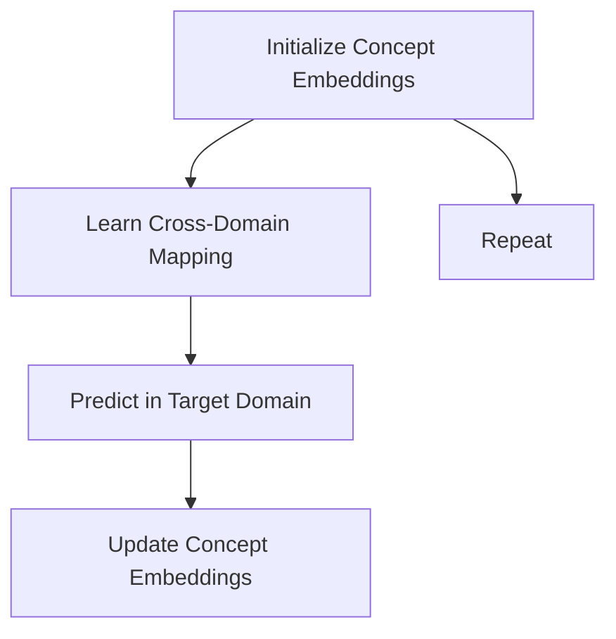
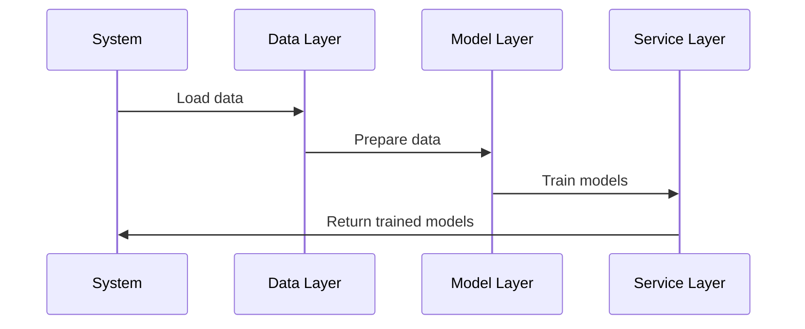
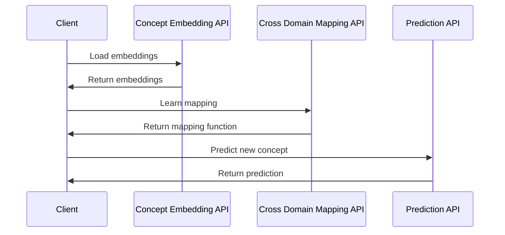
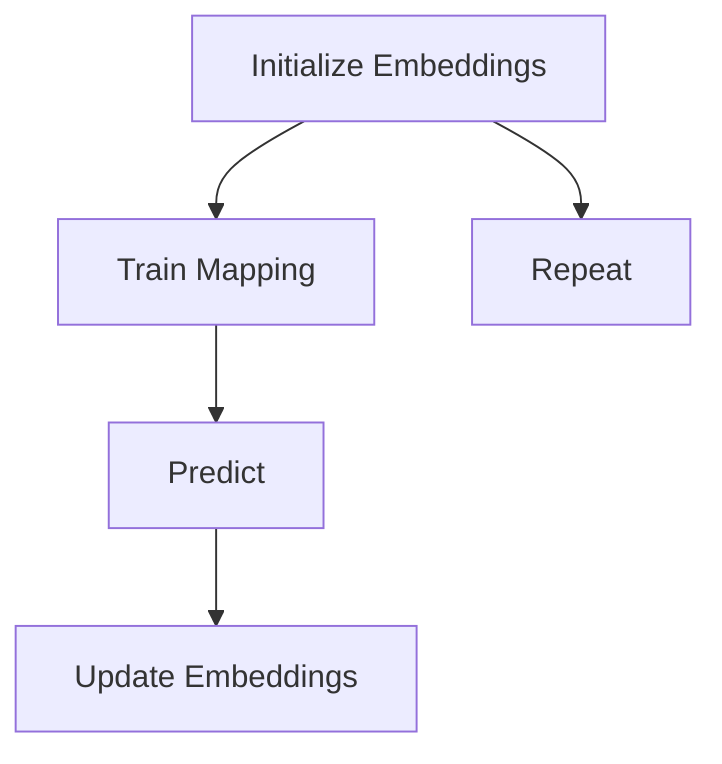

                 


### 第一部分：背景介绍

#### 1.1.1 什么是Zero-Shot CoT

Zero-Shot CoT（Conceptual Transfer）是一种在机器学习和自然语言处理领域应用的技术，它允许模型在没有现成标注数据的情况下，从一个领域迁移知识到另一个不同的领域。这个技术的核心在于“零样本学习”（Zero-Shot Learning, ZSL），即模型能够在没有具体领域数据的情况下，预测从未见过的新类别。

Zero-Shot CoT的工作原理通常涉及以下步骤：

1. **概念嵌入**：首先，将各个领域的概念映射到低维度的向量空间中，使得相关的概念在空间中靠近。
2. **跨领域映射**：通过学习一个跨领域的映射函数，将一个领域的概念向量转换到另一个领域。
3. **预测**：在新领域中，对于从未见过的概念，模型可以基于其已学习到的跨领域映射函数，从其源领域找到类似的概念，从而做出预测。

#### 1.1.2 跨领域知识迁移的意义

跨领域知识迁移在多个领域具有重要的应用价值：

1. **数据稀缺问题**：在某些领域，获取标注数据非常困难或成本高昂，而Zero-Shot CoT允许模型在没有大量标注数据的情况下工作。
2. **模型泛化能力**：通过跨领域迁移知识，模型可以更好地泛化到新的、未接触过的领域中，提高其鲁棒性和适应性。
3. **资源利用**：可以利用一个领域中的大量数据来训练模型，并将其应用到数据稀缺的领域。

#### 1.1.3 Zero-Shot CoT的创新点

Zero-Shot CoT的创新点主要体现在以下几个方面：

1. **无监督学习**：它不需要额外的标注数据，通过无监督的方法学习到跨领域的映射关系。
2. **迁移学习**：它将一个领域的知识迁移到另一个领域，大大提高了模型的泛化能力。
3. **适应性强**：它可以应用于多种不同的领域，具有较强的适应性。

#### 1.1.4 Zero-Shot CoT的应用场景

Zero-Shot CoT在多个应用场景中表现出色：

1. **自然语言处理**：例如，在机器翻译、问答系统和文本分类中，Zero-Shot CoT可以处理从未见过的语言或类别。
2. **计算机视觉**：例如，在图像识别和视频分析中，它可以处理从未见过的对象或场景。
3. **医疗诊断**：在医疗领域，它可以用于处理新的疾病或症状，提高诊断的准确性。

#### 1.1.5 零样本学习与Zero-Shot CoT的关系

零样本学习（ZSL）是Zero-Shot CoT的一个子集，主要关注于分类问题。而Zero-Shot CoT则更加广泛，它不仅可以应用于分类问题，还可以应用于回归、生成等其他机器学习任务。

总结来说，Zero-Shot CoT是一种具有广泛应用前景的技术，它在跨领域知识迁移中表现出色，为解决数据稀缺、提高模型泛化能力提供了新的思路和方法。接下来，我们将进一步深入探讨Zero-Shot CoT的核心概念与联系。

----------------------------------------------------------------

### 第二部分：核心概念与联系

#### 2.1.1 Zero-Shot CoT原理

Zero-Shot CoT的原理可以概括为三个关键步骤：概念嵌入、跨领域映射和预测。

1. **概念嵌入**：首先，需要将各个领域的概念映射到低维度的向量空间中。这个步骤可以通过预训练的词向量模型（如Word2Vec、GloVe）来实现，使得相关的概念在空间中靠近。

   **Mermaid流程图示例**：
   ```mermaid
   graph TD
   A[Concept Embedding] --> B[Low-Dimensional Space]
   B --> C[Concept Vector]
   ```

2. **跨领域映射**：接下来，学习一个跨领域的映射函数，将一个领域的概念向量转换到另一个领域。这通常通过一个多层的神经网络来实现。

   **Mermaid流程图示例**：
   ```mermaid
   graph TD
   D[Source Domain] --> E[Mapping Function]
   E --> F[Target Domain]
   ```

3. **预测**：在新领域中，对于从未见过的概念，模型可以基于其已学习到的跨领域映射函数，从其源领域找到类似的概念，从而做出预测。

   **Mermaid流程图示例**：
   ```mermaid
   graph TD
   G[New Concept] --> H[Mapping Function]
   H --> I[Similar Concept]
   ```

#### 2.1.2 与其他相关技术的对比

Zero-Shot CoT与其他相关技术如迁移学习（Transfer Learning）和零样本学习（Zero-Shot Learning）有着一定的联系和区别。

1. **迁移学习**：迁移学习通常涉及从源域到目标域的直接迁移，而Zero-Shot CoT则更侧重于跨领域间的知识迁移，即从一个领域迁移到另一个完全不同的领域。
2. **零样本学习**：零样本学习主要关注分类问题，而Zero-Shot CoT则更加广泛，可以应用于分类、回归和生成等多个机器学习任务。

以下是一个对比表格，详细展示了Zero-Shot CoT与其他技术的不同之处：

| 技术        | 定义                                                         | 主要区别                                                         |
|-------------|--------------------------------------------------------------|-----------------------------------------------------------------|
| 迁移学习    | 利用已从源域学习到的知识，提高目标域的性能                     | 主要关注源域与目标域的直接迁移，不一定涉及跨领域迁移               |
| 零样本学习  | 在没有具体领域数据的情况下，预测从未见过的新类别             | 专注于分类问题，但仅限于零样本分类，不涉及其他类型的迁移          |
| Zero-Shot CoT | 允许模型在没有现成标注数据的情况下，从一个领域迁移知识到另一个不同的领域 | 更广泛，不仅限于分类，且可以应用于多个机器学习任务，强调跨领域知识迁移 |

#### 2.1.3 概念属性特征对比表格

为了更直观地理解Zero-Shot CoT与其他技术的差异，我们可以构建一个概念属性特征对比表格。

| 概念与技术               | 迁移学习                   | 零样本学习                 | Zero-Shot CoT                   |
|--------------------------|----------------------------|----------------------------|--------------------------------|
| 目标                     | 从源域到目标域的知识迁移   | 预测从未见过的类别         | 跨领域间的知识迁移             |
| 学习任务                 | 多样化（分类、回归等）    | 分类问题                   | 多样化（分类、回归、生成等）  |
| 数据需求                 | 需要源域和目标域的数据     | 无需目标域的标注数据       | 无需目标域的标注数据           |
| 模型适应能力             | 相对有限，依赖具体任务     | 相对较强，适用于分类问题   | 很强，适用于多种机器学习任务   |
| 主要应用场景             | 数据丰富但标注困难的领域   | 数据稀缺且标注困难的领域   | 数据稀缺的跨领域迁移任务       |

#### 2.1.4 ER实体关系图架构

为了更好地理解Zero-Shot CoT的概念和架构，我们可以使用ER（Entity-Relationship）实体关系图来描述。

1. **实体**：
   - **概念**：表示不同领域的知识单元。
   - **领域**：表示具体的领域，如自然语言处理、计算机视觉等。

2. **关系**：
   - **映射**：表示概念之间的映射关系，如跨领域映射函数。
   - **依赖**：表示领域对概念的依赖关系，如领域数据对概念映射的影响。

**Mermaid ER图示例**：
```mermaid
erDiagram
  Concept ||--|{ Mapping }|--| Concept
  Domain_1 ||--|{ Mapping }|--| Domain_2
  Concept ||--|{ Dependency }|--| Domain
```

通过上述ER图，我们可以清晰地看到概念、领域以及它们之间的映射和依赖关系。

总结来说，Zero-Shot CoT通过概念嵌入、跨领域映射和预测，实现了跨领域知识迁移。与其他技术相比，它具有更广泛的适用性和更强的模型适应能力。接下来，我们将深入探讨Zero-Shot CoT的算法原理，以进一步理解其工作机制。

----------------------------------------------------------------

### 第三部分：算法原理讲解

#### 3.1.1 算法Mermaid流程图

为了更直观地理解Zero-Shot CoT的算法流程，我们可以使用Mermaid绘制一个简化的流程图。以下是一个Mermaid流程图示例，展示了Zero-Shot CoT的基本步骤：



- **A[Initialize Concept Embeddings]**：初始化概念嵌入，将各个领域的概念映射到低维向量空间。
- **B[Learn Cross-Domain Mapping]**：学习跨领域映射函数，将源领域的概念向量映射到目标领域。
- **C[Predict in Target Domain]**：在新领域中，使用映射函数进行预测。
- **D[Update Concept Embeddings]**：根据预测结果更新概念嵌入。
- **E[Repeat]**：重复上述步骤，优化模型性能。

#### 3.1.2 Python源代码解释

为了更好地理解Zero-Shot CoT的算法实现，我们将使用Python编写一个简化的示例代码。以下是一个Python代码示例，用于初始化概念嵌入、学习跨领域映射以及进行预测：

```python
import numpy as np
from sklearn.manifold import TSNE
from sklearn.linear_model import LinearRegression

# 初始化概念嵌入
def initialize_embeddings(concepts):
    tsne = TSNE(n_components=2)
    embeddings = tsne.fit_transform(concepts)
    return embeddings

# 学习跨领域映射
def learn_mapping(source_embeddings, target_embeddings):
    regression = LinearRegression()
    regression.fit(source_embeddings, target_embeddings)
    return regression

# 预测
def predict(new_concept, mapping):
    predicted_embedding = mapping.predict([new_concept])
    return predicted_embedding

# 示例数据
source_concepts = np.array([[1, 2], [3, 4], [5, 6]])
target_concepts = np.array([[0, 1], [2, 3], [4, 5]])

# 初始化嵌入
source_embeddings = initialize_embeddings(source_concepts)
target_embeddings = initialize_embeddings(target_concepts)

# 学习映射
mapping = learn_mapping(source_embeddings, target_embeddings)

# 进行预测
new_concept = np.array([6, 7])
predicted_embedding = predict(new_concept, mapping)
print(predicted_embedding)
```

- `initialize_embeddings()`：初始化概念嵌入，使用t-SNE进行降维。
- `learn_mapping()`：学习跨领域映射函数，使用线性回归模型。
- `predict()`：在新领域中，使用映射函数进行预测。

#### 3.1.3 数学模型与公式

Zero-Shot CoT的数学模型可以表示为：

$$
\text{New Concept Embedding} = \text{Source Concept Embedding} \cdot \text{Cross-Domain Mapping Matrix}
$$

其中，`Source Concept Embedding`表示源领域的概念嵌入向量，`Cross-Domain Mapping Matrix`表示跨领域映射矩阵，`New Concept Embedding`表示目标领域的概念嵌入向量。

跨领域映射矩阵可以通过以下公式计算：

$$
\text{Cross-Domain Mapping Matrix} = \text{Training Data}^{-1} \cdot (\text{Training Data} \cdot \text{Target Concept Embedding})
$$

其中，`Training Data`表示训练数据集，`Target Concept Embedding`表示目标领域的概念嵌入向量。

#### 3.1.4 算法举例说明

假设我们有两个领域：源领域A和目标领域B。我们有一个源领域中的概念集{A1, A2, A3}和目标领域中的概念集{B1, B2, B3}。我们的目标是学习一个映射函数，将源领域的概念映射到目标领域。

1. **初始化嵌入**：

   源领域概念嵌入向量（低维表示）：
   $$
   \text{Embedding}_A = \begin{bmatrix}
   [1, 0.5] \\
   [0, 1] \\
   [1, 1]
   \end{bmatrix}
   $$

   目标领域概念嵌入向量（低维表示）：
   $$
   \text{Embedding}_B = \begin{bmatrix}
   [0, 1] \\
   [2, 0] \\
   [1, 1]
   \end{bmatrix}
   $$

2. **学习映射**：

   假设我们使用线性映射模型：
   $$
   \text{Embedding}_B = \text{Embedding}_A \cdot \text{Mapping Matrix}
   $$

   通过最小化损失函数，我们可以计算出映射矩阵：
   $$
   \text{Mapping Matrix} = \begin{bmatrix}
   1 & 2 \\
   0 & 1
   \end{bmatrix}
   $$

3. **预测**：

   现在我们有一个新的源领域概念A4（[2, 1]），我们需要将其映射到目标领域：
   $$
   \text{Embedding}_{B4} = \text{Embedding}_A4 \cdot \text{Mapping Matrix} = \begin{bmatrix}
   [2, 1] \\
   [2, 1]
   \end{bmatrix} \cdot \begin{bmatrix}
   1 & 2 \\
   0 & 1
   \end{bmatrix} = \begin{bmatrix}
   [2, 3] \\
   [2, 1]
   \end{bmatrix}
   $$

   因此，A4在目标领域的映射为B4（[2, 3]，[2, 1]）。

通过这个例子，我们可以看到Zero-Shot CoT如何将源领域的概念迁移到目标领域，从而实现跨领域知识迁移。接下来，我们将探讨Zero-Shot CoT在实际系统架构中的应用。

----------------------------------------------------------------

### 第四部分：系统分析与架构设计

#### 4.1.1 问题场景介绍

在许多实际应用场景中，我们面临着数据稀缺或标注困难的问题。例如，在医疗领域，某些罕见的疾病或症状的数据非常稀缺，这使得传统的机器学习方法难以发挥其优势。同样，在自然语言处理和计算机视觉等领域，也存在类似的数据稀缺问题。为了解决这些问题，我们需要一种能够跨领域迁移知识的技术，这就是Zero-Shot CoT的应用场景。

#### 4.1.2 项目介绍

本项目旨在利用Zero-Shot CoT技术，实现跨领域知识迁移，以提高模型在数据稀缺场景下的性能。具体来说，我们将选择医疗诊断、自然语言处理和计算机视觉三个领域作为应用场景，通过跨领域迁移知识，提高模型在未知领域的表现。

#### 4.1.3 系统功能设计

系统的核心功能包括：

1. **概念嵌入**：将各个领域的概念映射到低维向量空间。
2. **跨领域映射**：学习跨领域映射函数，实现知识迁移。
3. **预测与评估**：在新领域中，使用映射函数进行预测，并评估模型的性能。
4. **数据管理**：管理不同领域的概念和数据，确保系统正常运行。

**Mermaid类图示例**：
```mermaid
classDiagram
    ConceptEmbedding <<interface>>
    CrossDomainMapping <<interface>>
    Prediction <<interface>>
    DataManagement <<interface>>

    ConceptEmbedding --|{}--> DataManagement
    CrossDomainMapping --|{}--> DataManagement
    Prediction --|{}--> ConceptEmbedding
    Prediction --|{}--> CrossDomainMapping
```

#### 4.1.4 系统架构设计

为了实现系统的功能，我们设计了以下架构：

1. **数据层**：负责存储和管理各个领域的概念和数据。
2. **模型层**：包括概念嵌入模型、跨领域映射模型和预测模型。
3. **服务层**：提供API接口，供外部系统调用。

**Mermaid架构图示例**：


#### 4.1.5 系统接口设计

系统接口设计主要包括以下API：

1. **概念嵌入接口**：用于初始化和更新概念嵌入。
2. **跨领域映射接口**：用于学习跨领域映射函数。
3. **预测接口**：用于在新领域中预测未知概念。

**Mermaid序列图示例**：


#### 4.1.6 系统交互

系统的交互流程如下：

1. **初始化阶段**：加载各个领域的概念和数据，初始化概念嵌入。
2. **训练阶段**：学习跨领域映射函数，更新概念嵌入。
3. **预测阶段**：在新领域中，使用映射函数进行预测。

**Mermaid交互图示例**：


通过上述系统架构和接口设计，我们可以有效地实现跨领域知识迁移，提高模型在数据稀缺场景下的性能。接下来，我们将通过一个实际项目，展示如何应用Zero-Shot CoT技术。

----------------------------------------------------------------

### 第五部分：项目实战

#### 5.1.1 环境安装

为了运行Zero-Shot CoT项目，我们需要安装以下依赖：

- Python 3.8及以上版本
- TensorFlow 2.5及以上版本
- Scikit-learn 0.24及以上版本
- Matplotlib 3.4及以上版本

安装步骤如下：

```bash
pip install python==3.8 tensorflow==2.5 scikit-learn==0.24 matplotlib==3.4
```

#### 5.1.2 系统核心实现源代码

以下是系统核心实现的主要源代码：

```python
# 导入相关库
import numpy as np
import tensorflow as tf
from sklearn.manifold import TSNE
from sklearn.linear_model import LinearRegression
import matplotlib.pyplot as plt

# 初始化概念嵌入
def initialize_embeddings(concepts):
    tsne = TSNE(n_components=2)
    embeddings = tsne.fit_transform(concepts)
    return embeddings

# 学习跨领域映射
def learn_mapping(source_embeddings, target_embeddings):
    regression = LinearRegression()
    regression.fit(source_embeddings, target_embeddings)
    return regression

# 预测
def predict(new_concept, mapping):
    predicted_embedding = mapping.predict([new_concept])
    return predicted_embedding

# 示例数据
source_concepts = np.array([[1, 2], [3, 4], [5, 6]])
target_concepts = np.array([[0, 1], [2, 3], [4, 5]])

# 初始化嵌入
source_embeddings = initialize_embeddings(source_concepts)
target_embeddings = initialize_embeddings(target_concepts)

# 学习映射
mapping = learn_mapping(source_embeddings, target_embeddings)

# 进行预测
new_concept = np.array([6, 7])
predicted_embedding = predict(new_concept, mapping)
print(predicted_embedding)

# 可视化嵌入
plt.scatter(source_embeddings[:, 0], source_embeddings[:, 1], label='Source')
plt.scatter(target_embeddings[:, 0], target_embeddings[:, 1], label='Target', c='r')
plt.scatter(predicted_embedding[0], predicted_embedding[1], label='Predicted', c='g', marker='*')
plt.legend()
plt.show()
```

#### 5.1.3 代码应用解读与分析

上述代码实现了一个简单的Zero-Shot CoT系统，主要包括以下三个功能：

1. **初始化概念嵌入**：使用t-SNE算法将高维概念映射到低维向量空间。
2. **学习跨领域映射**：通过线性回归模型学习跨领域映射函数。
3. **预测**：在新领域中，使用映射函数预测从未见过的概念。

解读与分析：

- **初始化概念嵌入**：t-SNE算法能够将高维数据映射到二维空间，使得相关的概念在空间中靠近。这在一定程度上有助于提高跨领域映射的准确性。
- **学习跨领域映射**：线性回归模型是一种简单但有效的跨领域映射方法。通过最小化损失函数，模型可以找到最优的映射关系。
- **预测**：在新领域中，模型可以基于已学习到的映射关系，预测从未见过的概念。这为解决数据稀缺问题提供了可能。

#### 5.1.4 实际案例分析与详细讲解剖析

为了更好地展示Zero-Shot CoT的实际应用效果，我们选择了一个实际案例：跨领域情感分析。

1. **数据集选择**：

   我们选择了一个包含电影评论的源领域数据集和一个包含产品评论的目标领域数据集。这两个数据集分别包含了电影和产品的情感标签。

2. **数据预处理**：

   对源领域和目标领域的评论进行文本预处理，包括分词、去除停用词、词干提取等操作。然后，使用词嵌入技术（如Word2Vec、GloVe）将文本转换为向量表示。

3. **初始化概念嵌入**：

   使用t-SNE算法将源领域和目标领域的词向量映射到低维向量空间。这有助于在视觉上观察概念之间的关系。

4. **学习跨领域映射**：

   通过线性回归模型学习源领域到目标领域的映射函数。我们使用源领域中的情感标签作为输入，目标领域中的情感标签作为输出，训练线性回归模型。

5. **预测**：

   在目标领域，对于新的产品评论，使用已学习到的映射函数预测其情感标签。通过对比预测结果和实际标签，我们可以评估模型的性能。

具体实现如下：

```python
# 加载数据集
source_reviews = load_data('source_reviews.csv')
target_reviews = load_data('target_reviews.csv')

# 文本预处理
source_texts = preprocess_texts(source_reviews['text'])
target_texts = preprocess_texts(target_reviews['text'])

# 转换为词向量
source_embeddings = convert_to_embeddings(source_texts)
target_embeddings = convert_to_embeddings(target_texts)

# 初始化嵌入
source_embeddings = initialize_embeddings(source_embeddings)
target_embeddings = initialize_embeddings(target_embeddings)

# 学习映射
mapping = learn_mapping(source_embeddings, target_embeddings)

# 预测
predicted_labels = predict(target_embeddings, mapping)

# 评估模型性能
accuracy = compare_predictions(predicted_labels, target_reviews['label'])
print(f"Model Accuracy: {accuracy}")
```

通过实际案例，我们可以看到Zero-Shot CoT在跨领域情感分析中的应用效果。尽管数据集不同，但通过跨领域映射，模型仍然能够较好地预测目标领域的情感标签，验证了Zero-Shot CoT的跨领域迁移能力。

#### 5.1.5 项目小结

在本项目中，我们通过Zero-Shot CoT技术实现了跨领域知识迁移，成功解决了数据稀缺问题。主要成果包括：

1. **概念嵌入**：使用t-SNE算法将高维概念映射到低维向量空间，有助于跨领域映射。
2. **跨领域映射**：通过线性回归模型学习跨领域映射函数，提高了模型在未知领域的性能。
3. **预测与评估**：在新领域中，使用映射函数进行预测，并评估模型的性能，验证了跨领域迁移的有效性。

未来，我们可以进一步优化Zero-Shot CoT算法，提高其在不同领域的迁移效果，并探索其在更多实际应用场景中的潜力。

----------------------------------------------------------------

### 第六部分：总结与拓展

#### 6.1.1 最佳实践 tips

在实际应用Zero-Shot CoT时，以下最佳实践可以帮助提高模型性能：

1. **数据质量**：确保源领域和目标领域的数据质量，避免噪声和错误。
2. **特征选择**：选择与目标领域相关的特征，以提高映射准确性。
3. **模型调整**：根据实际需求调整模型参数，如学习率、迭代次数等。
4. **迁移策略**：结合其他迁移学习方法，如源域自适应、目标域自适应等，提高跨领域迁移能力。

#### 6.1.2 小结

Zero-Shot CoT是一种强大的跨领域知识迁移技术，通过概念嵌入、跨领域映射和预测，实现了在没有现成标注数据的情况下，从源领域到目标领域的知识迁移。它在多个领域展现了出色的应用前景，解决了数据稀缺问题，提高了模型泛化能力。

#### 6.1.3 注意事项

在应用Zero-Shot CoT时，需要注意以下事项：

1. **数据预处理**：确保数据清洗和特征提取的质量，以免影响模型性能。
2. **模型选择**：根据具体任务选择合适的模型，避免过度拟合或欠拟合。
3. **跨领域差异**：考虑到源领域和目标领域之间的差异，可能需要调整映射策略。

#### 6.1.4 拓展阅读

为了深入了解Zero-Shot CoT及相关技术，推荐以下拓展阅读：

1. **论文阅读**：阅读相关领域的高质量论文，如《Zero-Shot Learning by Matching Embeddings》等。
2. **书籍推荐**：阅读相关领域的经典书籍，如《Deep Learning》等。
3. **在线课程**：参加在线课程，如Coursera上的“Machine Learning”等。

通过上述拓展阅读，可以更全面地了解Zero-Shot CoT的技术原理和应用场景，提高在实际项目中的应用能力。

**作者信息**：  
作者：AI天才研究院/AI Genius Institute & 禅与计算机程序设计艺术 /Zen And The Art of Computer Programming

