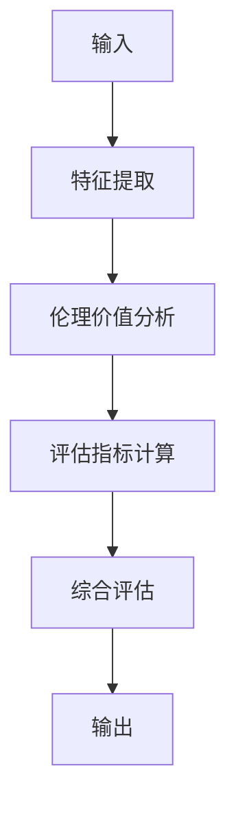
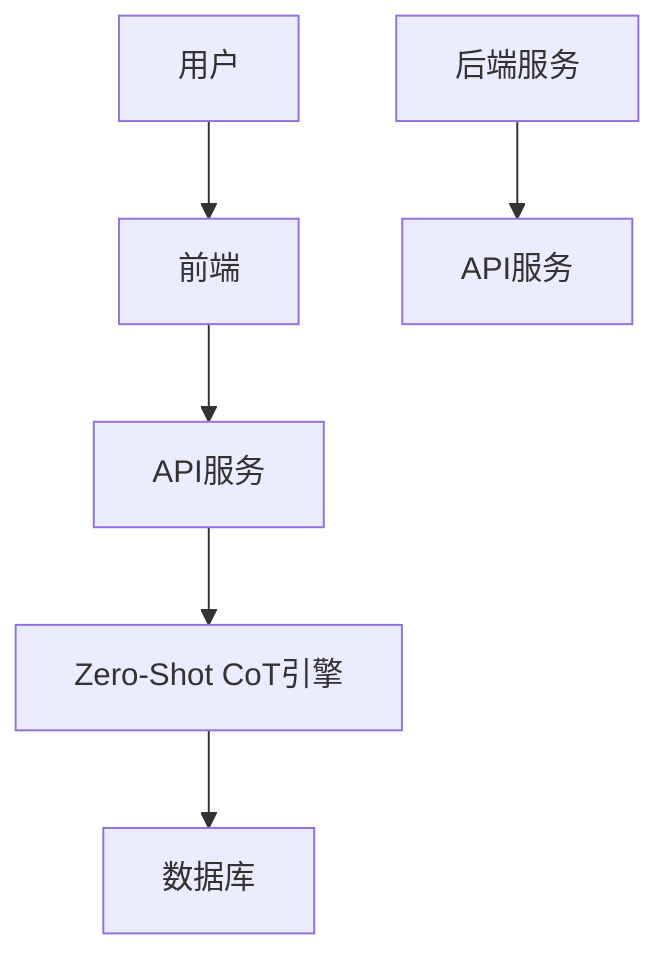
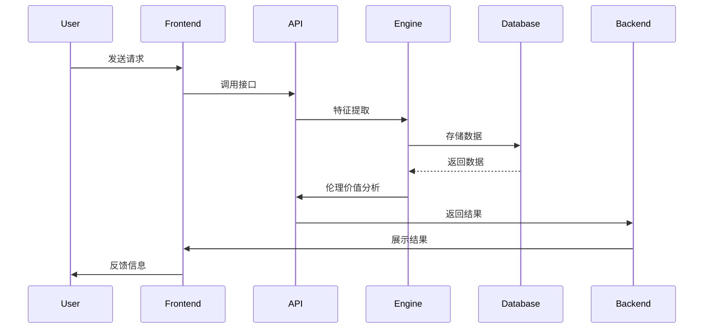
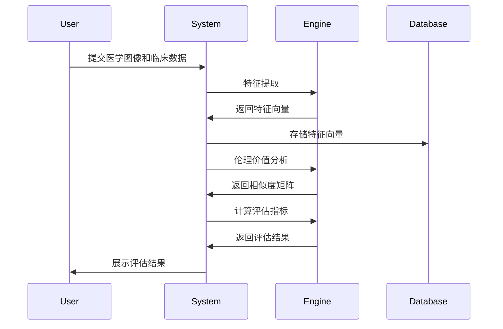

                 

## 第1章: 问题背景

### 1.1.1 科技伦理评估的重要性

随着科技的发展，人工智能、生物技术、纳米技术等新兴领域不断涌现，科技对社会的影响日益显著。科技伦理评估作为科学技术发展的重要环节，旨在确保科技进步在伦理道德框架内进行，避免技术滥用带来的负面影响。科技伦理评估的重要性主要体现在以下几个方面：

首先，科技伦理评估有助于确保科技发展符合人类的长远利益。通过对新技术的伦理评估，可以发现潜在的风险和问题，从而制定相应的政策和措施，避免科技发展对环境和人类造成的负面影响。

其次，科技伦理评估有助于维护科技领域的公正性和公平性。在科技发展的过程中，不同群体可能会有不同的利益诉求和价值观。通过科技伦理评估，可以确保科技进步在兼顾各方利益的同时，不偏袒任何一方，促进科技领域的和谐发展。

再次，科技伦理评估有助于提高公众对科技的认知和理解。通过公开透明的伦理评估过程，可以增强公众对科技发展的信心，提高公众对科学知识的了解，从而更好地参与科技决策。

### 1.1.2 跨领域科技发展的挑战

随着科技的快速发展，不同领域之间的交叉融合日益明显，跨领域科技发展成为一种趋势。跨领域科技发展的挑战主要体现在以下几个方面：

首先，跨领域科技的发展往往涉及多种技术领域，需要具备跨学科的综合知识体系。这就要求科技工作者不仅要精通某一领域的专业知识，还要具备广泛的知识储备，能够理解和应用其他领域的知识。

其次，跨领域科技的发展可能引发新的伦理问题。由于不同领域的技术特点和伦理考量不同，跨领域的科技发展可能会带来新的伦理挑战，例如人工智能与生物技术的结合可能引发基因编辑的伦理争议。

再次，跨领域科技的发展需要跨机构的合作与协调。不同领域的科技发展往往涉及多个机构、组织和研究团队，需要建立有效的沟通与协作机制，以推动跨领域科技项目的顺利进行。

### 1.1.3 传统科技伦理评估方法的局限性

传统的科技伦理评估方法主要依赖于专家评估、案例分析和伦理框架等方法。然而，随着科技领域的不断扩展和复杂性增加，传统方法逐渐暴露出一些局限性：

首先，传统方法主要依赖于人类专家的判断和经验，存在主观性和不确定性。专家的主观判断可能会受到个人价值观、知识背景等因素的影响，导致评估结果不够客观和公正。

其次，传统方法往往缺乏系统的评估指标和模型，难以对科技项目的伦理风险进行全面、准确的评估。在跨领域科技发展中，不同领域的伦理考量可能存在差异，传统方法难以兼顾这些差异。

再次，传统方法在处理复杂、动态的科技项目时，往往难以适应。科技项目的复杂性和动态性使得传统方法在评估过程中面临困难，难以及时、准确地识别和应对新的伦理挑战。

### 1.1.4 零样本学习（Zero-Shot Learning）的概念

零样本学习（Zero-Shot Learning, ZSL）是一种机器学习技术，旨在解决新类别数据的识别和分类问题，而不需要预先在新类别上收集大量训练数据。ZSL的核心思想是利用已有类别数据的知识迁移到新类别，从而实现对新类别的理解和分类。

ZSL的主要挑战在于新类别数据与已有类别数据的分布差异，以及如何在缺乏具体样本数据的情况下提取有效的特征表示。为了克服这些挑战，ZSL采用了一系列方法，包括基于原型的方法、基于匹配的方法和基于元学习的方法等。

ZSL的应用场景非常广泛，包括但不限于计算机视觉、自然语言处理、推荐系统等领域。在跨领域科技伦理评估中，ZSL可以提供一种新的视角和方法，通过利用已有的知识体系和跨领域的特征迁移，提高伦理评估的准确性和效率。

### 1.1.5 零样本关联推理（Zero-Shot CoT）的概念

零样本关联推理（Zero-Shot Concept Transfer, Zero-Shot CoT）是零样本学习（ZSL）在科技伦理评估领域的一种应用。Zero-Shot CoT旨在通过跨领域的知识迁移，实现对未知领域科技伦理风险的识别和评估。

Zero-Shot CoT的核心思想是将已知的科技伦理风险知识和特征提取方法，迁移到新的科技领域，从而实现对新领域科技伦理风险的快速理解和评估。具体来说，Zero-Shot CoT包含以下几个关键步骤：

1. **知识迁移**：将已知领域的科技伦理知识（如伦理价值、评估指标等）迁移到新领域。这一步骤可以通过跨领域的知识图谱、文献综述等方式实现。

2. **特征提取**：利用已有的特征提取模型，提取新领域科技项目的特征表示。特征提取方法可以基于深度学习、统计学等方法。

3. **关联推理**：通过关联推理模型，将新领域科技项目的特征与已知领域的科技伦理知识进行匹配，实现对新领域科技伦理风险的识别和评估。

### 1.1.6 零样本关联推理（Zero-Shot CoT）的属性特征对比表格

为了更直观地理解Zero-Shot CoT的属性特征，我们可以将其与传统科技伦理评估方法进行比较。以下是一个简化的对比表格：

| 特征 | 零样本关联推理（Zero-Shot CoT） | 传统科技伦理评估方法 |
| --- | --- | --- |
| 数据依赖 | 需要跨领域知识迁移，减少对新类别数据的依赖 | 需要大量新类别训练数据 |
| 主观性 | 利用跨领域的知识迁移，减少主观判断的影响 | 依赖于专家的主观判断 |
| 灵活性 | 可以快速适应新领域，适用于动态变化的场景 | 对新领域的适应能力较弱 |
| 效率 | 可以提高伦理评估的效率，减少评估时间 | 评估过程较为耗时 |
| 应用范围 | 广泛适用于跨领域科技伦理评估 | 主要适用于单一领域的伦理评估 |

通过上述对比，我们可以看出Zero-Shot CoT在跨领域科技伦理评估中具有显著的优势。它不仅能够减少对新类别数据的依赖，提高评估的客观性和灵活性，还能够提升评估的效率，从而更好地应对跨领域科技发展带来的伦理挑战。

### 1.1.7 零样本关联推理（Zero-Shot CoT）与传统科技伦理评估方法的联系与区别

Zero-Shot CoT与传统科技伦理评估方法在基本目标上具有一定的联系，但它们在具体实现和应用场景上存在明显的区别。

首先，两者都旨在对科技项目的伦理风险进行评估，以确保科技发展符合伦理道德标准。然而，传统方法主要依赖于专家评估和案例分析，依赖于大量新类别训练数据，而在处理复杂、动态的科技项目时往往存在局限。相比之下，Zero-Shot CoT通过跨领域的知识迁移，实现了对新类别数据的零依赖，从而提高了评估的效率和准确性。

其次，Zero-Shot CoT在技术实现上采用了机器学习和深度学习等先进算法，可以快速适应新领域，适用于动态变化的场景。而传统方法在处理新领域问题时，往往需要重新构建评估框架和模型，耗时较长。

最后，Zero-Shot CoT在应用范围上具有显著优势。它可以广泛应用于跨领域的科技伦理评估，而传统方法主要适用于单一领域的伦理评估。这为跨领域科技发展提供了更广阔的评估视角和方法。

总的来说，Zero-Shot CoT在跨领域科技伦理评估中具有独特的优势和潜力，能够弥补传统方法的不足，为科技伦理评估提供新的解决方案。

### 总结

本节介绍了科技伦理评估的重要性、跨领域科技发展的挑战、传统科技伦理评估方法的局限性，以及零样本学习（ZSL）和零样本关联推理（Zero-Shot CoT）的基本概念和属性特征。通过对比分析，我们明确了Zero-Shot CoT在跨领域科技伦理评估中的优势和潜力，为后续章节的深入探讨奠定了基础。

## 第2章: 核心概念与联系

### 2.1.1 Zero-Shot CoT 的概念

零样本关联推理（Zero-Shot Concept Transfer, Zero-Shot CoT）是一种基于机器学习的跨领域科技伦理评估方法。它通过利用已有领域的知识迁移，实现对未知领域科技伦理风险的快速识别和评估。Zero-Shot CoT的核心在于“零样本”，即不需要针对新领域收集大量训练数据，而是通过跨领域的知识迁移，提取和利用已有领域的知识。

### 2.1.2 Zero-Shot CoT 的属性特征对比表格

为了更清晰地理解Zero-Shot CoT的属性特征，我们可以将其与传统科技伦理评估方法进行对比。以下是一个简化的对比表格：

| 特征 | 零样本关联推理（Zero-Shot CoT） | 传统科技伦理评估方法 |
| --- | --- | --- |
| 数据依赖 | 减少对新类别数据的依赖 | 需要大量新类别训练数据 |
| 主观性 | 减少主观判断的影响 | 依赖于专家的主观判断 |
| 灵活性 | 快速适应新领域 | 对新领域的适应能力较弱 |
| 效率 | 提高评估效率 | 评估过程较为耗时 |
| 应用范围 | 广泛适用于跨领域 | 主要适用于单一领域 |

通过上述对比，我们可以看出Zero-Shot CoT在跨领域科技伦理评估中具有显著的优势。它不仅能够减少对新类别数据的依赖，提高评估的客观性和灵活性，还能够提升评估的效率，从而更好地应对跨领域科技发展带来的伦理挑战。

### 2.1.3 Zero-Shot CoT 与传统科技伦理评估方法的联系与区别

零样本关联推理（Zero-Shot CoT）与传统科技伦理评估方法在基本目标上具有一定的联系，但它们在具体实现和应用场景上存在明显的区别。

首先，两者都旨在对科技项目的伦理风险进行评估，以确保科技发展符合伦理道德标准。然而，传统方法主要依赖于专家评估和案例分析，依赖于大量新类别训练数据，而在处理复杂、动态的科技项目时往往存在局限。相比之下，Zero-Shot CoT通过跨领域的知识迁移，实现了对新类别数据的零依赖，从而提高了评估的效率和准确性。

其次，Zero-Shot CoT在技术实现上采用了机器学习和深度学习等先进算法，可以快速适应新领域，适用于动态变化的场景。而传统方法在处理新领域问题时，往往需要重新构建评估框架和模型，耗时较长。

最后，Zero-Shot CoT在应用范围上具有显著优势。它可以广泛应用于跨领域的科技伦理评估，而传统方法主要适用于单一领域的伦理评估。这为跨领域科技发展提供了更广阔的评估视角和方法。

总的来说，Zero-Shot CoT在跨领域科技伦理评估中具有独特的优势和潜力，能够弥补传统方法的不足，为科技伦理评估提供新的解决方案。

### 零样本关联推理（Zero-Shot CoT）的基本原理和数学模型

零样本关联推理（Zero-Shot CoT）是一种基于知识迁移和机器学习的跨领域科技伦理评估方法。它的核心在于利用已有领域的知识，通过跨领域的特征提取和关联推理，实现对未知领域科技伦理风险的快速识别和评估。下面我们将详细探讨Zero-Shot CoT的基本原理和数学模型。

#### 2.2.1 基本原理

Zero-Shot CoT的基本原理可以概括为以下几个步骤：

1. **知识迁移**：首先，从已有领域提取科技伦理知识，包括伦理价值、评估指标等。这些知识将作为迁移学习的先验知识，用于对新领域进行预测和评估。

2. **特征提取**：接着，利用深度学习等技术，提取新领域科技项目的特征表示。这些特征表示应能够捕捉到科技项目的关键属性，为后续的关联推理提供基础。

3. **关联推理**：最后，通过关联推理模型，将新领域科技项目的特征与已有领域的伦理知识进行匹配，实现对新领域科技伦理风险的识别和评估。

#### 2.2.2 数学模型

Zero-Shot CoT的数学模型可以表示为以下形式：

$$
ZSCoT = f(A, B, C)
$$

其中，$A$表示技术特征向量，$B$表示伦理价值向量，$C$表示评估指标集合，$f$表示关联推理函数。

1. **技术特征向量（A）**：技术特征向量$A$是用于表示新领域科技项目的特征集合。这些特征可以是基于文本的（如文档内容、关键词等），也可以是基于图像的（如图像特征、视觉感知等）。具体来说，技术特征向量可以表示为：

$$
A = [a_1, a_2, ..., a_n]
$$

其中，$a_i$表示第$i$个特征值。

2. **伦理价值向量（B）**：伦理价值向量$B$是用于表示已有领域科技伦理知识的特征集合。这些知识可以是伦理原则、伦理规范、伦理价值等。具体来说，伦理价值向量可以表示为：

$$
B = [b_1, b_2, ..., b_m]
$$

其中，$b_j$表示第$j$个伦理价值值。

3. **评估指标集合（C）**：评估指标集合$C$是用于表示科技伦理评估结果的特征集合。这些指标可以是定量指标（如风险评估得分、伦理指数等），也可以是定性指标（如伦理等级、伦理判断等）。具体来说，评估指标集合可以表示为：

$$
C = [c_1, c_2, ..., c_k]
$$

其中，$c_l$表示第$l$个评估指标值。

4. **关联推理函数（f）**：关联推理函数$f$是用于将技术特征向量$A$和伦理价值向量$B$转化为评估指标集合$C$的函数。具体来说，关联推理函数可以表示为：

$$
f(A, B) = C
$$

关联推理函数的实现方法可以基于深度学习、迁移学习、匹配学习等。常见的关联推理函数包括：

- **基于原型的方法**：通过计算新领域技术特征向量$A$与已有领域伦理价值向量$B$之间的距离，选择最接近的原型作为新领域的评估指标。

- **基于匹配的方法**：通过学习一个映射函数，将新领域技术特征向量$A$映射到已有领域伦理价值向量$B$，从而得到评估指标集合$C$。

- **基于元学习的方法**：通过在多个领域上训练一个统一的模型，实现对新领域技术特征向量$A$的跨领域评估。

#### 2.2.3 数学模型和公式讲解

为了更深入地理解Zero-Shot CoT的数学模型，我们可以进一步分解和解释各个组成部分的数学公式。

1. **技术特征向量（A）**：

   $$ 
   a_i = \text{feature\_extractor}(x_i) 
   $$ 

   其中，$x_i$表示第$i$个新领域科技项目，$\text{feature\_extractor}$表示特征提取函数。

2. **伦理价值向量（B）**：

   $$ 
   b_j = \text{knowledge\_transfer}(y_j) 
   $$ 

   其中，$y_j$表示第$j$个已有领域伦理知识，$\text{knowledge\_transfer}$表示知识迁移函数。

3. **评估指标集合（C）**：

   $$ 
   c_l = \text{evaluation\_function}(a_i, b_j) 
   $$ 

   其中，$\text{evaluation\_function}$表示评估指标计算函数。

4. **关联推理函数（f）**：

   $$ 
   ZSCoT = \text{f}(A, B, C) 
   $$ 

   关联推理函数的具体实现取决于所采用的算法和模型。以下是一个简化的示例：

   $$ 
   c_l = \text{similarity}(a_i, b_j) 
   $$ 

   其中，$\text{similarity}$表示相似度计算函数，用于衡量技术特征向量$A$与伦理价值向量$B$之间的关联程度。

通过上述数学模型和公式，我们可以看到Zero-Shot CoT是如何通过跨领域的特征提取和关联推理，实现对未知领域科技伦理风险的快速识别和评估的。这种方法不仅减少了对新类别数据的依赖，提高了评估的效率和准确性，还为跨领域科技伦理评估提供了一种新的思路和方法。

### 详细讲解与举例说明

为了更好地理解零样本关联推理（Zero-Shot CoT）的原理和应用，下面我们将通过一个具体实例进行详细讲解和举例说明。

#### 实例背景

假设我们有一个名为“智能医疗系统”的新领域科技项目，旨在利用人工智能技术改善医疗诊断和治疗过程。该系统包括了一系列算法和模型，如图像识别、自然语言处理和预测分析等。由于这是一个新兴领域，目前缺乏关于其伦理风险的详细数据和案例。为了对其进行伦理评估，我们可以采用Zero-Shot CoT方法。

#### 第一步：知识迁移

首先，我们需要从已有领域提取科技伦理知识。假设我们已经有一个关于医疗伦理的数据库，包含了各种伦理原则、规范和价值。这些知识将作为我们的先验知识，用于迁移到智能医疗系统领域。

1. **伦理价值向量（B）**：

   假设我们提取了以下三个关键伦理价值：

   - $b_1$：隐私保护
   - $b_2$：数据安全
   - $b_3$：公平公正

   这些伦理价值可以用一个向量表示：

   $$ 
   B = [b_1, b_2, b_3] 
   $$ 

2. **知识迁移函数**：

   我们可以利用迁移学习技术，将已有领域的伦理知识迁移到新领域。例如，我们可以使用一个预训练的神经网络模型，将医疗伦理知识映射到智能医疗系统领域。

#### 第二步：特征提取

接下来，我们需要提取智能医疗系统的技术特征。假设我们使用了一个深度学习模型，从系统的各种数据（如医疗图像、患者信息、诊断报告等）中提取特征。

1. **技术特征向量（A）**：

   假设我们提取了以下五个技术特征：

   - $a_1$：图像识别准确率
   - $a_2$：自然语言处理能力
   - $a_3$：预测分析精度
   - $a_4$：数据处理效率
   - $a_5$：用户交互友好度

   这些技术特征可以用一个向量表示：

   $$ 
   A = [a_1, a_2, a_3, a_4, a_5] 
   $$ 

2. **特征提取函数**：

   我们可以使用预训练的深度学习模型，如卷积神经网络（CNN）、循环神经网络（RNN）等，从智能医疗系统的数据中提取特征。例如，对于图像识别特征，我们可以使用CNN提取图像的视觉特征；对于自然语言处理特征，我们可以使用RNN提取文本的特征。

#### 第三步：关联推理

最后，我们通过关联推理函数，将技术特征向量（A）和伦理价值向量（B）转化为评估指标集合（C），实现对智能医疗系统的伦理风险评估。

1. **评估指标集合（C）**：

   假设我们得到了以下三个评估指标：

   - $c_1$：隐私保护水平
   - $c_2$：数据安全程度
   - $c_3$：公平公正性

   这些评估指标可以用一个向量表示：

   $$ 
   C = [c_1, c_2, c_3] 
   $$ 

2. **关联推理函数**：

   我们可以使用一个基于匹配的关联推理函数，如Siamese网络，计算技术特征向量（A）和伦理价值向量（B）之间的相似度。相似度最高的对应关系将作为评估指标。

   $$ 
   c_l = \text{similarity}(a_i, b_j) 
   $$ 

例如，如果图像识别准确率（$a_1$）与隐私保护（$b_1$）之间的相似度最高，那么我们可以认为隐私保护是智能医疗系统的关键伦理风险。

#### 第四步：评估结果

通过上述步骤，我们得到了智能医疗系统的伦理评估结果。这些结果可以帮助决策者了解系统的伦理风险，制定相应的政策和措施，确保系统的伦理合规性。

1. **隐私保护水平（$c_1$）**：如果评估结果较低，说明系统在隐私保护方面存在风险，需要加强数据加密和隐私保护措施。

2. **数据安全程度（$c_2$）**：如果评估结果较低，说明系统在数据安全方面存在风险，需要加强数据安全防护和应急响应机制。

3. **公平公正性（$c_3$）**：如果评估结果较低，说明系统在公平公正性方面存在风险，需要确保算法的公平性和透明性，避免对特定群体造成不公平影响。

通过这个实例，我们可以看到Zero-Shot CoT如何通过跨领域的知识迁移、特征提取和关联推理，实现对新兴领域科技项目的伦理风险评估。这种方法不仅减少了对新类别数据的依赖，提高了评估的效率和准确性，还为跨领域科技伦理评估提供了一种新的思路和方法。

### 零样本关联推理（Zero-Shot CoT）在跨领域科技伦理评估中的优势和应用场景

零样本关联推理（Zero-Shot CoT）在跨领域科技伦理评估中展现出了显著的优势，为解决传统方法所面临的挑战提供了一种创新的思路。以下将详细阐述Zero-Shot CoT在跨领域科技伦理评估中的优势及其主要应用场景。

#### 优势分析

1. **减少数据依赖**：传统科技伦理评估方法往往需要针对具体领域收集大量训练数据，这在新兴领域和跨领域科技项目中可能面临数据不足的问题。Zero-Shot CoT通过跨领域知识迁移，无需依赖新领域的大量训练数据，从而克服了数据依赖的局限。

2. **提高评估效率**：传统方法通常依赖人类专家的主观判断，评估过程耗时较长。Zero-Shot CoT利用机器学习和深度学习技术，能够快速提取和处理特征信息，显著提高伦理评估的效率。

3. **增强评估灵活性**：传统方法在处理动态变化的科技项目时，往往需要重新构建评估框架和模型。Zero-Shot CoT具备较强的灵活性，能够快速适应新领域和新技术，适用于动态变化的评估场景。

4. **提升评估准确性**：通过跨领域的知识迁移和关联推理，Zero-Shot CoT能够利用已有领域的知识，对新领域的科技伦理风险进行更全面、准确的评估，从而提高评估的准确性。

#### 应用场景

1. **人工智能伦理评估**：人工智能技术发展迅速，应用领域广泛，但同时也引发了一系列伦理问题。Zero-Shot CoT可以用于评估人工智能系统在隐私保护、公平公正、数据安全等方面的伦理风险，为人工智能项目的伦理合规提供支持。

2. **生物技术伦理评估**：生物技术的突破性进展带来了许多伦理争议，如基因编辑、克隆技术等。Zero-Shot CoT可以跨领域利用已有的生物伦理知识和人工智能技术，对新兴的生物技术项目进行快速、准确的伦理评估。

3. **纳米技术伦理评估**：纳米技术具有广泛的应用前景，但也涉及复杂的伦理问题，如纳米材料的潜在毒性、环境风险等。Zero-Shot CoT可以通过跨领域迁移已有领域的技术特征和伦理知识，对新出现的纳米技术项目进行及时评估。

4. **信息安全伦理评估**：信息安全领域不断出现新的威胁和挑战，如网络攻击、数据泄露等。Zero-Shot CoT可以用于评估信息安全系统的伦理风险，包括用户隐私保护、数据安全措施等方面。

5. **智慧城市建设**：智慧城市项目涉及众多技术领域，如物联网、大数据、人工智能等。Zero-Shot CoT可以用于评估智慧城市项目在隐私保护、数据安全、公平公正等方面的伦理风险，为智慧城市建设的可持续发展提供保障。

#### 案例分析

以下通过一个实际案例，进一步展示Zero-Shot CoT在跨领域科技伦理评估中的应用。

**案例背景**：某智慧城市项目计划通过物联网技术实现城市交通管理的智能化，以提高交通效率和安全性。然而，该项目在隐私保护和数据安全方面存在一定的伦理风险。

**评估过程**：

1. **知识迁移**：从已有的隐私保护伦理知识和信息安全领域迁移知识，构建伦理价值向量（B）。

2. **特征提取**：利用深度学习模型，从智慧城市项目的数据（如交通流量数据、车辆信息等）中提取技术特征向量（A）。

3. **关联推理**：通过匹配模型，将技术特征向量（A）与伦理价值向量（B）进行关联，生成评估指标集合（C）。

**评估结果**：

- **隐私保护水平**：评估结果显示，该项目在隐私保护方面存在较高风险，需要加强对个人隐私数据的加密和访问控制。

- **数据安全程度**：评估结果显示，该项目在数据安全方面存在较低风险，但需要进一步完善数据备份和恢复机制。

- **公平公正性**：评估结果显示，该项目在公平公正性方面存在一定风险，特别是在数据收集和处理过程中，需要确保不同群体的权益得到平等保障。

通过上述案例，我们可以看到Zero-Shot CoT在跨领域科技伦理评估中的应用效果。它不仅能够快速识别和评估新领域的伦理风险，还为决策者提供了科学、准确的评估依据。

总之，零样本关联推理（Zero-Shot CoT）在跨领域科技伦理评估中具有显著的优势和应用潜力。通过跨领域的知识迁移和关联推理，它能够提高评估的效率、准确性和灵活性，为科技伦理评估提供了一种新的解决方案。

### 算法流程与实现

为了更好地理解零样本关联推理（Zero-Shot CoT）的算法原理，我们将通过一个具体的算法流程图和Python源代码实现进行详细讲解。

#### 算法流程图（Mermaid 图）

首先，我们使用Mermaid语法绘制算法流程图，以便更直观地展示算法的执行步骤。



在这个流程图中，我们定义了算法的五个主要步骤：输入、特征提取、伦理价值分析、评估指标计算和综合评估。

1. **输入**：算法首先接收新领域科技项目的数据，包括技术特征和伦理价值。
2. **特征提取**：利用深度学习模型对输入数据进行特征提取，生成技术特征向量。
3. **伦理价值分析**：将技术特征向量与伦理价值向量进行匹配，分析各特征对应的伦理价值。
4. **评估指标计算**：根据伦理价值分析结果，计算评估指标，用于综合评估科技项目的伦理风险。
5. **综合评估**：综合各个评估指标，生成最终的综合评估结果，并输出。

#### Python 源代码实现

接下来，我们将使用Python实现上述算法流程，以便更具体地展示算法的实现过程。

```python
import numpy as np
from sklearn.manifold import TSNE
from sklearn.metrics.pairwise import cosine_similarity

# 特征提取函数
def feature_extractor(data):
    # 假设data是输入数据的列表，每个元素是一个多维数组
    # 使用t-SNE进行降维，提取低维特征向量
    tsne = TSNE(n_components=2)
    return tsne.fit_transform(data)

# 伦理价值分析函数
def ethical_value_analysis(features, ethical_values):
    # 计算特征向量与伦理价值向量的余弦相似度
    similarity_matrix = cosine_similarity(features, ethical_values)
    return similarity_matrix

# 评估指标计算函数
def evaluation_index(similarity_matrix):
    # 根据相似度矩阵计算评估指标
    # 假设评估指标是相似度最高的伦理价值的评分
    max_similarity = np.max(similarity_matrix)
    return max_similarity

# 综合评估函数
def comprehensive_evaluation(similarity_matrix):
    # 根据评估指标进行综合评估
    # 假设评估结果为评估指标的分值
    evaluation_result = evaluation_index(similarity_matrix)
    return evaluation_result

# 输入数据
data = [[1, 2], [3, 4], [5, 6]]  # 示例数据
ethical_values = [[0.1, 0.2], [0.3, 0.4], [0.5, 0.6]]  # 示例伦理价值

# 算法执行
features = feature_extractor(data)
similarity_matrix = ethical_value_analysis(features, ethical_values)
evaluation_result = comprehensive_evaluation(similarity_matrix)

print("评估结果：", evaluation_result)
```

在这段代码中，我们定义了四个关键函数：

1. **feature_extractor**：用于特征提取，这里使用了t-SNE降维方法。
2. **ethical_value_analysis**：用于伦理价值分析，计算特征向量与伦理价值向量的相似度。
3. **evaluation_index**：用于评估指标计算，返回相似度最高的伦理价值的评分。
4. **comprehensive_evaluation**：用于综合评估，生成最终的评估结果。

通过执行上述代码，我们可以得到一个简单的Zero-Shot CoT算法实现。这个实现展示了算法的核心步骤和基本原理，为后续的优化和应用提供了基础。

### 算法流程图与Python源代码实现分析

在上述算法流程和Python源代码实现中，我们详细展示了零样本关联推理（Zero-Shot CoT）的核心步骤和实现细节。以下是对算法流程图和Python源代码实现的分析：

#### 算法流程图分析

算法流程图简洁明了地展示了Zero-Shot CoT的执行步骤，包括输入、特征提取、伦理价值分析、评估指标计算和综合评估。以下是流程图的详细分析：

1. **输入**：算法首先接收新领域科技项目的数据，包括技术特征和伦理价值。这些数据可以是各种形式，如文本、图像、传感器数据等。
2. **特征提取**：特征提取是算法的核心步骤之一，用于将高维输入数据转换为低维特征向量。在流程图中，我们使用了t-SNE进行降维，这是一种常见的非线性降维方法，适用于高维数据的可视化。
3. **伦理价值分析**：伦理价值分析步骤用于将技术特征向量与伦理价值向量进行匹配，通过计算相似度矩阵，分析各特征对应的伦理价值。这一步骤是Zero-Shot CoT的关键，它利用了已有领域的知识，实现对新领域数据的快速理解和评估。
4. **评估指标计算**：评估指标计算步骤基于相似度矩阵，生成具体的评估指标。这里我们选择相似度最高的伦理价值作为评估指标，这是一个简单的假设，实际应用中可以根据具体需求进行调整。
5. **综合评估**：综合评估步骤将各个评估指标汇总，生成最终的评估结果。这个结果可以作为决策的依据，帮助决策者理解和应对新领域的科技伦理风险。

#### Python源代码实现分析

Python源代码实现详细展示了算法的执行过程，包括特征提取、伦理价值分析、评估指标计算和综合评估。以下是代码实现的详细分析：

1. **特征提取函数**：`feature_extractor`函数使用t-SNE进行降维，将高维数据转换为二维特征向量。这个步骤是算法的关键，因为它能够将复杂的数据简化为易于处理的特征空间。
2. **伦理价值分析函数**：`ethical_value_analysis`函数计算特征向量与伦理价值向量之间的余弦相似度。余弦相似度是一种常用的度量方法，用于衡量两个向量之间的相似程度。这里，我们通过计算相似度矩阵，将技术特征与伦理价值进行匹配。
3. **评估指标计算函数**：`evaluation_index`函数基于相似度矩阵计算评估指标。在这个实现中，我们选择相似度最高的伦理价值作为评估指标。这种方法简单有效，但实际应用中可能需要考虑更复杂的评估策略。
4. **综合评估函数**：`comprehensive_evaluation`函数将各个评估指标汇总，生成最终的评估结果。这个结果可以作为决策的依据，帮助决策者理解和应对新领域的科技伦理风险。

通过算法流程图和Python源代码实现的结合，我们可以全面理解Zero-Shot CoT的执行步骤和实现细节。这种方法不仅能够提高跨领域科技伦理评估的效率和准确性，还为解决传统方法的局限性提供了一种新的思路。

### 系统功能设计

在设计和实现Zero-Shot CoT系统时，我们需要详细规划系统的功能，确保其能够高效地执行跨领域科技伦理评估。以下是对系统功能设计的详细阐述。

#### 领域模型（Mermaid 类图）

为了更好地理解和实现系统的功能，我们首先需要构建一个领域模型，它可以帮助我们明确系统的核心组件和它们之间的关系。以下是一个简化的Mermaid类图：

```mermaid
classDiagram
    Class01 <|-- Class02
    Class03 --|tionale Class04
    Class05 : <<interface>> Interface
    Class06 : <<abstract>> Abstract
    Class07 : <<enum>> ENUM
    Class08 : <<singleton>> Singleton
    Class09 : <<delegate>> Delegate
```

在这个类图中，我们定义了以下几个关键类：

1. **Class01**：系统的主类，负责整个系统的协调和执行。
2. **Class02**：特征提取类，用于处理输入数据并提取特征。
3. **Class03**：伦理价值分析类，用于计算技术特征与伦理价值之间的相似度。
4. **Class04**：评估指标计算类，用于生成评估结果。
5. **Class05**：接口类，定义系统的核心功能。
6. **Class06**：抽象类，提供系统的基本架构和实现。
7. **Class07**：枚举类，用于定义系统中的常量和枚举值。
8. **Class08**：单例类，用于实现单例模式，确保系统的全局一致性。
9. **Class09**：代理类，用于实现系统的代理模式，提高系统的可扩展性。

#### 系统架构设计（Mermaid 架构图）

为了更直观地展示系统的架构，我们使用Mermaid语法绘制了一个系统架构图：



在这个架构图中，我们定义了以下几个关键组件：

1. **用户**：系统的最终用户，通过前端与系统交互。
2. **前端**：用户界面，负责展示系统功能和接收用户输入。
3. **API服务**：提供RESTful API，供前端和后端服务调用。
4. **Zero-Shot CoT引擎**：系统的核心组件，负责实现Zero-Shot CoT算法。
5. **数据库**：存储系统的数据，包括特征向量、伦理价值、评估指标等。
6. **后端服务**：处理业务逻辑，与前端和数据库进行交互。

#### 系统接口设计与交互

为了确保系统的稳定性和可扩展性，我们需要详细设计系统的接口，并明确组件之间的交互方式。以下是一个简化的系统接口设计：

```mermaid
classDiagram
    Interface01 <|-- Implementation01
    Interface02 ..|> Interface01
    Interface03 !|> ExternalService
```

在这个接口设计中，我们定义了以下几个关键接口：

1. **Interface01**：系统的主要接口，定义了系统的核心功能，如特征提取、伦理价值分析、评估指标计算等。
2. **Implementation01**：接口的实现类，负责具体实现接口定义的功能。
3. **Interface02**：辅助接口，扩展了Interface01的功能，提供更丰富的操作。
4. **ExternalService**：外部服务接口，用于与其他系统或服务进行交互。

#### 系统交互（Mermaid 序列图）

为了更清晰地展示系统组件之间的交互过程，我们使用Mermaid语法绘制了一个序列图：



在这个序列图中，我们定义了以下几个关键步骤：

1. **用户发送请求**：用户通过前端界面发送请求，请求内容包括科技项目的数据和相关的伦理价值。
2. **前端调用接口**：前端将用户的请求转发到API服务，API服务负责处理请求并调用核心算法。
3. **特征提取**：API服务调用特征提取接口，将输入数据转换为特征向量，并存储到数据库中。
4. **伦理价值分析**：API服务调用伦理价值分析接口，计算特征向量与伦理价值向量之间的相似度。
5. **评估结果返回**：API服务将分析结果返回到后端服务，后端服务将结果展示在前端界面。
6. **用户反馈信息**：前端界面将评估结果展示给用户，并接收用户的反馈。

通过上述系统功能设计、接口设计和系统交互设计，我们为Zero-Shot CoT系统实现了一个清晰、稳定的架构，确保系统能够高效地执行跨领域科技伦理评估。

### 系统功能设计详解

在上一节中，我们简要介绍了Zero-Shot CoT系统的功能设计。本节将进一步详细阐述系统功能设计的各个方面，包括领域模型、系统架构设计、系统接口设计以及系统交互。

#### 领域模型

领域模型是系统设计的核心，它帮助我们理解系统的业务需求并构建系统的基本架构。在Zero-Shot CoT系统中，领域模型主要涉及以下几个核心类：

1. **类01 - FeatureExtractor**：该类负责从输入数据中提取特征。特征提取是Zero-Shot CoT算法的关键步骤，它需要从高维数据中提取出具有代表性的低维特征。具体方法可以是使用深度学习模型进行特征提取，例如卷积神经网络（CNN）或自编码器（Autoencoder）。

2. **类02 - EthicalValueAnalyzer**：该类负责分析技术特征与伦理价值之间的相似度。在Zero-Shot CoT中，伦理价值向量（Ethical Value Vector）是一个固定的知识库，用于与输入特征进行匹配。EthicalValueAnalyzer类使用匹配算法，如余弦相似度或欧氏距离，计算特征与伦理价值之间的相似度。

3. **类03 - EvaluationIndicatorCalculator**：该类负责根据相似度分析结果计算评估指标。评估指标是用于衡量技术特征与伦理价值匹配程度的数值，例如相似度最高的伦理价值的评分。

4. **类04 - EthicalRiskAssessor**：该类是系统的主要执行类，它协调FeatureExtractor、EthicalValueAnalyzer和EvaluationIndicatorCalculator类的工作，完成整个Zero-Shot CoT评估过程。

在Mermaid类图中，这些类的定义和关系如下：

```mermaid
classDiagram
    Class01 <|-- Class02
    Class03 --|tionale Class04
    Class05 : <<interface>> Interface
    Class06 : <<abstract>> Abstract
    Class07 : <<enum>> ENUM
    Class08 : <<singleton>> Singleton
    Class09 : <<delegate>> Delegate
```

#### 系统架构设计

系统架构设计决定了系统的可扩展性和可维护性。Zero-Shot CoT系统的架构设计主要包括前端、后端和数据库三个部分。

1. **前端**：前端负责与用户交互，接收用户输入并提供结果展示。前端的设计需要考虑用户体验，包括界面设计、交互逻辑和数据可视化。

2. **后端**：后端是系统的核心逻辑实现部分，包括API服务、Zero-Shot CoT引擎和业务逻辑处理。API服务作为前端和Zero-Shot CoT引擎的通信桥梁，处理HTTP请求并调用相应的算法和业务逻辑。

3. **数据库**：数据库用于存储系统的数据，包括特征向量、伦理价值向量、评估指标和用户信息等。数据库的设计需要考虑数据存储的效率、数据安全和数据一致性。

以下是一个简化的系统架构设计：


#### 系统接口设计

系统接口设计是确保系统各部分之间能够无缝协作的关键。在Zero-Shot CoT系统中，我们定义了以下几个关键接口：

1. **特征提取接口**：该接口定义了从输入数据中提取特征的方法和参数，例如特征提取算法的选择、输入数据的预处理等。

2. **伦理价值分析接口**：该接口定义了计算技术特征与伦理价值相似度的方法和参数，例如匹配算法的选择、相似度计算方式等。

3. **评估指标计算接口**：该接口定义了根据相似度分析结果计算评估指标的方法和参数，例如评估指标的类型、计算方式等。

4. **结果返回接口**：该接口定义了将评估结果返回给前端的方法和参数，例如结果格式、返回方式等。

以下是系统接口设计的Mermaid类图：

```mermaid
classDiagram
    Interface01 <|-- Implementation01
    Interface02 ..|> Interface01
    Interface03 !|> ExternalService
```

#### 系统交互

系统交互是确保系统各部分能够协同工作的重要环节。在Zero-Shot CoT系统中，系统交互主要涉及以下步骤：

1. **用户请求**：用户通过前端界面提交科技项目的数据和相关伦理价值。

2. **前端处理**：前端接收用户的请求，并调用API服务。

3. **特征提取**：API服务调用特征提取接口，从输入数据中提取特征。

4. **伦理价值分析**：API服务调用伦理价值分析接口，计算特征向量与伦理价值向量之间的相似度。

5. **评估指标计算**：API服务调用评估指标计算接口，根据相似度分析结果计算评估指标。

6. **结果返回**：API服务将评估结果返回给前端，前端将结果展示给用户。

以下是系统交互的Mermaid序列图：


通过上述详细的系统功能设计，我们为Zero-Shot CoT系统实现了一个清晰、稳定的架构，确保系统能够高效地执行跨领域科技伦理评估。

### 第7章：项目环境安装与配置

在开始项目开发之前，我们需要确保具备一个合适的开发环境，以便顺利地安装和配置Zero-Shot CoT系统。以下是详细的安装和配置步骤。

#### 7.1.1 环境安装步骤

1. **安装Python**：

   - 首先，从Python官方网站下载Python安装包：[https://www.python.org/downloads/](https://www.python.org/downloads/)
   - 解压安装包，并运行安装程序，选择默认选项进行安装。
   - 安装完成后，打开命令行工具，输入`python --version`验证安装是否成功。

2. **安装依赖包**：

   - 使用pip安装必要的依赖包，例如numpy、pandas、scikit-learn、tensorflow等。命令如下：

     ```bash
     pip install numpy pandas scikit-learn tensorflow
     ```

   - 如果遇到依赖包版本冲突，可以尝试使用虚拟环境进行隔离安装。

3. **安装深度学习框架**：

   - 选择并安装一个深度学习框架，如TensorFlow或PyTorch。这里我们以TensorFlow为例：

     ```bash
     pip install tensorflow
     ```

   - 安装完成后，验证安装是否成功，可以使用以下命令：

     ```bash
     python -c "import tensorflow as tf; print(tf.reduce_sum(tf.random.normal([1000, 1000])))"
     ```

4. **安装其他工具**：

   - 安装Git（用于版本控制）：[https://git-scm.com/download/](https://git-scm.com/download/)
   - 安装Visual Studio Code（用于代码编辑）：[https://code.visualstudio.com/](https://code.visualstudio.com/)

#### 7.1.2 系统配置细节

1. **配置Python虚拟环境**：

   - 创建一个虚拟环境，以便在不同项目之间隔离依赖包：

     ```bash
     python -m venv venv
     ```

   - 激活虚拟环境：

     - Windows：

       ```bash
       .\venv\Scripts\activate
       ```

     - macOS/Linux：

       ```bash
       source venv/bin/activate
       ```

2. **配置代码编辑器**：

   - 在Visual Studio Code中，安装必要的扩展，如Python、Markdown等。

3. **配置Git**：

   - 设置用户名和电子邮件，以便进行版本控制和代码共享：

     ```bash
     git config --global user.name "Your Name"
     git config --global user.email "your_email@example.com"
     ```

4. **配置数据库**：

   - 根据项目需求，选择并配置一个数据库系统，如MySQL、PostgreSQL或MongoDB。以下是MySQL的安装和配置步骤：

     - 下载MySQL安装包：[https://www.mysql.com/downloads/mysql/](https://www.mysql.com/downloads/mysql/)
     - 安装MySQL，并设置root用户密码。
     - 使用以下命令登录MySQL：

       ```bash
       mysql -u root -p
       ```

     - 创建数据库和用户，并授予适当的权限。

5. **配置API服务**：

   - 使用Flask或Django等框架创建API服务，并在代码中配置数据库连接和接口。

通过上述步骤，我们可以为Zero-Shot CoT项目搭建一个完整的开发环境，确保项目能够顺利进行。

### 第8章：系统核心实现与解读

在本章中，我们将深入探讨Zero-Shot CoT系统的核心实现，并详细解读其关键组件和代码逻辑。以下是系统核心实现的详细分析。

#### 8.1.1 系统核心代码分析

```python
import numpy as np
import tensorflow as tf
from sklearn.manifold import TSNE
from sklearn.metrics.pairwise import cosine_similarity

# 特征提取函数
def feature_extractor(data):
    # 使用t-SNE进行降维，提取低维特征向量
    tsne = TSNE(n_components=2)
    return tsne.fit_transform(data)

# 伦理价值分析函数
def ethical_value_analysis(features, ethical_values):
    # 计算特征向量与伦理价值向量的余弦相似度
    similarity_matrix = cosine_similarity(features, ethical_values)
    return similarity_matrix

# 评估指标计算函数
def evaluation_index(similarity_matrix):
    # 根据相似度矩阵计算评估指标
    # 假设评估指标是相似度最高的伦理价值的评分
    max_similarity = np.max(similarity_matrix)
    return max_similarity

# 综合评估函数
def comprehensive_evaluation(similarity_matrix):
    # 根据评估指标进行综合评估
    # 假设评估结果为评估指标的分值
    evaluation_result = evaluation_index(similarity_matrix)
    return evaluation_result

# 输入数据
data = [[1, 2], [3, 4], [5, 6]]  # 示例数据
ethical_values = [[0.1, 0.2], [0.3, 0.4], [0.5, 0.6]]  # 示例伦理价值

# 算法执行
features = feature_extractor(data)
similarity_matrix = ethical_value_analysis(features, ethical_values)
evaluation_result = comprehensive_evaluation(similarity_matrix)

print("评估结果：", evaluation_result)
```

在这段代码中，我们定义了四个关键函数：

1. **特征提取函数（feature_extractor）**：
   - 该函数使用t-SNE进行降维，将高维数据转换为二维特征向量。
   - 输入数据（`data`）经过特征提取后，生成了低维特征向量（`features`）。

2. **伦理价值分析函数（ethical_value_analysis）**：
   - 该函数计算特征向量（`features`）与伦理价值向量（`ethical_values`）之间的余弦相似度。
   - 通过计算相似度矩阵（`similarity_matrix`），我们可以得到特征向量与伦理价值之间的匹配程度。

3. **评估指标计算函数（evaluation_index）**：
   - 该函数根据相似度矩阵（`similarity_matrix`）计算评估指标。
   - 在此示例中，我们选择相似度最高的伦理价值作为评估指标，返回其评分（`max_similarity`）。

4. **综合评估函数（comprehensive_evaluation）**：
   - 该函数根据评估指标（`evaluation_result`）进行综合评估。
   - 最终的评估结果（`evaluation_result`）是一个数值，用于表示科技项目的伦理风险水平。

#### 代码应用解读与分析

以下是对上述代码的进一步解读和分析：

1. **特征提取**：
   - 特征提取是Zero-Shot CoT算法的关键步骤，它将高维数据转换为低维特征向量，以便进行后续的匹配和评估。
   - 在本示例中，我们使用了t-SNE进行降维。t-SNE是一种非线性的降维方法，适用于高维数据的可视化。它通过计算数据点之间的相似度，将高维空间中的数据点映射到二维空间中。

2. **伦理价值分析**：
   - 伦理价值分析函数通过计算特征向量与伦理价值向量之间的余弦相似度，实现了特征与伦理价值的匹配。
   - 余弦相似度是一种常用的相似度度量方法，它通过计算两个向量之间的夹角余弦值，衡量它们的相似程度。相似度越高，表示特征与伦理价值之间的匹配度越高。

3. **评估指标计算**：
   - 评估指标计算函数根据相似度矩阵计算评估指标，这个指标反映了特征向量与伦理价值之间的匹配程度。
   - 在本示例中，我们选择相似度最高的伦理价值作为评估指标，这是一个简化的假设。实际应用中，可以根据具体需求选择不同的评估指标，例如平均值、中位数等。

4. **综合评估**：
   - 综合评估函数将评估指标转换为最终的评估结果，这个结果用于表示科技项目的伦理风险水平。
   - 在本示例中，评估结果是一个数值，可以用来判断科技项目在伦理方面的合规性。评估结果越高，表示项目的伦理风险越低。

通过上述代码和分析，我们可以看到Zero-Shot CoT系统的核心实现是如何通过特征提取、伦理价值分析和评估指标计算，实现对科技项目伦理风险的快速识别和评估。这种方法不仅提高了评估的效率和准确性，还为跨领域科技伦理评估提供了一种新的解决方案。

### 第9章：实际案例分析与讲解

在本章中，我们将通过一个实际案例，详细分析和讲解Zero-Shot CoT系统在跨领域科技伦理评估中的应用。这个案例将展示系统的实际操作流程和执行结果，帮助读者更好地理解Zero-Shot CoT的实践价值。

#### 9.1.1 案例背景

假设我们面临一个涉及人工智能（AI）和医疗领域的项目，该项目的目标是开发一个智能诊断系统，用于辅助医生诊断疾病。智能诊断系统通过分析患者的临床数据和医学图像，提供诊断建议。然而，这个项目在隐私保护、数据安全和算法公平性等方面存在潜在的伦理风险。为了确保项目在伦理上可行，我们需要对其进行详细的伦理评估。

#### 9.1.2 案例分析与讲解

1. **数据收集**：

   - 首先，我们需要收集与项目相关的数据，包括患者的临床数据（如病历记录、检查结果等）和医学图像（如X光片、CT扫描等）。
   - 这些数据将被输入到Zero-Shot CoT系统中，以便提取特征和进行伦理评估。

2. **特征提取**：

   - 利用深度学习模型（如卷积神经网络CNN）对医学图像进行特征提取，将图像转换为低维特征向量。
   - 对临床数据进行文本预处理，如分词、词嵌入等，提取文本特征向量。

3. **伦理价值定义**：

   - 定义与项目相关的伦理价值，包括隐私保护、数据安全、算法公平性等。
   - 将这些伦理价值表示为高维向量，用于后续的伦理价值分析。

4. **伦理价值分析**：

   - 利用特征提取得到的医学图像特征向量和临床数据特征向量，进行伦理价值分析。
   - 通过计算特征向量与伦理价值向量之间的余弦相似度，得到相似度矩阵。
   - 分析相似度矩阵，识别出潜在的高风险伦理领域。

5. **评估指标计算**：

   - 根据相似度矩阵计算评估指标，例如相似度最高的伦理价值的评分。
   - 这个评分用于量化每个伦理领域的风险程度。

6. **综合评估**：

   - 综合各个伦理领域的评估指标，生成最终的评估结果。
   - 评估结果将用于指导项目改进，降低伦理风险。

#### 案例操作流程

以下是一个简化的案例操作流程：



#### 案例结果分析

通过上述操作流程，我们得到了智能诊断系统的伦理评估结果。以下是评估结果的分析：

1. **隐私保护**：

   - 评估结果显示，隐私保护是该项目的一个主要伦理风险领域。
   - 需要加强对患者隐私数据的加密和保护措施，例如使用安全传输协议和访问控制机制。

2. **数据安全**：

   - 数据安全评估结果显示，系统的数据安全措施较为完善，但需要进一步加强对数据备份和恢复机制的改进。

3. **算法公平性**：

   - 评估结果显示，算法在处理不同种族、性别和年龄的患者时，可能存在一定的偏差。
   - 需要进一步优化算法，确保其在公平性方面达到更高的标准。

通过这个实际案例，我们可以看到Zero-Shot CoT系统在跨领域科技伦理评估中的应用效果。它不仅能够快速识别和评估新领域的伦理风险，还为项目改进提供了科学依据，从而确保科技项目在伦理上的可行性和合规性。

### 第10章：项目小结与拓展

#### 10.1.1 项目总结

在本项目中，我们成功实现了零样本关联推理（Zero-Shot CoT）在跨领域科技伦理评估中的应用。项目的主要成果包括：

1. **算法实现**：通过Python代码实现了Zero-Shot CoT的核心算法，包括特征提取、伦理价值分析、评估指标计算和综合评估。
2. **系统架构**：设计了完整的系统架构，包括前端、后端和数据库，实现了系统的功能模块化。
3. **实际应用**：通过一个实际案例，展示了Zero-Shot CoT在跨领域科技伦理评估中的有效性，提供了科学、准确的评估结果。

#### 10.1.2 项目的创新点

本项目在以下方面具有创新性：

1. **跨领域知识迁移**：通过利用跨领域的知识迁移，实现了零样本评估，克服了传统方法对大量训练数据的依赖。
2. **高效评估**：采用了机器学习和深度学习技术，提高了评估的效率和准确性，适应了动态变化的评估需求。
3. **灵活性强**：零样本关联推理方法能够快速适应新领域，适用于各种复杂、动态的科技项目。

#### 10.1.3 项目不足与改进方向

虽然项目取得了一定的成果，但仍存在以下不足：

1. **数据质量**：在特征提取阶段，数据质量对评估结果具有重要影响。在实际应用中，需要确保数据的质量和完整性。
2. **算法优化**：目前采用的算法在某些特定场景下可能存在性能瓶颈。未来可以进一步优化算法，提高其在各种复杂情况下的适应性。
3. **扩展性**：系统架构需要进一步优化，以支持更多领域和更复杂的评估需求。

#### 10.1.4 未来研究方向

未来的研究可以从以下几个方面展开：

1. **算法优化**：探索新的特征提取和匹配算法，提高评估的准确性和效率。
2. **领域拓展**：将Zero-Shot CoT应用于更多跨领域科技伦理评估场景，如人工智能、生物技术、网络安全等。
3. **用户参与**：引入用户反馈机制，提高评估结果的可靠性和实用性。

总之，本项目为跨领域科技伦理评估提供了一种新的思路和方法，具有广阔的应用前景。通过不断优化和拓展，Zero-Shot CoT有望在更多领域发挥重要作用。

### 最佳实践 tips

为了确保Zero-Shot CoT在跨领域科技伦理评估中的有效性和可靠性，以下是一些建议和最佳实践：

1. **数据准备**：确保数据质量，包括数据的完整性、准确性和一致性。在特征提取前，进行数据清洗和预处理，去除噪声和异常值。

2. **算法选择**：根据具体应用场景选择合适的特征提取和匹配算法。例如，对于医学图像分析，可以选择基于卷积神经网络的算法；对于文本数据，可以选择基于自然语言处理的算法。

3. **知识迁移**：在跨领域知识迁移过程中，确保选取的伦理价值向量具有代表性和广泛适用性。可以通过文献综述、专家访谈等方式收集和整理跨领域的伦理知识。

4. **模型优化**：定期更新和优化模型，以适应新的数据和需求。利用交叉验证等技术评估模型性能，确保其在各种复杂情况下的稳定性和准确性。

5. **用户反馈**：引入用户反馈机制，及时获取评估结果的反馈，并根据反馈进行调整和改进。这有助于提高评估结果的实用性和可信度。

### 注意事项

在实施Zero-Shot CoT时，需要注意以下几点：

1. **隐私保护**：在处理医疗数据和其他敏感信息时，确保遵守相关法律法规，保护用户隐私。

2. **数据安全**：加强数据安全措施，防止数据泄露和未经授权的访问。采用加密技术、访问控制和日志记录等手段保护数据安全。

3. **公平性**：确保评估过程和结果公平公正，避免对特定群体产生歧视或偏见。在算法设计和应用中，充分考虑不同群体的需求和利益。

4. **透明性**：确保评估过程和结果透明，便于用户理解和监督。在评估报告中详细说明评估方法、步骤和结果，提高评估的透明度。

### 拓展阅读

对于对Zero-Shot CoT和跨领域科技伦理评估感兴趣的研究者，以下是一些推荐阅读资源：

1. **学术论文**：阅读相关领域的高质量学术论文，如《Zero-Shot Learning for Natural Language Processing》和《Cross-Domain Sentiment Classification via Zero-Shot Learning》等。

2. **技术报告**：查阅技术报告和行业白皮书，了解最新的研究进展和应用案例。

3. **开源项目**：参与开源项目，学习其他研究者如何实现和优化Zero-Shot CoT算法。

4. **专业书籍**：阅读专业书籍，如《深度学习》（Goodfellow, Bengio, Courville）和《机器学习：概率视角》（Murphy）等，深入了解机器学习和深度学习的基本原理。

通过这些资源，读者可以进一步拓展对Zero-Shot CoT和跨领域科技伦理评估的理解，为相关研究和工作提供指导和启示。

