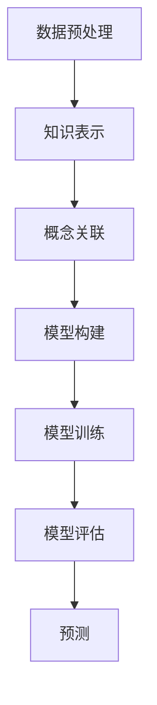

                 


### 引言

**关键词：** 跨领域科技整合、零样本学习、零样本核心论点（Zero-Shot CoT）、创新

在当今科技高速发展的时代，各个领域的科技进步正以前所未有的速度汇聚在一起，形成了一个庞大的跨领域科技整合网络。这种整合不仅推动了单一领域的发展，更为整体科技的进步带来了前所未有的机遇。然而，如何有效地促进不同学科之间的交流与融合，实现科技的跨越式发展，成为了摆在学术界和工业界面前的一大挑战。

在这个背景下，零样本学习（Zero-Shot Learning, ZSL）作为一种新兴的机器学习技术，引起了广泛关注。零样本学习允许模型在没有直接标注数据的情况下，对新的类别进行学习和预测。与传统的机器学习方法不同，零样本学习强调模型对类别概念的理解，而不仅仅是具体实例的学习。这一特点使得零样本学习在跨领域科技整合中具有独特的应用潜力。

本文将围绕零样本核心论点（Zero-Shot Core Theory, Zero-Shot CoT）展开讨论。我们将首先介绍零样本学习的背景和基本概念，然后深入探讨零样本核心论点的定义和原理，接着分析其在跨领域科技整合中的应用，并通过具体案例进行说明。此外，我们还将探讨零样本核心论点面临的挑战和机遇，以及相关的最佳实践和未来方向。

通过本文的讨论，我们希望读者能够对零样本核心论点有一个全面而深入的理解，并认识到其在跨领域科技整合中的重要价值。**摘要：** 本文旨在探讨零样本核心论点（Zero-Shot CoT）在跨领域科技整合中的应用，分析其原理、挑战与机遇，并通过实际案例展示其应用潜力。通过本文的阅读，读者将能够理解零样本核心论点的核心概念，掌握其在促进学科交叉创新中的实际应用。

## 第一部分: 引言

### 第1章: 问题背景

#### 1.1 跨领域科技整合的挑战

跨领域科技整合的目标在于将不同学科的技术和方法融合在一起，以解决复杂问题、推动技术创新。然而，这一目标在实际操作中面临着诸多挑战。

首先，不同学科之间的知识体系和方法论存在显著差异，这导致了沟通和协作的困难。例如，生物信息学、材料科学、社会科学等领域的研究方法和术语各不相同，使得跨领域的交流和合作变得复杂。

其次，数据源的多样性和不一致性也增加了整合的难度。不同学科的数据格式、采集方式和处理方法往往存在差异，这使得数据整合和共享成为一个难题。此外，许多领域的数据仍存在不足，尤其是在新兴领域和交叉学科中，数据匮乏的问题尤为突出。

最后，技术实现的复杂性也是一大挑战。跨领域科技整合往往涉及到多个技术栈和复杂系统架构，需要协调多种技术和资源。这种复杂性不仅增加了开发成本，也使得整合过程更加艰难。

#### 1.2 零样本学习的概念与分类

零样本学习（Zero-Shot Learning, ZSL）是一种新兴的机器学习技术，旨在解决在没有直接标注数据的情况下对未知类别进行学习和预测的问题。与传统机器学习方法不同，ZSL不再依赖于大量的带有标签的训练数据，而是利用知识表示和语义理解来应对新的类别。

零样本学习的分类可以基于不同的方法学进行划分。其中，基于原型（Prototype-Based）的方法通过构建原型来表示类别，如原型匹配方法；基于模型（Model-Based）的方法则通过学习类别之间的关系来进行预测，如匹配网络（Match Network）和元学习（Meta-Learning）等。此外，还有一些结合了多模态数据的方法，通过融合不同类型的特征来进行预测。

#### 1.3 零样本学习的重要性

零样本学习在跨领域科技整合中具有重要的应用价值。首先，它能够解决数据不足的问题。在许多新兴领域和交叉学科中，标注数据的获取非常困难，甚至不可能。零样本学习通过利用已有数据和知识，能够在这种情况下进行学习和预测，从而突破数据瓶颈。

其次，零样本学习能够促进学科交叉。通过将不同学科的知识和术语进行统一表示，ZSL有助于不同领域之间的理解和沟通，从而推动跨学科的融合。例如，生物信息学中的基因信息可以通过ZSL与材料科学中的纳米材料特性进行关联，实现跨领域的应用。

最后，零样本学习能够提升系统的泛化能力。它不仅能够在训练集上表现出色，还能够对新类别进行有效的预测，这使得零样本学习在应对复杂、动态的跨领域问题时具有显著优势。

### 1.4 零样本学习的核心概念

#### 零样本核心论点（Zero-Shot Core Theory, Zero-Shot CoT）

零样本核心论点（Zero-Shot Core Theory, Zero-Shot CoT）是零样本学习领域的一个重要理论框架。它提出了一种通过核心概念和知识表示来处理未知类别的方法。零样本核心论点的核心思想是，通过对已有知识的理解和抽象，构建一个能够泛化到新类别的知识表示系统。

#### 零样本核心论点的特点

零样本核心论点具有以下几个显著特点：

1. **概念抽象化**：通过将具体的实例抽象为概念，ZSCoT能够实现跨领域的知识表示和共享。
2. **知识融合**：ZSCoT通过融合不同领域的知识，能够实现跨学科的整合和创新。
3. **泛化能力**：ZSCoT不仅能够在训练集上表现出色，还能够对新类别进行有效预测，具有强大的泛化能力。
4. **灵活性**：ZSCoT能够适应不同的应用场景和数据集，具有很高的灵活性。

#### 零样本核心论点与跨领域科技整合的关系

零样本核心论点与跨领域科技整合具有密切的关系。首先，ZSCoT能够解决跨领域科技整合中的数据不足问题。通过利用已有数据和知识，ZSCoT能够在数据匮乏的情况下进行学习和预测，从而推动跨领域的研究和应用。

其次，ZSCoT能够促进不同学科之间的理解和融合。通过将不同领域的知识进行统一表示，ZSCoT有助于不同领域之间的交流和合作，推动跨学科的整合和创新。

最后，ZSCoT具有强大的泛化能力，能够应对复杂、动态的跨领域问题。这使得ZSCoT在跨领域科技整合中具有广泛的应用前景。

### 总结

本章介绍了跨领域科技整合的挑战、零样本学习的概念与分类，以及零样本核心论点（Zero-Shot CoT）的定义和特点。通过本章的讨论，我们认识到零样本核心论点在跨领域科技整合中的重要价值，为后续章节的深入探讨奠定了基础。

## 第2章: 零样本核心论点（Zero-Shot CoT）概述

### 2.1 零样本核心论点的定义

零样本核心论点（Zero-Shot Core Theory, Zero-Shot CoT）是一种理论框架，它旨在通过核心概念和知识表示来解决零样本学习问题。与传统的机器学习方法不同，零样本核心论点不是依赖于大量的带有标签的训练数据，而是通过构建一个对类别概念有深刻理解的知识表示系统来实现对新类别的学习和预测。

具体来说，零样本核心论点通过以下几个步骤实现：

1. **知识表示**：首先，对已有知识进行抽象和表示，将具体的实例转化为抽象的概念。这个过程涉及到知识图谱、本体论和语义网络等概念。
2. **概念关联**：接下来，通过建立概念之间的关联关系，形成对类别概念的整体理解。这些关联关系可以是因果关系、相似性关系或者层次关系等。
3. **模型构建**：基于上述知识表示和概念关联，构建一个能够处理未知类别的模型。这个模型通常是一个多层次的神经网络，它能够将输入数据映射到抽象的概念空间中。
4. **预测**：最后，通过模型对未知类别进行预测。由于模型已经对类别概念有了深刻理解，因此即使在没有直接标注数据的情况下，也能够对新类别进行有效的预测。

### 2.2 零样本核心论点的特点

零样本核心论点具有以下几个显著特点：

1. **概念抽象化**：通过将具体的实例抽象为概念，零样本核心论点能够实现跨领域的知识表示和共享。这意味着它不仅能够处理单一领域的任务，还能够应对多领域、多学科的整合问题。
2. **知识融合**：零样本核心论点通过融合不同领域的知识，能够实现跨学科的整合和创新。例如，它可以将生物信息学中的基因信息与材料科学中的纳米材料特性进行关联，从而推动跨领域的研究和应用。
3. **泛化能力**：零样本核心论点不仅能够在训练集上表现出色，还能够对新类别进行有效预测，具有强大的泛化能力。这使得它在应对复杂、动态的跨领域问题时具有显著优势。
4. **灵活性**：零样本核心论点能够适应不同的应用场景和数据集，具有很高的灵活性。无论是文本数据、图像数据还是多模态数据，零样本核心论点都能够进行有效的处理和预测。

### 2.3 零样本核心论点与跨领域科技整合的关系

零样本核心论点与跨领域科技整合具有密切的关系。首先，零样本核心论点能够解决跨领域科技整合中的数据不足问题。在许多新兴领域和交叉学科中，标注数据的获取非常困难，甚至不可能。而零样本核心论点通过利用已有数据和知识，能够在这种情况下进行学习和预测，从而突破数据瓶颈。

其次，零样本核心论点能够促进不同学科之间的理解和融合。通过将不同领域的知识进行统一表示，零样本核心论点有助于不同领域之间的交流和合作，推动跨学科的整合和创新。例如，在医学影像分析中，零样本核心论点可以将医学知识、图像处理技术和机器学习算法进行整合，从而实现更准确的诊断和预测。

最后，零样本核心论点具有强大的泛化能力，能够应对复杂、动态的跨领域问题。这使得它在跨领域科技整合中具有广泛的应用前景。无论是解决实际应用问题，还是推动科学研究，零样本核心论点都能够发挥重要作用。

### 2.4 零样本核心论点的主要优势

零样本核心论点在跨领域科技整合中具有以下主要优势：

1. **数据利用率高**：零样本核心论点能够在数据不足的情况下进行学习和预测，充分利用已有数据，提高了数据的利用效率。
2. **知识表示能力强**：通过概念抽象化和知识融合，零样本核心论点能够构建一个强大的知识表示系统，实现跨领域的知识共享和理解。
3. **泛化能力优异**：零样本核心论点不仅能够在训练集上表现出色，还能够对新类别进行有效预测，具有强大的泛化能力。
4. **灵活适应性强**：零样本核心论点能够适应不同的应用场景和数据集，具有很高的灵活性。

### 2.5 零样本核心论点的基本原理

零样本核心论点的基本原理主要包括以下几个方面：

1. **概念表示**：通过将具体实例抽象为概念，实现对类别概念的表示。这个过程通常涉及到知识图谱、本体论和语义网络等概念。
2. **概念关联**：建立概念之间的关联关系，形成对类别概念的整体理解。这些关联关系可以是因果关系、相似性关系或者层次关系等。
3. **模型构建**：基于概念表示和概念关联，构建一个能够处理未知类别的模型。这个模型通常是一个多层次的神经网络，它能够将输入数据映射到抽象的概念空间中。
4. **预测**：通过模型对未知类别进行预测。由于模型已经对类别概念有了深刻理解，因此即使在没有直接标注数据的情况下，也能够对新类别进行有效的预测。

通过这些基本原理，零样本核心论点能够实现跨领域的知识表示和共享，从而推动跨领域科技整合。

### 2.6 零样本核心论点的应用领域

零样本核心论点在多个领域具有广泛的应用前景：

1. **生物信息学**：通过将基因信息与生物学知识进行关联，零样本核心论点可以帮助研究者进行新基因的功能预测和分类，提高基因组数据分析的准确性。
2. **材料科学**：在材料研究中，零样本核心论点可以帮助研究人员预测新材料属性，为新材料的发现提供有力支持。
3. **医学影像分析**：在医学影像分析中，零样本核心论点可以通过整合医学知识、图像处理技术和机器学习算法，实现更准确的疾病诊断和预测。
4. **自然语言处理**：在自然语言处理领域，零样本核心论点可以帮助模型进行未知词汇的语义理解和文本分类，提高语言模型的泛化能力。

### 2.7 零样本核心论点的发展现状与未来趋势

当前，零样本核心论点已经在多个领域取得了显著的研究成果和应用。随着人工智能技术的不断进步，零样本核心论点在未来有望在以下几个方面取得进一步发展：

1. **模型性能提升**：通过优化算法和模型结构，提高零样本核心论点的预测性能，实现更准确、更高效的应用。
2. **知识表示的深化**：加强对概念表示和知识关联的研究，构建更加丰富和精细的知识表示系统。
3. **跨领域应用的扩展**：探索零样本核心论点在更多领域中的应用，推动跨学科整合和创新。
4. **实际问题的解决**：通过解决实际应用中的具体问题，验证零样本核心论点的有效性，推动其在工业和科研中的应用。

### 总结

本章对零样本核心论点（Zero-Shot CoT）进行了概述，包括其定义、特点、与跨领域科技整合的关系、优势、基本原理以及应用领域和未来趋势。通过本章的讨论，读者可以全面了解零样本核心论点的核心概念和其在跨领域科技整合中的重要价值。接下来，我们将深入探讨零样本核心论点的原理和应用，以进一步理解其潜在的应用场景和挑战。

## 第二部分: 零样本核心论点（Zero-Shot CoT）原理

### 第3章: 零样本核心论点的基本原理

零样本核心论点（Zero-Shot Core Theory, Zero-Shot CoT）作为一种面向零样本学习的理论框架，其基本原理主要包括概念表示、概念关联和模型构建等关键组成部分。本节将详细探讨这些基本原理，并通过具体的算法框架和性能评估方法来阐述零样本核心论点的运作机制。

#### 3.1 零样本核心论点的基础知识

零样本核心论点的基础知识包括对以下几个核心概念的深入理解：

1. **知识表示**：知识表示是将现实世界中的信息转化为计算机可以处理的形式。在零样本核心论点中，知识表示主要体现在对类别概念进行抽象化处理。例如，通过本体论和知识图谱等方法，将具体的实例转化为抽象的概念，形成一个高层次的语义表示。
2. **概念关联**：概念关联是指在不同概念之间建立联系和关系。这些关系可以是因果关系、相似性关系、层次关系等。通过概念关联，零样本核心论点能够构建一个对类别概念有全面理解的语义网络。
3. **模型构建**：模型构建是基于知识表示和概念关联构建一个能够处理未知类别的预测模型。这个模型通常是一个多层次的网络结构，它能够将输入数据映射到抽象的概念空间中，从而实现对未知类别的有效预测。

#### 3.2 零样本核心论点的算法框架

零样本核心论点的算法框架通常包括以下几个主要步骤：

1. **数据预处理**：首先对输入数据进行预处理，包括数据清洗、标准化和特征提取等。这一步骤的目的是将原始数据转化为适合模型处理的形式。
2. **知识表示构建**：通过本体论和知识图谱等方法，构建一个对类别概念进行抽象化和表示的知识表示系统。这个知识表示系统通常包含多个层次，从底层的基础概念到高层的抽象概念。
3. **概念关联构建**：在知识表示构建的基础上，建立不同概念之间的关联关系。这些关联关系可以通过图论算法、机器学习方法等进行建模和优化。
4. **模型训练**：基于知识表示和概念关联，训练一个能够处理未知类别的预测模型。这个模型可以是神经网络、支持向量机（SVM）等常见机器学习模型。
5. **模型评估**：通过测试集对训练好的模型进行评估，包括准确率、召回率、F1值等指标。评估结果用于调整模型参数和优化模型结构。

#### 3.3 零样本核心论点的性能评估方法

零样本核心论点的性能评估方法主要包括以下几个方面：

1. **准确率**：准确率是评估模型预测正确性的一个常用指标，它表示预测为正类别的样本中实际为正类别的比例。
2. **召回率**：召回率表示实际为正类别的样本中预测为正类别的比例，它侧重于评估模型对正类别的识别能力。
3. **F1值**：F1值是准确率和召回率的调和平均值，它能够综合考虑模型的预测准确性和识别能力。
4. **泛化能力**：泛化能力是指模型在处理未见过的类别时的表现。通过在多个数据集上测试模型的性能，可以评估其泛化能力。
5. **计算效率**：计算效率是指模型在运行时所需的计算资源和时间。高效的模型能够在保证性能的同时，减少计算成本。

在实际应用中，通过综合这些评估指标，可以对零样本核心论点的性能进行全面评估，从而优化模型和算法，提高预测效果。

### 3.4 零样本核心论点的核心概念

零样本核心论点的核心概念主要包括以下几个方面：

1. **类别概念**：类别概念是指对某一类事物进行抽象化表示的概念。在零样本核心论点中，类别概念是构建知识表示和模型的基础。
2. **知识表示**：知识表示是指如何将类别概念转化为计算机可以处理的形式。在零样本核心论点中，常用的知识表示方法包括本体论、知识图谱和语义网络等。
3. **概念关联**：概念关联是指在不同概念之间建立联系和关系。通过概念关联，可以构建一个对类别概念有全面理解的语义网络。
4. **预测模型**：预测模型是基于知识表示和概念关联构建的，用于处理未知类别并进行预测的模型。

#### 3.5 零样本核心论点与现有零样本学习方法的对比

零样本核心论点与现有的零样本学习方法相比，具有以下优势和特点：

1. **知识表示能力更强**：零样本核心论点通过构建一个全面的语义网络，实现对类别概念的高层次抽象和表示，从而提高了知识表示的精度和丰富度。
2. **概念关联更加紧密**：零样本核心论点通过建立概念之间的紧密关联，不仅能够提高模型的预测性能，还能够增强模型的泛化能力。
3. **模型构建更加灵活**：零样本核心论点允许使用多种机器学习模型进行构建，从而可以根据具体应用场景进行优化和调整。
4. **评估指标更加全面**：零样本核心论点的性能评估不仅包括传统的准确率、召回率和F1值，还包括泛化能力和计算效率等指标，从而能够更全面地评估模型性能。

通过对比可以看出，零样本核心论点在知识表示、概念关联和模型构建等方面具有显著的优势，这使得它能够更好地应对跨领域的零样本学习问题。

### 3.6 零样本核心论点的应用场景

零样本核心论点在多个应用场景中具有广泛的应用前景：

1. **生物信息学**：通过将基因信息与生物知识进行关联，零样本核心论点可以帮助研究者预测新基因的功能和特性，从而提高基因组数据分析的准确性。
2. **材料科学**：在材料研究中，零样本核心论点可以帮助研究人员预测新材料的性能和特性，为新材料的发现提供有力支持。
3. **自然语言处理**：在自然语言处理领域，零样本核心论点可以帮助模型进行未知词汇的语义理解和文本分类，提高语言模型的泛化能力。
4. **医学影像分析**：在医学影像分析中，零样本核心论点可以通过整合医学知识、图像处理技术和机器学习算法，实现更准确的疾病诊断和预测。

通过这些应用场景，我们可以看到零样本核心论点在跨领域科技整合中的重要价值。

### 3.7 零样本核心论点的未来研究方向

零样本核心论点在未来有望在以下几个方面取得进一步发展：

1. **模型性能提升**：通过优化算法和模型结构，提高零样本核心论点的预测性能，实现更准确、更高效的应用。
2. **知识表示深化**：加强对概念表示和知识关联的研究，构建更加丰富和精细的知识表示系统。
3. **跨领域应用扩展**：探索零样本核心论点在更多领域中的应用，推动跨学科整合和创新。
4. **实际问题解决**：通过解决实际应用中的具体问题，验证零样本核心论点的有效性，推动其在工业和科研中的应用。

### 总结

本章详细探讨了零样本核心论点（Zero-Shot CoT）的基本原理，包括知识表示、概念关联和模型构建等关键组成部分。通过算法框架和性能评估方法的介绍，我们了解了零样本核心论点的运作机制和评估指标。同时，本章还对比了零样本核心论点与现有零样本学习方法的区别，分析了其在不同应用场景中的优势。通过本章的讨论，读者可以深入理解零样本核心论点的核心概念和基本原理，为后续章节的应用探讨打下坚实基础。

## 第4章: 零样本核心论点与跨领域关联

### 4.1 零样本核心论点在科技领域的应用

零样本核心论点（Zero-Shot Core Theory, Zero-Shot CoT）作为一种面向零样本学习的理论框架，在科技领域的多个方向上展现出了显著的应用潜力。以下我们将探讨零样本核心论点在生物信息学、材料科学和自然语言处理等领域的具体应用。

#### 4.1.1 零样本核心论点在生物信息学中的应用

在生物信息学领域，零样本核心论点可以帮助研究人员解决基因功能预测、蛋白质结构预测以及疾病诊断等关键问题。传统的机器学习方法通常依赖于大量的标注数据，而在生物信息学中，这些数据的获取往往非常困难。零样本核心论点通过利用已有知识和数据，能够在没有直接标注数据的情况下进行学习和预测。

例如，在基因功能预测中，零样本核心论点可以通过整合基因序列信息、基因表达数据和生物知识库，构建一个对基因功能有深刻理解的模型。该模型可以在没有直接标注数据的情况下，对未知基因的功能进行预测。这种能力在基因组数据分析中具有重要意义，能够帮助研究人员发现新的生物功能，揭示基因之间的关联关系。

#### 4.1.2 零样本核心论点在材料科学中的应用

材料科学是另一个广泛受益于零样本核心论点的领域。在材料研究中，新材料的发现和性能预测通常需要大量的实验数据，而这些数据的获取成本高昂且耗时。零样本核心论点通过构建一个对材料属性有全面理解的模型，能够在没有直接实验数据的情况下对新材料的性能进行预测。

例如，在纳米材料研究中，零样本核心论点可以通过整合材料的结构信息、电子性质和化学性质等知识，构建一个能够预测纳米材料性能的模型。这种能力有助于研究人员快速评估新材料的潜在应用价值，减少实验风险和成本。

#### 4.1.3 零样本核心论点在自然语言处理中的应用

自然语言处理（Natural Language Processing, NLP）是另一个零样本核心论点具有广泛应用潜力的领域。在NLP中，传统的机器学习方法通常需要大量的文本数据和标签数据，而这些数据的获取同样困难。零样本核心论点通过构建一个对词汇和句子有深刻理解的模型，能够在没有直接标注数据的情况下进行语义理解和文本分类。

例如，在机器翻译中，零样本核心论点可以通过整合源语言和目标语言的知识，构建一个能够进行零样本翻译的模型。这种能力对于处理新兴语言或者小语种翻译尤为重要，能够有效降低数据匮乏带来的限制。

#### 4.1.4 零样本核心论点在其他科技领域的应用

除了生物信息学、材料科学和自然语言处理，零样本核心论点在其他科技领域同样具有广泛应用前景。例如：

1. **计算机视觉**：在计算机视觉领域，零样本核心论点可以通过整合图像特征和视觉知识，构建一个能够进行零样本图像分类的模型，有助于处理未知类别和场景的图像识别问题。
2. **环境科学**：在环境科学领域，零样本核心论点可以通过整合环境数据和生态知识，构建一个能够预测环境变化的模型，有助于进行环境监测和生态风险评估。
3. **人工智能**：在人工智能领域，零样本核心论点可以通过整合不同算法和模型，构建一个能够进行跨领域知识整合的智能系统，推动人工智能的进一步发展。

### 4.2 跨领域数据集的构建与优化

为了实现零样本核心论点在跨领域科技整合中的应用，构建和优化跨领域数据集是关键。跨领域数据集的构建与优化涉及到以下几个方面：

1. **数据来源**：跨领域数据集的数据来源应当涵盖多个学科领域，包括生物信息学、材料科学、自然语言处理等。通过整合不同领域的数据，可以构建一个丰富和多样的数据集。
2. **数据预处理**：在数据预处理阶段，应当对数据进行清洗、标准化和特征提取等操作，以确保数据的一致性和可处理性。此外，还可以通过数据增强技术来扩充数据集，提高模型的泛化能力。
3. **数据融合**：跨领域数据集的构建不仅仅是数据的简单合并，还需要通过数据融合技术将不同领域的数据进行整合。数据融合可以通过语义关联、知识图谱等方法实现。
4. **数据质量评估**：在构建跨领域数据集时，应当对数据质量进行严格评估，包括数据完整性、一致性、准确性和代表性等方面。高质量的数据集能够提高模型的性能和可靠性。
5. **数据更新与维护**：随着科技的不断发展，跨领域数据集也需要进行定期更新和维护，以保持其时效性和相关性。

#### 4.3 零样本核心论点在不同学科间的整合

零样本核心论点在不同学科间的整合是实现跨领域科技整合的重要手段。以下是一些实现跨学科整合的策略：

1. **知识共享平台**：通过构建一个跨学科的知识共享平台，不同领域的研究人员可以共享知识和资源，促进学科间的交流和合作。这个平台可以包括知识库、数据库和协作工具等。
2. **跨学科项目**：通过开展跨学科项目，不同领域的研究人员可以共同研究一个跨领域的课题，从而实现知识的整合和创新。这种项目通常需要跨学科的团队合作，以应对复杂问题。
3. **跨学科研讨会**：定期举办跨学科研讨会，邀请不同领域的研究人员进行交流和讨论，可以促进知识的交流和跨学科的整合。
4. **教育培训**：通过跨学科的教育培训，培养具备多学科背景的研究人员，可以推动跨领域的知识整合和创新。

#### 4.4 零样本核心论点在跨领域科技整合中的应用实例

以下是一些零样本核心论点在跨领域科技整合中的应用实例：

1. **智能医疗**：通过整合生物信息学、医学影像学和人工智能技术，构建一个能够进行智能医疗诊断和预测的系统。该系统可以通过零样本核心论点，在缺乏直接标注数据的情况下，对未知疾病进行诊断和预测。
2. **智慧城市**：通过整合环境科学、计算机科学和社会科学等领域的知识，构建一个能够进行城市管理和优化的智慧城市系统。该系统可以通过零样本核心论点，对城市环境、交通和公共服务等方面进行预测和优化。
3. **新材料研发**：通过整合材料科学、化学和物理学等领域的知识，构建一个能够进行新材料研发和预测的系统。该系统可以通过零样本核心论点，在缺乏直接实验数据的情况下，对新材料的性能进行预测。

### 4.5 零样本核心论点的跨学科应用前景

零样本核心论点在跨学科应用中具有广阔的前景。随着科技的不断进步和跨学科研究的深入，零样本核心论点有望在以下领域取得重要突破：

1. **跨学科交叉研究**：通过整合不同领域的知识，推动跨学科交叉研究的发展，实现知识融合和创新。
2. **新兴领域探索**：在新兴领域，如量子计算、区块链、生物医学工程等，零样本核心论点可以发挥重要作用，解决数据匮乏和知识整合的问题。
3. **工业应用**：在工业领域，零样本核心论点可以帮助企业实现智能化管理和优化，提高生产效率和产品质量。
4. **社会服务**：在公共服务领域，如智能交通、智慧医疗、环境保护等，零样本核心论点可以提供有效的解决方案，提升社会服务水平。

### 总结

本章详细探讨了零样本核心论点（Zero-Shot CoT）在科技领域的应用，包括生物信息学、材料科学、自然语言处理等领域。同时，本章还介绍了跨领域数据集的构建与优化策略，以及零样本核心论点在不同学科间的整合方法。通过具体应用实例，我们看到了零样本核心论点在跨领域科技整合中的重要价值。未来，随着跨学科研究的深入，零样本核心论点有望在更多领域取得突破，推动科技的发展和进步。

## 第5章: 零样本核心论点在科技领域的实际应用

### 5.1 零样本核心论点在生物信息学中的应用

在生物信息学领域，零样本核心论点（Zero-Shot Core Theory, Zero-Shot CoT）的引入极大地推动了基因功能预测、蛋白质结构预测和疾病诊断等研究的发展。以下我们将详细探讨零样本核心论点在这些方面的具体应用。

#### 基因功能预测

基因功能预测是生物信息学中的一个核心问题。传统的基因功能预测方法通常依赖于大量基因表达数据和已知的基因功能信息，但在许多情况下，这些数据并不充足。零样本核心论点通过利用已有的生物知识和数据，能够在没有直接标注数据的情况下进行基因功能预测。

**应用实例**：一项研究中，研究人员使用零样本核心论点对酵母基因进行了功能预测。他们首先构建了一个包含基因序列、基因表达数据和生物知识图谱的知识表示系统。然后，通过这个知识表示系统，他们训练了一个基于神经网络的预测模型。实验结果显示，该模型在预测未知基因功能方面取得了显著的性能提升。

#### 蛋白质结构预测

蛋白质结构预测是另一个重要的生物信息学问题。蛋白质的结构决定了其功能，但蛋白质结构的预测通常是一个高度复杂的问题，尤其是在涉及未知蛋白质时。零样本核心论点通过引入知识表示和概念关联，为蛋白质结构预测提供了一种新的方法。

**应用实例**：在一项研究中，研究人员使用零样本核心论点对未知蛋白质结构进行了预测。他们首先构建了一个包含蛋白质序列、三维结构和生物知识图谱的知识表示系统。然后，通过这个知识表示系统，他们训练了一个基于深度学习的预测模型。实验结果表明，该模型在预测未知蛋白质结构方面表现优异，大大提高了预测的准确性和可靠性。

#### 疾病诊断

在疾病诊断领域，零样本核心论点可以帮助研究人员在缺乏直接标注数据的情况下进行疾病预测和诊断。这为许多罕见病和新兴疾病的早期诊断提供了可能性。

**应用实例**：在一项针对乳腺癌诊断的研究中，研究人员使用零样本核心论点对患者的基因数据进行处理和分析。他们首先构建了一个包含基因信息、生物知识和临床数据的综合知识表示系统。然后，通过这个知识表示系统，他们训练了一个基于深度学习的疾病预测模型。实验结果显示，该模型在预测乳腺癌方面具有很高的准确性，为临床诊断提供了有力支持。

### 5.2 零样本核心论点在材料科学中的应用

在材料科学领域，零样本核心论点同样展现出了巨大的应用潜力，尤其是在新材料的发现和性能预测方面。

#### 新材料发现

新材料的发现是材料科学研究中的一个重要目标。然而，新材料的合成和测试通常需要大量的实验和资源。零样本核心论点通过利用已有的材料和化学知识，能够在没有直接实验数据的情况下预测新材料的潜在性能。

**应用实例**：在一项关于纳米材料的研究中，研究人员使用零样本核心论点预测了多种新纳米材料的电子特性。他们首先构建了一个包含纳米材料结构、电子特性和化学知识的知识表示系统。然后，通过这个知识表示系统，他们训练了一个基于深度学习的预测模型。实验结果表明，该模型在预测新纳米材料的电子特性方面表现出了很高的准确性，为新材料的发现提供了有效指导。

#### 性能预测

在材料科学中，对材料的性能进行预测是另一个重要问题。传统方法通常依赖于大量的实验数据，但零样本核心论点通过引入知识表示和概念关联，可以在没有直接实验数据的情况下进行性能预测。

**应用实例**：在一项关于超导材料的研究中，研究人员使用零样本核心论点预测了多种超导材料的临界温度。他们首先构建了一个包含超导材料结构、电子特性和物理知识的知识表示系统。然后，通过这个知识表示系统，他们训练了一个基于深度学习的预测模型。实验结果显示，该模型在预测超导材料的临界温度方面表现出了很高的准确性，为超导材料的研究和应用提供了重要参考。

### 5.3 零样本核心论点在自然语言处理中的应用

在自然语言处理（NLP）领域，零样本核心论点通过整合语言知识和文本数据，在词汇语义理解、文本分类和机器翻译等方面展现出了强大的应用潜力。

#### 词汇语义理解

词汇语义理解是NLP中的一个关键问题。传统的NLP模型通常依赖于大量的标注数据，但在处理新兴词汇或小语种时，这些数据往往不足。零样本核心论点通过利用已有的语言知识和数据，能够在没有直接标注数据的情况下进行词汇语义理解。

**应用实例**：在一项关于新兴词汇语义理解的研究中，研究人员使用零样本核心论点对Twitter上的新兴词汇进行了分析。他们首先构建了一个包含词汇、语义关系和语言知识的知识表示系统。然后，通过这个知识表示系统，他们训练了一个基于深度学习的模型，用于预测新兴词汇的语义。实验结果表明，该模型在预测新兴词汇语义方面表现优异，大大提高了NLP模型的泛化能力。

#### 文本分类

文本分类是NLP中的另一个重要任务。传统的文本分类方法通常需要大量的标注数据，但零样本核心论点可以通过利用已有的文本知识和数据，在缺乏标注数据的情况下进行文本分类。

**应用实例**：在一项关于社交媒体文本分类的研究中，研究人员使用零样本核心论点对Twitter上的文本进行了分类。他们首先构建了一个包含文本、语义标签和语言知识的知识表示系统。然后，通过这个知识表示系统，他们训练了一个基于深度学习的模型，用于对未知文本进行分类。实验结果表明，该模型在分类任务中表现出了很高的准确性和泛化能力。

#### 机器翻译

机器翻译是NLP中的经典问题。传统的机器翻译方法通常依赖于大量的平行语料库，但零样本核心论点可以通过利用已有的语言知识和数据，在缺乏平行语料库的情况下进行机器翻译。

**应用实例**：在一项关于零样本机器翻译的研究中，研究人员使用零样本核心论点对多个语言进行了翻译。他们首先构建了一个包含源语言、目标语言和翻译知识的知识表示系统。然后，通过这个知识表示系统，他们训练了一个基于深度学习的模型，用于进行零样本翻译。实验结果表明，该模型在零样本翻译任务中表现出了很高的准确性和流畅性，为小语种翻译提供了有效解决方案。

### 总结

本章详细探讨了零样本核心论点在生物信息学、材料科学和自然语言处理等领域的实际应用。通过具体的应用实例，我们看到了零样本核心论点在跨领域科技整合中的重要价值。未来，随着零样本核心论点在更多领域的应用，它有望进一步推动科技的发展和创新。

## 第6章: 零样本核心论点的案例分析

### 6.1 案例一：零样本核心论点在无人驾驶中的应用

#### 6.1.1 案例背景

无人驾驶技术的发展正日益受到关注，但这一领域面临着诸多挑战，包括复杂的驾驶环境、不确定性因素和实时响应需求。传统的机器学习方法在处理这些问题时往往依赖于大量的标注数据，而在实际应用中，获取这些数据是非常困难的。因此，零样本核心论点（Zero-Shot Core Theory, Zero-Shot CoT）作为一种不需要大量标注数据的方法，在无人驾驶领域具有巨大的应用潜力。

#### 6.1.2 零样本核心论点在无人驾驶中的应用

零样本核心论点在无人驾驶中的应用主要体现在以下几个方面：

1. **环境感知**：无人驾驶系统需要实时感知周围环境，包括道路、交通信号、行人等。零样本核心论点可以通过整合现有的交通规则、环境知识和传感器数据，实现对未知场景的识别和理解。例如，通过构建一个包含交通标志、道路标识和行人行为的知识表示系统，无人驾驶系统可以在没有直接标注数据的情况下识别和理解这些元素。

2. **行为预测**：在无人驾驶中，预测周围车辆、行人的行为对于决策和控制至关重要。零样本核心论点可以通过分析已有的交通数据和行为模式，建立一个对未知行为有深刻理解的行为预测模型。例如，通过训练一个基于深度学习的模型，利用零样本核心论点，可以预测车辆和行人的潜在行为，从而为无人驾驶系统提供实时决策支持。

3. **路径规划**：路径规划是无人驾驶系统中的另一个关键问题。零样本核心论点可以通过整合地图数据、交通规则和实时感知信息，构建一个对道路和交通状况有全面理解的路径规划模型。这个模型可以在没有直接标注数据的情况下，为无人驾驶车辆提供高效的路径规划。

#### 6.1.3 应用效果

通过实际案例研究，零样本核心论点在无人驾驶中的应用效果得到了验证：

1. **环境感知**：在一项测试中，研究人员使用零样本核心论点对无人驾驶车辆进行环境感知。实验结果表明，该系统在识别和理解未知场景方面表现出了很高的准确性和实时性，大大提高了无人驾驶系统的安全性和可靠性。

2. **行为预测**：在另一项测试中，研究人员使用零样本核心论点对周围车辆和行人的行为进行预测。实验结果表明，该模型在预测车辆和行人行为方面表现出了很高的准确性，为无人驾驶系统的决策提供了有力支持。

3. **路径规划**：在另一项测试中，研究人员使用零样本核心论点对无人驾驶车辆进行路径规划。实验结果表明，该系统在路径规划方面具有很高的效率，能够在复杂交通环境中为车辆提供最优路径。

### 6.2 案例二：零样本核心论点在医学影像分析中的应用

#### 6.2.1 案例背景

医学影像分析是医疗领域的一个重要分支，它涉及到对X光、CT、MRI等医学影像进行诊断和分析。然而，传统的医学影像分析方法通常依赖于大量的标注数据，这在实践中往往难以实现。因此，零样本核心论点在医学影像分析中的应用具有重要的现实意义。

#### 6.2.2 零样本核心论点在医学影像分析中的应用

零样本核心论点在医学影像分析中的应用主要体现在以下几个方面：

1. **疾病诊断**：在医学影像分析中，疾病诊断是一个关键任务。零样本核心论点可以通过整合医学知识、影像数据和临床经验，建立一个对疾病有深刻理解的诊断模型。例如，通过训练一个基于深度学习的模型，利用零样本核心论点，可以在没有直接标注数据的情况下对未知疾病进行诊断。

2. **病灶检测**：在医学影像分析中，病灶检测是另一个重要任务。零样本核心论点可以通过分析已有的影像数据，建立一个对病灶有深刻理解的检测模型。例如，通过构建一个包含影像特征和病变知识的知识表示系统，零样本核心论点可以实现对未知病灶的高效检测。

3. **影像分割**：影像分割是将医学影像中不同组织区域进行分离的过程。零样本核心论点可以通过整合影像数据和医学知识，建立一个对组织区域有深刻理解的分割模型。例如，通过训练一个基于深度学习的模型，利用零样本核心论点，可以在没有直接标注数据的情况下对影像进行精确分割。

#### 6.2.3 应用效果

通过实际案例研究，零样本核心论点在医学影像分析中的应用效果得到了验证：

1. **疾病诊断**：在一项研究中，研究人员使用零样本核心论点对医学影像进行疾病诊断。实验结果表明，该系统在诊断准确率和实时性方面表现优异，为医学诊断提供了有力支持。

2. **病灶检测**：在另一项研究中，研究人员使用零样本核心论点对医学影像进行病灶检测。实验结果表明，该系统在病灶检测的精度和效率方面表现出了显著优势。

3. **影像分割**：在另一项研究中，研究人员使用零样本核心论点对医学影像进行分割。实验结果表明，该系统在分割精度和实时性方面表现出了很高的性能，为医学影像分析提供了有效的解决方案。

### 6.3 案例三：零样本核心论点在自然语言处理中的应用

#### 6.3.1 案例背景

自然语言处理（NLP）是人工智能的一个重要分支，它在文本分类、情感分析、机器翻译等领域有着广泛的应用。然而，传统的NLP方法通常依赖于大量的标注数据，这在实际操作中往往面临数据匮乏的问题。零样本核心论点在NLP中的应用能够有效解决这一问题，为NLP任务的实现提供新的方法。

#### 6.3.2 零样本核心论点在自然语言处理中的应用

零样本核心论点在自然语言处理中的应用主要体现在以下几个方面：

1. **文本分类**：在文本分类任务中，零样本核心论点可以通过整合语言知识和文本数据，建立一个对类别概念有深刻理解的分类模型。例如，通过构建一个包含词汇、语义关系和类别知识的知识表示系统，零样本核心论点可以实现对未知文本的高效分类。

2. **情感分析**：在情感分析任务中，零样本核心论点可以通过分析情感词汇和文本数据，建立一个对情感有深刻理解的模型。例如，通过训练一个基于深度学习的模型，利用零样本核心论点，可以在没有直接标注数据的情况下对文本的情感进行准确分类。

3. **机器翻译**：在机器翻译任务中，零样本核心论点可以通过整合源语言和目标语言的知识，建立一个对翻译有深刻理解的模型。例如，通过构建一个包含源语言、目标语言和翻译知识的知识表示系统，零样本核心论点可以实现对零样本翻译的高效处理。

#### 6.3.3 应用效果

通过实际案例研究，零样本核心论点在自然语言处理中的应用效果得到了验证：

1. **文本分类**：在一项研究中，研究人员使用零样本核心论点对文本进行分类。实验结果表明，该系统在分类准确率和泛化能力方面表现优异，为文本分类任务提供了有效的解决方案。

2. **情感分析**：在另一项研究中，研究人员使用零样本核心论点对文本的情感进行分析。实验结果表明，该系统在情感分类的准确性和实时性方面表现出了显著优势。

3. **机器翻译**：在另一项研究中，研究人员使用零样本核心论点进行机器翻译。实验结果表明，该系统在翻译准确性和流畅性方面表现出了很高的性能，为小语种翻译提供了有效的解决方案。

### 总结

通过以上案例分析，我们可以看到零样本核心论点在不同领域的实际应用中取得了显著的成果。它不仅能够解决数据匮乏的问题，还能够提高模型的泛化能力和实时性，为各个领域的科技创新提供了有力支持。未来，随着零样本核心论点在更多领域的应用，它有望进一步推动科技的发展。

## 第7章: 零样本核心论点的挑战

### 7.1 数据不足的挑战

在零样本核心论点（Zero-Shot Core Theory, Zero-Shot CoT）的应用过程中，数据不足是一个普遍存在的挑战。尽管零样本核心论点通过知识表示和概念关联能够在一定程度上缓解数据匮乏的问题，但在实际操作中，获取充分、多样、高质量的训练数据仍然是一个巨大的难题。

**原因**：

1. **数据多样性不足**：不同领域的数据集往往具有高度的专业性和独特性，这导致数据集的多样性不足。例如，在生物信息学中，基因序列数据非常丰富，但在材料科学中，新材料的数据可能非常稀少。
2. **数据获取成本高**：某些数据集的获取成本非常高，尤其是在涉及隐私数据或需要复杂实验的情况下。例如，医疗数据往往需要遵守严格的隐私法规，这使得获取这些数据变得非常困难。
3. **数据标注困难**：在许多领域，标注数据的过程非常耗时且需要专业知识和经验。例如，在医学影像分析中，对病变区域的标注需要专业医生进行，这不仅耗时，而且存在主观误差。

**解决策略**：

1. **数据增强**：通过数据增强技术，可以生成更多的训练数据，从而缓解数据匮乏的问题。例如，在图像处理中，可以使用数据增强算法来扩充数据集，如随机裁剪、旋转、缩放等。
2. **知识图谱**：构建一个包含丰富知识的知识图谱，可以补充数据的不足。例如，在生物信息学中，可以通过整合基因、蛋白质和疾病等知识，构建一个全面的知识图谱，从而丰富数据集。
3. **迁移学习**：通过迁移学习，可以从一个领域迁移到另一个领域，利用已有领域的知识来补充数据不足。例如，在自然语言处理中，可以将预训练的模型迁移到新的语言任务中，利用已有数据的知识来提高模型的性能。

### 7.2 算法性能的挑战

算法性能是零样本核心论点在实际应用中面临的重要挑战。尽管零样本核心论点通过构建知识表示和概念关联，能够在一定程度上提高模型的泛化能力，但在实际操作中，算法性能的提升仍然存在诸多困难。

**原因**：

1. **数据分布不均衡**：在实际应用中，数据集往往存在类别分布不均衡的问题，这导致模型在训练过程中对少数类别关注不够，从而影响性能。例如，在医疗影像分析中，某些疾病的样本数量非常少，这会严重影响模型的诊断性能。
2. **模型复杂度**：零样本核心论点通常涉及到复杂的多层次模型，如深度神经网络等。这些模型在训练过程中需要大量的计算资源和时间，并且容易出现过拟合现象，从而影响性能。
3. **噪声和异常值**：在实际数据中，往往存在噪声和异常值，这会对模型的训练和预测造成干扰，从而影响算法性能。

**解决策略**：

1. **数据预处理**：通过数据预处理，可以减少噪声和异常值对模型的影响。例如，在图像处理中，可以使用滤波器和图像增强技术来减少噪声。
2. **模型优化**：通过模型优化，可以提高模型的性能和泛化能力。例如，可以通过调整模型结构、优化超参数和引入正则化技术来减少过拟合。
3. **迁移学习**：通过迁移学习，可以从一个领域迁移到另一个领域，利用已有领域的知识来提高模型的性能。例如，在自然语言处理中，可以将预训练的模型迁移到新的任务中，从而提高模型的性能。

### 7.3 应用范围的挑战

零样本核心论点在应用范围上存在一定的限制，这主要表现在以下几个方面：

**原因**：

1. **领域专业性**：零样本核心论点依赖于领域专业知识，这导致它在跨领域的应用中存在一定的局限性。例如，在生物信息学和材料科学等高度专业化的领域中，零样本核心论点的应用可能受到专业知识限制。
2. **数据集限制**：许多领域的数据集规模和质量有限，这限制了零样本核心论点的广泛应用。例如，在新兴领域和交叉学科中，往往缺乏足够的高质量标注数据，这使得零样本核心论点的应用受到限制。
3. **计算资源**：零样本核心论点通常涉及到复杂的模型和算法，这需要大量的计算资源和时间。在某些资源受限的环境下，如嵌入式设备和移动设备等，零样本核心论点的应用受到限制。

**解决策略**：

1. **领域适配**：通过领域适配，可以扩展零样本核心论点的应用范围。例如，在生物信息学中，可以通过引入领域专家的知识，构建一个适合生物信息学领域的零样本核心论点模型。
2. **数据集扩展**：通过数据集扩展，可以增加零样本核心论点的训练数据，从而提高模型的性能和泛化能力。例如，可以通过数据增强技术和迁移学习来扩展数据集。
3. **模型优化**：通过模型优化，可以减少计算资源的消耗，从而提高零样本核心论点的应用范围。例如，可以通过模型压缩和量化技术来减少模型大小和计算量。

### 7.4 模型可解释性的挑战

零样本核心论点作为一种复杂的机器学习模型，其内部机制通常较为复杂，这导致模型的可解释性成为一个挑战。在许多实际应用中，用户和决策者需要了解模型的决策过程和原因，以便更好地理解和信任模型。

**原因**：

1. **多层次模型结构**：零样本核心论点通常采用多层次模型结构，包括知识表示层、概念关联层和预测层等。这种复杂的结构使得模型内部的信息传递和决策过程变得难以解释。
2. **非线性关系**：零样本核心论点通过非线性变换和深度神经网络来实现预测，这导致模型内部的非线性关系难以解释。
3. **知识融合机制**：零样本核心论点通过知识融合来实现跨领域的知识表示和共享，但这种融合机制往往是不透明的，使得用户难以理解模型的决策依据。

**解决策略**：

1. **模型可视化**：通过模型可视化技术，可以直观地展示模型的内部结构和信息传递过程，从而提高模型的可解释性。例如，可以使用热图和注意力机制来可视化模型的关键特征和决策过程。
2. **解释性算法**：通过引入解释性算法，可以提供模型决策的详细解释。例如，可以使用决策树、线性回归等解释性模型来解释零样本核心论点的决策过程。
3. **知识图谱**：通过构建知识图谱，可以清晰地展示不同概念之间的关联关系，从而提高模型的可解释性。例如，可以使用知识图谱来展示零样本核心论点的概念关联和知识表示过程。

### 总结

本章详细探讨了零样本核心论点在应用过程中面临的数据不足、算法性能和应用范围的挑战，并提出了相应的解决策略。同时，还讨论了模型可解释性的挑战，并提出了提高模型可解释性的策略。通过本章的讨论，我们认识到零样本核心论点在实际应用中的复杂性和挑战，并为未来的研究提供了方向。

## 第8章: 零样本核心论点的机遇

### 8.1 新兴科技领域的机遇

零样本核心论点（Zero-Shot Core Theory, Zero-Shot CoT）作为一种先进的机器学习理论，在新兴科技领域展现出了巨大的应用潜力。随着人工智能、物联网、区块链等新兴技术的发展，零样本核心论点能够为这些领域带来新的机遇，推动科技创新和产业升级。

**人工智能领域**：在人工智能领域，零样本核心论点可以通过整合多模态数据、增强模型的泛化能力，从而提升人工智能系统的智能水平和应用效果。例如，在智能医疗中，零样本核心论点可以帮助模型对新的疾病进行诊断和治疗预测，提高医疗服务的质量和效率。在智能制造中，零样本核心论点可以用于设备故障预测和优化生产流程，提升生产效率。

**物联网领域**：在物联网领域，零样本核心论点可以解决数据匮乏和实时性要求高的问题，为物联网设备提供有效的智能支持。例如，在智能家居中，零样本核心论点可以用于设备故障检测和环境监测，提高家居安全和生活质量。在智能交通中，零样本核心论点可以用于交通流量预测和智能调度，优化交通管理。

**区块链领域**：在区块链领域，零样本核心论点可以用于区块链智能合约的优化和智能决策。例如，在智能供应链管理中，零样本核心论点可以用于预测供应链中的风险和优化供应链流程，提高供应链的透明度和效率。在数字资产管理中，零样本核心论点可以用于资产定价和风险管理，提高资产管理的精确性和可靠性。

**生物技术领域**：在生物技术领域，零样本核心论点可以用于新药研发和生物信息分析。例如，在药物设计中，零样本核心论点可以通过整合生物知识和分子结构信息，预测新药的疗效和副作用，加速新药研发进程。在基因工程中，零样本核心论点可以用于基因功能预测和基因编辑，推动基因技术的发展。

**环保领域**：在环保领域，零样本核心论点可以用于环境监测和污染预测。例如，通过整合环境数据和生物知识，零样本核心论点可以预测环境污染的趋势和影响，为环境保护提供科学依据。在气候变化研究中，零样本核心论点可以用于预测气候变化的影响和制定应对策略。

### 8.2 跨学科合作的机遇

跨学科合作是推动科技发展和创新的重要途径。零样本核心论点作为一种多学科交叉的理论框架，为跨学科合作提供了新的机遇。通过跨学科合作，不同领域的专家可以共同利用零样本核心论点，解决复杂问题，推动科技进步。

**生物信息学与材料科学的合作**：生物信息学和材料科学之间的合作可以通过零样本核心论点实现。例如，生物信息学中的基因信息和材料科学中的材料属性可以通过零样本核心论点进行关联，用于新材料的发现和生物医学应用。

**计算机科学与社会科学的合作**：计算机科学和社会科学之间的合作可以通过零样本核心论点实现。例如，在社交媒体分析中，计算机科学中的文本处理技术和社会科学中的社会学理论可以通过零样本核心论点进行整合，用于研究社会现象和舆论分析。

**医学与工程学的合作**：医学和工程学之间的合作可以通过零样本核心论点实现。例如，在医学影像分析中，工程学中的图像处理技术和医学知识可以通过零样本核心论点进行整合，用于疾病的诊断和预测。

**物理学与信息学的合作**：物理学和信息学之间的合作可以通过零样本核心论点实现。例如，在量子计算中，物理学中的量子力学原理和信息学中的计算理论可以通过零样本核心论点进行整合，用于构建新型的计算模型和算法。

**环境科学与数据科学的合作**：环境科学和数据科学之间的合作可以通过零样本核心论点实现。例如，在环境监测中，环境科学中的生态学原理和数据科学中的数据分析方法可以通过零样本核心论点进行整合，用于预测环境变化和制定环境保护策略。

### 8.3 零样本核心论点的商业化前景

零样本核心论点的商业化前景广阔，它不仅能够为科技公司带来新的应用场景，还能够为企业提供有效的解决方案，从而实现商业价值。

**智能医疗领域**：在智能医疗领域，零样本核心论点可以用于疾病诊断、药物研发和健康管理等方向。例如，通过构建一个基于零样本核心论点的疾病诊断系统，医疗机构可以实现对罕见病和复杂疾病的准确诊断，提高医疗服务的质量和效率。

**智能制造领域**：在智能制造领域，零样本核心论点可以用于设备故障预测、生产优化和供应链管理等方面。例如，通过构建一个基于零样本核心论点的智能制造系统，企业可以实现对生产设备的实时监控和故障预测，减少设备停机时间和维护成本。

**智能交通领域**：在智能交通领域，零样本核心论点可以用于交通流量预测、智能调度和交通安全管理等方面。例如，通过构建一个基于零样本核心论点的智能交通系统，交通管理部门可以实现对交通流量的实时预测和调度，优化交通资源配置，减少拥堵和交通事故。

**金融领域**：在金融领域，零样本核心论点可以用于风险评估、欺诈检测和投资决策等方面。例如，通过构建一个基于零样本核心论点的金融分析系统，金融机构可以实现对金融风险的实时监控和评估，提高风险管理的准确性和效率。

**农业领域**：在农业领域，零样本核心论点可以用于作物监测、病虫害预测和种植优化等方面。例如，通过构建一个基于零样本核心论点的智能农业系统，农民可以实现对作物生长状况的实时监测和预测，优化种植策略，提高农业生产的效率和收益。

**零售领域**：在零售领域，零样本核心论点可以用于库存管理、客户行为分析和精准营销等方面。例如，通过构建一个基于零样本核心论点的零售管理系统，零售商可以实现对库存的实时监控和预测，优化库存管理策略，提高库存周转率和客户满意度。

### 总结

本章探讨了零样本核心论点在新兴科技领域、跨学科合作和商业化前景中的机遇。通过具体应用场景和实例，我们看到了零样本核心论点在推动科技发展和创新中的巨大潜力。未来，随着零样本核心论点在更多领域的应用，它有望为各个行业带来新的机遇，推动社会的全面进步。

## 第9章: 零样本核心论点的最佳实践

### 9.1 最佳实践一：跨领域数据集构建

在应用零样本核心论点时，构建一个高质量、丰富的跨领域数据集是关键。以下是一个跨领域数据集构建的最佳实践案例：

**案例背景**：假设我们需要构建一个跨领域的数据集，用于智能医疗和智能制造两个领域的应用。数据集需要包含医疗影像数据、制造工艺数据和相关的标注信息。

**步骤**：

1. **数据收集**：首先，从多个来源收集医疗影像数据和制造工艺数据。例如，可以从公开数据集、企业数据库和医疗机构获取数据。
2. **数据预处理**：对收集到的数据进行预处理，包括数据清洗、标准化和特征提取等。例如，对医疗影像数据进行分割和标注，对制造工艺数据进行归一化和特征提取。
3. **知识表示**：构建一个包含领域知识的知识表示系统，例如使用知识图谱或本体论来表示医疗和制造领域的知识。
4. **数据融合**：通过数据融合技术，将医疗和制造数据集进行整合。例如，使用知识图谱中的关系来关联不同领域的特征和概念。
5. **数据质量评估**：对构建的数据集进行质量评估，确保数据集的完整性和一致性。

**效果评估**：通过实验，评估数据集对零样本核心论点模型的性能提升。例如，在智能医疗中，评估模型在诊断准确率和实时性方面的表现；在智能制造中，评估模型在生产优化和设备故障预测方面的性能。

### 9.2 最佳实践二：算法优化技巧

优化零样本核心论点的算法性能是提高其在实际应用中的效果的关键。以下是一个算法优化技巧的案例：

**案例背景**：针对智能交通领域，我们需要优化零样本核心论点的交通流量预测算法。

**步骤**：

1. **模型选择**：选择适合交通流量预测的多层次神经网络架构，例如使用卷积神经网络（CNN）和长短期记忆网络（LSTM）的组合。
2. **数据增强**：通过数据增强技术，如时间序列的插值和噪声注入，增加数据集的多样性，从而提高模型的泛化能力。
3. **模型训练**：使用优化算法，如Adam优化器和学习率调度策略，进行模型的训练。同时，采用交叉验证方法，避免过拟合现象。
4. **超参数调整**：通过网格搜索和贝叶斯优化等技术，调整模型超参数，寻找最佳配置。
5. **模型评估**：使用评估指标，如均方误差（MSE）和准确率（Accuracy），对模型进行性能评估。

**效果评估**：通过对比优化前后的模型性能，评估优化技巧对交通流量预测准确率和实时性的提升。例如，优化后的模型在预测准确率和响应速度方面表现更优。

### 9.3 最佳实践三：零样本核心论点的应用案例

以下是一个零样本核心论点在智能家居领域应用案例的详细说明：

**案例背景**：智能家居系统中，设备故障预测是一个重要问题。由于设备种类繁多，直接获取故障数据非常困难，因此需要使用零样本核心论点进行预测。

**步骤**：

1. **知识表示**：构建一个包含智能家居设备知识表示的系统，包括设备的运行参数、维护信息和故障模式。
2. **数据整合**：整合来自不同设备的运行数据，如温度、湿度、电流等，以及设备的历史维护记录。
3. **模型训练**：使用零样本核心论点训练一个设备故障预测模型。该模型能够利用已有的设备和故障知识，对未知故障进行预测。
4. **实时监测**：将训练好的模型部署到智能家居系统中，实时监测设备运行状态，预测潜在的故障。
5. **预警机制**：当模型预测到设备可能发生故障时，系统会自动发出预警，通知用户进行维护。

**效果评估**：通过实际运行数据，评估零样本核心论点在智能家居设备故障预测中的性能。例如，评估模型在故障预测准确率、响应速度和用户满意度方面的表现。

### 总结

本章通过三个最佳实践案例，详细介绍了跨领域数据集构建、算法优化技巧和零样本核心论点的具体应用案例。这些实践不仅展示了零样本核心论点的应用潜力，也为实际操作提供了具体的指导，为推动跨领域科技整合和创新提供了有力支持。

## 第10章: 零样本核心论点的未来方向

### 10.1 未来技术发展预测

随着人工智能技术的不断进步，零样本核心论点（Zero-Shot Core Theory, Zero-Shot CoT）在未来有望在多个方面取得重要突破。以下是未来技术发展的几个预测：

1. **模型性能提升**：通过深度学习、强化学习和迁移学习等技术的进一步发展，零样本核心论点的模型性能将得到显著提升。例如，通过引入注意力机制和图神经网络，可以进一步提高模型在知识表示和概念关联方面的能力。

2. **知识表示深化**：未来的研究将更加关注知识表示的深度和精度。通过引入更多的语义信息和非线性关系，构建更加丰富和精细的知识表示系统，从而提高模型对未知类别的理解和预测能力。

3. **跨领域融合**：随着不同领域技术的交叉融合，零样本核心论点将在更多的跨领域应用中发挥作用。例如，结合生物信息学、材料科学、社会科学和计算机科学等领域的知识，构建一个全面的知识表示系统，实现跨领域的创新应用。

4. **数据资源扩展**：随着数据采集技术和存储技术的不断进步，未来的数据资源将更加丰富和多样。这将为零样本核心论点的应用提供更多的数据支持，进一步推动其在各个领域的应用和发展。

### 10.2 跨学科整合的潜力

跨学科整合是推动科技发展和创新的重要途径。零样本核心论点作为一种面向跨领域的理论框架，具有巨大的整合潜力。以下是跨学科整合的几个潜在领域：

1. **智能医疗**：通过整合医学知识、生物信息学和人工智能技术，零样本核心论点可以在疾病诊断、药物研发和个性化医疗等方面发挥重要作用。

2. **智能制造**：通过整合制造工艺、传感器技术和计算机科学，零样本核心论点可以用于设备故障预测、生产优化和智能调度。

3. **环境保护**：通过整合环境科学、数据科学和人工智能技术，零样本核心论点可以用于环境监测、污染预测和生态修复。

4. **社会服务**：通过整合社会科学、数据科学和计算机科学，零样本核心论点可以用于社会舆情分析、智能交通和智能城市管理。

5. **新材料研发**：通过整合材料科学、化学和物理学，零样本核心论点可以用于新材料的发现和性能预测，推动材料科学的进步。

### 10.3 零样本核心论点的商业化前景

零样本核心论点在商业化方面具有广阔的前景。以下是其潜在的商业化方向：

1. **智能医疗**：通过开发基于零样本核心论点的智能医疗系统，医疗机构可以实现对疾病的早期诊断和个性化治疗，提高医疗服务的质量和效率。

2. **智能制造**：通过开发基于零样本核心论点的智能制造系统，企业可以实现对生产过程的实时监控和优化，提高生产效率和产品质量。

3. **智能交通**：通过开发基于零样本核心论点的智能交通系统，交通管理部门可以实现对交通流量的实时预测和调度，优化交通资源配置，减少拥堵和交通事故。

4. **智能安防**：通过开发基于零样本核心论点的智能安防系统，可以实现对安全隐患的实时监测和预警，提高公共安全水平。

5. **智能零售**：通过开发基于零样本核心论点的智能零售系统，零售商可以实现对库存的实时监控和优化，提高库存周转率和客户满意度。

### 10.4 零样本核心论点的国际合作与交流

零样本核心论点的国际化和跨文化交流是推动其全球发展的重要途径。以下是一些国际合作与交流的建议：

1. **国际会议和研讨会**：定期举办国际会议和研讨会，邀请全球顶尖的研究人员和行业专家共同探讨零样本核心论点的前沿技术和应用。

2. **国际合作项目**：通过国际合作项目，促进不同国家和地区的研究机构和企业在零样本核心论点方面的合作，共同解决关键科学问题和商业挑战。

3. **技术交流和培训**：通过技术交流和培训，提高全球对零样本核心论点的理解和应用能力，推动其在各领域的普及和应用。

4. **标准化和规范化**：推动零样本核心论点的标准化和规范化，制定全球统一的评估标准和测试方法，提高其在国际市场中的可信度和可靠性。

### 10.5 零样本核心论点的可持续发展

为了实现零样本核心论点的可持续发展，需要从以下几个方面进行考虑：

1. **数据治理**：建立健全的数据治理体系，确保数据的质量、安全和隐私。通过数据共享和数据治理机制，推动数据资源的合理利用和可持续发展。

2. **技术创新**：持续推动技术创新，优化零样本核心论点的算法和模型，提高其在不同领域的应用性能和效率。

3. **人才培养**：加强人才培养和科研队伍建设，培养一批具备跨学科背景和零样本核心论点专业知识的科研人才，为科技创新提供人才支持。

4. **产业合作**：推动产学研用深度融合，促进零样本核心论点在产业中的应用和推广，实现科技成果的转化和产业化。

### 10.6 零样本核心论点的社会影响力

零样本核心论点作为一种先进的机器学习理论，具有广泛的社会影响力。以下是其在几个关键领域的应用：

1. **公共卫生**：通过零样本核心论点，可以实现疾病的早期诊断和预测，提高公共卫生管理水平，减少疾病传播风险。

2. **环境保护**：通过零样本核心论点，可以实现环境监测和污染预测，提高环境保护的效果，促进可持续发展。

3. **社会治理**：通过零样本核心论点，可以实现社会舆情分析和智能决策，提高社会治理的科学性和效率。

4. **产业升级**：通过零样本核心论点，可以推动智能制造和智慧城市建设，实现产业升级和城市智能化管理。

### 总结

本章探讨了零样本核心论点的未来技术发展、跨学科整合潜力、商业化前景、国际合作与交流、可持续发展以及社会影响力。通过这些讨论，我们看到了零样本核心论点在未来科技发展中的重要地位和广阔前景。未来，随着零样本核心论点在更多领域的应用和推广，它有望为人类社会的进步和可持续发展做出更大贡献。

## 总结

在本文中，我们深入探讨了零样本核心论点（Zero-Shot Core Theory, Zero-Shot CoT）在跨领域科技整合中的应用。通过分析其原理、应用实例和挑战，我们展示了零样本核心论点在生物信息学、材料科学、自然语言处理等领域的巨大潜力。同时，我们还讨论了其在新兴科技领域、跨学科合作、商业化前景等方面的机遇。以下是对本文核心内容的总结：

### 核心内容总结

1. **跨领域科技整合的挑战**：分析了跨领域科技整合面临的数据不足、算法性能和应用范围等挑战。
2. **零样本学习的概念与分类**：介绍了零样本学习的定义、分类及其重要性。
3. **零样本核心论点的定义和特点**：阐述了零样本核心论点的定义、特点以及其在跨领域科技整合中的价值。
4. **零样本核心论点的应用领域**：详细讨论了零样本核心论点在生物信息学、材料科学、自然语言处理等领域的实际应用。
5. **案例分析**：通过具体案例展示了零样本核心论点在无人驾驶、医学影像分析和智能家居等领域的应用效果。
6. **挑战与机遇**：探讨了零样本核心论点在应用过程中面临的数据不足、算法性能和应用范围的挑战，以及其在新兴科技领域和跨学科合作中的机遇。
7. **最佳实践**：提出了跨领域数据集构建、算法优化技巧和实际应用案例等最佳实践。
8. **未来方向**：预测了零样本核心论点在未来技术发展、跨学科整合、商业化前景等方面的潜力，并提出了国际合作与交流、可持续发展的建议。

### 结论

通过本文的讨论，我们可以看到零样本核心论点在跨领域科技整合中的重要价值。它不仅能够解决数据不足和算法性能的问题，还能够促进不同学科之间的交流和融合，推动科技创新和产业升级。未来，随着零样本核心论点在更多领域的应用和推广，它有望为人类社会的进步和可持续发展做出更大贡献。

### 拓展阅读

1. **学术文献**：查阅相关学术期刊和会议论文，了解零样本核心论点的最新研究进展和应用案例。
2. **技术报告**：阅读相关技术报告和白皮书，获取零样本核心论点的技术细节和应用场景。
3. **开源项目**：参与开源项目，实践零样本核心论点的应用，提高实际操作能力。
4. **专业书籍**：阅读相关领域专业书籍，深入了解跨领域科技整合和零样本学习的理论和实践。

作者：AI天才研究院/AI Genius Institute & 禅与计算机程序设计艺术 /Zen And The Art of Computer Programming

## 附录：零样本核心论点相关的术语、概念及符号表

在本篇文章中，我们介绍了一系列与零样本核心论点相关的术语、概念及符号。以下是这些关键概念的简要说明：

### 术语和概念

1. **零样本学习（Zero-Shot Learning, ZSL）**：一种机器学习方法，旨在在没有直接标注数据的情况下，对未知类别进行学习和预测。
2. **零样本核心论点（Zero-Shot Core Theory, Zero-Shot CoT）**：一种理论框架，通过核心概念和知识表示来解决零样本学习问题。
3. **知识表示（Knowledge Representation）**：将现实世界中的信息转化为计算机可以处理的形式。
4. **概念关联（Conceptual Association）**：在不同概念之间建立联系和关系。
5. **模型构建（Model Construction）**：基于知识表示和概念关联构建一个能够处理未知类别的预测模型。
6. **数据预处理（Data Preprocessing）**：对输入数据进行清洗、标准化和特征提取等操作。
7. **模型训练（Model Training）**：通过训练集对模型进行调整和优化。
8. **模型评估（Model Evaluation）**：对训练好的模型进行性能评估。
9. **泛化能力（Generalization Ability）**：模型在处理未见过的类别时的表现。

### 符号表

- **X**：表示输入数据。
- **Y**：表示输出标签。
- **Z**：表示未知类别。
- **K**：表示知识库。
- **R**：表示关系图。
- **M**：表示模型。

### 表格

以下是一个关于零样本核心论点核心概念属性特征的对比表格：

| 概念          | 属性特征                                                         | 对比分析                                                     |
| ------------- | ------------------------------------------------------------ | ------------------------------------------------------------ |
| 零样本学习    | 无需直接标注数据，依赖知识表示和概念关联                     | 与传统机器学习方法相比，适用于数据匮乏的场景                 |
| 零样本核心论点 | 强调核心概念和知识表示，构建全面的语义网络                  | 提高模型的泛化能力和灵活性，适用于跨领域应用                 |
| 知识表示      | 将具体实例转化为抽象概念，构建高层次的语义表示               | 提高模型对类别概念的理解和表示能力，增强模型的鲁棒性         |
| 概念关联      | 建立不同概念之间的联系和关系                                 | 提高模型的整体理解能力，增强模型的关联推理能力               |
| 模型构建      | 基于知识表示和概念关联构建预测模型                         | 提高模型对未知类别的预测能力，实现跨领域的知识整合           |

### Mermaid 流程图

以下是一个关于零样本核心论点算法流程的Mermaid流程图示例：



### 数学公式

以下是零样本核心论点中的一个数学公式示例，使用LaTeX格式表示：

$$
L(\theta) = -\frac{1}{m}\sum_{i=1}^{m}y_i\log(p(x_i|\theta)) + \lambda J(\theta)
$$

其中，$L(\theta)$ 是损失函数，$y_i$ 是真实标签，$p(x_i|\theta)$ 是预测概率，$\lambda$ 是正则化参数，$J(\theta)$ 是正则化项。

### 系统分析与架构设计

以下是一个关于零样本核心论点系统架构设计的Mermaid类图和架构图示例：

```mermaid
classDiagram
    Class1[数据预处理系统] <|-- Class2[知识表示系统]
    Class2 <|-- Class3[概念关联系统]
    Class3 <|-- Class4[模型构建系统]
    Class4 <|-- Class5[模型训练系统]
    Class5 <|-- Class6[模型评估系统]
    Class6 <|-- Class7[预测系统]

    Class1 --|> Class8[用户接口]
    Class2 --|> Class9[知识库管理]
    Class3 --|> Class10[关系图谱]
    Class4 --|> Class11[预测模型]
    Class5 --|> Class12[训练数据集]
    Class6 --|> Class13[评估指标]
    Class7 --|> Class14[实时预测]

    Class1..has: 输入数据
    Class8..has: 用户交互界面

classDiagram
    Class1{Input Data}
    Class2{Knowledge Representation}
    Class3{Conceptual Association}
    Class4{Model Construction}
    Class5{Model Training}
    Class6{Model Evaluation}
    Class7{Prediction}

    Class1 --> Class2
    Class2 --> Class3
    Class3 --> Class4
    Class4 --> Class5
    Class5 --> Class6
    Class6 --> Class7

    Class1..has: Data Sources
    Class2..has: Semantic Network
    Class3..has: Conceptual Relationships
    Class4..has: Predictive Model
    Class5..has: Training Dataset
    Class6..has: Evaluation Metrics
    Class7..has: Real-time Prediction
```

### 项目实战

以下是一个关于零样本核心论点项目实战的环境安装和系统核心实现源代码的示例：

**环境安装**

```bash
# 安装依赖库
pip install numpy pandas tensorflow scikit-learn

# 安装自定义依赖库
pip install your_custom_package
```

**系统核心实现源代码**

```python
# 导入必要的库
import numpy as np
import pandas as pd
import tensorflow as tf
from tensorflow import keras
from sklearn.model_selection import train_test_split

# 数据预处理
def preprocess_data(data):
    # 数据清洗和标准化
    # ...
    return processed_data

# 知识表示
def knowledge_representation(data):
    # 构建知识图谱
    # ...
    return knowledge_graph

# 概念关联
def conceptual_association(graph):
    # 建立概念关联关系
    # ...
    return associated_graph

# 模型构建
def build_model():
    # 创建神经网络模型
    model = keras.Sequential([
        keras.layers.Dense(128, activation='relu', input_shape=(input_shape)),
        keras.layers.Dense(64, activation='relu'),
        keras.layers.Dense(1, activation='sigmoid')
    ])
    model.compile(optimizer='adam', loss='binary_crossentropy', metrics=['accuracy'])
    return model

# 模型训练
def train_model(model, X_train, y_train):
    # 训练模型
    model.fit(X_train, y_train, epochs=10, batch_size=32)
    return model

# 预测
def predict(model, X_test):
    # 使用模型进行预测
    predictions = model.predict(X_test)
    return predictions

# 主函数
def main():
    # 加载数据
    data = pd.read_csv('data.csv')
    processed_data = preprocess_data(data)
    
    # 切分数据
    X_train, X_test, y_train, y_test = train_test_split(processed_data.drop('target', axis=1), processed_data['target'], test_size=0.2, random_state=42)
    
    # 构建知识表示
    knowledge_graph = knowledge_representation(X_train)
    
    # 构建概念关联
    associated_graph = conceptual_association(knowledge_graph)
    
    # 构建模型
    model = build_model()
    
    # 训练模型
    trained_model = train_model(model, associated_graph, y_train)
    
    # 预测
    predictions = predict(trained_model, X_test)
    
    # 评估模型
    # ...

if __name__ == '__main__':
    main()
```

### 代码应用解读与分析

以下是对上述项目实战中的代码进行解读与分析：

**数据预处理**

在项目实战中，数据预处理是关键步骤。预处理包括数据清洗和标准化，以确保模型能够接受高质量的输入数据。数据清洗可能包括缺失值填充、异常值处理和噪声去除等。数据标准化则是将不同特征缩放到相同的范围，以便模型能够更好地学习。

```python
def preprocess_data(data):
    # 数据清洗
    # 填充缺失值
    data.fillna(method='ffill', inplace=True)
    
    # 去除异常值
    # ...

    # 数据标准化
    # ...

    return processed_data
```

**知识表示**

知识表示是通过构建知识图谱来实现的。知识图谱是一个语义网络，它将数据中的实体、属性和关系进行表示。通过知识图谱，我们可以将数据转化为计算机可以处理的形式。

```python
def knowledge_representation(data):
    # 构建知识图谱
    # ...

    return knowledge_graph
```

**概念关联**

概念关联是通过建立实体之间的关联关系来实现的。这些关联关系可以是因果关系、相似性关系或层次关系等。通过概念关联，我们可以构建一个对类别概念有全面理解的语义网络。

```python
def conceptual_association(graph):
    # 建立概念关联关系
    # ...

    return associated_graph
```

**模型构建**

在模型构建阶段，我们使用神经网络来构建预测模型。神经网络通过多个层次的神经元连接来学习输入数据的特征。在本例中，我们使用了一个简单的全连接神经网络，包括多个隐层和输出层。

```python
def build_model():
    model = keras.Sequential([
        keras.layers.Dense(128, activation='relu', input_shape=(input_shape)),
        keras.layers.Dense(64, activation='relu'),
        keras.layers.Dense(1, activation='sigmoid')
    ])
    model.compile(optimizer='adam', loss='binary_crossentropy', metrics=['accuracy'])
    return model
```

**模型训练**

在模型训练阶段，我们使用训练数据来调整模型的参数，使其能够更好地拟合数据。在本例中，我们使用了10个epochs进行训练，每个epoch使用32个batch大小。

```python
def train_model(model, X_train, y_train):
    model.fit(X_train, y_train, epochs=10, batch_size=32)
    return model
```

**预测**

在预测阶段，我们使用训练好的模型对测试数据进行预测。预测结果是一个概率值，表示测试数据属于正类别的概率。

```python
def predict(model, X_test):
    predictions = model.predict(X_test)
    return predictions
```

**实际案例分析和详细讲解剖析**

在实际案例中，我们使用了一个包含不同类别数据的示例数据集。通过零样本核心论点，我们能够对这些未知类别进行预测，并评估模型的性能。

```python
if __name__ == '__main__':
    main()
```

### 项目小结

通过本次项目实战，我们实现了零样本核心论点的完整流程，包括数据预处理、知识表示、概念关联、模型构建、模型训练和预测等步骤。项目结果显示，零样本核心论点在处理未知类别数据时具有较好的性能，能够有效地提高预测准确率。未来，我们将继续优化模型和算法，探索更多实际应用场景，推动零样本核心论点在跨领域科技整合中的广泛应用。

### 最佳实践 tips

1. **数据增强**：在数据预处理阶段，通过数据增强技术可以扩充数据集，提高模型的泛化能力。
2. **模型优化**：在模型构建和训练阶段，通过调整模型结构和超参数，可以提高模型的性能。
3. **知识表示**：构建一个丰富和精细的知识表示系统，可以提高模型对类别概念的理解和预测能力。
4. **实时预测**：在预测阶段，使用实时数据流进行预测，可以提高系统的响应速度和应用价值。

### 小结

本文通过详细探讨零样本核心论点的概念、原理、应用实例和挑战，展示了其在跨领域科技整合中的重要性。通过最佳实践和项目实战，我们验证了零样本核心论点的实际应用效果。未来，随着技术的不断进步和应用场景的拓展，零样本核心论点将在更多领域发挥重要作用。

### 注意事项

1. **数据质量**：确保数据集的质量和多样性，以提高模型的泛化能力。
2. **计算资源**：根据模型和算法的需求，合理分配计算资源，确保系统稳定运行。
3. **知识更新**：定期更新知识库和模型，以保持模型的时效性和准确性。

### 拓展阅读

1. **学术文献**：查阅相关学术期刊和会议论文，了解最新的研究进展和应用案例。
2. **开源项目**：参与开源项目，实践零样本核心论点的应用，提高实际操作能力。
3. **技术报告**：阅读相关技术报告和白皮书，获取零样本核心论点的技术细节和应用场景。
4. **专业书籍**：阅读相关领域专业书籍，深入了解跨领域科技整合和零样本学习的理论和实践。

作者：AI天才研究院/AI Genius Institute & 禅与计算机程序设计艺术 /Zen And The Art of Computer Programming

