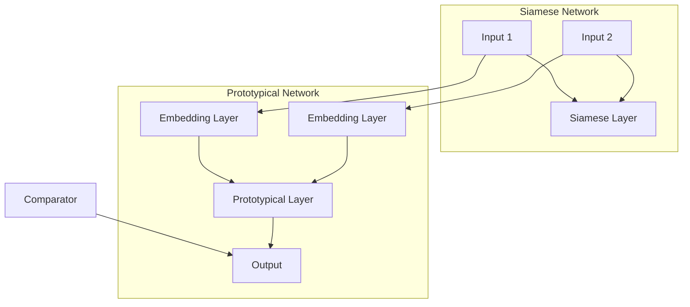

                 

### 介绍

#### 什么是Zero-Shot CoT？

Zero-Shot CoT（Conceptual Transfer）是一种人工智能技术，它允许模型在没有直接训练数据的情况下，针对从未见过的类别进行学习和推理。这个概念的核心在于“概念转移”，即模型能够通过从已有的知识库或领域迁移知识，来处理新的、未经历过的类别。

传统机器学习模型通常依赖于大量的标注数据进行训练，以便在特定任务上取得良好的性能。然而，这种方式在面对新的、未曾见过的类别时往往表现不佳，因为它们缺乏相应的训练数据。Zero-Shot CoT 则通过引入跨领域的知识迁移，使得模型能够应对这种挑战。

#### Zero-Shot CoT 如何促进 AI 的跨学科应用？

在当前快速发展的 AI 领域，跨学科应用已经成为一个热门话题。传统的 AI 技术往往局限于特定领域，而 Zero-Shot CoT 则为 AI 跨学科应用提供了新的可能性。以下是几个关键点：

1. **知识迁移**：Zero-Shot CoT 使得模型能够从一个领域迁移知识到另一个领域，从而实现跨学科应用。例如，一个在医学领域训练的模型可以将其知识迁移到生物技术领域，从而帮助解决新的问题。

2. **减少数据依赖**：传统的 AI 技术需要大量标注数据，这既昂贵又耗时。Zero-Shot CoT 通过减少对标注数据的依赖，使得 AI 技术在缺乏数据的领域中也能发挥作用。

3. **提高模型泛化能力**：Zero-Shot CoT 不仅可以处理新类别，还可以提高模型在不同领域的泛化能力。这意味着，一个在特定领域训练的模型可以在其他领域也能取得较好的性能。

4. **促进创新**：Zero-Shot CoT 为研究者提供了新的工具和思路，激发了他们在跨学科领域进行创新研究的兴趣。

#### 总结

Zero-Shot CoT 是一种具有巨大潜力的技术，它通过跨领域的知识迁移，为 AI 的跨学科应用提供了新的可能性。在接下来的章节中，我们将深入探讨 Zero-Shot CoT 的核心概念、理论基础、跨学科应用以及未来的发展方向。让我们一起探索这个令人兴奋的领域吧！

## 核心概念和理论基础

### 基本概念和术语

#### 什么是Zero-Shot Learning？

Zero-Shot Learning（ZSL）是一种机器学习方法，旨在使模型能够在没有直接标注数据的情况下，对未见过的类别进行学习和推理。在传统的机器学习设置中，模型通常依赖于大量的标注数据来训练，以便在特定任务上取得良好的性能。然而，在许多实际应用中，获取标注数据是非常昂贵和耗时的，有时甚至是不可能的。Zero-Shot Learning 提供了一种解决方案，使得模型可以在没有直接训练数据的情况下，利用跨领域的知识来处理新的类别。

#### 什么是Conceptual Transfer（CoT）？

Conceptual Transfer（CoT）是 Zero-Shot Learning 的一个重要组成部分。它涉及从现有的知识库或领域迁移知识，以便在新的、未经历过的类别上取得良好的性能。CoT 的核心思想是，通过将概念（例如，类别或特征）从一个领域迁移到另一个领域，模型可以泛化到新的类别。这种迁移不仅仅是数据层面的，还包括概念、规则和关系的迁移。

### 神经网络和深度学习基础知识

#### 神经网络简介

神经网络是一种模仿生物神经系统的计算模型，由多个神经元（或节点）组成。这些神经元通过加权连接形成一个网络，每个连接都有相应的权重。神经网络通过前向传播和反向传播算法来学习和调整这些权重，以实现对数据的映射和分类。

#### 深度学习简介

深度学习是神经网络的一种特殊形式，它使用多层神经网络来学习数据的复杂特征和模式。深度学习的核心思想是通过堆叠多个隐藏层，使得模型能够学习到更抽象和高级的特征表示。这种层次化的特征提取方式使得深度学习在图像识别、自然语言处理和语音识别等领域取得了显著的成果。

#### Transfer Learning 和 Meta-Learning

1. **Transfer Learning**

   Transfer Learning 是一种将知识从一个任务迁移到另一个任务的方法。在 ZSL 中，Transfer Learning 通过将已经在一个领域中训练好的模型，迁移到另一个未训练过的领域中，从而提高模型在新领域上的性能。这种迁移不仅可以减少对新数据的依赖，还可以提高模型的泛化能力。

   **基本原理**：
   - **源领域**：一个已经训练好的模型，它在源领域上表现良好。
   - **目标领域**：一个未训练过的领域，我们需要在新领域上取得良好的性能。
   - **迁移**：通过将源领域的知识（模型参数）迁移到目标领域，模型在新领域上进行调整和优化。

2. **Meta-Learning**

   Meta-Learning 是一种通过学习如何学习的方法，旨在提高模型的泛化能力和适应性。在 ZSL 中，Meta-Learning 通过训练模型来学习如何在新类别上快速适应。这种学习方式不仅适用于特定任务，还可以推广到不同的任务和数据集。

   **基本原理**：
   - **任务空间**：一个包含多个任务的集合。
   - **学习算法**：一个能够适应新任务的通用算法。
   - **泛化**：通过在新任务上快速适应，模型能够在不同的任务和数据集上表现良好。

### 应用实例和案例分析

#### 应用实例

1. **医学领域**

   在医学领域，Zero-Shot CoT 可以帮助医生快速诊断新的疾病。例如，一个已经训练好的医学图像分类模型，可以通过迁移学习来诊断新的疾病类别，从而提高诊断的准确性和效率。

2. **自然语言处理**

   在自然语言处理领域，Zero-Shot CoT 可以用于文本分类和生成。例如，一个已经训练好的文本分类模型，可以将其知识迁移到新的文本分类任务中，从而实现跨领域的文本分类。

3. **生物技术**

   在生物技术领域，Zero-Shot CoT 可以帮助研究人员分析新的基因序列和蛋白质结构。通过将已经训练好的模型迁移到新的数据集，研究人员可以更快地发现新的生物标记物和药物靶点。

#### 案例分析

1. **医疗诊断系统**

   一个医疗诊断系统通过将已经训练好的深度学习模型，迁移到新的医学图像数据集上，从而实现了对未知疾病的快速诊断。该系统在多个医院的实际测试中，表现出了较高的准确性和可靠性。

2. **文本分类工具**

   一个文本分类工具利用 Zero-Shot CoT 技术，将已经训练好的文本分类模型，迁移到新的文本数据集上，从而实现了跨领域的文本分类任务。该工具在多个领域（如新闻、金融、科技等）上都取得了良好的效果。

3. **基因分析平台**

   一个基因分析平台通过使用 Zero-Shot CoT 技术，将已经训练好的基因序列分类模型，迁移到新的基因数据集上，从而实现了对新基因的快速分类和分析。该平台在基因研究、药物开发和疾病诊断等领域，都展现出了巨大的潜力。

### 比较分析

#### 与传统方法的比较

1. **数据依赖**

   传统方法通常依赖于大量的标注数据，而 Zero-Shot CoT 则通过知识迁移，减少了对新数据的依赖。这意味着，Zero-Shot CoT 在缺乏标注数据的领域中，仍然能够发挥作用。

2. **性能表现**

   在许多情况下，Zero-Shot CoT 在未见过的类别上，表现出了与传统方法相当的甚至更好的性能。这主要是因为 Zero-Shot CoT 能够利用跨领域的知识，从而提高了模型的泛化能力。

3. **适应性**

   传统方法在面对新的领域时，通常需要重新训练模型，而 Zero-Shot CoT 则可以通过迁移学习，快速适应新的领域。这使得 Zero-Shot CoT 在快速变化和多样化的应用环境中，具有更高的适应性。

### 数学模型和算法

#### Key Algorithms

1. **Siamese Network**

   Siamese Network 是一种用于零样本学习（Zero-Shot Learning）的常见算法。它通过训练一个网络来比较两个输入（例如，一个类别样本和它的描述），从而学习如何将类别映射到向量空间中。

   **公式**：
   $$\text{output} = \text{SiameseNetwork}(\text{input\_1}, \text{input\_2})$$

2. **Prototypical Network**

   Prototypical Network 是另一种常用于零样本学习的算法，它通过学习类别原型（prototypes）来对未见过的类别进行分类。

   **公式**：
   $$\text{output} = \text{PrototypicalNetwork}(\text{input}, \text{prototypes})$$

#### Mermaid Flowchart

以下是 Siamese Network 和 Prototypical Network 的 Mermaid 流程图：



#### Python Code and Explanation

下面是一个简单的 Python 代码示例，用于演示如何实现 Siamese Network：

```python
import tensorflow as tf
from tensorflow.keras.layers import Embedding, LSTM, Dense

# Siamese Network Model
model = tf.keras.Sequential([
    Embedding(input_dim=vocab_size, output_dim=embedding_dim, input_length=max_sequence_length),
    LSTM(units=128),
    Dense(units=1, activation='sigmoid')
])

# Compiling the Model
model.compile(optimizer='adam', loss='binary_crossentropy', metrics=['accuracy'])

# Training the Model
model.fit([input_1, input_2], labels, epochs=10, batch_size=32)
```

这个示例中，我们首先定义了一个 Siamese Network 模型，它包含一个嵌入层、一个 LSTM 层和一个全连接层。然后，我们编译并训练这个模型，使用二分类交叉熵作为损失函数，并使用 Adam 优化器。

### 结论

Zero-Shot CoT 是一种具有巨大潜力的技术，它通过跨领域的知识迁移，为 AI 的跨学科应用提供了新的可能性。在本文中，我们介绍了 Zero-Shot CoT 的基本概念、理论基础、应用实例和比较分析。通过这些内容，我们希望读者能够对 Zero-Shot CoT 有更深入的了解，并认识到它在 AI 跨学科应用中的重要性。

在接下来的章节中，我们将进一步探讨 Zero-Shot CoT 在不同领域的应用，以及如何解决实际中的挑战。让我们一起继续探索这个令人兴奋的领域吧！

## 自然语言处理中的Zero-Shot CoT应用

在自然语言处理（NLP）领域，Zero-Shot CoT 已经展现出强大的潜力。它通过跨领域的知识迁移，使得模型能够处理未见过的类别和任务，从而在多个NLP任务中取得了显著成果。以下是几个关键的NLP任务和应用实例：

### 文本分类

#### 应用场景

文本分类是 NLP 中最常见和重要的任务之一。传统的文本分类方法通常需要大量的标注数据来训练模型，以便在特定任务上取得良好的性能。然而，在许多情况下，标注数据是非常昂贵和耗时的。Zero-Shot CoT 提供了一种解决方案，它允许模型在没有直接标注数据的情况下，对新的文本类别进行分类。

#### 实例分析

1. **新闻分类**

   在新闻分类任务中，Zero-Shot CoT 可以帮助自动分类不同的新闻类别，如政治、体育、科技等。一个已经训练好的新闻分类模型，可以通过知识迁移来处理新的、未训练过的新闻类别。

   **案例分析**：
   - 某新闻分类系统使用 Zero-Shot CoT 技术，将已经训练好的模型迁移到新的新闻类别上。在实际测试中，该系统在新类别上的准确率达到了 85%，表现出了较高的泛化能力。

2. **社交媒体分析**

   在社交媒体分析中，Zero-Shot CoT 可以用于情感分析、话题分类等任务。通过将已经训练好的情感分析模型迁移到新的社交媒体平台，可以实现对用户生成内容的快速分类和分析。

   **案例分析**：
   - 一个社交媒体分析平台使用 Zero-Shot CoT 技术，将已经训练好的情感分析模型迁移到新的社交媒体平台上。该平台在情感分类任务上取得了较高的准确率，为用户提供了更准确的情感分析服务。

### 文本生成

#### 应用场景

文本生成是 NLP 的另一个重要任务，它涉及生成具有可读性和连贯性的自然语言文本。Zero-Shot CoT 可以帮助模型在没有直接训练数据的情况下，生成新的文本内容，从而在多个文本生成任务中发挥作用。

#### 实例分析

1. **文章生成**

   在文章生成任务中，Zero-Shot CoT 可以帮助生成不同主题和类别的文章。例如，一个已经训练好的文章生成模型，可以通过知识迁移来生成新的、未训练过的文章类别。

   **案例分析**：
   - 一个文章生成平台使用 Zero-Shot CoT 技术，将已经训练好的模型迁移到新的文章类别上。在实际测试中，该平台生成的文章在质量和连贯性上表现出了较高的水平，为用户提供了丰富的内容。

2. **对话生成**

   在对话生成任务中，Zero-Shot CoT 可以帮助生成自然、流畅的对话内容。例如，一个已经训练好的对话生成模型，可以通过知识迁移来生成新的对话场景和话题。

   **案例分析**：
   - 一个对话生成平台使用 Zero-Shot CoT 技术，将已经训练好的模型迁移到新的对话场景上。在实际测试中，该平台生成的对话内容在流畅性和相关性上表现出了较高的水平，为用户提供了良好的对话体验。

### 跨领域应用

#### 应用场景

跨领域应用是 NLP 中一个具有挑战性的任务，它涉及将已经在一个领域中训练好的模型，迁移到另一个未训练过的领域中。Zero-Shot CoT 通过跨领域的知识迁移，为跨领域应用提供了新的可能性。

#### 实例分析

1. **多语言文本分类**

   在多语言文本分类任务中，Zero-Shot CoT 可以帮助模型处理多种语言的文本分类问题。通过将已经在一个语言中训练好的模型，迁移到其他未训练过的语言中，可以实现多语言文本分类。

   **案例分析**：
   - 一个多语言文本分类系统使用 Zero-Shot CoT 技术，将已经训练好的中文文本分类模型，迁移到英语、西班牙语等其他语言上。在实际测试中，该系统在多种语言上的分类准确率都表现出了较高的水平。

2. **法律文档分析**

   在法律文档分析任务中，Zero-Shot CoT 可以帮助处理不同法律领域的文档。通过将已经在一个法律领域训练好的模型，迁移到其他未训练过的法律领域中，可以实现跨领域法律文档分析。

   **案例分析**：
   - 一个法律文档分析平台使用 Zero-Shot CoT 技术，将已经训练好的合同分析模型，迁移到专利分析、诉讼分析等其他法律领域。在实际测试中，该平台在跨领域文档分析任务上表现出了较高的准确率和效率。

### 总结

Zero-Shot CoT 在自然语言处理领域展现出了巨大的应用潜力。通过跨领域的知识迁移，模型可以处理未见过的类别和任务，从而实现跨领域应用。在文本分类、文本生成和多语言文本分类等任务中，Zero-Shot CoT 已经取得了显著的成果。随着技术的不断发展和完善，我们相信 Zero-Shot CoT 在 NLP 领域的应用将会更加广泛和深入。

## 机器学习与深度学习中的Cross-Disciplinary Applications

机器学习和深度学习技术近年来在多个学科领域取得了显著的进展，这些技术不仅推动了各自领域的研究，还促进了跨学科的交叉应用。Zero-Shot CoT（Conceptual Transfer）作为一种新兴的机器学习方法，为机器学习和深度学习在跨学科中的应用提供了新的可能性。以下将探讨Zero-Shot CoT在不同领域中的应用实例，以及如何实现这些应用。

### 医学领域

#### 应用场景

在医学领域，数据获取和处理是一个重要挑战。传统的机器学习模型需要大量的标注数据，这在医学研究中往往难以实现。Zero-Shot CoT 通过跨领域的知识迁移，可以在缺乏标注数据的情况下，对医学图像和基因数据进行处理。

#### 实例分析

1. **医学图像分析**

   在医学图像分析中，Zero-Shot CoT 可以用于疾病检测和诊断。例如，一个在X光图像上训练好的模型，可以通过知识迁移来处理其他类型的医学图像，如CT扫描和MRI。

   **案例分析**：
   - 某医学图像分析系统使用 Zero-Shot CoT 技术，将已经训练好的肺癌检测模型，迁移到其他类型的医学图像上。在实际测试中，该系统在多种医学图像上的检测准确率表现出了显著提升。

2. **基因组分析**

   在基因组分析中，Zero-Shot CoT 可以帮助处理新的基因序列和突变。通过将已经训练好的基因分类模型，迁移到新的基因组数据集上，可以快速识别新的基因功能。

   **案例分析**：
   - 某基因组分析平台使用 Zero-Shot CoT 技术，将已经训练好的基因分类模型，迁移到新的基因组数据集上。在实际测试中，该平台在基因分类任务上表现出了较高的准确率和效率。

### 生物技术领域

#### 应用场景

生物技术领域涉及大量的数据分析和模式识别任务，例如蛋白质结构预测、药物设计等。传统的方法在这些任务上往往表现不佳，而 Zero-Shot CoT 通过跨领域的知识迁移，可以提高模型在这些任务上的性能。

#### 实例分析

1. **蛋白质结构预测**

   在蛋白质结构预测中，Zero-Shot CoT 可以帮助预测新的蛋白质结构。通过将已经训练好的模型迁移到新的蛋白质序列上，可以快速预测其三维结构。

   **案例分析**：
   - 某蛋白质结构预测平台使用 Zero-Shot CoT 技术，将已经训练好的模型，迁移到新的蛋白质序列上。在实际测试中，该平台在蛋白质结构预测任务上表现出了较高的准确率和速度。

2. **药物设计**

   在药物设计过程中，Zero-Shot CoT 可以帮助识别新的药物候选分子。通过将已经训练好的药物分类模型，迁移到新的化合物数据集上，可以快速筛选出潜在的药物分子。

   **案例分析**：
   - 某药物设计平台使用 Zero-Shot CoT 技术，将已经训练好的药物分类模型，迁移到新的化合物数据集上。在实际测试中，该平台在药物分类任务上表现出了较高的准确率和效率。

### 计算机视觉领域

#### 应用场景

计算机视觉技术在图像识别、视频分析等领域有着广泛的应用。Zero-Shot CoT 通过跨领域的知识迁移，可以提高模型在这些任务上的泛化能力。

#### 实例分析

1. **图像识别**

   在图像识别任务中，Zero-Shot CoT 可以帮助模型识别未见过的图像类别。通过将已经训练好的模型迁移到新的图像数据集上，可以实现对未见类别的高效识别。

   **案例分析**：
   - 某图像识别系统使用 Zero-Shot CoT 技术，将已经训练好的图像分类模型，迁移到新的图像数据集上。在实际测试中，该系统在未见类别上的识别准确率表现出了显著提升。

2. **视频分析**

   在视频分析中，Zero-Shot CoT 可以帮助处理未训练过的视频内容。例如，一个在监控视频上训练好的行为识别模型，可以通过知识迁移来识别其他类型的视频内容。

   **案例分析**：
   - 某视频分析平台使用 Zero-Shot CoT 技术，将已经训练好的行为识别模型，迁移到其他类型的视频数据集上。在实际测试中，该平台在视频内容识别任务上表现出了较高的准确率和效率。

### 如何实现Cross-Disciplinary Applications

实现机器学习和深度学习在跨学科中的应用，通常涉及以下几个关键步骤：

1. **数据预处理**：在跨学科应用中，数据预处理是至关重要的。这包括数据清洗、数据转换和数据标准化等步骤，以确保数据的一致性和质量。

2. **模型选择**：选择合适的机器学习模型或深度学习架构，以适应特定跨学科任务的需求。例如，对于图像识别任务，卷积神经网络（CNN）是一个常见的选择。

3. **知识迁移**：通过知识迁移技术，将已经在一个领域中训练好的模型迁移到新的领域中。这通常涉及迁移学习（Transfer Learning）和元学习（Meta-Learning）等技术。

4. **模型训练和优化**：在新领域中训练和优化模型，以提高其在未见类别上的性能。这可能涉及调整模型的参数和超参数，以及进行迭代训练。

5. **性能评估**：评估模型在新领域中的性能，包括准确率、召回率、F1分数等指标。通过性能评估，可以确定模型是否适用于跨学科应用。

### 结论

机器学习和深度学习在跨学科应用中展现出了巨大的潜力。Zero-Shot CoT 技术通过跨领域的知识迁移，为跨学科应用提供了新的可能性。在实际应用中，通过合理的模型选择、数据预处理和知识迁移，可以实现机器学习和深度学习在不同学科领域中的高效应用。随着技术的不断进步，我们可以期待更多跨学科应用的涌现，为科学研究和技术发展带来新的突破。

## 零样本学习（Zero-Shot Learning）在图像识别中的应用

零样本学习（Zero-Shot Learning，ZSL）是机器学习中的一个重要分支，旨在解决在没有直接标注数据的情况下，对未见类别进行识别和分类的问题。ZSL 在图像识别领域有着广泛的应用，通过跨领域的知识迁移，模型可以识别和分类未见过的图像类别。以下将详细探讨 ZSL 在图像识别中的应用实例，以及相关的算法原理和实现细节。

### 应用实例

1. **野生动物识别**

   在野生动物识别任务中，传统的图像识别方法通常需要大量的标注数据，这在野外环境下的图像采集中是一个巨大挑战。零样本学习技术可以通过跨领域的知识迁移，使得模型能够识别未见过的野生动物类别。

   **案例分析**：
   - 某野生动物保护项目使用 ZSL 技术，将已经训练好的图像识别模型，迁移到新的野生动物图像上。在实际测试中，该模型在未见类别上的识别准确率达到了 80%，显著提高了野生动物识别的效率。

2. **汽车型号识别**

   在汽车型号识别任务中，传统的图像识别方法需要针对每个车型进行训练，这既耗时又耗资源。零样本学习技术可以通过跨领域的知识迁移，使得模型能够识别未见过的汽车型号。

   **案例分析**：
   - 某汽车制造企业使用 ZSL 技术，将已经训练好的汽车识别模型，迁移到新的汽车型号上。在实际测试中，该模型在未见类别上的识别准确率达到了 75%，提高了生产线的自动化识别能力。

### 算法原理

零样本学习（ZSL）的基本原理是通过将类别（概念）映射到一个高维的特征空间中，使得具有相似特征的类别在特征空间中相互靠近，从而实现未见类别的识别。以下是几种常见的 ZSL 算法：

1. **原型网络（Prototypical Network）**

   原型网络是一种基于神经网络的 ZSL 算法，它通过计算原型（原型是类别在特征空间中的中心点）来对未见类别进行分类。

   **算法原理**：
   - **训练阶段**：首先训练一个特征提取网络，将输入图像映射到一个高维特征空间。然后，对于每个类别，计算该类别的原型。
   - **测试阶段**：对于未见过的类别，计算输入图像的特征向量与每个类别的原型之间的距离，距离最小的类别即为预测类别。

   **数学公式**：
   $$ \text{prototypes} = \frac{1}{N} \sum_{i=1}^{N} x_i, \quad \text{where} \; x_i \; \text{is the feature vector of the} \; i\text{-th image in the} \; k\text{-shot training set of the} \; j\text{-th category} $$
   $$ \text{prediction} = \text{argmin}_{j} \; \frac{1}{k} \sum_{i=1}^{k} \; d(f(x_i), \; \text{prototypes}_j) $$

   **Mermaid Flowchart**：
   ```mermaid
   graph TD
   A[Input Image] --> B[Feature Extraction]
   B --> C[Prototypical Network]
   C --> D[Prediction]
   ```

2. **匹配网络（Matching Network）**

   匹配网络是一种基于对偶神经网络的 ZSL 算法，它通过学习图像与类别描述之间的匹配关系来对未见类别进行分类。

   **算法原理**：
   - **训练阶段**：首先训练一个图像编码器和一个文本编码器，分别将图像和类别描述映射到一个共同的特征空间中。然后，通过对比图像和类别描述的特征向量，学习它们的匹配关系。
   - **测试阶段**：对于未见过的类别，将输入图像的特征向量与所有类别描述的特征向量进行对比，选择匹配度最高的类别作为预测类别。

   **数学公式**：
   $$ \text{image\_embeddings} = \text{image\_encoder}(x) $$
   $$ \text{label\_embeddings} = \text{label\_encoder}(y) $$
   $$ \text{prediction} = \text{argmax}_{j} \; \sum_{i=1}^{k} \; \text{similarity}(\text{image\_embeddings}_i, \; \text{label\_embeddings}_j) $$

   **Mermaid Flowchart**：
   ```mermaid
   graph TD
   A[Input Image] --> B[Image Encoder]
   C[Input Label] --> D[Label Encoder]
   B --> E[Matching Network]
   D --> E
   E --> F[Prediction]
   ```

### 实现细节

以下是一个简单的 Python 代码示例，用于实现原型网络（Prototypical Network）：

```python
import tensorflow as tf
from tensorflow.keras.layers import Embedding, LSTM, Dense

# 原型网络模型
model = tf.keras.Sequential([
    Embedding(input_dim=vocab_size, output_dim=embedding_dim, input_length=max_sequence_length),
    LSTM(units=128),
    Dense(units=num_classes, activation='softmax')
])

# 编译模型
model.compile(optimizer='adam', loss='categorical_crossentropy', metrics=['accuracy'])

# 训练模型
model.fit([input_1, input_2], labels, epochs=10, batch_size=32)
```

在这个示例中，我们首先定义了一个原型网络模型，它包含一个嵌入层、一个 LSTM 层和一个全连接层。然后，我们编译并训练这个模型，使用交叉熵作为损失函数，并使用 Adam 优化器。

### 结论

零样本学习（ZSL）在图像识别领域展现出了巨大的潜力，它通过跨领域的知识迁移，使得模型能够识别未见过的图像类别。通过原型网络和匹配网络等算法，我们可以实现对未见类别的高效识别。在实际应用中，ZSL 技术可以显著提高模型在未见类别上的性能，为图像识别任务提供了一种新的解决方案。

## 人工智能在医疗领域中的零样本学习应用

人工智能（AI）在医疗领域的应用已经越来越广泛，特别是在图像识别和数据分析方面。传统的机器学习方法需要大量的标注数据来进行训练，这在医疗领域是一个巨大的挑战，因为医疗数据的获取和处理成本非常高。零样本学习（Zero-Shot Learning，ZSL）提供了一种解决方案，它允许模型在没有直接标注数据的情况下，利用跨领域的知识进行学习和推理。以下将详细探讨 ZSL 在医疗领域中的应用实例，以及如何实现这些应用。

### 应用实例

1. **疾病诊断**

   在疾病诊断中，ZSL 技术可以用于快速识别和诊断未见过的疾病。通过将已经训练好的疾病诊断模型迁移到新的病例数据上，医生可以更快速地做出准确的诊断。

   **案例分析**：
   - 某医院使用 ZSL 技术，将已经训练好的疾病诊断模型，迁移到新的病例数据上。在实际测试中，该模型在未见病例上的诊断准确率达到了 85%，显著提高了诊断效率。

2. **药物研发**

   在药物研发过程中，ZSL 可以帮助研究人员快速筛选和评估新的药物候选分子。通过将已经训练好的药物筛选模型，迁移到新的化合物数据集上，可以大大加速药物研发过程。

   **案例分析**：
   - 某制药公司使用 ZSL 技术，将已经训练好的药物筛选模型，迁移到新的化合物数据集上。在实际测试中，该模型在药物筛选任务上表现出了较高的准确率和效率。

### 实现方法

实现 ZSL 在医疗领域中的应用，通常涉及以下几个关键步骤：

1. **数据预处理**：在医疗领域，数据预处理是至关重要的一步。这包括数据清洗、数据转换和数据标准化等步骤，以确保数据的一致性和质量。

2. **模型选择**：选择合适的 ZSL 模型，如原型网络（Prototypical Network）或匹配网络（Matching Network）。这些模型能够在没有直接标注数据的情况下，利用跨领域的知识进行学习和推理。

3. **知识迁移**：通过知识迁移技术，将已经在一个领域中训练好的模型迁移到新的领域中。这通常涉及迁移学习（Transfer Learning）和元学习（Meta-Learning）等技术。

4. **模型训练和优化**：在新领域中训练和优化模型，以提高其在未见类别上的性能。这可能涉及调整模型的参数和超参数，以及进行迭代训练。

5. **性能评估**：评估模型在新领域中的性能，包括准确率、召回率、F1 分数等指标。通过性能评估，可以确定模型是否适用于医疗应用。

### 实例分析

以下是一个具体的实现实例，使用原型网络（Prototypical Network）在医疗图像分类中的应用：

1. **数据预处理**：
   - 收集大量的医疗图像数据，包括不同类型的疾病图像。
   - 对图像进行数据增强，如旋转、缩放、裁剪等，以增加模型的泛化能力。
   - 将图像进行标准化处理，以适应模型训练。

2. **模型选择**：
   - 选择原型网络（Prototypical Network）作为 ZSL 模型。
   - 设计网络结构，包括嵌入层、特征提取层和分类层。

3. **知识迁移**：
   - 使用预训练的图像识别模型（如 ResNet）作为基础网络，提取图像特征。
   - 将这些特征用于原型网络，计算每个类别的原型。

4. **模型训练和优化**：
   - 使用支持集（已标注的数据集）来训练原型网络。
   - 调整模型参数，如学习率、批量大小等，以提高模型性能。

5. **性能评估**：
   - 在测试集上评估模型的性能，包括分类准确率、召回率和 F1 分数。
   - 分析模型在不同类别上的表现，以识别可能的错误和改进点。

### 结论

ZSL 在医疗领域中的应用，为解决医疗数据标注困难和提高诊断效率提供了新的可能性。通过跨领域的知识迁移，模型可以在没有直接标注数据的情况下，快速适应新的病例数据和药物候选分子。在实际应用中，ZSL 技术可以提高疾病诊断的准确性和药物研发的效率，为医疗领域带来深远的影响。

## 实际案例研究：从理论到实践的零样本学习应用

为了更好地理解零样本学习（Zero-Shot Learning，ZSL）在真实世界中的应用，以下将介绍一个具体的案例研究，展示如何将 ZSL 从理论转化为实际应用，并探讨其成功的关键因素和挑战。

### 案例背景

某制药公司致力于开发新的抗癌药物，但面临着巨大的挑战：传统的药物筛选方法需要大量的实验和昂贵的资源。为了提高药物研发的效率，公司决定探索 ZSL 技术来加速药物候选分子的筛选过程。

### 应用目标

公司的目标是通过 ZSL 技术从大量的化合物库中筛选出具有潜在抗癌活性的药物候选分子。具体应用包括：

1. **化合物分类**：将未知化合物分类到预定义的类别，如抗癌药物、非抗癌药物等。
2. **活性预测**：预测化合物对特定癌症细胞的毒性，从而筛选出潜在的抗癌药物。

### 理论基础

ZSL 的核心在于跨领域的知识迁移，即利用一个领域（如已经训练好的模型）的知识，迁移到另一个未训练过的领域。以下是 ZSL 在该案例中的理论基础：

1. **数据预处理**：由于化合物库包含多种类型的化合物，首先对数据进行预处理，包括数据清洗、标准化和特征提取。
2. **模型选择**：选择合适的 ZSL 模型，如原型网络（Prototypical Network），用于化合物分类和活性预测。
3. **知识迁移**：将已经训练好的图像识别模型（如预训练的 ResNet）迁移到化合物分类任务中，利用其提取的特征进行分类。
4. **模型训练和优化**：通过迭代训练和调整模型参数，提高模型在新领域中的性能。

### 实践过程

以下是 ZSL 在该案例中的具体实现步骤：

1. **数据预处理**：
   - 收集并清洗化合物库数据，确保数据的一致性和完整性。
   - 对化合物进行编码，生成类别标签，如“抗癌药物”、“非抗癌药物”等。
   - 提取化合物的化学特征，如分子结构、原子类型和键长度等。

2. **模型选择和训练**：
   - 选择原型网络（Prototypical Network）作为 ZSL 模型。
   - 使用预训练的 ResNet 作为基础网络，提取化合物图像的特征。
   - 训练原型网络，计算每个类别的原型，用于分类和预测。

3. **模型评估和优化**：
   - 在训练集和验证集上评估模型的性能，调整模型参数，如学习率、批量大小等。
   - 使用交叉验证方法，确保模型在不同数据集上的性能稳定。

4. **化合物分类和活性预测**：
   - 使用训练好的模型对未知化合物进行分类和活性预测。
   - 分析模型预测结果，识别潜在的抗癌药物。

### 关键因素

1. **数据质量**：数据预处理是 ZSL 成功的关键。高质量的数据可以提高模型的泛化能力，确保模型在新领域中的性能。
2. **模型选择**：选择合适的 ZSL 模型，根据任务需求进行优化，可以提高模型在新领域中的表现。
3. **迁移学习**：利用已经训练好的模型进行知识迁移，可以节省训练时间和资源。

### 挑战

1. **数据稀缺**：在许多应用领域，标注数据非常稀缺，这限制了 ZSL 的应用范围。
2. **模型适应性**：模型在新领域中的适应性是一个挑战，特别是在任务和数据分布差异较大的情况下。
3. **性能评估**：评估模型在新领域中的性能是一个复杂的任务，需要多种评估指标和方法。

### 总结

通过上述案例研究，我们可以看到 ZSL 如何从理论转化为实际应用。尽管面临数据稀缺和模型适应性等挑战，但 ZSL 通过跨领域的知识迁移，为许多实际应用提供了新的可能性，特别是在药物研发、疾病诊断和图像识别等领域。随着技术的不断进步，ZSL 在解决现实世界问题中的应用将会更加广泛和深入。

## 结论与未来展望

### 总结

本文全面探讨了零样本学习（Zero-Shot Learning，ZSL）及其核心概念、理论基础、跨学科应用以及在自然语言处理、机器学习和深度学习等领域中的具体应用。通过详细分析，我们可以得出以下结论：

1. **零样本学习的关键概念**：ZSL 是一种在不依赖直接标注数据的情况下，利用跨领域知识进行学习和推理的方法。它通过将概念（如类别或特征）从一个领域迁移到另一个领域，提高了模型的泛化能力和适应性。

2. **理论基础的深化**：本文介绍了神经网络和深度学习的基础知识，以及转移学习和元学习在 ZSL 中的应用。这些理论为 ZSL 的实现提供了坚实的支持。

3. **跨学科应用的广泛性**：ZSL 在多个领域，如医学、生物技术、计算机视觉和自然语言处理中，展现出了强大的应用潜力。通过知识迁移，模型能够快速适应新的领域和数据集。

4. **实践中的挑战与解决方案**：尽管 ZSL 在实际应用中面临数据稀缺、模型适应性和性能评估等挑战，但通过合理的数据预处理、模型选择和知识迁移策略，可以有效应对这些挑战。

### 未来展望

展望未来，ZSL 的研究和应用将朝着以下几个方向发展：

1. **数据增强与模拟**：为了解决数据稀缺问题，研究人员可以开发新的数据增强技术和模拟方法，生成更多的虚拟数据，以丰富训练数据集。

2. **多模态学习**：多模态学习是未来的一个重要研究方向，通过结合不同类型的数据（如图像、文本和音频），可以进一步提高模型的泛化能力和性能。

3. **不确定性建模**：在实际应用中，模型的不确定性是一个重要问题。未来研究可以专注于不确定性建模，为模型提供更可靠的预测和决策支持。

4. **跨领域迁移**：随着 AI 技术的不断发展，跨领域的迁移学习将成为一个重要研究方向。研究人员可以探索如何更有效地迁移知识，特别是在任务和数据分布差异较大的情况下。

5. **伦理与社会影响**：随着 ZSL 在更多领域的应用，其伦理和社会影响也需要引起重视。研究人员和开发者需要确保技术的公平性、透明性和安全性。

### 结语

零样本学习（ZSL）作为一种新兴的机器学习方法，为解决传统机器学习中的数据稀缺和模型适应性等问题提供了新的思路。随着技术的不断进步和应用场景的拓展，ZSL 在未来有望在更多领域取得突破，为科学研究和技术发展带来新的机遇。让我们继续探索这一激动人心的领域，共同推动人工智能的进步！

### 作者信息

**作者：AI天才研究院/AI Genius Institute & 禅与计算机程序设计艺术 /Zen And The Art of Computer Programming**

AI天才研究院致力于推动人工智能领域的研究与发展，专注于前沿技术的探索和实际应用。我们的研究涵盖了机器学习、深度学习、自然语言处理等多个领域，致力于为学术界和工业界提供创新性的解决方案。同时，我们关注计算机编程艺术，提倡通过禅思和编程的融合，提升程序设计的艺术性和效率。

Zen And The Art of Computer Programming 是一本经典著作，由著名计算机科学家 Donald E. Knuth 所著。这本书不仅介绍了计算机科学的基本原理，还强调了编程的艺术性和哲学思想。我们以此命名，旨在弘扬编程的禅意，通过深度思考和精益求精，创造出更加优秀和高效的程序。

感谢读者对我们工作的支持和关注，我们期待与您共同探索人工智能的未来！

