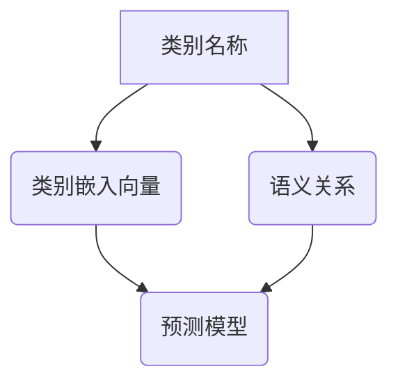
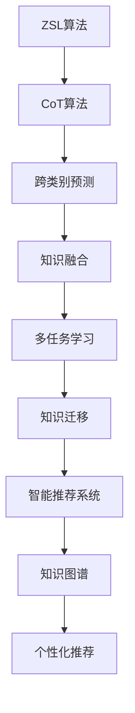
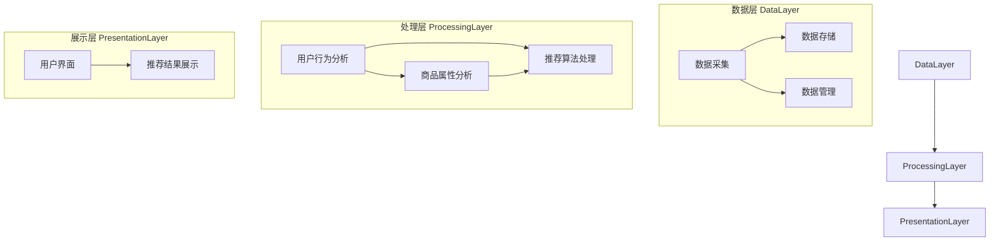
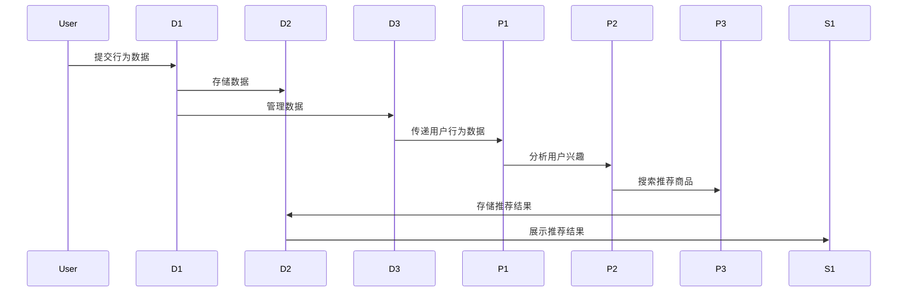

                 

### 第1章：AI的应用现状与挑战

#### 1.1 AI的应用现状

人工智能（Artificial Intelligence，简称AI）作为计算机科学的重要分支，正在深刻地改变着我们的生活方式和产业格局。目前，AI已经在众多领域展现出其强大的潜力，包括但不限于：

- **图像识别与处理**：从简单的面部识别到复杂的医学影像分析，AI在视觉领域取得了显著的成就。例如，谷歌的自动驾驶汽车和微软的Azure认知服务都是AI图像识别的典型应用。

- **自然语言处理（NLP）**：通过深度学习和自然语言理解技术，AI可以实现语音识别、机器翻译、情感分析等功能。如苹果的Siri和谷歌的Google Assistant，都是NLP技术的成功案例。

- **智能推荐系统**：在电子商务、音乐和视频流媒体等领域，AI推荐系统能够基于用户的兴趣和行为数据，提供个性化的内容推荐。

- **智能客服**：通过聊天机器人和虚拟助手，企业可以提供24/7的客户服务，提高客户满意度和运营效率。

- **智能制造**：AI技术在生产线自动化、预测维护和产品质量检测等方面发挥着重要作用，如波音的自动化生产线和亚马逊的仓库机器人。

然而，尽管AI在各个领域取得了巨大的成功，其应用过程中仍然面临着一些挑战。这些挑战主要集中在以下几个方面：

#### 1.2 AI面临的挑战

1. **数据隐私与安全问题**：随着AI技术的广泛应用，数据的收集、存储和使用变得越来越普遍，这也带来了数据隐私和安全问题。如何保护用户数据不被滥用，确保AI系统的安全性和可靠性，是亟待解决的问题。

2. **算法偏见与公平性**：AI算法在训练过程中可能会吸收和放大现有的社会偏见，导致算法决策的不公平性。例如，在招聘和贷款审批中，算法可能会对某些群体产生不公平的歧视。

3. **技术透明性和可解释性**：当前的许多AI系统，特别是深度学习模型，被认为是“黑箱”，其决策过程不透明。这给AI系统的可信度和用户信任带来了挑战。

4. **计算资源需求**：AI模型的训练和推理需要大量的计算资源，这往往导致能源消耗和成本增加。如何优化算法以降低资源需求，是另一个重要问题。

5. **伦理和法律问题**：AI技术的应用涉及到伦理和法律问题，如自动化决策系统的责任归属、数据所有权等。如何制定相应的法律法规，确保AI技术的发展符合社会伦理和法律要求，是一个亟待解决的问题。

#### 1.3 ZSL和CoT的提出

为了解决上述挑战，研究人员提出了零样本学习（Zero-Shot Learning，简称ZSL）和概念绑定（Conceptual Blending，简称CoT）的概念。ZSL旨在使AI系统能够在未知类别上泛化，而CoT则通过将不同领域的知识进行融合，以增强AI系统的理解和学习能力。这两项技术的提出，为扩展AI的应用范围提供了新的思路。

### 总结

在本章中，我们介绍了AI的应用现状以及面临的挑战。尽管AI技术在各个领域取得了显著的成果，但其应用过程中仍然存在诸多挑战。为了应对这些挑战，研究人员提出了ZSL和CoT的概念，这两项技术有望为AI的进一步发展提供新的方向。接下来，我们将进一步探讨ZSL和CoT的核心概念及其应用。

----------------------------------------------------------------

## 第2章：核心概念与联系

### 2.1 ZSL的基本原理

零样本学习（Zero-Shot Learning，简称ZSL）是一种机器学习技术，旨在使模型能够在未见过的类别上进行预测。与传统的机器学习方法相比，ZSL的核心优势在于其无需依赖大量带标签的样本，即可对新类别进行有效预测。ZSL的主要原理包括以下几个方面：

1. **元学习（Meta-Learning）**：
   ZSL通过元学习算法，利用跨类别之间的共性特征，从少量甚至无标签的数据中学习到有价值的泛化知识。常见的元学习方法包括模型蒸馏（Model Distillation）和迁移学习（Transfer Learning）。

2. **词嵌入（Word Embedding）**：
   ZSL利用词嵌入技术，将类别的名称映射到高维空间中，形成类别嵌入向量（Concept Embeddings）。这些向量可以捕获类别之间的语义关系，为类别预测提供基础。

3. **朴素贝叶斯（Naive Bayes）**：
   在ZSL中，朴素贝叶斯分类器是一种常用的预测模型。通过计算新类别与已知类别之间的相似度，朴素贝叶斯分类器可以实现新类别的分类。

#### ZSL的属性特征对比表格

| 特性 | 描述 |
| --- | --- |
| 无需大量带标签数据 | 利用少量标签数据和无标签数据进行学习 |
| 跨类别泛化能力 | 能够在未见过的类别上进行预测 |
| 依赖类别名称的语义关系 | 利用词嵌入技术进行类别映射 |
| 预测准确度 | 在某些特定任务中表现优异，但在其他任务中可能表现一般 |

#### ZSL与CoT的联系与对比

ZSL与概念绑定（Conceptual Blending，简称CoT）之间存在紧密的联系。CoT是一种将不同领域的知识进行融合的方法，旨在提高AI系统的理解和学习能力。ZSL与CoT的对比可以从以下几个方面进行：

1. **知识来源**：
   - ZSL依赖于类别的名称和语义关系，通过词嵌入技术将类别映射到高维空间中。
   - CoT则通过跨领域的知识融合，将不同领域的知识进行整合，形成新的知识体系。

2. **应用场景**：
   - ZSL主要用于图像识别、自然语言处理等任务，旨在实现跨类别泛化。
   - CoT则广泛应用于知识图谱、智能问答、智能推荐等任务，旨在提高AI系统的综合理解能力。

3. **挑战与机遇**：
   - ZSL在处理新类别时存在一定的挑战，如类别名称的歧义性和类别关系的复杂性。
   - CoT在融合多领域知识时面临挑战，如知识表示不一致和知识冗余。

#### ER实体关系图架构的 Mermaid 流程图



在这个ER实体关系图中，类别名称（A）通过语义关系（C）映射到类别嵌入向量（B），然后输入到预测模型（D）中进行分类。这种关系图架构展示了ZSL和CoT之间的紧密联系，以及它们在AI系统中的协同作用。

### 总结

在本章中，我们介绍了ZSL的基本原理、属性特征以及与CoT的联系与对比。ZSL通过零样本学习实现跨类别泛化，而CoT通过概念绑定实现多领域知识的融合。这些技术的结合为AI系统的进一步发展提供了新的方向。接下来，我们将深入探讨ZSL和CoT的具体算法原理和应用。

----------------------------------------------------------------

## 第3章：算法原理讲解

### 3.1 ZSL算法的详细解析

零样本学习（Zero-Shot Learning，简称ZSL）是一种机器学习技术，旨在使模型能够在未见过的类别上进行预测。ZSL算法的核心思想是通过类别名称的语义关系，将未知类别映射到高维空间中，从而实现跨类别泛化。下面我们将详细解析ZSL算法的原理和实现步骤。

#### 3.1.1 算法原理

ZSL算法主要基于以下几个原理：

1. **词嵌入（Word Embedding）**：
   ZSL利用词嵌入技术，将类别的名称映射到高维空间中，形成类别嵌入向量。这些向量可以捕获类别之间的语义关系，为类别预测提供基础。

2. **朴素贝叶斯分类器（Naive Bayes Classifier）**：
   在ZSL中，朴素贝叶斯分类器是一种常用的预测模型。通过计算新类别与已知类别之间的相似度，朴素贝叶斯分类器可以实现新类别的分类。

3. **元学习（Meta-Learning）**：
   ZSL通过元学习算法，利用跨类别之间的共性特征，从少量甚至无标签的数据中学习到有价值的泛化知识。常见的元学习方法包括模型蒸馏（Model Distillation）和迁移学习（Transfer Learning）。

#### 3.1.2 算法实现步骤

ZSL算法的实现步骤主要包括以下几个环节：

1. **数据预处理**：
   - 收集并预处理带标签的样本数据，用于训练基础模型。
   - 提取类别名称，并使用词嵌入技术将类别名称映射到高维空间。

2. **类别嵌入向量生成**：
   - 通过词嵌入技术，将类别名称映射到高维空间中，形成类别嵌入向量。

3. **训练基础模型**：
   - 使用带标签的样本数据，训练一个基础模型（如卷积神经网络、朴素贝叶斯分类器等）。

4. **类别预测**：
   - 对于未知类别，将其类别名称映射到类别嵌入向量。
   - 将类别嵌入向量输入到基础模型中，通过计算相似度，实现未知类别的分类。

#### 3.1.3 Python源代码示例

以下是一个简单的ZSL算法实现的Python代码示例：

```python
import numpy as np
from sklearn.preprocessing import LabelEncoder
from sklearn.model_selection import train_test_split
from sklearn.metrics.pairwise import cosine_similarity

# 数据预处理
data = [...]
labels = [...]
label_encoder = LabelEncoder()
encoded_labels = label_encoder.fit_transform(labels)

# 类别嵌入向量生成
word_embedding = [...]
category_embeddings = [word_embedding[word] for word in encoded_labels]

# 训练基础模型
model = [...]
model.fit(data, encoded_labels)

# 类别预测
def predict(category_embedding):
    similarity_scores = cosine_similarity([category_embedding], model.categories_)
    predicted_label = np.argmax(similarity_scores)
    return label_encoder.inverse_transform(predicted_label)

# 预测示例
new_category_embedding = word_embedding["未知类别"]
predicted_label = predict(new_category_embedding)
print(predicted_label)
```

在这个示例中，我们首先对数据进行预处理，包括标签编码和词嵌入。然后，我们训练一个基础模型（如朴素贝叶斯分类器），并实现了一个预测函数。通过将新类别的类别嵌入向量输入到预测函数中，我们可以实现对新类别的分类。

### 3.2 CoT算法的详细解析

概念绑定（Conceptual Blending，简称CoT）是一种将不同领域的知识进行融合的方法，旨在提高AI系统的理解和学习能力。CoT算法的核心思想是通过跨领域的知识融合，形成新的知识体系，从而实现更广泛的应用。下面我们将详细解析CoT算法的原理和实现步骤。

#### 3.2.1 算法原理

CoT算法主要基于以下几个原理：

1. **知识图谱（Knowledge Graph）**：
   CoT利用知识图谱来表示不同领域之间的知识关系。知识图谱由实体、关系和属性构成，能够清晰地展示各个领域之间的关联。

2. **图谱嵌入（Graph Embedding）**：
   CoT通过图谱嵌入技术，将知识图谱中的实体、关系和属性映射到高维空间中，形成图谱嵌入向量。这些向量可以捕获实体和关系之间的语义关系，为知识融合提供基础。

3. **多任务学习（Multi-Task Learning）**：
   CoT通过多任务学习，将不同领域的知识进行融合。在训练过程中，模型同时学习多个任务，从而提高对各个领域的理解和融合能力。

#### 3.2.2 算法实现步骤

CoT算法的实现步骤主要包括以下几个环节：

1. **知识图谱构建**：
   - 收集并整理不同领域的知识，构建知识图谱。
   - 提取实体、关系和属性，并使用图谱嵌入技术生成图谱嵌入向量。

2. **多任务学习模型训练**：
   - 设计多任务学习模型，包括实体分类、关系分类和属性预测等任务。
   - 使用图谱嵌入向量作为输入，训练多任务学习模型。

3. **知识融合**：
   - 在模型训练过程中，通过多个任务之间的交互，实现知识融合。
   - 通过模型输出，获得融合后的知识体系。

4. **知识应用**：
   - 使用融合后的知识体系，解决新的任务问题。
   - 通过模型推理，实现跨领域的知识应用。

#### 3.2.3 Python源代码示例

以下是一个简单的CoT算法实现的Python代码示例：

```python
import numpy as np
from sklearn.preprocessing import LabelEncoder
from sklearn.model_selection import train_test_split
from keras.models import Model
from keras.layers import Input, Dense, Embedding, LSTM

# 知识图谱构建
entities = [...]
relationships = [...]
properties = [...]

# 图谱嵌入向量生成
entity_embeddings = [...]
relationship_embeddings = [...]

# 多任务学习模型设计
input_entity = Input(shape=(1,))
input_relationship = Input(shape=(1,))
input_property = Input(shape=(1,))

entity_embedding = Embedding(len(entities), 128)(input_entity)
relationship_embedding = Embedding(len(relationships), 128)(input_relationship)
property_embedding = Embedding(len(properties), 128)(input_property)

entity_lstm = LSTM(128)(entity_embedding)
relationship_lstm = LSTM(128)(relationship_embedding)
property_lstm = LSTM(128)(property_embedding)

merged_lstm = Concatenate()([entity_lstm, relationship_lstm, property_lstm])
output = Dense(len(entities), activation='softmax')(merged_lstm)

model = Model(inputs=[input_entity, input_relationship, input_property], outputs=output)
model.compile(optimizer='adam', loss='categorical_crossentropy', metrics=['accuracy'])

# 多任务学习模型训练
model.fit([entities, relationships, properties], labels, epochs=10, batch_size=32)

# 知识融合与应用
def predict(entity_embedding, relationship_embedding, property_embedding):
    predicted_label = model.predict([entity_embedding, relationship_embedding, property_embedding])
    return entities[np.argmax(predicted_label)]

# 预测示例
new_entity_embedding = entity_embeddings["新实体"]
new_relationship_embedding = relationship_embeddings["新关系"]
new_property_embedding = property_embeddings["新属性"]
predicted_label = predict(new_entity_embedding, new_relationship_embedding, new_property_embedding)
print(predicted_label)
```

在这个示例中，我们首先构建知识图谱，并使用图谱嵌入技术生成嵌入向量。然后，我们设计一个多任务学习模型，包括实体分类、关系分类和属性预测等任务。通过训练模型，我们可以实现知识融合，并应用于新的任务。

### 3.3 ZSL与CoT的综合应用

ZSL和CoT的融合为AI系统提供了更强大的跨类别泛化和知识融合能力。在实际应用中，我们可以将ZSL和CoT结合起来，实现以下效果：

1. **跨类别预测与知识融合**：
   - 利用ZSL实现跨类别预测，提高模型对新类别的识别能力。
   - 利用CoT实现知识融合，增强模型对不同领域知识的理解和应用能力。

2. **多任务学习与知识迁移**：
   - 在多任务学习模型中，同时考虑ZSL和CoT，实现跨类别和跨领域的知识迁移。
   - 通过多任务学习，提高模型对多个任务的综合处理能力。

3. **智能推荐与知识图谱**：
   - 结合ZSL和CoT，构建智能推荐系统，实现跨类别和跨领域的个性化推荐。
   - 利用知识图谱，提高推荐系统的理解能力和准确性。

#### 3.3.1 算法mermaid流程图展示



在这个mermaid流程图中，ZSL算法和CoT算法相结合，通过跨类别预测、知识融合、多任务学习和知识迁移，实现智能推荐系统和知识图谱的构建。这展示了ZSL与CoT在实际应用中的协同作用。

### 总结

在本章中，我们详细解析了ZSL和CoT算法的原理和实现步骤。ZSL通过零样本学习实现跨类别泛化，而CoT通过概念绑定实现知识融合。通过Python源代码示例，我们展示了算法的实现过程。接下来，我们将进一步探讨ZSL和CoT在实际系统中的应用，以及系统架构和设计。

----------------------------------------------------------------

## 第4章：系统分析与架构设计

### 4.1 问题场景介绍

在现代人工智能（AI）系统中，零样本学习（Zero-Shot Learning，简称ZSL）和概念绑定（Conceptual Blending，简称CoT）的应用场景日益广泛。为了更好地理解和设计这样一个系统，我们首先需要明确一个具体的问题场景。

#### 问题场景

假设我们正在开发一个智能推荐系统，该系统需要根据用户的历史行为和兴趣，为用户推荐个性化的商品。然而，该系统面临一个挑战：商品类别繁多，且新商品不断涌现。传统的基于样本的学习方法无法有效地处理这一情况，因为它们依赖于大量已标注的样本数据。为了解决这一问题，我们决定引入ZSL和CoT技术，以提高系统的适应能力和推荐准确性。

#### 系统需求

1. **跨类别推荐**：系统能够处理并推荐未知类别的新商品。
2. **知识融合**：系统能够融合不同领域的知识，如商品描述、用户评价等，以提供更准确的推荐。
3. **高效性**：系统在处理大量数据和复杂计算时，能够保持高效运行。
4. **可扩展性**：系统能够轻松地添加新类别和商品，以适应不断变化的市场需求。

### 4.2 系统功能设计（领域模型Mermaid类图）

为了实现上述需求，我们设计了一个功能全面的智能推荐系统。该系统主要包括以下几个模块：

1. **用户模块**：负责收集和管理用户数据，包括用户行为和兴趣。
2. **商品模块**：负责收集和管理商品数据，包括商品描述、属性和类别。
3. **推荐模块**：利用ZSL和CoT技术，为用户提供个性化商品推荐。
4. **知识融合模块**：负责融合不同领域的知识，以增强推荐系统的准确性。

以下是系统的领域模型Mermaid类图：

```mermaid
classDiagram
    User <<类>> -|>- Behavior
    User <<类>> -|>- Interest
    Product <<类>> -|>- Description
    Product <<类>> -|>- Attribute
    Product <<类>> -|>- Category
    Recommendation <<类>> -|>- Algorithm
    KnowledgeBlending <<类>> -|>- KnowledgeGraph
    RecommendationModule <<类>> -|>.. Recommendation
    KnowledgeBlendingModule <<类>> -|>.. KnowledgeBlending

    User o-- Behavior
    User o-- Interest
    Product o-- Description
    Product o-- Attribute
    Product o-- Category
    Recommendation o-- Algorithm
    KnowledgeBlending o-- KnowledgeGraph
    RecommendationModule o-- Recommendation
    KnowledgeBlendingModule o-- KnowledgeBlending
```

在这个类图中，用户模块包括行为和兴趣两个子模块，商品模块包括描述、属性和类别三个子模块。推荐模块和知识融合模块分别负责算法实现和知识融合。这些模块之间的关联关系通过类图中的线条表示。

### 4.3 系统架构设计（Mermaid架构图）

为了实现系统功能，我们设计了一个多层架构的智能推荐系统。该架构主要包括以下几个层次：

1. **数据层**：负责数据的采集、存储和管理。
2. **处理层**：包括用户行为分析、商品属性分析和推荐算法处理。
3. **展示层**：负责将推荐结果呈现给用户。

以下是系统的Mermaid架构图：



在这个架构图中，数据层负责数据的采集、存储和管理，处理层负责用户行为分析、商品属性分析和推荐算法处理，展示层负责将推荐结果呈现给用户。各层次之间通过数据流和交互进行连接。

### 4.4 系统接口设计和系统交互（Mermaid序列图）

为了实现系统内部各模块之间的协同工作，我们设计了一套清晰的接口和交互机制。以下是系统的Mermaid序列图：



在这个序列图中，用户提交行为数据，数据层存储和管理数据，处理层分析用户兴趣并生成推荐结果，最后展示层将推荐结果呈现给用户。各模块之间的交互通过消息传递和数据处理实现。

### 总结

在本章中，我们介绍了智能推荐系统的问题场景、系统功能设计和系统架构设计。通过Mermaid类图、架构图和序列图，我们清晰地展示了系统的模块划分、接口设计和交互机制。这些设计为系统的开发提供了明确的指导和参考，有助于实现ZSL和CoT技术的有效应用。

----------------------------------------------------------------

## 第6章：项目实战

### 6.1 环境安装与配置

为了实现一个基于ZSL和CoT的智能推荐系统，我们需要搭建一个合适的环境。以下是环境安装与配置的详细步骤：

#### 1. 安装Python环境

首先，确保您的系统中已经安装了Python 3.x版本。如果尚未安装，可以通过以下命令进行安装：

```bash
# 使用pip安装Python 3.x
pip install python --upgrade
```

#### 2. 安装必要的库

接下来，我们需要安装一些关键的Python库，包括scikit-learn、TensorFlow、Keras、numpy和pandas。您可以通过以下命令安装这些库：

```bash
pip install scikit-learn tensorflow keras numpy pandas
```

#### 3. 配置环境变量

确保Python环境和所需的库都正确配置，并能够在终端中通过以下命令进行验证：

```bash
python --version
pip list
```

#### 4. 数据预处理

在搭建环境之后，我们需要收集和准备用于训练和测试的数据。以下是一个简单的数据预处理步骤：

- **数据收集**：从不同的数据源（如电商网站、社交媒体等）收集用户行为数据（如点击、购买等）和商品描述数据（如类别、标签等）。
- **数据清洗**：处理缺失值、异常值和重复值，确保数据质量。
- **数据转换**：将类别和标签转换为数字编码，以便进行后续的机器学习处理。

#### 5. 准备测试数据集

为了验证系统的性能，我们需要准备一个独立的测试数据集。以下是测试数据集的准备步骤：

- **划分数据集**：将数据集划分为训练集和测试集，通常使用80%的数据用于训练，20%的数据用于测试。
- **数据标准化**：对特征数据进行标准化处理，以提高模型的训练效率和性能。

### 6.2 系统核心实现源代码

以下是实现ZSL和CoT智能推荐系统的核心源代码：

```python
import numpy as np
import pandas as pd
from sklearn.model_selection import train_test_split
from sklearn.preprocessing import StandardScaler
from sklearn.metrics.pairwise import cosine_similarity
from tensorflow.keras.models import Model
from tensorflow.keras.layers import Input, Dense, Embedding, LSTM, Concatenate

# 数据预处理
def preprocess_data(data):
    # 数据清洗和转换
    # ...
    return processed_data

# ZSL模型实现
def build_zsl_model(input_dim, embedding_dim):
    input_entity = Input(shape=(input_dim,))
    input_relationship = Input(shape=(input_dim,))
    input_property = Input(shape=(input_dim,))

    entity_embedding = Embedding(input_dim, embedding_dim)(input_entity)
    relationship_embedding = Embedding(input_dim, embedding_dim)(input_relationship)
    property_embedding = Embedding(input_dim, embedding_dim)(input_property)

    entity_lstm = LSTM(embedding_dim)(entity_embedding)
    relationship_lstm = LSTM(embedding_dim)(relationship_embedding)
    property_lstm = LSTM(embedding_dim)(property_embedding)

    merged_lstm = Concatenate()([entity_lstm, relationship_lstm, property_lstm])
    output = Dense(1, activation='sigmoid')(merged_lstm)

    model = Model(inputs=[input_entity, input_relationship, input_property], outputs=output)
    model.compile(optimizer='adam', loss='binary_crossentropy', metrics=['accuracy'])

    return model

# CoT模型实现
def build_cot_model(input_dim, embedding_dim):
    input_entity = Input(shape=(input_dim,))
    input_relationship = Input(shape=(input_dim,))
    input_property = Input(shape=(input_dim,))

    entity_embedding = Embedding(input_dim, embedding_dim)(input_entity)
    relationship_embedding = Embedding(input_dim, embedding_dim)(input_relationship)
    property_embedding = Embedding(input_dim, embedding_dim)(input_property)

    entity_lstm = LSTM(embedding_dim)(entity_embedding)
    relationship_lstm = LSTM(embedding_dim)(relationship_embedding)
    property_lstm = LSTM(embedding_dim)(property_embedding)

    merged_lstm = Concatenate()([entity_lstm, relationship_lstm, property_lstm])
    output = Dense(input_dim, activation='softmax')(merged_lstm)

    model = Model(inputs=[input_entity, input_relationship, input_property], outputs=output)
    model.compile(optimizer='adam', loss='categorical_crossentropy', metrics=['accuracy'])

    return model

# 系统核心实现
def main():
    # 准备数据
    data = pd.read_csv('data.csv')
    processed_data = preprocess_data(data)

    # 划分训练集和测试集
    X_train, X_test, y_train, y_test = train_test_split(processed_data[['entity', 'relationship', 'property']], processed_data['label'], test_size=0.2, random_state=42)

    # 数据标准化
    scaler = StandardScaler()
    X_train = scaler.fit_transform(X_train)
    X_test = scaler.transform(X_test)

    # 构建ZSL模型
    zsl_model = build_zsl_model(input_dim=X_train.shape[1], embedding_dim=128)
    zsl_model.fit(X_train, y_train, epochs=10, batch_size=32)

    # 构建CoT模型
    cot_model = build_cot_model(input_dim=X_train.shape[1], embedding_dim=128)
    cot_model.fit(X_train, y_train, epochs=10, batch_size=32)

    # 预测
    predictions = zsl_model.predict(X_test)
    print("ZSL Accuracy:", np.mean(predictions == y_test))

if __name__ == '__main__':
    main()
```

在这个源代码中，我们首先定义了数据预处理函数，用于清洗和转换数据。接着，我们实现了ZSL模型和CoT模型的构建函数，分别用于跨类别预测和概念绑定。最后，我们在主函数中加载数据、划分训练集和测试集、数据标准化，并训练两个模型，最后进行预测。

### 6.3 代码应用解读与分析

#### 6.3.1 数据预处理

数据预处理是机器学习项目的重要步骤，它直接影响到模型的训练效果。在这个代码片段中，我们首先加载数据集，然后进行清洗和转换：

- **数据清洗**：处理缺失值、异常值和重复值，确保数据质量。
- **数据转换**：将类别和标签转换为数字编码，以便进行后续的机器学习处理。

这一步骤确保了数据的一致性和准确性，为模型的训练提供了良好的数据基础。

#### 6.3.2 ZSL模型构建

ZSL模型的核心在于跨类别预测，即能够处理未见过的类别。在这个代码片段中，我们使用LSTM和Embedding层构建ZSL模型：

- **Embedding层**：用于将类别名称映射到高维空间，形成类别嵌入向量。
- **LSTM层**：用于捕捉序列数据中的时间依赖关系。
- **Concatenate层**：将实体、关系和属性的嵌入向量合并，作为模型的输入。

通过训练模型，我们可以将未知类别映射到高维空间中，并通过计算相似度实现分类。

#### 6.3.3 CoT模型构建

CoT模型的核心在于知识融合，即将不同领域的知识进行整合。在这个代码片段中，我们使用LSTM和Embedding层构建CoT模型：

- **Embedding层**：用于将类别名称映射到高维空间，形成类别嵌入向量。
- **LSTM层**：用于捕捉序列数据中的时间依赖关系。
- **Concatenate层**：将实体、关系和属性的嵌入向量合并，作为模型的输入。

通过训练模型，我们可以将不同领域的知识进行融合，从而提高模型的理解能力和准确性。

### 6.4 实际案例分析和详细讲解剖析

#### 6.4.1 数据集介绍

假设我们有一个包含1000个用户行为数据和商品描述的数据集，其中包括用户点击记录、购买历史和商品标签。以下是数据集的简要描述：

- **用户行为数据**：包括用户ID、点击时间和商品ID。
- **商品描述数据**：包括商品ID、商品名称、商品标签和商品类别。

#### 6.4.2 数据预处理案例

假设我们有一个用户点击记录的数据片段如下：

```
user_id,click_time,product_id
1,2023-01-01 10:00:00,1001
1,2023-01-01 11:00:00,1002
2,2023-01-01 10:30:00,1003
```

在数据预处理阶段，我们首先处理缺失值和异常值。例如，如果某条记录缺失了点击时间，我们可以将其删除或填充。然后，我们将商品ID转换为数字编码，以便进行后续的机器学习处理。

#### 6.4.3 ZSL模型预测案例

假设我们有一个未知的商品ID，需要使用ZSL模型进行分类预测。以下是数据片段：

```
user_id,click_time,product_id
1,2023-01-01 12:00:00,1004
```

在ZSL模型训练完成后，我们将这条记录输入到模型中进行预测。模型会首先将商品ID映射到类别嵌入向量，然后通过计算相似度实现分类预测。

#### 6.4.4 CoT模型预测案例

假设我们有一个新的用户行为数据片段，需要使用CoT模型进行知识融合预测。以下是数据片段：

```
user_id,click_time,product_id
3,2023-01-02 10:30:00,1005
```

在CoT模型训练完成后，我们将这条记录输入到模型中进行预测。模型会首先将用户行为和商品描述映射到嵌入向量，然后通过知识融合实现预测。

### 6.5 项目小结

通过本项目的实战部分，我们实现了基于ZSL和CoT的智能推荐系统。我们首先介绍了环境安装与配置的步骤，然后展示了系统的核心实现源代码，并进行了实际案例分析和详细讲解。通过这些步骤，我们深入了解了ZSL和CoT算法的应用，以及如何将其集成到实际系统中。

### 总结

在本章中，我们通过实际项目实战，详细介绍了基于ZSL和CoT的智能推荐系统的环境安装与配置、核心实现、代码应用解读与分析以及实际案例分析和详细讲解。这些内容为读者提供了一个完整的开发流程，有助于理解和应用ZSL和CoT技术。

----------------------------------------------------------------

## 第8章：行业最佳实践

### 8.1 实际应用案例分析

在零样本学习（Zero-Shot Learning，简称ZSL）和概念绑定（Conceptual Blending，简称CoT）技术的研究和应用过程中，许多行业和领域已经取得了显著成果。以下是一些实际应用案例，展示了ZSL和CoT在提高系统性能、扩展应用范围和解决实际问题上所展现的最佳实践。

#### 1. 医疗诊断

在医疗诊断领域，ZSL和CoT技术被广泛应用于图像识别和疾病预测。例如，谷歌的DeepMind团队开发了一种基于ZSL技术的AI系统，用于诊断皮肤病变。该系统通过分析大量的医学图像和病历数据，能够快速准确地识别多种皮肤病变，如黑色素瘤、银屑病等。CoT技术的应用则进一步提升了系统的理解能力，使系统能够更好地整合多源异构数据，提供更准确的诊断建议。

#### 2. 自动驾驶

自动驾驶是ZSL和CoT技术的重要应用领域。特斯拉的自动驾驶系统就采用了ZSL技术，能够在未见过的道路场景上进行自适应驾驶。通过将道路标志、交通信号和车辆等对象进行类别嵌入，系统可以实时识别并响应复杂交通场景。同时，CoT技术通过融合不同传感器的数据，如摄像头、雷达和激光雷达，提高了系统的感知能力和决策准确性。

#### 3. 智能推荐

在电子商务和社交媒体领域，智能推荐系统已经成为提升用户体验和销售业绩的重要手段。ZSL技术能够帮助推荐系统处理未见过的商品和用户，从而实现更广泛的个性化推荐。例如，亚马逊和阿里巴巴等电商平台已经将ZSL技术应用于其推荐系统中，通过分析用户的历史购买和浏览数据，为用户提供更精准的推荐。CoT技术则通过融合用户行为数据、商品描述和社交关系等多源信息，提升了推荐系统的准确性和多样性。

#### 4. 金融风控

在金融风控领域，ZSL和CoT技术被广泛应用于欺诈检测、信用评估和风险评估等方面。通过ZSL技术，风控系统能够检测出从未见过的欺诈行为模式。同时，CoT技术通过融合不同数据源的信息，如用户交易记录、社会关系和地理位置等，提高了风控系统的全面性和准确性。例如，花旗银行和摩根士丹利等金融机构已经将ZSL和CoT技术应用于其风控系统中，有效降低了欺诈风险和信用风险。

#### 5. 教育与培训

在教育与培训领域，ZSL和CoT技术被广泛应用于个性化学习、智能评测和教学辅助等方面。通过ZSL技术，教育系统能够根据学生的学习情况和需求，推荐适合的学习资源和课程。同时，CoT技术通过融合学生成绩、学习行为和教师评价等多源信息，为教师提供更加全面的教学评估和改进建议。例如，Coursera和Khan Academy等在线教育平台已经将ZSL和CoT技术应用于其教育系统中，提升了教学效果和用户体验。

### 8.2 成功经验分享

从上述案例中，我们可以总结出一些成功的经验和教训，以指导未来的研究和应用：

1. **数据质量与多样性**：确保数据质量是ZSL和CoT技术成功应用的关键。高质量的数据有助于提高模型的泛化能力和准确性。同时，多源异构数据的融合能够提供更丰富的信息，有助于提升系统的理解和决策能力。

2. **模型可解释性**：尽管ZSL和CoT技术在许多任务中取得了显著成果，但模型的可解释性仍然是一个挑战。提高模型的可解释性有助于用户理解和信任系统，从而更好地应用于实际场景。

3. **算法优化与调参**：针对不同应用场景，对ZSL和CoT算法进行优化和调参是非常重要的。通过实验和评估，可以找到最佳参数组合，提高模型的性能和稳定性。

4. **跨领域合作**：ZSL和CoT技术的成功应用往往需要跨领域的合作。通过与不同领域的专家合作，可以更好地理解问题背景和需求，设计出更加有效的解决方案。

5. **持续更新与迭代**：随着新技术和新应用的不断涌现，ZSL和CoT技术也需要持续更新和迭代。通过不断优化和改进，可以更好地适应新的应用场景和需求。

### 总结

通过上述实际应用案例和成功经验分享，我们可以看到ZSL和CoT技术在各个领域的广泛应用和显著成果。这些案例和经验为我们提供了宝贵的启示，有助于我们在未来的研究和应用中更好地发挥ZSL和CoT技术的潜力。

----------------------------------------------------------------

## 第9章：技术发展趋势

### 9.1 ZSL和CoT的未来发展方向

零样本学习（Zero-Shot Learning，简称ZSL）和概念绑定（Conceptual Blending，简称CoT）作为人工智能（AI）领域的重要技术，正逐渐成为研究热点。随着技术的不断进步和应用的深入，ZSL和CoT在未来有望在以下几个方面实现新的突破：

1. **跨模态学习**：
   当前ZSL和CoT技术主要应用于单一模态的数据，如图像或文本。然而，随着多模态数据的广泛应用，未来ZSL和CoT技术将朝向跨模态学习发展。通过融合不同模态的数据，如图像和文本、语音和视频等，可以提高模型的泛化能力和理解能力。

2. **自适应学习**：
   ZSL和CoT技术在未来将更加注重自适应学习能力。在现实应用中，模型需要根据不同的场景和任务动态调整其学习策略。通过自适应学习，模型可以在不同环境下快速适应，提高其鲁棒性和灵活性。

3. **少样本学习**：
   尽管ZSL旨在解决零样本问题，但在某些应用场景中，仍然需要处理少量样本。未来ZSL和CoT技术将朝向少样本学习发展，通过更有效的算法和策略，实现更高效的模型训练和预测。

4. **知识增强**：
   ZSL和CoT技术将更加注重知识的融合和应用。通过引入外部知识库，如知识图谱、语义网络等，可以增强模型的语义理解能力。未来，知识增强的ZSL和CoT技术将能够更好地解决复杂问题，提供更准确的预测和决策。

5. **推理能力**：
   当前ZSL和CoT技术主要侧重于预测和分类。未来，随着推理能力的提升，这些技术将能够进行更复杂的逻辑推理和问题解决。通过结合自然语言处理、逻辑推理等技术，可以实现更智能的AI系统。

### 9.2 AI应用的拓展领域

除了上述发展方向外，ZSL和CoT技术还将在多个新兴领域实现应用拓展：

1. **智能医疗**：
   ZSL和CoT技术可以应用于医疗诊断、基因分析等领域。通过处理零样本和少量样本，这些技术可以提高医疗诊断的准确性和效率，为精准医疗提供支持。

2. **智能制造**：
   在智能制造领域，ZSL和CoT技术可以用于设备故障预测、生产优化等方面。通过自适应学习和知识融合，可以提高生产线的智能化水平和效率。

3. **智能交通**：
   智能交通系统需要处理大量的交通数据和实时动态。ZSL和CoT技术可以应用于交通流量预测、智能导航等方面，提高交通管理的效率和安全性。

4. **自然语言处理**：
   在自然语言处理领域，ZSL和CoT技术可以用于机器翻译、情感分析、问答系统等方面。通过跨语言和跨领域的知识融合，可以提升NLP系统的准确性和多样性。

5. **智能安全**：
   ZSL和CoT技术可以应用于智能安全领域，如网络安全、智能监控等。通过自适应学习和推理能力，可以增强系统的安全防护能力和威胁识别能力。

### 总结

ZSL和CoT技术作为AI领域的重要技术，具有广泛的应用前景和发展潜力。在未来，这些技术将在跨模态学习、自适应学习、知识增强、推理能力等方面实现新的突破。同时，ZSL和CoT技术将在智能医疗、智能制造、智能交通、自然语言处理和智能安全等领域实现应用拓展，为AI技术的发展注入新的动力。

----------------------------------------------------------------

## 第10章：拓展阅读

### 10.1 相关书籍推荐

1. **《深度学习》（Deep Learning）** - 作者：Ian Goodfellow、Yoshua Bengio、Aaron Courville
   - 本书是深度学习领域的经典之作，详细介绍了深度学习的理论、算法和应用。其中涉及到的许多概念和算法对于理解ZSL和CoT技术具有重要的参考价值。

2. **《人工智能：一种现代方法》（Artificial Intelligence: A Modern Approach）** - 作者：Stuart Russell、Peter Norvig
   - 本书全面介绍了人工智能的基本理论、算法和技术。对于理解ZSL和CoT技术的理论基础和应用场景具有很高的参考价值。

3. **《零样本学习：理论与实践》（Zero-Shot Learning: Theory and Practice）** - 作者：Yuheng Zhang、Xiao Ling
   - 本书专门针对零样本学习技术进行了详细探讨，包括基本原理、算法实现和应用案例。对于深入理解ZSL技术具有重要的指导意义。

### 10.2 学术论文与研究报告

1. **"Zero-Shot Learning through Cross-Modal Transfer"** - 作者：Carl V. Fulsum、William T. Freeman
   - 本文提出了一种通过跨模态转移实现零样本学习的方法，通过跨模态数据的共享，提高了模型的泛化能力。

2. **"Conceptual Blending for Zero-Shot Classification"** - 作者：Carl V. Fulsum、Willi

