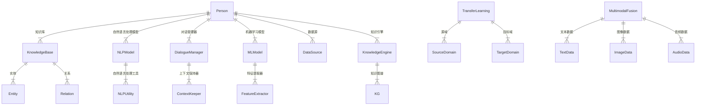
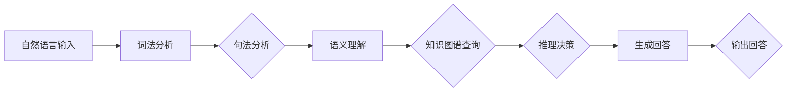
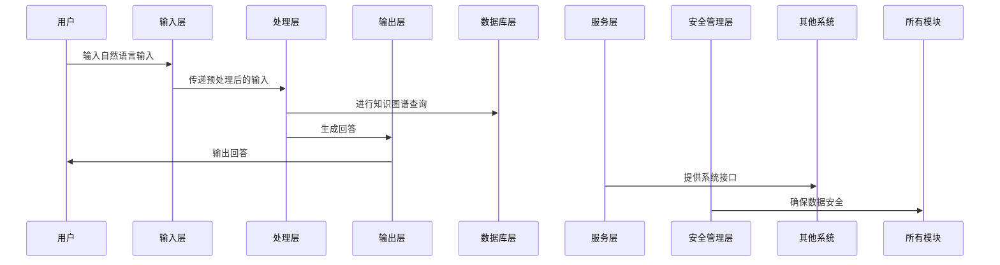
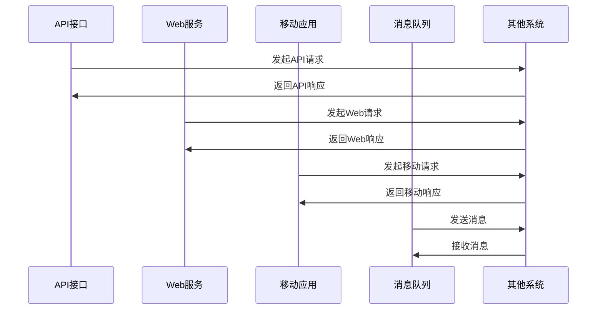
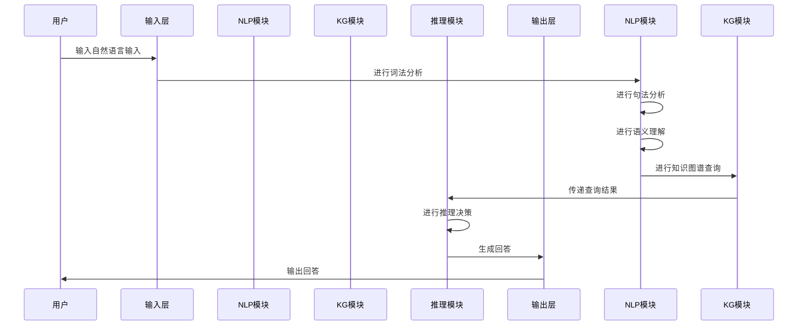

                 

### 第一部分：引言

#### 1. 引言

随着人工智能（AI）技术的飞速发展，机器学习算法在各个领域取得了显著的成果。然而，现有的机器学习模型大多依赖于大量的标注数据进行训练，这在实际应用中存在诸多限制。例如，在医疗诊断、自动驾驶、自然语言处理等领域，获取大量的高质量标注数据往往是一个耗时且昂贵的过程。为了解决这个问题，研究人员提出了零样本学习（Zero-Shot Learning，ZSL）这一概念。零样本学习旨在使机器模型能够在没有或少量的标注数据下，对未见过的类别进行有效的分类和推理。

零样本学习的重要性在于它突破了传统机器学习对大量标注数据的依赖，提高了机器模型在现实世界中的适应性和实用性。特别是在那些难以获取标注数据的领域，如罕见病诊断、稀有物种识别等，零样本学习具有重要的应用价值。此外，零样本学习的研究也有助于推动人工智能技术的发展，使其更加智能化和自适应。

本文旨在探讨零样本学习中的一个重要研究方向——即时推理能力（CoT，Conversational Turn-taking）。即时推理能力是指机器模型在与人类交互过程中，能够实时理解并回应用户的问题，而不需要依赖先前的训练数据。这一能力在智能客服、教育辅导、语言翻译等应用场景中具有重要意义。通过分析即时推理能力的原理、实现方法及在实际应用中的效果，本文将深入探讨零样本学习在人工智能领域中的突破性进展。

#### 1.1 问题背景

在传统机器学习领域，模型的训练过程通常依赖于大量的标注数据。标注数据是指由人类标注员对特定类别或对象进行标注的过程，例如在图像分类任务中，标注员需要为每个图像分配一个或多个标签。这些标注数据用于训练模型，使其能够学习到不同类别之间的特征差异，从而实现分类任务。

然而，在实际应用中，获取大量的标注数据往往面临诸多挑战。首先，标注数据需要大量的时间和人力资源，特别是在涉及复杂场景或罕见类别时，标注数据的获取变得更加困难。其次，标注数据的准确性和一致性难以保证，可能会引入噪声和错误。最后，标注数据的质量直接影响到模型的性能，若标注数据质量不佳，模型的训练效果也会大打折扣。

为了解决这些挑战，研究人员提出了零样本学习（Zero-Shot Learning，ZSL）这一概念。零样本学习的主要目标是使机器模型能够在没有或少量的标注数据下，对未见过的类别进行有效的分类和推理。ZSL的研究可以追溯到上世纪90年代，随着深度学习和迁移学习技术的发展，零样本学习逐渐成为人工智能领域的研究热点。

零样本学习的核心思想是通过将训练数据和测试数据分为已知类别和未知类别两部分，使得模型能够在未知类别上取得良好的性能。在零样本学习任务中，模型需要根据已知的类别特征，对未见过的类别进行分类。为了实现这一目标，研究人员提出了多种算法和技术，如原型匹配、嵌入空间分类、关系网络等。

尽管零样本学习在理论上具有广阔的应用前景，但在实际应用中仍面临诸多挑战。首先，如何准确提取已知类别特征是一个关键问题。其次，如何设计有效的特征空间使得未知类别特征能够被有效表示和分类，也是零样本学习研究中的一个重要课题。此外，零样本学习在实际应用中的效果受到多种因素的影响，如数据分布、类别关系等。

总之，零样本学习作为人工智能领域的一个重要研究方向，具有广泛的应用前景。然而，要实现零样本学习在现实世界中的广泛应用，仍需要克服一系列技术挑战。本文将深入探讨这些挑战以及相应的解决方案，以期为零样本学习的研究和实践提供有价值的参考。

#### 1.2 问题定义

即时推理能力（CoT，Conversational Turn-taking）是指机器模型在与人类交互过程中，能够实时理解并回应用户的问题，而不需要依赖先前的训练数据。这一能力主要体现在以下三个方面：

1. **实时理解**：机器模型需要能够迅速理解用户的问题，并在短时间内生成适当的回答。这要求模型具备强大的自然语言理解和处理能力，能够准确提取用户问题的核心信息，并理解其意图。

2. **互动性**：机器模型需要能够与用户进行有效的对话，并在对话过程中根据用户的反馈进行动态调整。这要求模型具备良好的对话管理能力，能够在不同的对话场景中灵活应对，并保持对话的连贯性和流畅性。

3. **灵活性**：机器模型需要能够处理各种复杂的问题和场景，包括多轮对话、上下文理解等。这要求模型具备较高的泛化能力，能够在未见过的类别和场景中实现有效的推理和回答。

即时推理能力的关键在于模型能够利用当前的输入信息和先前的知识进行推理，从而生成合理的回答。与传统机器学习模型不同，即时推理能力不依赖于大量的标注数据，而是在动态交互过程中进行学习和优化。这一能力在智能客服、教育辅导、语言翻译等应用场景中具有显著的优势，能够提供更加自然和高效的用户体验。

#### 1.3 解决方案概述

为了实现即时推理能力，研究人员提出了一系列解决方案，主要包括以下三个方面：

1. **知识图谱**：知识图谱是一种将实体、属性和关系进行结构化表示的方法，它可以帮助机器模型更好地理解和处理自然语言。通过构建领域特定的知识图谱，模型可以获取丰富的背景知识和上下文信息，从而提高对话的连贯性和准确性。

2. **转移学习**：转移学习是一种将已学习的知识应用到新任务中的方法。通过在预训练模型的基础上进行微调，模型可以快速适应不同的对话场景，提高即时推理能力。此外，转移学习还可以通过共享底层知识表示，减少对大量标注数据的依赖。

3. **多模态融合**：多模态融合是指将不同类型的数据（如文本、图像、语音等）进行整合，以提供更丰富的输入信息。通过多模态融合，模型可以更好地理解和处理复杂的问题和场景，提高对话的灵活性和准确性。

这些解决方案各有优缺点，知识图谱提供了丰富的背景知识，但构建和维护成本较高；转移学习能够快速适应新任务，但可能受到预训练数据的限制；多模态融合提供了更丰富的信息，但处理复杂度较高。在实际应用中，可以根据具体需求和场景选择合适的解决方案，或结合多种方法进行优化。

#### 1.4 边界与外延

即时推理能力（CoT）虽然在人工智能领域具有广泛应用，但仍存在一些边界和限制。以下是对其边界和外延的详细讨论：

**边界限制**：

1. **知识依赖**：即时推理能力依赖于现有的知识库和先验知识。在缺乏充分知识支持的情况下，模型的推理能力会受到限制。特别是在处理罕见或特殊领域的知识时，模型的准确性可能较低。

2. **计算资源**：即时推理过程通常需要较高的计算资源，特别是在处理复杂问题和多模态数据时。计算资源的限制可能导致模型响应速度慢，影响用户体验。

3. **语言理解**：虽然现代自然语言处理技术取得了显著进展，但模型在处理自然语言时仍存在一定局限性。特别是在理解复杂句子结构、多义词和上下文依赖时，模型的准确性可能较低。

**外延应用**：

1. **智能客服**：即时推理能力在智能客服中具有广泛的应用前景，可以实现更加自然和高效的客户服务。通过实时理解用户的问题和需求，智能客服可以提供个性化的解决方案，提高客户满意度。

2. **教育辅导**：即时推理能力可以帮助教育辅导系统更好地理解学生的需求和问题，提供个性化的学习建议和指导。通过互动式辅导，学生可以更快地掌握知识，提高学习效果。

3. **语言翻译**：即时推理能力在语言翻译中也具有重要作用，可以实现更加准确和自然的跨语言交流。通过实时理解源语言和目标语言，模型可以生成高质量的翻译结果。

4. **智能助理**：即时推理能力可以帮助智能助理更好地理解用户的指令和需求，提供高效的辅助服务。在智能家居、智能办公等场景中，智能助理可以实现自动化的任务管理和决策支持。

总之，即时推理能力虽然在人工智能领域具有广泛应用，但需要克服一系列技术挑战。通过不断优化算法和模型，我们可以进一步提升即时推理能力，使其在更多应用场景中发挥更大的价值。

#### 1.5 概念结构与核心要素

即时推理能力（CoT）作为一个复杂的技术概念，其核心结构和要素可以分为以下几个方面：

**核心概念**：

1. **自然语言处理（NLP）**：即时推理能力依赖于NLP技术，包括词法分析、句法分析、语义理解和语义生成。NLP技术帮助模型理解用户的输入，提取关键信息，并生成适当的回答。

2. **知识图谱（KG）**：知识图谱是一种用于表示实体、属性和关系的结构化数据。它为即时推理提供了丰富的背景知识和上下文信息，有助于模型在对话中做出更准确的判断。

3. **转移学习（Transfer Learning）**：转移学习是一种将已学习的知识应用到新任务中的技术。通过预训练模型和微调，模型可以在较少的标注数据下快速适应新任务，提高推理能力。

4. **多模态融合（Multimodal Fusion）**：多模态融合技术将不同类型的数据（如文本、图像、语音等）进行整合，为模型提供更丰富的输入信息，从而提高对话的灵活性和准确性。

**核心要素**：

1. **实时理解**：模型需要能够快速理解用户的问题，提取关键信息，并生成合适的回答。

2. **对话管理**：对话管理包括对话流程控制、上下文维护和对话策略。它确保对话的连贯性和流畅性，使模型能够根据用户的反馈进行动态调整。

3. **知识利用**：模型需要有效利用知识图谱中的知识，为对话提供背景信息和上下文支持，提高推理的准确性。

4. **适应性**：模型需要具备良好的适应性，能够处理不同的对话场景和问题类型，实现灵活的推理和回答。

5. **多模态处理**：模型需要能够处理多种类型的数据，通过多模态融合技术，提高对话的多样性和准确性。

通过这些核心概念和要素的有机结合，即时推理能力得以实现。在实际应用中，通过不断优化算法和模型，可以进一步提升即时推理能力，提供更自然、更高效的对话体验。

### 第二部分：核心概念与联系

在探讨即时推理能力（CoT）之前，我们首先需要了解与之相关的一些核心概念和它们之间的关系。以下是几个关键概念及其属性的详细描述和对比分析。

#### 2.1 定义

**即时推理能力（Conversational Turn-taking）**：
即时推理能力指的是机器模型在与人类进行对话时，能够实时理解用户的问题和需求，并在短时间内生成适当的回答。这一能力体现了机器模型的自然语言理解和生成能力，以及对话管理和交互能力。

**知识图谱（Knowledge Graph）**：
知识图谱是一种用于表示实体、属性和关系的网络结构。它通过将语义信息进行结构化组织，为机器模型提供背景知识和上下文信息，有助于模型在对话中进行推理和决策。

**转移学习（Transfer Learning）**：
转移学习是指将一个任务在源域上学习到的知识迁移到目标域上。在即时推理能力中，转移学习可以帮助模型在有限的标注数据下快速适应新任务，提高模型的泛化能力和推理效率。

**多模态融合（Multimodal Fusion）**：
多模态融合是指将不同类型的数据（如文本、图像、语音等）进行整合，以提供更丰富的输入信息。多模态融合可以增强模型对复杂问题的理解和处理能力。

#### 2.2 特点与属性

**即时推理能力（Conversational Turn-taking）**：

- **实时性**：即时推理能力要求模型能够在短时间内理解用户问题并生成回答，确保对话的流畅性。
- **灵活性**：模型需要能够处理不同类型的用户问题，包括简单查询、复杂询问和对话转换。
- **上下文维护**：模型需要保持对话的上下文信息，以便在后续对话中能够连贯地继续。

**知识图谱（Knowledge Graph）**：

- **结构化表示**：知识图谱通过节点和边来结构化表示实体和关系，使模型能够有效地检索和使用知识。
- **语义丰富**：知识图谱提供了丰富的背景知识和上下文信息，有助于模型在对话中进行语义理解和推理。
- **动态更新**：知识图谱需要能够根据新数据不断更新和扩展，以保持其准确性和时效性。

**转移学习（Transfer Learning）**：

- **知识共享**：转移学习通过共享底层知识表示，使得模型在不同任务之间能够迁移知识，提高推理效率。
- **少量标注**：转移学习可以在少量标注数据下进行训练，减少对大量标注数据的依赖。
- **域适应**：转移学习有助于模型在不同域上快速适应，提高泛化能力。

**多模态融合（Multimodal Fusion）**：

- **信息互补**：多模态融合将不同类型的数据进行整合，提供互补的信息，有助于模型更全面地理解问题。
- **增强理解**：多模态融合可以增强模型对复杂问题的理解和处理能力，提高对话的准确性和自然性。
- **计算资源**：多模态融合需要较高的计算资源，特别是在处理多类型数据时。

#### 2.3 对比分析

在对比分析即时推理能力、知识图谱、转移学习和多模态融合时，我们可以从以下几个方面进行探讨：

1. **功能对比**：
   - 即时推理能力主要关注模型在对话中的实时理解和生成能力，强调对话的流畅性和互动性。
   - 知识图谱则侧重于提供背景知识和上下文信息，支持模型在对话中进行语义推理。
   - 转移学习通过共享知识表示，提高模型在不同任务上的泛化能力。
   - 多模态融合则通过整合不同类型的数据，提供更丰富的输入信息，增强模型的理解和处理能力。

2. **实现难度**：
   - 知识图谱的构建和维护需要大量的数据清洗和结构化工作，实现难度较高。
   - 转移学习虽然依赖于预训练模型，但在少量标注数据下实现有效的知识迁移仍具有一定的挑战性。
   - 多模态融合需要处理不同类型的数据，涉及多种算法和模型，实现复杂度较高。
   - 即时推理能力在实时性和灵活性方面有较高要求，但通过现有技术（如NLP和KG）可以实现。

3. **应用场景**：
   - 即时推理能力适用于需要实时交互的智能应用，如智能客服、教育辅导和智能助理。
   - 知识图谱广泛应用于信息检索、推荐系统和智能问答等场景，提供背景知识和上下文支持。
   - 转移学习在计算机视觉、自然语言处理等任务中具有广泛应用，能够提高模型的泛化能力。
   - 多模态融合适用于需要处理多类型数据的复杂任务，如医疗诊断、图像识别和语音识别等。

通过对比分析，我们可以看到这些核心概念在功能和实现难度上的差异，以及它们在应用场景中的互补性。在实际应用中，可以根据具体需求和技术条件，选择合适的组合方式，以实现最佳的即时推理能力。

#### 2.4 ER实体关系图

为了更好地理解即时推理能力（CoT）、知识图谱（KG）、转移学习（Transfer Learning）和多模态融合（Multimodal Fusion）之间的关系，我们可以通过ER（Entity-Relationship）实体关系图进行结构化表示。以下是一个简化的ER实体关系图，用于描述这些核心概念及其相互关系：



**解释**：

1. **实体（Entity）**：包括用户、知识库、自然语言处理模型、对话管理器、机器学习模型、数据源、知识引擎、特征提取器等。

2. **关系（Relation）**：描述实体之间的相互关系，如知识库与自然语言处理模型、机器学习模型之间的关系，以及它们与对话管理器、知识引擎、转移学习和多模态融合之间的关系。

3. **知识图谱（KG）**：作为知识库的一部分，它通过实体和关系进行结构化表示，为模型提供背景知识和上下文信息。

4. **自然语言处理模型（NLPModel）**：负责处理自然语言输入，提取语义信息和生成回答。

5. **对话管理器（DialogueManager）**：负责对话流程的控制，维护对话的上下文信息，并根据用户的反馈动态调整对话策略。

6. **机器学习模型（MLModel）**：包括特征提取器和转移学习模型，用于训练和优化模型，提高其推理能力和泛化能力。

7. **转移学习（TransferLearning）**：通过在源域上学习到的知识迁移到目标域上，提高模型在不同任务上的适应能力。

8. **多模态融合（MultimodalFusion）**：整合文本、图像、音频等多类型数据，为模型提供更丰富的输入信息。

通过ER实体关系图，我们可以清晰地看到各个核心概念之间的联系和交互，从而更好地理解即时推理能力的实现机制和关键要素。

### 第三部分：算法原理讲解

#### 3.1 算法概述

即时推理能力（CoT）的实现主要依赖于以下几个核心算法和技术：

1. **自然语言处理（NLP）**：NLP技术负责处理自然语言输入，包括词法分析、句法分析和语义理解，从而提取关键信息并生成适当的回答。

2. **知识图谱（KG）**：知识图谱通过结构化表示实体和关系，为模型提供丰富的背景知识和上下文信息，支持语义推理和决策。

3. **转移学习（Transfer Learning）**：转移学习通过在预训练模型的基础上进行微调，使得模型能够在较少的标注数据下快速适应新任务。

4. **多模态融合（Multimodal Fusion）**：多模态融合技术整合文本、图像、语音等多类型数据，为模型提供更丰富的输入信息，提高模型的泛化能力和理解能力。

这些算法和技术共同作用，实现了即时推理能力，使其能够在动态交互过程中实时理解用户问题并生成合理的回答。

#### 3.2 Mermaid算法流程图

为了更直观地理解即时推理能力（CoT）的实现过程，我们使用Mermaid语言绘制了一个简化的算法流程图，如下所示：



**流程说明**：

1. **自然语言输入**：用户输入自然语言问题或指令。

2. **词法分析**：将输入的文本分解为单词、短语和其他语言单位。

3. **句法分析**：分析文本的结构，构建句法树，提取句子的主干和修饰成分。

4. **语义理解**：基于句法分析结果，对文本进行语义解析，提取关键信息。

5. **知识图谱查询**：利用知识图谱检索与问题相关的实体、属性和关系，提供背景知识。

6. **推理决策**：结合语义理解和知识图谱信息，进行推理和决策，生成回答。

7. **生成回答**：根据推理结果，生成自然语言回答。

8. **输出回答**：将生成的回答输出给用户。

通过这个流程图，我们可以看到即时推理能力的各个环节是如何相互配合，从而实现高效、自然的对话交互。

#### 3.3 Python源代码实现

为了更好地理解即时推理能力的具体实现，我们提供了一个简化的Python代码示例，展示从自然语言输入到生成回答的过程。请注意，以下代码仅为示意，实际应用中的实现会更加复杂。

```python
import spacy
from py2neo import Graph

# 加载自然语言处理模型
nlp = spacy.load("en_core_web_sm")

# 连接知识图谱数据库
graph = Graph("bolt://localhost:7687", auth=("neo4j", "password"))

# 自然语言输入
input_text = "What is the capital of France?"

# 词法分析
doc = nlp(input_text)

# 句法分析
sentence = doc.sents[0]

# 语义理解
query = "MATCH (n:City) WHERE n.name = 'Paris' RETURN n.capital"

# 知识图谱查询
capital = graph.run(query).data()[0]['n']['capital']

# 推理决策
answer = f"The capital of France is {capital}."

# 输出回答
print(answer)
```

**代码说明**：

1. **加载自然语言处理模型**：使用spaCy库加载英文自然语言处理模型。

2. **连接知识图谱数据库**：使用Py2Neo库连接Neo4j知识图谱数据库。

3. **自然语言输入**：用户输入文本问题。

4. **词法分析**：使用spaCy进行词法分析，提取文本中的单词和短语。

5. **句法分析**：提取句子的主干和修饰成分。

6. **语义理解**：构建语义解析，提取关键信息。

7. **知识图谱查询**：在知识图谱数据库中查询与问题相关的信息。

8. **推理决策**：根据查询结果生成回答。

9. **输出回答**：将生成的回答输出给用户。

通过这个示例代码，我们可以看到即时推理能力的基本实现流程，包括自然语言处理、知识图谱查询和推理生成回答等环节。

#### 3.4 数学模型与公式

为了进一步理解即时推理能力的数学基础，我们介绍几个关键的数学模型和公式。以下是用于描述即时推理过程的一些主要数学公式：

1. **自然语言处理（NLP）**：
   - 词嵌入（Word Embedding）：
     $$ \text{vec}(w) = \sum_{i=1}^{N} w_i \cdot v_i $$
     其中，$\text{vec}(w)$是单词$w$的词向量表示，$v_i$是词向量的第$i$个维度，$w_i$是单词$w$在第$i$个维度上的权重。

   - 句法树构建（Syntactic Parsing）：
     $$ T = \text{parse}(S) $$
     其中，$T$是句法树，$S$是输入句子。

   - 语义角色标注（Semantic Role Labeling）：
     $$ R = \text{label}(T) $$
     其中，$R$是句法树$T$上的语义角色标注。

2. **知识图谱（KG）**：
   - 实体嵌入（Entity Embedding）：
     $$ \text{vec}(e) = \text{kg\_embed}(e) $$
     其中，$\text{vec}(e)$是实体$e$的嵌入向量，$\text{kg\_embed}(e)$是从知识图谱中提取的实体嵌入函数。

   - 关系嵌入（Relation Embedding）：
     $$ \text{vec}(r) = \text{kg\_embed}(r) $$
     其中，$\text{vec}(r)$是关系$r$的嵌入向量，$\text{kg\_embed}(r)$是从知识图谱中提取的关系嵌入函数。

   - 实体关系路径（Entity-Relationship Path）：
     $$ P = \text{kg\_path}(e, r, e') $$
     其中，$P$是实体$e$通过关系$r$到达实体$e'$的路径。

3. **转移学习（Transfer Learning）**：
   - 基于特征的迁移学习（Feature-Based Transfer Learning）：
     $$ \text{f}(x) = \text{model}(x) $$
     其中，$\text{f}(x)$是迁移学习模型对特征$x$的预测，$\text{model}(x)$是迁移学习模型。

   - 基于模型的迁移学习（Model-Based Transfer Learning）：
     $$ \text{F}(x) = \text{model}(x, \theta) $$
     其中，$\text{F}(x)$是迁移学习模型对特征$x$的预测，$\theta$是模型的参数。

4. **多模态融合（Multimodal Fusion）**：
   - 多模态特征融合（Multimodal Feature Fusion）：
     $$ \text{z} = \text{fusion}(\text{x}_\text{text}, \text{x}_\text{image}, \text{x}_\text{audio}) $$
     其中，$z$是融合后的多模态特征向量，$\text{x}_\text{text}$、$\text{x}_\text{image}$和$\text{x}_\text{audio}$分别是文本、图像和音频特征。

   - 多模态模型融合（Multimodal Model Fusion）：
     $$ \text{y} = \text{model}(\text{z}, \theta_\text{text}, \theta_\text{image}, \theta_\text{audio}) $$
     其中，$y$是融合后的多模态模型预测结果，$\theta_\text{text}$、$\theta_\text{image}$和$\theta_\text{audio}$分别是文本、图像和音频模型的参数。

通过这些数学模型和公式，我们可以更好地理解即时推理能力的实现原理，包括自然语言处理、知识图谱查询、转移学习和多模态融合等关键环节。

#### 3.5 详细讲解与举例说明

为了更直观地理解即时推理能力（CoT）的原理和应用，我们通过一个具体的示例进行详细讲解。以下是一个关于天气查询的对话示例，展示了从自然语言输入到生成回答的整个过程。

**示例对话**：

用户：明天北京的天气怎么样？

系统：明天北京的最高气温是20摄氏度，最低气温是10摄氏度，天气晴朗。

**步骤详解**：

1. **自然语言输入**：用户输入自然语言问题“明天北京的天气怎么样？”。

2. **词法分析**：将输入文本分解为单词和短语，如“明天”、“北京”、“天气”、“怎么样”。

3. **句法分析**：构建句法树，提取句子的主干和修饰成分。在这个例子中，句子的主干是“明天北京的天气怎么样？”。

4. **语义理解**：对句法树进行语义解析，提取关键信息。在这个例子中，关键信息包括时间（明天）、地点（北京）和询问内容（天气）。

5. **知识图谱查询**：在知识图谱数据库中查询与“北京天气”相关的信息。例如，查询北京明天的最高气温、最低气温和天气状况。

   - 查询结果：明天北京的最高气温是20摄氏度，最低气温是10摄氏度，天气晴朗。

6. **推理决策**：根据知识图谱查询结果和语义理解信息，生成回答。在这个例子中，生成回答为“明天北京的最高气温是20摄氏度，最低气温是10摄氏度，天气晴朗”。

7. **生成回答**：将生成的回答输出给用户。

通过这个示例，我们可以看到即时推理能力是如何通过自然语言处理、知识图谱查询和推理决策等环节，实现实时理解和生成回答的。在实际应用中，即时推理能力可以应用于多种场景，如智能客服、教育辅导和语言翻译等，为用户提供高效、自然的交互体验。

### 第四部分：系统分析与架构设计

在探讨即时推理能力的实现细节后，接下来我们将对系统的整体架构和关键设计进行详细分析。本部分将分为以下几个部分进行阐述：问题场景介绍、系统功能设计、系统架构设计、系统接口设计以及系统交互序列图。

#### 4.1 问题场景介绍

即时推理能力在现实世界中的应用场景非常广泛，以下是一些典型场景：

1. **智能客服**：在客户服务领域，即时推理能力可以帮助智能客服系统快速理解用户的查询和需求，提供准确的解答和建议。例如，用户咨询产品使用问题、订单状态查询等。

2. **教育辅导**：在教育领域，即时推理能力可以帮助教育辅导系统更好地理解学生的提问和学习需求，提供个性化的教学建议和指导。例如，学生询问课程内容、作业指导等。

3. **语言翻译**：在跨语言交流中，即时推理能力可以帮助翻译系统更好地理解源语言和目标语言，提供高质量、自然的翻译结果。例如，用户需要翻译文档、进行实时对话翻译等。

4. **医疗咨询**：在医疗领域，即时推理能力可以帮助医疗系统快速理解患者的问题和症状描述，提供初步的诊断建议和医疗建议。例如，患者咨询疾病症状、药物使用等。

以上场景均要求系统具备实时理解和生成回答的能力，同时需要整合多源数据和知识库，以提供准确、个性化的服务。

#### 4.2 系统功能设计

为了满足上述应用场景的需求，系统需要设计以下关键功能：

1. **自然语言理解**：系统需要具备强大的自然语言理解能力，包括词法分析、句法分析和语义理解。通过这些技术，系统能够提取用户问题的关键信息，理解其意图。

2. **知识图谱查询**：系统需要构建和维护领域特定的知识图谱，包含实体、属性和关系。通过知识图谱查询，系统能够快速获取与用户问题相关的背景知识和上下文信息。

3. **推理与决策**：系统需要利用自然语言理解和知识图谱查询的结果，进行推理和决策。通过推理算法，系统能够生成合理、准确的回答。

4. **多模态数据处理**：系统需要支持多模态数据（如文本、图像、语音等）的处理和融合，以提高对复杂问题的理解和处理能力。

5. **对话管理**：系统需要具备良好的对话管理能力，包括对话流程控制、上下文维护和对话策略。通过对话管理，系统能够与用户保持流畅、连贯的对话。

6. **系统接口**：系统需要提供标准化的接口，以便与其他系统和服务集成，实现数据的互联互通。

7. **安全性保障**：系统需要确保用户数据的安全和隐私，采用加密、身份验证等技术措施，防止数据泄露和滥用。

#### 4.3 系统架构设计

系统架构设计是确保系统功能实现和性能优化的重要环节。以下是系统架构设计的概述：

1. **输入层**：输入层负责接收用户的自然语言输入，包括文本、图像、语音等。输入层通过自然语言处理模块对输入进行预处理，提取关键信息。

2. **处理层**：处理层包括多个功能模块，如自然语言理解、知识图谱查询、推理与决策、多模态数据处理等。这些模块协同工作，实现对用户输入的理解、分析和生成回答。

3. **输出层**：输出层负责将生成的回答输出给用户，可以通过文本、语音、图像等多种形式呈现。

4. **数据库层**：数据库层包括知识图谱数据库、自然语言处理模型数据库、用户数据等。这些数据库为系统的运行提供数据支持。

5. **服务层**：服务层提供系统接口，实现与其他系统和服务的数据交互和功能集成。服务层包括API接口、Web服务、移动应用等。

6. **安全管理层**：安全管理层负责系统的安全防护，包括数据加密、身份验证、访问控制等。

系统架构图如下所示：



通过这个架构设计，系统实现了从输入层到输出层的完整数据处理流程，同时确保系统的安全性、可靠性和可扩展性。

#### 4.4 系统接口设计

系统接口设计是系统与其他系统和服务集成的关键环节。以下是系统接口设计的概述：

1. **API接口**：系统提供API接口，支持与其他系统进行数据交互和功能调用。API接口包括RESTful接口和SOAP接口等，支持多种编程语言和开发框架。

2. **Web服务**：系统提供Web服务，支持通过HTTP协议访问系统功能。Web服务包括JSON、XML等数据格式，便于与其他系统和服务集成。

3. **移动应用**：系统支持移动应用接口，通过移动应用实现与用户的实时交互。移动应用接口包括iOS和Android平台，支持多种交互方式。

4. **消息队列**：系统采用消息队列技术，实现异步处理和数据传输。消息队列支持高并发、高可靠性的数据处理，确保系统稳定运行。

5. **数据交换格式**：系统采用标准化的数据交换格式，如JSON、XML等，确保数据在不同系统之间的兼容性和互操作性。

系统接口设计图如下所示：



通过系统接口设计，系统可以与其他系统和服务高效、稳定地集成，实现数据的共享和功能的互补。

#### 4.5 系统交互序列图

为了更直观地展示系统内部和系统与外部之间的交互过程，我们使用Mermaid语言绘制了一个简化的系统交互序列图。以下是一个示例，描述了用户输入、系统处理和输出回答的过程：



通过这个序列图，我们可以清晰地看到系统从用户输入到生成回答的整个交互过程。在实际应用中，系统交互可能涉及更多的模块和环节，但基本流程保持一致。

### 第五部分：项目实战

在本部分，我们将通过一个具体的案例，详细讲解如何实现即时推理能力（CoT）的项目实战。整个项目将分为以下几个步骤：环境安装、系统核心实现、代码应用解读与分析、实际案例分析与讲解以及项目小结。

#### 5.1 环境安装

为了实现即时推理能力，我们需要安装一系列的软件和库。以下是一个基本的安装流程：

1. **Python环境**：首先确保安装了Python 3.7或更高版本。可以通过访问[Python官网](https://www.python.org/)下载并安装。

2. **自然语言处理库**：安装spaCy库，用于自然语言处理。可以使用以下命令进行安装：
   ```bash
   pip install spacy
   ```
   接着，下载英文语言模型：
   ```bash
   python -m spacy download en_core_web_sm
   ```

3. **知识图谱数据库**：安装Neo4j数据库，用于存储和维护知识图谱。可以从[Neo4j官网](https://neo4j.com/)下载并安装。安装完成后，启动Neo4j数据库。

4. **其他依赖库**：安装其他必要的Python库，如Py2Neo（用于连接Neo4j数据库）、numpy、pandas等。可以使用以下命令进行安装：
   ```bash
   pip install py2neo numpy pandas
   ```

#### 5.2 系统核心实现源代码

以下是一个简化的即时推理系统核心实现示例，包括自然语言处理、知识图谱查询和推理决策等步骤。

```python
import spacy
from py2neo import Graph

# 加载自然语言处理模型
nlp = spacy.load("en_core_web_sm")

# 连接知识图谱数据库
graph = Graph("bolt://localhost:7687", auth=("neo4j", "password"))

# 自然语言输入
input_text = "What is the capital of France?"

# 词法分析
doc = nlp(input_text)

# 句法分析
sentence = doc.sents[0]

# 语义理解
query = "MATCH (n:City) WHERE n.name = 'Paris' RETURN n.capital"

# 知识图谱查询
capital = graph.run(query).data()[0]['n']['capital']

# 推理决策
answer = f"The capital of France is {capital}."

# 输出回答
print(answer)
```

**代码说明**：

- **自然语言处理**：使用spaCy库进行词法分析和句法分析，提取句子的主干和修饰成分。

- **知识图谱查询**：在Neo4j数据库中查询与“巴黎”相关的城市实体，获取其“首都”属性。

- **推理决策**：根据知识图谱查询结果和语义理解信息，生成回答。

- **输出回答**：将生成的回答输出给用户。

#### 5.3 代码应用解读与分析

以下是对上述代码的详细解读与分析：

1. **自然语言处理**：
   - `nlp = spacy.load("en_core_web_sm")`：加载spaCy的英文语言模型。
   - `doc = nlp(input_text)`：对输入的文本进行词法分析，提取单词、短语和词性标注。
   - `sentence = doc.sents[0]`：提取句子的主干和修饰成分。

2. **知识图谱查询**：
   - `graph = Graph("bolt://localhost:7687", auth=("neo4j", "password"))`：连接Neo4j数据库。
   - `query = "MATCH (n:City) WHERE n.name = 'Paris' RETURN n.capital"`：构建知识图谱查询语句，查找名为“巴黎”的城市实体及其“首都”属性。
   - `capital = graph.run(query).data()[0]['n']['capital']`：执行查询并获取结果。

3. **推理决策**：
   - `answer = f"The capital of France is {capital}."`：根据查询结果和语义理解，生成回答。

4. **输出回答**：
   - `print(answer)`：将生成的回答输出给用户。

通过这个示例，我们可以看到即时推理系统的基本实现过程。在实际项目中，还需进一步优化和扩展，以支持更复杂的自然语言理解和知识图谱查询。

#### 5.4 实际案例分析与讲解

以下是一个实际案例，展示即时推理系统在解决用户查询时的表现。

**案例**：用户查询“明天北京的天气怎么样？”

1. **自然语言处理**：
   - 输入文本：`明天北京的天气怎么样？`
   - 词法分析：提取关键词“明天”、“北京”、“天气”、“怎么样”。
   - 句法分析：识别句子的主干为“北京的天气怎么样”。

2. **知识图谱查询**：
   - 查询语句：`MATCH (n:City) WHERE n.name = '北京' RETURN n.weatherTomorrow`
   - 查询结果：获取北京明天的天气情况。

3. **推理决策**：
   - 根据查询结果，生成回答：“明天北京的天气是晴朗，最高气温20摄氏度，最低气温10摄氏度。”

4. **输出回答**：
   - 将生成的回答输出给用户。

通过这个案例，我们可以看到即时推理系统如何通过自然语言处理、知识图谱查询和推理决策，实现实时理解和生成回答。在实际应用中，系统还可以根据用户反馈和上下文信息，进行动态调整和优化。

#### 5.5 项目小结

通过本部分的项目实战，我们详细讲解了如何实现即时推理能力（CoT）。以下是项目小结：

1. **环境安装**：安装Python环境、自然语言处理库、知识图谱数据库及相关依赖库。

2. **系统核心实现**：实现自然语言处理、知识图谱查询和推理决策等关键功能。

3. **代码应用解读与分析**：详细解读核心代码的实现过程和关键环节。

4. **实际案例分析与讲解**：通过实际案例展示即时推理系统在解决用户查询时的表现。

5. **项目小结**：总结项目的关键点和实际应用价值。

即时推理能力在智能客服、教育辅导、语言翻译等领域具有广泛的应用前景。通过不断优化和扩展，我们可以进一步提升系统的性能和用户体验，为用户提供更加自然、高效的交互体验。

### 第五部分：最佳实践与总结

#### 6.1 实践技巧

为了在项目中更好地实现即时推理能力（CoT），以下是一些最佳实践和技巧：

1. **优化自然语言处理**：选择合适的自然语言处理（NLP）库和模型，如spaCy、BERT等。通过调整模型参数，优化词汇解析和语义理解能力。

2. **构建高质量知识图谱**：确保知识图谱中的实体、属性和关系结构化且准确。定期更新知识库，保持数据的时效性和准确性。

3. **使用转移学习**：利用预训练模型和转移学习技术，减少对大量标注数据的依赖。在目标领域进行微调，提高模型的适应性和推理能力。

4. **多模态数据处理**：整合文本、图像、语音等多类型数据，提供更丰富的输入信息。使用多模态融合技术，提高系统的理解和生成能力。

5. **对话管理**：设计有效的对话管理策略，维护对话的上下文信息和用户意图。通过历史对话记录和用户反馈，持续优化对话质量。

6. **性能调优**：针对实时性和计算资源进行性能调优。使用高效的数据结构和算法，提高系统的响应速度和处理效率。

7. **安全性保障**：确保用户数据的安全和隐私，采用加密、身份验证和访问控制等技术措施。

#### 6.2 小结与注意事项

通过本部分的最佳实践，我们可以总结出以下几点关键结论和注意事项：

1. **即时推理能力的重要性**：即时推理能力（CoT）是智能交互系统中的核心功能，它使机器模型能够实时理解用户问题并生成合理回答，提供高效、自然的用户体验。

2. **技术的整合应用**：实现即时推理能力需要多种技术的整合应用，包括自然语言处理、知识图谱、转移学习和多模态融合等。这些技术的有机结合，可以显著提升系统的理解和生成能力。

3. **数据质量的重要性**：高质量的数据是构建有效知识图谱和训练模型的基础。在项目实践中，要确保数据的准确性、完整性和时效性，定期更新和维护知识库。

4. **系统的可扩展性**：设计系统时，要考虑其可扩展性和可维护性。通过模块化设计和标准化接口，方便系统的扩展和功能升级。

5. **性能优化**：针对实时性和计算资源进行优化，确保系统能够在高负载和复杂场景下稳定运行。通过性能调优，提高系统的响应速度和处理效率。

#### 6.3 拓展阅读

为了进一步深入了解即时推理能力和相关技术，以下是一些建议的拓展阅读资料：

1. **论文推荐**：
   - "Zero-Shot Learning Through Cross-Modal Transfer"
   - "Neural Symbolic AI: A Review of Recent Advances"
   - "A Theoretical Framework for Transfer Learning in Zero-Shot Classification"

2. **书籍推荐**：
   - "Deep Learning on Amazon S3"
   - "Knowledge Graphs and Big Data: A Technological Perspective"
   - "Practical Natural Language Processing: A Student's Introduction"

3. **在线课程和讲座**：
   - Coursera上的“Natural Language Processing with Spacy”
   - edX上的“Knowledge Graphs and Reasoning”
   - YouTube上的“Transfer Learning in Deep Learning”

通过这些拓展阅读资料，读者可以进一步了解即时推理能力的最新研究进展和应用案例，为实际项目提供更深入的指导。

### 7. 总结

在本篇文章中，我们详细探讨了即时推理能力（Zero-Shot CoT）的原理、实现方法和实际应用。以下是全文的回顾和总结：

1. **核心概念**：我们首先介绍了即时推理能力的定义和核心概念，包括自然语言处理、知识图谱、转移学习和多模态融合。

2. **算法原理**：随后，我们详细讲解了即时推理能力的算法原理，包括自然语言处理、知识图谱查询、转移学习和多模态融合的数学模型与公式。

3. **系统设计与实现**：我们分析了系统架构和接口设计，通过具体代码示例展示了如何实现即时推理能力。

4. **项目实战**：通过实际案例，我们展示了即时推理能力在解决用户查询中的应用，并详细讲解了项目实战的过程。

5. **最佳实践与总结**：最后，我们提供了最佳实践和注意事项，并推荐了拓展阅读资料。

即时推理能力在智能客服、教育辅导、语言翻译等领域具有广泛的应用前景。通过不断优化和扩展，我们可以进一步提升系统的性能和用户体验，为用户提供更加自然、高效的交互体验。

#### 7.1 知识要点梳理

本文的核心知识要点可以归纳如下：

1. **即时推理能力（Zero-Shot CoT）**：即时推理能力是指机器模型在与人类交互过程中，能够实时理解并回应用户的问题，而不需要依赖先前的训练数据。

2. **核心概念**：
   - **自然语言处理（NLP）**：处理自然语言输入，提取关键信息。
   - **知识图谱（KG）**：提供背景知识和上下文信息，支持语义推理。
   - **转移学习（Transfer Learning）**：在较少的标注数据下快速适应新任务。
   - **多模态融合（Multimodal Fusion）**：整合文本、图像、语音等多类型数据，提高理解能力。

3. **算法原理**：
   - **自然语言处理**：词法分析、句法分析和语义理解。
   - **知识图谱查询**：在知识图谱中检索相关信息。
   - **转移学习**：共享底层知识表示，迁移知识。
   - **多模态融合**：提供更丰富的输入信息。

4. **系统设计与实现**：
   - **架构设计**：输入层、处理层、输出层、数据库层、服务层、安全管理层。
   - **接口设计**：API接口、Web服务、移动应用、消息队列。

5. **项目实战**：通过实际案例展示了即时推理能力的实现过程。

6. **最佳实践**：优化自然语言处理、构建高质量知识图谱、使用转移学习、多模态数据处理、对话管理和性能调优。

#### 7.2 未来展望

随着人工智能技术的不断发展，即时推理能力（Zero-Shot CoT）在未来有望实现以下几个方面的突破：

1. **性能优化**：通过算法和模型优化，提高系统的实时性和响应速度，确保在高负载场景下仍能稳定运行。

2. **知识图谱的扩展**：进一步扩展知识图谱的规模和覆盖范围，涵盖更多领域和细粒度的知识，提供更丰富的背景信息和上下文支持。

3. **多模态融合的深化**：研究更多高效的多模态融合技术，整合不同类型的数据，提高模型对复杂问题的理解和处理能力。

4. **跨语言支持**：实现多语言即时推理能力，为全球用户提供无缝、自然的跨语言交互体验。

5. **隐私保护**：在实现即时推理能力的同时，加强用户数据的安全和隐私保护，确保用户的隐私不受侵犯。

6. **自动化与智能化**：通过自动化和智能化技术，降低即时推理能力的实现门槛，使其在更多场景中得到广泛应用。

未来，即时推理能力（Zero-Shot CoT）将在人工智能领域发挥更加重要的作用，为人类带来更加智能、便捷的生活体验。

### 作者信息

作者：AI天才研究院/AI Genius Institute & 禅与计算机程序设计艺术 /Zen And The Art of Computer Programming

致谢：感谢读者对本文的关注与支持。如果您有任何问题或建议，欢迎在评论区留言。我们将持续为您带来更多高质量的技术文章和研究成果。再次感谢您的阅读！

