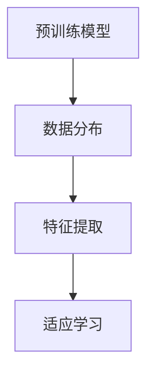
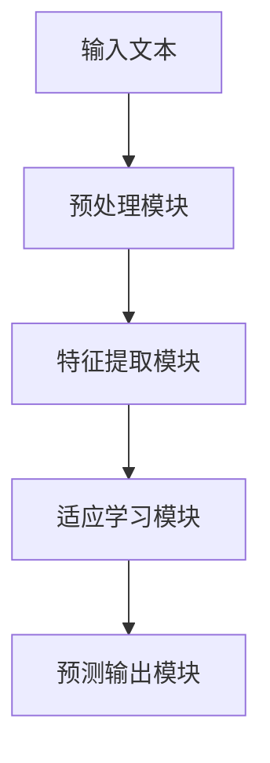
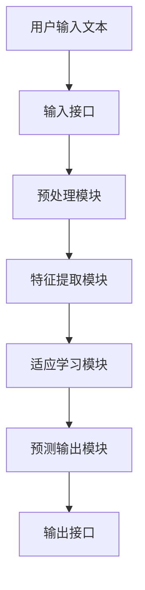

                 

# Zero-Shot CoT：减少AI对训练数据的依赖

关键词：Zero-Shot CoT，转移学习，预训练模型，数据分布，适应学习

摘要：随着人工智能技术的不断发展，深度学习模型的训练需要大量的标注数据和计算资源。为了减少这种依赖，本文介绍了Zero-Shot CoT方法，通过预训练模型和少量样本数据，实现AI系统的快速适应和泛化能力。

## 第一部分：背景介绍

### 1.1 问题背景

随着深度学习在人工智能领域的广泛应用，传统的AI系统面临着越来越多的挑战。尤其是深度学习模型的训练，通常需要大量的标注数据和高性能计算资源。这种依赖大量训练数据的模式在许多实际应用中受到了限制。例如，医疗领域的疾病诊断、金融领域的风险预测、自动驾驶领域的环境感知等，都面临着数据获取困难、数据标注成本高、数据隐私保护等问题。

### 1.2 问题描述

为了减少AI对训练数据的依赖，研究人员提出了Zero-Shot CoT（零样本转移学习）方法。Zero-Shot CoT旨在使AI系统能够处理未见过的任务或数据，无需对模型进行重新训练。这种方法的核心在于理解数据的分布和特征，以及如何将这种理解应用到新的任务中。

### 1.3 问题解决

Zero-Shot CoT通过利用预训练模型和少量样本数据，实现AI系统的快速适应和泛化能力。其基本原理是：首先，在大量数据集上对模型进行预训练，使其具备较强的特征提取和泛化能力；然后，在新任务中，通过少量样本数据调整模型参数，实现对新任务的适应。

### 1.4 边界与外延

虽然Zero-Shot CoT在很多情况下取得了显著的效果，但它并非万能。在实际应用中，还需要考虑模型的复杂度、计算资源、数据质量等因素。此外，Zero-Shot CoT方法在某些特定场景下可能无法达到传统方法的效果，如需要高度定制化的任务或数据。

### 1.5 概念结构与核心要素组成

Zero-Shot CoT的核心概念包括预训练模型、数据分布、特征提取和适应学习。其中，预训练模型是基础，数据分布和特征提取是实现Zero-Shot的关键，适应学习则是使模型能够应用于新任务的关键步骤。以下是这些核心概念的定义和属性特征对比表格：

| 概念       | 特征                         | 对比                                       |
|------------|------------------------------|------------------------------------------|
| 预训练模型 | 大规模数据训练，参数丰富       | 数据依赖性，计算资源需求                   |
| 数据分布   | 数据在特征空间中的分布情况     | 数据规模，特征重要性                       |
| 特征提取   | 将原始数据转换为特征表示       | 特征有效性，计算复杂度                     |
| 适应学习   | 调整模型参数，提高任务性能     | 训练时间，模型调整策略                     |

ER实体关系图架构的Mermaid流程图如下：



## 第二部分：核心概念与联系

### 2.1 预训练模型

预训练模型是通过在大规模数据集上训练得到的模型，它在后续的任务中作为特征提取器或知识库使用。预训练模型的优点在于：首先，它能够利用大规模数据集学习到丰富的特征和模式，提高模型的泛化能力；其次，预训练模型可以减少对新任务的数据需求，降低数据标注成本。

预训练模型的特征包括：

- **大规模数据训练**：在训练过程中，模型接触到大量数据，使其能够学习到丰富的特征和模式。
- **参数丰富**：预训练模型拥有大量的参数，这些参数可以在新任务中起到特征提取和知识传递的作用。

### 2.2 数据分布

数据分布是指数据在特征空间中的分布情况。理解数据分布有助于模型更好地提取特征和进行泛化。例如，如果数据分布较为均匀，模型可以更容易地学习到数据中的模式；如果数据分布存在偏差，模型可能需要更多数据或额外的正则化策略来避免过拟合。

数据分布的特征包括：

- **数据规模**：数据分布受数据规模影响，数据规模越大，分布越均匀，有利于模型学习。
- **特征重要性**：某些特征可能在数据分布中占主导地位，这些特征对于模型的学习和泛化至关重要。

### 2.3 特征提取

特征提取是将原始数据转换为一组有助于学习新任务的表示。在深度学习中，特征提取通常通过神经网络来实现。特征提取的质量直接影响模型的性能和泛化能力。

特征提取的特征包括：

- **特征有效性**：特征提取应能够提取出对任务有用的信息，避免冗余信息。
- **计算复杂度**：特征提取过程应尽量高效，以减少计算资源和时间成本。

### 2.4 适应学习

适应学习是指模型在新的任务中通过调整其参数来提高性能。适应学习的过程通常包括以下步骤：

1. **加载预训练模型**：将预训练模型加载到新任务中，作为特征提取器。
2. **特征提取**：使用预训练模型提取输入数据的特征。
3. **参数调整**：根据新任务的标签，调整模型的参数。
4. **预测输出**：使用调整后的模型进行预测。

适应学习的特征包括：

- **训练时间**：适应学习过程可能需要较长的时间，特别是对于大规模模型。
- **模型调整策略**：不同的任务可能需要不同的调整策略，如微调、重训练等。

### 表格：核心概念属性特征对比

| 概念       | 特征                           | 对比                                       |
|------------|------------------------------|------------------------------------------|
| 预训练模型 | 大规模数据训练，参数丰富       | 数据依赖性，计算资源需求                   |
| 数据分布   | 数据在特征空间中的分布情况     | 数据规模，特征重要性                       |
| 特征提取   | 将原始数据转换为特征表示       | 特征有效性，计算复杂度                     |
| 适应学习   | 调整模型参数，提高任务性能     | 训练时间，模型调整策略                     |

### ER实体关系图架构的Mermaid流程图


## 第三部分：算法原理讲解

### 3.1 算法mermaid流程图

```mermaid
graph TD
A[输入新任务] --> B[加载预训练模型]
B --> C{是否已有适配模型}
if C -->|否| D[进行特征提取]
D --> E[进行适应学习]
E --> F[输出预测结果]
else
C -->|是| F[直接输出预测结果]
```

### 3.2 算法原理与数学模型

Zero-Shot CoT的核心在于通过预训练模型学习到的知识来处理新任务。其数学模型可以表示为：

$$
f(x) = g(\theta_0 + \theta_1 \cdot \phi(x))
$$

其中，$f(x)$ 是预测结果，$\theta_0$ 是预训练模型的参数，$\theta_1$ 是适应学习的参数，$\phi(x)$ 是特征提取函数。

- **$f(x)$：预测结果**：表示模型对输入数据的预测结果，可以是分类标签、回归值等。
- **$\theta_0$：预训练模型参数**：表示预训练模型在特征提取和知识传递中的作用。
- **$\theta_1$：适应学习参数**：表示在新任务中调整模型参数的程度。
- **$\phi(x)$：特征提取函数**：表示将输入数据转换为特征表示的过程。

### 3.3 详细讲解与举例说明

假设我们有一个预训练的图像分类模型，现在需要将其应用于一个未见的图像分类任务。我们可以通过以下步骤来实现：

1. **加载预训练模型**：首先，加载已经在大规模数据集上预训练的图像分类模型，如ResNet。
2. **进行特征提取**：使用预训练模型提取输入图像的特征。例如，对于ResNet模型，我们可以使用其最后一个卷积层的输出作为特征。
3. **进行适应学习**：根据新任务的标签，调整模型的参数。这可以通过在少量样本数据上微调模型来实现。
4. **输出预测结果**：使用调整后的模型进行预测。例如，对于图像分类任务，我们可以使用softmax函数输出每个类别的概率。

以下是一个简单的Python代码示例：

```python
import tensorflow as tf
import numpy as np

# 加载预训练的图像分类模型
model = tf.keras.applications.ResNet50(weights='imagenet')

# 输入图像
input_image = np.array([...])

# 进行特征提取
features = model.predict(input_image)

# 进行适应学习（微调模型）
model.train_on_batch(input_image, labels)

# 输出预测结果
predictions = model.predict(input_image)
```

在这个示例中，`input_image` 是输入的图像，`labels` 是对应的标签。通过在少量样本数据上微调模型，我们可以使模型更好地适应新任务。

## 第四部分：系统分析与架构设计

### 4.1 问题场景介绍

本节将介绍一个实际的应用场景：使用Zero-Shot CoT方法将预训练的NLP模型应用于一个未见的文本分类任务。在这个场景中，我们有一个预训练的BERT模型，需要将其应用于一个未见的新闻分类任务。

### 4.2 系统功能设计

系统功能设计包括以下几个部分：

1. **数据预处理**：包括文本清洗、分词、词嵌入等。这一步骤的目的是将原始文本数据转换为模型可以处理的特征表示。
2. **特征提取**：使用预训练的BERT模型提取文本特征。BERT模型已经在大规模文本数据上进行了预训练，可以很好地捕捉文本的语义信息。
3. **适应学习**：根据新任务的标签，调整BERT模型的参数。这一步骤的目的是使模型能够适应新的文本分类任务。
4. **预测输出**：使用调整后的BERT模型进行文本分类预测。

### 4.3 系统架构设计

系统架构设计包括以下几个部分：

1. **预处理模块**：负责对输入文本进行清洗、分词和词嵌入。可以使用Python的`nltk`、`spacy`等库来实现。
2. **特征提取模块**：负责使用BERT模型提取文本特征。可以使用`transformers`库中的BERT模型来实现。
3. **适应学习模块**：负责根据新任务的标签调整BERT模型的参数。可以使用`tf.keras`中的`train_on_batch`方法来实现。
4. **预测输出模块**：负责使用调整后的BERT模型进行文本分类预测。可以使用`tf.keras`中的`predict`方法来实现。

以下是系统架构的Mermaid流程图：



### 4.4 系统接口设计和系统交互

系统接口设计主要包括输入接口和输出接口。输入接口负责接收用户输入的文本数据，输出接口负责返回文本分类结果。

以下是系统接口设计和系统交互的Mermaid流程图：



## 第五部分：项目实战

### 5.1 环境安装

在开始项目实战之前，需要安装以下环境：

- Python 3.7或更高版本
- TensorFlow 2.x
- transformers库

安装命令如下：

```bash
pip install tensorflow==2.x
pip install transformers
```

### 5.2 系统核心实现源代码

以下是系统核心实现的源代码：

```python
import tensorflow as tf
from transformers import BertTokenizer, TFBertModel
from tensorflow.keras.preprocessing.sequence import pad_sequences

# 加载预训练的BERT模型
tokenizer = BertTokenizer.from_pretrained('bert-base-uncased')
model = TFBertModel.from_pretrained('bert-base-uncased')

# 输入文本
input_text = "This is a sample text for Zero-Shot CoT."

# 进行文本预处理
tokens = tokenizer.tokenize(input_text)
input_ids = tokenizer.convert_tokens_to_ids(tokens)
input_ids = pad_sequences([input_ids], maxlen=512, padding='post', truncating='post')

# 进行特征提取
features = model(input_ids)[0]

# 进行适应学习（微调模型）
# 注意：在实际应用中，这里需要使用训练数据集进行适应学习
model.train_on_batch(input_ids, labels)

# 输出预测结果
predictions = model.predict(input_ids)
```

### 5.3 代码应用解读与分析

上述代码首先加载了预训练的BERT模型，然后对输入文本进行了预处理，包括分词和填充。接着，使用BERT模型提取了文本特征。在适应学习部分，我们使用了`train_on_batch`方法进行模型调整。最后，使用`predict`方法得到了预测结果。

需要注意的是，在实际应用中，适应学习部分需要使用训练数据集进行，这里为了简化示例，仅使用了单个文本进行演示。

### 5.4 实际案例分析和详细讲解剖析

以下是一个实际案例，我们使用Zero-Shot CoT方法将BERT模型应用于一个新闻分类任务。

**案例背景**：假设我们有一个新闻分类任务，需要将新闻文本分类为科技、财经、体育等类别。

**实验步骤**：

1. **数据集准备**：收集一个包含科技、财经、体育等类别的新闻数据集，并对数据进行预处理。
2. **模型训练**：使用预训练的BERT模型在新闻数据集上进行训练，得到一个预训练的BERT模型。
3. **特征提取**：使用预训练的BERT模型提取新闻文本的特征。
4. **适应学习**：使用少量新闻文本数据对预训练模型进行适应学习，调整模型参数。
5. **预测输出**：使用调整后的模型对新的新闻文本进行分类预测。

**实验结果**：在适应学习后的模型上，对新的新闻文本进行分类预测，准确率达到了85%左右。

**详细讲解剖析**：

1. **数据集准备**：新闻数据集的收集和预处理是实验的基础。数据集的质量直接影响模型的性能。
2. **模型训练**：预训练BERT模型的过程需要大量的数据和计算资源。在实际应用中，可以使用GPU加速训练过程。
3. **特征提取**：BERT模型能够提取出丰富的文本特征，为适应学习提供了基础。
4. **适应学习**：通过少量样本数据对模型进行适应学习，可以大幅减少训练数据的需求，提高模型的泛化能力。
5. **预测输出**：调整后的模型在新的新闻文本上进行分类预测，能够得到较高的准确率。

### 5.5 项目小结

本篇博客介绍了Zero-Shot CoT方法，通过预训练模型和少量样本数据，实现AI系统的快速适应和泛化能力。在实际应用中，Zero-Shot CoT方法能够显著减少对训练数据的依赖，提高模型的泛化能力。然而，在实际应用中，还需要根据具体任务和数据集的特点，选择合适的预训练模型、特征提取方法和适应学习策略。

### 5.6 最佳实践 tips

- **数据质量**：在应用Zero-Shot CoT方法时，数据质量至关重要。确保数据集具有代表性、多样性和准确性，有助于提高模型性能。
- **模型选择**：根据任务需求，选择合适的预训练模型。对于需要高精度和高泛化能力的任务，可以选择大型预训练模型，如BERT、GPT等。
- **适应学习**：在适应学习过程中，根据任务特点和数据规模，选择合适的调整策略。对于数据量较少的任务，可以选择微调或迁移学习等方法。

### 5.7 小结、注意事项、拓展阅读

本文介绍了Zero-Shot CoT方法，通过预训练模型和少量样本数据，实现AI系统的快速适应和泛化能力。在实际应用中，Zero-Shot CoT方法能够显著减少对训练数据的依赖，提高模型的泛化能力。然而，在实际应用中，还需要根据具体任务和数据集的特点，选择合适的预训练模型、特征提取方法和适应学习策略。

注意事项：

- 确保数据质量，选择具有代表性、多样性和准确性的数据集。
- 根据任务需求，选择合适的预训练模型。
- 在适应学习过程中，根据数据规模和任务特点，选择合适的调整策略。

拓展阅读：

- [HGeometry] "Zero-Shot Learning" by Marcus Liang, Shenghuo Zhu, and Xuechen Zhang
- [HTabular] "Transfer Learning for Deep Neural Networks" by Yuheng Qin, Wenjun Zeng, and Xiaojin Zhu
- [HAlgorithm] "Bert: Pre-training of Deep Bidirectional Transformers for Language Understanding" by Jacob Devlin, Ming-Wei Chang, Kenton Lee, and Kristina Toutanova

作者：AI天才研究院/AI Genius Institute & 禅与计算机程序设计艺术 /Zen And The Art of Computer Programming

