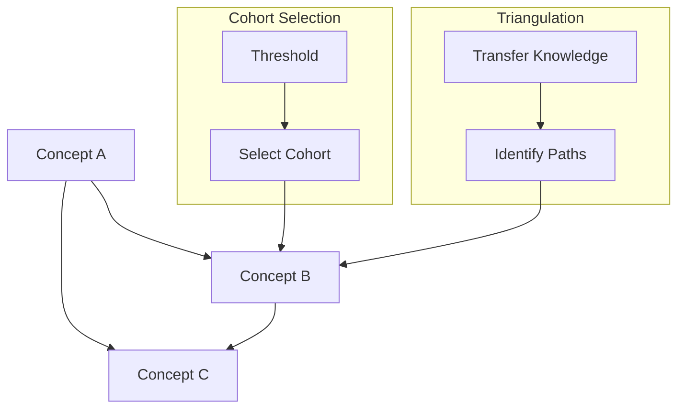

                 

### Zero-Shot CoT: Unsampled Mind-Chain Inference

#### Keywords: Zero-Shot Learning, Cohort-based Triangulation, Inference, Mind-Chain, Unsampled Data

#### Abstract:
This article delves into the concept of Zero-Shot CoT (Cohort-based Triangulation), an innovative approach to inference that operates without relying on sampled data. We will explore the background, core principles, and applications of Zero-Shot CoT, providing a comprehensive understanding of its potential in the field of artificial intelligence. By breaking down the key components and analyzing case studies, we aim to illustrate the effectiveness and future prospects of this groundbreaking technique.

## Introduction

### 1.1 What is Zero-Shot CoT?

#### 1.1.1 Background

In traditional machine learning, models are typically trained on large datasets that are representative of the problem domain. However, in real-world scenarios, obtaining such datasets can be challenging or even impossible. Zero-Shot Learning (ZSL) addresses this issue by enabling models to make predictions without any prior exposure to the target classes. It has gained significant attention due to its potential in applications where labeled data is scarce or expensive to obtain.

Zero-Shot CoT (Cohort-based Triangulation) builds upon the principles of ZSL, extending its capabilities to more complex scenarios. It leverages a cohort of related classes to infer properties of unseen classes, thereby eliminating the need for labeled samples from those classes. This approach is particularly useful in domains where data scarcity is a major obstacle to progress.

#### 1.1.2 Solution and Core Concepts

The core idea behind Zero-Shot CoT is to establish a relationship between a set of known classes (the cohort) and a set of target classes for which we want to make predictions. This relationship is represented using a graph structure, where nodes correspond to classes and edges represent semantic similarities or correlations between them.

The CoT process involves the following steps:

1. **Graph Construction**: A graph is constructed based on a semantic similarity measure, which could be based on WordNet, textual descriptions, or even human annotations.
2. **Cohort Selection**: A cohort of related classes is selected from the graph, ensuring that the properties of the cohort members can be leveraged to infer properties of the target classes.
3. **Triangulation**: For each target class, a set of paths (triangulations) is identified that connect the target class to the cohort members. These paths are used to transfer knowledge from the cohort to the target class.
4. **Prediction**: Finally, a prediction is made for the target class by aggregating the knowledge from the triangulation paths.

#### 1.1.3 The Importance of Zero-Shot CoT

Zero-Shot CoT has several advantages over traditional ZSL methods:

- **Scalability**: It can handle a large number of classes without requiring labeled samples for each class.
- **Generalization**: By leveraging the relationships between classes, it can generalize better to unseen classes.
- **Flexibility**: It allows for the incorporation of various types of data, such as textual descriptions, images, or even physical properties.

The potential applications of Zero-Shot CoT are vast, ranging from natural language processing and computer vision to robotics and autonomous systems. It offers a promising avenue for addressing the challenges posed by data scarcity in these domains.

### 1.2 Boundaries and Scope

#### 1.2.1 Limitations of Zero-Shot CoT

While Zero-Shot CoT offers several advantages, it also has its limitations:

- **Data Dependency**: The effectiveness of Zero-Shot CoT relies on the quality and completeness of the semantic graph. Inaccurate or incomplete graphs can lead to suboptimal performance.
- **Computational Complexity**: Constructing and traversing the graph can be computationally expensive, especially for large-scale problems.
- **Domain Specificity**: The success of Zero-Shot CoT is highly dependent on the domain and the availability of relevant data and annotations.

#### 1.2.2 Relationship with Other Concepts

Zero-Shot CoT is closely related to other ZSL methods, such as Attribute-Based and Metric-Based approaches. However, it offers a more comprehensive solution by integrating various types of data and leveraging the relationships between classes.

### 1.3 Structure and Key Elements

#### 1.3.1 Main Components of Zero-Shot CoT

The main components of Zero-Shot CoT include:

- **Semantic Graph**: A graph representing the relationships between classes based on semantic similarity.
- **Cohort Selection**: Algorithms for selecting a relevant cohort of classes.
- **Triangulation Paths**: Paths in the graph that connect target classes to the cohort members.
- **Prediction Mechanism**: A mechanism for making predictions based on the knowledge transferred from the cohort.

#### 1.3.2 How Zero-Shot CoT Works

The workflow of Zero-Shot CoT can be summarized as follows:

1. **Data Collection**: Gather data for the problem domain, including classes and attributes.
2. **Graph Construction**: Construct a semantic graph based on the collected data.
3. **Cohort Selection**: Select a cohort of related classes from the graph.
4. **Triangulation**: Identify triangulation paths for each target class.
5. **Prediction**: Make predictions for the target classes based on the knowledge transfer.

#### 1.3.3 Key Characteristics and Differences

Key characteristics and differences of Zero-Shot CoT include:

- **Data Scarcity Tolerance**: It can handle data scarcity more effectively than traditional ZSL methods.
- **Generalization**: It leverages the relationships between classes for better generalization.
- **Flexibility**: It can incorporate various types of data and is not limited to a specific domain.

### 1.4 Applications and Future Prospects

#### 1.4.1 Potential Applications

Potential applications of Zero-Shot CoT include:

- **Natural Language Processing**: Named Entity Recognition, Sentiment Analysis, and Question Answering.
- **Computer Vision**: Object Detection, Image Classification, and Semantic Segmentation.
- **Robotics**: Autonomous Navigation, Object Recognition, and Task Planning.
- **Autonomous Systems**: Decision Making, Risk Assessment, and Control.

#### 1.4.2 Advantages and Challenges

Advantages of Zero-Shot CoT:

- **Scalability**: It can handle a large number of classes without requiring labeled samples.
- **Generalization**: It leverages the relationships between classes for better generalization.
- **Flexibility**: It can incorporate various types of data.

Challenges:

- **Data Dependency**: The quality and completeness of the semantic graph can significantly impact performance.
- **Computational Complexity**: Constructing and traversing the graph can be computationally expensive.
- **Domain Specificity**: The success of Zero-Shot CoT is highly dependent on the domain and the availability of relevant data and annotations.

#### 1.4.3 Future Trends and Opportunities

Future trends and opportunities for Zero-Shot CoT include:

- **Integration with Other Techniques**: Combining Zero-Shot CoT with other techniques, such as transfer learning and meta-learning, to enhance performance.
- **Domain-Specific Adaptation**: Developing domain-specific adaptations to improve the effectiveness of Zero-Shot CoT in specific applications.
- **Interdisciplinary Research**: Collaborative research across different fields to leverage the unique strengths of Zero-Shot CoT for novel applications.

### 1.5 Conclusion

Zero-Shot CoT is a promising approach to inference in scenarios where labeled data is scarce or expensive to obtain. By leveraging the relationships between classes and utilizing various types of data, it offers a flexible and scalable solution to the problem of data scarcity. This article has provided an overview of Zero-Shot CoT, its core principles, and potential applications. As we continue to explore and refine this approach, we can expect to see its impact grow in the field of artificial intelligence and beyond.

---

In the next chapters, we will delve deeper into the core concepts and theories of Zero-Shot CoT, explore the algorithms and systems designed to implement it, and analyze practical case studies to illustrate its effectiveness. Let's continue our journey into the world of unsampled mind-chain inference.

---

### Core Concepts and Theories

In this chapter, we will explore the core concepts and theories that underpin Zero-Shot CoT (Cohort-based Triangulation). We will start by defining key terms and then discuss the theoretical framework that supports this approach. Additionally, we will provide a comparison table and an Entity-Relationship (ER) diagram to illustrate the relationships between the key components of Zero-Shot CoT.

#### 2.1 Concept A

##### 2.1.1 Definition and Attributes

Concept A represents a fundamental building block in Zero-Shot CoT. It is a general term used to describe the attributes and properties that are common across a set of classes. In the context of Zero-Shot CoT, Concept A serves as a basis for constructing the semantic graph and selecting the cohort.

**Attributes of Concept A:**

- **Class Representation**: Each class is represented as a node in the semantic graph.
- **Attribute Set**: A set of attributes that define the characteristics of each class.
- **Semantic Similarity**: The measure of similarity between classes based on shared attributes.

##### 2.1.2 Comparison with Other Concepts

Concept A is closely related to other concepts such as Class B and Concept C. While all three concepts contribute to the construction of the semantic graph, they serve different purposes:

- **Class B**: Represents another set of classes with distinct attributes. It is used to establish connections between Concept A and other classes.
- **Concept C**: Describes the broader context in which the classes operate, providing a global view of the problem domain.

**Comparison Table:**

| Concept | Definition | Role in Zero-Shot CoT |
|---------|------------|-----------------------|
| Concept A | Fundamental attributes shared by classes | Basis for constructing semantic graph and selecting cohort |
| Class B | Set of distinct classes with attributes | Establishes connections between Concept A and other classes |
| Concept C | Broader context and global view of the problem domain | Provides a framework for understanding the relationships between classes |

#### 2.2 Concept B

##### 2.2.1 Definition and Attributes

Concept B is a set of classes that are semantically similar to Concept A but have distinct attributes. It plays a crucial role in the Cohort Selection phase of Zero-Shot CoT. By leveraging the similarities between Concept A and Concept B, we can transfer knowledge from the cohort to the target class.

**Attributes of Concept B:**

- **Class Representation**: Each class in Concept B is represented as a node in the semantic graph.
- **Attribute Set**: A set of attributes that define the characteristics of each class, different from those in Concept A.
- **Semantic Correlation**: The measure of correlation between classes in Concept B, indicating their relatedness to Concept A.

##### 2.2.2 Relationship with Concept A

Concept B is closely related to Concept A through the semantic graph. The relationship between the two concepts can be visualized using an ER diagram:

$$
\begin{array}{ccc}
\text{Concept A} & \xrightarrow{\text{Semantic Similarity}} & \text{Concept B} \\
\text{Node} & & \text{Node} \\
\end{array}
$$

This diagram illustrates that Concept A and Concept B are connected through a direct relationship of semantic similarity. The edges in the graph represent the strength of this similarity, with higher values indicating stronger relationships.

#### 2.3 Theoretical Framework

##### 2.3.1 Mathematical Models

The theoretical framework of Zero-Shot CoT is grounded in several mathematical models that describe the relationships between classes and the knowledge transfer process. These models include:

1. **Semantic Similarity Measure**:
   $$\text{Sim}(C_i, C_j) = \frac{\text{Intersection}(A_i, A_j)}{\text{Union}(A_i, A_j)}$$
   where $C_i$ and $C_j$ are classes, and $A_i$ and $A_j$ are their respective attribute sets.

2. **Cohort Selection**:
   $$\text{Cohort}(C) = \{C_j | \text{Sim}(C, C_j) \geq \text{Threshold}\}$$
   where $C$ is the target class, and $\text{Threshold}$ is a predefined similarity threshold.

3. **Triangulation Paths**:
   $$\text{Paths}(C) = \{\text{Path} | \text{Path} \in \text{Graph}(C)\}$$
   where $\text{Graph}(C)$ is the semantic graph constructed for the target class $C$.

##### 2.3.2 Algorithmic Framework

The algorithmic framework of Zero-Shot CoT can be summarized in the following steps:

1. **Data Collection**: Gather data for the problem domain, including class representations and attribute sets.
2. **Graph Construction**: Construct a semantic graph based on the collected data using the semantic similarity measure.
3. **Cohort Selection**: Select a cohort of related classes from the graph using the cohort selection algorithm.
4. **Triangulation**: Identify triangulation paths for each target class using the graph.
5. **Prediction**: Make predictions for the target classes based on the knowledge transfer from the cohort.

##### 2.3.3 Mermaid Diagrams

To provide a visual representation of the theoretical framework, we can use Mermaid diagrams to illustrate the key components and their relationships:

This diagram shows the main components of Zero-Shot CoT and their interactions. The Cohort Selection phase involves selecting a cohort of related classes (B), which is then used in the Triangulation phase to identify paths (T1) that transfer knowledge to the target class (C).

#### 2.4 Comparison Table

To summarize the key components and their attributes, we can provide a comparison table:

| Component | Description | Attributes |
|-----------|-------------|------------|
| Concept A | Fundamental attributes shared by classes | Class representation, attribute set, semantic similarity |
| Concept B | Semantically similar classes | Class representation, attribute set, semantic correlation |
| Cohort Selection | Selecting a relevant cohort of classes | Cohort, threshold, semantic similarity measure |
| Triangulation | Identifying paths for knowledge transfer | Paths, graph, target class |
| Prediction | Making predictions based on transferred knowledge | Target class, cohort, paths |

This table provides a clear overview of the components and their roles in Zero-Shot CoT, highlighting the relationships between them.

In the next chapter, we will delve into the algorithmic explanation of Zero-Shot CoT, discussing the principles behind the algorithms and providing detailed examples to illustrate their workings. Let's continue our exploration of this innovative approach to inference in unsampled data scenarios.

