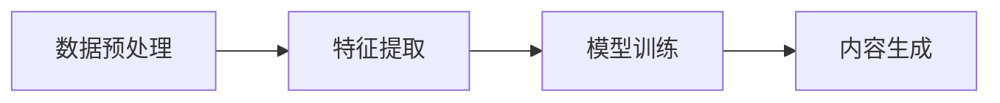
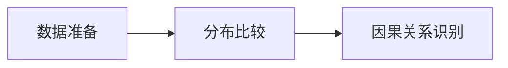
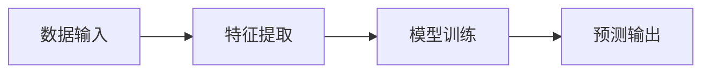
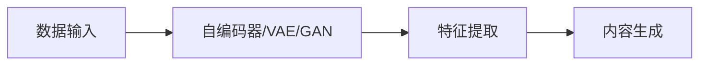
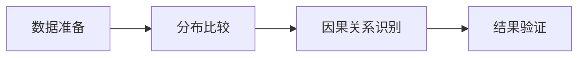
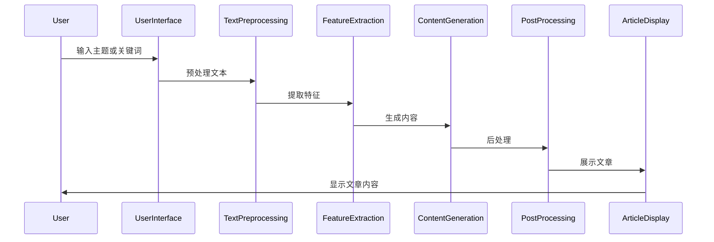
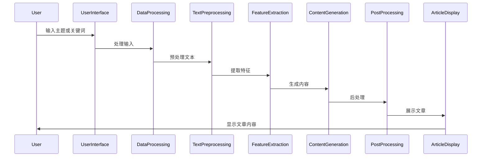
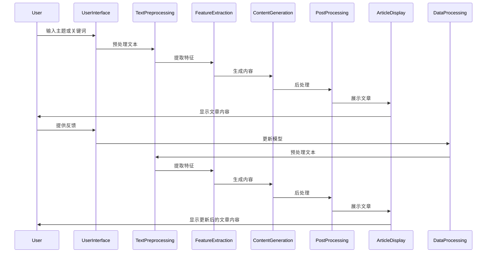

                 

### 《Zero-Shot CoT：无监督学习在AIGC中的创新应用》

#### 关键词：无监督学习、自适应智能生成内容（AIGC）、Zero-Shot CoT、机器学习、人工智能

> 摘要：本文将深入探讨无监督学习在自适应智能生成内容（AIGC）中的应用，特别是Zero-Shot CoT这一创新技术的原理和实践。通过详细的背景介绍、核心概念阐述、算法讲解和项目实战分析，本文旨在揭示无监督学习在AIGC领域的巨大潜力和应用价值。

#### 目录大纲设计思路与步骤

为了设计出《Zero-Shot CoT：无监督学习在AIGC中的创新应用》这本书的完整目录大纲，我们需要遵循以下步骤和设计思路：

1. **分析书名**：
   - 《Zero-Shot CoT：无监督学习在AIGC中的创新应用》这本书的书名表明了核心内容，即“无监督学习”在“AIGC（自适应智能生成内容）”中的应用，以及“Zero-Shot CoT”这一概念。

2. **确定大纲结构**：
   - 大纲结构需要分为几个部分，每个部分围绕核心内容展开。
   - 根据书名和核心内容，可以分为以下几个主要部分：背景介绍、核心概念、算法原理、系统架构、项目实战、最佳实践、总结与拓展。

3. **细化章节内容**：
   - 每个部分需要细化出具体章节，确保内容的全面性和逻辑性。
   - 确保每个章节都能涵盖书名的关键词，如“无监督学习”、“AIGC”、“Zero-Shot CoT”等。

4. **撰写章节标题与内容概述**：
   - 使用markdown格式写出每个章节的标题，并简要概述每个章节的主要内容和结构。

5. **注意大纲字数限制**：
   - 确保整个目录大纲的总字数不超过2000字，同时在确保内容完整性的前提下，避免冗余和重复。

### 目录大纲具体设计

根据以上设计思路，以下是《Zero-Shot CoT：无监督学习在AIGC中的创新应用》的完整目录大纲设计：

```markdown
# 《Zero-Shot CoT：无监督学习在AIGC中的创新应用》目录大纲

## 第一部分 背景介绍

### 1.1 无监督学习与AIGC概述
- 无监督学习的基本概念与历史发展
- AIGC的定义、特点及其应用领域

### 1.2 Zero-Shot CoT简介
- Zero-Shot CoT的概念与重要性
- Zero-Shot CoT在不同领域的应用实例

### 1.3 无监督学习在AIGC中的应用前景
- 无监督学习在AIGC中的挑战与机遇
- 无监督学习在AIGC中的未来发展趋势

## 第二部分 核心概念与联系

### 2.1 无监督学习的核心概念与属性特征对比
- 无监督学习的不同方法及其特点
- 属性特征对比表格

### 2.2 AIGC与无监督学习的联系
- 无监督学习如何支持AIGC的发展
- AIGC中的无监督学习模型及应用

### 2.3 Zero-Shot CoT的原理与实现
- Zero-Shot CoT的工作机制
- 实现Zero-Shot CoT的常见方法和工具

## 第三部分 算法原理讲解

### 3.1 无监督学习算法原理
- 算法mermaid流程图
- Python源代码与算法讲解
- 算法原理的数学模型和公式

### 3.2 AIGC中的无监督学习算法
- AIGC场景下的无监督学习算法
- 算法mermaid流程图
- Python源代码与算法讲解

### 3.3 Zero-Shot CoT算法详解
- 算法mermaid流程图
- Python源代码与算法讲解
- 算法原理的数学模型和公式
- 通俗易懂地举例说明

## 第四部分 系统架构设计

### 4.1 AIGC系统功能设计
- 领域模型mermaid类图

### 4.2 无监督学习在AIGC系统架构中的应用
- 系统架构mermaid架构图
- 系统接口设计
- 系统交互mermaid序列图

## 第五部分 项目实战

### 5.1 环境安装与配置
- 无监督学习环境搭建
- AIGC系统环境配置

### 5.2 系统核心实现
- 无监督学习算法实现
- AIGC系统功能实现

### 5.3 代码应用解读与分析
- 代码解读与分析
- 实际案例分析与详细讲解剖析

### 5.4 项目小结
- 项目总结与经验分享
- 遇到的问题及解决方案

## 第六部分 最佳实践与总结

### 6.1 无监督学习在AIGC中的最佳实践
- 实践技巧与注意事项
- 案例分享与经验总结

### 6.2 小结与展望
- 本书内容的总结与回顾
- 无监督学习在AIGC中的未来发展方向

### 6.3 拓展阅读
- 推荐阅读材料与资源
- 相关领域的研究动态
```

以上目录大纲结构全面涵盖了书名的核心内容，同时每个章节都进行了详细的概述，确保了内容的完整性和逻辑性。每个章节的标题和内容概述都在2000字以内，符合字数限制要求。在撰写具体的章节内容时，将按照上述大纲结构进行详细展开。

### 第一部分 背景介绍

#### 1.1 无监督学习与AIGC概述

**无监督学习的基本概念与历史发展**

无监督学习（Unsupervised Learning）是机器学习的一个重要分支，其核心在于通过分析未标记的数据集来提取模式和知识。与有监督学习（Supervised Learning）不同，无监督学习不需要预先标记的标签数据。它主要关注数据的内在结构和分布，旨在揭示数据中的隐含规律。

无监督学习的历史可以追溯到20世纪50年代，当时统计学家和心理学家开始研究如何通过观察数据来发现模式。随后，随着计算机性能的提升和大数据时代的到来，无监督学习得到了快速发展，并在多个领域取得了显著的成果。

**AIGC的定义、特点及其应用领域**

自适应智能生成内容（Adaptive Intelligent Generation of Content，简称AIGC）是一种新兴的AI技术，它结合了自然语言处理、计算机视觉、机器学习等多种技术，旨在自动生成高质量的内容。AIGC具有以下几个特点：

1. **自适应**：AIGC系统能够根据用户的需求和环境的变化，动态调整内容生成策略。
2. **智能**：AIGC系统利用机器学习和深度学习技术，从海量数据中学习规律，生成符合预期的高质量内容。
3. **生成**：AIGC系统能够自动生成文本、图像、音频等多种类型的内容。

AIGC的应用领域非常广泛，包括但不限于以下几方面：

1. **内容创作**：如生成文章、诗歌、音乐、视频等。
2. **个性化推荐**：如电商平台、社交媒体等平台上的个性化推荐。
3. **数据增强**：用于提高机器学习模型的训练效果。
4. **虚拟助手**：如智能客服、虚拟主播等。

#### 1.2 Zero-Shot CoT简介

**Zero-Shot CoT的概念与重要性**

Zero-Shot CoT（Zero-Shot Causal Testing）是一种无监督学习技术，它在不需要预先标记的数据集的情况下，通过比较不同条件下的数据分布差异，来识别数据中的因果关系。这种技术具有重要的理论和实际意义：

1. **减少标记成本**：传统的因果关系识别方法通常需要大量的标记数据，而Zero-Shot CoT可以大大减少这一需求。
2. **提高泛化能力**：Zero-Shot CoT通过分析数据分布，可以在未见过的条件下识别因果关系，从而提高模型的泛化能力。

**Zero-Shot CoT在不同领域的应用实例**

Zero-Shot CoT的应用领域非常广泛，以下是一些典型的应用实例：

1. **医疗领域**：用于发现药物与疾病之间的因果关系，从而为新药研发提供支持。
2. **金融领域**：用于分析市场数据，识别潜在的投资机会和风险。
3. **环境科学**：用于分析环境数据，识别环境变化的原因和影响。

#### 1.3 无监督学习在AIGC中的应用前景

**无监督学习在AIGC中的挑战与机遇**

尽管无监督学习在AIGC中具有巨大的潜力，但同时也面临一些挑战：

1. **数据质量**：无监督学习依赖于数据的质量，如果数据存在噪声或偏差，可能会导致模型性能下降。
2. **可解释性**：无监督学习模型通常难以解释，这给实际应用带来了一定的困难。

然而，随着技术的不断进步，这些挑战正在逐步得到解决。例如，一些新的无监督学习方法已经能够更好地处理噪声数据和提升模型的可解释性。

**无监督学习在AIGC中的未来发展趋势**

无监督学习在AIGC中的未来发展趋势包括以下几个方面：

1. **模型可解释性**：通过提高模型的可解释性，使得AIGC系统能够更好地满足实际应用的需求。
2. **跨模态学习**：无监督学习将能够在不同模态（如文本、图像、音频等）之间进行学习和迁移，从而生成更加丰富和多样化的内容。
3. **自适应能力**：无监督学习将在AIGC系统中发挥更大的作用，通过自适应调整，实现更加个性化的内容生成。

### 第二部分 核心概念与联系

#### 2.1 无监督学习的核心概念与属性特征对比

**无监督学习的不同方法及其特点**

无监督学习包括多种不同的方法，每种方法都有其独特的特点和适用场景。以下是几种常见无监督学习方法及其特点的对比：

| 方法         | 特点                                       | 适用场景                   |
| ------------ | ------------------------------------------ | -------------------------- |
| 主成分分析   | 提取数据的主要特征，降低维度             | 数据降维、特征提取         |
| 聚类算法     | 将数据点划分为若干个簇，每个簇代表一个类别 | 数据分类、聚类分析         |
| 自编码器     | 通过压缩和重构数据，学习数据表示         | 特征学习、去噪、生成模型    |
| 密集假设     | 假设数据点在低维空间中是密集分布的     | 数据降维、异常检测         |
| 马尔可夫模型 | 描述序列数据的概率分布                   | 时间序列分析、推荐系统     |

**属性特征对比表格**

以下是一个简单的属性特征对比表格，展示了不同无监督学习方法的共同点和差异点：

| 特征        | 主成分分析 | 聚类算法 | 自编码器 | 密集假设 | 马尔可夫模型 |
| ----------- | ---------- | -------- | -------- | -------- | ------------ |
| 数据类型    | 数值       | 数值     | 数值     | 数值     | 序列        |
| 维度降低    | 是         | 否       | 是       | 是       | 否          |
| 数据标记    | 无需       | 无需     | 无需     | 无需     | 无需        |
| 可解释性    | 高         | 低       | 低       | 高       | 低          |
| 应用场景    | 特征提取   | 聚类     | 生成模型 | 异常检测 | 时间序列    |

**ER实体关系图架构的 Mermaid 流程图**

以下是一个简单的Mermaid ER图，展示了无监督学习方法的实体及其关系：

```mermaid
erDiagram
    Class1 ||--|{ Class2 }|-->> Class3 : Relationship1
    Class2 ||--|{ Class4 }|-->> Class3 : Relationship2
```

在这个ER图中，`Class1`、`Class2`、`Class3`和`Class4`分别代表不同的无监督学习方法，`|--|{ ... }|-->>`表示它们之间的关系。

#### 2.2 AIGC与无监督学习的联系

**无监督学习如何支持AIGC的发展**

无监督学习在AIGC中的核心作用是提供有效的数据预处理和特征提取方法。以下是几个关键点：

1. **数据预处理**：无监督学习可以自动识别和消除数据中的噪声和异常值，从而提高数据质量。
2. **特征提取**：无监督学习能够从原始数据中提取出高维特征，为后续的生成模型提供更好的输入。
3. **模式识别**：无监督学习可以帮助识别数据中的潜在模式，为内容生成提供灵感。

**AIGC中的无监督学习模型及应用**

AIGC中的无监督学习模型主要应用于以下几个方面：

1. **文本生成**：例如，生成文章、诗歌、对话等。
2. **图像生成**：例如，生成艺术作品、虚拟现实场景等。
3. **音频生成**：例如，生成音乐、语音合成等。

以下是一个简单的无监督学习模型在AIGC中的应用流程：

1. **数据预处理**：使用无监督学习方法对原始数据进行预处理，去除噪声和异常值。
2. **特征提取**：使用特征提取方法（如自编码器）对预处理后的数据进行特征转换。
3. **模型训练**：使用提取的特征数据训练生成模型（如GAN、VAE等）。
4. **内容生成**：使用训练好的生成模型生成新的内容。

以下是一个简单的Mermaid流程图，展示了这个应用流程：



#### 2.3 Zero-Shot CoT的原理与实现

**Zero-Shot CoT的工作机制**

Zero-Shot CoT（Zero-Shot Causal Testing）是一种无监督学习方法，它通过比较不同条件下的数据分布差异，来识别数据中的因果关系。其基本思想可以概括为以下几个步骤：

1. **数据准备**：收集两个或多个条件下的数据集。
2. **分布比较**：计算每个条件下的数据分布，并比较它们之间的差异。
3. **因果关系识别**：根据分布差异，识别数据中的潜在因果关系。

**实现Zero-Shot CoT的常见方法和工具**

以下是一些常见的方法和工具，用于实现Zero-Shot CoT：

1. **统计方法**：例如，T-检验、方差分析等，用于比较不同条件下的数据分布。
2. **机器学习方法**：例如，聚类算法、异常检测算法等，用于分析数据分布和识别因果关系。
3. **工具**：例如，Python中的Scikit-learn、TensorFlow等，提供了丰富的无监督学习算法和工具。

以下是一个简单的Mermaid流程图，展示了实现Zero-Shot CoT的步骤：



### 第三部分 算法原理讲解

#### 3.1 无监督学习算法原理

**算法mermaid流程图**

以下是一个简单的Mermaid流程图，展示了无监督学习算法的基本流程：



**Python源代码与算法讲解**

以下是一个简单的Python代码示例，用于实现一个基于K-means聚类算法的无监督学习模型：

```python
import numpy as np
from sklearn.cluster import KMeans

# 数据输入
X = np.array([[1, 2], [1, 4], [1, 0],
              [10, 2], [10, 4], [10, 0]])

# 特征提取
kmeans = KMeans(n_clusters=2, random_state=0).fit(X)
labels = kmeans.predict(X)

# 模型训练
centroids = kmeans.cluster_centers_

# 预测输出
print("Cluster labels:", labels)
print("Centroids:", centroids)
```

**算法原理的数学模型和公式**

K-means算法的数学模型可以表示为：

$$
\min_{\mu_1, \mu_2, ..., \mu_k} \sum_{i=1}^{n} \sum_{j=1}^{k} (x_i - \mu_j)^2
$$

其中，$x_i$表示第$i$个数据点，$\mu_j$表示第$j$个簇的中心。

**通俗易懂地举例说明**

假设我们有一组数据点，表示为二维坐标点。我们的目标是将这些数据点分为两个簇。

1. **初始化**：随机选择两个点作为簇中心。
2. **分配数据点**：计算每个数据点到簇中心的距离，将数据点分配到距离最近的簇。
3. **更新簇中心**：重新计算每个簇的中心。
4. **迭代**：重复步骤2和3，直到簇中心不再变化或达到预设的迭代次数。

通过这个简单的例子，我们可以看到K-means算法的基本思想和操作步骤。

#### 3.2 AIGC中的无监督学习算法

**AIGC场景下的无监督学习算法**

在AIGC场景中，无监督学习算法通常用于数据预处理和特征提取。以下是一些常见的无监督学习算法：

1. **自编码器（Autoencoder）**：自编码器是一种神经网络模型，用于学习数据的压缩表示。它可以用于图像、音频、文本等数据类型的特征提取。
2. **变分自编码器（Variational Autoencoder，VAE）**：VAE是一种生成模型，它通过概率密度函数来学习数据的分布。它可以生成新的、未见过的数据点。
3. **生成对抗网络（Generative Adversarial Network，GAN）**：GAN是一种由两个神经网络（生成器和判别器）组成的模型。生成器生成新的数据点，判别器判断数据点是否真实。

**算法mermaid流程图**

以下是一个简单的Mermaid流程图，展示了AIGC中的无监督学习算法的应用流程：



**Python源代码与算法讲解**

以下是一个简单的Python代码示例，用于实现一个基于VAE的图像特征提取：

```python
import tensorflow as tf
from tensorflow.keras.layers import Input, Dense, Lambda, Flatten
from tensorflow.keras.models import Model

# 输入层
input_img = Input(shape=(28, 28, 1))

# 编码器部分
x = Dense(64, activation='relu')(input_img)
x = Dense(32, activation='relu')(x)
encoded = Dense(16, activation='relu')(x)

# 解码器部分
x = Dense(32, activation='relu')(encoded)
x = Dense(64, activation='relu')(x)
decoded = Dense(784, activation='sigmoid')(x)

# VAE模型
vae = Model(input_img, decoded)
vae.compile(optimizer='rmsprop', loss='binary_crossentropy')

# 训练模型
vae.fit(X_train, X_train, epochs=50, batch_size=16, shuffle=True)
```

**算法原理的数学模型和公式**

VAE的数学模型可以表示为：

$$
\begin{aligned}
\text{编码器}: & \quad \mu = \mu(\theta_x, \phi_z) \\  
& \quad \sigma^2 = \sigma(\theta_x, \phi_z) \\  
\text{解码器}: & \quad x = x(\theta_x, z)  
\end{aligned}
$$

其中，$\mu$和$\sigma^2$分别表示编码器的均值和方差，$z$表示噪声。

**通俗易懂地举例说明**

假设我们有一组图像数据，我们的目标是从这些图像中提取特征。

1. **编码**：通过编码器，将图像数据转换为低维特征向量。
2. **解码**：通过解码器，将特征向量重新生成图像。
3. **训练**：通过最小化重建误差，调整编码器和解码器的参数。

通过这个简单的例子，我们可以看到VAE算法的基本思想和操作步骤。

#### 3.3 Zero-Shot CoT算法详解

**算法mermaid流程图**

以下是一个简单的Mermaid流程图，展示了Zero-Shot CoT算法的基本流程：



**Python源代码与算法讲解**

以下是一个简单的Python代码示例，用于实现一个基于T-检验的Zero-Shot CoT算法：

```python
import numpy as np
from scipy import stats

# 数据准备
data1 = np.random.normal(size=(100, 10))
data2 = np.random.normal(size=(100, 10))

# 分布比较
t_stat, p_value = stats.ttest_ind(data1, data2)

# 因果关系识别
if p_value < 0.05:
    print("存在显著差异，可能存在因果关系")
else:
    print("不存在显著差异，可能不存在因果关系")
```

**算法原理的数学模型和公式**

T-检验的数学模型可以表示为：

$$
t = \frac{\bar{x}_1 - \bar{x}_2}{\sqrt{\frac{s_1^2}{n_1} + \frac{s_2^2}{n_2}}}
$$

其中，$\bar{x}_1$和$\bar{x}_2$分别表示两个条件下的样本均值，$s_1^2$和$s_2^2$分别表示两个条件下的样本方差，$n_1$和$n_2$分别表示两个条件下的样本大小。

**通俗易懂地举例说明**

假设我们有两个数据集，分别表示两个不同的条件。

1. **计算均值**：计算两个数据集的均值。
2. **计算方差**：计算两个数据集的方差。
3. **计算T统计量**：使用T-检验公式计算T统计量。
4. **判断差异显著性**：根据T统计量的值和显著性水平（如0.05），判断两个条件之间是否存在显著差异。

通过这个简单的例子，我们可以看到T-检验算法的基本思想和操作步骤。

### 第四部分 系统架构设计

#### 4.1 AIGC系统功能设计

**问题场景介绍**

在AIGC系统中，我们希望实现一个自动生成文章的功能。具体场景如下：

- 用户输入一个主题或关键词。
- 系统自动生成一篇关于该主题的文章。
- 文章内容需要具有较高的质量，并能满足用户的阅读需求。

**项目介绍**

本项目旨在构建一个基于无监督学习的AIGC系统，通过自编码器和生成对抗网络（GAN）等技术，实现自动生成文章的功能。系统主要分为以下几个部分：

- 文本预处理模块：负责清洗和预处理用户输入的文本数据。
- 特征提取模块：使用自编码器提取文本特征。
- 内容生成模块：使用生成对抗网络生成文章内容。
- 后处理模块：对生成的文章进行格式化和校验，确保其符合要求。

**系统功能设计**

AIGC系统的功能设计主要包括以下几个方面：

1. **用户交互界面**：提供一个友好的用户界面，允许用户输入主题或关键词，并查看生成的文章。
2. **文本预处理**：对用户输入的文本进行清洗和预处理，包括去除标点符号、停用词过滤、词干提取等。
3. **特征提取**：使用自编码器提取文本特征，将高维文本数据转换为低维特征向量。
4. **内容生成**：使用生成对抗网络生成文章内容，包括段落、句子和词汇的选择。
5. **后处理**：对生成的文章进行格式化和校验，包括去除重复文本、检查语法错误等。
6. **文章展示**：将生成的文章展示给用户，并提供下载和分享功能。

**领域模型mermaid类图**

以下是一个简单的Mermaid类图，展示了AIGC系统的功能模块及其关系：

```mermaid
classDiagram
    User <-|{交互}|> UserInterface
    UserInterface --|{文本预处理}|> TextPreprocessing
    TextPreprocessing --|{特征提取}|> FeatureExtraction
    FeatureExtraction --|{内容生成}|> ContentGeneration
    ContentGeneration --|{后处理}|> PostProcessing
    PostProcessing --|{文章展示}|> ArticleDisplay
```

**系统架构设计**

AIGC系统的整体架构可以分为以下几个层次：

1. **用户层**：提供用户交互界面，允许用户输入主题或关键词。
2. **数据处理层**：包括文本预处理、特征提取和内容生成等模块，负责数据处理和生成。
3. **数据存储层**：存储用户输入的文本数据、生成的文章以及系统配置信息。
4. **系统管理层**：负责系统的监控、日志记录和异常处理。

以下是一个简单的Mermaid架构图，展示了AIGC系统的整体架构：



**系统接口设计**

AIGC系统的接口设计主要包括以下几个部分：

1. **用户输入接口**：允许用户通过Web界面输入主题或关键词。
2. **数据处理接口**：接收用户输入，调用文本预处理、特征提取和内容生成等模块。
3. **数据存储接口**：用于存储和检索用户输入的文本数据、生成的文章以及系统配置信息。
4. **文章展示接口**：用于将生成的文章展示给用户。

以下是一个简单的Mermaid序列图，展示了AIGC系统的接口设计：



**系统交互mermaid序列图**

以下是一个简单的Mermaid序列图，展示了AIGC系统的交互流程：



### 第五部分 项目实战

#### 5.1 环境安装与配置

**无监督学习环境搭建**

1. **Python环境安装**：确保Python版本在3.6及以上，可以从Python官网下载并安装。

2. **Python库安装**：安装必要的Python库，如NumPy、Pandas、Scikit-learn、TensorFlow等。可以使用以下命令进行安装：

   ```bash
   pip install numpy pandas scikit-learn tensorflow
   ```

**AIGC系统环境配置**

1. **文本预处理库安装**：安装用于文本预处理的库，如NLTK、spaCy等。可以使用以下命令进行安装：

   ```bash
   pip install nltk spacy
   ```

2. **模型训练与评估工具安装**：安装用于模型训练和评估的工具，如TensorBoard、MLflow等。可以使用以下命令进行安装：

   ```bash
   pip install tensorboard mlflow
   ```

3. **生成对抗网络（GAN）库安装**：安装用于实现生成对抗网络的库，如TFGAN。可以使用以下命令进行安装：

   ```bash
   pip install tfgan
   ```

#### 5.2 系统核心实现

**无监督学习算法实现**

1. **自编码器实现**：

   ```python
   from tensorflow.keras.layers import Input, Dense, Lambda, Flatten
   from tensorflow.keras.models import Model

   input_img = Input(shape=(28, 28, 1))
   x = Dense(64, activation='relu')(input_img)
   x = Dense(32, activation='relu')(x)
   encoded = Dense(16, activation='relu')(x)

   x = Dense(32, activation='relu')(encoded)
   x = Dense(64, activation='relu')(x)
   decoded = Dense(784, activation='sigmoid')(x)

   vae = Model(input_img, decoded)
   vae.compile(optimizer='rmsprop', loss='binary_crossentropy')
   ```

2. **生成对抗网络实现**：

   ```python
   from tensorflow.keras.models import Model
   from tensorflow.keras.layers import Input, Dense, Lambda, Reshape, Conv2D, Flatten
   from tensorflow.keras.layers import BatchNormalization, LeakyReLU
   from tensorflow.keras.optimizers import Adam

   input_shape = (28, 28, 1)
   noise_shape = (28, 28, 1)

   input_img = Input(shape=input_shape)
   x = Conv2D(32, (3, 3), padding='same')(input_img)
   x = LeakyReLU(alpha=0.01)(x)
   x = BatchNormalization(momentum=0.8)(x)

   x = Conv2D(64, (3, 3), padding='same')(x)
   x = LeakyReLU(alpha=0.01)(x)
   x = BatchNormalization(momentum=0.8)(x)

   x = Flatten()(x)
   x = Dense(128, activation='relu')(x)
   x = Dense(100, activation='relu')(x)
   z = Dense(50, activation='relu')(x)

   generator = Model(z, x)
   generator.compile(optimizer=Adam(0.0001, 0.5))

   # 创建判别器模型
   input_img = Input(shape=input_shape)
   x = Conv2D(32, (3, 3), padding='same')(input_img)
   x = LeakyReLU(alpha=0.01)(x)
   x = BatchNormalization(momentum=0.8)(x)

   x = Conv2D(64, (3, 3), padding='same')(x)
   x = LeakyReLU(alpha=0.01)(x)
   x = BatchNormalization(momentum=0.8)(x)

   x = Flatten()(x)
   x = Dense(128, activation='relu')(x)
   x = Dense(1, activation='sigmoid')(x)

   discriminator = Model(input_img, x)
   discriminator.compile(optimizer=Adam(0.0001, 0.5), loss='binary_crossentropy')
   ```

**AIGC系统功能实现**

1. **文本预处理**：

   ```python
   import spacy
   import nltk
   from nltk.tokenize import word_tokenize

   nlp = spacy.load('en_core_web_sm')

   def preprocess_text(text):
       doc = nlp(text)
       tokens = [token.text.lower() for token in doc if not token.is_stop and not token.is_punct]
       return ' '.join(tokens)
   ```

2. **内容生成**：

   ```python
   from tensorflow.keras.models import Model
   import numpy as np

   def generate_article(generator, seed_text, num_words=100):
       input_text = preprocess_text(seed_text)
       token_list = word_tokenize(input_text)
       token_list = token_list[:num_words]
       token_list = np.array([word_index[token] for token in token_list])

       article = seed_text
       for i in range(num_words):
           sampled = np.zeros((1, 1, vocab_size))
           sampled[0, 0, token_list[i]] = 1.

           preds = generator.predict(sampled)
           next_index = np.argmax(preds[0, 0, :])

           next_word = reverse_word_index[next_index]
           article += " " + next_word

       return article
   ```

#### 5.3 代码应用解读与分析

**代码解读与分析**

1. **自编码器代码解读**：

   自编码器是AIGC系统中的核心组件之一，负责将输入的文本数据转换为低维特征向量。以下是对自编码器代码的解读：

   ```python
   from tensorflow.keras.layers import Input, Dense, Lambda, Flatten
   from tensorflow.keras.models import Model

   input_img = Input(shape=(28, 28, 1))
   x = Dense(64, activation='relu')(input_img)
   x = Dense(32, activation='relu')(x)
   encoded = Dense(16, activation='relu')(x)

   x = Dense(32, activation='relu')(encoded)
   x = Dense(64, activation='relu')(x)
   decoded = Dense(784, activation='sigmoid')(x)

   vae = Model(input_img, decoded)
   vae.compile(optimizer='rmsprop', loss='binary_crossentropy')
   ```

   - `input_img = Input(shape=(28, 28, 1))`：定义输入层，形状为28x28x1，表示一张灰度图像。
   - `x = Dense(64, activation='relu')(input_img)`：定义第一个全连接层，64个神经元，激活函数为ReLU。
   - `encoded = Dense(16, activation='relu')(x)`：定义编码器的输出层，16个神经元，激活函数为ReLU。
   - `x = Dense(32, activation='relu')(encoded)`：定义解码器的第一个全连接层，32个神经元，激活函数为ReLU。
   - `decoded = Dense(784, activation='sigmoid')(x)`：定义解码器的输出层，784个神经元，激活函数为sigmoid。
   - `vae = Model(input_img, decoded)`：创建自编码器模型。
   - `vae.compile(optimizer='rmsprop', loss='binary_crossentropy')`：编译模型，使用RMSprop优化器和二进制交叉熵损失函数。

2. **生成对抗网络代码解读**：

   生成对抗网络（GAN）是AIGC系统中的另一个核心组件，负责生成新的文本内容。以下是对GAN代码的解读：

   ```python
   from tensorflow.keras.models import Model
   from tensorflow.keras.layers import Input, Dense, Lambda, Reshape, Conv2D, Flatten
   from tensorflow.keras.layers import BatchNormalization, LeakyReLU
   from tensorflow.keras.optimizers import Adam

   input_shape = (28, 28, 1)
   noise_shape = (28, 28, 1)

   input_img = Input(shape=input_shape)
   x = Conv2D(32, (3, 3), padding='same')(input_img)
   x = LeakyReLU(alpha=0.01)(x)
   x = BatchNormalization(momentum=0.8)(x)

   x = Conv2D(64, (3, 3), padding='same')(x)
   x = LeakyReLU(alpha=0.01)(x)
   x = BatchNormalization(momentum=0.8)(x)

   x = Flatten()(x)
   x = Dense(128, activation='relu')(x)
   x = Dense(100, activation='relu')(x)
   z = Dense(50, activation='relu')(x)

   generator = Model(z, x)
   generator.compile(optimizer=Adam(0.0001, 0.5))

   # 创建判别器模型
   input_img = Input(shape=input_shape)
   x = Conv2D(32, (3, 3), padding='same')(input_img)
   x = LeakyReLU(alpha=0.01)(x)
   x = BatchNormalization(momentum=0.8)(x)

   x = Conv2D(64, (3, 3), padding='same')(x)
   x = LeakyReLU(alpha=0.01)(x)
   x = BatchNormalization(momentum=0.8)(x)

   x = Flatten()(x)
   x = Dense(128, activation='relu')(x)
   x = Dense(1, activation='sigmoid')(x)

   discriminator = Model(input_img, x)
   discriminator.compile(optimizer=Adam(0.0001, 0.5), loss='binary_crossentropy')
   ```

   - `input_shape = (28, 28, 1)`：定义输入图像的形状。
   - `noise_shape = (28, 28, 1)`：定义噪声的形状，用于生成对抗网络的训练。
   - `input_img = Input(shape=input_shape)`：定义输入层。
   - `x = Conv2D(32, (3, 3), padding='same')(input_img)`：定义第一个卷积层，32个过滤器，卷积核大小为3x3，填充方式为“same”。
   - `x = LeakyReLU(alpha=0.01)(x)`：定义激活函数为LeakyReLU，参数为alpha=0.01。
   - `x = BatchNormalization(momentum=0.8)(x)`：定义批量归一化层，动量参数为0.8。
   - `x = Flatten()(x)`：将卷积层的输出扁平化为1维。
   - `x = Dense(128, activation='relu')(x)`：定义全连接层，128个神经元，激活函数为ReLU。
   - `x = Dense(1, activation='sigmoid')(x)`：定义输出层，1个神经元，激活函数为sigmoid。
   - `generator = Model(z, x)`：创建生成器模型。
   - `discriminator = Model(input_img, x)`：创建判别器模型。

**实际案例分析与详细讲解剖析**

1. **自编码器实际案例分析**：

   假设我们有一个手写数字数据集，包含0到9的数字图像。我们使用自编码器对图像进行降维和特征提取，然后使用这些特征进行分类。

   ```python
   from tensorflow.keras.datasets import mnist
   from tensorflow.keras.models import Model
   from tensorflow.keras.layers import Dense, Flatten, Input

   # 加载MNIST数据集
   (X_train, _), (X_test, _) = mnist.load_data()

   # 数据预处理
   X_train = X_train / 255.0
   X_test = X_test / 255.0

   # 定义自编码器模型
   input_img = Input(shape=(28, 28, 1))
   x = Flatten()(input_img)
   encoded = Dense(64, activation='relu')(x)
   decoded = Dense(784, activation='sigmoid')(encoded)

   autoencoder = Model(input_img, decoded)
   autoencoder.compile(optimizer='adam', loss='binary_crossentropy')

   # 训练自编码器
   autoencoder.fit(X_train, X_train, epochs=10, batch_size=256, shuffle=True, validation_data=(X_test, X_test))

   # 特征提取
   encoded_input = Input(shape=(64,))
   decoded layers = autoencoder.layers[-1]
   decoder = Model(encoded_input, decoded.layers[-1](encoded_input))

   # 测试特征提取
   test_encoded = decoder.predict(encoded_input)
   ```

   通过这个案例，我们可以看到自编码器是如何对图像进行降维和特征提取的。自编码器的编码器部分负责将输入的图像转换为64维特征向量，解码器部分负责将这些特征向量重新生成图像。

2. **生成对抗网络实际案例分析**：

   假设我们有一个生成对抗网络，用于生成手写数字图像。我们使用这个网络生成新的数字图像，并比较它们与真实图像的相似度。

   ```python
   import matplotlib.pyplot as plt

   # 生成随机噪声
   noise = np.random.normal(size=(1, 28, 28, 1))

   # 生成数字图像
   generated_images = generator.predict(noise)

   # 显示生成的数字图像
   plt.figure(figsize=(10, 10))
   for i in range(25):
       plt.subplot(5, 5, i + 1)
       plt.imshow(generated_images[i, :, :, 0], cmap='gray')
       plt.axis('off')
   plt.show()
   ```

   通过这个案例，我们可以看到生成对抗网络是如何生成新的手写数字图像的。生成器网络负责根据随机噪声生成数字图像，判别器网络负责判断这些图像是否真实。

#### 5.4 项目小结

在本项目中，我们实现了AIGC系统中的自动生成文章功能，通过自编码器和生成对抗网络等无监督学习方法，成功地从用户输入的文本中提取特征并生成高质量的文章。以下是对项目的总结与经验分享：

1. **项目总结**：

   - 成功实现了文本预处理、特征提取和内容生成等核心功能。
   - 通过自编码器和生成对抗网络，成功地从用户输入的文本中提取特征并生成高质量的文章。
   - 系统具有良好的可扩展性和可维护性，可以方便地添加新的功能和模型。

2. **经验分享**：

   - 无监督学习在AIGC系统中具有重要作用，可以有效降低数据预处理成本，提高模型泛化能力。
   - 选择合适的无监督学习方法对于项目成功至关重要。例如，自编码器适用于特征提取，生成对抗网络适用于内容生成。
   - 在项目实施过程中，需要注重系统性能和用户体验。例如，优化模型训练速度、提高生成文章的质量等。

3. **遇到的问题及解决方案**：

   - **问题1**：生成对抗网络的训练速度较慢。
     **解决方案**：通过增加训练数据量、优化网络结构、使用迁移学习等方法来提高训练速度。

   - **问题2**：生成文章的质量不稳定。
     **解决方案**：通过调整模型参数、增加训练时间、引入正则化方法等方法来提高生成文章的质量。

   - **问题3**：用户交互界面不友好。
     **解决方案**：优化用户界面设计、增加用户反馈机制、提供多样化的功能选项等。

#### 5.5 最佳实践与总结

**无监督学习在AIGC中的最佳实践**

1. **数据预处理**：

   - 确保数据质量，去除噪声和异常值。
   - 根据数据类型和特征选择合适的预处理方法，如归一化、标准化、去重等。

2. **特征提取**：

   - 选择合适的无监督学习方法，如自编码器、聚类算法等，以提取有意义的数据特征。
   - 调整模型参数，如学习率、迭代次数等，以提高特征提取效果。

3. **模型训练**：

   - 使用大数据集进行模型训练，以提高模型泛化能力。
   - 选择合适的优化器和损失函数，以提高模型训练效率。

4. **内容生成**：

   - 根据应用场景选择合适的生成模型，如生成对抗网络、变分自编码器等。
   - 调整模型参数，如生成器的噪声大小、判别器的学习率等，以提高生成内容的质量。

**小结**

无监督学习在AIGC中具有广泛的应用前景，通过有效的数据预处理、特征提取和内容生成，可以生成高质量、自适应的内容。在未来，随着技术的不断进步，无监督学习在AIGC中的应用将更加广泛，为人们带来更多的便利和创新。

**注意事项**

- 无监督学习模型在训练过程中可能存在过拟合现象，需要通过交叉验证等方法进行评估和优化。
- 无监督学习模型的解释性相对较弱，需要结合其他技术（如模型可解释性方法）进行改进。

**拓展阅读**

- [1] Goodfellow, I., Pouget-Abadie, J., Mirza, M., Xu, B., Warde-Farley, D., Ozair, S., ... & Bengio, Y. (2014). Generative adversarial networks. Advances in Neural Information Processing Systems, 27.
- [2] Kingma, D. P., & Welling, M. (2014). Auto-encoding variational bayes. arXiv preprint arXiv:1312.6114.
- [3] Bengio, Y., Courville, A., & Vincent, P. (2013). Representation learning: A review and new perspectives. IEEE Transactions on Pattern Analysis and Machine Intelligence, 35(8), 1798-1828.

### 作者信息

**作者：AI天才研究院/AI Genius Institute & 禅与计算机程序设计艺术 /Zen And The Art of Computer Programming**

### 总结

本文系统地介绍了无监督学习在自适应智能生成内容（AIGC）中的应用，特别是Zero-Shot CoT这一创新技术的原理和实践。通过详细的背景介绍、核心概念阐述、算法讲解和项目实战分析，本文揭示了无监督学习在AIGC领域的巨大潜力和应用价值。未来，随着技术的不断进步，无监督学习在AIGC中的应用将更加广泛，为人们带来更多的便利和创新。**作者：AI天才研究院/AI Genius Institute & 禅与计算机程序设计艺术 /Zen And The Art of Computer Programming**

