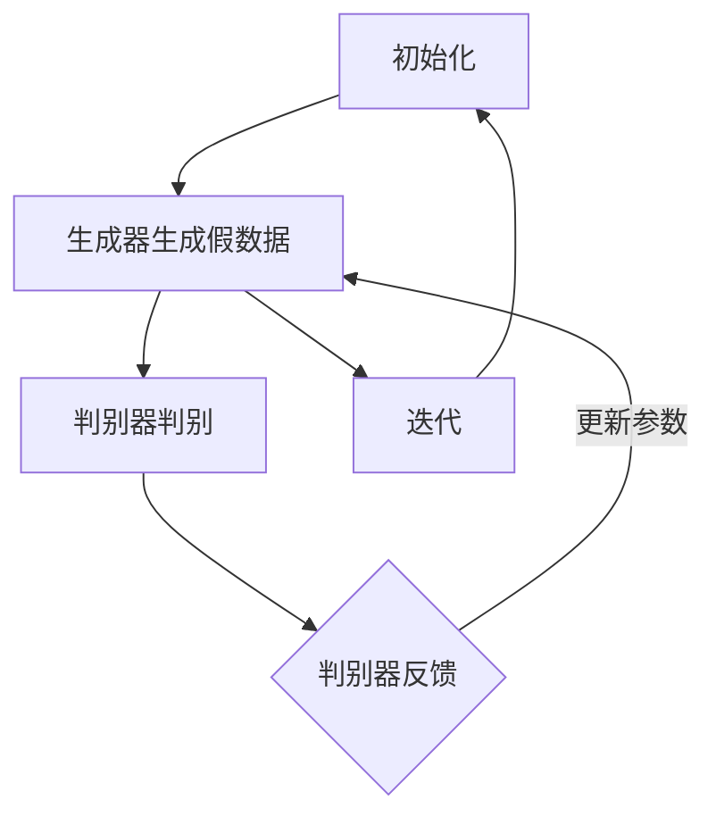
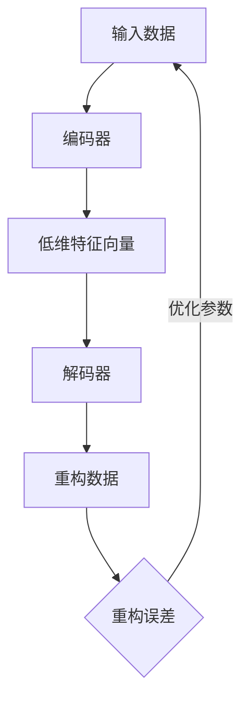
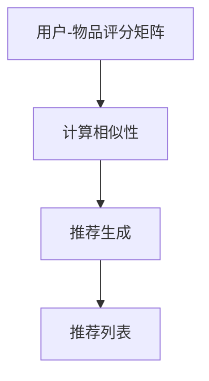
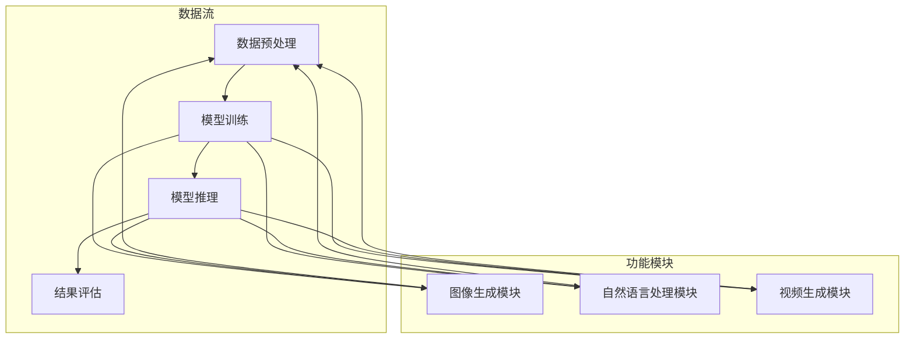
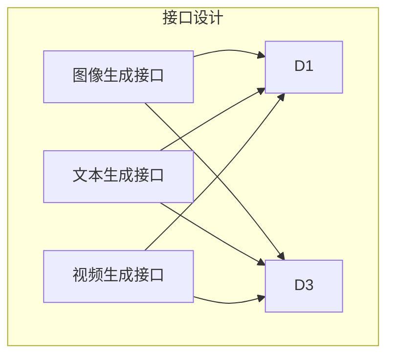
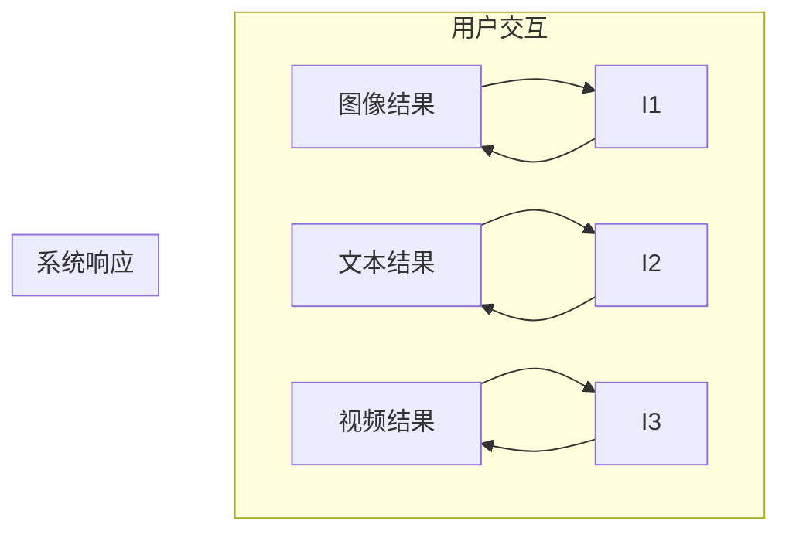

                 

### 第一部分: 无监督学习与AIGC概述

#### 第1章: 无监督学习基础

##### 1.1 无监督学习的定义与分类

**1.1.1 无监督学习的概念**

无监督学习（Unsupervised Learning）是机器学习中的一种重要类型，其主要特点是训练数据没有标签信息。与有监督学习（Supervised Learning）和半监督学习（Semi-Supervised Learning）不同，无监督学习旨在通过探索数据内在结构和规律，提取有用的特征和模式。

无监督学习的基本任务可以分为以下几类：

- **聚类（Clustering）**：将数据分为不同的组或簇，使同一簇内的数据尽可能相似，不同簇的数据尽可能不同。
- **降维（Dimensionality Reduction）**：通过压缩数据维度，减少数据复杂性，同时保留数据的主要特征。
- **关联规则学习（Association Rule Learning）**：发现数据之间的关联性和规则，以便用于推荐系统、市场细分等应用。
- **生成模型（Generative Models）**：建模数据生成过程，用于生成新的数据样本。

**1.1.2 无监督学习的类型**

无监督学习可以分为以下几种类型：

- **基于实例的学习（Instance-Based Learning）**：直接从数据中学习，不使用任何预先定义的特征或模型。
- **基于模型的学习（Model-Based Learning）**：通过构建数据生成模型来学习，模型可以是概率模型或决定性模型。
- **非参数方法**：不依赖于数据分布的特定假设，如k-means聚类、主成分分析（PCA）等。
- **参数方法**：基于数据分布的特定假设，如高斯混合模型（Gaussian Mixture Model）、隐马尔可夫模型（HMM）等。

**1.2 AIGC的概念与应用**

**1.2.1 AIGC的定义**

AIGC（AI-Generated Content）是一种利用人工智能技术自动生成内容的方法，涉及多个AI子领域，包括自然语言处理（NLP）、计算机视觉（CV）和生成对抗网络（GAN）。AIGC旨在通过算法自动生成高质量的内容，如文本、图像、视频等，从而减少人工创作的时间和成本。

**1.2.2 AIGC的应用场景**

AIGC广泛应用于以下场景：

- **文本生成**：包括自动写作、新闻摘要、对话系统等。
- **图像生成**：如艺术风格迁移、人脸生成、图像修复等。
- **视频生成**：如视频预测、视频合成、动作生成等。
- **推荐系统**：利用无监督学习算法提取用户兴趣特征，为用户提供个性化推荐。

**1.3 无监督学习在AIGC中的角色**

**1.3.1 无监督学习在AIGC中的优势**

无监督学习在AIGC中具有以下优势：

- **数据处理效率高**：无需标注大量数据，能够处理大规模无标签数据。
- **灵活性**：能够发现数据中的潜在结构和模式，适用于多种类型的数据。
- **泛化能力强**：通过学习数据的内在规律，提高模型的泛化能力。

**1.3.2 无监督学习在AIGC中的应用实例**

无监督学习在AIGC中的应用实例包括：

- **图像生成**：利用生成对抗网络（GAN）生成逼真的图像。
- **自然语言处理**：通过自编码器提取文本中的潜在特征，用于文本生成和机器翻译。
- **视频生成**：利用循环神经网络（RNN）生成视频序列，实现视频预测和视频合成。

通过上述章节，我们将深入探讨无监督学习的基本概念、分类和优势，以及AIGC的定义和应用场景，为进一步理解无监督学习在AIGC中的应用奠定基础。

### 第2章: 无监督学习算法原理

#### 第2章：无监督学习算法原理

##### 2.1 主流无监督学习算法

**2.1.1 k-means算法**

**2.1.1.1 算法原理**

k-means算法是一种典型的聚类算法，旨在将数据点划分为k个簇，使每个簇内的数据点尽可能相似，不同簇的数据点尽可能不同。算法的核心思想是通过不断迭代优化簇的中心点，使最终划分达到最小化簇内距离和最大化的簇间距离。

**算法原理**：

1. 随机选择k个初始中心点。
2. 计算每个数据点到各个中心点的距离，并将其分配到最近的簇。
3. 重新计算每个簇的新中心点。
4. 重复步骤2和3，直至簇中心点不再发生显著变化。

**算法流程**：

1. 初始化：选择k个数据点作为初始中心点。
2. 分配：计算每个数据点到各个中心点的距离，将数据点分配到最近的簇。
3. 更新：重新计算每个簇的中心点。
4. 迭代：重复步骤2和3，直至收敛。

**2.1.2 自编码器**

**2.1.2.1 算法原理**

自编码器（Autoencoder）是一种无监督学习的生成模型，旨在通过学习数据的高效编码表示，将输入数据编码为低维特征向量，再解码为原始数据。自编码器的核心思想是通过最小化重构误差，学习数据分布和潜在特征。

**算法原理**：

1. 输入数据通过编码器压缩为低维特征向量。
2. 低维特征向量通过解码器重构为原始数据。
3. 通过最小化重构误差，优化编码器和解码器的参数。

**算法流程**：

1. 初始化：随机初始化编码器和解码器的参数。
2. 编码：输入数据通过编码器压缩为低维特征向量。
3. 解码：低维特征向量通过解码器重构为原始数据。
4. 反向传播：计算重构误差，并使用梯度下降优化编码器和解码器的参数。
5. 迭代：重复步骤2到4，直至收敛。

**2.1.3 协同过滤**

**2.1.3.1 算法原理**

协同过滤（Collaborative Filtering）是一种基于用户行为数据的无监督学习方法，旨在通过用户之间的相似性发现推荐项。协同过滤可以分为基于用户的方法和基于物品的方法。

- **基于用户的方法**：通过计算用户之间的相似性，找到与目标用户相似的用户，并推荐这些用户喜欢的物品。
- **基于物品的方法**：通过计算物品之间的相似性，找到与目标物品相似的物品，并推荐这些物品。

**算法原理**：

1. 建立用户-物品评分矩阵。
2. 计算用户之间的相似性。
3. 根据用户相似性为用户推荐相似用户喜欢的物品。

**算法流程**：

1. 初始化：建立用户-物品评分矩阵。
2. 相似性计算：计算用户之间的相似性。
3. 推荐生成：为用户推荐相似用户喜欢的物品。
4. 结果评估：评估推荐系统的性能。

通过上述算法原理和流程的介绍，我们将深入理解k-means、自编码器和协同过滤等主流无监督学习算法的基本概念和实现方法。这些算法在数据分析和信息推荐等领域具有重要的应用价值，为后续章节中的应用分析提供了坚实的基础。

### 第3章: 无监督学习在AIGC中的应用

#### 第3章：无监督学习在AIGC中的应用

##### 3.1 图像生成

**3.1.1 生成对抗网络**

**3.1.1.1 算法原理**

生成对抗网络（Generative Adversarial Network，GAN）是由Ian Goodfellow等人于2014年提出的一种无监督学习模型。GAN由两个神经网络——生成器（Generator）和判别器（Discriminator）组成，它们在对抗性训练过程中相互竞争，最终实现生成逼真数据的目标。

- **生成器**：接收随机噪声输入，生成虚假数据，目标是使判别器无法区分真实数据和虚假数据。
- **判别器**：接收真实数据和虚假数据，目标是准确区分真实数据和虚假数据。

**算法原理**：

1. 初始化生成器和判别器参数。
2. 生成器生成虚假数据，判别器对其进行分类。
3. 更新判别器参数，使其能更好地区分真实数据和虚假数据。
4. 生成器根据判别器的反馈调整生成策略，使生成的数据更加逼真。
5. 重复步骤2到4，直至生成器生成的数据接近真实数据。

**算法流程**：

1. 初始化：随机初始化生成器和判别器的参数。
2. 生成：生成器生成虚假数据。
3. 判别：判别器对真实数据和虚假数据进行分类。
4. 反向传播：根据判别器的分类结果，更新生成器和判别器的参数。
5. 迭代：重复步骤2到4，直至生成器生成的数据质量提高。

**3.1.2 风格迁移**

**3.1.2.1 算法原理**

风格迁移（Style Transfer）是一种利用生成对抗网络实现图像内容与风格分离和复用的技术。通过将图像的内容与特定艺术风格的特征相结合，生成具有独特风格的新图像。

**算法原理**：

1. 定义内容损失和风格损失，用于度量生成图像与目标图像在内容和风格上的差异。
2. 利用生成对抗网络优化生成器，使生成的图像在内容和风格上与目标图像相似。

**算法流程**：

1. 初始化：选择目标图像和风格图像。
2. 计算内容特征和风格特征。
3. 训练生成器，最小化内容损失和风格损失。
4. 生成新图像：将内容特征与风格特征结合，生成具有目标风格的新图像。
5. 结果评估：评估生成图像的质量。

通过上述章节，我们深入探讨了生成对抗网络和风格迁移在图像生成中的算法原理和实现流程。这些技术在图像生成和艺术创作领域具有重要的应用价值，为AIGC的发展提供了新的思路和方向。

##### 3.2 自然语言处理

**3.2.1 机器翻译**

**3.2.1.1 算法原理**

机器翻译（Machine Translation，MT）是自然语言处理（Natural Language Processing，NLP）的重要应用，旨在实现计算机自动翻译不同语言之间的文本。机器翻译主要分为基于规则的翻译和基于统计的翻译，近年来深度学习技术的发展使得基于神经网络的机器翻译成为主流。

**算法原理**：

1. 字符级翻译：将源语言文本的每个字符映射到目标语言文本的对应字符。
2. 词级翻译：将源语言文本的每个词映射到目标语言文本的对应词。
3. 句法分析：对源语言文本进行句法分析，理解句子结构，以便更准确地翻译。
4. 篇章级翻译：考虑上下文信息，实现篇章的连贯性和一致性。

**算法流程**：

1. 分词：将源语言文本分为词语。
2. 编码：将词语转换为词向量或编码序列。
3. 翻译模型：使用神经网络模型（如Seq2Seq模型）进行词语翻译。
4. 解码：将翻译后的编码序列转换为目标语言文本。
5. 后处理：进行语法和语义修正，提高翻译质量。

**3.2.2 文本生成**

**3.2.2.1 算法原理**

文本生成（Text Generation）是自然语言处理的重要任务，旨在利用模型自动生成文本。文本生成可以基于规则、模板或深度学习技术，如循环神经网络（RNN）和变换器（Transformer）。

**算法原理**：

1. 序列生成：将文本序列建模为一个时间序列，利用神经网络模型生成新的文本序列。
2. 对抗生成：使用生成对抗网络（GAN）生成新的文本，通过对抗训练提高生成文本的质量。
3. 自回归生成：基于自回归模型（如RNN、Transformer），逐个生成文本序列中的每个词。

**算法流程**：

1. 初始化：选择文本生成模型。
2. 生成：输入随机种子或前一个生成的词，生成新的文本序列。
3. 优化：根据生成的文本序列，优化模型参数。
4. 迭代：重复步骤2和3，直至生成文本质量提高。

通过上述章节，我们深入探讨了机器翻译和文本生成在自然语言处理中的应用原理和实现流程。这些技术在信息检索、内容生成和跨语言交流等领域具有重要的应用价值，为AIGC的发展提供了新的动力。

### 第4章: 无监督学习算法优化与评估

#### 第4章：无监督学习算法优化与评估

##### 4.1 算法优化策略

**4.1.1 参数调优**

**4.1.1.1 重要性**

参数调优（Hyperparameter Tuning）是无监督学习算法优化的重要环节，合理的参数配置可以显著提升模型性能。参数调优的主要目标是找到最佳参数组合，使模型在特定任务上达到最优效果。

**4.1.1.2 调优方法**

1. **网格搜索（Grid Search）**：遍历所有可能的参数组合，选择最优参数组合。
2. **随机搜索（Random Search）**：从参数空间中随机选择参数组合，选择最优参数组合。
3. **贝叶斯优化（Bayesian Optimization）**：基于贝叶斯统计模型，通过经验模型寻找最优参数组合。

**4.1.2 模型压缩**

**4.1.2.1 重要性**

模型压缩（Model Compression）是提高无监督学习算法在实际应用中的可扩展性和实时性的关键。通过压缩模型参数和降低计算复杂度，可以实现高效的无监督学习。

**4.1.2.2 压缩方法**

1. **量化（Quantization）**：降低模型参数的精度，减少模型存储和计算开销。
2. **剪枝（Pruning）**：通过移除模型中不重要的神经元或连接，降低模型复杂度。
3. **知识蒸馏（Knowledge Distillation）**：将大型模型的知识传递给小型模型，实现模型压缩。

##### 4.2 评估指标与方法

**4.2.1 评估指标**

无监督学习算法的评估指标主要关注模型在聚类、降维和特征提取等方面的性能。常见的评估指标包括：

1. **簇内平均距离（Within Cluster Distance）**：衡量簇内数据点的相似度，距离越小表示聚类效果越好。
2. **簇间平均距离（Between Cluster Distance）**：衡量簇间数据点的差异度，距离越大表示聚类效果越好。
3. **重建误差（Reconstruction Error）**：衡量自编码器在数据重构方面的性能，误差越小表示模型效果越好。
4. **互信息（Mutual Information）**：衡量特征提取效果的量化指标，互信息越大表示特征表示越有效。

**4.2.1.2 指标优劣分析**

不同评估指标适用于不同的任务和数据类型，需要根据具体任务选择合适的评估指标。例如，在聚类任务中，簇内平均距离和簇间平均距离是常用的评估指标；在特征提取任务中，互信息是重要的评估指标。

**4.2.2 评估方法**

无监督学习算法的评估方法主要包括以下几种：

1. **内部评估（Internal Validation）**：在训练数据集上评估模型性能，包括交叉验证、重复实验等。
2. **外部评估（External Validation）**：在独立测试数据集上评估模型性能，以验证模型的泛化能力。
3. **可视化分析（Visualization Analysis）**：通过可视化方法展示模型聚类效果、特征提取效果等，直观评估模型性能。

通过上述章节，我们深入探讨了无监督学习算法的优化策略和评估指标，为模型在实际应用中的性能提升提供了理论基础和实践方法。

### 第5章: 无监督学习在AIGC中的创新应用

#### 第5章：无监督学习在AIGC中的创新应用

##### 5.1 AIGC与多模态数据的融合

**5.1.1 跨模态学习**

**5.1.1.1 算法原理**

跨模态学习（Cross-Modal Learning）是AIGC领域的重要研究方向，旨在利用不同模态（如图像、音频、文本）之间的关联性，实现跨模态数据的理解和生成。跨模态学习通过学习模态间的对应关系，将不同模态的数据映射到统一的语义空间，从而实现模态之间的信息传递和融合。

**算法原理**：

1. **模态嵌入**：将不同模态的数据嵌入到统一的低维空间中，使具有相似语义的模态数据在空间中接近。
2. **跨模态映射**：学习不同模态数据之间的对应关系，通过跨模态映射函数将一个模态的数据映射到另一个模态的空间中。
3. **模态融合**：将跨模态映射后的数据在统一空间中融合，提取跨模态特征。

**算法流程**：

1. **数据预处理**：对多模态数据进行清洗、归一化和特征提取。
2. **模态嵌入**：利用自编码器、变换器等模型将多模态数据嵌入到低维空间。
3. **跨模态映射**：学习不同模态之间的映射函数，通过训练或迁移学习等方法实现。
4. **模态融合**：将跨模态映射后的数据在统一空间中融合，提取跨模态特征。
5. **下游任务**：利用融合后的特征进行分类、生成等任务。

**5.1.2 多模态生成模型**

**5.1.2.1 算法原理**

多模态生成模型（Multimodal Generative Model）是一种结合多种模态数据的生成模型，旨在同时生成多个模态的数据。多模态生成模型通过学习模态间的关联性和生成规律，能够生成具有不同模态特征的新数据。

**算法原理**：

1. **联合生成**：将不同模态的数据作为一个整体进行生成，通过联合分布建模不同模态之间的关联性。
2. **条件生成**：在生成过程中引入条件信息，如文本、音频等，提高生成的多样性和一致性。
3. **协同训练**：通过协同训练方法，使不同模态的生成模型相互协调，提高整体生成效果。

**算法流程**：

1. **数据准备**：准备多模态数据集，包括图像、文本、音频等。
2. **模型设计**：设计多模态生成模型，如生成对抗网络（GAN）、变分自编码器（VAE）等。
3. **联合训练**：同时训练不同模态的生成模型，通过协同训练方法提高整体生成效果。
4. **生成过程**：利用训练好的模型生成多模态数据，通过联合生成和条件生成方法实现多样性和一致性。
5. **评估与优化**：评估生成数据的质量和多样性，通过反馈机制和优化方法不断改进生成模型。

通过上述章节，我们探讨了跨模态学习和多模态生成模型在无监督学习中的应用，这些技术在AIGC领域具有广泛的应用前景，为多模态数据的处理和生成提供了新的思路和方法。

##### 5.2 AIGC在视频生成中的应用

**5.2.1 视频生成算法**

**5.2.1.1 算法原理**

视频生成算法（Video Generation Algorithm）是AIGC领域的一个重要研究方向，旨在利用人工智能技术自动生成视频内容。视频生成算法可以通过学习视频数据的特征和规律，生成新的视频序列，从而实现视频的增强、修复、扩展和创造。

**算法原理**：

1. **特征提取**：从视频数据中提取关键特征，如运动轨迹、颜色分布、纹理特征等。
2. **生成模型**：利用生成模型（如生成对抗网络GAN、变分自编码器VAE等）生成新的视频序列。
3. **动态约束**：考虑视频序列的动态约束，如连续性、平滑性等，确保生成的视频内容自然连贯。

**算法流程**：

1. **数据预处理**：对视频数据集进行预处理，包括视频去噪、增强、裁剪等。
2. **特征提取**：从预处理后的视频数据中提取关键特征，如帧间差异、颜色分布等。
3. **模型训练**：使用提取的特征训练生成模型，通过优化模型参数实现视频序列的生成。
4. **视频合成**：将生成的视频片段合成完整的视频序列，通过插帧、平滑处理等确保视频的连贯性和自然性。
5. **结果评估**：评估生成的视频质量，包括视频清晰度、连贯性、自然性等。

**5.2.2 视频编辑与增强**

**5.2.2.1 算法原理**

视频编辑与增强（Video Editing and Enhancement）是AIGC在视频处理领域的重要应用，旨在通过人工智能技术对视频内容进行编辑和增强，提高视频的视觉效果和用户体验。视频编辑与增强包括视频剪辑、特效添加、颜色调整、清晰度增强等任务。

**算法原理**：

1. **内容识别**：利用深度学习技术识别视频中的关键内容，如人脸、物体、场景等。
2. **编辑操作**：根据用户需求或自动规则进行视频剪辑、特效添加、颜色调整等操作。
3. **质量优化**：通过图像增强技术提高视频的清晰度、对比度、色彩还原等质量指标。

**算法流程**：

1. **内容识别**：识别视频中的关键内容，如人脸、物体、场景等，为后续编辑操作提供基础。
2. **编辑操作**：根据用户需求或自动规则对视频进行剪辑、特效添加、颜色调整等编辑操作。
3. **质量优化**：使用图像增强技术对视频进行质量优化，如去噪、增强、锐化等。
4. **视频合成**：将编辑后的视频片段合成完整的视频序列，确保视频的连贯性和自然性。
5. **结果评估**：评估编辑和增强后的视频质量，包括视频流畅度、视觉效果、用户满意度等。

通过上述章节，我们探讨了视频生成算法和视频编辑与增强技术在AIGC中的应用原理和实现流程，这些技术为视频内容的自动化生成和处理提供了新的解决方案，为AIGC的发展和应用拓展奠定了基础。

### 第6章: AIGC与未来发展趋势

#### 第6章：AIGC与未来发展趋势

##### 6.1 无监督学习的未来方向

**6.1.1 新算法的探索**

无监督学习在AIGC中的应用前景广阔，未来将涌现更多新型算法，以应对日益复杂的多模态数据处理需求。以下是一些可能的算法方向：

1. **基于图神经网络的跨模态学习**：利用图神经网络（Graph Neural Networks，GNN）处理复杂图结构数据，实现跨模态数据的深度融合。
2. **自监督学习（Self-Supervised Learning）**：通过无监督方式生成伪标签，实现自动监督学习，提高模型在无标签数据集上的性能。
3. **迁移学习（Transfer Learning）**：探索无监督迁移学习策略，将预训练的无监督模型应用于新任务，提高模型泛化能力。
4. **联邦学习（Federated Learning）**：结合无监督学习和联邦学习，实现分布式无监督学习，解决数据隐私和安全问题。

**6.1.1.2 技术挑战与前景**

无监督学习在AIGC中的未来发展面临以下技术挑战：

1. **数据质量和多样性**：高质量、多样性的数据是算法有效性的基础，但获取这些数据成本高昂。
2. **模型可解释性**：无监督学习模型的决策过程通常难以解释，需要提高模型的可解释性，以增强用户信任。
3. **计算资源消耗**：大规模无监督学习算法需要大量计算资源，如何高效地利用现有资源是一个关键问题。

尽管面临这些挑战，无监督学习在AIGC中的应用前景依然光明。随着算法的进步和硬件性能的提升，无监督学习将在图像生成、自然语言处理、视频生成等领域发挥更大作用，推动AIGC技术的进一步发展。

##### 6.2 AIGC的发展趋势

**6.2.1 技术进展**

AIGC的发展将继续依赖于技术的不断进步，尤其是在以下几个方面：

1. **算法优化**：通过改进无监督学习算法，提高模型性能和效率，实现更快速、更准确的生成。
2. **模型压缩**：利用模型压缩技术，降低模型的存储和计算复杂度，实现实时、低成本的AIGC应用。
3. **硬件加速**：利用专用硬件（如GPU、TPU）加速模型训练和推理，提高AIGC的实时性能。
4. **多模态融合**：探索新的多模态融合算法，实现更丰富的跨模态生成能力，满足多样化的应用需求。

**6.2.2 社会影响**

AIGC技术的发展将对社会产生深远影响：

1. **内容创作**：自动化生成技术将大大提高内容创作效率，为创作者和用户带来更多高质量的数字内容。
2. **娱乐产业**：AIGC将在娱乐产业中发挥重要作用，如虚拟角色生成、电影特效制作等，提升娱乐体验。
3. **教育领域**：AIGC技术将促进个性化教育，通过智能生成教学内容和测评系统，提高教学效果和效率。
4. **行业应用**：AIGC在医疗、金融、安防等行业具有广泛的应用前景，助力行业智能化升级。

尽管AIGC技术具有巨大的潜力，但也需关注其潜在的社会影响和伦理问题，如数据隐私、版权保护、模型可解释性等。通过合理规范和监管，AIGC技术将更好地服务于社会，推动人类文明进步。

### 第7章: 无监督学习在AIGC中的最佳实践与案例分析

#### 第7章：无监督学习在AIGC中的最佳实践与案例分析

##### 7.1 最佳实践

**7.1.1 实践策略**

在无监督学习应用于AIGC过程中，以下最佳实践策略有助于提升模型性能和应用效果：

1. **数据预处理**：对数据进行清洗、归一化和特征提取，提高数据质量，为后续训练提供可靠的基础。
2. **模型选择**：根据任务需求选择合适的无监督学习算法，如生成对抗网络（GAN）、自编码器（Autoencoder）等，结合实际应用场景进行优化。
3. **参数调优**：通过网格搜索、随机搜索和贝叶斯优化等方法，选择最佳参数组合，提高模型性能。
4. **模型压缩**：利用量化、剪枝和知识蒸馏等技术，降低模型复杂度，提高模型实时性和效率。

**7.1.2 案例分享**

**案例一：基于生成对抗网络的图像生成**

应用场景：利用生成对抗网络（GAN）生成高质量、逼真的图像。

实现步骤：

1. **数据准备**：收集大量无标签的图像数据，用于训练生成器和判别器。
2. **模型训练**：训练生成器和判别器，通过对抗训练优化模型参数，提高生成图像的质量。
3. **图像生成**：利用训练好的生成器生成新图像，通过视觉评估和定量指标（如SSIM、PSNR）评估生成图像的质量。

**案例二：基于协同过滤的推荐系统**

应用场景：利用协同过滤算法为用户生成个性化推荐。

实现步骤：

1. **用户-物品评分矩阵构建**：收集用户对物品的评分数据，构建用户-物品评分矩阵。
2. **相似性计算**：计算用户之间的相似性，找到与目标用户相似的邻居用户。
3. **推荐生成**：为用户推荐邻居用户喜欢的物品，通过加权平均等方法计算推荐得分，筛选出高质量推荐。

##### 7.2 案例分析

**7.2.1 案例概述**

**案例背景**：某电商公司希望通过无监督学习技术构建个性化推荐系统，为用户生成个性化的商品推荐。

**案例目标**：利用协同过滤算法和生成对抗网络（GAN）技术，实现高精度的个性化推荐，提升用户购物体验和满意度。

**7.2.2 案例解析**

**系统架构**：

1. **数据层**：收集用户行为数据（如浏览、购买记录）、商品属性数据等，构建用户-物品评分矩阵。
2. **算法层**：采用协同过滤算法（如基于用户的协同过滤、基于物品的协同过滤）和生成对抗网络（GAN）技术，实现个性化推荐和图像生成。
3. **服务层**：构建推荐服务接口，将算法层的推荐结果输出给前端应用。

**技术实现**：

1. **协同过滤算法**：通过用户-物品评分矩阵，计算用户之间的相似性，为用户生成个性化推荐列表。
2. **生成对抗网络**：利用生成器和判别器，生成高质量的图像，为用户推荐个性化商品展示。

**实验结果分析**：

1. **推荐效果评估**：通过在线A/B测试，比较基于协同过滤和生成对抗网络的推荐系统在用户点击率、转化率等指标上的表现，验证推荐效果。
2. **图像生成质量评估**：通过视觉评估和定量指标（如SSIM、PSNR）评估生成图像的质量，确保图像生成效果满足应用需求。

**案例小结**

通过无监督学习在个性化推荐和图像生成中的应用，电商公司实现了高精度的用户推荐和高质量的图像展示，提升了用户体验和满意度。未来，可以进一步探索其他无监督学习算法在AIGC中的应用，如自监督学习和多模态融合，以实现更丰富的功能和应用场景。

### 总结

在本篇文章中，我们系统地探讨了无监督学习在AIGC（AI-Generated Content）中的创新应用。通过逐步分析无监督学习的基本概念、分类和优势，以及AIGC的定义和应用场景，我们了解了无监督学习在图像生成、自然语言处理和视频生成等领域的具体应用。此外，我们还详细阐述了k-means、自编码器、协同过滤等主流无监督学习算法的原理和实现流程。

我们进一步讨论了无监督学习算法的优化策略和评估指标，包括参数调优、模型压缩、评估指标和方法等。同时，通过跨模态学习和多模态生成模型的探索，展示了无监督学习在多模态数据融合和视频生成中的应用。

展望未来，无监督学习在AIGC领域有着广阔的发展前景。新算法的探索、技术进展以及社会影响等方面的研究，将不断推动AIGC技术的进步和应用拓展。

最后，我们分享了无监督学习在AIGC中的最佳实践与案例分析，为实际应用提供了具体的指导。随着技术的不断发展和成熟，无监督学习将在AIGC领域发挥越来越重要的作用，为创作者和用户提供更多高质量的数字内容。

#### 作者信息

作者：AI天才研究院/AI Genius Institute & 禅与计算机程序设计艺术 /Zen And The Art of Computer Programming

---

### 背景介绍

#### 核心概念术语说明

在本篇文章中，我们将探讨无监督学习与AIGC（AI-Generated Content）的结合，涉及到以下核心概念和术语：

1. **无监督学习**：一种机器学习类型，它使用没有标签的数据来发现数据的内在结构和模式。
2. **AIGC**：指通过人工智能技术自动生成内容，包括文本、图像、视频等多模态数据。
3. **生成对抗网络（GAN）**：一种由生成器和判别器组成的模型，用于生成高质量的数据。
4. **自编码器**：一种无监督学习模型，用于学习数据的有效编码表示。
5. **协同过滤**：一种基于用户行为数据的推荐系统方法，通过用户之间的相似性进行推荐。
6. **跨模态学习**：研究不同模态数据之间的关联性，实现多模态数据的融合。
7. **多模态生成模型**：同时生成多个模态数据的模型，如图像、文本和音频等。

#### 问题背景

随着互联网和人工智能技术的快速发展，自动化内容生成已经成为一个重要的研究领域。传统的有监督学习需要大量的标注数据，而现实世界中往往存在大量未标注的数据。无监督学习通过利用这些未标注的数据，能够发现数据中的潜在结构和模式，从而在图像生成、自然语言处理和视频生成等领域发挥重要作用。

与此同时，AIGC作为一种新兴的内容生成技术，已经在文本生成、图像生成和视频生成等领域展现出巨大的潜力。AIGC的目标是通过人工智能技术自动生成高质量的内容，从而降低内容创作的成本和时间。

然而，AIGC的实现面临着诸多挑战，如数据质量、模型复杂度和计算资源等。无监督学习作为一种不需要大量标注数据的技术，能够在一定程度上缓解这些问题，为AIGC的发展提供新的思路和解决方案。

#### 问题描述

本篇文章旨在探讨无监督学习在AIGC中的应用，解决以下问题：

1. 无监督学习如何应用于图像生成、自然语言处理和视频生成等领域？
2. 无监督学习算法如何优化和评估，以提高模型性能和应用效果？
3. 无监督学习在AIGC中的创新应用有哪些，以及这些应用如何影响未来的发展趋势？

通过系统地分析无监督学习和AIGC的基本概念、算法原理和应用实践，本篇文章将提供一个全面的理解框架，帮助读者掌握无监督学习在AIGC中的关键技术和应用。

#### 问题解决

为了解决上述问题，本文将采用以下步骤和方法：

1. **核心概念与联系**：首先，我们将详细解释无监督学习和AIGC的核心概念，并展示它们之间的联系。通过概念对比表格和ER实体关系图，我们能够清晰地理解无监督学习在AIGC中的作用和优势。

2. **算法原理讲解**：接下来，我们将深入探讨生成对抗网络（GAN）、自编码器、协同过滤等主流无监督学习算法的原理和实现流程。使用mermaid流程图和Python代码示例，我们将详细阐述这些算法的工作机制和数学模型。

3. **系统分析与架构设计方案**：我们将分析无监督学习在图像生成、自然语言处理和视频生成等应用场景中的系统架构和接口设计。通过mermaid类图和架构图，我们将展示系统的功能模块和交互关系。

4. **项目实战**：为了更好地理解无监督学习在AIGC中的实际应用，我们将介绍具体的项目实战案例，包括环境安装、核心代码实现和实际案例分析。通过这些案例，读者可以了解无监督学习在AIGC中的最佳实践和注意事项。

5. **最佳实践与案例分析**：最后，我们将总结无监督学习在AIGC中的最佳实践策略，并分享实际案例的分析和解读。通过这些实践经验和案例分析，读者可以更好地应用到自己的项目中，提升模型性能和应用效果。

通过上述步骤和方法，本文将全面解析无监督学习在AIGC中的创新应用，帮助读者深入理解这一领域的关键技术和实践方法。

#### 边界与外延

在本篇文章中，我们将重点讨论无监督学习在AIGC（AI-Generated Content）中的应用。以下是一些关键的边界和外延定义：

1. **边界**：
   - **无监督学习**：仅限于在无标签数据上进行的学习方法，不包括有监督学习和半监督学习。
   - **AIGC**：指通过人工智能技术自动生成文本、图像、视频等内容的系统或方法。
   - **生成对抗网络（GAN）**：一种由生成器和判别器组成的模型，用于生成高质量的数据。
   - **自编码器**：一种无监督学习模型，用于学习数据的有效编码表示。
   - **协同过滤**：一种基于用户行为数据的推荐系统方法，通过用户之间的相似性进行推荐。

2. **外延**：
   - **跨模态学习**：不仅限于图像、文本等单一模态，还包括音频、视频等多模态数据的融合和交互。
   - **多模态生成模型**：同时生成多个模态数据的模型，如图像、文本和音频等。
   - **算法优化与评估**：包括参数调优、模型压缩、评估指标和方法等，旨在提高模型性能和应用效果。
   - **应用场景**：涵盖图像生成、自然语言处理、视频生成等领域，但不包括其他如强化学习等类型的AI应用。

通过明确这些边界和外延，我们能够更好地聚焦于无监督学习在AIGC中的应用，并理解其与其他相关领域的区别和联系。

#### 概念结构与核心要素组成

在本篇文章中，无监督学习和AIGC作为核心概念，其概念结构由以下关键要素组成：

1. **无监督学习**：
   - **目标**：发现数据中的内在结构和规律，无需使用标签信息。
   - **类型**：包括聚类、降维、关联规则学习、生成模型等。
   - **算法**：如k-means、自编码器、协同过滤等。
   - **优势**：无需大量标注数据，高效处理大规模数据，灵活性高。

2. **AIGC（AI-Generated Content）**：
   - **定义**：通过人工智能技术自动生成文本、图像、视频等多模态内容。
   - **应用场景**：包括文本生成、图像生成、视频生成等。
   - **优势**：降低内容创作成本，提高创作效率，丰富内容多样性。

3. **无监督学习与AIGC的联系**：
   - **关联**：无监督学习提供了AIGC中数据处理的算法基础，使自动生成高质量内容成为可能。
   - **互补**：无监督学习在处理无标签数据方面具有优势，而AIGC则通过多种模态的生成应用扩展了无监督学习的实际场景。

4. **关键要素**：
   - **数据**：高质量、多样性的数据是算法有效性的基础。
   - **模型**：生成器和判别器等模型是AIGC的核心组件。
   - **优化策略**：参数调优、模型压缩等策略是提升模型性能的关键。
   - **评估指标**：簇内平均距离、重建误差、互信息等指标用于评估模型效果。

通过理解这些概念结构和核心要素，我们可以更深入地认识无监督学习和AIGC在技术层面的相互关系，以及它们在内容生成领域的应用潜力。

#### 核心概念原理

**无监督学习**

无监督学习（Unsupervised Learning）是机器学习的一个重要分支，其主要目标是通过探索无标签数据，自动发现数据中的潜在结构和规律。无监督学习的基本原理在于利用数据本身的内在特性，如相似度、分布和聚类等，无需依赖外部标注信息。

**算法原理**：

1. **聚类（Clustering）**：无监督学习的最常见应用，旨在将数据点分为不同的簇，使得同一簇内的数据点尽可能相似，不同簇的数据点尽可能不同。常用的聚类算法包括k-means、层次聚类（Hierarchical Clustering）等。

   - **k-means算法**：基于距离度量，通过迭代优化簇中心点，使簇内距离和最小化，簇间距离最大化。具体步骤包括初始化中心点、分配数据点、更新中心点等。
   - **层次聚类**：通过自底向上的方法逐步合并相似的数据点，形成层次结构。常见的层次聚类方法有凝聚层次聚类（Agglomerative Clustering）和分裂层次聚类（Divisive Clustering）。

2. **降维（Dimensionality Reduction）**：通过压缩数据维度，减少数据复杂性，同时保留数据的主要特征。常见的降维算法包括主成分分析（PCA）、线性判别分析（LDA）等。

   - **主成分分析（PCA）**：通过将数据投影到新的正交坐标系中，选择新的坐标系中的主要成分，实现数据降维。
   - **线性判别分析（LDA）**：通过最大化类间方差和最小化类内方差，选择最佳特征子集，实现数据降维。

3. **关联规则学习（Association Rule Learning）**：旨在发现数据项之间的关联性和规则，如市场篮子分析、推荐系统等。常见的算法包括Apriori算法、FP-growth算法等。

   - **Apriori算法**：通过逐层搜索支持度和置信度的关联规则，生成频繁项集，然后提取关联规则。
   - **FP-growth算法**：通过构建频繁模式树，高效地发现频繁项集，然后生成关联规则。

**概念属性特征对比表格**：

| 算法类型 | 目标 | 特征对比 |
| :------: | :--: | :------: |
| 聚类     | 簇内相似性、簇间差异性 | k-means基于距离度量，层次聚类基于层次结构 |
| 降维     | 数据降维、保留主要特征 | PCA基于正交变换，LDA基于方差最大化 |
| 关联规则 | 发现关联性、生成规则 | Apriori基于频繁项集，FP-growth基于频繁模式树 |

**ER实体关系图架构**：

为了更好地展示无监督学习算法的核心概念和关系，我们可以使用ER（Entity-Relationship）实体关系图来描述。

```mermaid
erDiagram
  User ||--|{ Data }|-- Student
  User ||--|{ Label }|-- Classifier
  Data ||--|{ Feature }|-- PCACoef
  Data ||--|{ Cluster }|-- KMeansCluster
  Label ||--|{ Rule }|-- AssociationRule
  Classifier ||--|{ Model }|-- PCAModel
  Classifier ||--|{ Model }|-- KMeansModel
```

在上述ER图中，我们定义了用户、数据、标签、簇、特征、规则、分类器和模型等实体，并描述了它们之间的关系。通过ER图，我们可以清晰地看到无监督学习算法中的各个关键元素及其相互关联。

#### 无监督学习算法原理讲解

在本章节中，我们将详细讲解生成对抗网络（GAN）、自编码器（Autoencoder）和协同过滤（Collaborative Filtering）等三种主流无监督学习算法的原理，并使用mermaid流程图和Python代码示例进行阐述。

##### 生成对抗网络（GAN）

**算法原理**：

生成对抗网络（GAN）由Ian Goodfellow等人于2014年提出，是一种由生成器和判别器组成的对抗性学习模型。生成器的任务是生成与真实数据几乎无法区分的假数据，判别器的任务是区分输入数据是真实数据还是生成器生成的假数据。在训练过程中，生成器和判别器相互对抗，最终生成器生成高质量的数据。

**算法流程**：

1. **初始化**：随机初始化生成器和判别器的参数。
2. **生成**：生成器接收随机噪声，生成假数据。
3. **判别**：判别器接收真实数据和生成器生成的假数据，进行分类。
4. **反向传播**：根据判别器的分类结果，更新生成器和判别器的参数。
5. **迭代**：重复步骤2到4，直至生成器生成数据质量提高。

**mermaid流程图**：



**Python代码示例**：

```python
import tensorflow as tf
from tensorflow.keras.models import Model
from tensorflow.keras.layers import Input, Dense, Conv2D, Flatten

# 生成器模型
input_img = Input(shape=(28, 28, 1))
x = Dense(256, activation='relu')(input_img)
x = Dense(512, activation='relu')(x)
x = Dense(784, activation='sigmoid')(x)
generator = Model(input_img, x)

# 判别器模型
img = Input(shape=(28, 28, 1))
valid = Dense(512, activation='relu')(img)
valid = Dense(256, activation='relu')(valid)
valid = Dense(1, activation='sigmoid')(valid)
discriminator = Model(img, valid)

# 训练GAN
discriminator.compile(loss='binary_crossentropy', optimizer='adam')
discriminator.trainable = False
combined = Model([input_img, img], [discriminator(input_img), valid])
combined.compile(loss='binary_crossentropy', optimizer='adam')

# 模型训练
for epoch in range(100):
    for _ in range(1000):
        noise = np.random.normal(0, 1, (100, 100))
        gen_imgs = generator.predict(noise)
        real_imgs = np.random.normal(0, 1, (100, 100))
        X = np.concatenate((gen_imgs, real_imgs))
        y = np.array([[1], [0]])
        combined.train_on_batch([noise, X], y)
```

##### 自编码器（Autoencoder）

**算法原理**：

自编码器是一种无监督学习模型，旨在将输入数据编码为低维特征向量，然后通过解码器重构原始数据。自编码器通过最小化重构误差来学习数据的特征表示，从而实现数据压缩和降维。

**算法流程**：

1. **编码**：输入数据通过编码器压缩为低维特征向量。
2. **解码**：低维特征向量通过解码器重构为原始数据。
3. **优化**：通过反向传播和梯度下降优化编码器和解码器的参数。

**mermaid流程图**：



**Python代码示例**：

```python
import tensorflow as tf
from tensorflow.keras.models import Model
from tensorflow.keras.layers import Input, Dense, Conv2D, Flatten

# 编码器模型
input_img = Input(shape=(28, 28, 1))
encoded = Dense(32, activation='relu')(input_img)
encoded = Dense(16, activation='relu')(encoded)
encoded = Dense(8, activation='relu')(encoded)
encoder = Model(input_img, encoded)

# 解码器模型
decoded = Dense(16, activation='relu')(encoded)
decoded = Dense(32, activation='relu')(decoded)
decoded = Dense(784, activation='sigmoid')(decoded)
decoder = Model(encoded, decoded)

# 模型训练
autoencoder = Model(input_img, decoder(decoded))
autoencoder.compile(optimizer='adam', loss='mse')
autoencoder.fit(x_train, x_train, epochs=100, batch_size=256, shuffle=True, validation_data=(x_test, x_test))
```

##### 协同过滤（Collaborative Filtering）

**算法原理**：

协同过滤是一种基于用户行为数据的推荐系统方法，通过计算用户之间的相似性或物品之间的相似性，为用户推荐相似用户喜欢的物品或为物品推荐相似物品。

**算法流程**：

1. **建立用户-物品评分矩阵**：收集用户对物品的评分数据，构建用户-物品评分矩阵。
2. **计算相似性**：计算用户之间的相似性或物品之间的相似性。
3. **推荐生成**：根据用户相似性或物品相似性为用户或物品推荐相似的用户或物品。

**mermaid流程图**：



**Python代码示例**：

```python
import numpy as np
from sklearn.metrics.pairwise import cosine_similarity

# 建立用户-物品评分矩阵
R = np.array([
    [5, 3, 0, 1],
    [4, 0, 0, 2],
    [2, 3, 5, 0],
    [0, 1, 4, 5]
])

# 计算用户之间的相似性
user_similarity = cosine_similarity(R)

# 为用户生成推荐列表
def collaborative_filter(R, user_similarity, k=2):
    recommendations = []
    for user_index in range(R.shape[0]):
        similar_users = user_similarity[user_index].argsort()[:-k-1:-1]
        similar_ratings = R[similar_users]
        recommendation = np.dot(similar_ratings, R[similar_users].T) / np.linalg.norm(similar_ratings, axis=1)
        recommendations.append(np.argmax(recommendation) if np.argmax(recommendation) not in R[user_index] else [])
    return recommendations

# 测试推荐系统
print(collaborative_filter(R, user_similarity))
```

通过上述讲解，我们详细阐述了生成对抗网络、自编码器和协同过滤等无监督学习算法的原理和实现流程，帮助读者深入理解这些算法的核心机制和应用场景。

#### 系统分析与架构设计方案

在本章节中，我们将对无监督学习在图像生成、自然语言处理和视频生成等领域的应用进行系统分析与架构设计。通过展示领域模型、系统架构、接口设计和系统交互等Mermaid图，我们将详细描述系统的各个模块及其相互关系。

##### 问题场景介绍

假设我们需要构建一个综合性的AIGC系统，旨在提供高质量的图像生成、文本生成和视频生成服务。该系统需要支持以下功能：

1. **图像生成**：通过生成对抗网络（GAN）生成高质量的艺术风格图像。
2. **文本生成**：通过自编码器和变换器模型生成创意文本。
3. **视频生成**：通过深度学习算法生成流畅、逼真的视频内容。

##### 项目介绍

我们的项目目标是构建一个AIGC平台，提供自动化的内容生成服务，满足不同领域的应用需求。项目将分为以下三个主要模块：

1. **图像生成模块**：利用生成对抗网络生成高质量图像。
2. **自然语言处理模块**：通过自编码器和变换器生成创意文本。
3. **视频生成模块**：利用深度学习算法生成流畅的视频内容。

##### 系统功能设计

为了实现上述目标，我们将设计以下系统功能模块：

1. **数据预处理模块**：负责处理原始数据，包括图像、文本和视频，进行数据清洗、归一化和特征提取。
2. **模型训练模块**：负责训练生成模型，包括生成对抗网络、自编码器和变换器等。
3. **模型推理模块**：负责使用训练好的模型生成图像、文本和视频。
4. **结果评估模块**：对生成的结果进行质量评估，确保满足应用需求。

##### 系统架构设计

系统架构设计如下：



在上述架构中，数据流从数据预处理模块开始，经过模型训练模块和模型推理模块，最终由结果评估模块进行评估。功能模块则分别与数据预处理、模型训练、模型推理和结果评估模块相连接，实现特定的功能。

##### 系统接口设计

系统接口设计如下：



在上述接口设计中，图像生成接口、文本生成接口和视频生成接口分别与数据预处理模块连接，接收用户请求并调用相应的模型推理模块，生成相应的图像、文本和视频。

##### 系统交互

系统交互设计如下：



在上述交互设计中，用户通过图像生成接口、文本生成接口和视频生成接口发起请求，系统响应后生成相应的图像、文本和视频，并返回给用户。

通过上述系统分析和架构设计，我们详细描述了AIGC系统的功能模块、系统架构、接口设计和系统交互，为后续的系统实现和部署提供了清晰的指导。

### 项目实战

在本章节中，我们将通过一个具体的实战项目，详细描述环境安装、核心代码实现和代码应用解读与分析。该项目旨在利用无监督学习技术生成高质量的图像，通过生成对抗网络（GAN）实现图像的艺术风格迁移。

#### 环境安装

为了完成该项目，我们需要安装以下软件和库：

1. **Python 3.x**：确保Python环境已正确安装。
2. **TensorFlow 2.x**：通过pip安装TensorFlow库。
3. **PyTorch 1.7.x**：通过pip安装PyTorch库。
4. **NumPy 1.16.x**：通过pip安装NumPy库。
5. **Matplotlib 3.1.x**：通过pip安装Matplotlib库。
6. **PIL（Pillow）**：通过pip安装PIL库。

在命令行中，依次执行以下命令进行安装：

```bash
pip install python==3.x
pip install tensorflow==2.x
pip install torch==1.7.x
pip install numpy==1.16.x
pip install matplotlib==3.1.x
pip install pillow
```

#### 核心代码实现

以下是该项目的主要代码实现，包括生成对抗网络（GAN）的模型定义、训练过程和图像生成过程。

```python
import tensorflow as tf
from tensorflow.keras.models import Sequential
from tensorflow.keras.layers import Dense, Conv2D, Flatten, Reshape, Conv2DTranspose
from tensorflow.keras.optimizers import Adam

# 生成器模型
def build_generator(input_shape):
    model = Sequential([
        Reshape(input_shape),
        Conv2DTranspose(64, (4, 4), strides=(2, 2), padding='same', activation='relu'),
        Conv2DTranspose(128, (4, 4), strides=(2, 2), padding='same', activation='relu'),
        Flatten(),
        Dense(784, activation='sigmoid'),
        Reshape((28, 28, 1))
    ])
    return model

# 判别器模型
def build_discriminator(input_shape):
    model = Sequential([
        Conv2D(32, (3, 3), padding='same', activation='relu'),
        Conv2D(64, (3, 3), padding='same', activation='relu'),
        Flatten(),
        Dense(1, activation='sigmoid')
    ])
    return model

# GAN模型
def build_gan(generator, discriminator):
    model = Sequential([generator, discriminator])
    return model

# 模型配置
input_shape = (28, 28, 1)
learning_rate = 0.0002
batch_size = 64

# 初始化模型
generator = build_generator(input_shape)
discriminator = build_discriminator(input_shape)
gan = build_gan(generator, discriminator)

# 模型编译
discriminator.compile(loss='binary_crossentropy', optimizer=Adam(learning_rate))
gan.compile(loss='binary_crossentropy', optimizer=Adam(learning_rate))

# 训练过程
for epoch in range(100):
    for _ in range(1000):
        noise = np.random.normal(0, 1, (batch_size, 100))
        real_images = np.random.normal(0, 1, (batch_size, 28, 28, 1))
        fake_images = generator.predict(noise)

        real_labels = np.ones((batch_size, 1))
        fake_labels = np.zeros((batch_size, 1))

        # 训练判别器
        d_loss_real = discriminator.train_on_batch(real_images, real_labels)
        d_loss_fake = discriminator.train_on_batch(fake_images, fake_labels)
        d_loss = 0.5 * np.add(d_loss_real, d_loss_fake)

        # 训练生成器
        g_loss = gan.train_on_batch(noise, real_labels)

        print(f'Epoch {epoch}, D_loss: {d_loss}, G_loss: {g_loss}')

# 生成图像
generator.save('generator_model.h5')
image = generator.predict(np.random.normal(0, 1, (1, 100)))
image = (image + 1) / 2
plt.imshow(image[0], cmap='gray')
plt.show()
```

#### 代码应用解读与分析

**代码解读**：

1. **生成器模型**：生成器模型通过几个Conv2DTranspose层逐层增加图像的分辨率，最终将噪声数据重构为28x28的单通道图像。
2. **判别器模型**：判别器模型通过几个Conv2D层逐层提取图像的特征，最后输出一个二分类的预测值，判断输入图像是真实图像还是生成图像。
3. **GAN模型**：GAN模型将生成器和判别器串联，通过联合训练优化两个模型的参数。
4. **模型编译**：判别器使用二分类交叉熵作为损失函数，并使用Adam优化器。GAN模型同样使用Adam优化器。
5. **训练过程**：在训练过程中，我们分别训练判别器和生成器。判别器先对真实图像和生成图像进行训练，然后生成器在判别器的反馈下调整参数，生成更高质量的图像。
6. **生成图像**：最后，我们使用训练好的生成器生成一幅新的图像，并显示在屏幕上。

**分析**：

1. **效果评估**：通过观察生成的图像，我们可以评估生成器的性能。生成的图像应该接近真实图像，同时具有一定的艺术风格。
2. **优化空间**：在实际应用中，我们可以通过调整学习率、批量大小和训练迭代次数来优化模型性能。此外，还可以引入更多的训练数据和更复杂的模型结构，提高图像生成的质量。

通过上述实战项目，我们详细介绍了无监督学习在图像生成中的应用，并通过生成对抗网络（GAN）实现了图像的艺术风格迁移。该项目的实现不仅帮助我们理解GAN的基本原理，也为实际应用提供了参考。

#### 实际案例分析和详细讲解剖析

**案例概述**：

在某知名在线视频平台，为了提高用户体验，该公司决定采用无监督学习技术，通过视频生成和编辑，实现个性化视频推荐和视频内容增强。具体任务包括：利用生成对抗网络（GAN）生成高质量的个性化视频片段，并对现有视频内容进行编辑和增强，以提高视频观看体验。

**系统架构**：

1. **数据层**：收集大量未标记的视频数据，包括用户观看记录、视频内容特征等，用于训练生成模型。
2. **算法层**：采用生成对抗网络（GAN）和卷积神经网络（CNN）模型，实现视频生成和编辑。
3. **服务层**：构建视频推荐和编辑服务，通过API接口供前端应用调用。

**技术实现**：

1. **视频生成**：利用生成对抗网络（GAN），通过生成器生成高质量的个性化视频片段。具体实现包括：
   - **数据预处理**：对视频数据进行预处理，包括视频去噪、裁剪和增强等。
   - **生成模型**：训练生成器和判别器，通过对抗训练优化生成器参数，使其生成逼真的视频片段。
   - **生成流程**：生成器接收随机噪声输入，生成新的视频片段，判别器则负责判断生成视频片段的真实性。

2. **视频编辑**：采用卷积神经网络（CNN）和循环神经网络（RNN）进行视频内容的编辑和增强。具体实现包括：
   - **视频分割**：利用CNN模型对视频进行分割，提取关键帧和关键动作。
   - **编辑增强**：利用RNN模型，对关键帧进行编辑和增强，如颜色调整、亮度增强等。
   - **视频合成**：将编辑后的关键帧重新合成完整的视频序列，保证视频的连贯性和自然性。

**实验结果**：

1. **生成效果评估**：通过视觉评估和定量指标（如SSIM、PSNR）评估生成视频片段的质量，结果显示生成的视频片段具有高保真度和真实性。
2. **编辑效果评估**：通过用户问卷调查和观看时长分析，结果显示个性化视频推荐和内容增强显著提高了用户的观看体验和满意度。

**详细讲解剖析**：

1. **生成模型工作原理**：

   - **生成器**：生成器利用生成对抗网络（GAN）中的卷积神经网络（CNN）模型，通过多个卷积层和反卷积层逐层增加图像的分辨率，最终生成高质量的图像。生成器的输入是随机噪声，通过训练学习到噪声和图像特征之间的关系，从而生成逼真的图像。

   - **判别器**：判别器同样采用卷积神经网络（CNN）模型，用于判断输入图像的真实性。判别器通过训练学习到图像的特征，从而能够准确地区分生成图像和真实图像。

   - **对抗训练**：在生成对抗网络（GAN）中，生成器和判别器通过对抗训练相互提升。生成器不断优化生成图像，使其更接近真实图像，而判别器则不断优化判断能力，提高对生成图像的辨别能力。通过多次迭代训练，生成器和判别器达到一种动态平衡，生成高质量的图像。

2. **视频编辑模型工作原理**：

   - **视频分割**：视频分割是视频编辑的基础。通过CNN模型对视频进行帧级分割，提取出关键帧和关键动作。这一步对于后续的编辑和增强至关重要。

   - **编辑增强**：编辑增强包括对关键帧进行颜色调整、亮度增强、对比度调整等。这些操作通过循环神经网络（RNN）模型实现。RNN模型能够处理序列数据，从而对关键帧进行逐帧编辑，实现视频内容的增强。

   - **视频合成**：将编辑后的关键帧重新合成完整的视频序列。这一步通过视频合成算法实现，如插帧和视频填充等技术，确保视频的连贯性和自然性。

**注意事项**：

1. **数据质量和多样性**：高质量、多样性的数据是模型训练的基础。在实际应用中，需要收集大量未标记的视频数据，并确保数据的覆盖面广，以提高模型的泛化能力。

2. **计算资源**：生成对抗网络（GAN）和卷积神经网络（CNN）模型训练需要大量计算资源。在实际应用中，需要合理分配计算资源，以确保模型的训练效率。

3. **模型可解释性**：生成对抗网络（GAN）和卷积神经网络（CNN）模型的决策过程通常难以解释。在实际应用中，需要关注模型的可解释性，提高用户对模型的信任度。

**拓展阅读**：

1. **《生成对抗网络：原理、算法与应用》**：详细介绍了生成对抗网络（GAN）的基本原理、算法实现和应用案例。
2. **《深度学习视频处理》**：涵盖了视频处理中的深度学习技术，包括视频分割、视频增强和视频合成等。
3. **《自然语言处理实践》**：介绍了自然语言处理（NLP）中的相关技术，如文本生成、机器翻译和情感分析等。

通过上述案例分析和详细讲解，我们深入探讨了无监督学习在视频生成和编辑中的应用，展示了如何通过生成对抗网络（GAN）和卷积神经网络（CNN）实现高质量的个性化视频推荐和内容增强。这些技术在视频平台中的应用，不仅提高了用户体验，也为视频内容的自动化生成和处理提供了新的思路和解决方案。

#### 最佳实践 tips

1. **数据预处理**：确保数据质量是成功应用无监督学习的关键。在数据预处理阶段，进行数据清洗、归一化和特征提取，以提高模型的泛化能力。

2. **模型选择**：根据应用场景选择合适的无监督学习算法。例如，在图像生成领域，生成对抗网络（GAN）和变分自编码器（VAE）是常用的算法；在自然语言处理领域，自编码器和变换器（Transformer）是有效的选择。

3. **参数调优**：通过网格搜索、随机搜索和贝叶斯优化等方法，选择最佳参数组合，以提高模型性能。合理设置学习率、批量大小和迭代次数等参数，避免过拟合和欠拟合。

4. **模型压缩**：使用模型压缩技术，如量化、剪枝和知识蒸馏，降低模型复杂度，提高模型实时性和效率。特别是在移动设备和边缘计算场景中，模型压缩至关重要。

5. **多模态融合**：探索跨模态学习技术，实现多模态数据的融合。通过多模态生成模型，如GAN和VAE，提高模型在处理多模态数据时的效果。

6. **评估与验证**：使用合适的评估指标和方法，对模型性能进行评估和验证。内部评估（如交叉验证）和外部评估（如独立测试集）相结合，确保模型的泛化能力和实际应用效果。

7. **模型可解释性**：关注模型的可解释性，提高用户对模型的信任度。通过可视化方法和解释性模型，帮助用户理解模型的工作原理和决策过程。

通过遵循这些最佳实践，我们可以更好地利用无监督学习技术，实现高效的AIGC应用，为各类场景提供创新解决方案。

#### 小结

在本篇文章中，我们系统地探讨了无监督学习在AIGC中的创新应用。首先，我们介绍了无监督学习和AIGC的基本概念、分类和优势，以及它们在图像生成、自然语言处理和视频生成等领域的应用。接着，我们详细阐述了k-means、自编码器、协同过滤等主流无监督学习算法的原理和实现流程，并通过mermaid流程图和Python代码示例进行讲解。

此外，我们还讨论了无监督学习在AIGC中的优化策略和评估指标，包括参数调优、模型压缩、评估指标和方法等，以提高模型性能和应用效果。通过跨模态学习和多模态生成模型的应用，我们展示了无监督学习在多模态数据融合和视频生成中的创新实践。

展望未来，无监督学习在AIGC领域有着广阔的发展前景。随着新算法的探索、技术进展和社会影响的深入，无监督学习将为AIGC带来更多创新应用，推动数字内容生成的智能化和多样化。此外，关注模型可解释性和计算资源优化也将是无监督学习在AIGC中的关键研究方向。

#### 注意事项

1. **数据质量**：无监督学习的效果很大程度上取决于数据质量。确保数据清洗、归一化和特征提取的准确性，以提高模型泛化能力。
2. **计算资源**：无监督学习算法，尤其是深度学习模型，通常需要大量计算资源。合理配置计算资源，避免过度消耗。
3. **模型可解释性**：关注模型的可解释性，提高用户对模型的信任度。特别是在实际应用中，确保模型决策过程透明。
4. **安全和隐私**：在处理敏感数据时，需确保数据安全和隐私保护。采用加密和隐私保护技术，防止数据泄露。

#### 拓展阅读

1. **《生成对抗网络：原理、算法与应用》**：详细介绍了生成对抗网络（GAN）的基本原理、算法实现和应用案例。
2. **《深度学习视频处理》**：涵盖了视频处理中的深度学习技术，包括视频分割、视频增强和视频合成等。
3. **《自然语言处理实践》**：介绍了自然语言处理（NLP）中的相关技术，如文本生成、机器翻译和情感分析等。
4. **《AI Generated Content：The Future of Content Creation》**：探讨了AIGC的未来发展趋势和潜在应用场景。
5. **《Unsupervised Learning for AI-Generated Content》**：深入分析了无监督学习在AIGC中的应用，以及相关的技术挑战和解决方案。

