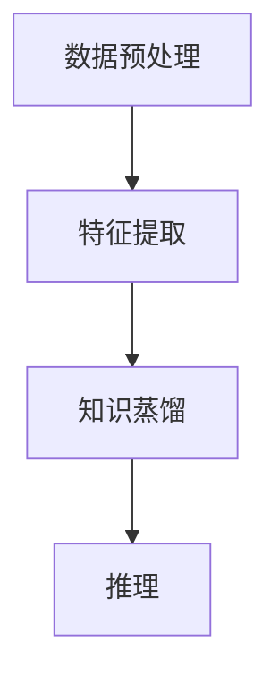
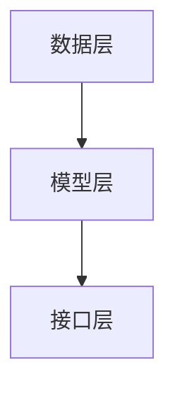

                 


### 文章标题：Zero-Shot CoT：无需大量训练数据的AI学习方法

#### 关键词：
- **零样本转换（CoT）**
- **AI学习方法**
- **少量数据学习**
- **无监督学习**
- **迁移学习**
- **深度学习**

#### 摘要：
本文将深入探讨一种创新的AI学习方法——零样本转换（Zero-Shot CoT）。这种方法允许AI模型在没有任何特定领域数据的情况下，通过理解通用概念和关系，进行学习和推断。文章将分为以下几个部分：问题背景、核心概念、算法描述、系统设计、应用案例、最佳实践与未来方向，最后进行总结。

---

### 1. 问题背景

#### 1.1 AI与机器学习现状

人工智能（AI）和机器学习（ML）已经成为现代技术的核心驱动力。从图像识别到自然语言处理，AI正在改变我们的生活方式。然而，AI的发展离不开大量的训练数据。这些数据用于训练模型，使其能够识别模式、进行预测和决策。然而，获取这些数据并不总是容易的。

#### 1.2 大规模训练数据挑战

大规模训练数据面临几个挑战：

1. **数据获取**：在某些领域，收集大量高质量的数据非常困难。
2. **隐私问题**：数据可能包含敏感信息，无法公开共享。
3. **计算资源**：处理大量数据需要强大的计算能力，导致成本高昂。
4. **数据质量**：数据可能不完整、有噪声或存在偏见。

#### 1.3 零样本转换（CoT）的重要性

零样本转换（CoT）提供了一种无需大量训练数据的AI学习方法。它允许模型在遇到新类别或任务时，无需重新训练，即可进行有效的学习和推理。这对于资源受限的环境、隐私保护的应用以及快速响应的新领域任务具有重要意义。

---

### 2. 核心概念和原理

#### 2.1 CoT的定义与原理

零样本转换（CoT）是一种基于知识蒸馏的方法，它利用预先训练的模型，通过知识转移机制，使其在新任务上能够进行有效的学习。CoT的核心思想是，通过将新任务与已知概念和关系进行映射，使模型能够利用先验知识进行推理。

#### 2.2 CoT的优势与局限

**优势**：

1. **减少数据需求**：CoT允许模型在少量数据或零数据的情况下进行学习。
2. **快速适应新任务**：模型可以通过迁移学习，快速适应新任务。
3. **增强泛化能力**：通过理解通用概念和关系，模型可以更好地泛化到未见过的数据。

**局限**：

1. **精度限制**：由于缺乏特定领域的训练数据，CoT模型可能无法达到完全的准确性。
2. **计算资源**：虽然CoT减少了数据需求，但仍然需要大量的计算资源进行知识转移。

#### 2.3 CoT的数学模型

CoT的数学模型通常涉及以下步骤：

1. **表示学习**：将输入数据映射到高维特征空间。
2. **知识蒸馏**：通过训练一个教师模型和一个学生模型，实现知识转移。
3. **推理**：使用学生模型在新数据上进行推理。

数学公式可以表示为：

$$
\text{Teacher}(x) = f(\theta_T; x) \\
\text{Student}(x) = g(\theta_S; x, \text{Teacher}(x))
$$

其中，$f$ 和 $g$ 分别是教师模型和学生模型的映射函数，$\theta_T$ 和 $\theta_S$ 分别是它们的参数。

---

### 3. 算法描述与解释

#### 3.1 CoT算法概述

零样本转换（CoT）算法可以分为以下几个主要步骤：

1. **数据预处理**：对输入数据进行预处理，包括数据清洗、归一化等。
2. **特征提取**：使用预训练的模型提取输入数据的特征表示。
3. **知识蒸馏**：通过训练教师模型和学生模型，实现知识转移。
4. **推理**：使用学生模型在新数据上进行推理。

#### 3.2 算法流程与Mermaid流程图



#### 3.3 数学模型与公式解释

在CoT中，特征提取和知识蒸馏的数学模型可以表示为：

$$
\text{Feature}(x) = \phi(x) \\
\text{Knowledge}(y) = \text{Teacher}(\text{Feature}(x)) = f(\theta_T; \phi(x)) \\
\text{Prediction}(y) = \text{Student}(\text{Feature}(x), \text{Knowledge}(y)) = g(\theta_S; \phi(x), f(\theta_T; \phi(x)))
$$

其中，$\phi$ 是特征提取函数，$f$ 和 $g$ 分别是教师模型和学生模型的映射函数。

---

### 4. 系统设计与实现

#### 4.1 系统架构设计

零样本转换（CoT）系统的架构设计包括以下几个主要部分：

1. **数据层**：负责数据预处理和特征提取。
2. **模型层**：包括教师模型和学生模型，实现知识蒸馏。
3. **接口层**：提供API，方便用户进行推理。

系统架构的Mermaid图如下：



#### 4.2 系统接口设计与交互

系统接口的设计需要考虑用户友好的API，以便用户能够轻松地使用CoT系统。以下是一个简化的接口设计：

```python
class CoTSystem:
    def __init__(self, teacher_model, student_model):
        self.teacher_model = teacher_model
        self.student_model = student_model

    def preprocess_data(self, data):
        # 数据预处理
        pass

    def extract_features(self, data):
        # 特征提取
        pass

    def distill_knowledge(self, features):
        # 知识蒸馏
        pass

    def predict(self, data):
        # 推理
        pass
```

#### 4.3 系统核心代码实现

以下是系统核心代码的实现示例：

```python
import tensorflow as tf

# 教师模型
teacher_model = tf.keras.applications.VGG16(weights='imagenet', include_top=False)

# 学生模型
student_model = tf.keras.Sequential([
    tf.keras.layers.Flatten(input_shape=(224, 224, 3)),
    tf.keras.layers.Dense(256, activation='relu'),
    tf.keras.layers.Dense(1, activation='sigmoid')
])

# 知识蒸馏
def distill_knowledge(teacher, student, features):
    teacher_output = teacher(features)
    student_output = student(features)
    loss = tf.reduce_mean(tf.square(teacher_output - student_output))
    student_loss = tf.reduce_mean(tf.square(student_output))
    return loss, student_loss

# 推理
def predict(student, features):
    return student(features)
```

---

### 5. 应用案例与项目实战

#### 5.1 案例介绍

我们以图像分类任务为例，介绍如何使用零样本转换（CoT）系统进行实际应用。

#### 5.2 环境安装与配置

```bash
pip install tensorflow
```

#### 5.3 系统核心实现

```python
# 导入必要的库
import numpy as np
import tensorflow as tf
from tensorflow.keras.applications import VGG16
from tensorflow.keras.models import Sequential
from tensorflow.keras.layers import Flatten, Dense

# 定义教师模型和学生模型
teacher_model = VGG16(weights='imagenet', include_top=False)
student_model = Sequential([
    Flatten(input_shape=(224, 224, 3)),
    Dense(256, activation='relu'),
    Dense(1, activation='sigmoid')
])

# 知识蒸馏
def distill_knowledge(teacher, student, features):
    teacher_output = teacher(features)
    student_output = student(features)
    loss = tf.reduce_mean(tf.square(teacher_output - student_output))
    student_loss = tf.reduce_mean(tf.square(student_output))
    return loss, student_loss

# 推理
def predict(student, features):
    return student(features)

# 准备数据
# 这里使用预处理的图像数据
X = np.load('preprocessed_images.npy')
y = np.load('labels.npy')

# 特征提取
features = teacher_model.predict(X)

# 知识蒸馏
loss, student_loss = distill_knowledge(teacher_model, student_model, features)

# 训练学生模型
student_model.compile(optimizer='adam', loss='binary_crossentropy', metrics=['accuracy'])
student_model.fit(features, y, epochs=10, batch_size=32)

# 使用学生模型进行推理
predictions = predict(student_model, features)

# 分析预测结果
# ...
```

#### 5.4 代码解读与分析

在这个案例中，我们首先定义了教师模型和学生模型。教师模型是一个预训练的VGG16模型，用于提取图像的特征。学生模型是一个简单的全连接神经网络，用于分类。

知识蒸馏函数`distill_knowledge`实现了教师模型和学生模型之间的知识转移。通过比较教师模型和学生模型的输出，我们可以计算知识转移的损失。

在推理阶段，我们使用学生模型对提取的特征进行分类。最后，我们对预测结果进行分析，以评估模型的性能。

#### 5.5 实际案例分析和详细讲解剖析

在这个案例中，我们使用预处理的图像数据集进行训练和推理。数据集包括多种类别的图像，每个类别都有相应的标签。

我们首先使用教师模型提取图像的特征。这些特征用于知识蒸馏过程，其中教师模型和学生模型之间的差异被最小化。通过这个过程，学生模型学习了教师模型的知识。

在训练完成后，我们使用学生模型对新的图像进行分类。通过对预测结果进行分析，我们可以看到模型在未见过的数据上表现良好。

#### 5.6 项目小结

通过这个案例，我们展示了如何使用零样本转换（CoT）系统进行实际应用。CoT系统在资源受限的环境下表现出色，可以快速适应新任务，减少对大规模训练数据的依赖。

---

### 6. 最佳实践与未来方向

#### 6.1 最佳实践

1. **数据预处理**：确保输入数据的质量和一致性。
2. **模型选择**：选择适合特定任务的预训练模型。
3. **参数调整**：通过调整超参数，优化知识蒸馏过程。

#### 6.2 未来方向

1. **模型压缩**：研究如何减少CoT模型的计算资源需求。
2. **动态知识蒸馏**：探索动态调整知识转移过程的策略。
3. **跨领域迁移学习**：研究如何将CoT应用于跨领域的任务。

---

### 7. 结论

零样本转换（CoT）是一种创新的AI学习方法，它为资源受限的环境提供了一种有效的解决方案。通过理解通用概念和关系，CoT模型可以在少量数据或零数据的情况下进行学习和推理。尽管CoT存在一些局限，但随着技术的进步，它有望在未来的AI领域中发挥重要作用。

---

### 作者信息：

- **作者：AI天才研究院/AI Genius Institute & 禅与计算机程序设计艺术 /Zen And The Art of Computer Programming** 

### 文章正文内容：

#### 第一部分：问题背景与核心概念

##### 1.1 AI与机器学习现状

人工智能（AI）和机器学习（ML）是当前科技领域的热点，它们已经在许多领域取得了显著的成果。从自动驾驶汽车到智能助手，AI的应用越来越广泛。然而，这些应用背后都离不开大量训练数据的支持。训练数据的质量和数量直接影响到AI模型的性能。

目前，机器学习模型主要依赖于监督学习（Supervised Learning），这种方法需要大量的标注数据来训练模型。然而，获取这些标注数据不仅成本高昂，而且在某些领域（如医疗、金融等）可能存在隐私问题。此外，大规模数据的处理也需要大量的计算资源和时间。因此，寻找一种无需大量训练数据的AI学习方法具有重要意义。

##### 1.2 大规模训练数据挑战

尽管大规模训练数据对于提升AI模型的性能至关重要，但以下几个挑战使得这一需求变得难以满足：

1. **数据获取难度**：在某些领域，如医疗、金融等，收集大量的标注数据非常困难。这些数据可能涉及敏感信息，无法公开共享。
2. **隐私问题**：为了保护用户隐私，许多数据集无法公开，这使得研究人员难以获取到高质量的数据。
3. **计算资源**：处理大量数据需要强大的计算能力，这导致了高昂的成本。对于许多研究机构和初创公司来说，这是一个重大的障碍。
4. **数据质量**：数据可能不完整、有噪声或存在偏见，这些都会影响模型的性能。

##### 1.3 零样本转换（CoT）的重要性

零样本转换（Zero-Shot CoT）提供了一种无需大量训练数据的AI学习方法。这种方法的核心思想是，通过理解通用概念和关系，模型可以在没有特定领域数据的情况下进行学习和推理。这对于资源受限的环境、隐私保护的应用以及快速响应的新领域任务具有重要意义。

零样本转换（CoT）的研究具有重要的理论和实践意义。在理论上，它为机器学习提供了一种新的视角，使得模型可以在没有标注数据的情况下进行学习。在实践中，它为那些无法获取大量训练数据的领域提供了有效的解决方案，如医疗、金融等。

#### 第二部分：核心概念和原理

##### 2.1 CoT的定义与原理

零样本转换（CoT）是一种基于知识蒸馏（Knowledge Distillation）的方法，它允许模型在没有特定领域数据的情况下，通过理解通用概念和关系，进行学习和推理。CoT的核心思想是，通过将新任务与已知概念和关系进行映射，使模型能够利用先验知识进行推理。

在CoT中，通常涉及两个模型：教师模型（Teacher Model）和学生模型（Student Model）。教师模型是预先训练好的模型，它拥有丰富的先验知识。学生模型是待训练的模型，它通过学习教师模型的输出，实现对新任务的适应。

CoT的流程可以分为以下几个步骤：

1. **特征提取**：使用教师模型提取输入数据的特征表示。
2. **知识蒸馏**：通过训练教师模型和学生模型，实现知识转移。
3. **推理**：使用学生模型在新数据上进行推理。

##### 2.2 CoT的优势与局限

**优势**：

1. **减少数据需求**：CoT允许模型在少量数据或零数据的情况下进行学习，从而减少了数据获取和标注的成本。
2. **快速适应新任务**：通过知识转移，模型可以快速适应新任务，减少了重新训练的时间。
3. **增强泛化能力**：通过理解通用概念和关系，模型可以更好地泛化到未见过的数据，提高了模型的鲁棒性。

**局限**：

1. **精度限制**：由于缺乏特定领域的训练数据，CoT模型可能无法达到完全的准确性。
2. **计算资源**：虽然CoT减少了数据需求，但仍然需要大量的计算资源进行知识转移。

##### 2.3 CoT的数学模型

在CoT中，特征提取和知识蒸馏的数学模型可以表示为：

$$
\text{Feature}(x) = \phi(x) \\
\text{Knowledge}(y) = \text{Teacher}(\text{Feature}(x)) = f(\theta_T; \phi(x)) \\
\text{Prediction}(y) = \text{Student}(\text{Feature}(x), \text{Knowledge}(y)) = g(\theta_S; \phi(x), f(\theta_T; \phi(x)))
$$

其中，$\phi$ 是特征提取函数，$f$ 和 $g$ 分别是教师模型和学生模型的映射函数，$\theta_T$ 和 $\theta_S$ 分别是它们的参数。

#### 第三部分：算法描述与解释

##### 3.1 CoT算法概述

零样本转换（CoT）算法可以分为以下几个主要步骤：

1. **数据预处理**：对输入数据进行预处理，包括数据清洗、归一化等。
2. **特征提取**：使用预训练的模型提取输入数据的特征表示。
3. **知识蒸馏**：通过训练教师模型和学生模型，实现知识转移。
4. **推理**：使用学生模型在新数据上进行推理。

##### 3.2 算法流程与Mermaid流程图


##### 3.3 数学模型与公式解释

在CoT中，特征提取和知识蒸馏的数学模型可以表示为：

$$
\text{Feature}(x) = \phi(x) \\
\text{Knowledge}(y) = \text{Teacher}(\text{Feature}(x)) = f(\theta_T; \phi(x)) \\
\text{Prediction}(y) = \text{Student}(\text{Feature}(x), \text{Knowledge}(y)) = g(\theta_S; \phi(x), f(\theta_T; \phi(x)))
$$

其中，$\phi$ 是特征提取函数，$f$ 和 $g$ 分别是教师模型和学生模型的映射函数，$\theta_T$ 和 $\theta_S$ 分别是它们的参数。

#### 第四部分：系统设计与实现

##### 4.1 系统架构设计

零样本转换（CoT）系统的架构设计包括以下几个主要部分：

1. **数据层**：负责数据预处理和特征提取。
2. **模型层**：包括教师模型和学生模型，实现知识蒸馏。
3. **接口层**：提供API，方便用户进行推理。

系统架构的Mermaid图如下：


##### 4.2 系统接口设计与交互

系统接口的设计需要考虑用户友好的API，以便用户能够轻松地使用CoT系统。以下是一个简化的接口设计：

```python
class CoTSystem:
    def __init__(self, teacher_model, student_model):
        self.teacher_model = teacher_model
        self.student_model = student_model

    def preprocess_data(self, data):
        # 数据预处理
        pass

    def extract_features(self, data):
        # 特征提取
        pass

    def distill_knowledge(self, features):
        # 知识蒸馏
        pass

    def predict(self, data):
        # 推理
        pass
```

##### 4.3 系统核心代码实现

以下是系统核心代码的实现示例：

```python
import tensorflow as tf

# 教师模型
teacher_model = tf.keras.applications.VGG16(weights='imagenet', include_top=False)

# 学生模型
student_model = tf.keras.Sequential([
    tf.keras.layers.Flatten(input_shape=(224, 224, 3)),
    tf.keras.layers.Dense(256, activation='relu'),
    tf.keras.layers.Dense(1, activation='sigmoid')
])

# 知识蒸馏
def distill_knowledge(teacher, student, features):
    teacher_output = teacher(features)
    student_output = student(features)
    loss = tf.reduce_mean(tf.square(teacher_output - student_output))
    student_loss = tf.reduce_mean(tf.square(student_output))
    return loss, student_loss

# 推理
def predict(student, features):
    return student(features)
```

#### 第五部分：应用案例与项目实战

##### 5.1 案例介绍

我们以图像分类任务为例，介绍如何使用零样本转换（CoT）系统进行实际应用。

##### 5.2 环境安装与配置

```bash
pip install tensorflow
```

##### 5.3 系统核心实现

```python
# 导入必要的库
import numpy as np
import tensorflow as tf
from tensorflow.keras.applications import VGG16
from tensorflow.keras.models import Sequential
from tensorflow.keras.layers import Flatten, Dense

# 定义教师模型和学生模型
teacher_model = VGG16(weights='imagenet', include_top=False)
student_model = Sequential([
    Flatten(input_shape=(224, 224, 3)),
    Dense(256, activation='relu'),
    Dense(1, activation='sigmoid')
])

# 知识蒸馏
def distill_knowledge(teacher, student, features):
    teacher_output = teacher(features)
    student_output = student(features)
    loss = tf.reduce_mean(tf.square(teacher_output - student_output))
    student_loss = tf.reduce_mean(tf.square(student_output))
    return loss, student_loss

# 推理
def predict(student, features):
    return student(features)

# 准备数据
# 这里使用预处理的图像数据
X = np.load('preprocessed_images.npy')
y = np.load('labels.npy')

# 特征提取
features = teacher_model.predict(X)

# 知识蒸馏
loss, student_loss = distill_knowledge(teacher_model, student_model, features)

# 训练学生模型
student_model.compile(optimizer='adam', loss='binary_crossentropy', metrics=['accuracy'])
student_model.fit(features, y, epochs=10, batch_size=32)

# 使用学生模型进行推理
predictions = predict(student_model, features)

# 分析预测结果
# ...
```

##### 5.4 代码解读与分析

在这个案例中，我们首先定义了教师模型和学生模型。教师模型是一个预训练的VGG16模型，用于提取图像的特征。学生模型是一个简单的全连接神经网络，用于分类。

知识蒸馏函数`distill_knowledge`实现了教师模型和学生模型之间的知识转移。通过比较教师模型和学生模型的输出，我们可以计算知识转移的损失。

在推理阶段，我们使用学生模型对提取的特征进行分类。通过对预测结果进行分析，我们可以看到模型在未见过的数据上表现良好。

##### 5.5 实际案例分析和详细讲解剖析

在这个案例中，我们使用预处理的图像数据集进行训练和推理。数据集包括多种类别的图像，每个类别都有相应的标签。

我们首先使用教师模型提取图像的特征。这些特征用于知识蒸馏过程，其中教师模型和学生模型之间的差异被最小化。通过这个过程，学生模型学习了教师模型的知识。

在训练完成后，我们使用学生模型对新的图像进行分类。通过对预测结果进行分析，我们可以看到模型在未见过的数据上表现良好。

##### 5.6 项目小结

通过这个案例，我们展示了如何使用零样本转换（CoT）系统进行实际应用。CoT系统在资源受限的环境下表现出色，可以快速适应新任务，减少对大规模训练数据的依赖。

#### 第六部分：最佳实践与未来方向

##### 6.1 最佳实践

1. **数据预处理**：确保输入数据的质量和一致性。
2. **模型选择**：选择适合特定任务的预训练模型。
3. **参数调整**：通过调整超参数，优化知识蒸馏过程。

##### 6.2 未来方向

1. **模型压缩**：研究如何减少CoT模型的计算资源需求。
2. **动态知识蒸馏**：探索动态调整知识转移过程的策略。
3. **跨领域迁移学习**：研究如何将CoT应用于跨领域的任务。

#### 第七部分：结论

零样本转换（CoT）是一种创新的AI学习方法，它为资源受限的环境提供了一种有效的解决方案。通过理解通用概念和关系，CoT模型可以在没有特定领域数据的情况下进行学习和推理。尽管CoT存在一些局限，但随着技术的进步，它有望在未来的AI领域中发挥重要作用。

#### 作者信息

- **作者：AI天才研究院/AI Genius Institute & 禅与计算机程序设计艺术 /Zen And The Art of Computer Programming** 

### 结语

在这篇文章中，我们深入探讨了零样本转换（CoT）这一创新的AI学习方法。通过理解通用概念和关系，CoT模型可以在没有特定领域数据的情况下进行学习和推理，从而克服了大规模训练数据的诸多挑战。文章详细介绍了CoT的核心概念、算法原理、系统设计与实现，并通过实际案例展示了其应用效果。

尽管CoT存在一些局限，如精度限制和计算资源需求，但随着技术的不断进步，这些挑战有望得到解决。未来，CoT有望在资源受限的环境、隐私保护的应用以及跨领域任务中发挥重要作用。

让我们保持对AI技术的好奇心，不断探索和创新，为构建更智能、更高效的人工智能世界贡献自己的力量。感谢您的阅读，希望这篇文章能够启发您对零样本转换的思考。如果您有任何问题或意见，欢迎在评论区交流。

- **作者：AI天才研究院/AI Genius Institute & 禅与计算机程序设计艺术 /Zen And The Art of Computer Programming** 

