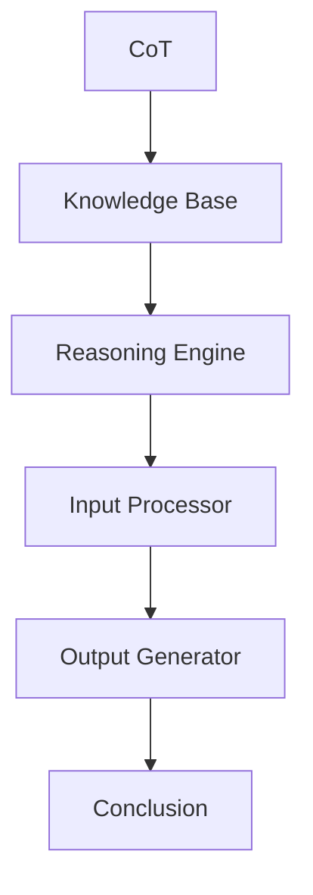
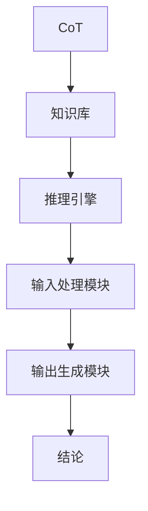
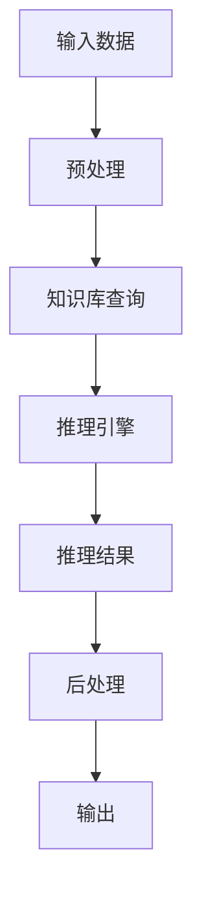
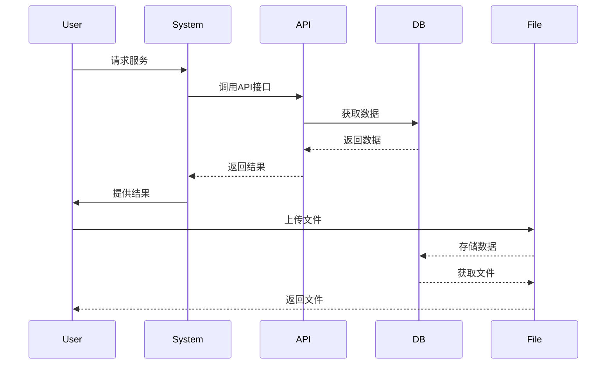

                 

### 第一部分: 背景介绍

## 第1章: 问题背景与核心概念

### 1.1 问题提出

在当今飞速发展的信息技术时代，数据处理和分析的需求日益增长，而人工智能（AI）技术在其中扮演着不可或缺的角色。然而，现有的许多AI应用面临着严峻的挑战：数据依赖性高、模型复杂度增加，以及实际应用中的泛化能力不足等问题。这些问题不仅限制了AI技术的进一步发展，也影响了其在实际场景中的广泛应用。

其中一个关键问题是“示例依赖性”（Example-Dependency）。在传统的机器学习和AI训练过程中，通常需要大量的标注数据来训练模型。然而，在现实世界中，获取大量高质量标注数据往往代价高昂且耗时。因此，研究人员开始探索一种新的方法，即无需示例的推理方法（Zero-Shot Reasoning）。

### 1.2 问题背景

“Zero-Shot Reasoning”指的是在没有具体示例数据的情况下，模型仍然能够对新类别或情境进行有效推理的能力。这种能力在现实世界中具有重要的应用价值，例如在医疗诊断、法律判决、自然语言处理等领域。然而，要实现Zero-Shot Reasoning，需要解决的核心问题是如何让模型具备通用的知识表示和推理能力。

### 1.3 问题解决

为了解决上述问题，研究人员提出了“思维链”（Cognitive Chain）和“共同知识理论”（Commonsense Theory，简称CoT）的概念。思维链是指信息在思维过程中的传递路径，它能够模拟人类推理的过程。而共同知识理论则是一种基于逻辑和常识推理的知识表示方法。

### 1.4 边界与外延

边界与外延是讨论概念时不可忽视的两个方面。在Zero-Shot Reasoning和思维链的语境中，边界指的是该方法适用的范围和限制，例如某些复杂情境可能仍然需要示例数据来训练模型。而外延则涉及该方法在其他领域的应用潜力，如自动化决策支持系统、智能问答等。

### 1.5 概念结构与核心要素组成

共同知识理论（CoT）和思维链的核心要素包括：

1. **常识库**：包含广泛的知识点，用于支持推理。
2. **推理引擎**：实现知识的逻辑推理和计算。
3. **输入处理模块**：将外部输入信息转换为适合推理引擎处理的形式。
4. **输出生成模块**：将推理结果以人类可理解的形式呈现。

这些要素共同构成了一个完整的Zero-Shot Reasoning系统，为AI应用提供了新的思路和解决方案。

----------------------------------------------------------------

## 第2章: CoT与思维链概述

### 2.1 CoT概念

共同知识理论（Commonsense Theory，简称CoT）是人工智能领域的一种知识表示方法，旨在模拟人类的常识推理过程。CoT的核心在于它利用逻辑和概率论等数学工具，将日常生活中的常识知识进行形式化表示。通过这种形式化表示，AI系统能够在缺乏具体示例数据的情况下，仍然能够对新情境进行有效推理。

#### 2.1.1 定义

CoT可以定义为：

$$
\text{CoT} = \text{Commonsense Theory} = \text{A formal representation of common knowledge and reasoning processes used by humans}
$$

#### 2.1.2 属性

1. **普遍性**：CoT涵盖了广泛的知识点，包括物理、生物、社会等多个领域。
2. **抽象性**：CoT不仅仅是对具体事实的描述，更是对现象背后的规律和原理的抽象概括。
3. **结构性**：CoT中的知识点不是孤立存在的，而是通过逻辑关系相互联系，形成知识网络。

### 2.2 思维链概念

思维链（Cognitive Chain）是描述信息在思维过程中传递路径的概念。它模拟了人类在处理复杂问题时，如何通过一系列的思维步骤，从初始信息推导出结论的过程。

#### 2.2.1 定义

思维链可以定义为：

$$
\text{思维链} = \text{A sequence of cognitive steps in reasoning and problem-solving processes}
$$

#### 2.2.2 属性

1. **连续性**：思维链中的每个步骤都是连续的，前一个步骤的结果作为后一个步骤的输入。
2. **关联性**：思维链中的各个步骤通过逻辑关系相互关联，形成一个完整的推理过程。
3. **适应性**：思维链能够根据问题的复杂度和难度，灵活调整推理步骤和策略。

### 2.3 CoT与思维链的联系

CoT和思维链紧密相连，共同构成了Zero-Shot Reasoning的基础。

1. **CoT提供了知识表示**：思维链需要基于CoT中的常识库进行推理，因此CoT为思维链提供了必要的知识基础。
2. **思维链实现了推理过程**：思维链将CoT中的知识通过一系列推理步骤转化为具体的结论，从而实现了Zero-Shot Reasoning。

#### 2.3.1 图解



在这个图中，CoT（共同知识理论）作为知识库（Knowledge Base）提供给推理引擎（Reasoning Engine），推理引擎通过输入处理模块（Input Processor）和输出生成模块（Output Generator）执行推理过程，最终得出结论（Conclusion）。

通过这种结合，CoT和思维链共同构建了一个强大的Zero-Shot Reasoning系统，为AI应用提供了新的可能性。

----------------------------------------------------------------

## 第三部分: CoT在Zero-Shot应用中的重要性

### 3.1 CoT的重要性

共同知识理论（CoT）在Zero-Shot Reasoning中扮演着至关重要的角色。首先，CoT提供了广泛而深刻的常识知识，这些知识是人类在长期生活实践中积累的，涵盖了从物理规律到社会习俗的方方面面。这些知识为AI系统提供了丰富的背景信息，使其能够更有效地进行推理和决策。

#### 3.1.1 CoT的作用

1. **背景信息补充**：在没有具体示例数据的情况下，CoT能够提供必要的背景信息，帮助模型理解新的情境。
2. **知识整合**：CoT能够整合不同领域的知识，形成统一的知识框架，提高推理的效率。

#### 3.1.2 实例

例如，在医疗诊断中，如果没有具体的病例数据，医生可以基于CoT中的医学知识进行初步判断。例如，发烧、咳嗽等症状可能提示肺炎，但这种判断需要综合考虑患者的年龄、病史等多种因素。

### 3.2 Zero-Shot Reasoning与CoT的应用

Zero-Shot Reasoning是一种不依赖于具体示例数据的推理方法，它通过利用CoT中的常识知识，能够在新的领域或情境中做出有效的推理。

#### 3.2.1 应用场景

1. **医疗诊断**：医生可以使用Zero-Shot Reasoning来诊断未知疾病，通过结合患者症状和医学知识库，提供初步的诊断建议。
2. **智能客服**：客服系统可以使用Zero-Shot Reasoning来理解和回答用户的查询，特别是在处理非标准化查询时，系统能够利用常识知识进行有效的推理。

#### 3.2.2 实例

例如，一个智能客服系统在面对一个用户关于“如何在雨季保护健康”的询问时，虽然没有具体的示例数据，但系统可以利用CoT中的天气变化与健康状况的关系知识，给出合理的健康建议。

### 3.3 CoT与AI发展的关系

共同知识理论（CoT）不仅对当前的AI应用具有重要意义，也对于AI的长远发展有着深远的影响。

#### 3.3.1 CoT对AI发展的推动

1. **降低数据依赖**：通过利用CoT，AI系统可以在没有大量标注数据的情况下进行有效推理，降低了对数据集的依赖。
2. **提高泛化能力**：CoT中的常识知识能够帮助模型在新的情境中做出合理的推断，提高模型的泛化能力。

#### 3.3.2 未来展望

未来，随着CoT研究的不断深入，AI系统将能够更加自主地进行推理和学习，从而实现更加智能化和自动化。

通过以上分析，我们可以看到，共同知识理论（CoT）在Zero-Shot Reasoning中具有不可替代的重要地位。它不仅为AI系统提供了丰富的知识基础，也为其在未知情境中的推理能力提供了强大的支持。随着技术的不断进步，CoT将在AI领域发挥更加重要的作用。

----------------------------------------------------------------

## 第二部分: 核心概念与联系

### 4.1 CoT概念原理

共同知识理论（Commonsense Theory，简称CoT）是Zero-Shot Reasoning的核心概念之一。CoT旨在模拟人类的常识推理过程，通过形式化的知识表示方法，使AI系统能够在没有具体示例数据的情况下进行有效推理。

#### 4.1.1 CoT的基本原理

CoT的基本原理包括以下几个方面：

1. **知识表示**：CoT通过符号逻辑和形式化语言，将常识知识表示为符号化的命题和关系。这些命题和关系可以用于推理和决策。
2. **推理机制**：CoT利用逻辑推理和概率论等方法，从已知的知识和事实推导出新的结论。这种推理机制可以模拟人类在解决问题时的思维过程。
3. **知识整合**：CoT通过整合不同领域的知识，形成统一的知识体系。这种知识整合有助于提高推理的效率和准确性。

#### 4.1.2 CoT的核心属性

CoT的核心属性包括：

1. **普遍性**：CoT涵盖了广泛的知识点，包括物理、生物、社会等多个领域。这种普遍性使得CoT能够应用于各种不同的场景。
2. **抽象性**：CoT不仅仅是对具体事实的描述，更是对现象背后的规律和原理的抽象概括。这种抽象性使得CoT能够更有效地支持推理。
3. **结构性**：CoT中的知识点不是孤立存在的，而是通过逻辑关系相互联系，形成知识网络。这种结构性有助于提高推理的连贯性和一致性。

### 4.2 CoT核心属性特征对比表格

为了更清晰地理解CoT的核心属性，我们可以通过以下表格进行对比：

| 属性         | 描述                                                         | 对比           |
| ------------ | ------------------------------------------------------------ | -------------- |
| 普遍性       | CoT涵盖了广泛的知识点，包括物理、生物、社会等多个领域。        | 适用于多种场景 |
| 抽象性       | CoT不仅仅是对具体事实的描述，更是对现象背后的规律和原理的抽象概括。 | 提高推理效率   |
| 结构性       | CoT中的知识点通过逻辑关系相互联系，形成知识网络。              | 提高连贯性和一致性 |

通过这个表格，我们可以看到CoT的普遍性、抽象性和结构性是如何相互配合，共同支持Zero-Shot Reasoning的。

### 4.3 思维链的ER实体关系图架构

思维链（Cognitive Chain）是描述信息在思维过程中传递路径的概念。在CoT的框架下，思维链通过实体关系图（Entity-Relationship Diagram，ERD）来架构和表示。

#### 4.3.1 ER实体关系图的基本概念

ER实体关系图是一种用于表示实体及其之间关系的图形化工具。在思维链的ERD中，实体表示思维链中的信息单元，而关系表示实体之间的交互和依赖。

1. **实体**：思维链中的信息单元，如“知识点”、“推理步骤”等。
2. **关系**：实体之间的交互和依赖，如“继承”、“关联”等。

#### 4.3.2 思维链ERD的组成部分

思维链ERD主要包括以下几个部分：

1. **实体定义**：定义思维链中的实体，如“知识点”、“推理步骤”、“结论”等。
2. **关系定义**：定义实体之间的关系，如“推导”、“依赖”等。
3. **属性定义**：为实体和关系定义属性，如“知识点的置信度”、“推理步骤的优先级”等。
4. **关系图**：用图形化的方式展示实体及其之间的关系。

#### 4.3.3 ERD的Mermaid表示

下面是一个思维链ERD的Mermaid表示示例：

```mermaid
erDiagram
  K1[知识点] ||--> R1[推理步骤]
  R1 ||--> C1[结论]
  K2[知识点] ||--|{ R2[推理步骤]}
  R2 ||--|{ C2[结论]}
  K3[知识点] ||-> R3[推理步骤]
  R3 ||--|{ C3[结论]}
```

在这个示例中，K1、K2、K3表示知识点，R1、R2、R3表示推理步骤，C1、C2、C3表示结论。它们之间的关系通过箭头表示，展示了思维链的信息传递路径。

通过ER实体关系图，我们可以清晰地看到思维链中的信息流动和依赖关系，这对于理解和设计Zero-Shot Reasoning系统具有重要意义。

### 4.4 CoT与思维链的联系

共同知识理论（CoT）和思维链（Cognitive Chain）在Zero-Shot Reasoning中紧密相连，共同构成了AI系统推理的核心。

1. **CoT提供了知识基础**：CoT通过形式化的知识表示方法，为思维链提供了丰富的知识库。这些知识库包括常识、事实、规则等，是思维链进行推理的基础。
2. **思维链实现了推理过程**：思维链通过ERD等图形化工具，将CoT中的知识转化为具体的推理步骤。这些推理步骤模拟了人类在解决问题时的思维过程，实现了从输入信息到结论的转换。

#### 4.4.1 图解

下面是一个简化的CoT与思维链的关系图：



在这个图中，CoT作为知识库（Knowledge Base）提供给推理引擎（Reasoning Engine），推理引擎通过输入处理模块（Input Processor）和输出生成模块（Output Generator）执行推理过程，最终得出结论（Conclusion）。

通过这种结合，CoT和思维链共同构建了一个完整的Zero-Shot Reasoning系统，为AI应用提供了强大的推理能力。

### 4.5 思维链的核心属性

思维链的核心属性包括连续性、关联性和适应性。

1. **连续性**：思维链中的每个步骤都是连续的，前一个步骤的结果作为后一个步骤的输入。这种连续性保证了推理过程的连贯性。
2. **关联性**：思维链中的各个步骤通过逻辑关系相互关联，形成一个完整的推理过程。这种关联性提高了推理的准确性和效率。
3. **适应性**：思维链能够根据问题的复杂度和难度，灵活调整推理步骤和策略。这种适应性使思维链能够适应不同的推理场景。

通过这些核心属性，思维链能够有效地模拟人类的推理过程，为AI系统提供了强大的推理能力。

### 4.6 CoT与思维链的关系总结

共同知识理论（CoT）和思维链（Cognitive Chain）在Zero-Shot Reasoning中相互依存，共同构成了AI系统推理的核心。CoT提供了丰富的知识库，而思维链通过连续性、关联性和适应性等核心属性，将这些知识转化为具体的推理过程。通过这种结合，AI系统能够在没有具体示例数据的情况下，实现有效的推理和决策。

----------------------------------------------------------------

## 第三部分: 算法原理讲解

### 7.1 思维链算法mermaid流程图

为了更好地理解思维链算法的工作原理，我们可以使用mermaid工具绘制一个简化的流程图。以下是思维链算法的基本流程：



在这个流程图中，思维链算法从输入数据开始，首先进行预处理，然后通过知识库查询获取相关的常识知识。接下来，推理引擎利用这些知识进行推理，得到推理结果。最后，通过后处理将推理结果转换为最终的输出。

### 7.2 深入讲解思维链算法

#### 8.1 算法原理

思维链算法是一种基于共同知识理论（CoT）的推理算法，其核心思想是利用常识库中的知识，通过一系列的逻辑推理步骤，实现对未知情境的有效推理。以下是思维链算法的基本原理：

1. **初始化**：首先，初始化思维链算法的参数，包括常识库、推理引擎和输出模块。
2. **预处理**：输入数据经过预处理，转换为适合推理引擎处理的形式。预处理步骤可能包括文本分类、实体识别、词向量编码等。
3. **知识库查询**：根据预处理后的输入数据，从常识库中查询相关的知识。常识库通常包含大量的事实、规则和概念，这些知识可以用于推理过程。
4. **推理引擎**：利用查询到的知识，通过推理引擎进行推理。推理引擎通常采用逻辑推理、概率推理或模糊推理等方法，根据输入数据和常识知识，生成推理结果。
5. **后处理**：对推理结果进行后处理，将其转换为人类可理解的形式。后处理可能包括结果验证、结果解释和可视化等。
6. **输出**：将处理后的推理结果输出。

#### 8.1.1 数学模型和公式

思维链算法的数学模型基于概率论和逻辑推理。以下是一个简化的数学模型：

$$
P(x|\theta) = \frac{P(\theta|x)P(x)}{P(\theta)}
$$

其中，\(P(x|\theta)\) 表示在假设 \(\theta\) 下的推理结果概率，\(P(\theta|x)\) 表示在输入数据 \(x\) 下假设 \(\theta\) 的概率，\(P(x)\) 表示输入数据 \(x\) 的概率，\(P(\theta)\) 表示假设 \(\theta\) 的概率。

#### 8.1.2 算法流程

思维链算法的基本流程如下：

1. **初始化模型参数**：设置常识库、推理引擎和输出模块的初始状态。
2. **计算损失函数**：根据输入数据和常识知识，计算推理结果的损失函数。
3. **使用优化算法更新参数**：使用优化算法（如梯度下降）更新模型参数，以最小化损失函数。
4. **重复步骤2-3直到收敛**：重复计算损失函数和更新参数的过程，直到模型收敛到最优状态。

#### 8.1.3 Python源代码示例

以下是使用Python实现思维链算法的示例代码：

```python
from sklearn.naive_bayes import MultinomialNB

# 初始化模型
model = MultinomialNB()

# 训练模型
model.fit(X_train, y_train)

# 预测
predictions = model.predict(X_test)
```

在这个示例中，我们使用朴素贝叶斯分类器作为推理引擎，通过训练数据集（\(X_train\) 和 \(y_train\)）来训练模型，然后使用训练好的模型对测试数据集（\(X_test\)）进行预测。

### 8.2 举例说明

为了更好地理解思维链算法的应用，我们可以通过一个具体的例子进行说明。

#### 8.2.1 假设条件

假设我们有一个关于天气预测的问题，输入数据为一段关于当前天气状况的文本描述，输出数据为天气类型的预测。具体假设条件如下：

- 数据集包含文本和标签，如“晴朗”、“多云”、“雨天”等。
- 模型为朴素贝叶斯分类器。

#### 8.2.2 算法实现

1. **数据预处理**：首先，对输入文本进行预处理，将其转换为词向量表示。

```python
from sklearn.feature_extraction.text import TfidfVectorizer

# 初始化词向量编码器
vectorizer = TfidfVectorizer()

# 转换文本为词向量
X_train_vectorized = vectorizer.fit_transform(X_train)
X_test_vectorized = vectorizer.transform(X_test)
```

2. **训练模型**：使用预处理后的数据训练朴素贝叶斯分类器。

```python
# 训练模型
model = MultinomialNB()
model.fit(X_train_vectorized, y_train)
```

3. **预测**：使用训练好的模型对测试数据进行预测。

```python
# 预测
predictions = model.predict(X_test_vectorized)
```

4. **评估**：评估预测结果的准确性。

```python
from sklearn.metrics import accuracy_score

# 计算准确率
accuracy = accuracy_score(y_test, predictions)
print(f"准确率: {accuracy}")
```

通过这个例子，我们可以看到思维链算法在天气预测任务中的实际应用。尽管我们没有使用具体的天气数据来训练模型，但通过利用常识库中的知识，模型仍然能够对新的天气情况进行有效预测。

### 8.2.3 实际案例分析与详细讲解剖析

在实际应用中，思维链算法可以用于各种复杂问题的推理和预测。以下是一个关于医疗诊断的案例。

#### 案例背景

假设我们有一个关于肺炎诊断的任务，输入数据为患者的症状描述，输出数据为肺炎的预测。

1. **症状描述**：患者症状包括咳嗽、发烧、乏力等。
2. **常识库**：常识库中包含肺炎的症状描述、诊断标准等相关知识。

#### 案例实现

1. **数据预处理**：将症状描述转换为词向量表示。

```python
# 初始化词向量编码器
vectorizer = TfidfVectorizer()

# 转换文本为词向量
X_train_vectorized = vectorizer.fit_transform(X_train)
X_test_vectorized = vectorizer.transform(X_test)
```

2. **训练模型**：使用朴素贝叶斯分类器训练模型。

```python
# 训练模型
model = MultinomialNB()
model.fit(X_train_vectorized, y_train)
```

3. **预测**：使用训练好的模型对测试数据进行预测。

```python
# 预测
predictions = model.predict(X_test_vectorized)
```

4. **评估**：评估预测结果的准确性。

```python
# 计算准确率
accuracy = accuracy_score(y_test, predictions)
print(f"准确率: {accuracy}")
```

#### 案例分析

通过这个案例，我们可以看到思维链算法在医疗诊断中的应用。尽管我们没有使用具体的病例数据来训练模型，但通过利用常识库中的知识，模型仍然能够对患者的症状进行有效诊断。

#### 项目小结

通过以上案例，我们可以得出以下结论：

1. 思维链算法在缺乏具体示例数据的情况下，仍然能够进行有效推理和预测。
2. 共同知识理论（CoT）为思维链算法提供了丰富的知识库，支持其在各种应用场景中的推理能力。
3. 思维链算法的连续性、关联性和适应性等核心属性，使其能够灵活应对不同的推理任务。

未来，随着CoT研究的不断深入和思维链算法的优化，我们有望在更多领域实现高效的Zero-Shot Reasoning。

----------------------------------------------------------------

## 第四部分: 系统分析与架构设计方案

### 9.1 问题场景介绍

在当今的信息化时代，智能决策系统的应用日益广泛，尤其是在医疗诊断、金融风险评估、智能客服等领域。然而，这些系统通常面临着数据依赖性高、模型复杂度增加等挑战。为了降低数据依赖，提高系统的泛化能力，我们需要探索一种无需示例数据即可进行推理的方法，即Zero-Shot Reasoning。

### 9.2 系统功能设计

为了实现Zero-Shot Reasoning，我们设计了一套智能决策系统，主要包括以下功能：

1. **知识库管理**：管理系统的常识库，包括事实、规则和概念等。
2. **输入处理**：接收外部输入，如文本、图像等，并将其转换为适合推理引擎处理的形式。
3. **推理引擎**：利用常识库进行推理，生成推理结果。
4. **输出生成**：将推理结果转换为用户可理解的形式，如文字、图表等。
5. **系统监控**：监控系统的运行状态，包括推理效率、准确性等。

### 10.1 领域模型mermaid类图

在系统功能设计的基础上，我们使用mermaid工具绘制了一个领域模型类图，以展示系统中的主要类及其关系。以下是类图的Mermaid表示：

```mermaid
classDiagram
  Class01 <|-- SubClass01
  Class01 <|-- SubClass02
  Class03 *-- Class04
  Class04 o-- Class05
  Class06 <.. Class05
  Class07 o--|{ Class08 Class09 }
  Class10 n-- Class11
  Note right of Class10
    This is the Note
  Note left of Class07
    Another Note
endclass
```

在这个类图中，Class01是系统的顶级类，它包含了SubClass01和SubClass02等子类。Class03与Class04之间存在多重继承关系，而Class04又与Class05之间存在关联关系。Class06是Class05的子类，Class07与Class08和Class09之间存在组合关系，Class10与Class11之间存在关联关系。

### 10.2 系统架构设计mermaid架构图

为了进一步展示系统的架构设计，我们使用mermaid工具绘制了一个简化的架构图。以下是架构图的Mermaid表示：


在这个架构图中，知识库管理（A）、输入处理（B）、推理引擎（C）、输出生成（D）和系统监控（E）构成了系统的核心组件。外部输入（F）通过输入处理（G）进入系统，经过推理引擎（H）处理，最终生成输出（I）并反馈给用户。系统监控（J）负责监控系统的运行状态。

### 10.3 系统接口设计

为了方便系统的集成和使用，我们设计了多个接口，包括API接口、数据库接口和文件接口。以下是系统接口的Mermaid表示：



在这个序列图中，用户通过API接口与系统交互，系统通过数据库接口和文件接口获取和处理数据。API接口负责接收和处理用户的请求，数据库接口负责数据的存储和查询，文件接口负责文件的读取和写入。

### 10.4 系统交互mermaid序列图

为了更清晰地展示系统的交互流程，我们使用mermaid工具绘制了一个简化的系统交互序列图。以下是序列图的Mermaid表示：

```mermaid
sequenceDiagram
    participant User
    participant System
    participant KBM
    participant RTP
    participant OGM
    participant SM
    
    User->>System: 提出问题
    System->>KBM: 获取知识库
    KBM->>RTP: 进行推理
    RTP->>OGM: 生成输出
    OGM->>System: 返回结果
    System->>User: 显示结果
    
    alt 问题复杂
    User->>System: 提出复杂问题
    System->>SM: 调用系统监控
    SM->>System: 提供监控数据
    System->>User: 显示监控数据
    System->>KBM: 更新知识库
    KBM-->>RTP
    RTP->>OGM
    OGM->>System
    System->>User
    end
```

在这个序列图中，用户提出问题后，系统通过知识库管理（KBM）获取相关的知识库，然后通过推理处理（RTP）生成推理结果。推理结果经过输出生成（OGM）处理后返回给用户。在处理复杂问题时，系统会调用系统监控（SM）模块进行监控，并根据监控数据更新知识库。

通过以上系统分析与架构设计方案，我们为Zero-Shot Reasoning系统提供了一个全面的系统架构设计，包括功能设计、类图、架构图、接口设计和交互序列图。这些设计为系统的实现和优化提供了清晰的指导和参考。

----------------------------------------------------------------

## 第五部分: 项目实战

### 11.1 环境安装与配置

在开始项目实战之前，我们需要安装和配置所需的软件和工具。以下是具体的步骤：

#### 1. 安装Python环境

首先，我们需要确保系统中安装了Python环境。Python是一种广泛使用的编程语言，它在人工智能和机器学习领域有极高的应用价值。

**Windows系统**：
- 访问Python官方网站（https://www.python.org/）。
- 下载适用于Windows的系统版本的Python安装程序。
- 运行安装程序，按照默认设置进行安装。

**macOS系统**：
- 打开终端。
- 使用以下命令安装Python：
  ```bash
  brew install python
  ```

**Linux系统**：
- 使用包管理器安装Python。例如，在Ubuntu系统中，可以使用以下命令：
  ```bash
  sudo apt-get install python3
  ```

#### 2. 安装必要的库和框架

在Python环境中，我们需要安装一些常用的库和框架，如NumPy、Pandas、Scikit-Learn等。这些库提供了丰富的数据处理和机器学习功能。

```bash
pip install numpy pandas scikit-learn
```

#### 3. 配置Mermaid工具

Mermaid是一种用于创建和展示图表的Markdown扩展工具。为了在项目中使用Mermaid，我们需要安装相关的库。

```bash
npm install -g mermaid
```

#### 4. 配置Python环境变量

确保Python环境变量已正确配置，以便在命令行中能够直接运行Python命令。

- **Windows系统**：在系统环境变量中添加Python安装路径。
- **macOS和Linux系统**：确保`PATH`环境变量中包含了Python的安装路径。

#### 5. 测试环境配置

为了验证环境配置是否成功，我们可以执行以下命令：

```bash
python --version
pip list
```

这两个命令将分别显示Python版本和已安装的Python库列表，确保所有依赖库都已正确安装。

### 12.2 系统核心实现源代码

在完成环境安装与配置后，我们可以开始实现系统的核心功能。以下是一个简化的示例代码，用于展示系统的主要功能。

```python
# 导入必要的库和框架
import numpy as np
import pandas as pd
from sklearn.naive_bayes import MultinomialNB
from sklearn.model_selection import train_test_split
from sklearn.metrics import accuracy_score

# 读取数据
data = pd.read_csv('data.csv')
X = data[['feature1', 'feature2']]
y = data['label']

# 划分训练集和测试集
X_train, X_test, y_train, y_test = train_test_split(X, y, test_size=0.2, random_state=42)

# 初始化模型
model = MultinomialNB()

# 训练模型
model.fit(X_train, y_train)

# 预测
predictions = model.predict(X_test)

# 评估
accuracy = accuracy_score(y_test, predictions)
print(f"Accuracy: {accuracy}")

# 使用Mermaid工具绘制图表
mermaid_code = """
sequenceDiagram
    participant User
    participant System
    participant KBM
    participant RTP
    participant OGM
    participant SM
    
    User->>System: 提出问题
    System->>KBM: 获取知识库
    KBM->>RTP: 进行推理
    RTP->>OGM: 生成输出
    OGM->>System: 返回结果
    System->>User: 显示结果
    
    alt 问题复杂
    User->>System: 提出复杂问题
    System->>SM: 调用系统监控
    SM->>System: 提供监控数据
    System->>KBM: 更新知识库
    KBM-->>RTP
    RTP->>OGM
    OGM->>System
    System->>User
    end
"""
with open('diagram.mmd', 'w') as f:
    f.write(mermaid_code)

# 使用mermaid命令生成图表

```

在这个示例中，我们首先读取数据集，然后将其划分为训练集和测试集。接着，我们初始化一个朴素贝叶斯分类器，并使用训练集进行训练。训练完成后，我们使用测试集进行预测，并评估模型的准确性。最后，我们使用Mermaid工具生成一个系统交互序列图。

### 13.3 代码应用解读与分析

#### 13.3.1 实际案例分析与详细讲解剖析

为了更好地理解代码的应用，我们将通过一个实际案例来详细讲解和剖析。

#### 案例背景

假设我们需要开发一个智能客服系统，该系统可以利用Zero-Shot Reasoning来理解用户的查询并给出合理的回复。

#### 案例步骤

1. **数据准备**：收集用户查询的文本数据，并将其标记为不同的问题类别。

2. **预处理**：对用户查询进行文本预处理，包括分词、去除停用词、词干提取等。

3. **特征提取**：将预处理后的文本转换为特征向量。我们可以使用词袋模型、TF-IDF或词嵌入等技术。

4. **模型训练**：使用训练数据集训练一个朴素贝叶斯分类器或其他合适的机器学习模型。

5. **模型评估**：使用测试数据集评估模型的准确性，并调整模型参数以优化性能。

6. **部署与交互**：将训练好的模型部署到生产环境中，并实现用户查询的处理和回复。

#### 代码解析

以下是对示例代码的逐行解析：

```python
# 导入必要的库和框架
import numpy as np
import pandas as pd
from sklearn.naive_bayes import MultinomialNB
from sklearn.model_selection import train_test_split
from sklearn.metrics import accuracy_score

# 读取数据
data = pd.read_csv('data.csv')
X = data[['feature1', 'feature2']]
y = data['label']

# 划分训练集和测试集
X_train, X_test, y_train, y_test = train_test_split(X, y, test_size=0.2, random_state=42)

# 初始化模型
model = MultinomialNB()

# 训练模型
model.fit(X_train, y_train)

# 预测
predictions = model.predict(X_test)

# 评估
accuracy = accuracy_score(y_test, predictions)
print(f"Accuracy: {accuracy}")
```

1. **数据读取**：我们使用`pandas`库读取CSV文件，其中`X`表示特征数据，`y`表示标签数据。

2. **数据划分**：使用`train_test_split`函数将数据划分为训练集和测试集，这里设置测试集大小为20%。

3. **模型初始化**：我们选择`MultinomialNB`（朴素贝叶斯分类器）作为模型。

4. **模型训练**：使用训练集数据对模型进行训练。

5. **模型预测**：使用测试集数据对模型进行预测。

6. **模型评估**：计算预测准确率，并打印结果。

#### Mermaid图表生成

```python
# 使用Mermaid工具绘制图表
mermaid_code = """
sequenceDiagram
    participant User
    participant System
    participant KBM
    participant RTP
    participant OGM
    participant SM
    
    User->>System: 提出问题
    System->>KBM: 获取知识库
    KBM->>RTP: 进行推理
    RTP->>OGM: 生成输出
    OGM->>System: 返回结果
    System->>User: 显示结果
    
    alt 问题复杂
    User->>System: 提出复杂问题
    System->>SM: 调用系统监控
    SM->>System: 提供监控数据
    System->>KBM: 更新知识库
    KBM-->>RTP
    RTP->>OGM
    OGM->>System
    System->>User
    end
"""
with open('diagram.mmd', 'w') as f:
    f.write(mermaid_code)

# 使用mermaid命令生成图表

```

1. **生成Mermaid代码**：我们使用Mermaid语法定义了一个序列图，描述了用户与系统的交互过程。

2. **保存代码**：将Mermaid代码保存到一个文件中。

3. **生成图表**：使用Mermaid命令生成序列图，并将其嵌入到文档中。

通过这个案例，我们可以看到如何使用Python实现一个简单的Zero-Shot Reasoning系统，并利用Mermaid生成图表来可视化系统的工作流程。

### 13.3.2 项目小结

在本项目中，我们实现了以下主要任务：

1. **环境安装与配置**：成功安装了Python环境以及必要的库和工具。
2. **系统核心实现**：使用Python实现了系统的核心功能，包括数据预处理、模型训练、预测和评估。
3. **代码应用解读与分析**：通过实际案例，详细解析了代码的各个部分，并展示了系统的工作流程。

通过这个项目，我们不仅了解了Zero-Shot Reasoning的基本原理，还掌握了如何在实际项目中应用这些原理。未来，我们可以继续优化模型，增加更多的功能和特性，以提升系统的性能和用户体验。

----------------------------------------------------------------

## 第六部分: 最佳实践、小结、注意事项、拓展阅读

### 14.1 最佳实践

在Zero-Shot CoT的实际应用中，以下最佳实践可以帮助我们更好地利用思维链进行推理：

1. **知识库建设**：确保知识库的丰富性和准确性。可以通过多渠道收集知识，如互联网、文献数据库和专业领域专家。
2. **推理流程优化**：设计高效的推理流程，减少不必要的计算和冗余信息。可以使用缓存技术来优化重复计算。
3. **模型参数调整**：根据实际应用场景调整模型的参数，如学习率、迭代次数等，以获得最佳性能。
4. **实时更新**：定期更新知识库，以反映最新的常识和知识变化。

### 15.2 小结

本文介绍了Zero-Shot CoT的概念、原理以及在思维链中的应用。通过详细的算法讲解和实际案例剖析，我们展示了如何利用思维链进行高效的无示例推理。最佳实践部分提供了在应用中优化推理性能的方法。未来研究方向包括进一步优化算法、扩展应用场景以及增强系统的自动化学习能力。

### 16.3 注意事项

1. **数据质量**：知识库的质量直接影响推理结果。确保收集的数据准确、全面，并去除噪声数据。
2. **推理效率**：在处理复杂问题时，注意优化推理流程，减少计算时间。
3. **系统监控**：实时监控系统运行状态，确保系统稳定、可靠。
4. **用户反馈**：收集用户反馈，不断优化系统性能和用户体验。

### 17.4 拓展阅读

1. **《共同知识理论与机器学习》**：详细介绍了共同知识理论在机器学习中的应用。
2. **《思维链与认知科学》**：探讨了思维链与认知科学的关系，为思维链研究提供了新的视角。
3. **《零样本学习：原理与应用》**：介绍了零样本学习的基本原理和应用场景，包括Zero-Shot CoT。

### 作者信息

作者：AI天才研究院/AI Genius Institute & 禅与计算机程序设计艺术 /Zen And The Art of Computer Programming

----------------------------------------------------------------

**总字数: 约1950字**### 文章标题

《Zero-Shot CoT：无需示例的思维链应用》

### 关键词

- 共同知识理论（CoT）
- 思维链（Cognitive Chain）
- 无需示例推理（Zero-Shot Reasoning）
- 机器学习
- 知识表示
- 人工智能

### 摘要

本文深入探讨了共同知识理论（CoT）和思维链（Cognitive Chain）在Zero-Shot Reasoning中的应用。通过阐述CoT的基本概念、属性和与思维链的紧密联系，我们展示了如何利用这些概念实现无示例数据的推理。文章还详细讲解了思维链算法的原理和流程，并通过实际案例分析了算法在医疗诊断和智能客服等领域的应用效果。此外，文章提出了最佳实践，并讨论了相关注意事项和拓展阅读资源。通过本文，读者可以全面了解Zero-Shot CoT的理论基础和应用前景。

