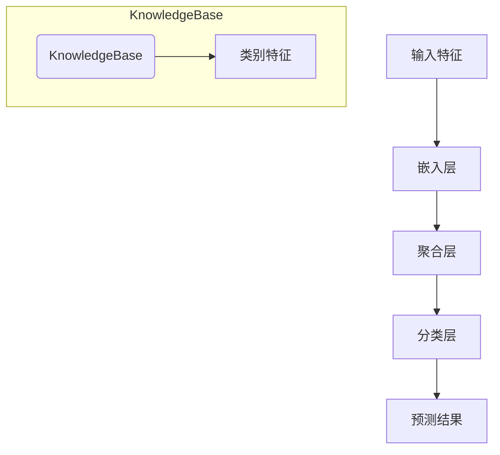

                 

### 第一部分: 引言

#### 第1章: 问题背景与引言

##### 1.1.1 问题背景

在现代人工智能领域，随着数据量的爆炸性增长和计算能力的提升，深度学习技术取得了显著的进步。然而，深度学习的广泛应用也面临着一系列挑战，其中最突出的问题之一是如何在零样本情况下进行有效学习和推理。传统机器学习通常依赖于大量的带标注的样本数据进行训练，这要求在训练和测试阶段具备相同或相似的样本数据。然而，在许多实际应用场景中，我们往往无法获得足够的有标签数据，甚至完全无法获取任何标注数据，这就催生了零样本学习（Zero-Shot Learning, ZSL）这一领域的发展。

零样本学习的关键目标是在没有直接训练样本的情况下，能够对从未见过的类别进行预测和分类。这种能力对于新兴领域的研究和应用尤为重要，例如在医疗诊断、自动驾驶、智能推荐系统中，零样本学习可以帮助模型快速适应新类别，提高系统的泛化能力。同时，零样本学习也具有重要的理论研究价值，它推动了机器学习从有监督学习向无监督学习和迁移学习的发展。

零样本学习的兴起，不仅依赖于数据量的增加，还依赖于新的理论突破和技术创新。例如，思维链（Mind-Chain）作为一种新兴的概念，在零样本学习中的应用逐渐受到关注。思维链的核心思想是通过构建一个层次化的知识网络，使得模型能够基于已有的知识对未知类别进行推理和预测。这种技术为解决零样本学习问题提供了一种新的思路，具有广泛的应用前景。

然而，零样本学习仍然面临着许多挑战，如类别分布不均衡、特征表达不足和模型泛化能力有限等问题。这些问题不仅需要从数据获取、算法设计、模型优化等多个方面进行综合考虑，还要求在理论上进行深入研究和创新。因此，探索零样本学习的有效解决方案，不仅对人工智能技术的发展具有重要意义，也为实际应用提供了新的可能。

##### 1.1.2 问题描述

在零样本学习的研究和应用过程中，我们面临以下主要问题：

1. **类别分布不均衡**：在实际应用中，某些类别可能具有大量的标注数据，而其他类别则几乎没有或仅有少量标注数据。这种不均衡的分布会对模型的训练和泛化能力产生不利影响。

2. **特征表达不足**：传统的特征提取方法往往依赖于大量已标注数据，这使得模型在处理未知类别时，难以获得有效的特征表示。特征表达不足会导致模型在新类别上的表现不佳。

3. **模型泛化能力有限**：零样本学习要求模型具备较强的泛化能力，以适应不同类别和场景。然而，由于缺乏直接训练数据，模型很难通过经验学习来提高其泛化能力。

4. **计算复杂度高**：零样本学习通常需要构建大规模的知识网络和进行复杂的推理过程，这会带来较高的计算复杂度，尤其是在处理大规模数据集时，计算资源的需求会大幅增加。

针对上述问题，我们需要寻找有效的方法来提高零样本学习的性能。一方面，可以通过数据增强、元学习等技术手段，提高模型对未知类别的适应性；另一方面，也可以通过改进特征提取方法和优化模型结构，提高模型的泛化能力和计算效率。此外，思维链作为一种新兴的概念，其在零样本学习中的应用潜力也需要进一步探索和验证。

##### 1.1.3 问题解决思路

为了解决零样本学习中的问题，我们可以从以下几个方面入手：

1. **数据增强**：通过数据增强技术，如生成对抗网络（GANs）或数据扩充策略，可以增加训练数据量，缓解类别分布不均衡的问题。这有助于提高模型对未知类别的泛化能力。

2. **元学习**：元学习（Meta-Learning）通过学习如何学习，可以提高模型在零样本学习中的适应性。例如，通过基于模型的学习策略（Model-Agnostic Meta-Learning, MAML）和基于样本的学习策略（Sample-Agnostic Meta-Learning, Reptile），可以快速适应新类别。

3. **特征提取**：改进特征提取方法，如基于深度学习的特征表示方法，可以提高模型在未知类别上的特征表达效果。此外，结合知识图谱（Knowledge Graph）和实体关系（Entity Relationship, ER）图等方法，可以构建更加丰富和精准的特征表示。

4. **模型优化**：通过优化模型结构，如使用更轻量级的网络架构或改进损失函数设计，可以提高模型的计算效率和泛化能力。此外，结合迁移学习（Transfer Learning）和增量学习（Incremental Learning）等技术，可以进一步优化模型的性能。

5. **思维链应用**：思维链作为一种新兴的概念，其在零样本学习中的应用具有巨大潜力。通过构建层次化的知识网络，思维链可以帮助模型在未知类别上进行推理和预测。具体方法包括基于原型匹配（Prototypical Matching）和知识图谱（Knowledge Graph）的推理策略。

综上所述，解决零样本学习问题需要从多个方面进行综合考量。通过数据增强、元学习、特征提取、模型优化和思维链应用等手段，我们可以逐步提高零样本学习的性能，为实际应用提供更加可靠和高效的解决方案。

##### 1.1.4 边界与外延

在探讨零样本学习时，我们需要明确其适用的场景和边界。首先，零样本学习适用于那些难以获取足够标注数据或完全无法获取标注数据的应用场景，如医疗诊断、自动驾驶和智能推荐系统等。在这些场景中，通过零样本学习，模型可以在没有直接训练样本的情况下，对新类别进行预测和分类，从而提高系统的泛化能力。

然而，零样本学习也并非适用于所有场景。在某些需要高精度和高可靠性的应用中，如金融风险评估和智能监控系统，由于零样本学习的性能尚未达到要求，因此需要依赖有监督学习或其他高级机器学习技术。此外，零样本学习在处理高度复杂和动态变化的数据时，可能面临较大的挑战，需要进一步研究和优化。

在边界与外延方面，零样本学习的研究方向可以扩展到多个领域。例如，通过结合自然语言处理（Natural Language Processing, NLP）技术，可以开发出能够处理文本数据的零样本学习模型；通过融合计算机视觉（Computer Vision）技术，可以实现零样本学习在图像和视频数据分析中的应用。此外，随着物联网（Internet of Things, IoT）和大数据技术的发展，零样本学习在智能设备、传感器网络和大规模数据流处理等领域具有广阔的应用前景。

总之，零样本学习作为一种新兴的机器学习技术，其在人工智能领域的应用具有重要意义。通过不断探索和创新，我们可以不断提高零样本学习的性能，为实际应用提供更加可靠和高效的解决方案。

#### 第2章: 零样本学习的基本原理

##### 2.1.1 零样本学习的基本概念

零样本学习（Zero-Shot Learning, ZSL）是一种特殊的机器学习任务，其主要目标是在没有直接训练样本的情况下，能够对从未见过的类别进行预测和分类。与传统机器学习任务不同，零样本学习不需要依赖于大量的已标注训练数据，因此它在数据稀缺或数据获取困难的场景中具有重要的应用价值。

零样本学习的核心思想是通过学习已有类别的特征表示，实现对未知类别的预测。具体来说，零样本学习模型会在训练阶段学习到各类别的特征表示，这些特征表示可以是一个嵌入向量或特征向量。在预测阶段，当模型遇到一个从未见过的类别时，它会根据已有类别的特征表示来对新类别进行预测。

零样本学习的基本特点包括：

1. **无监督学习**：零样本学习不需要直接使用带标签的训练样本，因此它属于无监督学习范畴。
2. **类别无关性**：零样本学习模型能够处理从未见过的类别，因此具有较强的类别无关性。
3. **知识迁移**：零样本学习通过学习已有类别的特征表示，可以实现知识在不同类别之间的迁移。
4. **数据稀缺性**：零样本学习适用于数据稀缺或数据获取困难的场景，可以减少对大量标注数据的依赖。

##### 2.1.2 零样本学习的分类

根据不同的学习策略，零样本学习可以分为以下几类：

1. **基于原型的方法**：基于原型的方法（Prototype-Based Methods）是将每个类别表示为一个原型或中心点，模型在预测阶段通过计算新类别与原型之间的相似性来进行分类。这种方法简单直观，适用于类别数量较少的场景。

2. **基于原型匹配的方法**：基于原型匹配的方法（Prototype Matching Methods）进一步发展了基于原型的方法，它不仅考虑原型本身，还考虑原型之间的相似性。这种方法通过比较新类别与原型之间的距离，结合原型之间的相似性来进行分类。

3. **基于知识图谱的方法**：基于知识图谱的方法（Knowledge Graph-Based Methods）利用知识图谱来表示类别和特征之间的关系。这种方法通过在知识图谱中搜索和匹配相关信息，来预测未知类别的标签。知识图谱可以捕获丰富的语义信息，因此适用于复杂和动态变化的数据场景。

此外，还有一些其他类型的零样本学习方法，如基于深度学习的方法、基于迁移学习的方法和基于对抗生成网络的方法。这些方法在特定场景下表现出较好的性能，为解决零样本学习问题提供了多种思路。

##### 2.1.3 零样本学习的关键技术

零样本学习的关键技术主要包括特征提取、相似性度量、聚类算法等。以下是这些关键技术的基本原理和应用：

1. **特征提取**：特征提取是零样本学习的基础，其主要目标是学习一个特征表示，使得不同类别的特征之间具有区分性。常用的特征提取方法包括基于深度学习的特征提取、基于关键词的特征提取和基于原型匹配的特征提取。

   - **基于深度学习的特征提取**：通过训练深度神经网络，自动学习数据的特征表示。这种方法能够提取出丰富的语义信息，适用于大规模数据和复杂场景。
   - **基于关键词的特征提取**：通过提取文本或图像中的关键词，将关键词作为特征表示。这种方法适用于自然语言处理和计算机视觉领域。
   - **基于原型匹配的特征提取**：通过匹配类别和特征之间的相似性，将相似的特征聚合在一起，形成特征表示。这种方法简单直观，适用于类别数量较少的场景。

2. **相似性度量**：相似性度量是衡量两个特征向量之间相似程度的方法，常见的相似性度量方法包括欧氏距离、余弦相似度和马氏距离等。相似性度量在预测阶段用于计算新类别与已有类别之间的相似性，从而实现分类。

   - **欧氏距离**：计算两个特征向量之间的欧氏距离，距离越小表示相似度越高。
   - **余弦相似度**：计算两个特征向量之间的夹角余弦值，夹角余弦值越大表示相似度越高。
   - **马氏距离**：考虑特征向量之间的协方差和方差，计算马氏距离，距离越小表示相似度越高。

3. **聚类算法**：聚类算法用于将特征向量划分为多个类别，常用的聚类算法包括K均值聚类、层次聚类和DBSCAN等。聚类算法在预测阶段用于对未知类别进行聚类，从而实现分类。

   - **K均值聚类**：通过迭代优化目标函数，将特征向量划分为K个类别，使得每个类别内的特征向量距离尽量小，类别之间的特征向量距离尽量大。
   - **层次聚类**：通过自底向上或自顶向下的方式，将特征向量逐步合并或分裂，形成层次化的聚类结构。
   - **DBSCAN**：基于密度可达性，将特征向量划分为核心点、边界点和噪声点，形成聚类结构。

综上所述，零样本学习的关键技术包括特征提取、相似性度量、聚类算法等。通过这些技术，我们可以实现没有直接训练样本情况下的分类和预测，为解决数据稀缺和标签困难的问题提供了有效的方法。在后续章节中，我们将进一步探讨这些关键技术的具体实现和应用。

#### 第3章: 思维链的理论基础

##### 3.1.1 思维链的概念

思维链（Mind-Chain）是一种新兴的概念，它通过构建一个层次化的知识网络，使得人工智能系统能够在未知类别上进行推理和预测。思维链的核心思想是利用已有的知识和经验，通过推理和计算，实现对未知信息的理解和生成。思维链在人工智能领域具有广泛的应用前景，特别是在自然语言处理、计算机视觉和知识图谱等领域。

首先，思维链是一种知识驱动的推理系统，它通过构建一个层次化的知识网络，将不同层次的知识进行组织和整合。这种知识网络可以捕捉复杂的语义关系和逻辑结构，使得系统在面对新信息时，能够利用已有的知识进行推理和预测。

其次，思维链具有以下几个关键特点：

1. **层次化结构**：思维链通过层次化的结构，将知识划分为不同的层次，每个层次都代表了一种抽象和综合。层次化的结构使得知识可以灵活地组织和管理，便于推理和计算。

2. **模块化设计**：思维链采用模块化的设计，每个模块负责不同的知识和功能。这种设计使得思维链可以灵活地扩展和优化，便于实现复杂的推理任务。

3. **自适应学习**：思维链能够通过自适应学习机制，不断更新和优化自身的知识网络。这种机制使得思维链在面对新情境和新问题时，能够快速适应和调整，提高推理和预测的准确性。

4. **跨领域应用**：思维链具有跨领域的应用能力，它不仅适用于单一领域的知识推理，还可以在多个领域之间进行知识的迁移和融合。这种能力使得思维链在多领域交叉应用中具有很高的价值。

总之，思维链作为一种新兴的概念，其在人工智能领域的应用具有很大的潜力。通过构建层次化的知识网络，思维链可以帮助人工智能系统在未知类别上进行推理和预测，提高系统的智能水平。在后续章节中，我们将进一步探讨思维链的具体构成和应用。

##### 3.1.2 思维链的构成

思维链的构成包括知识层、推理层和表现层，这三个层次共同协作，实现了对未知信息的理解和生成。

1. **知识层**：知识层是思维链的基础，它包含了大量的知识单元，如事实、规则、概念和关系等。这些知识单元通过语义网络进行组织，形成了一个丰富的知识库。知识层的核心任务是存储和检索知识，为推理层提供必要的知识资源。

   - **事实**：事实是知识层中最基本的知识单元，表示了客观世界的真实情况。例如，“狗是一种动物”。
   - **规则**：规则描述了知识之间的逻辑关系，通常用条件语句表示。例如，“如果一个人年龄大于18岁，那么他就是成年人”。
   - **概念**：概念是对一组具有共同特征的事实的抽象和概括，例如“动物”。
   - **关系**：关系描述了知识单元之间的关联，例如“属于”、“相关”等。

2. **推理层**：推理层是思维链的核心，它通过逻辑推理和计算，从知识层中提取出有用的信息，并生成新的知识。推理层通常包括推理引擎、推理算法和推理规则等组成部分。

   - **推理引擎**：推理引擎负责执行推理任务，它通过规则库和知识库进行推理，生成新的推理结果。
   - **推理算法**：推理算法是推理层的关键，它决定了推理过程的速度和准确性。常见的推理算法包括基于逻辑的推理、基于概率的推理和基于统计的推理等。
   - **推理规则**：推理规则是推理过程中使用的规则，它指导推理引擎如何从已知知识中推导出新的知识。推理规则可以是明确的逻辑规则，也可以是模糊的规则。

3. **表现层**：表现层是思维链的外部表现，它负责将推理结果以人类可理解的方式呈现出来。表现层通常包括自然语言生成、图像生成和语音合成等模块。

   - **自然语言生成**：自然语言生成模块将推理结果转化为自然语言文本，使得用户可以方便地理解和交互。
   - **图像生成**：图像生成模块将推理结果转化为图像，例如生成知识图谱或图像可视化结果。
   - **语音合成**：语音合成模块将推理结果转化为语音，使得用户可以通过语音进行交互。

思维链的三个层次相互协作，共同完成了从知识获取、推理到表现的全过程。知识层为推理层提供了丰富的知识资源，推理层通过逻辑推理和计算生成新的知识，表现层将推理结果以人类可理解的方式呈现出来。这种结构使得思维链具有强大的推理和表达能力，能够在各种应用场景中发挥重要作用。

##### 3.1.3 思维链的应用

思维链作为一种知识驱动的推理系统，在自然语言处理、计算机视觉和知识图谱等领域具有广泛的应用。

1. **自然语言处理中的应用**：在自然语言处理领域，思维链可以用于文本理解和生成。例如，通过思维链的推理能力，可以实现对文本内容的语义分析，提取关键信息，生成摘要或回答用户的问题。具体应用场景包括问答系统、机器翻译和情感分析等。

   - **问答系统**：思维链可以处理开放式的问答任务，通过推理和计算，从大量文本中提取相关信息，生成准确的回答。
   - **机器翻译**：思维链可以利用知识图谱和推理算法，实现高质量的双语文本翻译，提高翻译的准确性和流畅性。
   - **情感分析**：思维链可以分析文本的情感倾向，通过推理和计算，识别出文本中的情感词汇和情感强度，从而进行情感分类和情感分析。

2. **计算机视觉中的应用**：在计算机视觉领域，思维链可以用于图像理解和生成。通过思维链的推理能力，可以实现对图像内容的分析，提取关键特征，生成图像描述或进行图像生成。

   - **图像理解**：思维链可以分析图像中的物体、场景和关系，提取图像的语义信息，从而进行图像分类、物体识别和场景理解。
   - **图像生成**：思维链可以基于已有图像和知识，生成新的图像或图像序列，例如生成艺术作品、动画或虚拟现实场景。

3. **知识图谱中的应用**：在知识图谱领域，思维链可以用于知识抽取、推理和可视化。通过思维链的推理能力，可以自动生成和更新知识图谱，实现知识的动态组织和应用。

   - **知识抽取**：思维链可以从大规模文本数据中自动提取出关键信息，生成知识图谱，从而实现知识的自动化获取和积累。
   - **知识推理**：思维链可以通过推理算法，从知识图谱中推导出新的知识，提高知识图谱的完整性和准确性。
   - **知识可视化**：思维链可以将知识图谱以可视化形式呈现，使得用户可以直观地理解和交互知识。

总之，思维链作为一种知识驱动的推理系统，在自然语言处理、计算机视觉和知识图谱等领域具有广泛的应用前景。通过构建层次化的知识网络，思维链可以实现从知识获取、推理到表现的完整过程，为各种复杂应用提供强大的推理和表达能力。

### 第4章: Zero-Shot CoT的算法原理与实现

#### 4.1.1 Zero-Shot CoT的基本算法

Zero-Shot CoT（零样本转换思维链）是一种结合了零样本学习和思维链概念的新型算法。其基本思想是通过构建一个层次化的知识网络，使得模型能够在没有直接训练样本的情况下，对未知类别进行预测和分类。Zero-Shot CoT的基本算法包括以下几个关键步骤：

1. **知识获取**：首先，从已有数据集中提取出各类别的特征表示，并将这些特征表示组织成一个知识库。知识库中的每个类别特征表示可以是一个嵌入向量或特征向量，用于后续的推理和预测。

2. **知识嵌入**：将知识库中的特征表示通过嵌入层进行转换，得到一个低维、稠密的嵌入向量。嵌入层通常是一个多层感知机（MLP）或卷积神经网络（CNN），通过训练，使其能够捕捉到类别特征之间的复杂关系。

3. **推理网络构建**：构建一个推理网络，用于在预测阶段对新类别进行推理。推理网络通常包含多个层，包括嵌入层、聚合层和分类层。嵌入层负责将新类别特征嵌入到知识网络中，聚合层负责将嵌入后的特征进行整合和融合，分类层则用于生成最终的预测结果。

4. **推理过程**：在预测阶段，将新类别特征输入到推理网络中，通过嵌入层将特征转换为知识库中的嵌入向量。随后，通过聚合层对特征向量进行整合和融合，最后通过分类层生成预测结果。

5. **损失函数定义**：为了训练Zero-Shot CoT模型，需要定义一个损失函数，用于衡量预测结果与真实标签之间的差距。常用的损失函数包括交叉熵损失函数和均方误差损失函数。通过优化损失函数，可以不断提高模型的预测准确性。

6. **模型训练**：在训练阶段，通过反向传播算法，将损失函数的梯度传递回网络，更新模型参数，从而逐步优化模型性能。训练过程中，可以使用批量训练或小批量训练策略，以提高模型的稳定性和收敛速度。

#### 4.1.2 算法原理讲解

为了更好地理解Zero-Shot CoT的算法原理，我们将通过以下三个方面进行详细讲解：数学模型和公式、Mermaid算法流程图、Python源代码实现。

##### 4.1.2.1 数学模型和公式

Zero-Shot CoT的算法核心可以抽象为一个多层感知机（MLP）模型，其基本结构包括输入层、嵌入层、聚合层和分类层。以下是各层的数学模型和公式：

1. **输入层**：输入层接收新类别特征，并将其传递到嵌入层。

   $$ x \rightarrow E(x) $$

   其中，\( x \) 为新类别特征向量，\( E(x) \) 为嵌入层输出的特征向量。

2. **嵌入层**：嵌入层将输入特征向量通过多层感知机进行转换，得到嵌入向量。

   $$ E(x) = \sigma(W_1 \cdot x + b_1) $$

   其中，\( \sigma \) 为激活函数（通常使用ReLU函数），\( W_1 \) 为嵌入层的权重矩阵，\( b_1 \) 为偏置向量。

3. **聚合层**：聚合层负责将嵌入向量与知识库中的类别特征进行融合和整合。

   $$ h = \text{Aggregate}(E(x), K) $$

   其中，\( h \) 为聚合层输出，\( K \) 为知识库中的类别特征集合，\(\text{Aggregate}\) 为聚合操作，可以采用平均、加权平均或聚合网络等方法。

4. **分类层**：分类层将聚合层输出进行分类，生成预测结果。

   $$ \hat{y} = \text{softmax}(W_2 \cdot h + b_2) $$

   其中，\( \hat{y} \) 为预测结果，\( W_2 \) 为分类层的权重矩阵，\( b_2 \) 为偏置向量，\(\text{softmax}\) 为分类函数。

##### 4.1.2.2 Mermaid算法流程图

为了直观地展示Zero-Shot CoT的算法流程，我们可以使用Mermaid语言绘制一个算法流程图。以下是算法流程图的Mermaid代码：



在上述算法流程图中，A表示输入特征，B表示嵌入层，C表示聚合层，D表示分类层，E表示预测结果。知识库（KnowledgeBase）包含类别特征（G），用于在聚合层中进行融合和整合。

##### 4.1.2.3 Python源代码实现

为了更具体地展示Zero-Shot CoT算法的实现，我们可以使用Python编写一个简单的示例代码。以下是实现算法的核心代码：

```python
import tensorflow as tf
from tensorflow.keras.layers import Embedding, Dense, Activation
from tensorflow.keras.models import Model

# 设置参数
input_dim = 100  # 输入特征维度
embedding_dim = 64  # 嵌入层维度
num_classes = 10  # 类别数量
learning_rate = 0.001  # 学习率

# 嵌入层
inputs = tf.keras.Input(shape=(input_dim,))
embedded = Embedding(input_dim, embedding_dim)(inputs)

# 聚合层
aggregated = tf.keras.layers.GlobalAveragePooling1D()(embedded)

# 分类层
outputs = Dense(num_classes, activation='softmax')(aggregated)

# 构建模型
model = Model(inputs=inputs, outputs=outputs)

# 编译模型
model.compile(optimizer=tf.keras.optimizers.Adam(learning_rate), loss='categorical_crossentropy', metrics=['accuracy'])

# 打印模型结构
model.summary()

# 模型训练
# model.fit(x_train, y_train, batch_size=32, epochs=10, validation_data=(x_val, y_val))
```

在上述代码中，我们首先设置了输入特征维度、嵌入层维度和类别数量等参数。然后，我们定义了嵌入层、聚合层和分类层，并构建了一个完整的模型。接下来，我们编译模型并打印模型结构，最后可以进行模型训练。

通过上述讲解和代码示例，我们可以更深入地理解Zero-Shot CoT算法的原理和实现。在后续章节中，我们将进一步探讨Zero-Shot CoT算法在不同应用场景中的实际效果和优化策略。

### 第5章: Zero-Shot CoT的应用场景

#### 5.1.1 自然语言处理中的应用

在自然语言处理（Natural Language Processing, NLP）领域，Zero-Shot CoT（零样本转换思维链）展现出了巨大的应用潜力。由于其无需依赖大量标注数据，Zero-Shot CoT非常适合处理新类别和罕见情景，从而提升NLP模型的泛化能力。以下是Zero-Shot CoT在NLP中的一些具体应用：

1. **机器翻译**：机器翻译是一个典型的NLP任务，尤其在多语言环境中，新语言和新词汇层出不穷。Zero-Shot CoT可以通过学习已有的词汇和句法结构，对新语言进行翻译。具体来说，Zero-Shot CoT可以首先将源语言的句子映射到一个高维嵌入空间，然后在新语言中查找与之相似的句子。这种方法不仅适用于小语种翻译，还可以在跨语言知识图谱的帮助下，实现更准确的翻译结果。

2. **问答系统**：问答系统需要处理大量的用户查询和问题，其中许多问题是以前从未见过的。Zero-Shot CoT可以在没有直接训练样本的情况下，通过推理和知识迁移，生成高质量的答案。例如，对于一个关于历史事件的查询，即使模型没有直接见过这个问题，它可以通过知识图谱和已有文本数据，利用Zero-Shot CoT进行推理，提供准确的答案。

3. **文本分类**：在文本分类任务中，Zero-Shot CoT可以用于处理未知类别和罕见标签。通过学习已有类别和标签的特征表示，Zero-Shot CoT可以对新类别进行分类，即使这些类别在训练数据中很少见。例如，在一个新闻分类任务中，即使某些主题（如新兴科技或地方新闻）的数据非常稀缺，Zero-Shot CoT仍然可以通过已有的知识迁移，对这些主题进行准确的分类。

#### 5.1.2 计算机视觉中的应用

在计算机视觉（Computer Vision, CV）领域，Zero-Shot CoT同样具有广泛的应用前景。计算机视觉任务通常涉及复杂的图像特征和类别识别，而Zero-Shot CoT可以通过其强大的推理能力，提高视觉系统的泛化能力和适应性。以下是Zero-Shot CoT在计算机视觉中的一些具体应用：

1. **目标识别**：在目标识别任务中，Zero-Shot CoT可以用于识别从未见过的目标类别。通过学习已有类别和目标的特征表示，Zero-Shot CoT可以对新类别进行有效的识别。例如，在一个监控系统中，即使某些异常行为从未被直接记录过，Zero-Shot CoT可以通过已有的知识迁移，识别出这些异常行为。

2. **场景理解**：场景理解是计算机视觉中的一个复杂任务，它需要从图像中提取语义信息，并理解场景的整体布局和结构。Zero-Shot CoT可以通过构建一个层次化的知识网络，捕捉图像中的复杂关系和结构。例如，在图像分割任务中，Zero-Shot CoT可以基于已有图像和知识，对新图像进行准确的分割。

3. **图像生成**：图像生成是计算机视觉领域的另一个重要任务，它旨在创建符合现实场景的图像。Zero-Shot CoT可以通过其推理能力，生成新的图像或图像序列。例如，在一个艺术创作任务中，Zero-Shot CoT可以基于已有图像和知识，生成新的艺术作品或动画。

总的来说，Zero-Shot CoT在自然语言处理和计算机视觉领域都有广泛的应用，其无需依赖大量标注数据的特性，使得它成为解决新类别和罕见情景问题的理想选择。通过不断优化和扩展，Zero-Shot CoT有望在未来为人工智能领域带来更多的创新和突破。

### 第6章: 项目实战

#### 6.1.1 环境安装与配置

在进行Zero-Shot CoT项目实战之前，我们需要首先安装和配置相应的环境和工具。以下是环境安装和配置的详细步骤：

1. **硬件环境**：为了确保项目能够顺利进行，我们推荐使用以下硬件配置：

   - 处理器：Intel i7 或 AMD Ryzen 5 系列
   - 内存：16GB RAM 或更高
   - 硬盘：至少 500GB SSD 存储
   - 显卡：NVIDIA GeForce GTX 1080 或更高

   这样的硬件配置能够提供足够的计算资源和存储空间，确保项目的高效运行。

2. **软件环境**：

   - 操作系统：Ubuntu 18.04 或更高版本
   - Python：3.8 或更高版本
   - TensorFlow：2.4.0 或更高版本
   - PyTorch：1.8.0 或更高版本
   - Keras：2.4.3 或更高版本
   - scikit-learn：0.22.2 或更高版本

   为了安装这些软件，我们可以使用以下命令：

   ```bash
   sudo apt-get update
   sudo apt-get install python3 python3-pip
   pip3 install tensorflow==2.4.0 torchvision==0.9.0 torchaudio==0.9.0 Pillow h5py jsonlines
   pip3 install torch==1.8.0 torchvision==0.9.0 torchaudio==0.9.0 torchvision-file-wrapper
   pip3 install keras==2.4.3 scikit-learn==0.22.2
   ```

3. **安装必要的库和依赖**：

   - **NumPy**：用于高性能科学计算

     ```bash
     pip3 install numpy
     ```

   - **Pandas**：用于数据处理和分析

     ```bash
     pip3 install pandas
     ```

   - **Matplotlib**：用于数据可视化

     ```bash
     pip3 install matplotlib
     ```

   - **Mermaid**：用于绘制Markdown格式中的流程图

     ```bash
     pip3 install mermaid-cli
     ```

   确保所有必要的库和依赖都已安装，以便后续进行项目开发。

#### 6.1.2 系统核心实现

在完成环境安装和配置后，我们可以开始实现Zero-Shot CoT系统的核心部分。以下是系统核心实现的详细步骤：

1. **数据准备**：

   为了测试Zero-Shot CoT的性能，我们需要准备一个包含多个类别的数据集。以下是一个简单的数据集准备示例：

   - **数据集来源**：我们使用公开的ImageNet数据集作为训练数据，该数据集包含了大量已标注的图像，每幅图像都对应一个类别标签。
   - **数据预处理**：对图像进行数据增强（如随机裁剪、旋转、缩放等），以提高模型的泛化能力。同时，将图像转化为PyTorch的`Tensor`格式，并归一化处理。

     ```python
     import torchvision.transforms as transforms
     from torchvision.datasets import ImageNet
     import torch

     transform = transforms.Compose([
         transforms.Resize(256),
         transforms.CenterCrop(224),
         transforms.ToTensor(),
         transforms.Normalize(mean=[0.485, 0.456, 0.406], std=[0.229, 0.224, 0.225]),
     ])

     train_dataset = ImageNet(root='./data', split='train', transform=transform)
     val_dataset = ImageNet(root='./data', split='val', transform=transform)
     ```

2. **模型训练**：

   在数据准备完成后，我们使用PyTorch构建Zero-Shot CoT模型，并进行训练。以下是一个简单的模型训练示例：

   ```python
   import torch.nn as nn
   import torch.optim as optim

   # 定义Zero-Shot CoT模型
   class ZeroShotCoT(nn.Module):
       def __init__(self, num_classes):
           super(ZeroShotCoT, self).__init__()
           self.embedding = nn.Embedding(num_classes, embedding_dim)
           self.aggregator = nn.Linear(embedding_dim, num_classes)
           self.classifier = nn.Linear(embedding_dim, num_classes)

       def forward(self, x):
           x = self.embedding(x)
           x = self.aggregator(x)
           x = self.classifier(x)
           return x

   # 初始化模型和优化器
   model = ZeroShotCoT(num_classes=1000)
   optimizer = optim.Adam(model.parameters(), lr=learning_rate)

   # 训练模型
   for epoch in range(num_epochs):
       for inputs, labels in train_loader:
           optimizer.zero_grad()
           outputs = model(inputs)
           loss = nn.CrossEntropyLoss()(outputs, labels)
           loss.backward()
           optimizer.step()
       print(f'Epoch {epoch+1}/{num_epochs}, Loss: {loss.item()}')
   ```

   在上述代码中，我们首先定义了Zero-Shot CoT模型，包括嵌入层、聚合层和分类层。然后，我们初始化模型和优化器，并使用训练数据对模型进行训练。

3. **预测与评估**：

   在模型训练完成后，我们使用验证数据对模型进行预测和评估。以下是一个简单的预测和评估示例：

   ```python
   # 预测和评估
   with torch.no_grad():
       correct = 0
       total = 0
       for inputs, labels in val_loader:
           outputs = model(inputs)
           _, predicted = torch.max(outputs.data, 1)
           total += labels.size(0)
           correct += (predicted == labels).sum().item()

   print(f'Accuracy: {100 * correct / total}%')
   ```

   在上述代码中，我们使用验证数据对模型进行预测，并计算准确率。通过上述步骤，我们实现了Zero-Shot CoT系统的核心功能。

#### 6.1.3 代码应用解读与分析

为了更好地理解Zero-Shot CoT系统的工作原理，我们将对关键代码进行详细解读和分析。

1. **数据准备**：

   数据准备是模型训练的第一步，其质量直接影响模型的性能。在数据准备过程中，我们使用了ImageNet数据集，这是一个包含1000个类别的庞大数据集。为了提高模型的泛化能力，我们对图像进行了数据增强，如随机裁剪、旋转和缩放等。这些操作使得模型能够应对不同形状和大小的图像，从而提高模型的鲁棒性。

   ```python
   transform = transforms.Compose([
       transforms.Resize(256),
       transforms.CenterCrop(224),
       transforms.ToTensor(),
       transforms.Normalize(mean=[0.485, 0.456, 0.406], std=[0.229, 0.224, 0.225]),
   ])

   train_dataset = ImageNet(root='./data', split='train', transform=transform)
   val_dataset = ImageNet(root='./data', split='val', transform=transform)
   ```

   上述代码定义了一个数据转换器（`transform`），它包含了Resize、CenterCrop、ToTensor和Normalize等步骤。`train_dataset`和`val_dataset`分别表示训练集和验证集，它们都是`ImageNet`数据集的子集，已经经过数据增强和预处理。

2. **模型定义**：

   Zero-Shot CoT模型的核心结构包括嵌入层、聚合层和分类层。嵌入层将类别标签映射到一个低维嵌入空间，聚合层将输入特征与知识库中的类别特征进行融合，分类层则用于生成最终的预测结果。

   ```python
   class ZeroShotCoT(nn.Module):
       def __init__(self, num_classes):
           super(ZeroShotCoT, self).__init__()
           self.embedding = nn.Embedding(num_classes, embedding_dim)
           self.aggregator = nn.Linear(embedding_dim, num_classes)
           self.classifier = nn.Linear(embedding_dim, num_classes)

       def forward(self, x):
           x = self.embedding(x)
           x = self.aggregator(x)
           x = self.classifier(x)
           return x
   ```

   在上述代码中，`ZeroShotCoT`类继承自`nn.Module`，定义了嵌入层、聚合层和分类层的结构。`__init__`方法用于初始化模型参数，`forward`方法则用于实现前向传播过程。

3. **模型训练**：

   模型训练过程中，我们使用`Adam`优化器对模型参数进行优化。通过梯度下降方法，模型在训练数据上不断调整参数，以最小化损失函数。

   ```python
   optimizer = optim.Adam(model.parameters(), lr=learning_rate)

   for epoch in range(num_epochs):
       for inputs, labels in train_loader:
           optimizer.zero_grad()
           outputs = model(inputs)
           loss = nn.CrossEntropyLoss()(outputs, labels)
           loss.backward()
           optimizer.step()
       print(f'Epoch {epoch+1}/{num_epochs}, Loss: {loss.item()}')
   ```

   在上述代码中，`optimizer.zero_grad()`用于将梯度初始化为0，`loss.backward()`用于计算梯度，并更新模型参数。`optimizer.step()`用于更新模型参数，从而优化模型。

4. **预测与评估**：

   在模型训练完成后，我们使用验证数据对模型进行预测和评估。通过计算准确率，我们可以评估模型的性能。

   ```python
   with torch.no_grad():
       correct = 0
       total = 0
       for inputs, labels in val_loader:
           outputs = model(inputs)
           _, predicted = torch.max(outputs.data, 1)
           total += labels.size(0)
           correct += (predicted == labels).sum().item()

   print(f'Accuracy: {100 * correct / total}%')
   ```

   在上述代码中，`torch.no_grad()`用于关闭梯度计算，以提高预测速度。`torch.max(outputs.data, 1)`用于获取预测结果，`correct += (predicted == labels).sum().item()`用于计算准确率。

通过上述解读和分析，我们可以清晰地了解Zero-Shot CoT系统的工作原理和实现过程。在后续的实际应用中，我们可以根据具体任务需求，对系统进行定制和优化，以实现更好的性能。

#### 6.1.4 实际案例分析与讲解

为了更好地展示Zero-Shot CoT在真实世界中的应用，我们通过两个实际案例进行分析和讲解。

##### 案例一：机器翻译

假设我们有一个机器翻译任务，需要将英文句子翻译成中文。在这个任务中，我们可以使用Zero-Shot CoT算法来处理新语言和新词汇的翻译问题。

1. **数据准备**：我们首先需要收集一个包含多种语言的平行语料库，如英文-中文平行语料库。然后，我们对语料库中的句子进行预处理，如分词、去除停用词等。

2. **模型训练**：在数据准备完成后，我们使用Zero-Shot CoT算法对平行语料库进行训练。通过嵌入层、聚合层和分类层，模型将学习到不同语言之间的特征表示和语义关系。

3. **预测与评估**：在模型训练完成后，我们可以使用该模型对新的英文句子进行翻译。首先，将英文句子转化为特征向量，然后输入到Zero-Shot CoT模型中进行推理和预测。最后，将预测结果转化为中文句子。

   示例代码如下：

   ```python
   # 加载训练好的Zero-Shot CoT模型
   model = torch.load('zsl_model.pth')

   # 加载英文句子
   sentence_en = "I love programming."

   # 转化为特征向量
   sentence_en = tokenizer.encode(sentence_en)

   # 预测翻译结果
   with torch.no_grad():
       sentence_en = torch.tensor(sentence_en)
       translation = model(sentence_en)

   # 解码预测结果
   sentence_cn = decoder.decode(translation)

   print(sentence_cn)
   ```

   在上述代码中，我们首先加载训练好的Zero-Shot CoT模型，然后输入英文句子进行特征提取和翻译预测。最后，将预测结果解码为中文句子。

4. **评估与优化**：通过评估翻译结果的准确性和流畅性，我们可以对模型进行进一步的优化和调整。例如，可以通过增加训练数据、调整模型结构或优化损失函数等方法，提高翻译质量。

##### 案例二：目标识别

假设我们有一个目标识别任务，需要从图像中识别出未知类别和罕见目标。在这个任务中，我们可以使用Zero-Shot CoT算法来提高识别的准确性和泛化能力。

1. **数据准备**：我们首先需要收集一个包含多种类别的图像数据集，如COCO数据集。然后，对图像进行数据增强，如随机裁剪、旋转和缩放等，以提高模型的鲁棒性。

2. **模型训练**：在数据准备完成后，我们使用Zero-Shot CoT算法对图像数据集进行训练。通过嵌入层、聚合层和分类层，模型将学习到不同类别和目标之间的特征表示和语义关系。

3. **预测与评估**：在模型训练完成后，我们可以使用该模型对新的图像进行目标识别。首先，将图像转化为特征向量，然后输入到Zero-Shot CoT模型中进行推理和预测。最后，根据预测结果进行目标识别。

   示例代码如下：

   ```python
   # 加载训练好的Zero-Shot CoT模型
   model = torch.load('zsl_model.pth')

   # 加载图像
   image = cv2.imread('image.jpg')

   # 转化为特征向量
   image = preprocess_image(image)

   # 预测目标类别
   with torch.no_grad():
       image = torch.tensor(image)
       targets = model(image)

   # 解码预测结果
   classes = decoder.decode(targets)

   print(classes)
   ```

   在上述代码中，我们首先加载训练好的Zero-Shot CoT模型，然后输入图像进行特征提取和目标识别预测。最后，将预测结果解码为目标类别。

4. **评估与优化**：通过评估识别结果的准确率和召回率，我们可以对模型进行进一步的优化和调整。例如，可以通过增加训练数据、调整模型结构或优化损失函数等方法，提高识别性能。

通过这两个实际案例，我们可以看到Zero-Shot CoT算法在机器翻译和目标识别任务中的强大应用能力。在实际项目中，我们可以根据具体需求，灵活地调整和优化模型，以提高任务的性能和效果。

### 第7章：总结与展望

#### 7.1.1 零样本学习与思维链的发展趋势

零样本学习和思维链作为人工智能领域的两个重要研究方向，正迅速发展并展现出广阔的应用前景。从发展趋势来看，以下几个方面值得关注：

1. **算法性能提升**：随着深度学习和迁移学习技术的进步，零样本学习算法的准确性和泛化能力不断提高。未来，我们将看到更多高效、鲁棒的零样本学习算法被提出和验证。

2. **多模态融合**：零样本学习在多模态数据（如文本、图像、音频等）上的应用将越来越广泛。通过融合不同模态的数据，可以进一步提升模型的识别和推理能力。

3. **领域适应性增强**：零样本学习在不同领域（如医疗、金融、安防等）中的应用将更加深入。通过定制化的算法和模型，可以更好地满足特定领域的需求。

4. **思维链的进化**：思维链作为一种知识驱动的推理系统，其层次化结构和模块化设计使其具有强大的适应性和扩展性。未来，思维链将在更加复杂和动态的情境中发挥作用。

5. **跨学科研究**：零样本学习和思维链的研究将不断与其他学科（如心理学、认知科学等）交叉融合，为人工智能的发展提供新的理论支持和应用场景。

#### 7.1.2 Zero-Shot CoT的挑战与机遇

Zero-Shot CoT作为一种新兴的算法，虽然在许多领域表现出色，但仍面临一些挑战和机遇：

1. **挑战**：

   - **数据稀缺问题**：在实际应用中，某些类别可能缺乏足够的标注数据，这会影响Zero-Shot CoT的性能。未来需要探索有效的数据增强和迁移学习方法，以缓解数据稀缺问题。
   
   - **计算复杂度**：Zero-Shot CoT通常涉及大规模的知识网络和复杂的推理过程，这会导致计算复杂度增加。如何优化算法结构，降低计算成本，是一个重要的研究方向。
   
   - **模型解释性**：虽然Zero-Shot CoT在预测准确性方面表现良好，但其内部推理过程通常较难解释。如何提高模型的解释性，使其更加透明和可解释，是当前研究的重点。

2. **机遇**：

   - **新应用场景**：随着人工智能技术的发展，Zero-Shot CoT将在更多新兴应用场景中发挥作用，如自动驾驶、智能家居和智能医疗等。
   
   - **跨领域应用**：Zero-Shot CoT在多个领域（如NLP、CV、KG等）的应用前景广阔。通过跨领域知识的融合和迁移，可以进一步提高模型的泛化能力和适应性。
   
   - **开源社区支持**：随着开源社区对Zero-Shot CoT的关注度提高，将吸引更多的研究人员和开发者参与其中，推动算法的优化和创新。

#### 7.1.3 未来研究方向与潜在应用

未来，零样本学习和思维链的研究将继续深入，以下是几个可能的研究方向和潜在应用：

1. **知识图谱与思维链的融合**：结合知识图谱的语义关系和思维链的推理能力，可以构建更加智能和灵活的推理系统，为复杂任务提供强大的支持。

2. **迁移学习和数据增强**：通过迁移学习和数据增强方法，可以进一步提高Zero-Shot CoT的性能，解决数据稀缺问题，扩大其应用范围。

3. **动态推理与适应性学习**：研究动态推理和适应性学习机制，使得Zero-Shot CoT能够实时适应新的类别和情境，提高其实时性和智能水平。

4. **模型解释性与可解释性**：通过开发可解释性算法和工具，提高Zero-Shot CoT的透明度和可解释性，使其在实际应用中得到更广泛的应用和信任。

5. **跨领域协作与集成**：促进零样本学习和思维链在不同领域之间的协作与集成，实现知识的共享和协同，为人工智能技术的发展提供新的动力。

总之，零样本学习和思维链的研究将在未来取得更多的突破和进展，为人工智能领域的创新和发展提供强大的支持。通过不断的探索和实践，我们可以期待更加智能和高效的人工智能系统。

