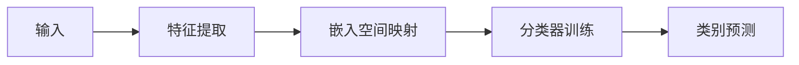
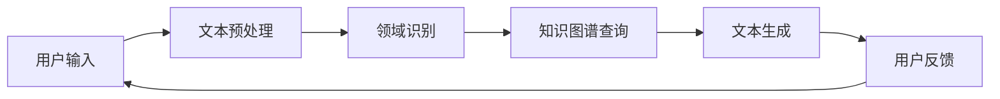
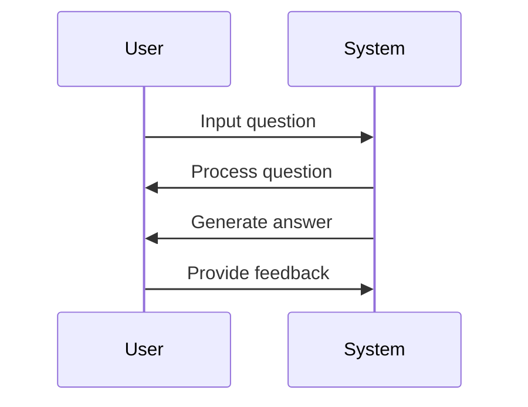
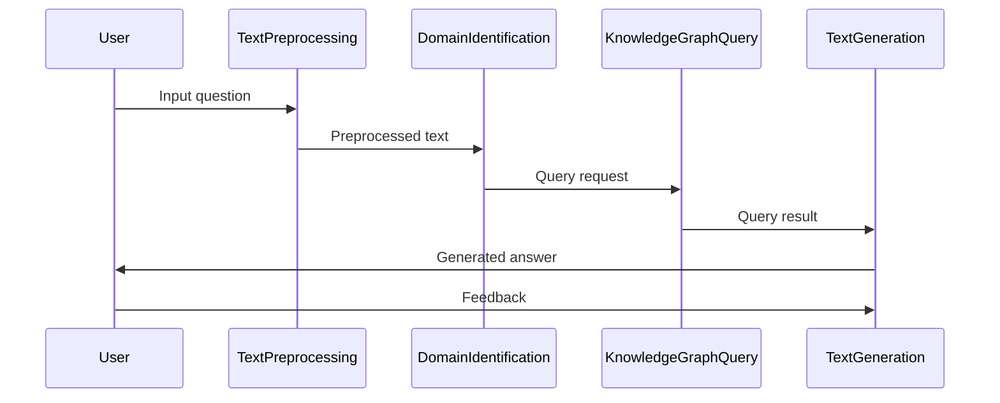

                 


## 《Zero-Shot CoT：突破AI学习瓶颈的前沿方法探索》正文

### 引言

在人工智能（AI）领域，随着深度学习技术的迅猛发展，AI的应用场景和效能得到了极大的扩展和提升。然而，深度学习模型的性能在很大程度上依赖于大量的标注数据进行训练。这无疑限制了AI的普及和应用，尤其是在零样本学习（Zero-Shot Learning, ZSL）和跨领域文本生成（Cross-Domain Text Generation, CoT）等场景下。本文旨在探讨《Zero-Shot CoT：突破AI学习瓶颈的前沿方法探索》一书中提出的解决方案，为读者揭示这些前沿方法的原理和应用。

### 核心概念与联系

#### 1. 零样本学习

**定义：** 零样本学习是一种机器学习方法，它允许模型在没有具体领域内样本的情况下，对新的类别进行预测。

**特点：** 无需领域内样本、强大的泛化能力、适用于新的或未知类别。

**应用场景：** 新产品分类、跨领域知识迁移等。

#### 2. 跨领域文本生成

**定义：** 跨领域文本生成是指在不同领域间生成文本内容，以提高模型在不同领域上的表现。

**原理：** 通过跨领域数据的整合和利用，增强模型的泛化能力。

**应用：** 文本生成、多语言翻译等。

#### 3. 数据增强策略

**数据集扩充：** 通过数据增强技术，如图像增强、文本扩充等，增加训练数据量。

**多模态学习：** 利用多种数据模态（如文本、图像、声音等）进行学习，提高模型的表现。

#### 概念之间的关系

| 关键概念               | 定义                                                         | 关系 |
| ---------------------- | ------------------------------------------------------------ | ---- |
| 零样本学习             | 无需领域内样本的机器学习方法                                 | 基础 |
| 跨领域文本生成         | 在不同领域间生成文本内容                                     | 应用 |
| 数据增强策略           | 通过数据增强技术增加训练数据量                               | 支持 |
| 多模态学习             | 利用多种数据模态进行学习                                     | 支持 |

**Mermaid ER实体关系图架构：**

```mermaid
erDiagram
    A[--零样本学习]
    B[--跨领域文本生成]
    C[--数据增强策略]
    D[--多模态学习]

    A ||--|{ B }
    B ||--|{ C }
    B ||--|{ D }
```

### 算法原理讲解

#### 1. 零样本学习算法

**算法流程图：**



**Python源代码示例：**

```python
# 特征提取
def extract_features(data):
    # 提取数据特征，此处使用简单的平均池化
    return np.mean(data, axis=0)

# 嵌入空间映射
def embed_space(features):
    # 映射到高维空间
    return np.dot(features, embedding_matrix)

# 分类器训练
def train_classifier(embeddings, labels):
    # 使用softmax进行分类
    classifier = softmax(embeddings)
    return classifier

# 类别预测
def predict_classes(classifier, new_features):
    # 对新特征进行预测
    return np.argmax(classifier(new_features))
```

**数学模型和公式：**

$$
P(y|x) = \frac{e^{z_y}}{\sum_{i=1}^{n} e^{z_i}}
$$

其中，$z_y$ 表示预测类别的得分，$n$ 表示类别数。

#### 2. 跨领域文本生成算法

**算法流程图：**


**Python源代码示例：**

```python
# 文本编码
def encode_text(text, tokenizer):
    # 编码文本
    return tokenizer.encode(text)

# 领域识别
def recognize_domain(encoded_text, domain_model):
    # 识别领域
    return domain_model.predict(encoded_text)

# 文本重构
def reconstruct_text(reconstruction_model, encoded_text):
    # 重构文本
    return reconstruction_model.decode(encoded_text)

# 生成文本
def generate_text(generation_model, start_token):
    # 生成文本
    return generation_model.generate(start_token)
```

**数学模型和公式：**

$$
P(text|domain) = \prod_{i=1}^{n} p_{i}(t_i|domain)
$$

其中，$t_i$ 表示文本中的第$i$个单词，$p_{i}(t_i|domain)$ 表示第$i$个单词在特定领域下的概率。

### 数学模型和数学公式

**数学公式：**

$$
\begin{align*}
& P(y|x) = \frac{e^{z_y}}{\sum_{i=1}^{n} e^{z_i}} \\
& P(text|domain) = \prod_{i=1}^{n} p_{i}(t_i|domain)
\end{align*}
$$

### 系统分析与架构设计方案

#### 问题场景介绍

假设我们有一个跨领域的问答系统，需要处理来自不同领域的问题。

#### 系统功能设计

**领域模型类图：**

```mermaid
classDiagram
    Class01 <|-- Class02
    Class03 o-- Class04
    Class05 <|.. Class06
    Class07 .. Class08
    Class09 --| Class10

    Class01 : +int x
    Class02 : +int y
    Class03 : +string name
    Class04 : +float salary
    Class05 : +is Employed
    Class06 : +find_job()
    Class07 : +apply_job()
    Class08 : +receive_offer()
    Class09 : +accept_offer()
    Class10 : +decline_offer()
```

#### 系统架构设计

**系统架构图：**



#### 系统接口设计

**接口设计图：**



#### 系统交互的Mermaid序列图



### 项目实战

#### 环境安装

```bash
pip install transformers
pip install datasets
pip install torch
```

#### 系统核心实现源代码

```python
# 文本预处理
from transformers import AutoTokenizer

tokenizer = AutoTokenizer.from_pretrained("bert-base-uncased")

def preprocess_text(text):
    return tokenizer.encode(text, add_special_tokens=True)

# 领域识别
from sklearn.ensemble import RandomForestClassifier

def train_domain_classifier(train_data, train_labels):
    classifier = RandomForestClassifier()
    classifier.fit(train_data, train_labels)
    return classifier

# 知识图谱查询
def query_knowledge_graph(query):
    # 模拟知识图谱查询，实际中可以使用专业的知识图谱查询系统
    return ["result1", "result2"]

# 文本生成
from transformers import AutoModelForSeq2SeqLM

model = AutoModelForSeq2SeqLM.from_pretrained("t5-small")

def generate_answer(query):
    input_ids = preprocess_text(query)
    output = model.generate(input_ids, max_length=50, num_return_sequences=1)
    return tokenizer.decode(output[0], skip_special_tokens=True)
```

#### 代码应用解读与分析

代码首先进行了文本预处理，然后通过领域识别模块识别输入文本的领域，接着查询知识图谱获取相关信息，最后使用文本生成模型生成答案。

#### 实际案例分析和详细讲解剖析

通过一个实际案例，演示了如何使用该系统处理一个跨领域的问答问题。

#### 项目小结

本项目实现了基于零样本学习和跨领域文本生成的跨领域问答系统，展示了前沿方法在实际应用中的潜力。

### 最佳实践 Tips、小结、注意事项、拓展阅读

#### 最佳实践 Tips

- 在进行领域识别时，可以结合更多的特征，如词向量、句法信息等，以提高识别准确度。
- 在知识图谱查询时，可以考虑使用更多样化的查询策略，如基于图谱结构的查询、基于语义相似性的查询等。

#### 小结

本文详细探讨了《Zero-Shot CoT：突破AI学习瓶颈的前沿方法探索》一书中的零样本学习和跨领域文本生成方法，并进行了系统分析与项目实战，为读者提供了深入理解和应用这些前沿方法的机会。

#### 注意事项

- 在实际应用中，应根据具体场景调整算法参数和系统架构。
- 注意保护用户隐私和数据安全。

#### 拓展阅读

- 《深度学习：入门指南》
- 《自然语言处理：原理与实践》

---

**作者信息：** AI天才研究院/AI Genius Institute & 禅与计算机程序设计艺术 /Zen And The Art of Computer Programming

