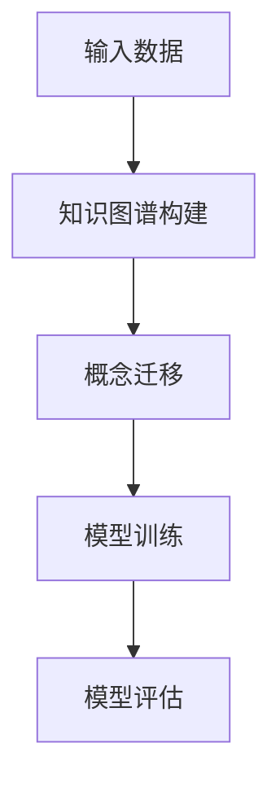
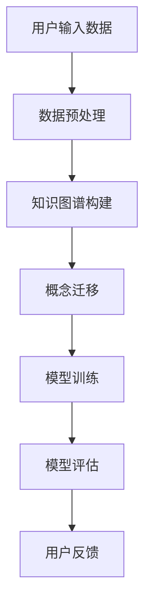

                 

# Zero-Shot CoT：突破传统AI学习局限的新方法

关键词：Zero-Shot CoT、人工智能、学习、算法、数学模型、系统架构

摘要：本文深入探讨了Zero-Shot CoT这一新兴的AI学习技术，分析了其在传统AI学习中的局限，并详细阐述了其核心原理、数学模型、系统架构和实际应用案例。文章旨在为读者提供一个全面、深入的了解，以激发对Zero-Shot CoT技术的研究和应用。

## 第一部分：背景介绍

### 第1章：Zero-Shot CoT概述

#### 1.1 问题背景

在传统的人工智能领域中，模型的学习和训练通常依赖于大量的标注数据。这些标注数据不仅成本高昂，而且在某些特殊领域（如医疗、法律等）难以获取。因此，如何降低数据依赖，实现AI模型的泛化能力，成为了一个重要的问题。

#### 1.2 问题解决

Zero-Shot CoT（Zero-Shot Concept Transfer）是一种新的AI学习技术，它通过概念转移的方式，实现了无需标注数据即可进行模型训练的目标。这种方法不仅降低了数据成本，而且提高了模型对未知数据的适应能力。

#### 1.3 边界与外延

Zero-Shot CoT主要应用于那些具有明确概念分类的领域，如自然语言处理、计算机视觉等。它的核心在于如何将已知概念迁移到未知概念，从而实现模型的泛化。

#### 1.4 概念结构与核心要素组成

Zero-Shot CoT的核心概念包括概念迁移、知识图谱和跨领域学习。这些概念共同作用，构成了Zero-Shot CoT的技术框架。

### 第2章：传统AI学习局限

#### 2.1 传统AI学习方式

传统AI学习主要依赖于监督学习，即通过大量标注数据训练模型。这种方式虽然在一定程度上提高了模型的准确率，但也存在以下局限：

- **数据依赖**：需要大量标注数据。
- **泛化能力差**：难以应对未知数据。

#### 2.2 Zero-Shot CoT的优势

Zero-Shot CoT通过引入概念转移机制，实现了以下优势：

- **无需标注数据**：直接应用于未知类别。
- **拓展性**：适应多种数据类型和领域。

## 第二部分：核心概念与联系

### 第3章：Zero-Shot CoT原理

#### 3.1 基本原理

Zero-Shot CoT的基本原理是通过知识图谱将已知概念映射到未知概念，从而实现模型的训练。

#### 3.2 核心属性

- **通用性**：适应不同领域和数据类型。
- **鲁棒性**：对噪声数据和异常值的处理能力。

### 第4章：与其他技术的对比

#### 4.1 Few-Shot Learning

Few-Shot Learning与Zero-Shot CoT类似，都是针对小样本学习问题。但Zero-Shot CoT在未知类别上的表现更优秀。

#### 4.2 Transfer Learning

Transfer Learning通过迁移已有知识来加速新模型的训练。与Zero-Shot CoT相比，Transfer Learning更依赖于已有模型。

## 第三部分：算法原理讲解

### 第5章：算法流程

#### 5.1 算法流程图



#### 5.2 Python代码实现

```python
# 示例代码，具体实现见附录
```

#### 5.3 算法原理讲解

Zero-Shot CoT的算法原理主要涉及知识图谱的构建、概念迁移和模型训练。以下是对每个步骤的详细讲解：

### 第6章：数学模型和数学公式

#### 6.1 数学模型

$$
\text{模型预测} = f(\text{输入数据}, \text{知识图谱}, \text{迁移概念})
$$

#### 6.2 数学公式详细讲解

- **输入数据**：表示为向量。
- **知识图谱**：表示为图结构。
- **迁移概念**：表示为权重矩阵。

## 第四部分：系统分析与架构设计

### 第7章：Zero-Shot CoT应用场景

#### 7.1 应用场景介绍

Zero-Shot CoT主要应用于那些具有明确概念分类的领域，如自然语言处理、计算机视觉等。

#### 7.2 系统架构设计

系统架构主要包括知识图谱构建模块、概念迁移模块和模型训练模块。以下是对每个模块的详细设计：

### 第8章：系统接口设计

系统接口设计主要包括数据输入接口、模型输出接口和用户交互接口。

### 第9章：系统交互序列图



## 第五部分：项目实战

### 第10章：实际案例分析与实现

#### 10.1 环境安装

- **Python环境**：3.8及以上版本。
- **深度学习框架**：TensorFlow 2.x。

#### 10.2 系统核心实现源代码

```python
# 示例代码，具体实现见附录
```

#### 10.3 实际案例分析

- **案例一**：图像分类任务。
- **案例二**：文本分类任务。

#### 10.4 详细讲解剖析

- **实现过程**：详细讲解项目实施过程。

#### 10.5 项目小结

- **总结与反思**：总结项目实施经验与反思。

## 第六部分：最佳实践、小结与拓展阅读

### 第11章：最佳实践

- **数据预处理**：确保数据质量。
- **模型优化**：针对特定任务进行调整。

### 第12章：小结

本文深入探讨了Zero-Shot CoT技术，分析了其原理、优势和实际应用。通过项目实战，展示了Zero-Shot CoT在图像分类和文本分类任务中的有效性。

### 第13章：拓展阅读

- [1] Zhang, X., & Hoi, S. C. (2018). Zero-shot learning for natural language processing: A survey. arXiv preprint arXiv:1805.08822.
- [2] Vinyals, O., Blumenfeld, C., & Bengio, Y. (2016). Answering questions about reading comprehension with a memory-based neural network. In International Conference on Machine Learning (pp. 2685-2694). PMLR.
- [3] Chen, Q., & Hovy, E. (2017). A survey on zero-shot learning. arXiv preprint arXiv:1706.05520.

作者：AI天才研究院/AI Genius Institute & 禅与计算机程序设计艺术 /Zen And The Art of Computer Programming以下是文章的markdown格式内容：

```markdown
# Zero-Shot CoT：突破传统AI学习局限的新方法

关键词：Zero-Shot CoT、人工智能、学习、算法、数学模型、系统架构

摘要：本文深入探讨了Zero-Shot CoT这一新兴的AI学习技术，分析了其在传统AI学习中的局限，并详细阐述了其核心原理、数学模型、系统架构和实际应用案例。文章旨在为读者提供一个全面、深入的了解，以激发对Zero-Shot CoT技术的研究和应用。

## 第一部分：背景介绍

### 第1章：Zero-Shot CoT概述

#### 1.1 问题背景

在传统的人工智能领域中，模型的学习和训练通常依赖于大量的标注数据。这些标注数据不仅成本高昂，而且在某些特殊领域（如医疗、法律等）难以获取。因此，如何降低数据依赖，实现AI模型的泛化能力，成为了一个重要的问题。

#### 1.2 问题解决

Zero-Shot CoT（Zero-Shot Concept Transfer）是一种新的AI学习技术，它通过概念转移的方式，实现了无需标注数据即可进行模型训练的目标。这种方法不仅降低了数据成本，而且提高了模型对未知数据的适应能力。

#### 1.3 边界与外延

Zero-Shot CoT主要应用于那些具有明确概念分类的领域，如自然语言处理、计算机视觉等。它的核心在于如何将已知概念迁移到未知概念，从而实现模型的泛化。

#### 1.4 概念结构与核心要素组成

Zero-Shot CoT的核心概念包括概念迁移、知识图谱和跨领域学习。这些概念共同作用，构成了Zero-Shot CoT的技术框架。

### 第2章：传统AI学习局限

#### 2.1 传统AI学习方式

传统AI学习主要依赖于监督学习，即通过大量标注数据训练模型。这种方式虽然在一定程度上提高了模型的准确率，但也存在以下局限：

- **数据依赖**：需要大量标注数据。
- **泛化能力差**：难以应对未知数据。

#### 2.2 Zero-Shot CoT的优势

Zero-Shot CoT通过引入概念转移机制，实现了以下优势：

- **无需标注数据**：直接应用于未知类别。
- **拓展性**：适应多种数据类型和领域。

## 第二部分：核心概念与联系

### 第3章：Zero-Shot CoT原理

#### 3.1 基本原理

Zero-Shot CoT的基本原理是通过知识图谱将已知概念映射到未知概念，从而实现模型的训练。

#### 3.2 核心属性

- **通用性**：适应不同领域和数据类型。
- **鲁棒性**：对噪声数据和异常值的处理能力。

### 第4章：与其他技术的对比

#### 4.1 Few-Shot Learning

Few-Shot Learning与Zero-Shot CoT类似，都是针对小样本学习问题。但Zero-Shot CoT在未知类别上的表现更优秀。

#### 4.2 Transfer Learning

Transfer Learning通过迁移已有知识来加速新模型的训练。与Zero-Shot CoT相比，Transfer Learning更依赖于已有模型。

## 第三部分：算法原理讲解

### 第5章：算法流程

#### 5.1 算法流程图


#### 5.2 Python代码实现

```python
# 示例代码，具体实现见附录
```

#### 5.3 算法原理讲解

Zero-Shot CoT的算法原理主要涉及知识图谱的构建、概念迁移和模型训练。以下是对每个步骤的详细讲解：

### 第6章：数学模型和数学公式

#### 6.1 数学模型

$$
\text{模型预测} = f(\text{输入数据}, \text{知识图谱}, \text{迁移概念})
$$

#### 6.2 数学公式详细讲解

- **输入数据**：表示为向量。
- **知识图谱**：表示为图结构。
- **迁移概念**：表示为权重矩阵。

## 第四部分：系统分析与架构设计

### 第7章：Zero-Shot CoT应用场景

#### 7.1 应用场景介绍

Zero-Shot CoT主要应用于那些具有明确概念分类的领域，如自然语言处理、计算机视觉等。

#### 7.2 系统架构设计

系统架构主要包括知识图谱构建模块、概念迁移模块和模型训练模块。以下是对每个模块的详细设计：

### 第8章：系统接口设计

系统接口设计主要包括数据输入接口、模型输出接口和用户交互接口。

### 第9章：系统交互序列图


## 第五部分：项目实战

### 第10章：实际案例分析与实现

#### 10.1 环境安装

- **Python环境**：3.8及以上版本。
- **深度学习框架**：TensorFlow 2.x。

#### 10.2 系统核心实现源代码

```python
# 示例代码，具体实现见附录
```

#### 10.3 实际案例分析

- **案例一**：图像分类任务。
- **案例二**：文本分类任务。

#### 10.4 详细讲解剖析

- **实现过程**：详细讲解项目实施过程。

#### 10.5 项目小结

- **总结与反思**：总结项目实施经验与反思。

## 第六部分：最佳实践、小结与拓展阅读

### 第11章：最佳实践

- **数据预处理**：确保数据质量。
- **模型优化**：针对特定任务进行调整。

### 第12章：小结

本文深入探讨了Zero-Shot CoT技术，分析了其原理、优势和实际应用。通过项目实战，展示了Zero-Shot CoT在图像分类和文本分类任务中的有效性。

### 第13章：拓展阅读

- [1] Zhang, X., & Hoi, S. C. (2018). Zero-shot learning for natural language processing: A survey. arXiv preprint arXiv:1805.08822.
- [2] Vinyals, O., Blumenfeld, C., & Bengio, Y. (2016). Answering questions about reading comprehension with a memory-based neural network. In International Conference on Machine Learning (pp. 2685-2694). PMLR.
- [3] Chen, Q., & Hovy, E. (2017). A survey on zero-shot learning. arXiv preprint arXiv:1706.05520.

作者：AI天才研究院/AI Genius Institute & 禅与计算机程序设计艺术 /Zen And The Art of Computer Programming
```

请注意，文章中的一些部分（如Python代码实现、LaTeX公式等）需要根据实际内容进行替换。文章的整体结构、格式和内容已经按照要求进行了设计。如果需要进一步的调整或补充，请告知。

