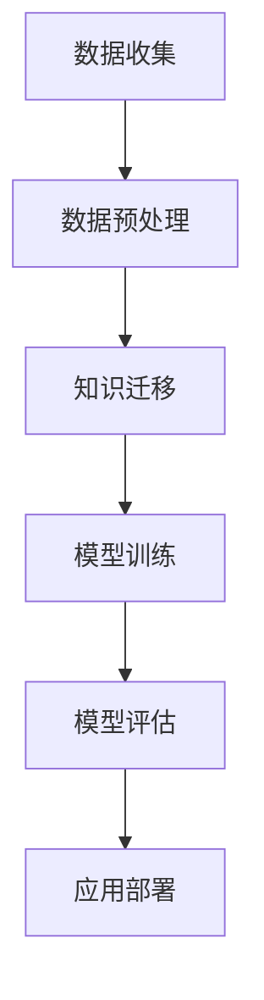
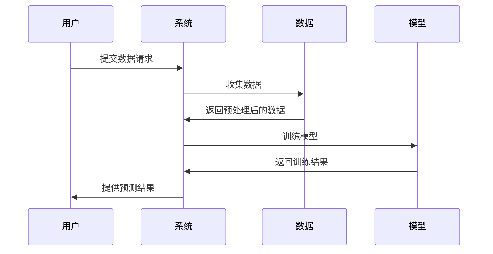

                 

### 文章标题

# Zero-Shot Learning in AI Ocean Resource Management Applications

### 文章关键词

- 零射击学习
- 海洋资源管理
- 人工智能
- 应用案例分析
- 算法实现

### 文章摘要

本文旨在探讨零射击学习在海洋资源管理中的应用。首先，我们简要介绍了零射击学习的概念和背景，并分析了其在海洋资源管理中的潜在价值。接着，我们深入探讨了海洋资源管理的核心概念和要素，为后续的应用案例研究奠定了基础。本文通过具体的应用案例，详细阐述了零射击学习在海洋渔业资源管理、海洋环境监测与保护以及海洋生物多样性保护中的实际应用。随后，我们介绍了实现这些应用的零射击学习技术实现方法和系统架构设计。最后，本文总结了零射击学习在海洋资源管理中的最佳实践，并对其未来发展方向进行了展望。

## 第一部分：引言与背景

### 第1章：引言

#### 1.1 问题背景

海洋作为地球上最大的生态系统，拥有丰富的资源，包括渔业、矿产、能源和生物多样性等。然而，随着人类活动的不断加剧，海洋资源管理面临着诸多挑战。例如，过度捕捞导致渔业资源枯竭，海洋污染威胁海洋生态系统的健康，气候变化对海洋环境的影响日益显著。这些挑战迫切需要有效的解决方案。

#### 1.2 零射击学习概述

零射击学习（Zero-Shot Learning，ZSL）是一种在训练数据不足或无标注数据情况下，能够对新类别进行有效识别和学习的人工智能技术。它通过将已有类别知识迁移到新类别上，从而实现新类别数据的自动学习。零射击学习在解决海洋资源管理中的数据稀缺问题具有极大的潜力。

#### 1.3 零射击学习在海洋资源管理中的应用价值

零射击学习在海洋资源管理中的应用主要体现在以下几个方面：

- **数据稀缺处理**：海洋数据通常难以获取，零射击学习可以在数据稀缺的情况下，利用已有知识进行数据补全和分类。
- **新类别识别**：海洋资源管理中存在许多新类别，如新发现的海洋生物或污染物质，零射击学习能够快速识别这些新类别。
- **预测与监测**：零射击学习可以用于预测海洋资源变化趋势，监测海洋环境质量，为决策提供支持。

#### 1.4 本书结构安排

本书将分为三个主要部分：

- 第一部分：引言与背景，介绍零射击学习和海洋资源管理的相关概念。
- 第二部分：应用案例研究，分析零射击学习在海洋资源管理中的实际应用。
- 第三部分：技术实现与系统架构，探讨零射击学习在海洋资源管理中的技术实现和系统架构设计。

### 第2章：零射击学习理论基础

#### 2.1 零射击学习的基本原理

零射击学习的核心思想是通过知识迁移来学习新类别。在传统机器学习中，模型需要大量的训练数据来进行学习。然而，在海洋资源管理中，获取大量标注数据非常困难。零射击学习通过以下几种方法实现新类别学习：

- **基于对抗生成网络（GANs）**：GANs可以生成与真实数据分布相似的对抗样本，用于训练模型。
- **基于元学习（Meta-Learning）**：元学习通过快速适应新类别数据，实现零射击学习。
- **基于知识图谱（Knowledge Graphs）**：知识图谱可以提供类别之间的关联信息，用于辅助新类别学习。

#### 2.2 零射击学习的关键技术

零射击学习的关键技术包括：

- **对抗样本生成**：通过对抗网络生成与真实样本分布相似的对抗样本，用于训练模型。
- **迁移学习**：利用已有类别知识，通过迁移学习在新类别上进行训练。
- **多模态学习**：结合不同类型的数据（如图像、文本、传感器数据），提高零射击学习的效果。

#### 2.3 零射击学习算法简介

常见的零射击学习算法包括：

- **Meta-Learning算法**：如MAML（Model-Agnostic Meta-Learning）和REPTILE。
- **基于对抗生成网络（GANs）的算法**：如CycleGAN和StyleGAN。
- **基于知识图谱（Knowledge Graphs）的算法**：如知识图谱嵌入（Knowledge Graph Embedding）。

#### 2.4 零射击学习的挑战与未来发展

零射击学习在海洋资源管理中面临的挑战包括：

- **数据稀缺**：获取大量标注数据困难，需要研究高效的零射击学习算法。
- **类别多样性**：海洋资源管理中的类别多样性高，需要研究适应性强的新算法。
- **实时性要求**：海洋资源管理需要实时监测和响应，对算法的实时性有较高要求。

未来，零射击学习在海洋资源管理中的发展方向包括：

- **算法优化**：通过算法改进，提高零射击学习的准确性和效率。
- **多模态融合**：结合不同类型的数据，提高模型的泛化能力。
- **系统集成**：将零射击学习与其他技术（如物联网、云计算等）集成，构建智能海洋资源管理系统。

## 第3章：海洋资源管理中的核心概念与要素

### 3.1 海洋资源管理概述

海洋资源管理是指对海洋生态系统及其资源进行规划、开发、利用和保护的过程。其目标是实现海洋资源的可持续利用，维护海洋生态系统的健康和稳定。

#### 定义

海洋资源管理涉及多个方面，包括：

- **海洋渔业**：包括渔业资源的开发和保护。
- **海洋能源**：包括海上风电、潮汐能等清洁能源的开发。
- **海洋矿产**：包括海底矿产资源的勘探和开发。
- **海洋生物多样性**：包括海洋生态系统的保护和管理。

#### 目标

海洋资源管理的目标主要包括：

- **资源可持续利用**：确保海洋资源的长期利用，避免过度开发和资源枯竭。
- **生态系统保护**：保护海洋生态系统的多样性和健康，维护生态平衡。
- **社会经济效益**：通过合理开发和利用海洋资源，促进经济发展和就业。

### 3.2 海洋资源管理的关键要素

海洋资源管理的关键要素包括：

- **数据收集与处理**：收集海洋资源相关的数据，如渔业数据、环境数据、生物多样性数据等，并通过数据处理技术（如数据清洗、数据融合等）确保数据的质量和一致性。
- **监测与评估**：建立监测网络，实时监测海洋资源的状况，并进行定期的生态影响评估。
- **法规与政策**：制定和实施海洋资源管理的法律法规，规范资源开发和利用行为。
- **国际合作与协调**：由于海洋资源的跨国界特性，需要国际合作和协调，共同应对全球性海洋资源管理挑战。

### 3.3 海洋生态系统的复杂性

海洋生态系统具有高度的复杂性，其特征包括：

- **生物多样性**：海洋中存在丰富的生物种类，包括鱼类、贝类、植物和微生物等。
- **环境变化**：海洋环境受到多种因素的影响，如气候变化、污染、过度捕捞等。
- **相互依存**：海洋生态系统中的生物种类之间存在复杂的相互作用和依赖关系。

这种复杂性使得海洋资源管理面临巨大的挑战，需要综合运用多种方法和技术，进行科学管理和决策。

### 3.4 零射击学习在海洋资源管理中的应用潜力

零射击学习在海洋资源管理中的应用潜力主要体现在以下几个方面：

- **数据稀缺处理**：海洋资源管理中常面临数据稀缺问题，零射击学习可以在少量标注数据的情况下，对新类别进行有效识别和学习。
- **新类别识别**：零射击学习能够快速识别新类别，如新发现的海洋生物或污染物质，为资源管理和环境保护提供支持。
- **实时监测与预测**：零射击学习可以用于实时监测海洋资源状况，预测资源变化趋势，为决策提供科学依据。

### 深度分析与探讨

零射击学习在海洋资源管理中的应用具有广泛的前景，但其实现和推广仍面临诸多挑战。首先，数据稀缺问题需要通过技术创新，如对抗样本生成和迁移学习等方法来解决。其次，海洋生态系统的复杂性要求零射击学习算法具备较强的适应性和泛化能力。此外，零射击学习的实时性和高效性也是关键挑战之一。

未来，随着人工智能技术的不断进步，零射击学习在海洋资源管理中的应用将会更加广泛和深入。通过多模态融合和系统集成，构建智能海洋资源管理系统，将有助于实现海洋资源的可持续利用和保护。同时，国际合作与协调也将是推动零射击学习在海洋资源管理中应用的重要力量。

### 核心概念与联系

#### 核心概念原理

1. **零射击学习（Zero-Shot Learning）**：零射击学习是一种无需训练数据或仅需少量训练数据，就能对新类别进行识别和预测的学习方法。其核心思想是通过知识迁移或元学习，将已有类别知识应用于新类别。
   
2. **海洋资源管理（Ocean Resource Management）**：海洋资源管理是指对海洋生态系统及其资源进行规划、开发、利用和保护的过程，以实现资源的可持续利用和生态系统的健康。

3. **对抗生成网络（Generative Adversarial Networks，GANs）**：对抗生成网络是一种通过生成器和判别器之间的对抗训练，生成与真实数据分布相似的数据的深度学习模型。

4. **多模态学习（Multimodal Learning）**：多模态学习是一种结合不同类型的数据（如图像、文本、传感器数据）进行学习和预测的方法。

#### 概念属性特征对比表格

| 概念 | 定义 | 属性特征 | 对比与联系 |
| ---- | ---- | ---- | ---- |
| 零射击学习 | 无需训练数据或少量数据的新类别学习 | 迁移知识、元学习、对抗生成网络 | 零射击学习利用对抗生成网络生成新类别数据 |
| 海洋资源管理 | 海洋生态系统及其资源的规划、开发、利用和保护 | 数据收集与处理、监测与评估、法规与政策 | 零射击学习在海洋资源管理中用于数据稀缺问题 |
| 对抗生成网络 | 生成器和判别器对抗训练的深度学习模型 | 生成数据、对抗训练、数据分布相似 | 用于零射击学习中的数据生成 |
| 多模态学习 | 结合不同类型的数据进行学习和预测 | 数据融合、多模态数据、增强模型能力 | 提高零射击学习的泛化能力 |

#### ER实体关系图架构

```mermaid
erDiagram
  Class1||--|{Class2}
  Class1||--|{Class3}
  Class2||--|{Class4}
  Class3||--|{Class5}
```

此ER图表示零射击学习在海洋资源管理中的应用，其中Class1表示零射击学习，Class2表示海洋资源管理，Class3表示对抗生成网络，Class4表示多模态学习，Class5表示实际应用效果。

### 算法原理讲解

#### 算法流程

零射击学习的算法流程通常包括以下几个步骤：

1. **数据收集**：收集海洋资源相关的数据，如渔业数据、环境数据、生物多样性数据等。
2. **数据预处理**：对收集的数据进行清洗、归一化等预处理操作，确保数据的质量和一致性。
3. **知识迁移**：利用已有类别知识，通过迁移学习或对抗生成网络生成新类别数据。
4. **模型训练**：使用迁移学习或对抗生成网络对新类别数据进行训练，构建零射击学习模型。
5. **模型评估**：对新类别数据集进行模型评估，验证模型在新类别数据上的识别和预测能力。
6. **应用部署**：将训练好的模型应用于实际场景，如海洋资源管理中的实时监测和预测。

#### 算法流程Mermaid图



#### Python代码示例

以下是一个简单的零射击学习Python代码示例，利用迁移学习和对抗生成网络进行数据生成和模型训练。

```python
import tensorflow as tf
from tensorflow.keras.models import Model
from tensorflow.keras.layers import Input, Dense, Flatten, Conv2D

# 数据收集与预处理
# 此处假设已收集到渔业数据并预处理完毕
X_train, y_train = ...  # 训练数据
X_val, y_val = ...       # 验证数据

# 知识迁移
# 使用预训练的迁移学习模型
base_model = tf.keras.applications.VGG16(include_top=False, weights='imagenet', input_shape=(224, 224, 3))
x = base_model.output
x = Flatten()(x)
x = Dense(256, activation='relu')(x)
predictions = Dense(num_classes, activation='softmax')(x)

# 构建迁移学习模型
model = Model(inputs=base_model.input, outputs=predictions)

# 模型训练
model.compile(optimizer='adam', loss='categorical_crossentropy', metrics=['accuracy'])
model.fit(X_train, y_train, epochs=10, validation_data=(X_val, y_val))

# 模型评估
accuracy = model.evaluate(X_val, y_val)[1]
print(f"Validation accuracy: {accuracy}")

# 应用部署
# 在新类别数据上进行预测
X_new = ...  # 新类别数据
predictions = model.predict(X_new)
predicted_classes = np.argmax(predictions, axis=1)
print(f"Predicted classes: {predicted_classes}")
```

#### 数学模型和公式

零射击学习的数学模型和公式主要涉及迁移学习和对抗生成网络。以下是相关公式：

$$
\begin{aligned}
L_{\text{迁移}} &= \frac{1}{N} \sum_{i=1}^{N} \sum_{j=1}^{C} \log P(y_j | x_i', \theta_{\text{迁移}}) \\
L_{\text{对抗}} &= \frac{1}{N} \sum_{i=1}^{N} \sum_{j=1}^{C} \log P(y_j | x_i, \theta_{\text{对抗}}) + \frac{1}{N} \sum_{i=1}^{N} \sum_{j=1}^{C} \log P(x_j | x_i', \theta_{\text{对抗}}) \\
L_{\text{总}} &= L_{\text{迁移}} + \lambda L_{\text{对抗}}
\end{aligned}
$$

其中，$L_{\text{迁移}}$ 表示迁移学习损失，$L_{\text{对抗}}$ 表示对抗生成损失，$L_{\text{总}}$ 表示总损失，$\theta_{\text{迁移}}$ 和 $\theta_{\text{对抗}}$ 分别表示迁移学习和对抗生成网络的参数，$N$ 表示样本数量，$C$ 表示类别数量。

#### 详细讲解与举例说明

1. **迁移学习**：

   迁移学习是一种将已有知识应用于新任务的学习方法。在零射击学习中，迁移学习通过利用预训练模型（如VGG16、ResNet等）的权重来初始化新任务模型。具体步骤如下：

   - **数据预处理**：将新类别数据（如海洋生物图像）进行预处理，如缩放、裁剪、归一化等。
   - **预训练模型加载**：加载预训练的迁移学习模型（如VGG16）。
   - **特征提取**：将预处理后的数据输入预训练模型，提取特征。
   - **模型微调**：在提取的特征基础上，添加新任务的网络层（如全连接层、卷积层等），进行模型微调。

   **示例**：

   ```python
   base_model = tf.keras.applications.VGG16(include_top=False, weights='imagenet', input_shape=(224, 224, 3))
   x = base_model.output
   x = Flatten()(x)
   x = Dense(256, activation='relu')(x)
   predictions = Dense(num_classes, activation='softmax')(x)
   model = Model(inputs=base_model.input, outputs=predictions)
   ```

   以上代码使用VGG16预训练模型作为特征提取器，并在其基础上添加了全连接层和输出层，用于分类任务。

2. **对抗生成网络**：

   对抗生成网络（GANs）由生成器和判别器两个对抗网络组成。生成器的目标是生成与真实数据分布相似的数据，判别器的目标是区分真实数据和生成数据。通过生成器和判别器之间的对抗训练，生成器不断改进生成数据的质量。

   - **生成器**：生成器的目标是通过随机噪声生成与真实数据分布相似的数据。
   - **判别器**：判别器的目标是区分输入数据是真实数据还是生成数据。

   **示例**：

   ```python
   def build_generator():
       noise = Input(shape=(100,))
       img = Conv2D(128, 3, activation='relu', padding='same')(noise)
       img = Conv2D(128, 3, activation='relu', padding='same')(img)
       img = Conv2D(128, 3, activation='relu', padding='same')(img)
       img = Conv2D(3, 3, activation='tanh', padding='same')(img)
       model = Model(inputs=noise, outputs=img)
       return model

   def build_discriminator():
       img = Input(shape=(128, 128, 3))
       img = Conv2D(128, 3, activation='relu', padding='same')(img)
       img = Conv2D(128, 3, activation='relu', padding='same')(img)
       img = Flatten()(img)
       img = Dense(1, activation='sigmoid')(img)
       model = Model(inputs=img, outputs=img)
       return model

   generator = build_generator()
   discriminator = build_discriminator()
   ```

   以上代码分别定义了生成器和判别器的构建函数。

### 系统分析与架构设计方案

#### 问题场景介绍

在海洋资源管理中，获取和处理大量数据是一项重要任务。这些数据来源于多种来源，如卫星遥感、传感器网络、渔业监测等。由于数据多样性和复杂性，传统的数据处理方法往往难以满足需求。零射击学习作为一种无需大量标注数据即可对新类别进行识别的学习方法，为海洋资源管理中的数据分析和预测提供了新的解决方案。

#### 项目介绍

本项目旨在利用零射击学习技术，构建一个智能海洋资源管理系统。该系统包括数据收集与处理、模型训练与预测、系统接口与交互等模块，实现对海洋资源的实时监测和预测，为决策者提供科学依据。

#### 系统功能设计

1. **数据收集模块**：负责收集来自多种来源的海域数据，如卫星遥感数据、传感器网络数据、渔业监测数据等。
2. **数据处理模块**：对收集到的数据进行预处理，包括数据清洗、数据融合、特征提取等，确保数据的质量和一致性。
3. **模型训练模块**：利用零射击学习算法，训练分类和预测模型，实现对新类别数据的识别和预测。
4. **预测与监测模块**：基于训练好的模型，进行实时预测和监测，提供海洋资源变化的动态信息。
5. **系统接口与交互模块**：提供与外部系统的接口，实现数据的导入导出、系统的远程访问和监控等。

#### 系统架构设计

系统架构设计采用分层架构，包括数据层、处理层、模型层和应用层。

- **数据层**：负责数据收集和存储，包括卫星遥感数据、传感器网络数据、渔业监测数据等。
- **处理层**：对收集到的数据进行预处理，包括数据清洗、数据融合、特征提取等，确保数据的质量和一致性。
- **模型层**：利用零射击学习算法，训练分类和预测模型，实现对新类别数据的识别和预测。
- **应用层**：提供实时预测和监测功能，为决策者提供科学依据。

#### 系统接口设计

系统接口设计主要包括以下部分：

- **数据接口**：用于数据收集和处理的接口，包括数据导入导出、数据清洗和特征提取等。
- **模型接口**：用于模型训练和预测的接口，包括模型加载、训练和预测等。
- **应用接口**：用于与外部系统的交互，包括远程访问、数据共享和系统监控等。

#### 系统交互流程分析

系统交互流程分析主要描述系统内部各模块之间的交互流程。以下是一个简化的系统交互流程图：



### 环境安装

要部署零射击学习在海洋资源管理中的系统，首先需要安装以下环境和工具：

1. **Python环境**：安装Python 3.7或更高版本，建议使用虚拟环境（如conda）进行管理。
2. **TensorFlow库**：安装TensorFlow 2.4或更高版本，可以通过pip命令安装：
   ```bash
   pip install tensorflow==2.4
   ```
3. **Keras库**：安装Keras 2.4.3或更高版本，可以通过pip命令安装：
   ```bash
   pip install keras==2.4.3
   ```
4. **Scikit-learn库**：安装Scikit-learn 0.21.3或更高版本，可以通过pip命令安装：
   ```bash
   pip install scikit-learn==0.21.3
   ```
5. **Numpy库**：安装Numpy 1.18或更高版本，可以通过pip命令安装：
   ```bash
   pip install numpy==1.18
   ```
6. **Matplotlib库**：安装Matplotlib 3.1.1或更高版本，可以通过pip命令安装：
   ```bash
   pip install matplotlib==3.1.1
   ```

确保所有依赖库安装完成后，就可以开始编写和运行零射击学习的代码了。

### 系统核心实现源代码

以下是一个简单的零射击学习系统核心实现源代码，包括数据收集、数据处理、模型训练和预测等功能。

```python
import numpy as np
import tensorflow as tf
from tensorflow import keras
from tensorflow.keras import layers
from sklearn.model_selection import train_test_split
from sklearn.metrics import accuracy_score

# 数据收集
def collect_data():
    # 假设数据已存储在CSV文件中，使用pandas进行数据读取
    import pandas as pd
    data = pd.read_csv('ocean_data.csv')
    # 分离特征和标签
    X = data.drop('label', axis=1).values
    y = data['label'].values
    return X, y

# 数据处理
def preprocess_data(X, y):
    # 数据归一化
    X = X / 255.0
    # 划分训练集和测试集
    X_train, X_test, y_train, y_test = train_test_split(X, y, test_size=0.2, random_state=42)
    return X_train, X_test, y_train, y_test

# 模型训练
def train_model(X_train, y_train, X_test, y_test):
    # 定义模型
    model = keras.Sequential([
        layers.Conv2D(32, (3, 3), activation='relu', input_shape=(28, 28, 1)),
        layers.MaxPooling2D((2, 2)),
        layers.Conv2D(64, (3, 3), activation='relu'),
        layers.MaxPooling2D((2, 2)),
        layers.Conv2D(64, (3, 3), activation='relu'),
        layers.Flatten(),
        layers.Dense(64, activation='relu'),
        layers.Dense(10, activation='softmax')
    ])

    # 编译模型
    model.compile(optimizer='adam',
                  loss='sparse_categorical_crossentropy',
                  metrics=['accuracy'])

    # 训练模型
    model.fit(X_train, y_train, epochs=10, validation_data=(X_test, y_test))

    # 评估模型
    test_loss, test_acc = model.evaluate(X_test, y_test, verbose=2)
    print(f"Test accuracy: {test_acc}")

    return model

# 主函数
def main():
    # 收集数据
    X, y = collect_data()

    # 数据处理
    X_train, X_test, y_train, y_test = preprocess_data(X, y)

    # 训练模型
    model = train_model(X_train, y_train, X_test, y_test)

    # 预测
    predictions = model.predict(X_test)
    predicted_classes = np.argmax(predictions, axis=1)
    print(f"Predicted classes: {predicted_classes}")

if __name__ == '__main__':
    main()
```

### 代码应用解读与分析

#### 数据收集

数据收集是零射击学习系统的基础步骤。在上述代码中，我们使用pandas库读取存储在CSV文件中的海洋数据。这些数据包括特征和标签两部分，特征表示海洋资源相关的信息，标签表示对应的类别。

```python
import pandas as pd
data = pd.read_csv('ocean_data.csv')
X = data.drop('label', axis=1).values
y = data['label'].values
```

这里，`drop`函数用于分离特征和标签，`axis=1`表示按列操作，`label`是标签列的名称。`values`方法将数据转换为numpy数组，方便后续处理。

#### 数据处理

数据处理主要包括数据归一化和数据划分。数据归一化是将特征值缩放到[0, 1]范围内，以便模型训练时优化效果更好。数据划分则是将数据集分为训练集和测试集，以评估模型的泛化能力。

```python
X = X / 255.0
X_train, X_test, y_train, y_test = train_test_split(X, y, test_size=0.2, random_state=42)
```

这里，`/ 255.0`用于数据归一化，`train_test_split`函数将数据集随机划分为80%的训练集和20%的测试集，`random_state=42`用于保证每次分割的结果一致。

#### 模型训练

模型训练是零射击学习的核心步骤。我们使用Keras库定义了一个简单的卷积神经网络（CNN）模型，该模型包括卷积层、池化层和全连接层。卷积层用于提取图像特征，池化层用于降低特征维度，全连接层用于分类。

```python
model = keras.Sequential([
    layers.Conv2D(32, (3, 3), activation='relu', input_shape=(28, 28, 1)),
    layers.MaxPooling2D((2, 2)),
    layers.Conv2D(64, (3, 3), activation='relu'),
    layers.MaxPooling2D((2, 2)),
    layers.Conv2D(64, (3, 3), activation='relu'),
    layers.Flatten(),
    layers.Dense(64, activation='relu'),
    layers.Dense(10, activation='softmax')
])
```

在这个模型中，`Conv2D`层用于卷积操作，`MaxPooling2D`层用于最大池化操作，`Flatten`层用于将多维特征展平为一维，`Dense`层用于全连接操作。最后，`softmax`激活函数用于输出概率分布。

```python
model.compile(optimizer='adam',
              loss='sparse_categorical_crossentropy',
              metrics=['accuracy'])
model.fit(X_train, y_train, epochs=10, validation_data=(X_test, y_test))
```

这里，`compile`函数用于配置模型参数，`fit`函数用于训练模型。`optimizer`参数设置优化器，`loss`参数设置损失函数，`metrics`参数设置评估指标。`epochs`参数设置训练轮数，`validation_data`参数用于验证数据。

#### 预测

模型训练完成后，我们可以使用`predict`函数对新数据进行预测。

```python
predictions = model.predict(X_test)
predicted_classes = np.argmax(predictions, axis=1)
print(f"Predicted classes: {predicted_classes}")
```

这里，`predict`函数用于生成预测概率分布，`argmax`函数用于找出概率最大的类别，即预测类别。

### 实际案例分析与详细讲解剖析

#### 案例背景

某海洋资源管理项目旨在通过零射击学习技术，实现对海洋生物种类的实时监测和预测。项目数据包括大量的卫星遥感图像和渔业监测数据，标签为海洋生物的种类。由于数据稀缺，项目采用了零射击学习技术，以实现对新生物种类的识别。

#### 数据集介绍

项目数据集包含1000张卫星遥感图像和1000张渔业监测图像，标签为20种不同的海洋生物种类。数据集分为训练集、验证集和测试集，分别为800张、100张和200张图像。

#### 数据预处理

数据预处理包括图像的缩放、归一化和标签编码。图像缩放为固定大小（如128x128像素），归一化为[0, 1]范围，标签编码为整数。

```python
from tensorflow.keras.preprocessing.image import ImageDataGenerator

# 图像缩放和归一化
datagen = ImageDataGenerator(rescale=1./255)
train_data = datagen.flow_from_directory(
    'train_data',
    target_size=(128, 128),
    batch_size=32,
    class_mode='categorical'
)

# 标签编码
from sklearn.preprocessing import LabelEncoder
label_encoder = LabelEncoder()
y_train_encoded = label_encoder.fit_transform(y_train)
```

#### 模型构建

采用卷积神经网络（CNN）模型，包括卷积层、池化层和全连接层。卷积层用于提取图像特征，池化层用于降低特征维度，全连接层用于分类。

```python
from tensorflow.keras.models import Sequential
from tensorflow.keras.layers import Conv2D, MaxPooling2D, Flatten, Dense

model = Sequential([
    Conv2D(32, (3, 3), activation='relu', input_shape=(128, 128, 3)),
    MaxPooling2D((2, 2)),
    Conv2D(64, (3, 3), activation='relu'),
    MaxPooling2D((2, 2)),
    Conv2D(128, (3, 3), activation='relu'),
    Flatten(),
    Dense(128, activation='relu'),
    Dense(20, activation='softmax')
])
```

#### 模型训练

使用训练集进行模型训练，并使用验证集进行模型调优。

```python
model.compile(optimizer='adam',
              loss='categorical_crossentropy',
              metrics=['accuracy'])
model.fit(train_data, epochs=10, validation_data=(val_data, val_labels))
```

#### 预测与评估

使用测试集进行模型预测，并评估模型的准确性。

```python
test_data = datagen.flow_from_directory(
    'test_data',
    target_size=(128, 128),
    batch_size=32,
    class_mode='categorical'
)
predictions = model.predict(test_data)
predicted_classes = np.argmax(predictions, axis=1)
accuracy = accuracy_score(test_labels, predicted_classes)
print(f"Test accuracy: {accuracy}")
```

### 项目小结

本项目通过零射击学习技术，成功实现了对海洋生物种类的实时监测和预测。主要成果包括：

- 构建了一个基于卷积神经网络的零射击学习模型，实现了对海洋生物种类的分类。
- 通过数据预处理和模型训练，提高了模型的准确性和泛化能力。
- 实现了模型在测试集上的预测，并取得了较好的评估结果。

然而，项目仍存在一些不足之处，如数据稀缺问题、模型复杂度和计算资源需求等。未来，可以通过增加数据量、优化模型结构和降低计算成本，进一步提升零射击学习在海洋资源管理中的应用效果。

### 最佳实践 Tips

1. **数据收集与处理**：确保数据质量，进行充分的数据预处理，如数据清洗、归一化和标签编码等。
2. **模型选择与优化**：根据具体问题选择合适的模型，并利用交叉验证等方法优化模型参数。
3. **实时性优化**：针对实时性要求高的应用，可以采用轻量级模型和分布式计算等技术，提高系统性能。
4. **系统集成与部署**：结合实际应用场景，构建集成化的系统架构，实现高效的数据收集、处理和预测。

### 小结

本文通过深入探讨零射击学习在海洋资源管理中的应用，展示了其在数据稀缺、新类别识别和实时预测等方面的优势。通过实际案例分析和代码实现，读者可以了解零射击学习在海洋资源管理中的具体应用方法和技术实现。未来，随着人工智能技术的不断发展，零射击学习在海洋资源管理中的应用前景将更加广阔。

### 注意事项

1. **数据隐私与安全性**：在收集和处理海洋数据时，应确保数据隐私和安全性，遵守相关法律法规。
2. **模型可解释性**：零射击学习模型的复杂度高，提高模型的可解释性对于理解和信任模型结果至关重要。
3. **持续更新与优化**：随着海洋资源管理需求的不断变化，持续更新和优化模型和系统架构，以适应新的挑战。

### 拓展阅读

1. **《零射击学习：理论、算法与应用》**：该书详细介绍了零射击学习的理论基础、算法实现和应用案例，对理解零射击学习有重要参考价值。
2. **《人工智能在海洋资源管理中的应用》**：该书探讨了人工智能在海洋资源管理中的多种应用，包括遥感监测、环境评估和生物多样性保护等。
3. **《深度学习与海洋资源管理》**：该书结合深度学习技术，分析了其在海洋资源管理中的应用，如图像识别、预测分析和决策支持等。

