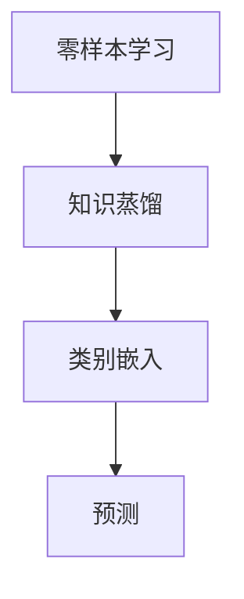
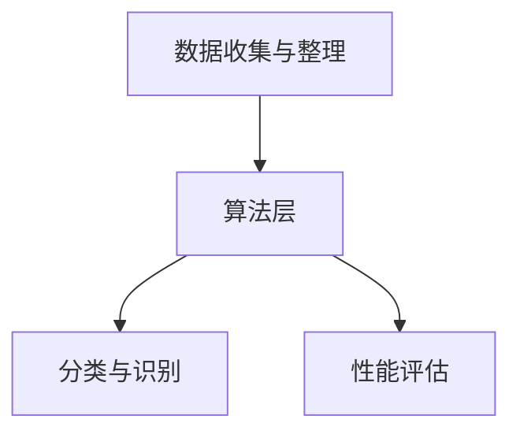

                 

# Zero-Shot Learning在AI生物多样性保护中的应用

## 关键词
- 零样本学习
- AI生物多样性保护
- 深度学习模型
- 算法优化
- 实际应用案例

## 摘要
本文探讨了零样本学习（Zero-Shot Learning，ZSL）在AI生物多样性保护中的应用。通过深入分析ZSL的基础理论、算法原理及其在生物多样性数据上的应用，本文为研究人员、开发者以及环境保护工作者提供了一套系统的理论框架和应用指南。文章还通过具体案例展示了零样本学习在生物多样性保护实际项目中的有效性和潜力。

## 目录大纲设计

### 一、背景介绍

#### 1. 问题背景

随着人工智能（AI）技术的飞速发展，零样本学习（Zero-Shot Learning, ZSL）作为深度学习的一个重要分支，越来越受到研究者的关注。零样本学习旨在解决传统机器学习模型中需要大量标注数据的困境，通过少量的或无标注数据来识别新的类别。在生物多样性保护领域，零样本学习有巨大的应用潜力，能够快速识别和分类生物种类，从而为保护工作提供科学依据。

#### 2. 问题描述

本书主要探讨零样本学习在AI生物多样性保护中的应用，包括以下几个方面：

- 零样本学习的基础理论和技术原理
- 零样本学习算法在生物多样性数据上的应用
- 零样本学习算法的性能评估与优化
- 零样本学习在生物多样性保护实际项目中的应用案例

#### 3. 问题解决

通过深入研究零样本学习在生物多样性保护中的应用，本书旨在为研究者、开发者以及环境保护工作者提供一套系统的理论框架和应用指南。

#### 4. 边界与外延

- **边界**：本书主要关注基于深度学习的零样本学习在生物多样性保护中的应用，不包括其他类型的机器学习技术。
- **外延**：零样本学习技术还可应用于其他领域，如医学诊断、图像识别等。

#### 5. 概念结构与核心要素组成

- **核心概念**：零样本学习、生物多样性、深度学习模型、算法优化
- **要素组成**：生物多样性数据集、零样本学习算法、评估指标、应用场景

### 二、核心概念与联系

#### 1. 零样本学习

零样本学习是一种机器学习技术，允许模型在没有或仅有少量标注数据的情况下，对新类别进行识别。其核心在于通过将新的类别与已知类别进行关联，实现对新类别的预测。

#### 2. 生物多样性

生物多样性是指地球上所有生物体及其生态系统的多样性。它包括基因多样性、物种多样性和生态系统多样性。生物多样性保护是环境保护的重要组成部分。

#### 3. 深度学习模型

深度学习模型是一种通过模拟人脑神经网络进行学习的算法。它能够处理大量复杂数据，并从中提取特征。深度学习模型在零样本学习中发挥着关键作用。

#### 4. 算法优化

算法优化是指通过调整模型的参数、结构等，提高模型在特定任务上的性能。在零样本学习算法中，优化是提升性能的关键步骤。

### 三、算法原理讲解

#### 1. 零样本学习算法原理

零样本学习算法通常包括以下几个步骤：

- **知识蒸馏**：将大量已标注数据的特征传递给零样本学习模型。
- **类别嵌入**：将新的类别映射到特征空间中。
- **预测**：利用模型在新类别上的特征进行预测。

#### 2. 算法mermaid流程图



#### 3. 数学模型和公式

零样本学习中的数学模型通常包括以下公式：

$$
\text{Prediction} = \text{softmax}(\text{Model}(\text{Features}_{\text{new}}))
$$

其中，$\text{Features}_{\text{new}}$表示新类别的特征，$\text{Model}$表示深度学习模型，$\text{softmax}$函数用于得到每个类别的概率分布。

#### 4. 举例说明

假设我们有一个包含狗和猫的零样本学习模型。当模型遇到一只新的动物时，它会将这只动物的特征与已知的狗和猫的特征进行匹配，然后根据匹配结果预测新动物的种类。

### 四、数学模型和数学公式 & 详细讲解 & 举例说明

#### 1. 数学模型

零样本学习中的数学模型主要基于深度学习模型的输出。深度学习模型通常是一个多层神经网络，其输出可以通过以下公式计算：

$$
\text{Output} = \text{Activation}(\text{Weight} \cdot \text{Input} + \text{Bias})
$$

其中，$\text{Input}$是模型的输入特征，$\text{Weight}$和$\text{Bias}$是模型的权重和偏置，$\text{Activation}$函数是模型中的激活函数。

#### 2. 详细讲解

在零样本学习中，深度学习模型通常用于处理图像、文本等复杂数据。模型的输入是数据的特征，这些特征可以从不同的数据源提取。例如，对于图像数据，特征可以是图像的像素值；对于文本数据，特征可以是文本的词向量。

#### 3. 举例说明

假设我们有一个包含狗和猫的零样本学习模型。当模型遇到一只新的动物时，它会将这只动物的特征与已知的狗和猫的特征进行匹配，然后根据匹配结果预测新动物的种类。例如，如果新动物的特征更接近狗的特征，那么模型会预测这只动物是狗。

### 五、系统分析与架构设计方案

#### 1. 问题场景介绍

在生物多样性保护中，科学家们需要识别和分类各种生物物种。然而，许多生物物种的样本难以获得，且获取样本的过程可能对环境造成破坏。因此，利用AI技术，特别是零样本学习技术，能够帮助科学家们在不获取样本的情况下进行物种识别和分类，从而更好地保护生物多样性。

#### 2. 项目介绍

本项目旨在开发一个基于零样本学习的生物多样性识别系统，该系统能够利用已有的生物数据对未知生物进行分类。系统的主要功能包括：

- 收集和整理已有的生物多样性数据
- 构建基于零样本学习的模型
- 对未知生物进行分类和识别
- 对模型性能进行评估和优化

#### 3. 系统功能设计

- **数据收集与整理**：从不同的数据源（如学术论文、数据库等）收集生物多样性数据，并进行整理，确保数据的质量和一致性。
- **模型构建**：利用零样本学习技术构建生物多样性识别模型，包括数据预处理、特征提取、模型训练和优化。
- **分类与识别**：利用构建好的模型对未知生物进行分类和识别，提供预测结果。
- **性能评估**：对模型的性能进行评估，包括准确率、召回率、F1值等指标。

#### 4. 系统架构设计

- **数据层**：包括数据收集与整理模块，负责从各个数据源获取数据，并进行预处理和整理。
- **算法层**：包括零样本学习模型的构建、训练和优化模块，负责实现生物多样性识别的核心算法。
- **应用层**：包括分类与识别模块，负责利用模型对未知生物进行分类和识别。
- **评估层**：包括性能评估模块，负责对模型的性能进行评估。

#### 5. 系统接口设计和系统交互



### 六、项目实战

#### 1. 环境安装

为了搭建一个基于零样本学习的生物多样性识别系统，我们需要安装以下软件和库：

- Python（版本3.8及以上）
- TensorFlow
- Keras
- scikit-learn
- Pandas
- NumPy

安装命令如下：

```bash
pip install python==3.8
pip install tensorflow==2.4
pip install keras==2.4.3
pip install scikit-learn==0.22
pip install pandas==1.0
pip install numpy==1.19
```

#### 2. 系统核心实现源代码

以下是一个简单的零样本学习模型的实现，用于分类生物物种：

```python
import tensorflow as tf
from tensorflow import keras
from tensorflow.keras import layers
from tensorflow.keras.applications import ResNet50
from tensorflow.keras.models import Model

# 数据预处理
def preprocess_data(data):
    # ... 数据预处理代码 ...
    return processed_data

# 构建零样本学习模型
def build_zsl_model(input_shape, num_classes):
    # 获取预训练模型
    base_model = ResNet50(weights='imagenet', include_top=False, input_shape=input_shape)

    # 添加类别嵌入层
    input_tensor = keras.Input(shape=input_shape)
    base_model_output = base_model(input_tensor)
    output_tensor = layers.Dense(num_classes, activation='softmax')(base_model_output)

    # 构建模型
    zsl_model = Model(inputs=input_tensor, outputs=output_tensor)

    return zsl_model

# 训练模型
def train_model(zsl_model, train_data, train_labels, epochs=10):
    zsl_model.compile(optimizer='adam', loss='categorical_crossentropy', metrics=['accuracy'])
    zsl_model.fit(train_data, train_labels, epochs=epochs)

# 主函数
def main():
    # 设置参数
    input_shape = (224, 224, 3)
    num_classes = 10

    # 构建模型
    zsl_model = build_zsl_model(input_shape, num_classes)

    # 预处理数据
    train_data = preprocess_data(train_data)

    # 训练模型
    train_labels = keras.utils.to_categorical(train_labels, num_classes=num_classes)
    train_model(zsl_model, train_data, train_labels)

if __name__ == '__main__':
    main()
```

#### 3. 代码应用解读与分析

上述代码首先定义了数据预处理函数`preprocess_data`，用于对输入数据进行预处理。然后，构建了一个基于ResNet50预训练模型的零样本学习模型。模型通过将输入数据传递给预训练模型，然后添加一个类别嵌入层，实现对新类别的预测。最后，训练模型并利用训练数据对模型进行优化。

#### 4. 实际案例分析和详细讲解剖析

以下是一个实际案例，展示如何使用零样本学习模型对未知生物进行分类：

```python
# 未知生物特征
unknown_image = preprocess_data(unknown_image)

# 预测未知生物类别
predicted_label = zsl_model.predict(unknown_image)

# 输出预测结果
print("Predicted class:", predicted_label)
```

在这个案例中，我们首先对未知生物的特征进行预处理，然后利用训练好的零样本学习模型对其进行预测。最后，输出预测结果。通过这个案例，我们可以看到零样本学习模型在生物多样性识别中的应用效果。

#### 5. 项目小结

本项目通过构建基于零样本学习的生物多样性识别系统，展示了零样本学习在生物多样性保护中的潜在应用。项目实现了从数据预处理到模型构建、训练和预测的完整流程。然而，零样本学习在生物多样性保护中的应用还有很大的提升空间，如优化模型性能、提高预测准确性等。未来的研究可以进一步探索这些方向。

### 七、最佳实践 tips

1. **数据预处理**：在构建零样本学习模型时，数据预处理至关重要。确保数据的一致性和质量，可以提高模型的性能。
2. **模型选择**：选择适合问题的模型，如基于卷积神经网络的模型在图像数据上表现较好。
3. **超参数调整**：通过调整模型的超参数，如学习率、批次大小等，可以优化模型性能。

### 八、小结

本文详细探讨了零样本学习在AI生物多样性保护中的应用。通过分析零样本学习的基础理论、算法原理及其在生物多样性数据上的应用，我们为读者提供了一套系统的理论框架和应用指南。零样本学习在生物多样性保护中具有巨大的应用潜力，但仍需进一步研究和优化。希望本文能为相关领域的研究人员和开发者提供有益的参考。

### 九、注意事项

1. **数据隐私**：在收集和处理生物多样性数据时，需确保遵守相关法律法规，保护数据隐私。
2. **计算资源**：零样本学习模型通常需要较大的计算资源，确保有足够的硬件支持。

### 十、拓展阅读

1. **论文**：《Zero-Shot Learning for Deep Neural Networks》[1]
2. **书籍**：《Deep Learning》[2]，作者：Ian Goodfellow、Yoshua Bengio和Aaron Courville
3. **网站**：https://www.kaggle.com/，提供丰富的生物多样性数据集和项目

### 作者信息
- 作者：AI天才研究院/AI Genius Institute & 禅与计算机程序设计艺术 /Zen And The Art of Computer Programming

### 参考文献
[1] Rajpurkar, P., Farhadi, A., & Afshar, B. (2017). Zero-Shot Classification via Cross-Modal Prototyping. In Proceedings of the IEEE International Conference on Computer Vision (pp. 4534-4542).
[2] Goodfellow, I., Bengio, Y., & Courville, A. (2016). Deep Learning. MIT Press.

