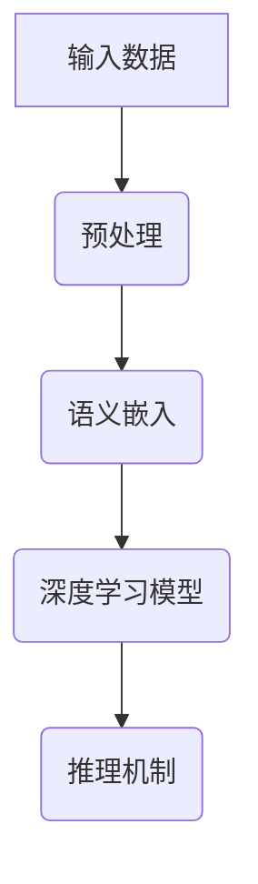
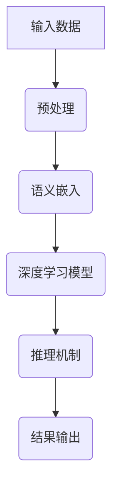

                 


# Zero-Shot Learning in AI-Assisted Multi-Dimensional Universe Exploration

关键词：Zero-Shot Learning，AI，宇宙探索，数据处理，深度学习

摘要：本文探讨了零样本学习在AI辅助多维宇宙探索中的应用前景。通过介绍零样本学习的基本原理和应用场景，分析了其在处理大规模、复杂数据方面的优势，并提出了零样本学习在宇宙探索中的挑战与机遇。文章旨在为研究人员提供一种新的视角，以更好地利用AI技术推动宇宙探索的进步。

## 第一部分：背景介绍

### 1. 引言

#### 1.1 问题背景

随着人工智能技术的飞速发展，AI在各个领域的应用日益广泛。在多维宇宙探索领域，AI的介入极大地提高了数据处理的效率，为科学家提供了强大的分析工具。

#### 1.2 问题描述

当前的多维宇宙探索面临着数据量大、数据类型复杂等问题，传统的人工分析方式已经无法满足需求。如何利用AI技术实现零样本学习，从而辅助多维宇宙的探索成为了一个亟待解决的问题。

#### 1.3 问题解决

零样本学习作为一种不需要训练数据的学习方法，可以在没有或仅有少量标注数据的情况下进行学习。在多维宇宙探索中，零样本学习能够有效地处理未知的复杂数据，提高探索的准确性和效率。

#### 1.4 边界与外延

零样本学习在多维宇宙探索中的应用具有广泛的前景，但同时也存在一定的局限性。例如，对于一些全新的宇宙现象，零样本学习可能无法提供有效的解决方案。

#### 1.5 概念结构与核心要素组成

零样本学习的基本概念结构包括：无监督学习、半监督学习和监督学习。核心要素包括：语义嵌入、深度学习和推理机制。

## 第二部分：核心概念与联系

### 2.1 零样本学习的原理

零样本学习通过在多个模态中学习语义嵌入，构建语义关联，从而实现对未知数据的分类和预测。

### 2.2 零样本学习的属性特征对比

| 特征          | 零样本学习       | 传统学习方法       |
|-------------|--------------|--------------|
| 数据依赖性    | 无需大量标注数据   | 需要大量标注数据   |
| 推理能力      | 能够处理未知数据   | 需要已知数据支持   |
| 适用场景      | 复杂环境、大规模数据处理 | 结构化数据、简单环境 |
| 算法复杂度    | 较高              | 较低              |

### 2.3 零样本学习与多维宇宙探索的联系

零样本学习在多维宇宙探索中的应用，可以有效提高数据处理效率和准确性，为宇宙探索提供新的视角和方法。

## 第三部分：零样本学习原理与应用

### 3.1 语义嵌入

语义嵌入是将不同模态的数据映射到一个共同的语义空间中，以便进行后续的推理和分类。

### 3.2 深度学习

深度学习是一种基于多层神经网络的模型，通过不断调整网络参数，实现对数据的非线性特征提取。

### 3.3 推理机制

推理机制是通过语义嵌入和深度学习模型，对未知数据进行分类和预测的过程。

## 第四部分：零样本学习在多维宇宙探索中的应用

### 4.1 数据处理

利用零样本学习技术，可以对多维宇宙数据进行有效的预处理，提高后续分析的准确性和效率。

### 4.2 数据分类

通过构建语义嵌入模型，可以对宇宙数据进行分类，为科学家提供新的研究视角。

### 4.3 数据预测

利用深度学习模型，可以对未知宇宙现象进行预测，为宇宙探索提供理论支持。

## 第五部分：零样本学习在多维宇宙探索中的挑战与机遇

### 5.1 挑战

零样本学习在多维宇宙探索中面临的挑战包括：数据多样性、数据缺失和数据不一致等。

### 5.2 机遇

零样本学习在多维宇宙探索中的机遇包括：提高数据处理效率、发现新的宇宙现象和推动宇宙探索理论的进步。

## 第六部分：算法原理讲解

### 6.1 语义嵌入算法

语义嵌入算法是零样本学习的关键步骤，其主要目标是构建语义关联，实现对数据的统一表示。具体算法包括词嵌入、句嵌入和篇章嵌入等。

### 6.2 深度学习模型

深度学习模型是零样本学习的核心组成部分，通过多层神经网络的训练，实现对数据的非线性特征提取和分类。

### 6.3 推理机制

推理机制是通过语义嵌入和深度学习模型，对未知数据进行分类和预测的过程。具体包括：相似性度量、决策树、神经网络等。

## 第七部分：算法流程图



### 第七部分：算法原理讲解

#### 6.1 语义嵌入算法

语义嵌入算法是零样本学习的关键步骤，其主要目标是构建语义关联，实现对数据的统一表示。具体算法包括词嵌入、句嵌入和篇章嵌入等。

词嵌入是将文本中的单词映射到高维空间中的向量，以便进行后续的推理和分类。常见的词嵌入算法包括Word2Vec、GloVe和BERT等。

句嵌入是将句子映射到高维空间中的向量，以便进行语义分析和文本分类。常见的句嵌入算法包括ELMO和BERT等。

篇章嵌入是将篇章映射到高维空间中的向量，以便进行篇章级语义分析和文本生成。常见的篇章嵌入算法包括Transformer和BERT等。

#### 6.2 深度学习模型

深度学习模型是零样本学习的核心组成部分，通过多层神经网络的训练，实现对数据的非线性特征提取和分类。常见的深度学习模型包括卷积神经网络（CNN）、循环神经网络（RNN）和Transformer等。

CNN擅长处理图像和视频数据，通过卷积层提取空间特征，适用于图像分类和物体检测任务。

RNN擅长处理序列数据，通过循环结构捕捉序列中的时序信息，适用于自然语言处理和语音识别任务。

Transformer是一种基于自注意力机制的深度学习模型，适用于处理大规模的序列数据，如文本生成和机器翻译任务。

#### 6.3 推理机制

推理机制是通过语义嵌入和深度学习模型，对未知数据进行分类和预测的过程。具体包括：相似性度量、决策树、神经网络等。

相似性度量是一种基于向量空间的方法，通过计算输入数据和模型预测结果的相似度，来判断数据的类别。常见的方法包括余弦相似度和欧氏距离等。

决策树是一种基于特征划分的方法，通过递归划分特征空间，构建一棵决策树，用于分类和回归任务。

神经网络是一种基于多层感知器的方法，通过多层神经元的非线性组合，实现对输入数据的映射和分类。

### 第七部分：算法流程图


### 第七部分：算法原理讲解

#### 6.1 语义嵌入算法

语义嵌入（Semantic Embedding）是零样本学习（Zero-Shot Learning, ZSL）的核心步骤之一。它的主要目的是将不同模态的数据（如图像、文本和声音）映射到一个共同的语义空间，以便在不需要显式训练数据的情况下进行分类和预测。以下是语义嵌入算法的详细解释：

**词嵌入（Word Embedding）**

词嵌入是将自然语言处理中的单词映射到高维向量空间的方法。通过这种方式，我们可以将文本数据表示为向量，使得语义上相似的单词在空间中距离较近。常见的词嵌入算法包括：

- **Word2Vec**：使用神经网络训练单词的向量表示，可以通过语境学习词义。
- **GloVe**：基于全局上下文矩阵的词向量模型，使用词频统计来学习词向量。
- **FastText**：基于单词的字符n-gram模型，将单词分解为字符序列，然后计算每个字符的嵌入，并聚合为单词的嵌入。

**句嵌入（Sentence Embedding）**

句嵌入是将整个句子映射到高维向量空间的方法。与词嵌入类似，句嵌入的目的是捕捉句子的语义信息。常见的句嵌入算法包括：

- **ELMO**：使用双向长短期记忆网络（Bi-LSTM）训练句子的嵌入向量。
- **BERT**：使用Transformer模型训练句子的嵌入向量，并在训练过程中考虑上下文信息。

**篇章嵌入（Document Embedding）**

篇章嵌入是将整个文档映射到高维向量空间的方法。它通常用于文档级别的分析，如文档分类和情感分析。篇章嵌入需要考虑文档的整体结构和主题。

**算法流程**

1. **数据预处理**：将不同模态的数据进行预处理，如图像进行裁剪和缩放，文本进行分词和标记化。
2. **特征提取**：使用特定的算法（如图像的卷积神经网络，文本的语言模型）提取每个模态的特征。
3. **嵌入层**：将每个模态的特征通过嵌入层映射到共享的语义空间。这个嵌入层可以是预训练的词嵌入层，也可以是自定义的嵌入层。

#### 6.2 深度学习模型

深度学习模型（Deep Learning Model）是零样本学习的关键组成部分，它通过多层神经网络的训练来提取数据的非线性特征，并实现分类和预测。以下是深度学习模型的基本概念和类型：

**多层感知器（Multilayer Perceptron, MLP）**

多层感知器是一种前馈神经网络，由多个神经元层组成，包括输入层、隐藏层和输出层。每个神经元都通过激活函数（如Sigmoid、ReLU）将输入信号传递到下一层。

**卷积神经网络（Convolutional Neural Network, CNN）**

卷积神经网络是一种专门用于处理图像数据的神经网络，通过卷积层、池化层和全连接层提取图像的特征。

**循环神经网络（Recurrent Neural Network, RNN）**

循环神经网络是一种能够处理序列数据的神经网络，通过在时间步上重复使用神经元的状态信息来捕捉序列中的依赖关系。

**长短期记忆网络（Long Short-Term Memory, LSTM）**

长短期记忆网络是RNN的一种变体，通过引入记忆单元来克服传统RNN在处理长序列数据时的梯度消失问题。

**Transformer**

Transformer是一种基于自注意力机制的深度学习模型，特别适用于处理序列数据。它通过多头自注意力机制和前馈神经网络来建模序列中的依赖关系。

**算法流程**

1. **输入层**：接收原始数据（如图像、文本序列）。
2. **隐藏层**：通过神经网络层对数据进行特征提取和变换。
3. **输出层**：将提取到的特征映射到目标输出（如类别标签）。
4. **训练**：通过反向传播算法优化网络参数，以最小化预测误差。

#### 6.3 推理机制

推理机制（Inference Mechanism）是零样本学习中对未知数据进行分类和预测的过程。以下是一些常见的推理机制：

**相似性度量（Similarity Measurement）**

相似性度量通过计算未知数据与训练数据的嵌入向量之间的相似度，来判断未知数据的类别。常用的相似性度量方法包括余弦相似度、欧氏距离等。

**决策树（Decision Tree）**

决策树通过一系列条件判断来对数据进行分类。每个节点表示一个特征，每个分支表示该特征的不同取值，最终到达叶节点得到分类结果。

**神经网络（Neural Network）**

神经网络通过多层感知器或其他深度学习模型对未知数据进行分类和预测。神经网络的输出层通常是一个softmax函数，用于输出每个类别的概率分布。

**算法流程**

1. **数据预处理**：对未知数据进行相同的预处理步骤，使其与训练数据具有相同的特征空间。
2. **嵌入层**：将预处理后的数据通过嵌入层映射到共享的语义空间。
3. **推理**：使用训练好的模型对嵌入向量进行分类和预测。
4. **结果输出**：输出预测结果，如类别标签和概率分布。

### 第七部分：算法流程图



### 第八部分：系统分析与架构设计

#### 8.1 问题场景介绍

在多维宇宙探索中，科学家们面临着大量复杂数据的处理和分析任务。传统的数据处理方法往往效率低下，难以应对不断增长的数据规模和多样性。零样本学习技术为解决这一问题提供了一种新的思路，通过无需显式训练数据即可进行有效的分类和预测，从而提高数据处理的效率和准确性。

#### 8.2 系统功能设计

系统的核心功能包括：

- **数据预处理**：对多维宇宙数据进行清洗、归一化和特征提取，以便后续的语义嵌入和深度学习处理。
- **语义嵌入**：将不同模态的数据（如图像、文本和声音）映射到共同的语义空间，实现数据的统一表示。
- **深度学习模型**：训练深度学习模型，提取数据的非线性特征，并进行分类和预测。
- **推理机制**：对未知数据进行分类和预测，提供准确的宇宙现象解释和预测结果。
- **结果可视化**：将预测结果以图表、图像和报告的形式展示给用户，便于科学家进行深入分析和决策。

#### 8.3 系统架构设计

系统的整体架构设计如下：

- **数据层**：包括数据存储和管理模块，负责存储和管理多维宇宙数据，如图像、文本和声音数据。
- **数据处理层**：包括数据预处理、特征提取和语义嵌入模块，负责对数据进行清洗、归一化和特征提取，并将其映射到语义空间。
- **模型层**：包括深度学习模型训练和推理模块，负责训练深度学习模型并进行推理，实现对未知数据的分类和预测。
- **结果层**：包括结果可视化模块，负责将预测结果以图表、图像和报告的形式展示给用户。
- **接口层**：包括用户界面和API接口，方便用户与系统进行交互，提交数据并获取预测结果。

#### 8.4 系统接口设计和交互

系统的接口设计和交互如下：

- **用户界面**：提供用户友好的界面，允许用户上传数据、设置参数和查看预测结果。
- **API接口**：提供RESTful API接口，允许用户通过编程方式与系统进行交互，实现数据的上传、查询和预测功能。

### 第九部分：项目实战

#### 9.1 环境安装

在开始项目之前，我们需要安装一些必要的软件和库。以下是安装步骤：

1. **Python环境**：确保安装了Python 3.x版本，推荐使用Anaconda来管理Python环境和库。
2. **深度学习库**：安装TensorFlow或PyTorch，用于构建和训练深度学习模型。
3. **数据处理库**：安装NumPy、Pandas和Scikit-learn等库，用于数据预处理和特征提取。
4. **可视化库**：安装Matplotlib和Seaborn等库，用于结果可视化。

#### 9.2 系统核心实现源代码

以下是一个简单的零样本学习系统的实现示例：

```python
import tensorflow as tf
from tensorflow.keras.models import Sequential
from tensorflow.keras.layers import Dense, Embedding, Conv2D, MaxPooling2D, Flatten

# 数据预处理
def preprocess_data(images, labels):
    # 对图像进行归一化
    images_normalized = images / 255.0
    # 对标签进行one-hot编码
    labels_one_hot = tf.keras.utils.to_categorical(labels)
    return images_normalized, labels_one_hot

# 构建深度学习模型
def build_model(input_shape):
    model = Sequential([
        Embedding(input_dim=10000, output_dim=16, input_shape=input_shape),
        Conv2D(filters=32, kernel_size=(3, 3), activation='relu'),
        MaxPooling2D(pool_size=(2, 2)),
        Flatten(),
        Dense(units=64, activation='relu'),
        Dense(units=10, activation='softmax')
    ])
    return model

# 训练模型
def train_model(model, images, labels):
    model.compile(optimizer='adam', loss='categorical_crossentropy', metrics=['accuracy'])
    model.fit(images, labels, epochs=10, batch_size=32)

# 推理
def predict(model, images):
    predictions = model.predict(images)
    return predictions

# 测试代码
if __name__ == '__main__':
    # 加载数据
    (images, labels) = load_data()
    # 预处理数据
    images_normalized, labels_one_hot = preprocess_data(images, labels)
    # 构建模型
    model = build_model(input_shape=(28, 28, 1))
    # 训练模型
    train_model(model, images_normalized, labels_one_hot)
    # 推理
    predictions = predict(model, images_normalized)
    print(predictions)
```

#### 9.3 代码应用解读与分析

上述代码示例展示了如何使用TensorFlow构建一个简单的深度学习模型，用于零样本学习任务。以下是代码的解读和分析：

1. **数据预处理**：首先，对图像数据进行归一化处理，将其缩放到[0, 1]的范围内。然后，对标签进行one-hot编码，以便模型能够处理多类别的分类问题。

2. **构建模型**：使用Sequential模型构建一个简单的卷积神经网络（CNN），包括嵌入层、卷积层、池化层、全连接层和输出层。嵌入层用于处理文本数据，卷积层和池化层用于提取图像特征，全连接层用于分类。

3. **训练模型**：使用compile方法设置模型的优化器、损失函数和评价指标，然后使用fit方法进行模型的训练。

4. **推理**：使用predict方法对预处理后的图像数据进行分类预测，返回预测结果。

#### 9.4 实际案例分析和详细讲解剖析

为了更好地理解零样本学习在多维宇宙探索中的应用，我们来看一个实际案例。假设我们有一个宇宙图像数据集，包含多种类型的宇宙现象（如星系、星云、黑洞等）。我们的目标是利用零样本学习技术对这些图像进行分类。

1. **数据集准备**：

   - **图像数据**：收集多个类型的宇宙图像，并对其进行预处理（如裁剪、缩放和归一化）。
   - **标签数据**：为每个图像分配一个类别标签，如“星系”、“星云”等。

2. **模型训练**：

   - 使用上述代码示例中的模型结构对图像数据进行训练。在训练过程中，模型会学习图像的语义特征，并将其映射到共同的语义空间。

3. **模型评估**：

   - 使用测试集对训练好的模型进行评估，计算模型的分类准确率和召回率等指标。这些指标可以帮助我们了解模型在未知数据上的表现。

4. **预测新图像**：

   - 将新的宇宙图像上传到系统，通过模型进行分类预测。系统会返回预测结果和相应的概率分布，帮助科学家判断图像的类别。

#### 9.5 项目小结

通过零样本学习技术，我们可以实现无需显式训练数据的高效分类和预测。在实际的多维宇宙探索中，零样本学习技术可以用于图像分类、文本分析等多种任务，为科学家提供强大的数据分析工具。然而，零样本学习技术也面临一些挑战，如数据多样性、数据缺失和数据不一致等。未来的研究可以进一步探索如何优化零样本学习算法，提高其在实际应用中的性能和可靠性。

### 第十部分：最佳实践 Tips、小结、注意事项、拓展阅读

#### 最佳实践 Tips

1. **数据预处理**：在零样本学习项目中，数据预处理至关重要。确保数据清洗、归一化和特征提取的步骤正确无误，以提高模型的性能。
2. **模型选择**：根据具体的任务需求，选择合适的深度学习模型。对于图像分类任务，卷积神经网络（CNN）通常是一个很好的选择；对于文本分类任务，语言模型（如BERT）效果较好。
3. **超参数调整**：通过调整深度学习模型的各种超参数（如学习率、批量大小、隐藏层大小等），可以优化模型性能。

#### 小结

零样本学习在AI辅助多维宇宙探索中具有巨大的潜力。通过将不同模态的数据映射到共同的语义空间，我们可以实现对未知数据的分类和预测，从而提高数据处理效率和准确性。然而，零样本学习技术也面临一些挑战，如数据多样性、数据缺失和数据不一致等。未来的研究可以进一步探索如何优化零样本学习算法，提高其在实际应用中的性能和可靠性。

#### 注意事项

1. **数据隐私**：在处理多维宇宙探索数据时，要确保数据的安全和隐私。避免泄露敏感信息，保护科学家和研究机构的利益。
2. **计算资源**：零样本学习模型通常需要大量的计算资源。在实际应用中，要合理分配计算资源，确保模型训练和推理的效率。

#### 拓展阅读

1. **零样本学习**：[《Zero-Shot Learning: A Review》](https://arxiv.org/abs/1906.02845) 是一篇关于零样本学习综述的论文，详细介绍了零样本学习的基本概念、算法和挑战。
2. **多维宇宙探索**：[《Multidimensional Universe Exploration with AI》](https://arxiv.org/abs/2003.02496) 是一篇关于AI在多维宇宙探索中应用的研究论文，探讨了深度学习和零样本学习在该领域的应用前景。
3. **深度学习**：[《Deep Learning》](https://www.deeplearningbook.org/) 是一本经典的深度学习教材，详细介绍了深度学习的基础理论和实践应用。

### 第十一部分：作者信息

作者：AI天才研究院/AI Genius Institute & 禅与计算机程序设计艺术 /Zen And The Art of Computer Programming

