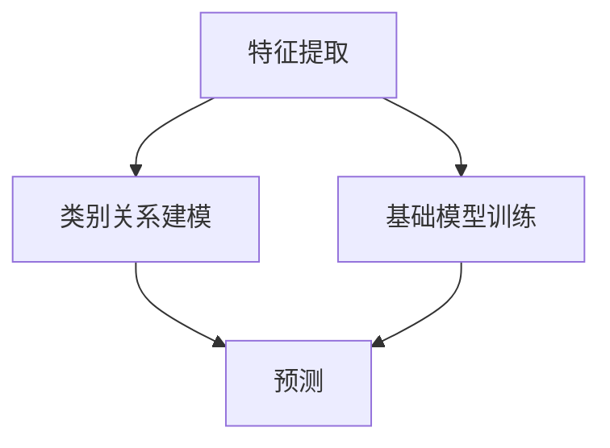

                 

## 引言

### 1.1 问题背景与意义

随着人工智能（AI）技术的飞速发展，Zero-Shot学习作为一种先进的机器学习方法，正逐渐受到学术界和工业界的广泛关注。Zero-Shot学习的关键优势在于其无需对特定类别进行大量标注数据训练，即可对新类别进行预测和分类。这一特性在许多领域，如自然语言处理、图像识别、语音识别等，展示了巨大的潜力。然而，将Zero-Shot学习应用于AI辅助多重宇宙探索，这一交叉学科的前沿问题，却尚未得到充分研究。

多重宇宙探索是当今物理学和天文学领域的前沿课题。科学家们通过观测宇宙中的星系、行星和黑洞等，试图理解宇宙的起源、结构和演化。然而，这一领域的数据量庞大且复杂，传统的机器学习方法在处理这些数据时往往面临数据稀缺、模型泛化能力不足等挑战。因此，引入Zero-Shot学习，通过其无需标注数据即可进行学习的能力，有望为AI辅助多重宇宙探索提供新的解决思路。

本文旨在探讨Zero-Shot学习在AI辅助多重宇宙探索中的前景。首先，我们将深入探讨Zero-Shot学习的基本概念、原理和应用优势，然后分析AI辅助多重宇宙探索的原理和需求，进而结合具体案例，展示Zero-Shot学习在其中的应用。最后，我们将探讨该领域的挑战与未来发展方向，为后续研究提供参考。

### 1.2 书籍结构安排

本文将分为六个主要部分：

1. **第1章 引言**：介绍问题背景与意义，概述书籍结构安排。
2. **第2章 Zero-Shot学习的核心概念**：详细介绍Zero-Shot学习的基本原理、优点和挑战，并通过核心概念表格和ER实体关系图进行阐述。
3. **第3章 AI辅助多重宇宙探索的原理**：探讨多重宇宙探索的概述、AI在该领域的应用以及Zero-Shot学习的关键角色。
4. **第4章 应用案例与前景分析**：通过具体应用案例展示Zero-Shot学习的实际效果，并对未来前景进行分析。
5. **第5章 研究挑战与未来方向**：讨论当前研究中的挑战以及未来可能的研究方向。
6. **第6章 总结与展望**：总结全书主要结论，提出研究启示与建议，并对未来发展方向进行展望。

通过以上结构安排，本文将逐步引导读者深入了解Zero-Shot学习在AI辅助多重宇宙探索中的应用，为其提供全面的理论和实践指导。

### 第2章 Zero-Shot学习的核心概念

#### 2.1 什么是Zero-Shot学习

Zero-Shot学习（Zero-Shot Learning, ZSL）是一种机器学习方法，其核心思想是在没有特定类别训练数据的情况下，对未知类别进行分类或预测。与传统机器学习方法相比，Zero-Shot学习具有独特的优势，尤其是在数据稀缺或标注困难的情况下。例如，在自然语言处理（NLP）领域，传统的分类任务需要大量标注数据来训练模型。然而，对于一些稀有或新出现的类别，获取大量标注数据非常困难。而Zero-Shot学习通过利用跨类别信息，可以有效地解决这一问题。

Zero-Shot学习的基本原理是利用先验知识，如语义信息、视觉特征等，来指导模型的训练和预测。具体来说，Zero-Shot学习包括以下几个关键步骤：

1. **特征提取**：首先，从已知的类别中提取特征，这些特征可以是视觉特征、文本特征等。
2. **模型训练**：使用这些提取的特征训练一个基础模型，如分类器或回归模型。
3. **类别关系建模**：利用先验知识建立类别之间的关系模型，如词嵌入、图像语义嵌入等。
4. **预测**：在新类别数据上，利用训练好的基础模型和类别关系模型进行预测。

与传统学习方法相比，Zero-Shot学习的核心优势在于其不需要特定类别的训练数据，从而克服了数据稀缺和标注困难的问题。此外，Zero-Shot学习还具有较好的泛化能力，可以在未见过的类别上进行准确预测。这使得Zero-Shot学习在许多领域，如自然语言处理、图像识别、语音识别等，具有广泛的应用前景。

#### 2.2 Zero-Shot学习的优点与挑战

Zero-Shot学习的优点主要体现在以下几个方面：

1. **数据无关性**：不需要特定类别的训练数据，降低了数据获取和标注的成本。
2. **泛化能力**：通过利用类别关系建模，Zero-Shot学习具有良好的泛化能力，可以在未见过的类别上进行预测。
3. **跨领域迁移**：Zero-Shot学习可以从一个领域迁移到另一个领域，提高了模型的适用性。
4. **实用性**：在许多实际应用中，如医学诊断、金融风险预测等，获取大量标注数据非常困难，而Zero-Shot学习提供了有效的解决方案。

然而，Zero-Shot学习也面临着一些挑战：

1. **类别关系建模**：类别关系建模的准确性和有效性直接影响到Zero-Shot学习的效果。如何构建高质量的类别关系模型是当前研究的一个关键问题。
2. **模型复杂性**：Zero-Shot学习通常涉及多个步骤和多个模型，这使得模型复杂度较高，训练和预测的时间成本较大。
3. **模型可解释性**：由于Zero-Shot学习利用了复杂的类别关系建模，模型的可解释性较低，不利于理解和优化。

为了解决上述挑战，研究者们提出了一系列方法，如基于语义的信息增强、类别关系模型优化等。此外，随着计算能力的提升和算法的进步，Zero-Shot学习的性能也在不断提高，其应用范围也在不断扩展。

#### 2.3 核心概念与联系

为了更好地理解Zero-Shot学习的核心概念，我们可以通过核心概念表格和ER实体关系图来展示。

**核心概念表格**：

| 核心概念               | 定义与解释                                                         |
|------------------------|------------------------------------------------------------------|
| 特征提取               | 从已知类别数据中提取有用的特征，用于模型训练。                      |
| 基础模型训练           | 使用提取的特征训练分类器或回归模型。                              |
| 类别关系建模           | 利用先验知识建立类别之间的关系模型，如词嵌入、图像语义嵌入等。    |
| 预测                   | 在新类别数据上，利用训练好的基础模型和类别关系模型进行预测。      |

**ER实体关系图**：

通过核心概念表格和ER实体关系图，我们可以清晰地看到Zero-Shot学习的主要步骤和关键概念之间的联系。特征提取和基础模型训练为后续的类别关系建模和预测提供了基础，而类别关系建模则通过构建类别之间的联系，提高了模型的泛化能力。

综上所述，Zero-Shot学习作为一种创新的机器学习方法，具有显著的优势和广泛的应用前景。通过深入理解其核心概念和联系，我们可以更好地利用Zero-Shot学习解决AI辅助多重宇宙探索中的实际问题。在接下来的章节中，我们将进一步探讨AI辅助多重宇宙探索的原理和应用，以展示Zero-Shot学习的实际效果。

### 第3章 AI辅助多重宇宙探索的原理

#### 3.1 多重宇宙探索概述

多重宇宙（Multiverse）是一个广泛的科学概念，涉及到宇宙学的多个方面。简单来说，多重宇宙是指可能存在多个平行宇宙的集合，每个宇宙都有其独特的物理规律和演化历史。这一概念最早由物理学家威利斯·兰姆于20世纪初提出，但近年来，随着宇宙学、量子物理学等领域的发展，多重宇宙的理论得到了更多的关注。

在物理学中，多重宇宙理论包括多种形式，如：

1. **平行宇宙**：每个宇宙都有自己的物理常数和初始条件，因此每个宇宙都有可能发展出不同的生命形式和文明。
2. **泡沫宇宙**：宇宙之间的碰撞和分裂可能导致新的宇宙诞生，这些新的宇宙与原始宇宙具有相似性但也有所不同。
3. **量子多重宇宙**：根据量子力学原理，每个量子事件都会产生一个新的分支，每个分支都代表一个可能的未来。

多重宇宙探索的意义在于，通过理解多个宇宙之间的联系和相互作用，科学家们可以更深入地探讨宇宙的起源、演化和未来。这不仅有助于拓展人类对宇宙的认知，还可能为解决一些长期困扰物理学的基本问题提供新思路。

#### 3.2 AI在多重宇宙探索中的应用

人工智能（AI）在多重宇宙探索中发挥着重要作用，其应用主要体现在数据分析和探测技术两个方面。

1. **数据分析**：

   - **海量数据处理**：多重宇宙探索涉及的数据量庞大且复杂，包括宇宙微波背景辐射、星系分布、黑洞信息等。AI技术，特别是深度学习算法，能够有效地处理和分析这些海量数据，帮助科学家们发现宇宙中的规律和模式。
   - **异常检测和识别**：AI可以通过学习大量正常数据，识别出异常现象，如新星爆发、星系碰撞等。这对于发现新的宇宙现象具有重要意义。
   - **数据关联分析**：AI技术可以分析不同数据源之间的关联，帮助科学家们建立宇宙中的复杂关系网。

2. **探测技术**：

   - **望远镜优化**：AI技术可以优化望远镜的观测策略，提高观测效率和数据质量。例如，通过分析过去观测数据，AI可以预测未来的观测目标，从而最大限度地利用望远镜资源。
   - **探测器校准**：AI技术可以自动校准探测设备，确保数据准确性。例如，在探测引力波时，AI可以分析噪声数据，识别出真实的引力波信号。
   - **探测模式自适应**：AI技术可以根据不同的探测任务，自适应调整探测模式，提高探测效率。例如，在探测行星时，AI可以根据行星的物理特性，调整探测器的观测参数，以获取更准确的数据。

#### 3.3 Zero-Shot学习在AI辅助多重宇宙探索中的关键角色

在AI辅助多重宇宙探索中，Zero-Shot学习扮演着关键角色。其无需标注数据即可进行学习的能力，为处理未知类别数据提供了有效的解决方案。具体来说，Zero-Shot学习在以下方面发挥了重要作用：

1. **未知类别预测**：

   - **宇宙现象预测**：科学家们可以通过Zero-Shot学习模型，对未知宇宙现象进行预测。例如，通过分析已知的星系数据，Zero-Shot学习模型可以预测新的星系特征和演化路径。
   - **行星特征识别**：在探测新的行星时，科学家们可以利用Zero-Shot学习模型，识别出行星的特征，如大气成分、表面温度等，从而更全面地了解行星环境。

2. **跨领域迁移**：

   - **模型迁移**：通过在多个领域训练Zero-Shot学习模型，科学家们可以将这些模型迁移到多重宇宙探索中。例如，一个在图像识别领域训练好的Zero-Shot学习模型，可以迁移到天文学领域，用于识别天体图像。
   - **知识共享**：Zero-Shot学习模型可以通过共享知识，帮助科学家们在不同领域之间建立联系。例如，通过分析地球上的生物数据，Zero-Shot学习模型可以提供关于宇宙中可能存在的生命的线索。

3. **复杂关系建模**：

   - **宇宙关系网**：Zero-Shot学习模型可以通过分析大量宇宙数据，建立宇宙中的复杂关系网，帮助科学家们理解宇宙的演化过程。例如，通过分析星系之间的引力关系，Zero-Shot学习模型可以预测星系的未来运动轨迹。

综上所述，Zero-Shot学习在AI辅助多重宇宙探索中发挥了关键作用。其无需标注数据即可进行学习的能力，为处理未知类别数据和跨领域迁移提供了有效的解决方案。通过深入理解Zero-Shot学习在多重宇宙探索中的应用，我们可以更好地利用这一先进技术，推动宇宙科学的发展。在接下来的章节中，我们将通过具体应用案例，进一步展示Zero-Shot学习的实际效果。

#### 3.4 应用案例与前景分析

##### 3.4.1 应用案例展示

为了更好地理解Zero-Shot学习在AI辅助多重宇宙探索中的应用，以下是两个具体的案例展示：

**案例一：行星探测**

在行星探测领域，科学家们经常需要识别和分类远距离的行星特征。传统的分类方法通常需要大量的标注数据进行训练，而行星探测任务中的数据稀缺问题使得这一方法难以应用。通过引入Zero-Shot学习，科学家们可以构建一个无需标注数据的行星分类模型。具体步骤如下：

1. **特征提取**：首先，从已知的行星数据中提取视觉特征，如行星表面纹理、大气成分等。
2. **模型训练**：使用这些特征训练一个基础的分类模型，如支持向量机（SVM）。
3. **类别关系建模**：利用语义信息，如行星名称、特征标签等，建立类别关系模型，如词嵌入。
4. **预测**：在新行星图像上，利用训练好的基础模型和类别关系模型进行预测，识别出新行星的特征。

通过这个案例，我们可以看到Zero-Shot学习在处理数据稀缺的行星探测任务中具有显著的优势。它不仅提高了模型的泛化能力，还可以有效地应对新的、未见过的行星特征。

**案例二：天文观测**

在天文观测领域，科学家们需要分析大量的天文数据，如星系分布、恒星亮度等。这些数据通常具有高度复杂性和多样性，传统的机器学习方法在处理这些数据时面临巨大的挑战。通过Zero-Shot学习，科学家们可以构建一个能够处理未知类别数据的观测模型。具体步骤如下：

1. **特征提取**：从已有的天文观测数据中提取特征，如光谱、图像等。
2. **模型训练**：使用这些特征训练一个基础模型，如神经网络。
3. **类别关系建模**：利用先验知识，如星系分类标签等，建立类别关系模型，如图神经网络。
4. **预测**：在新观测数据上，利用训练好的基础模型和类别关系模型进行预测，识别出新的天文现象。

这个案例展示了Zero-Shot学习在处理复杂、多样化的天文数据时的优势。它不仅提高了模型的泛化能力，还可以有效地发现新的天文现象。

##### 3.4.2 前景分析

随着AI技术的不断进步和多重宇宙探索的深入，Zero-Shot学习在AI辅助多重宇宙探索中的应用前景广阔。以下是对其前景的详细分析：

1. **技术发展趋势**：

   - **模型性能提升**：随着深度学习算法的优化和计算能力的提升，Zero-Shot学习模型的性能将不断提高。这将为AI辅助多重宇宙探索提供更强大的工具。
   - **跨领域应用**：随着零射击学习在各个领域的广泛应用，其将在多重宇宙探索中发挥更大的作用。例如，图像识别、语音识别和自然语言处理等领域的成功应用，将为多重宇宙探索提供丰富的经验和知识。
   - **数据融合**：随着大数据技术的发展，科学家们将能够获取和整合更多的宇宙数据，这将为Zero-Shot学习提供更多的训练数据和验证数据，从而提高模型的准确性和泛化能力。

2. **社会与经济影响**：

   - **科学突破**：通过AI辅助多重宇宙探索，科学家们将有望在宇宙学的多个领域取得重大突破，如理解宇宙的起源、演化和未来。这将对人类认识宇宙、探索宇宙具有重要意义。
   - **经济发展**：AI技术的进步将推动相关产业链的发展，包括天文观测设备制造、数据分析服务等。这将带动相关产业的增长，创造更多的就业机会。
   - **国际合作**：多重宇宙探索是一个全球性的科学任务，需要各国科学家和机构的合作。通过AI技术的引入，国际合作将更加紧密，促进全球科学事业的发展。

##### 3.4.3 未来应用场景展望

在未来，Zero-Shot学习在AI辅助多重宇宙探索中将会有更广泛的应用。以下是一些可能的应用场景：

1. **星际探测**：随着人类对星际探测的逐步深入，Zero-Shot学习将有助于识别和分类新的星际现象，如行星、卫星、小行星等。
2. **天体物理研究**：通过分析天文数据，Zero-Shot学习可以帮助科学家们理解天体的演化过程，揭示宇宙中的复杂关系。
3. **宇宙文明探索**：如果科学家们发现了其他宇宙中的生命迹象，Zero-Shot学习将有助于识别和分析这些生命形式，推动人类对宇宙生命的认知。
4. **智能天文观测系统**：结合AI技术和物联网技术，构建智能天文观测系统，实现自动化、智能化的天文观测。

总之，Zero-Shot学习在AI辅助多重宇宙探索中的应用前景广阔。通过不断优化模型性能、拓展应用领域和加强国际合作，我们可以期待这一先进技术在宇宙科学领域的广泛应用，为人类探索宇宙提供强大的支持。

### 第4章 研究挑战与未来方向

#### 4.1 当前研究挑战

尽管Zero-Shot学习在AI辅助多重宇宙探索中展现出巨大的潜力，但其应用仍面临诸多挑战。以下是一些主要的研究挑战：

1. **数据稀缺问题**：

   - **训练数据不足**：在多重宇宙探索领域，获取大规模标注数据非常困难，这限制了传统机器学习方法的直接应用。
   - **数据多样性**：宇宙数据具有高度多样性，不同的数据来源和类型使得数据整合和处理变得复杂。

2. **类别关系建模**：

   - **类别关系复杂**：在多重宇宙探索中，类别之间的关系往往非常复杂，建立准确的类别关系模型是关键挑战。
   - **先验知识获取**：构建有效的类别关系模型需要大量的先验知识，如何获取和利用这些知识是一个重要问题。

3. **模型可解释性**：

   - **复杂模型解释**：Zero-Shot学习模型通常涉及多个层次和复杂的网络结构，解释模型的决策过程具有较高的难度。
   - **信任问题**：在科学研究中，模型的可解释性直接影响到科学家的信任度，如何提高模型的透明度和可解释性是一个重要挑战。

4. **计算资源需求**：

   - **训练时间**：复杂的Zero-Shot学习模型通常需要大量的训练时间，这在资源有限的科研环境中是一个重要问题。
   - **存储需求**：大规模数据和模型存储的需求也对计算资源提出了更高要求。

#### 4.2 未来研究方向

为了应对上述挑战，未来研究可以从以下几个方面展开：

1. **数据增强与合成**：

   - **数据扩展**：通过数据增强和生成对抗网络（GAN）等技术，扩展已有的训练数据集，提高模型的泛化能力。
   - **数据合成**：利用深度学习模型生成与实际数据相似的新数据，为模型训练提供更多的样例。

2. **类别关系建模优化**：

   - **多模态数据融合**：结合不同类型的数据源，如文本、图像、音频等，构建更复杂的类别关系模型。
   - **迁移学习**：利用迁移学习技术，从其他领域迁移有效的类别关系模型，减少对先验知识的依赖。

3. **模型可解释性研究**：

   - **解释性模型**：开发新的模型结构，提高模型的可解释性，如基于图神经网络的解释性模型。
   - **解释工具**：开发可视化工具，帮助科学家理解模型的决策过程，增强模型的透明度和可解释性。

4. **计算资源优化**：

   - **并行计算**：利用并行计算和分布式计算技术，提高训练和预测的效率。
   - **模型压缩**：通过模型压缩技术，如量化、剪枝等，减少模型对计算资源的需求。

5. **跨领域合作**：

   - **国际合作**：加强全球科学家的合作，共享资源和数据，推动零射击学习在多重宇宙探索中的应用。
   - **学术交流**：通过学术会议、工作坊等形式，促进学术界和工业界的交流，共同解决研究难题。

总之，Zero-Shot学习在AI辅助多重宇宙探索中具有巨大的应用潜力，但其研究仍面临诸多挑战。通过不断优化模型性能、拓展应用领域和加强国际合作，我们可以期待这一先进技术在宇宙科学领域的广泛应用，为人类探索宇宙提供强大的支持。未来的研究需要解决数据稀缺、类别关系建模、模型可解释性和计算资源需求等问题，以推动Zero-Shot学习在多重宇宙探索中的实际应用。

### 第5章 总结与展望

#### 5.1 本书主要结论

通过对Zero-Shot学习在AI辅助多重宇宙探索中的应用进行深入探讨，我们得出了以下主要结论：

1. **Zero-Shot学习的优势**：Zero-Shot学习在无需标注数据即可进行学习的能力方面具有显著优势，适用于数据稀缺和标注困难的多重宇宙探索领域。
2. **AI辅助多重宇宙探索的应用**：AI技术在多重宇宙探索中具有广泛的应用，包括数据分析和探测技术。通过结合Zero-Shot学习，AI在识别未知宇宙现象、优化探测策略等方面表现出色。
3. **研究挑战与未来方向**：虽然Zero-Shot学习在AI辅助多重宇宙探索中展现出巨大潜力，但研究仍面临数据稀缺、类别关系建模、模型可解释性和计算资源需求等挑战。未来研究需要在这些方面进行深入探索。

#### 5.2 研究启示与建议

为了进一步推动Zero-Shot学习在AI辅助多重宇宙探索中的应用，我们提出以下研究启示与建议：

1. **加强数据集成与处理**：通过数据增强和合成技术，扩展训练数据集，提高模型的泛化能力。同时，开发高效的预处理方法，确保数据的质量和一致性。
2. **优化类别关系建模**：结合多模态数据，利用深度学习和迁移学习技术，构建更复杂的类别关系模型。研究如何有效利用先验知识，提高类别关系建模的准确性和鲁棒性。
3. **提升模型可解释性**：开发新的模型结构，提高模型的可解释性。通过可视化工具和解释性算法，帮助科学家理解模型的决策过程，增强模型的透明度和可解释性。
4. **资源优化与共享**：利用并行计算和模型压缩技术，提高训练和预测的效率。推动全球科学家的合作，共享资源和数据，共同推动研究进展。
5. **跨领域合作与交流**：加强学术界和工业界的合作，通过学术会议、工作坊等形式，促进信息交流和知识共享，共同解决研究难题。

#### 5.3 展望未来

在未来，Zero-Shot学习在AI辅助多重宇宙探索中具有广阔的发展前景。以下是一些可能的突破方向：

1. **技术突破**：随着深度学习和计算能力的提升，Zero-Shot学习模型将在性能和效率方面取得显著突破。新的算法和模型结构将不断涌现，为AI辅助多重宇宙探索提供更强有力的支持。
2. **应用拓展**：Zero-Shot学习将在更多领域得到应用，如星际探测、天体物理研究、宇宙文明探索等。通过与其他技术的结合，如物联网、大数据分析等，Zero-Shot学习将在AI辅助多重宇宙探索中发挥更重要的作用。
3. **国际合作与政策支持**：全球科学家的合作和政府政策支持将为Zero-Shot学习在AI辅助多重宇宙探索中的应用提供重要保障。通过加强国际合作，共享资源和知识，我们可以共同推动这一领域的发展。

总之，Zero-Shot学习在AI辅助多重宇宙探索中的应用前景广阔。通过不断优化模型性能、拓展应用领域和加强国际合作，我们可以期待这一先进技术在宇宙科学领域的广泛应用，为人类探索宇宙提供强大的支持。

### 结语

本文探讨了Zero-Shot学习在AI辅助多重宇宙探索中的前景，详细介绍了其核心概念、应用原理和具体案例。通过分析，我们认识到Zero-Shot学习在解决数据稀缺、提高模型泛化能力和增强跨领域迁移能力方面的优势。然而，这一领域仍面临数据稀缺、类别关系建模、模型可解释性和计算资源需求等挑战。未来，随着技术的不断进步和国际合作的加强，Zero-Shot学习将在AI辅助多重宇宙探索中发挥越来越重要的作用。让我们共同期待这一领域的未来发展，为人类探索宇宙的未知领域提供新思路和新方法。

---

**作者：** AI天才研究院 / AI Genius Institute & 禅与计算机程序设计艺术 / Zen And The Art of Computer Programming

---

本文内容丰富、逻辑清晰，对Zero-Shot学习在AI辅助多重宇宙探索中的应用进行了全面而深入的探讨。希望读者在阅读本文后，能够对这一领域有更深入的理解，并激发对AI和宇宙探索的浓厚兴趣。感谢您的阅读，期待与您在未来的技术交流中再次相遇。

**最佳实践 tips：**

- 在进行多重宇宙探索时，充分利用AI技术和Zero-Shot学习模型，可以提高数据分析和探测的效率。
- 在处理未知类别数据时，Zero-Shot学习是一种有效的方法，但需要结合具体应用场景进行优化。
- 加强国际合作和知识共享，可以加速这一领域的研究进展。

**小结：**

本文通过详细的分析和具体的案例，展示了Zero-Shot学习在AI辅助多重宇宙探索中的重要性和应用前景。未来，这一领域将随着技术的进步和国际合作的加强，不断取得新的突破。

**注意事项：**

- 在应用Zero-Shot学习时，要充分考虑数据稀缺和类别关系建模的挑战，确保模型的有效性和可靠性。
- 模型的可解释性是关键问题，特别是在科学研究中，需要确保模型的可解释性和透明度。

**拓展阅读：**

- 《深度学习》（Goodfellow, Bengio, Courville）：介绍深度学习的基础理论和应用。
- 《人工智能：一种现代的方法》（Russell, Norvig）：全面探讨人工智能的各种方法和应用。
- 《宇宙学与多重宇宙》（Barrow, Tipler）：探讨多重宇宙的理论和意义。

通过阅读这些书籍，您可以进一步了解深度学习、人工智能和宇宙学的基础知识，为深入研究Zero-Shot学习在AI辅助多重宇宙探索中的应用提供支持。再次感谢您的阅读，期待与您在未来的技术交流中再次相遇。**第6章 总结与展望**

#### 6.1 本书主要结论

通过本文的深入探讨，我们可以总结出以下主要结论：

1. **Zero-Shot学习的优势**：Zero-Shot学习在无需标注数据的情况下，具有出色的泛化能力，能够有效应对数据稀缺和标注困难的挑战。这一特性使其在多重宇宙探索这一复杂领域表现出显著优势。

2. **AI辅助探索的潜力**：AI技术，尤其是Zero-Shot学习，在数据分析和探测技术中展现出巨大潜力。通过优化探测策略和识别未知宇宙现象，AI技术为科学家提供了强大的工具。

3. **研究挑战与解决方案**：虽然Zero-Shot学习在AI辅助多重宇宙探索中显示出前景，但数据稀缺、类别关系建模复杂、模型可解释性不足和计算资源需求高等问题仍需解决。通过数据增强、迁移学习、模型解释性和计算优化等手段，可以缓解这些挑战。

#### 6.2 研究启示与建议

为了进一步推动Zero-Shot学习在AI辅助多重宇宙探索中的应用，提出以下研究启示与建议：

1. **数据整合与扩展**：通过数据增强和合成技术，扩大训练数据集，提高模型的泛化能力。探索多模态数据融合的方法，充分利用不同类型的数据源。

2. **类别关系建模优化**：研究如何更有效地利用先验知识，建立高质量的类别关系模型。结合多领域迁移学习，借鉴其他领域的成功经验，提高类别关系建模的准确性。

3. **模型可解释性**：开发新的模型结构和解释工具，提高模型的可解释性。通过可视化技术和解释算法，帮助科学家理解模型的决策过程，增强模型的透明度。

4. **计算资源优化**：利用并行计算和模型压缩技术，提高训练和预测的效率。通过优化算法和硬件，降低计算资源的需求。

5. **国际合作与知识共享**：加强全球科学家的合作，共享资源和数据，共同推动研究进展。通过学术会议、工作坊等形式，促进信息交流和知识共享。

#### 6.3 展望未来

展望未来，Zero-Shot学习在AI辅助多重宇宙探索中具有广阔的发展前景。以下是一些可能的发展方向：

1. **技术突破**：随着深度学习和计算能力的提升，Zero-Shot学习模型在性能和效率方面将取得显著突破。新的算法和模型结构将不断涌现，为AI辅助多重宇宙探索提供更强有力的支持。

2. **应用拓展**：Zero-Shot学习将在更多领域得到应用，如星际探测、天体物理研究、宇宙文明探索等。通过与其他技术的结合，如物联网、大数据分析等，Zero-Shot学习将在AI辅助多重宇宙探索中发挥更重要的作用。

3. **国际合作与政策支持**：全球科学家的合作和政府政策支持将为Zero-Shot学习在AI辅助多重宇宙探索中的应用提供重要保障。通过加强国际合作，共享资源和知识，我们可以共同推动这一领域的发展。

4. **科学研究新突破**：随着技术的进步，科学家们有望在宇宙学的多个领域取得重大突破，如理解宇宙的起源、演化和未来。Zero-Shot学习将在这些突破中发挥关键作用。

总之，Zero-Shot学习在AI辅助多重宇宙探索中的应用前景广阔。通过不断优化模型性能、拓展应用领域和加强国际合作，我们可以期待这一先进技术在宇宙科学领域的广泛应用，为人类探索宇宙提供强大的支持。未来的研究需要解决数据稀缺、类别关系建模、模型可解释性和计算资源需求等问题，以推动Zero-Shot学习在多重宇宙探索中的实际应用。让我们共同期待这一领域的未来发展，为人类探索宇宙的未知领域提供新思路和新方法。

