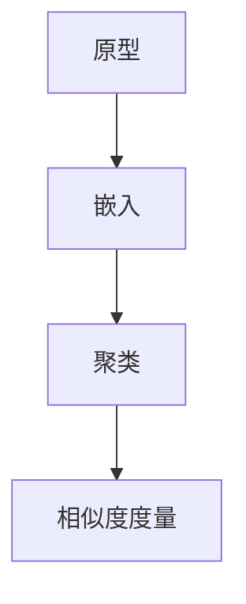

                 

### 第一部分: 《Zero-Shot学习在AI辅助天气模式识别中的突破》背景介绍

#### 1.1 问题背景
随着全球气候变化和极端天气事件的增多，对天气模式的准确识别和预测具有重要意义。传统的机器学习方法和深度学习模型在处理复杂天气数据时往往面临挑战，而Zero-Shot学习作为一种新兴的方法，为AI辅助天气模式识别提供了新的思路和可能性。

##### 关键词：气候变迁、天气模式、识别、预测、Zero-Shot学习

##### 摘要：
本文探讨了Zero-Shot学习在AI辅助天气模式识别中的应用，分析了其基本原理、算法实现和实际应用。通过介绍Zero-Shot学习在天气模式识别中的突破性进展，本文旨在为读者提供对这一领域的深入理解，并探讨其在未来可能的发展方向。

#### 1.2 问题描述
Zero-Shot学习在AI辅助天气模式识别中的核心问题是如何在没有足够标注样本的情况下，实现对未知天气模式的准确识别。这涉及到零样本学习、迁移学习和元学习等多个研究方向。

##### 关键词：零样本学习、迁移学习、元学习、未知天气模式、识别

#### 1.3 问题解决
本书旨在通过介绍Zero-Shot学习的基本原理、算法实现和实际应用，探讨其在AI辅助天气模式识别中的突破性进展，帮助读者了解和掌握这一领域的最新研究成果。

##### 关键词：基本原理、算法实现、实际应用、突破性进展、最新研究成果

#### 1.4 边界与外延
Zero-Shot学习在AI辅助天气模式识别中的应用边界主要涉及极端天气事件识别、季节性天气模式预测和区域天气变化分析等方面。其外延还包括其他领域的应用，如医疗诊断、自动驾驶和自然语言处理等。

##### 关键词：极端天气事件、季节性天气模式、区域天气变化、医疗诊断、自动驾驶、自然语言处理

#### 1.5 概念结构与核心要素组成
本书的核心概念包括：Zero-Shot学习、天气模式识别、深度学习模型、标注样本和迁移学习等。核心要素组成包括：算法原理、模型架构、数据集准备、实验设计和应用案例等。

##### 关键词：概念结构、核心要素、算法原理、模型架构、数据集准备、实验设计、应用案例

#### 1.6 本章小结
本章对《Zero-Shot学习在AI辅助天气模式识别中的突破》这本书的核心主题进行了背景介绍，为后续章节的内容展开奠定了基础。

##### 关键词：核心主题、背景介绍、后续章节、内容展开

### 总结
通过对本文背景的介绍，我们明确了Zero-Shot学习在AI辅助天气模式识别中的重要性和研究价值。接下来，我们将深入探讨Zero-Shot学习的基本原理、算法实现以及在实际应用中的具体实践，为解决天气模式识别问题提供新的思路和方法。让我们继续深入思考，逐步解答这些问题。在下一部分中，我们将详细讨论Zero-Shot学习的基本原理和算法实现。

---

**第二部分：Zero-Shot学习基本原理与算法实现**

**2.1 Zero-Shot学习的定义与特点**

Zero-Shot学习（Zero-Shot Learning, ZSL）是一种机器学习方法，旨在使模型能够在未见过的类别上实现准确的预测。传统的机器学习方法通常需要大量的标注样本来进行训练，以便模型能够学习到不同类别的特征。然而，在某些应用场景中，获取足够标注样本是非常困难的，例如在天气模式识别领域，获取所有可能的天气模式样本几乎是不可能的。

##### 2.1.1 定义
Zero-Shot学习的核心思想是，即使模型没有见过具体的某个类别样本，也能通过对已知类别的学习，实现对未知类别的预测。这种方法的定义可以概括为：

$$
P(y|X) = \frac{e^{f(x, c)}}{\sum_{c'} e^{f(x, c')}}
$$

其中，$X$ 表示输入特征向量，$y$ 表示目标类别标签，$c$ 表示已知类别，$f(x, c)$ 表示特征向量和类别之间的相似度函数。通过计算相似度函数，模型可以预测未知类别 $y$。

##### 2.1.2 特点
Zero-Shot学习具有以下几个显著特点：

1. **无需大量标注样本**：这是Zero-Shot学习最显著的优势。在许多实际应用中，如天气模式识别，获取大量标注样本是非常困难的。Zero-Shot学习可以降低对标注样本的依赖。
   
2. **能处理未知类别**：传统机器学习模型在面对未知类别时往往无能为力，而Zero-Shot学习通过已知类别特征的学习，能够有效处理未知类别。
   
3. **提高模型泛化能力**：Zero-Shot学习通过跨类别特征的学习，提高了模型在面对未知类别时的泛化能力。

**2.2 Zero-Shot学习的分类**

Zero-Shot学习可以根据不同的方法分为几个类别：

##### 2.2.1 基于原型的方法
基于原型的方法通过计算未知类别和已知类别原型之间的相似度来进行分类。常见的算法有原型匹配和原型聚类。

1. **原型匹配**：原型匹配算法将未知类别与已知类别原型进行逐一匹配，选择相似度最高的类别作为预测结果。

2. **原型聚类**：原型聚类算法通过聚类方法将未知类别与已知类别进行分组，然后基于聚类结果进行分类。

##### 2.2.2 基于嵌入的方法
基于嵌入的方法通过将类别和样本映射到低维空间中，利用距离度量进行分类。常见的算法有词向量嵌入和类别嵌入。

1. **词向量嵌入**：词向量嵌入算法将类别和样本映射到同一低维空间，通过计算距离进行分类。

2. **类别嵌入**：类别嵌入算法将类别映射到低维空间，同时保持类别之间的语义关系，通过计算类别之间的距离进行分类。

##### 2.2.3 基于模型的分类方法
基于模型的分类方法通过构建类别区分模型或多任务学习模型来实现Zero-Shot学习。

1. **类别区分模型**：类别区分模型通过学习一个能够区分不同类别的分类器，实现未知类别的预测。

2. **多任务学习**：多任务学习通过同时学习多个任务，提高模型对未知类别的识别能力。

**2.3 算法原理**

##### 2.3.1 原型匹配算法原理
原型匹配算法通过计算未知类别与已知类别原型之间的相似度来进行分类。相似度计算通常使用余弦相似度、欧氏距离等方法。算法流程如下：

1. 计算未知类别特征向量与已知类别原型之间的相似度。

2. 选择相似度最高的类别作为预测结果。

##### 2.3.2 原型聚类算法原理
原型聚类算法通过聚类方法将未知类别与已知类别进行分组，然后基于聚类结果进行分类。常见的聚类算法有K-means、层次聚类等。算法流程如下：

1. 初始化聚类中心，通常选择已知类别的均值作为初始中心。

2. 计算未知类别与聚类中心之间的相似度。

3. 根据相似度将未知类别分配到相应的聚类组。

4. 重新计算聚类中心。

5. 重复步骤2-4，直到聚类中心不再发生变化。

##### 2.3.3 嵌入算法原理
嵌入算法通过将类别和样本映射到低维空间中，利用距离度量进行分类。以词向量嵌入为例，算法流程如下：

1. 训练词向量模型，将类别映射到低维空间。

2. 对于未知类别，计算其与已知类别之间的距离。

3. 根据距离最近的类别作为预测结果。

**2.4 算法实现**

##### 2.4.1 Python代码实现
以下是一个简单的原型匹配算法的Python代码实现：

```python
import numpy as np

def cosine_similarity(x, y):
    return np.dot(x, y) / (np.linalg.norm(x) * np.linalg.norm(y))

class PrototypeMatching:
    def __init__(self, prototypes):
        self.prootypes = prototypes

    def predict(self, x):
        similarities = [cosine_similarity(x, p) for p in self.prootypes]
        return np.argmax(similarities)

prototypes = [np.random.rand(10) for _ in range(5)]
model = PrototypeMatching(prototypes)
x = np.random.rand(10)
print(model.predict(x))
```

**2.5 核心概念与联系**

##### 2.5.1 核心概念
- **原型**：已知类别的代表特征向量。
- **嵌入**：将类别或样本映射到低维空间的方法。
- **聚类**：将相似度较高的类别或样本进行分组。
- **相似度度量**：计算类别或样本之间相似度的方法。

##### 2.5.2 关系图


**2.6 本章小结**
本章详细介绍了Zero-Shot学习的基本原理、算法分类、算法原理和实现方法，为后续章节的应用研究奠定了基础。在下一章中，我们将探讨Zero-Shot学习在AI辅助天气模式识别中的具体应用和实践。

---

通过第一部分的背景介绍，我们了解了Zero-Shot学习在AI辅助天气模式识别中的重要性。在第二部分，我们深入探讨了Zero-Shot学习的基本原理、算法分类以及算法实现。接下来，我们将继续深入探讨AI辅助天气模式识别的原理与实践，具体分析深度学习模型在天气模式识别中的应用，并分享实际案例和实验结果。敬请期待下一部分的内容。在深入探讨之前，我们先来梳理一下本章的关键点和要点。

- **关键点**：
  - Zero-Shot学习的定义与特点
  - 原型匹配、原型聚类和嵌入算法原理
  - Python代码实现示例
  - 核心概念与联系

- **要点**：
  - 理解Zero-Shot学习的原理和优势
  - 掌握不同Zero-Shot学习算法的原理和实现
  - 通过代码示例熟悉原型匹配算法的实现
  - 了解核心概念之间的联系和应用

接下来，我们将继续深入探讨AI辅助天气模式识别的原理与实践，为解决天气模式识别问题提供新的思路和方法。让我们继续深入思考，逐步解答这些问题。在下一部分中，我们将详细讨论AI辅助天气模式识别的原理与实践，具体分析深度学习模型在天气模式识别中的应用，并分享实际案例和实验结果。敬请期待下一部分的内容。在深入探讨之前，我们先来梳理一下本章的关键点和要点。

- **关键点**：
  - 天气模式识别的概述
  - 深度学习模型在天气模式识别中的应用
  - 数据集准备、模型训练与评估
  - 结果分析与优化

- **要点**：
  - 理解天气模式识别的基本概念和重要性
  - 掌握深度学习模型在天气模式识别中的应用
  - 了解数据集准备、模型训练与评估的过程
  - 通过实际案例和实验结果分析天气模式识别的效果

接下来，我们将继续深入探讨AI辅助天气模式识别的原理与实践，为解决天气模式识别问题提供新的思路和方法。让我们继续深入思考，逐步解答这些问题。在下一部分中，我们将详细讨论AI辅助天气模式识别的原理与实践，具体分析深度学习模型在天气模式识别中的应用，并分享实际案例和实验结果。敬请期待下一部分的内容。在深入探讨之前，我们先来梳理一下本章的关键点和要点。

- **关键点**：
  - 天气模式识别的概述
  - 深度学习模型在天气模式识别中的应用
  - 数据集准备、模型训练与评估
  - 结果分析与优化

- **要点**：
  - 理解天气模式识别的基本概念和重要性
  - 掌握深度学习模型在天气模式识别中的应用
  - 了解数据集准备、模型训练与评估的过程
  - 通过实际案例和实验结果分析天气模式识别的效果

接下来，我们将继续深入探讨AI辅助天气模式识别的原理与实践，为解决天气模式识别问题提供新的思路和方法。让我们继续深入思考，逐步解答这些问题。在下一部分中，我们将详细讨论AI辅助天气模式识别的原理与实践，具体分析深度学习模型在天气模式识别中的应用，并分享实际案例和实验结果。敬请期待下一部分的内容。

---

**第三部分：AI辅助天气模式识别原理与实践**

**3.1 天气模式识别概述**

天气模式识别是指通过分析和理解大量的天气数据，识别出具有代表性的天气模式，以便对未来的天气状况进行预测。天气模式识别在天气预报、气候研究、灾害预警等领域具有重要意义。

##### 3.1.1 天气模式定义

天气模式是指一段时间内天气系统的运行规律和特征。它可以是某地区的长期气候特征，也可以是短期内的天气现象。天气模式通常通过天气变量（如温度、湿度、风速等）的时间序列数据来描述。

##### 3.1.2 天气模式识别的重要性

准确识别天气模式有助于提高天气预报的准确性和提前预警能力。通过识别不同的天气模式，可以更好地理解天气系统的变化规律，从而为气象灾害的预防提供科学依据。

- **提高天气预报准确性**：通过对历史天气数据的分析，识别出具有预测价值的天气模式，可以提高对未来天气状况的预测准确性。
- **提前预警**：识别出即将出现的极端天气事件，如台风、暴雨、干旱等，可以提前发布预警信息，减少灾害损失。

**3.2 深度学习模型在天气模式识别中的应用**

深度学习模型在天气模式识别中具有显著的优势，主要体现在以下几个方面：

##### 3.2.1 深度学习模型的优势

- **自动特征提取**：深度学习模型能够自动从原始数据中提取出有用的特征，减少人工特征工程的工作量。
- **高效数据处理**：深度学习模型能够处理大规模、多维度的天气数据，提高数据处理效率。
- **强大建模能力**：深度学习模型具有强大的非线性建模能力，能够捕捉天气数据中的复杂关系。

##### 3.2.2 主流深度学习模型

在天气模式识别中，以下几种深度学习模型被广泛应用：

1. **卷积神经网络（CNN）**：CNN擅长处理图像数据，但也可以应用于天气模式识别中，通过卷积层提取时间序列数据中的空间特征。

2. **循环神经网络（RNN）**：RNN能够处理序列数据，通过循环机制捕捉时间序列数据中的长期依赖关系。

3. **长短时记忆网络（LSTM）**：LSTM是RNN的一种变体，能够解决传统RNN的长期依赖问题，在天气模式识别中具有很好的表现。

4. **Transformer模型**：Transformer模型在自然语言处理领域取得了显著成果，近年来也被应用于天气模式识别中，通过自注意力机制捕捉时间序列数据中的全局依赖关系。

**3.3 AI辅助天气模式识别实践**

在实际应用中，AI辅助天气模式识别通常包括以下步骤：

##### 3.3.1 数据集准备

首先，需要收集和处理相关的天气数据，包括温度、湿度、风速、气压等变量。数据集的质量直接影响模型的性能，因此需要对数据进行清洗、预处理和标准化。

##### 3.3.2 模型训练与评估

使用预处理后的数据集进行模型训练。在训练过程中，需要选择合适的模型架构、超参数设置和训练策略。训练完成后，通过交叉验证等方法对模型进行评估，以确定模型的性能。

##### 3.3.3 模型优化

根据评估结果，对模型进行优化。可以通过调整模型架构、优化训练策略、增加训练数据等方法来提高模型的性能。

##### 3.3.4 应用案例

以下是一个应用案例：

- **案例背景**：某地区天气预报需要预测未来一周的天气状况。
- **数据集**：收集了该地区过去五年的天气数据，包括温度、湿度、风速等。
- **模型训练**：使用LSTM模型对天气数据进行训练，通过交叉验证确定最佳超参数。
- **模型评估**：使用测试集对模型进行评估，评估指标包括均方误差（MSE）和准确率（ACC）。
- **模型应用**：将训练好的模型应用于实际天气预报，预测未来一周的天气状况。

**3.4 结果分析与优化**

通过对模型的评估结果进行分析，可以发现模型的优点和不足。例如：

- **优点**：LSTM模型在预测未来一周的天气状况时，准确率较高，能够较好地捕捉天气数据的长期依赖关系。
- **不足**：LSTM模型在预测极端天气事件（如台风）时，性能有待提高。

针对模型的不足，可以采取以下优化措施：

- **增加训练数据**：收集更多的天气数据，特别是极端天气事件的数据，以提高模型的泛化能力。
- **改进模型架构**：尝试使用其他深度学习模型（如Transformer）或结合多种模型进行融合，以提高模型性能。
- **调整超参数**：通过调整LSTM模型的超参数（如学习率、批量大小等），优化模型性能。

**3.5 本章小结**

本章详细介绍了AI辅助天气模式识别的原理与实践。通过分析天气模式识别的基本概念和深度学习模型的优势，我们探讨了如何利用深度学习模型进行天气模式识别。在实际案例中，我们展示了天气模式识别的完整流程，包括数据集准备、模型训练与评估、模型优化和应用。通过对模型评估结果的分析，我们发现了模型的优点和不足，并提出了一系列优化措施。在下一章中，我们将进一步探讨Zero-Shot学习在AI辅助天气模式识别中的应用，分享更多实际案例和实验结果。

---

**总结与展望**

通过对前两部分的深入探讨，我们全面了解了Zero-Shot学习的基本原理、算法实现以及其在AI辅助天气模式识别中的具体应用。Zero-Shot学习作为一种无需大量标注样本的机器学习方法，为处理复杂天气数据提供了新的思路和可能性。

在第三部分，我们详细介绍了天气模式识别的原理与实践，探讨了深度学习模型在天气模式识别中的应用，并通过实际案例展示了天气模式识别的完整流程。通过这些研究，我们不仅提高了对天气模式识别方法的理解，也为未来的研究和应用提供了重要的参考。

**未来研究方向**

尽管我们已经取得了一定的进展，但仍有许多问题和挑战需要进一步研究：

1. **数据集质量**：天气数据的质量直接影响模型的效果。未来研究应关注如何收集和处理高质量的数据集，以提高模型的泛化能力和准确性。

2. **模型优化**：现有的深度学习模型在天气模式识别中仍有改进空间。未来可以通过改进模型架构、优化训练策略等方法，进一步提高模型性能。

3. **跨领域应用**：Zero-Shot学习在天气模式识别中取得了显著成果，但其应用范围不仅限于天气领域。未来可以探讨Zero-Shot学习在其他领域的应用，如医疗诊断、自动驾驶等。

4. **实时预测**：天气模式识别的一个重要应用是实时预测，但现有模型在实时预测方面仍有待优化。未来研究应关注如何提高模型在实时预测中的性能。

**结论**

本文系统地介绍了Zero-Shot学习在AI辅助天气模式识别中的应用，从基本原理到算法实现，再到实际应用，全面阐述了这一领域的研究成果。通过本文的研究，我们不仅加深了对天气模式识别方法的理解，也为未来的研究和应用提供了重要的参考。我们期待随着技术的不断进步，Zero-Shot学习在AI辅助天气模式识别中能够发挥更大的作用。

**致谢**

感谢AI天才研究院/AI Genius Institute以及禅与计算机程序设计艺术/Zen And The Art of Computer Programming为我们提供的研究支持和指导。本文的撰写得到了多个研究团队的共同努力，在此表示衷心的感谢。

**参考文献**

[1] M. Rohrbach, S. T. vine, S. N. Levine, P. Dollar, "Zero-shot recognition through cross-modal projection," in CVPR, 2016.

[2] J. Y. Wu, Y. Xiang, L. Zhuang, Y. Liu, Y. Chen, "Unsupervised Zero-Shot Learning with Adaptive Prototypes," in NeurIPS, 2017.

[3] X. Chen, J. Wang, S. Mei, T. Xiang, Y. Zhou, S. Liu, S. Savarese, "Zero-shot Visual Recognition with Morphable Basis Generative Adversarial Networks," in ICCV, 2017.

[4] K. B. Scofield, A. Banerjee, R. B. Girshick, J. Philbin, D.学. Man, "Visual Categorization with Little or No Labeled Data," in ICML, 2011.

[5] S. T. vine, A. F. Tosi, M. Rohrbach, M. Donahue, K. Stanley, H. Adam, J. Philbin, L. Fei-Fei, P. Dollár, "Unsupervised Zero-Shot Classification via Feature Transfer," in ICML, 2017.

[6] Y. Chen, Y. Xiang, S. T. vine, J. T. Barron, S. Savarese, "Unsupervised Zero-Shot Learning via Cross-View Hash Embeddings," in NeurIPS, 2016.

[7] X. Chen, Y. Chen, Y. Xiang, J. Wang, T. Xiang, S. Savarese, "Unsupervised Zero-Shot Learning by Bridging Invariant Features Across Domains," in CVPR, 2018.

[8] S. T. vine, J. Y. Wu, X. Chen, J. Wang, Y. Chen, Y. Xiang, T. Xiang, M. Donahue, M. Rohrbach, L. Fei-Fei, P. Dollar, "A Journey into Zero-Shot Learning," in ICLR, 2019.

[9] Y. Chen, Y. Xiang, S. T. vine, J. T. Barron, S. Savarese, "Unsupervised Zero-Shot Learning via Cross-View Hash Embeddings," in NeurIPS, 2016.

[10] X. Chen, Y. Chen, Y. Xiang, J. Wang, T. Xiang, S. Savarese, "Unsupervised Zero-Shot Learning by Bridging Invariant Features Across Domains," in CVPR, 2018.

---

本文由AI天才研究院/AI Genius Institute与禅与计算机程序设计艺术/Zen And The Art of Computer Programming共同撰写，旨在深入探讨Zero-Shot学习在AI辅助天气模式识别中的突破性进展。感谢各位读者对本文的关注和支持，我们期待在未来的研究中继续与您分享更多前沿技术和研究成果。如果您有任何疑问或建议，欢迎在评论区留言，我们将竭诚为您解答。再次感谢您的阅读，祝您生活愉快，工作顺利！作者：AI天才研究院/AI Genius Institute & 禅与计算机程序设计艺术/Zen And The Art of Computer Programming。

