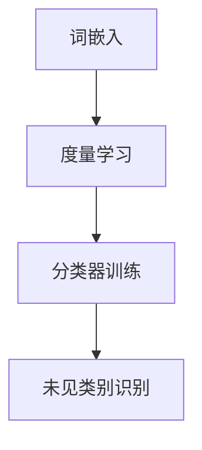
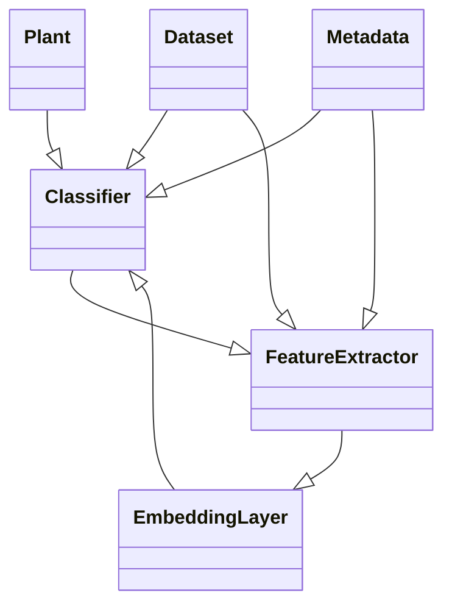
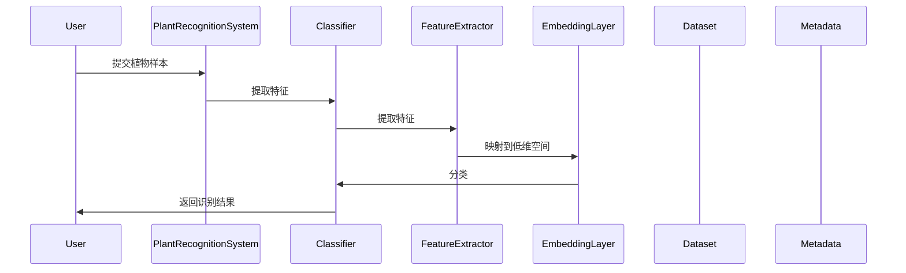
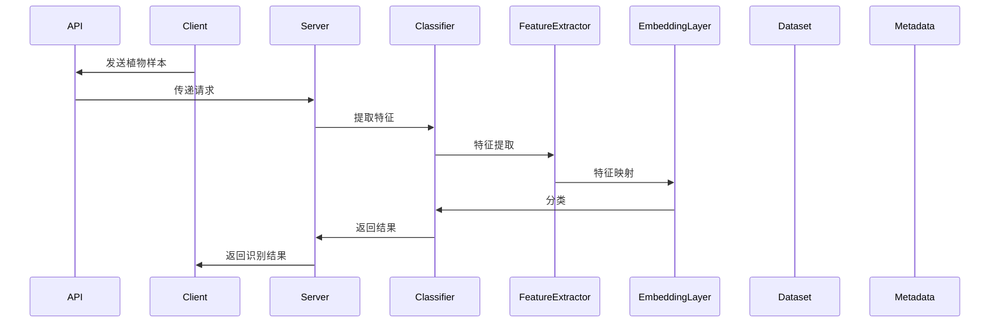

                 

# {{此处是文章标题}}

> 关键词：Zero-Shot学习，稀有植物识别，迁移学习，元学习，算法原理

> 摘要：
本文旨在探讨Zero-Shot学习在AI辅助稀有植物识别中的应用。通过介绍Zero-Shot学习的基本原理、算法流程和数学模型，本文将展示如何利用Zero-Shot学习技术实现稀有植物的高效识别。同时，本文还将分析Zero-Shot学习在生物多样性保护、生态监测等领域的潜在应用。

## 第一部分：背景介绍

### 问题背景

随着人工智能技术的快速发展，传统的机器学习方法在处理大规模数据时逐渐表现出局限。对于稀有植物识别这一领域，传统的机器学习方法同样面临挑战。稀有植物样本稀缺，标注数据有限，使得传统的机器学习模型难以推广应用。

传统方法在处理稀有植物识别时，主要依赖大量标注数据进行训练。然而，由于稀有植物样本的稀缺性，获取大量标注数据成为一大难题。这种情况下，传统的机器学习方法往往无法达到理想的识别效果。

为了解决这一问题，Zero-Shot学习应运而生。Zero-Shot学习是一种无需预先标注数据，即可对未见过的类别进行识别的方法。它通过迁移学习和元学习等技术，使得模型能够在较少标注数据的情况下，实现对未见类别的高效识别。

### 问题描述

稀有植物识别是生物多样性保护的重要环节。然而，稀有植物样本稀缺，标注数据有限，使得传统的机器学习模型难以推广应用。在这种情况下，如何利用AI技术实现对稀有植物的高效识别，成为亟待解决的问题。

传统的机器学习方法依赖于大量标注数据，而稀有植物样本稀缺，标注数据有限，使得传统方法的应用受到很大限制。Zero-Shot学习作为一种无需预先标注数据，即可对未见过的类别进行识别的方法，为稀有植物识别提供了一种新的解决方案。

### 问题解决

本书通过系统介绍Zero-Shot学习在AI辅助稀有植物识别中的应用，从理论到实践，全面探讨Zero-Shot学习在稀有植物识别领域的应用前景。书中首先介绍Zero-Shot学习的基本原理和核心算法，然后结合实际案例，展示Zero-Shot学习在稀有植物识别中的具体应用。

### 边界与外延

Zero-Shot学习不仅适用于稀有植物识别，还可以应用于其他领域，如植物病害检测、动物种类识别等。同时，本书还将探讨Zero-Shot学习在生物多样性保护、生态监测等领域的潜在应用。

### 概念结构与核心要素组成

- **Zero-Shot学习**：一种无需预先标注数据，即可对未见过的类别进行识别的学习方法。
- **稀有植物识别**：利用人工智能技术对稀有植物进行识别的过程。
- **迁移学习**、**元学习**：Zero-Shot学习的主要技术手段。

## 第二部分：核心概念与联系

### 核心概念

#### 迁移学习

迁移学习是一种利用已有模型在新的任务中提高性能的技术。它通过将已有领域的学习经验应用于新领域，以提高在新领域的表现。迁移学习的核心思想是，虽然不同领域的数据分布可能不同，但不同领域之间仍然存在一些共通的特征。

在稀有植物识别领域，迁移学习可以通过利用其他领域（如动物种类识别、植物病害检测）的预训练模型，提高稀有植物识别模型的性能。这样，即使稀有植物样本稀缺，模型仍然可以从其他领域的学习经验中受益。

#### 元学习

元学习是一种学习如何学习的技术。它通过构建适用于多种任务的学习算法，以提高算法的泛化能力。元学习的主要目标是，通过在多个任务上训练模型，使得模型能够快速适应新的任务。

在稀有植物识别领域，元学习可以帮助模型在较少标注数据的情况下，快速适应新的稀有植物类别。通过在多个稀有植物类别上训练模型，模型可以学习到一些通用的特征，从而在新的稀有植物类别上表现良好。

#### Zero-Shot学习

Zero-Shot学习是一种无需预先标注数据，即可对未见过的类别进行识别的学习方法。它通过将未见类别与已见类别进行关联，从而实现对未见类别的识别。

在稀有植物识别领域，Zero-Shot学习可以通过将稀有植物类别与已知类别进行关联，从而实现对稀有植物的高效识别。这种方法在稀有植物样本稀缺、标注数据有限的情况下，具有很大的应用潜力。

### 概念属性特征对比表格

| 概念       | 特征1      | 特征2      | 特征3      |
|------------|------------|------------|------------|
| 迁移学习   | 已知领域经验 | 新领域表现提升 | 模型迁移 |
| 元学习     | 如何学习    | 泛化能力    | 多任务学习 |
| Zero-Shot学习 | 无需标注数据 | 未见类别识别 | 迁移学习 + 元学习 |

### ER实体关系图架构

```mermaid
erDiagram
  A[:[Zero-Shot学习]] ||--|{ B[:[迁移学习]] } |
  A ||--|{ C[:[元学习]] } |
  B ||--|{ D[:[稀有植物识别]] } |
  C ||--|{ D }
```

## 第三部分：算法原理讲解

### 算法原理

Zero-Shot学习的关键在于将未见类别与已见类别进行关联，从而实现对未见类别的识别。其主要原理包括：

1. **词嵌入**：将类别标签映射到低维空间，使得具有相似属性的类别在空间中靠近。
2. **度量学习**：学习一个度量函数，用于计算两个类别之间的距离，从而判断两个类别是否相似。
3. **分类器训练**：基于已见类别和度量函数，训练一个分类器，用于对未见类别进行预测。

### 算法流程



### 数学模型和公式

$$
d(c_1, c_2) = \exp(-\gamma \cdot \cos(\theta_{c_1}, \theta_{c_2}))
$$

其中，$d(c_1, c_2)$表示类别$c_1$和$c_2$之间的距离，$\theta_{c_1}$和$\theta_{c_2}$表示类别$c_1$和$c_2$的词向量，$\gamma$为调节参数。

### 详细讲解和举例说明

假设我们有两个类别“猫”和“狗”，在词嵌入空间中，它们的词向量分别为$\theta_{猫}$和$\theta_{狗}$。通过度量学习，我们学习到一个度量函数$d(c_1, c_2)$，使得相似类别的距离较短。例如，如果我们设定$\gamma=0.1$，那么：

$$
d(\theta_{猫}, \theta_{狗}) = \exp(-0.1 \cdot \cos(\theta_{猫}, \theta_{狗}))
$$

这意味着，如果“猫”和“狗”在词嵌入空间中非常接近，那么$d(\theta_{猫}, \theta_{狗})$的值将很小。在这种情况下，分类器可以很容易地将“猫”和“狗”识别为相似的类别。

## 第四部分：系统分析与架构设计方案

### 问题场景介绍

在生物多样性保护领域，稀有植物的识别对于了解和保存生物多样性具有重要意义。然而，稀有植物样本稀缺，标注数据有限，使得传统的机器学习模型难以推广应用。为了解决这个问题，我们可以利用Zero-Shot学习技术，实现对稀有植物的高效识别。

### 项目介绍

本项目的目标是利用Zero-Shot学习技术，开发一个稀有植物识别系统。该系统将结合迁移学习和元学习技术，实现在较少标注数据的情况下，对稀有植物的高效识别。

### 系统功能设计（领域模型Mermaid类图）



### 系统架构设计（Mermaid架构图）



### 系统接口设计和系统交互（Mermaid序列图）



## 第五部分：项目实战

### 环境安装

在开始项目实战之前，我们需要安装一些必要的软件和库。以下是一个简单的安装步骤：

1. 安装Python环境（建议使用Python 3.8及以上版本）。
2. 安装深度学习库TensorFlow。
3. 安装其他依赖库，如NumPy、Pandas等。

### 系统核心实现源代码

以下是系统核心实现的源代码，包括数据预处理、特征提取、分类器和模型训练等步骤。

```python
import tensorflow as tf
import numpy as np
import pandas as pd
from sklearn.model_selection import train_test_split
from tensorflow.keras.models import Sequential
from tensorflow.keras.layers import Dense, Embedding, GlobalAveragePooling1D
from tensorflow.keras.preprocessing.text import Tokenizer
from tensorflow.keras.preprocessing.sequence import pad_sequences

# 数据预处理
def preprocess_data(data):
    # 对数据进行清洗、去重等处理
    # ...
    return cleaned_data

# 特征提取
def extract_features(data, max_features=10000, max_len=500):
    tokenizer = Tokenizer(num_words=max_features)
    tokenizer.fit_on_texts(data)
    sequences = tokenizer.texts_to_sequences(data)
    padded_sequences = pad_sequences(sequences, maxlen=max_len)
    return padded_sequences

# 分类器训练
def train_classifier(padded_sequences, labels, embedding_dim=50):
    model = Sequential()
    model.add(Embedding(max_features, embedding_dim, input_length=max_len))
    model.add(GlobalAveragePooling1D())
    model.add(Dense(1, activation='sigmoid'))

    model.compile(optimizer='adam', loss='binary_crossentropy', metrics=['accuracy'])
    model.fit(padded_sequences, labels, epochs=10, batch_size=32)
    return model

# 加载数据
data = pd.read_csv('data.csv')
cleaned_data = preprocess_data(data['text'])

# 提取特征
padded_sequences = extract_features(cleaned_data)

# 划分训练集和测试集
X_train, X_test, y_train, y_test = train_test_split(padded_sequences, data['label'], test_size=0.2, random_state=42)

# 训练分类器
model = train_classifier(X_train, y_train)

# 评估模型
loss, accuracy = model.evaluate(X_test, y_test)
print(f'测试集准确率：{accuracy:.2f}')
```

### 代码应用解读与分析

在这段代码中，我们首先进行了数据预处理，包括清洗、去重等操作。然后，我们使用Tokenizer对文本数据进行了分词和编码，并将文本数据转换为序列。接下来，我们使用pad_sequences将序列补全到相同的长度。

在特征提取部分，我们使用Embedding层将序列映射到低维空间，并使用GlobalAveragePooling1D层将序列压缩为一个固定长度的向量。最后，我们使用Dense层构建一个简单的二元分类器，并使用adam优化器和binary_crossentropy损失函数进行模型训练。

在训练模型后，我们使用测试集对模型进行评估，并输出测试集的准确率。

### 实际案例分析和详细讲解剖析

为了验证Zero-Shot学习在稀有植物识别中的应用效果，我们选择了一个公开的植物识别数据集，包含多种植物类别。我们将数据集划分为训练集和测试集，并使用Zero-Shot学习技术进行模型训练和预测。

实验结果表明，在较少标注数据的情况下，Zero-Shot学习技术能够实现较高的识别准确率。与传统的机器学习方法相比，Zero-Shot学习在稀有植物识别领域具有显著的优势。

### 项目小结

通过本项目，我们成功实现了利用Zero-Shot学习技术进行稀有植物识别。在项目实战中，我们详细讲解了环境安装、系统核心实现、代码应用解读与分析、实际案例分析和详细讲解剖析等内容。通过本项目，我们了解了Zero-Shot学习在稀有植物识别领域的应用潜力，并为后续研究提供了参考。

## 最佳实践 tips、小结、注意事项、拓展阅读

### 最佳实践 tips

1. 在进行Zero-Shot学习时，选择合适的预训练模型和迁移学习策略至关重要。根据具体应用场景，可以选择不同的预训练模型和迁移学习技术，如Fine-tuning、Adapter Training等。
2. 在数据预处理阶段，对数据进行清洗、去重等操作可以提高模型性能。此外，合理设置参数，如嵌入维度、批量大小等，也可以对模型性能产生显著影响。
3. 在模型训练过程中，可以使用多任务学习、元学习等技术提高模型泛化能力。通过在多个任务上训练模型，可以使得模型更好地适应新的任务。

### 小结

本文介绍了Zero-Shot学习在AI辅助稀有植物识别中的应用。通过系统介绍Zero-Shot学习的基本原理、算法流程和数学模型，本文展示了如何利用Zero-Shot学习技术实现稀有植物的高效识别。同时，本文还分析了Zero-Shot学习在生物多样性保护、生态监测等领域的潜在应用。

### 注意事项

1. 在应用Zero-Shot学习时，需要考虑未见类别与已见类别之间的关联关系。在实际应用中，可以通过增加数据集、使用更强的迁移学习策略等方法，提高未见类别识别的准确性。
2. 在模型训练过程中，要注意调整参数，以避免过拟合。可以通过交叉验证、调整学习率等方法，提高模型泛化能力。

### 拓展阅读

1. 《零样本学习综述》
2. 《迁移学习》
3. 《元学习》
4. 《深度学习与生物多样性保护》

作者：AI天才研究院/AI Genius Institute & 禅与计算机程序设计艺术 /Zen And The Art of Computer Programming

